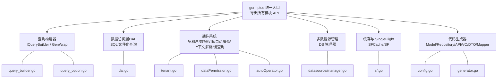
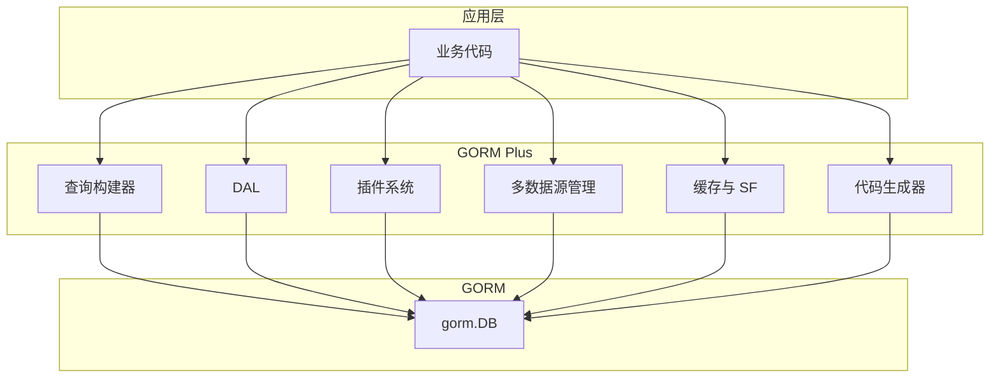
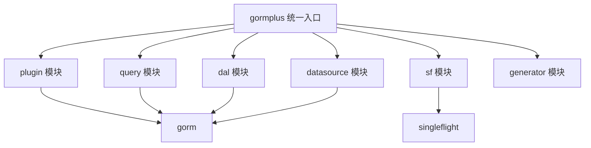

# API 参考

<cite>
**本文引用的文件**
- [gormplus.go](file://gormplus.go)
- [version.go](file://version.go)
- [query_builder.go](file://query/query_builder.go)
- [query_option.go](file://query/query_option.go)
- [dal.go](file://dal/dal.go)
- [sf.go](file://sf/sf.go)
- [tenant.go](file://plugin/tenant.go)
- [dataPermission.go](file://plugin/dataPermission.go)
- [autoOperator.go](file://plugin/autoOperator.go)
- [manager.go](file://datasource/manager.go)
- [config.go](file://generator/config.go)
- [generator.go](file://generator/generator.go)
- [README.md](file://README.md)
</cite>

## 目录
1. [简介](#简介)
2. [项目结构](#项目结构)
3. [核心组件](#核心组件)
4. [架构总览](#架构总览)
5. [详细组件分析](#详细组件分析)
6. [依赖分析](#依赖分析)
7. [性能考虑](#性能考虑)
8. [故障排查指南](#故障排查指南)
9. [结论](#结论)
10. [附录](#附录)

## 简介
本文件为 GORM Plus 的完整 API 参考，涵盖查询构建器、数据访问层、插件系统、多数据源管理、缓存与 SingleFlight、以及代码生成器等模块。内容按功能模块组织，提供接口说明、参数与返回值、使用示例、参数校验与错误处理、版本兼容性与废弃策略、最佳实践与性能建议，并确保与实际代码实现保持同步。

## 项目结构
GORM Plus 以统一入口导出各子模块能力，核心模块包括：
- 查询构建器：原生 gorm 链式条件构造器与 gorm-gen 类型安全扩展
- 数据访问层（DAL）：SQL 文件化查询，支持 embed、泛型、分页、Hook、缓存与清理
- 插件系统：多租户、数据权限、自动填充、上下文解析器、慢查询监控
- 多数据源管理：任意驱动、主从/读写分离、上下文自动切换
- 缓存与 SingleFlight：可插拔缓存、防缓存击穿、主动失效
- 代码生成器：Model/Repository/API/VO/DTO/Mapper 一键生成

**图表来源**
- [gormplus.go](file://gormplus.go)
- [query_builder.go](file://query/query_builder.go)
- [query_option.go](file://query/query_option.go)
- [dal.go](file://dal/dal.go)
- [tenant.go](file://plugin/tenant.go)
- [dataPermission.go](file://plugin/dataPermission.go)
- [autoOperator.go](file://plugin/autoOperator.go)
- [manager.go](file://datasource/manager.go)
- [sf.go](file://sf/sf.go)
- [config.go](file://generator/config.go)
- [generator.go](file://generator/generator.go)

**章节来源**
- [gormplus.go](file://gormplus.go)
- [README.md](file://README.md)

## 核心组件
- 统一入口导出：通过 gormplus 包统一导入即可使用全部能力，无需逐个子包引入
- 版本常量：Version 提供当前版本号，便于诊断与兼容性判断
- 初始化顺序建议：ctx 解析器 → 多数据源 → DB 打开 → 插件注册 → 缓存/慢查询 → 优雅退出

**章节来源**
- [gormplus.go](file://gormplus.go)
- [version.go](file://version.go)
- [README.md](file://README.md)

## 架构总览
GORM Plus 通过统一入口聚合各模块，插件系统在 gorm Callback 阶段注入安全与治理能力；多数据源管理器在运行时根据上下文自动选择读写节点；缓存与 SingleFlight 提供并发合并与结果缓存；代码生成器与 DAL 提升开发效率与可维护性。

**图表来源**
- [gormplus.go](file://gormplus.go)
- [query_builder.go](file://query/query_builder.go)
- [dal.go](file://dal/dal.go)
- [tenant.go](file://plugin/tenant.go)
- [dataPermission.go](file://plugin/dataPermission.go)
- [autoOperator.go](file://plugin/autoOperator.go)
- [manager.go](file://datasource/manager.go)
- [sf.go](file://sf/sf.go)
- [generator.go](file://generator/generator.go)

## 详细组件分析

### 查询构建器 API
- IQueryBuilder：原生 gorm 扩展条件构造器，链式拼装后 Build() 返回原生 *gorm.DB
- 常用方法
  - Like / LLike / RLike：模糊查询，空值自动跳过
  - BetweenIfNotZero：范围查询，任一零值跳过
  - WhereIf：条件成立时追加 AND
  - WhereGroup / OrGroup：括号分组，支持函数式分组
  - Build：返回原生 *gorm.DB，继续使用 Find/Count/Joins/Select/Order/Limit 等
- 泛型分页
  - FindByPage：Find + Count，适合直接映射到 model 的列表
  - ScanByPage：Scan + Count，适合联表/自定义字段映射到 VO

参数与返回
- IQueryBuilder 方法均返回 IQueryBuilder，支持链式调用
- Build 返回 *gorm.DB
- FindByPage/ScanByPage 返回 (列表, 总数, error)，pageNum/pageSize 会做边界修正（<1 时按默认值处理）

使用示例
- 基础链式条件与 Build
- 条件分组（AND/OR）
- 泛型分页（FindByPage/ScanByPage）

错误处理
- WhereIf/WhereGroup/OrGroup 等在条件为空或分组为空时自动跳过，避免无效条件
- Build 后的 gorm 原生错误通过 error 返回

性能建议
- 合理使用 BetweenIfNotZero 与 WhereIf，减少无效条件
- 联表查询优先使用 Build 后的原生方法，避免重复解析

**章节来源**
- [query_builder.go](file://query/query_builder.go)
- [query_option.go](file://query/query_option.go)

### gorm-gen 类型安全链式构造器 API
- IGenWrapper：gorm-gen 扩展条件构建器接口，链式调用后 Apply() 返回原生 DO
- 常用方法
  - As：设置表别名
  - RawWhere/RawOrWhere/RawWhereIf：原生 SQL 条件
  - WhereGroup/WhereGroupFn/OrGroupFn：AND/OR 分组
  - Apply：返回原生 DO，继续使用 Find/Updates/Select 等
- RawField：原生字段包装，用于 SELECT/Where 等原生 SQL 拼接

参数与返回
- IGenWrapper 方法返回 IGenWrapper，支持链式调用
- Apply 返回原生 DO

使用示例
- 基础查询与联表查询
- 函数式分组与原生 SQL 条件
- 与 Query 构造器配合使用

错误处理
- Apply 前的链式条件错误会在 Apply 后的原生 DO 上体现

**章节来源**
- [query_builder.go](file://query/query_builder.go)

### 数据访问层（DAL）API
- 核心能力
  - SQL 文件化管理，支持位置参数（?）与命名参数（@name）
  - 泛型查询（Query/QueryOne/QueryNamed/QueryOneNamed）
  - 分页查询（QueryPage/QueryPageNamed），count SQL 自动推导
  - 事务支持、Debug/Hook、SQL 缓存、SingleFlight 防击穿、定时缓存清理
  - 多数据源支持，通过 WithDB 注入 context 切换
- 初始化
  - NewDal：创建并设置默认全局实例，返回句柄用于 Close
  - NewWithProvider：自定义 DBProvider，支持读写分离/多租户
  - WithDebug/WithHook/WithCacheCleanup：选项配置
- 查询与执行
  - Query/QueryOne：位置参数
  - QueryNamed/QueryOneNamed：命名参数
  - QueryPage/QueryPageNamed：分页（count 自动推导）
  - Exec/ExecAffected：执行 INSERT/UPDATE/DELETE
  - Count：查询数量
  - Preload：预热 SQL 缓存
  - WithDB：多数据源注入
- 生命周期
  - Close：停止后台缓存清理 goroutine

参数与返回
- Query/QueryOne/QueryNamed/QueryOneNamed：返回泛型切片/指针与 error
- QueryPage/QueryPageNamed：返回分页结果与 error
- Exec/ExecAffected：返回执行结果与 error
- Count：返回总数与 error
- Preload：返回 error

使用示例
- 单数据源初始化与查询
- 多数据源场景 WithDB 注入
- 命名参数与分页查询
- Hook 与 Debug

错误处理
- NewDal/NewWithProvider：db/loader 不能为空
- resolve：未初始化时 panic
- Debug 模式下返回零行会打印警告

性能建议
- 开启 WithCacheCleanup 防止内存无限增长
- 使用 QueryPage 自动推导 count SQL，减少重复 SQL

**章节来源**
- [dal.go](file://dal/dal.go)

### 插件 API

#### 上下文解析器
- RegisterCtxResolver：注册自定义 ctx 解析器，解决 gin 项目直接传 *gin.Context 时插件无法读取 Request.Context 的问题
- 业务代码可直接传 *gin.Context，无需手动 c.Request.Context()

参数与返回
- 函数签名：RegisterCtxResolver(func(context.Context) context.Context)
- 返回：无

使用示例
- gin 项目注册解析器
- go-zero/fiber 无需注册

**章节来源**
- [gormplus.go](file://gormplus.go)

#### 多租户插件
- 配置
  - TenantConfig[T]：租户配置，支持单字段、多字段、按表覆盖
  - TenantFieldConfig[T]/JoinTenantConfig[T]：字段与联表覆盖
  - InjectMode/DuplicateTenantPolicy：注入方式与重复条件策略
  - AllowGlobalUpdate/AllowGlobalDelete/AllowOverrideTenantID：安全策略
- 注册与实例
  - RegisterTenant：注册插件（db.Use）
  - NewTenantPlugin：工厂函数返回插件实例
- 运行时控制
  - WithTenantID/TenantIDFromCtx：写入/读取租户 ID
  - SkipTenant/AllowGlobalOperation/WithOverrideTenantID：特权与覆盖
  - AddExcludeTable/RemoveExcludeTable/ExcludedTables：动态排除表
- 安全检查
  - 重复条件策略（跳过/替换/追加）
  - OR 危险条件自动拒绝
  - 禁止无业务条件的全表 Update/Delete

参数与返回
- RegisterTenant/NewTenantPlugin：返回 error
- WithTenantID/TenantIDFromCtx：写入/读取上下文中的租户 ID
- AddExcludeTable/RemoveExcludeTable/ExcludedTables：返回 error

使用示例
- 单字段/多字段/按表覆盖
- 联表自动注入与别名识别
- 超管跳过与覆盖租户 ID
- 动态排除表

**章节来源**
- [tenant.go](file://plugin/tenant.go)
- [gormplus.go](file://gormplus.go)

#### 数据权限插件
- 配置
  - DataPermissionConfig：注入方式、排除表
- 注册与实例
  - RegisterDataPermission/NewDataPermissionPlugin：注册插件
- 运行时控制
  - WithDataPermission/DataPermissionFromCtx：写入/读取注入函数
  - SkipDataPermission：跳过数据权限过滤
  - AddDataPermissionExcludeTable/RemoveDataPermissionExcludeTable/DataPermissionExcludedTables：动态排除表

参数与返回
- RegisterDataPermission/NewDataPermissionPlugin：返回 error
- WithDataPermission/DataPermissionFromCtx：写入/读取注入函数
- Add/Remove/ExcludedTables：返回 error

使用示例
- 中间件注入数据权限条件
- 超管跳过
- 动态排除表

**章节来源**
- [dataPermission.go](file://plugin/dataPermission.go)
- [gormplus.go](file://gormplus.go)

#### 自动填充插件
- 配置
  - AutoFillConfig：字段配置数组
  - FieldConfig：字段名、Getter、OnCreate/OnUpdate
  - FieldGetter：从上下文获取字段值的函数
  - CtxContextKey1..10：内置 context key 常量
- 注册与实例
  - NewAutoFillPlugin：创建插件实例
- 运行时控制
  - CtxGetter/OperatorGetter：Getter 工厂
  - 支持 Create/Update/UpdateColumn/Simple 等路径

参数与返回
- NewAutoFillPlugin：返回插件实例
- CtxGetter/OperatorGetter：返回 FieldGetter

使用示例
- 操作人 ID/姓名自动填充
- 多字段混合（操作人+租户+自定义）

**章节来源**
- [autoOperator.go](file://plugin/autoOperator.go)
- [gormplus.go](file://gormplus.go)

### 多数据源管理 API
- 管理器
  - DataSourceManager：类型别名
  - GroupConfig/NodeConfig/PoolConfig：数据源组/节点/连接池配置
  - DefaultPool：默认连接池配置
- 全局管理器
  - DS：全局多数据源管理器
  - NewDataSourceManager：创建独立管理器
  - DSWithName/DSNameFrom/DSWithRead/DSWithWrite/DSIsRead/DSIsWrite：上下文标记与读取
- 注册与使用
  - Register：注册数据源组（支持 MySQL/PostgreSQL/SQLite 等任意 gorm 驱动）
  - Auto/Read/Write：根据上下文自动选择或显式指定
  - Ping：健康检查

参数与返回
- Register：返回 error
- Auto/Read/Write：返回 *gorm.DB 与 error
- Ping：返回 map[string]error

使用示例
- 注册 MySQL/PostgreSQL/SQLite 数据源
- 中间件标记读写
- Repository 层获取 DB（读走从库，写走主库）

**章节来源**
- [manager.go](file://datasource/manager.go)
- [gormplus.go](file://gormplus.go)

### 缓存与 SingleFlight API
- 缓存接口
  - SFCache：Get/Set/Del
  - RegisterCache：注册自定义缓存（必须在第一次调用 SF 之前）
  - DefaultSFTTL：默认缓存时长（5 分钟）
- 内置缓存
  - MemoryCache：默认内存缓存，支持 NewMemoryCache 与 StopSFCache
- 查询封装
  - SF：通用封装（可选 TTL，默认使用 DefaultSFTTL；传 0 等价于 SFNoCache）
  - SFNoCache：纯 singleflight，不缓存
  - SFWithTTL：底层实现，手动指定 TTL
  - SFInvalidate：主动失效缓存

参数与返回
- RegisterCache：无返回
- SF/SFNoCache/SFWithTTL：返回查询结果与 error
- SFInvalidate：无返回

使用示例
- 内存缓存（默认）
- Redis 缓存（实现 SFCache 接口后注册）
- 写操作后主动失效

**章节来源**
- [sf.go](file://sf/sf.go)
- [gormplus.go](file://gormplus.go)

### 代码生成器 API
- 配置
  - Config：数据库与输出路径配置（DBType/Host/Port/Username/Password/Database/OutPath/ModelPkgPath/RepoPath/ApiPath/VoPath/DtoPath/MapperPath/Package）
  - LoadConfig：从 YAML 加载配置
- 生成流程
  - Generate：根据配置生成 Model/Repository/API/VO/DTO/Mapper
  - 支持交互式输入表名，或直接回车生成所有表的 Model
  - Model 每次重新生成覆盖；其他文件已存在时跳过

参数与返回
- LoadConfig：返回 *Config 与 error
- Generate：返回 error

使用示例
- 生成配置 YAML
- 生成指定表或全部表的代码

**章节来源**
- [config.go](file://generator/config.go)
- [generator.go](file://generator/generator.go)

## 依赖分析
- 组件耦合
  - gormplus 统一入口聚合各模块，低耦合高内聚
  - 插件系统通过 gorm Callback 注入，与业务代码零侵入
  - 多数据源管理器通过上下文自动切换，对调用方透明
  - 缓存与 SF 与具体存储解耦，可通过 RegisterCache 注入任意实现
- 外部依赖
  - gorm.io/gorm、gorm.io/gen、golang.org/x/sync/singleflight
  - gorm 驱动（MySQL/PostgreSQL/SQLite 等）

**图表来源**
- [gormplus.go](file://gormplus.go)
- [query_builder.go](file://query/query_builder.go)
- [dal.go](file://dal/dal.go)
- [tenant.go](file://plugin/tenant.go)
- [dataPermission.go](file://plugin/dataPermission.go)
- [autoOperator.go](file://plugin/autoOperator.go)
- [manager.go](file://datasource/manager.go)
- [sf.go](file://sf/sf.go)
- [generator.go](file://generator/generator.go)

**章节来源**
- [gormplus.go](file://gormplus.go)

## 性能考虑
- 查询构建器
  - 使用 BetweenIfNotZero/WhereIf 避免无效条件
  - 联表查询尽量在 Build 后使用原生方法，减少解析成本
- DAL
  - 开启 WithCacheCleanup，定期清理 SQL 缓存，防止内存增长
  - QueryPage 自动推导 count SQL，减少重复 SQL
- 缓存与 SF
  - 列表/统计：3s~30s；配置/字典：1min~5min；详情/实时：0（SFNoCache）
  - 注册自定义缓存（Redis）以支持多实例部署
- 多数据源
  - 中间件标记读写，GET 走从库，其他走主库
  - Auto 根据上下文自动选择，避免手动判断

[本节为通用指导，无需“章节来源”]

## 故障排查指南
- 未初始化
  - dal：调用包级函数前未调用 NewDal，resolve 会 panic
  - SF：RegisterCache 必须在第一次调用 SF 之前
- 参数校验
  - NewDal/NewWithProvider：db/loader 不能为空
  - Query/QueryOne/QueryNamed/QueryOneNamed：返回零行时 Debug 模式打印警告
- 错误处理
  - Query/QueryOne/QueryNamed/QueryOneNamed/QueryPage/Exec/ExecAffected/Count：返回 error
  - 多租户/数据权限插件：重复条件策略与 OR 危险条件会拒绝执行并返回错误
- 优雅退出
  - StopSFCache：停止内置内存缓存后台清理 goroutine
  - DS.Close：关闭多数据源连接池

**章节来源**
- [dal.go](file://dal/dal.go)
- [sf.go](file://sf/sf.go)
- [tenant.go](file://plugin/tenant.go)
- [dataPermission.go](file://plugin/dataPermission.go)

## 结论
GORM Plus 通过统一入口与模块化设计，提供了从查询构建、数据访问、插件治理、多数据源、缓存与 SF、到代码生成的完整能力矩阵。遵循本文档的 API 使用规范、参数校验与错误处理建议、性能优化与最佳实践，可在保证安全与可维护性的前提下显著提升开发效率与系统性能。

[本节为总结，无需“章节来源”]

## 附录

### 版本兼容性与废弃策略
- 版本常量：Version 提供当前版本号，便于诊断与兼容性判断
- 兼容性建议
  - 插件注入方式（ModeScopes/ModeWhere）与重复条件策略（PolicySkip/PolicyReplace/PolicyAppend）保留兼容旧配置
  - SF 默认 TTL 与 SFNoCache 的行为保持稳定
  - 代码生成器输出路径与模板可自定义，避免覆盖已有自定义代码

**章节来源**
- [version.go](file://version.go)
- [tenant.go](file://plugin/tenant.go)
- [sf.go](file://sf/sf.go)
- [generator.go](file://generator/generator.go)

### API 使用最佳实践
- 查询构建器
  - 优先使用 WhereIf/WhereGroup/OrGroup 组织条件，避免手写 if 判断
  - 联表查询使用 Build 后的原生方法
- DAL
  - 开启 Debug 仅限开发/测试环境
  - 使用 WithCacheCleanup 定期清理 SQL 缓存
  - QueryPage 自动推导 count SQL，减少重复 SQL
- 插件
  - 多租户与数据权限插件注册一次即可，业务代码零改动
  - 超管场景谨慎使用 SkipTenant/AllowGlobalOperation
- 多数据源
  - 中间件统一标记读写，避免在业务层分散判断
  - Auto 根据上下文自动选择，简化 Repository 层获取 DB 的逻辑
- 缓存与 SF
  - 根据场景选择 TTL，详情/实时使用 SFNoCache
  - 写操作后主动调用 SFInvalidate 保证一致性
- 代码生成器
  - 生成 Model 时注意覆盖策略，其他文件已存在时跳过
  - 通过 YAML 配置输出路径，保持项目结构清晰

**章节来源**
- [query_builder.go](file://query/query_builder.go)
- [dal.go](file://dal/dal.go)
- [tenant.go](file://plugin/tenant.go)
- [dataPermission.go](file://plugin/dataPermission.go)
- [manager.go](file://datasource/manager.go)
- [sf.go](file://sf/sf.go)
- [generator.go](file://generator/generator.go)