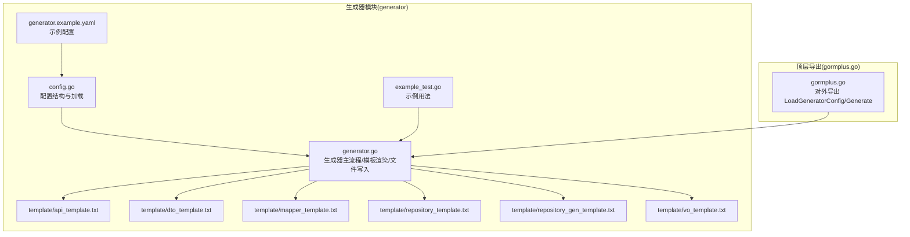
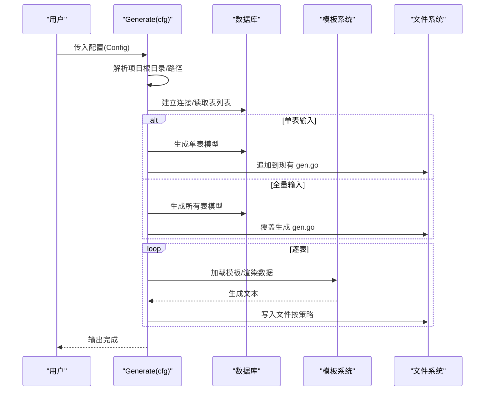
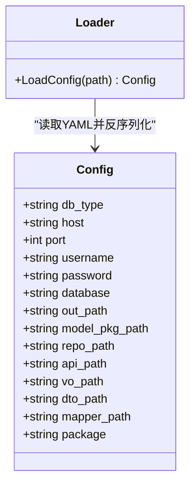
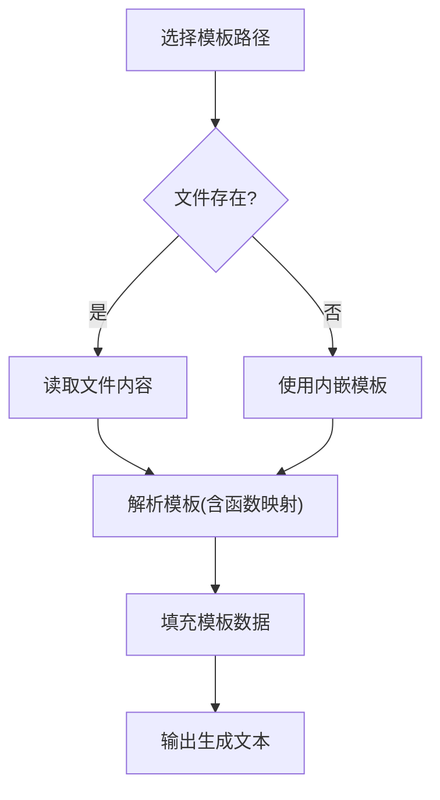
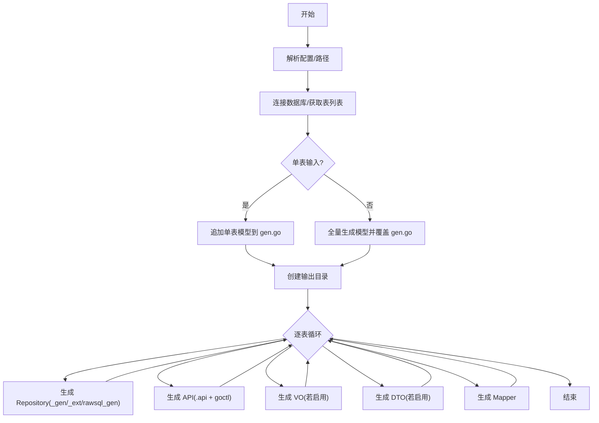
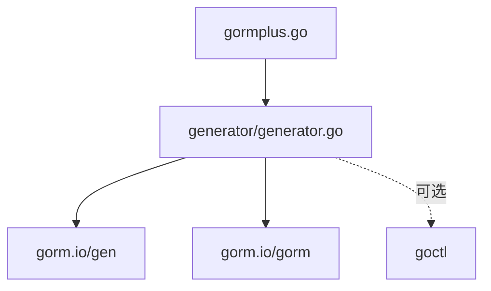

# 代码生成器 API

<cite>
**本文引用的文件**
- [generator.go](file://generator/generator.go)
- [config.go](file://generator/config.go)
- [generator.example.yaml](file://generator/generator.example.yaml)
- [example_test.go](file://generator/example_test.go)
- [api_template.txt](file://generator/template/api_template.txt)
- [dto_template.txt](file://generator/template/dto_template.txt)
- [mapper_template.txt](file://generator/template/mapper_template.txt)
- [repository_template.txt](file://generator/template/repository_template.txt)
- [repository_gen_template.txt](file://generator/template/repository_gen_template.txt)
- [vo_template.txt](file://generator/template/vo_template.txt)
- [gormplus.go](file://gormplus.go)
- [README.md](file://README.md)
</cite>

## 目录
1. [简介](#简介)
2. [项目结构](#项目结构)
3. [核心组件](#核心组件)
4. [架构总览](#架构总览)
5. [详细组件分析](#详细组件分析)
6. [依赖分析](#依赖分析)
7. [性能考虑](#性能考虑)
8. [故障排查指南](#故障排查指南)
9. [结论](#结论)
10. [附录](#附录)

## 简介
本文件为 gorm-plus 代码生成器模块的详细 API 参考文档，面向需要自动化生成 Model、Repository、API、VO、DTO 与 Mapper 的开发者。文档覆盖以下主题：
- 配置结构与加载方式
- 模板系统与渲染机制
- 生成流程与规则
- 各产物生成接口说明
- 模板定制与最佳实践
- 质量保证与维护策略

## 项目结构
代码生成器位于 generator 目录，核心文件包括：
- 配置定义与加载：config.go
- 生成器主流程：generator.go
- 示例配置与示例用法：generator.example.yaml、example_test.go
- 模板文件：template/*.txt
- 顶层导出：gormplus.go（对外暴露 LoadGeneratorConfig 与 Generate）

**图表来源**
- [generator.go:1038-1259](file://generator/generator.go#L1038-L1259)
- [config.go:10-46](file://generator/config.go#L10-L46)
- [api_template.txt:1-93](file://generator/template/api_template.txt#L1-L93)
- [dto_template.txt:1-20](file://generator/template/dto_template.txt#L1-L20)
- [mapper_template.txt:1-82](file://generator/template/mapper_template.txt#L1-L82)
- [repository_template.txt:1-28](file://generator/template/repository_template.txt#L1-L28)
- [repository_gen_template.txt:1-346](file://generator/template/repository_gen_template.txt#L1-L346)
- [vo_template.txt:1-10](file://generator/template/vo_template.txt#L1-L10)
- [example_test.go:7-35](file://generator/example_test.go#L7-L35)
- [generator.example.yaml:1-17](file://generator/generator.example.yaml#L1-L17)
- [gormplus.go:882-897](file://gormplus.go#L882-L897)

**章节来源**
- [generator.go:1038-1259](file://generator/generator.go#L1038-L1259)
- [config.go:10-46](file://generator/config.go#L10-L46)
- [gormplus.go:882-897](file://gormplus.go#L882-L897)

## 核心组件
- 配置结构 Config
  - 字段：数据库连接参数、各产物输出路径、项目包名
  - 加载：从 YAML 文件读取并反序列化
- 生成器主流程 Generate
  - 解析项目根目录与相对路径
  - 连接数据库，读取表列表
  - 生成 Model（gorm-gen）
  - 逐表生成 Repository、API、VO、DTO、Mapper
- 模板系统
  - 内嵌模板与文件系统模板优先级
  - 模板数据结构：ColumnInfo、ApiTemplateData、VoTemplateData、RepositoryTemplateData、MapperTemplateData
  - 渲染函数：loadTemplate、renderMapperTemplate
- 文件写入策略
  - 模型文件始终覆盖
  - 业务文件（Repository/VO/DTO/API/Mapper）若存在则跳过

**章节来源**
- [config.go:10-46](file://generator/config.go#L10-L46)
- [generator.go:37-68](file://generator/generator.go#L37-L68)
- [generator.go:322-340](file://generator/generator.go#L322-L340)
- [generator.go:836-959](file://generator/generator.go#L836-L959)
- [generator.go:814-834](file://generator/generator.go#L814-L834)

## 架构总览
生成器整体流程分为两阶段：
- 第一阶段：Model 生成（覆盖）
  - 单表追加：仅追加新增表的模型定义
  - 全量同步：生成所有表的模型定义
- 第二阶段：业务产物生成（按需跳过）
  - Repository（基础与扩展）、API（.api 文件并触发 goctl 生成 go-zero 代码）、VO、DTO、Mapper

**图表来源**
- [generator.go:1038-1259](file://generator/generator.go#L1038-L1259)
- [generator.go:836-959](file://generator/generator.go#L836-L959)
- [generator.go:1056-1091](file://generator/generator.go#L1056-L1091)

## 详细组件分析

### 配置结构与加载
- Config 字段
  - 数据库：db_type、host、port、username、password、database
  - 输出路径：out_path、model_pkg_path、repo_path、api_path、vo_path、dto_path、mapper_path
  - 项目包名：package
- 加载方式
  - 直接构造 Config 并传入 Generate
  - 通过 LoadConfig 从 YAML 文件加载
- 路径解析
  - resolveConfigPaths 将相对路径解析为相对于项目根目录的绝对路径，确保跨目录运行一致性

**图表来源**
- [config.go:10-46](file://generator/config.go#L10-L46)
- [generator.go:37-68](file://generator/generator.go#L37-L68)

**章节来源**
- [config.go:10-46](file://generator/config.go#L10-L46)
- [generator.go:37-68](file://generator/generator.go#L37-L68)
- [generator.example.yaml:1-17](file://generator/generator.example.yaml#L1-L17)
- [example_test.go:7-35](file://generator/example_test.go#L7-L35)

### 模板系统与渲染
- 模板来源优先级
  - 文件系统：优先读取本地模板文件（便于自定义）
  - 内嵌模板：若文件不存在，回退到内嵌模板
- 模板函数
  - lowerFirst：小驼峰转换
- 模板数据结构
  - ColumnInfo：列元数据（名称、类型、是否可空、是否主键、注释、校验规则等）
  - ApiTemplateData、VoTemplateData、RepositoryTemplateData、MapperTemplateData：各产物模板专用数据
- 渲染流程
  - loadTemplate：选择模板并解析
  - renderMapperTemplate：专门渲染 Mapper 模板
  - 逐表渲染并输出

**图表来源**
- [generator.go:322-340](file://generator/generator.go#L322-L340)
- [generator.go:961-972](file://generator/generator.go#L961-L972)
- [generator.go:212-227](file://generator/generator.go#L212-L227)

**章节来源**
- [generator.go:322-340](file://generator/generator.go#L322-L340)
- [generator.go:961-972](file://generator/generator.go#L961-L972)
- [generator.go:212-227](file://generator/generator.go#L212-L227)

### 生成流程与规则
- Model 生成
  - 单表追加：仅对新增表生成模型，并追加到现有 gen.go
  - 全量同步：生成所有表模型并覆盖 gen.go
- Repository 生成
  - 生成 default 实现与扩展接口/实现
  - 生成 rawsql_gen（如提供相应模板）
- API 生成
  - 生成 .api 文件并调用 goctl 生成 go-zero 代码
  - 若 api_path 为空，则跳过
- VO/DTO 生成
  - VO：当 api_path 为空时生成
  - DTO：当 api_path 为空时生成
- Mapper 生成
  - 生成 I${Model}Mapper 接口与实现
  - 导入控制：根据字段类型自动引入 time、decimal 等
  - go-zero 模式：包路径留空，模板内占位，用户自行填写

**图表来源**
- [generator.go:1038-1259](file://generator/generator.go#L1038-L1259)
- [generator.go:836-959](file://generator/generator.go#L836-L959)

**章节来源**
- [generator.go:1038-1259](file://generator/generator.go#L1038-L1259)
- [generator.go:836-959](file://generator/generator.go#L836-L959)

### 生成接口详解

#### Model（数据模型）
- 触发点：Generate 内部根据输入模式生成模型
- 模式
  - 单表追加：仅生成新增表的模型定义并追加到现有 gen.go
  - 全量同步：生成所有表模型并覆盖 gen.go
- 关键行为
  - 使用 gorm-gen 生成模型
  - 自定义模型名策略、JSON Tag、GORM Tag、字段类型映射

**章节来源**
- [generator.go:1167-1238](file://generator/generator.go#L1167-L1238)
- [generator.go:1122-1146](file://generator/generator.go#L1122-L1146)
- [generator.go:1108-1120](file://generator/generator.go#L1108-L1120)

#### Repository（仓储层）
- 生成内容
  - default${Model}Repository：默认实现（增删改查、分页、Wrapper 查询等）
  - ${Model}Repository 接口与扩展实现
  - rawsql_gen（如提供模板）
- 关键行为
  - 自动识别主键字段
  - 构建查询器（buildTx/buildWrapperTx）
  - 提供事务与 Wrapper 支持

**章节来源**
- [generator.go:836-959](file://generator/generator.go#L836-L959)
- [repository_gen_template.txt:1-346](file://generator/template/repository_gen_template.txt#L1-L346)
- [repository_template.txt:1-28](file://generator/template/repository_template.txt#L1-L28)

#### API（描述文件）
- 生成内容
  - .api 文件（go-zero 描述语言）
  - 调用 goctl 生成 go-zero 服务端代码
- 关键行为
  - 生成 Create/Modify/Page/List/Detail/BatchDelete 等请求/响应结构
  - 自动注入验证规则（required、uuid、email、mobile、enum、gte 等）

**章节来源**
- [generator.go:874-900](file://generator/generator.go#L874-L900)
- [api_template.txt:1-93](file://generator/template/api_template.txt#L1-L93)
- [generator.go:287-320](file://generator/generator.go#L287-L320)

#### VO（视图对象）
- 生成内容
  - ${Model}Vo 结构体（排除 deleted_at）
- 关键行为
  - 字段类型映射（decimal/string、datetime/int64 等）
  - JSON Tag 小驼峰

**章节来源**
- [generator.go:562-600](file://generator/generator.go#L562-L600)
- [vo_template.txt:1-10](file://generator/template/vo_template.txt#L1-L10)
- [generator.go:760-773](file://generator/generator.go#L760-L773)

#### DTO（数据传输对象）
- 生成内容
  - Create${Model}DTO、Modify${Model}DTO
- 关键行为
  - 字段类型映射（API/DTO 与 VO 不同）
  - 自动注入验证规则

**章节来源**
- [generator.go:602-641](file://generator/generator.go#L602-L641)
- [dto_template.txt:1-20](file://generator/template/dto_template.txt#L1-L20)
- [generator.go:745-758](file://generator/generator.go#L745-L758)

#### Mapper（映射器）
- 生成内容
  - I${Model}Mapper 接口与实现
  - DtoToEntity、EntityToVo 映射方法
- 关键行为
  - 根据字段类型自动导入 time、decimal
  - go-zero 模式下结构体命名与包路径占位

**章节来源**
- [generator.go:928-958](file://generator/generator.go#L928-L958)
- [mapper_template.txt:1-82](file://generator/template/mapper_template.txt#L1-L82)
- [generator.go:643-717](file://generator/generator.go#L643-L717)

### 模板定制指南
- 自定义模板优先级
  - 文件系统模板优先于内嵌模板
  - 可在运行时通过环境变量或工作目录定位模板目录
- 常见定制点
  - API：调整请求/响应结构、验证规则、中间件
  - VO/DTO：调整字段类型映射、JSON Tag、验证规则
  - Repository：扩展接口方法、事务支持、Wrapper 查询
  - Mapper：导入控制、结构体命名、包路径
- 最佳实践
  - 保持模板数据结构一致，避免破坏渲染
  - 使用条件判断避免生成冗余字段
  - 在 go-zero 模式下，Mapper 模板中的包路径占位需手动修正

**章节来源**
- [generator.go:1056-1091](file://generator/generator.go#L1056-L1091)
- [api_template.txt:1-93](file://generator/template/api_template.txt#L1-L93)
- [dto_template.txt:1-20](file://generator/template/dto_template.txt#L1-L20)
- [mapper_template.txt:1-82](file://generator/template/mapper_template.txt#L1-L82)
- [repository_template.txt:1-28](file://generator/template/repository_template.txt#L1-L28)
- [repository_gen_template.txt:1-346](file://generator/template/repository_gen_template.txt#L1-L346)
- [vo_template.txt:1-10](file://generator/template/vo_template.txt#L1-L10)

### 使用示例与配置文件格式
- 示例配置文件 generator.example.yaml
  - 包含数据库连接与各产物输出路径
  - 支持 go-zero 项目模式（api_path 非空时跳过 VO/DTO）
- 示例用法
  - 直接构造 Config 并调用 Generate
  - 从 YAML 加载配置后调用 Generate
- 顶层导出
  - gormplus.LoadGeneratorConfig：加载配置
  - gormplus.Generate：执行生成

**章节来源**
- [generator.example.yaml:1-17](file://generator/generator.example.yaml#L1-L17)
- [example_test.go:7-35](file://generator/example_test.go#L7-L35)
- [gormplus.go:882-897](file://gormplus.go#L882-L897)
- [README.md:662-694](file://README.md#L662-L694)

## 依赖分析
- 外部依赖
  - gorm.io/gen：模型生成与查询接口
  - gorm.io/gorm：数据库连接与元数据读取
  - goctl（可选）：go-zero 代码生成
- 内部模块
  - generator：生成器主流程与模板系统
  - gormplus：对外导出与示例

**图表来源**
- [generator.go:3-20](file://generator/generator.go#L3-L20)
- [gormplus.go:882-897](file://gormplus.go#L882-L897)

**章节来源**
- [generator.go:3-20](file://generator/generator.go#L3-L20)
- [gormplus.go:882-897](file://gormplus.go#L882-L897)

## 性能考虑
- 模板加载
  - 优先使用文件系统模板，减少内嵌模板解析成本
- 生成策略
  - 单表追加模式避免全量覆盖，缩短生成时间
- IO 优化
  - 仅在必要时写入文件，避免重复 IO
- 并发与批处理
  - 生成器为顺序流程，建议在 CI 中并行多项目生成

[本节为通用指导，无需特定文件引用]

## 故障排查指南
- 无法解析项目根目录
  - 确认当前工作目录包含 go.mod
  - 检查路径解析逻辑 resolveConfigPaths
- 模板加载失败
  - 确认模板文件存在或内嵌模板可用
  - 检查模板路径拼接与环境变量
- 数据库连接失败
  - 检查 DSN 构造与连接参数
- goctl 生成失败
  - 确认 goctl 已安装并可执行
  - 检查 .api 文件生成与 goctl 参数
- 文件写入失败
  - 检查输出目录权限与磁盘空间
  - 确认写入策略（覆盖/跳过）

**章节来源**
- [generator.go:37-68](file://generator/generator.go#L37-L68)
- [generator.go:1038-1259](file://generator/generator.go#L1038-L1259)
- [generator.go:886-898](file://generator/generator.go#L886-L898)

## 结论
本代码生成器通过清晰的配置、灵活的模板系统与稳健的生成流程，实现了 Model、Repository、API、VO、DTO 与 Mapper 的一体化生成。其“单表追加 + 全量同步”的模型生成策略兼顾了增量演进与一致性；“文件存在则跳过”的业务产物生成策略避免了覆盖手写代码的风险。结合模板定制与 go-zero 集成，可快速落地标准化的后端工程骨架。

## 附录

### API 定义（概览）
- 配置加载
  - LoadConfig(path)：从 YAML 加载 Config
- 生成执行
  - Generate(cfg)：执行生成流程
- 顶层导出
  - LoadGeneratorConfig(path)：加载配置
  - Generate(cfg)：执行生成

**章节来源**
- [config.go:33-46](file://generator/config.go#L33-L46)
- [generator.go:1038-1259](file://generator/generator.go#L1038-L1259)
- [gormplus.go:882-897](file://gormplus.go#L882-L897)