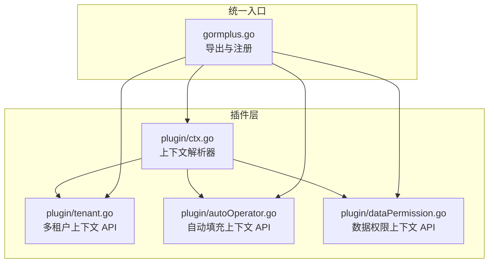
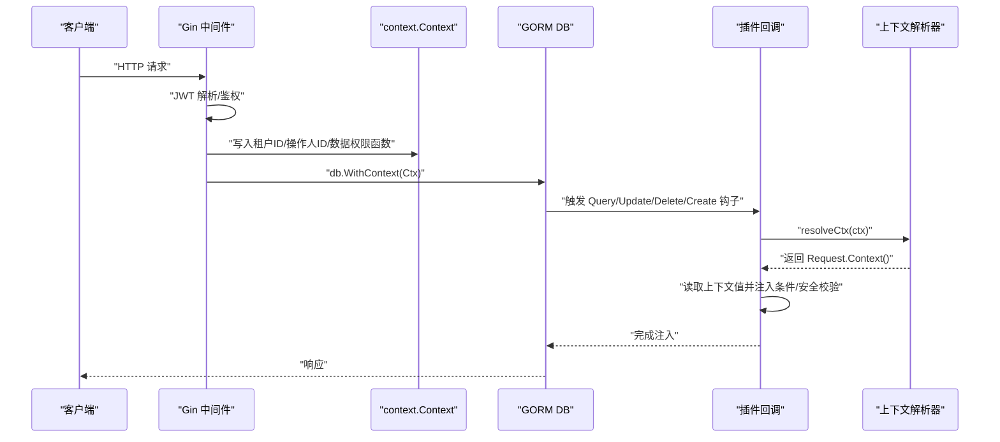
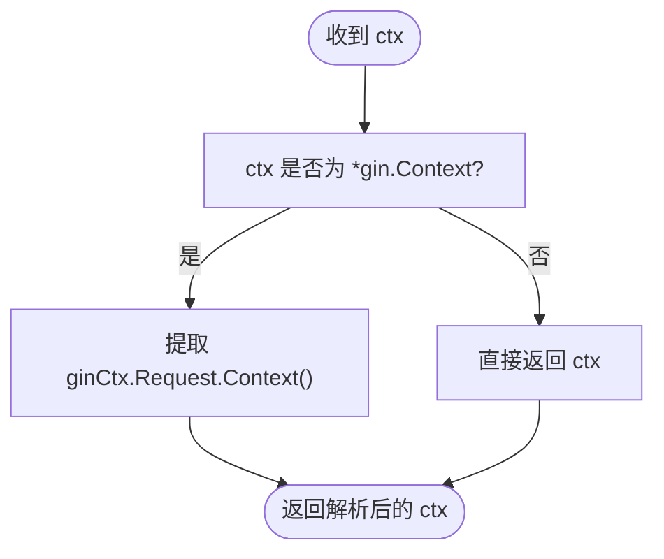
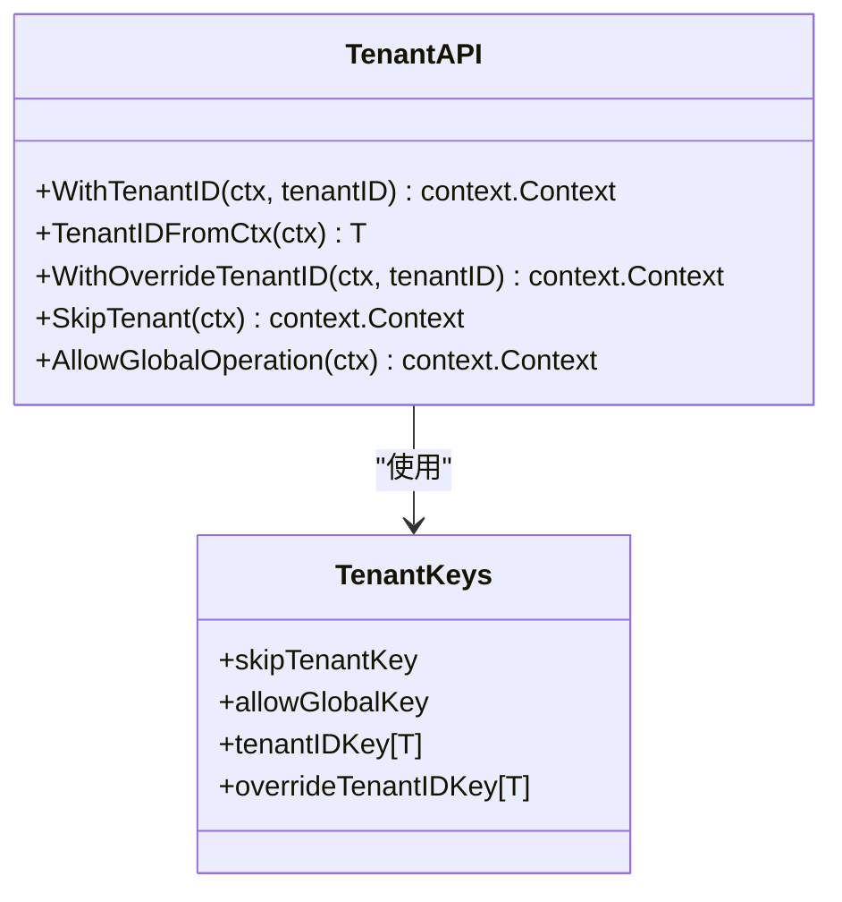
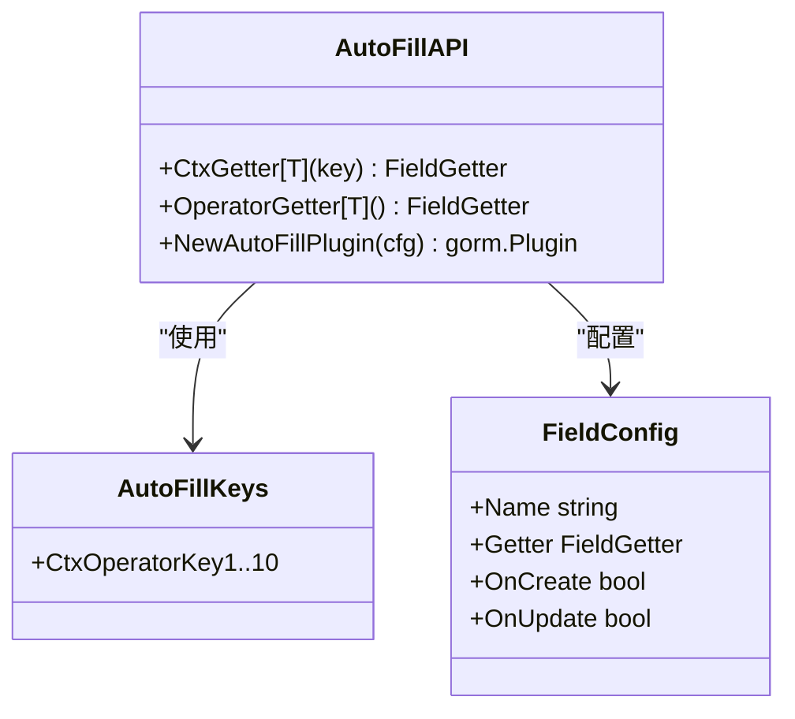
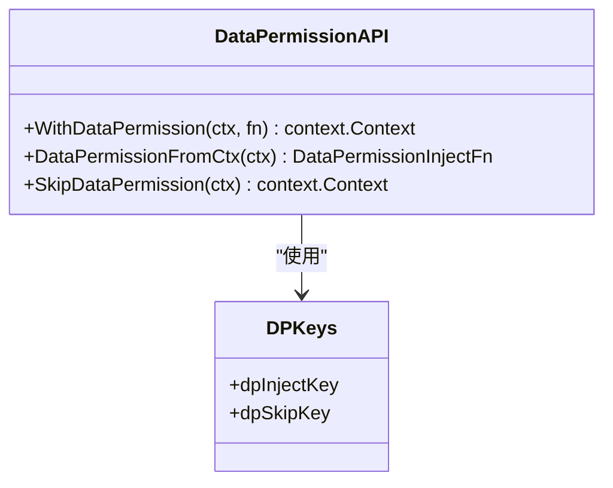
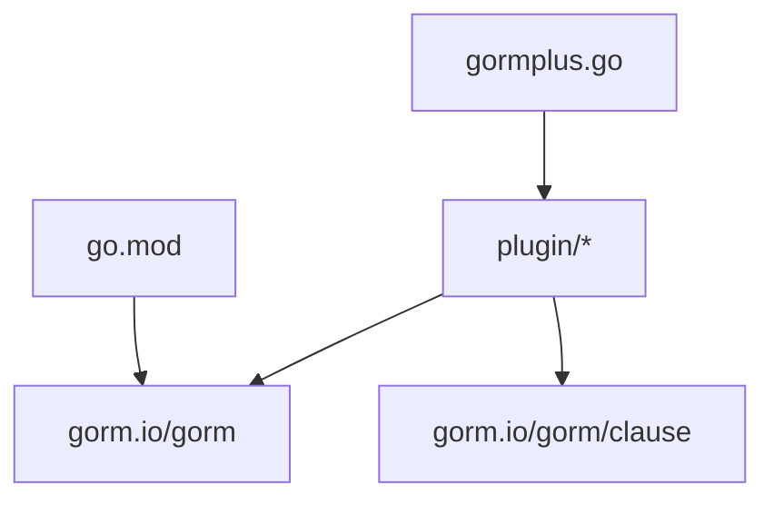

# 上下文传递 API

<cite>
**本文引用的文件**
- [plugin/ctx.go](file://plugin/ctx.go)
- [plugin/tenant.go](file://plugin/tenant.go)
- [plugin/autoOperator.go](file://plugin/autoOperator.go)
- [plugin/dataPermission.go](file://plugin/dataPermission.go)
- [gormplus.go](file://gormplus.go)
- [plugin/tenant.md](file://plugin/tenant.md)
- [plugin/autoOperator.md](file://plugin/autoOperator.md)
- [plugin/dataPermission.md](file://plugin/dataPermission.md)
- [go.mod](file://go.mod)
</cite>

## 目录
1. [简介](#简介)
2. [项目结构](#项目结构)
3. [核心组件](#核心组件)
4. [架构总览](#架构总览)
5. [详细组件分析](#详细组件分析)
6. [依赖分析](#依赖分析)
7. [性能考量](#性能考量)
8. [故障排查指南](#故障排查指南)
9. [结论](#结论)
10. [附录](#附录)

## 简介
本文件为“插件上下文传递机制”的详细 API 参考，聚焦以下能力：
- 上下文设置函数：WithTenantID、WithOverrideTenantID、WithOperatorID（自动填充）、WithDataPermission
- 上下文控制函数：SkipTenant、AllowGlobalOperation、SkipDataPermission
- Context Key 常量与解析机制：RegisterCtxResolver、resolveCtx
- 中间件集成模式：Gin、Go-Zero、Echo/Fiber
- JWT 解析流程与上下文值传递、生命周期管理
- 中间件实现模板与常见使用场景

本参考文档面向希望在 Gin 等 Web 框架中通过中间件将认证与业务上下文注入到 GORM 操作中的开发者，帮助快速理解并正确使用上下文传递 API。

## 项目结构
围绕上下文传递，核心位于 plugin 包与 gormplus 统一入口：
- plugin/ctx.go：上下文解析器注册与解析
- plugin/tenant.go：多租户插件上下文 API（WithTenantID、WithOverrideTenantID、SkipTenant、AllowGlobalOperation 等）
- plugin/autoOperator.go：自动填充插件上下文 API（CtxOperatorKey、CtxGetter、OperatorGetter 等）
- plugin/dataPermission.go：数据权限插件上下文 API（WithDataPermission、SkipDataPermission）
- gormplus.go：统一入口导出上述 API，并提供 RegisterCtxResolver

图表来源
- [plugin/ctx.go:1-44](file://plugin/ctx.go#L1-L44)
- [plugin/tenant.go:1132-1223](file://plugin/tenant.go#L1132-L1223)
- [plugin/autoOperator.go:10-89](file://plugin/autoOperator.go#L10-L89)
- [plugin/dataPermission.go:37-104](file://plugin/dataPermission.go#L37-L104)
- [gormplus.go:103-125](file://gormplus.go#L103-L125)

章节来源
- [plugin/ctx.go:1-44](file://plugin/ctx.go#L1-L44)
- [gormplus.go:103-125](file://gormplus.go#L103-L125)

## 核心组件
- 上下文解析器：RegisterCtxResolver、resolveCtx，解决 Gin 等框架将 *gin.Context 传给 db.WithContext() 时，插件无法从 Request.Context() 读取中间件写入值的问题
- 多租户上下文 API：WithTenantID、TenantIDFromCtx、WithOverrideTenantID、SkipTenant、AllowGlobalOperation
- 自动填充上下文 API：CtxOperatorKey、CtxGetter、OperatorGetter、FieldGetter
- 数据权限上下文 API：WithDataPermission、DataPermissionFromCtx、SkipDataPermission
- 统一入口：gormplus.RegisterCtxResolver、gormplus.WithTenantID、gormplus.WithDataPermission 等

章节来源
- [plugin/ctx.go:16-43](file://plugin/ctx.go#L16-L43)
- [plugin/tenant.go:1132-1223](file://plugin/tenant.go#L1132-L1223)
- [plugin/autoOperator.go:10-89](file://plugin/autoOperator.go#L10-L89)
- [plugin/dataPermission.go:37-104](file://plugin/dataPermission.go#L37-L104)
- [gormplus.go:103-125](file://gormplus.go#L103-L125)

## 架构总览
上下文传递的关键流程：
- 中间件在请求进入时，将认证信息（如租户 ID、操作人 ID、数据权限注入函数）写入 context
- 业务层通过 db.WithContext(ctx) 将上下文传递给 GORM
- 插件在 GORM Callback 钩子中读取上下文，进行安全校验与条件注入
- Gin 等框架特定的 *gin.Context 需要通过 RegisterCtxResolver 解析为 Request.Context()

图表来源
- [plugin/ctx.go:37-43](file://plugin/ctx.go#L37-L43)
- [plugin/tenant.go:529-595](file://plugin/tenant.go#L529-L595)
- [plugin/dataPermission.go:169-204](file://plugin/dataPermission.go#L169-L204)
- [plugin/autoOperator.go:212-275](file://plugin/autoOperator.go#L212-L275)

## 详细组件分析

### 上下文解析器：RegisterCtxResolver 与 resolveCtx
- 作用：将框架特定的 context（如 *gin.Context）转换为标准的 Request.Context()，保证插件能从中间件写入的值中读取
- 使用场景：Gin 项目必须注册；Go-Zero、Fiber 等使用标准 context，无需注册
- 生命周期：程序启动时注册一次，贯穿应用运行期

图表来源
- [plugin/ctx.go:37-43](file://plugin/ctx.go#L37-L43)
- [gormplus.go:103-125](file://gormplus.go#L103-L125)

章节来源
- [plugin/ctx.go:16-43](file://plugin/ctx.go#L16-L43)
- [gormplus.go:103-125](file://gormplus.go#L103-L125)

### 多租户上下文 API
- WithTenantID(ctx, tenantID)：将租户 ID 写入 context，通常在中间件中调用
- TenantIDFromCtx(ctx)：从 context 读取租户 ID，类型参数需与写入一致
- WithOverrideTenantID(ctx, tenantID)：覆盖租户 ID（需在注册时开启 AllowOverrideTenantID）
- SkipTenant(ctx)：跳过租户过滤（超管、跨租户统计）
- AllowGlobalOperation(ctx)：临时允许无业务条件的全表 Update/Delete

图表来源
- [plugin/tenant.go:1132-1223](file://plugin/tenant.go#L1132-L1223)

章节来源
- [plugin/tenant.go:1132-1223](file://plugin/tenant.go#L1132-L1223)
- [gormplus.go:583-642](file://gormplus.go#L583-L642)

### 自动填充上下文 API
- CtxOperatorKey1..10：操作人相关 context key 常量（建议用于操作人 ID、姓名、部门等）
- CtxGetter[T](key)：从 context 读取指定 key 的值，类型不匹配时返回 T 的零值
- OperatorGetter[T]()：专用操作人 Getter 工厂，从 CtxOperatorKey 读取
- FieldGetter：从 context 获取字段值的函数类型
- FieldConfig：单个字段的自动填充配置（Name、Getter、OnCreate、OnUpdate）

图表来源
- [plugin/autoOperator.go:10-89](file://plugin/autoOperator.go#L10-L89)
- [plugin/autoOperator.go:89-180](file://plugin/autoOperator.go#L89-L180)

章节来源
- [plugin/autoOperator.go:10-89](file://plugin/autoOperator.go#L10-L89)
- [plugin/autoOperator.go:89-180](file://plugin/autoOperator.go#L89-L180)
- [gormplus.go:763-801](file://gormplus.go#L763-L801)

### 数据权限上下文 API
- WithDataPermission(ctx, fn)：将数据权限注入函数写入 context，通常在中间件中调用
- DataPermissionFromCtx(ctx)：从 context 读取数据权限注入函数
- SkipDataPermission(ctx)：跳过数据权限过滤（超管、定时任务、内部统计）

图表来源
- [plugin/dataPermission.go:37-104](file://plugin/dataPermission.go#L37-L104)

章节来源
- [plugin/dataPermission.go:37-104](file://plugin/dataPermission.go#L37-L104)
- [gormplus.go:692-733](file://gormplus.go#L692-L733)

### 中间件集成模式与模板

- Gin
  - 注册解析器：在程序启动时注册，将 *gin.Context 解析为 Request.Context()
  - 租户中间件：从 JWT 解析租户 ID，写入 context
  - 自动填充中间件：从 JWT/Session 获取操作人 ID/姓名等，写入 CtxOperatorKey1..10
  - 数据权限中间件：根据 JWT claims 计算数据范围，写入 WithDataPermission

- Go-Zero
  - 使用标准 context，无需注册解析器
  - JWT 中间件将 payload 写入 r.Context()，key 固定为 "payload"
  - 从 payload 中读取操作人 ID，写入 CtxOperatorKey

- Echo/Fiber
  - 注册解析器：将框架特定 context 解析为标准 context
  - 中间件：从 Locals/locals 中获取操作人 ID，写入 CtxOperatorKey

章节来源
- [plugin/tenant.md:1-30](file://plugin/tenant.md#L1-L30)
- [plugin/autoOperator.md:1-102](file://plugin/autoOperator.md#L1-L102)
- [plugin/dataPermission.md:1-50](file://plugin/dataPermission.md#L1-L50)

### JWT 解析流程与上下文值传递
- Gin：中间件从 Authorization 头解析 JWT，提取 claims（如 accountId、roleId、deptId 等），写入 context
- Go-Zero：JWT 中间件将 payload 写入 r.Context()，key 固定为 "payload"，中间件读取并写入 context
- Echo/Fiber：从 Locals/locals 中获取用户标识，写入 context

章节来源
- [plugin/autoOperator.md:56-102](file://plugin/autoOperator.md#L56-L102)

### 上下文值解析机制
- resolveCtx(ctx)：通过已注册的解析器转换 ctx，屏蔽框架差异
- CtxGetter[T](key)：先解析 ctx，再读取 key 的值，类型不匹配返回 T 的零值
- TenantIDFromCtx[T]、DataPermissionFromCtx：分别从 context 读取租户 ID、数据权限注入函数

章节来源
- [plugin/ctx.go:37-43](file://plugin/ctx.go#L37-L43)
- [plugin/autoOperator.go:55-74](file://plugin/autoOperator.go#L55-L74)
- [plugin/tenant.go:1173-1183](file://plugin/tenant.go#L1173-L1183)
- [plugin/dataPermission.go:84-91](file://plugin/dataPermission.go#L84-L91)

### 上下文值传递与生命周期管理
- 传递路径：中间件写入 -> db.WithContext(ctx) -> 插件回调读取
- 生命周期：请求级，随请求结束释放
- 安全性：插件在回调中读取上下文前会调用 resolveCtx，确保从 Request.Context() 读取

章节来源
- [plugin/tenant.go:529-595](file://plugin/tenant.go#L529-L595)
- [plugin/dataPermission.go:169-204](file://plugin/dataPermission.go#L169-L204)
- [plugin/autoOperator.go:212-275](file://plugin/autoOperator.go#L212-L275)

## 依赖分析
- 插件层依赖 gorm.io/gorm 与 gorm.io/gorm/clause
- gormplus 统一入口导出插件 API 并复用上下文解析器
- 依赖版本来自 go.mod

图表来源
- [plugin/tenant.go:131-141](file://plugin/tenant.go#L131-L141)
- [plugin/autoOperator.go:3-8](file://plugin/autoOperator.go#L3-L8)
- [plugin/dataPermission.go:3-10](file://plugin/dataPermission.go#L3-L10)
- [go.mod:5-10](file://go.mod#L5-L10)

章节来源
- [plugin/tenant.go:131-141](file://plugin/tenant.go#L131-L141)
- [plugin/autoOperator.go:3-8](file://plugin/autoOperator.go#L3-L8)
- [plugin/dataPermission.go:3-10](file://plugin/dataPermission.go#L3-L10)
- [go.mod:5-10](file://go.mod#L5-L10)

## 性能考量
- 上下文解析器仅在回调触发时调用 resolveCtx，开销极低
- 自动填充与多租户注入均在 GORM Callback 钩子中进行，避免业务代码侵入
- PolicyAppend（多租户）可减少条件扫描，提升性能，但需确保业务代码不手动写租户条件

章节来源
- [plugin/tenant.go:180-188](file://plugin/tenant.go#L180-L188)
- [plugin/tenant.go:529-595](file://plugin/tenant.go#L529-L595)

## 故障排查指南
- Gin 项目无法读取中间件写入的值
  - 检查是否注册了 RegisterCtxResolver
  - 确认中间件写入的是 c.Request.Context()，而非 c
- 租户条件注入异常
  - 检查是否在业务代码中手动写了租户字段条件（PolicySkip/PolicyReplace/PolicyAppend）
  - 检查 WHERE 条件中是否包含 OR 与租户字段（会被拒绝）
- 全表 Update/Delete 被拒绝
  - 临时使用 AllowGlobalOperation(ctx)，或在注册时开启 AllowGlobalUpdate/AllowGlobalDelete
- 数据权限未生效
  - 检查中间件是否调用了 WithDataPermission(ctx, fn)
  - 检查表名是否在排除列表中

章节来源
- [plugin/tenant.go:383-482](file://plugin/tenant.go#L383-L482)
- [plugin/tenant.go:823-865](file://plugin/tenant.go#L823-L865)
- [plugin/dataPermission.go:169-204](file://plugin/dataPermission.go#L169-L204)

## 结论
通过统一的上下文解析器与多租户、自动填充、数据权限插件 API，开发者可以在 Gin、Go-Zero、Echo/Fiber 等框架中无缝地将认证与业务上下文注入到 GORM 操作中。遵循中间件写入、回调读取、安全校验的流程，既能保证数据隔离与权限控制，又能获得良好的性能与可维护性。

## 附录

### 常用 API 一览
- 上下文解析器
  - RegisterCtxResolver(fn)
  - resolveCtx(ctx)
- 多租户
  - WithTenantID(ctx, tenantID)
  - TenantIDFromCtx(ctx)
  - WithOverrideTenantID(ctx, tenantID)
  - SkipTenant(ctx)
  - AllowGlobalOperation(ctx)
- 自动填充
  - CtxOperatorKey1..10
  - CtxGetter[T](key)
  - OperatorGetter[T]()
  - NewAutoFillPlugin(cfg)
- 数据权限
  - WithDataPermission(ctx, fn)
  - DataPermissionFromCtx(ctx)
  - SkipDataPermission(ctx)

章节来源
- [plugin/ctx.go:16-43](file://plugin/ctx.go#L16-L43)
- [plugin/tenant.go:1132-1223](file://plugin/tenant.go#L1132-L1223)
- [plugin/autoOperator.go:10-89](file://plugin/autoOperator.go#L10-L89)
- [plugin/dataPermission.go:37-104](file://plugin/dataPermission.go#L37-L104)
- [gormplus.go:583-642](file://gormplus.go#L583-L642)
- [gormplus.go:692-733](file://gormplus.go#L692-L733)
- [gormplus.go:763-801](file://gormplus.go#L763-L801)