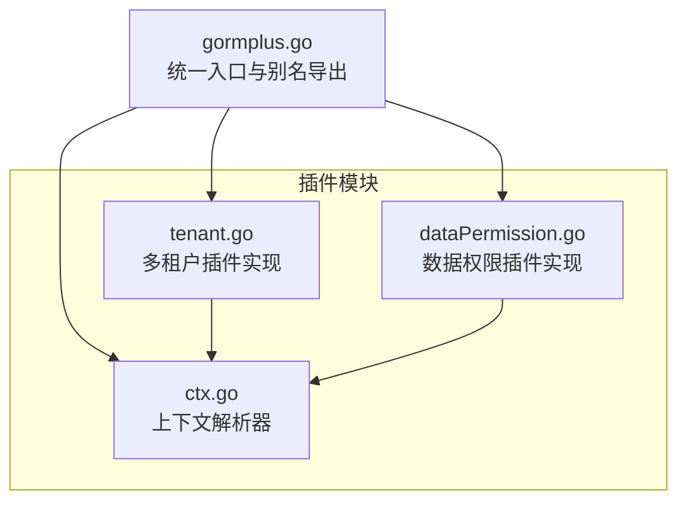
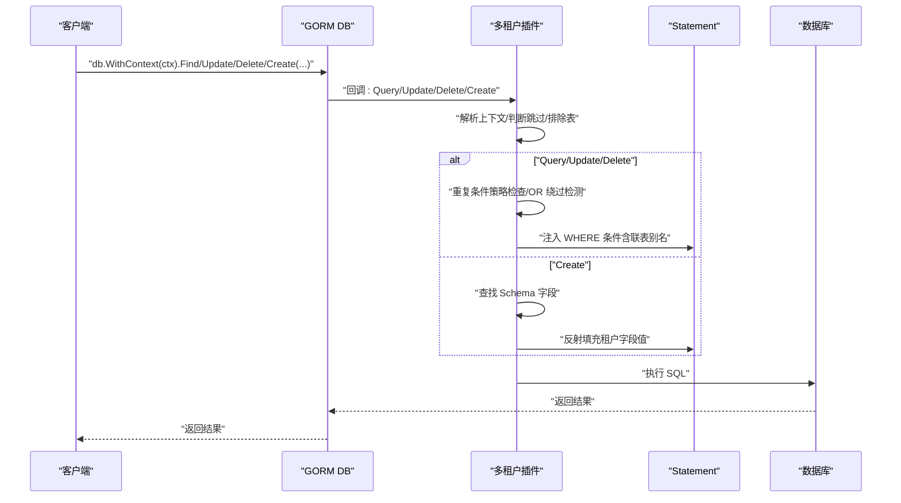
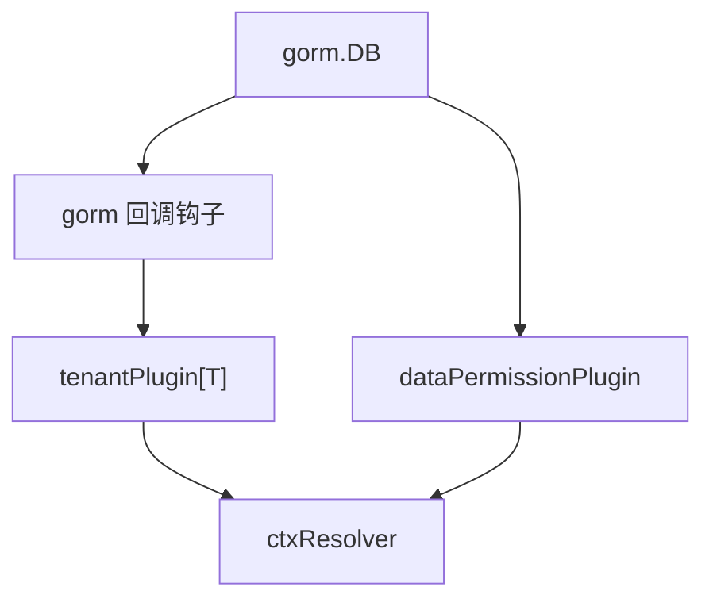

# 多租户插件 API

<cite>
**本文引用的文件**
- [plugin/tenant.go](file://plugin/tenant.go)
- [plugin/tenant.md](file://plugin/tenant.md)
- [plugin/dataPermission.go](file://plugin/dataPermission.go)
- [plugin/ctx.go](file://plugin/ctx.go)
- [gormplus.go](file://gormplus.go)
</cite>

## 目录
1. [简介](#简介)
2. [项目结构](#项目结构)
3. [核心组件](#核心组件)
4. [架构总览](#架构总览)
5. [详细组件分析](#详细组件分析)
6. [依赖分析](#依赖分析)
7. [性能考量](#性能考量)
8. [故障排查指南](#故障排查指南)
9. [结论](#结论)
10. [附录](#附录)

## 简介
本文件为多租户插件的详细 API 参考文档，覆盖 RegisterTenant 函数、TenantConfig 配置结构体、TenantFieldConfig 字段配置、JoinTenantConfig 联表配置等公开接口。重点说明：
- 租户 ID 获取函数与上下文传递机制
- 安全策略配置（重复条件策略、全表保护、OR 绕过防护）
- 联表自动注入机制（别名识别、覆盖配置）
- 单字段、多字段、按表配置三种使用模式的完整 API 说明与示例路径
- 回调函数签名、上下文键值、错误处理方案

## 项目结构
多租户插件位于 plugin 目录，核心实现集中在 tenant.go，配套上下文解析器在 ctx.go，统一入口在 gormplus.go。数据权限插件 dataPermission.go 与多租户插件共享类似的上下文解析与插件注册模式，便于对比理解。

图表来源
- [plugin/tenant.go:1-1223](file://plugin/tenant.go#L1-L1223)
- [plugin/dataPermission.go:1-339](file://plugin/dataPermission.go#L1-L339)
- [plugin/ctx.go:1-44](file://plugin/ctx.go#L1-L44)
- [gormplus.go:1-1305](file://gormplus.go#L1-L1305)

章节来源
- [plugin/tenant.go:1-1223](file://plugin/tenant.go#L1-L1223)
- [plugin/ctx.go:1-44](file://plugin/ctx.go#L1-L44)
- [gormplus.go:1-1305](file://gormplus.go#L1-L1305)

## 核心组件
- RegisterTenant：注册多租户插件，接收 TenantConfig 并向 gorm 注册 Query/Update/Delete/Create 回调钩子。
- TenantConfig：多租户插件配置，支持单字段、多字段、按表配置，联表注入策略，安全策略与排除表等。
- TenantFieldConfig：单个租户字段的注入配置，支持字段名与取值函数。
- JoinTenantConfig：联表中特定关联表的租户字段覆盖配置。
- 上下文工具：WithTenantID/TenantIDFromCtx/SkipTenant/AllowGlobalOperation/WithOverrideTenantID 等。
- 安全策略：DuplicateTenantPolicy（跳过/替换/追加）、全表保护（禁止无业务条件的 Update/Delete）、OR 绕过检测。
- 联表注入：AutoInjectJoinTables、ExcludeJoinTables、JoinTableOverrides、别名解析与自动注入。

章节来源
- [plugin/tenant.go:239-336](file://plugin/tenant.go#L239-L336)
- [plugin/tenant.go:192-212](file://plugin/tenant.go#L192-L212)
- [plugin/tenant.go:216-235](file://plugin/tenant.go#L216-L235)
- [plugin/tenant.go:145-188](file://plugin/tenant.go#L145-L188)
- [plugin/tenant.go:1030-1068](file://plugin/tenant.go#L1030-L1068)
- [plugin/tenant.go:1132-1222](file://plugin/tenant.go#L1132-L1222)

## 架构总览
多租户插件通过 gorm 的回调钩子在 Query/Update/Delete/Create 前注入租户条件，并在 Create 前自动填充租户字段。联表查询时自动解析 JOIN 语句中的表名与别名，按配置注入租户条件。安全策略保证重复条件不重复注入、OR 条件中出现租户字段时拒绝执行，且禁止无业务条件的全表更新/删除。

图表来源
- [plugin/tenant.go:355-381](file://plugin/tenant.go#L355-L381)
- [plugin/tenant.go:529-595](file://plugin/tenant.go#L529-L595)
- [plugin/tenant.go:749-779](file://plugin/tenant.go#L749-L779)
- [plugin/tenant.go:644-713](file://plugin/tenant.go#L644-L713)

## 详细组件分析

### RegisterTenant 函数
- 作用：向指定 gorm.DB 注册多租户插件，完成配置校验与插件实例构建后通过 db.Use 注册。
- 参数：
  - db: gorm.DB 实例
  - cfg: TenantConfig[T] 配置对象
- 返回：error，注册失败时返回错误
- 注册流程：
  - 构建插件实例（buildPlugin），校验 TenantField/TenantFields 至少一个非空
  - 注册 Query/Update/Delete/Create 回调钩子
  - 初始化默认取值函数、表字段映射、联表注入开关、排除集合、覆盖映射等
- 使用示例路径：
  - 单字段模式：[plugin/tenant.go:17-20](file://plugin/tenant.go#L17-L20)
  - 多字段模式：[plugin/tenant.go:39-48](file://plugin/tenant.go#L39-L48)
  - 按表配置模式：[plugin/tenant.go:57-68](file://plugin/tenant.go#L57-L68)
  - 联表自动注入与覆盖：[plugin/tenant.go:70-95](file://plugin/tenant.go#L70-L95)

章节来源
- [plugin/tenant.go:1030-1068](file://plugin/tenant.go#L1030-L1068)
- [plugin/tenant.go:961-1026](file://plugin/tenant.go#L961-L1026)
- [plugin/tenant.go:355-381](file://plugin/tenant.go#L355-L381)

### TenantConfig 配置结构体
- 字段说明（节选）：
  - TenantField：单字段快捷配置（用法一）
  - TenantFields：多字段配置（用法二）
  - TableFields：按表精确配置（用法三，优先级最高）
  - AutoInjectJoinTables：是否自动为所有 JOIN 关联表注入租户条件
  - ExcludeJoinTables：联表时不注入租户条件的表名列表
  - JoinTableOverrides：特定关联表的字段覆盖配置
  - AllowGlobalUpdate/AllowGlobalDelete：是否允许无业务条件的全表 Update/Delete
  - AllowOverrideTenantID：是否允许 WithOverrideTenantID 覆盖租户 ID
  - DuplicatePolicy：重复条件策略（PolicySkip/PolicyReplace/PolicyAppend）
  - InjectMode：注入方式（ModeScopes/ModeWhere）
  - ExcludeTables：主表排除列表
  - GetTenantID：全局默认取值函数
- 优先级：TableFields > TenantFields > TenantField
- 使用示例路径：
  - 单字段/多字段/按表配置：[plugin/tenant.go:15-68](file://plugin/tenant.go#L15-L68)
  - 安全策略与全表保护：[plugin/tenant.go:97-128](file://plugin/tenant.go#L97-L128)
  - 联表覆盖与排除：[plugin/tenant.go:84-95](file://plugin/tenant.go#L84-L95)

章节来源
- [plugin/tenant.go:239-336](file://plugin/tenant.go#L239-L336)

### TenantFieldConfig 字段配置
- 字段说明：
  - Field：数据库列名（必填）
  - GetTenantID：从 context 获取字段值的函数（可选，为 nil 时使用 TenantConfig.GetTenantID，最终回退到 DefaultGetTenantID）
- 使用示例路径：
  - 多字段配置：[plugin/tenant.go:39-48](file://plugin/tenant.go#L39-L48)

章节来源
- [plugin/tenant.go:192-212](file://plugin/tenant.go#L192-L212)

### JoinTenantConfig 联表配置
- 字段说明：
  - Table：关联表名（必填，不含库名前缀，不区分大小写）
  - Field：关联表的租户字段名（可选，为空时使用主表默认字段名）
  - GetTenantID：取值函数（可选，为 nil 时使用全局默认）
- 使用示例路径：
  - 联表覆盖：[plugin/tenant.go:89-95](file://plugin/tenant.go#L89-L95)

章节来源
- [plugin/tenant.go:216-235](file://plugin/tenant.go#L216-L235)

### 上下文工具与租户 ID 获取
- WithTenantID：将租户 ID 写入 context（通常在中间件中调用）
- TenantIDFromCtx：从 context 读取租户 ID（类型参数须与写入时一致）
- DefaultGetTenantID：默认取值函数，读取 WithTenantID 写入的值
- SkipTenant：跳过所有租户过滤（超管、跨租户统计专用）
- AllowGlobalOperation：临时允许无业务条件的全表 Update/Delete
- WithOverrideTenantID：临时覆盖租户 ID（需 AllowOverrideTenantID=true 才生效）

章节来源
- [plugin/tenant.go:1132-1222](file://plugin/tenant.go#L1132-L1222)
- [plugin/tenant.go:1185-1195](file://plugin/tenant.go#L1185-L1195)

### 安全策略与全表保护
- 重复条件策略（DuplicateTenantPolicy）：
  - PolicySkip：发现已有租户 AND 条件时跳过注入（默认），同时检测 OR 危险条件，发现则拒绝执行
  - PolicyReplace：先移除业务代码写的租户字段条件，再由插件注入 ctx 中的值，强制隔离
  - PolicyAppend：不检查直接追加，性能最好，但可能产生重复条件
- OR 绕过检测：只要 OR 条件中涉及租户字段，立即拒绝执行
- 全表保护：无业务条件的 Update/Delete 被拒绝（可通过 AllowGlobalOperation 临时放开）

章节来源
- [plugin/tenant.go:157-188](file://plugin/tenant.go#L157-L188)
- [plugin/tenant.go:385-482](file://plugin/tenant.go#L385-L482)
- [plugin/tenant.go:811-865](file://plugin/tenant.go#L811-L865)

### 联表自动注入机制
- AutoInjectJoinTables：默认 true，自动为所有 JOIN 关联表注入租户条件
- ExcludeJoinTables：排除公共表（如 sys_dict/sys_config）不注入
- JoinTableOverrides：覆盖特定关联表的字段名与取值函数
- 别名解析：parseJoinTable 支持 LEFT JOIN/JOIN/AS 等多种格式，自动识别别名
- 注入规则：若别名存在使用别名，否则使用表名；安全检查重复条件与 OR 绕过

章节来源
- [plugin/tenant.go:257-287](file://plugin/tenant.go#L257-L287)
- [plugin/tenant.go:644-713](file://plugin/tenant.go#L644-L713)
- [plugin/tenant.go:715-747](file://plugin/tenant.go#L715-L747)

### 三种使用模式
- 单字段（用法一）：TenantField 指定统一字段名，适用于大多数场景
- 多字段（用法二）：在同一张表注入多个租户字段，支持独立取值函数
- 按表配置（用法三）：TableFields 指定不同表使用不同字段名，空 slice 跳过该表

章节来源
- [plugin/tenant.go:15-68](file://plugin/tenant.go#L15-L68)

### 统一入口与别名导出
- gormplus.RegisterTenant：统一入口注册多租户插件，导出 TenantConfig/TenantFieldConfig/JoinTenantConfig 等类型别名
- gormplus.WithTenantID/TenantIDFromCtx/SkipTenant/AllowGlobalOperation/WithOverrideTenantID：统一入口的上下文工具
- gormplus.AddExcludeTable/RemoveExcludeTable/ExcludedTables：运行时动态管理排除表

章节来源
- [gormplus.go:475-661](file://gormplus.go#L475-L661)

## 依赖分析
- 多租户插件依赖 gorm 的回调钩子系统，在 Query/Update/Delete/Create 阶段注入条件或填充字段
- 上下文解析器 ctxResolver 用于兼容 gin 等框架，确保中间件写入 Request.Context 的数据能被插件读取
- 数据权限插件与多租户插件共享类似的上下文解析与插件注册模式，便于对比理解

图表来源
- [plugin/tenant.go:355-381](file://plugin/tenant.go#L355-L381)
- [plugin/dataPermission.go:140-162](file://plugin/dataPermission.go#L140-L162)
- [plugin/ctx.go:37-43](file://plugin/ctx.go#L37-L43)

章节来源
- [plugin/tenant.go:355-381](file://plugin/tenant.go#L355-L381)
- [plugin/dataPermission.go:140-162](file://plugin/dataPermission.go#L140-L162)
- [plugin/ctx.go:37-43](file://plugin/ctx.go#L37-L43)

## 性能考量
- 注入方式：ModeScopes 与 ModeWhere 底层效果相同，均使用 db.Statement.Where 直接注入，保留 ModeScopes 仅为语义区分
- 重复条件策略：
  - PolicySkip：默认，兼顾安全与性能
  - PolicyReplace：先移除再注入，有一定开销
  - PolicyAppend：不检查直接追加，性能最佳，但可能产生重复条件
- 联表注入：AutoInjectJoinTables=true 时，解析 JOIN 语句并注入条件，对复杂联表查询有额外解析成本
- 排除表：ExcludeTables/ExcludeJoinTables 可减少不必要的注入，提升整体性能

## 故障排查指南
- 错误：禁止无业务条件的全表 Update/Delete
  - 现象：无业务 WHERE 条件的 Update/Delete 被拒绝
  - 处理：使用 AllowGlobalOperation 临时放开，或在配置中设置 AllowGlobalUpdate/AllowGlobalDelete
  - 参考：[plugin/tenant.go:823-865](file://plugin/tenant.go#L823-L865)
- 错误：租户字段出现在 OR 条件中
  - 现象：检测到 OR 中包含租户字段，拒绝执行
  - 处理：修改查询逻辑，避免在 OR 中使用租户字段；如确需跨租户查询，使用 SkipTenant
  - 参考：[plugin/tenant.go:420-482](file://plugin/tenant.go#L420-L482)
- 错误：租户插件未注册
  - 现象：运行时提示插件未注册
  - 处理：确认已调用 RegisterTenant 或 gormplus.RegisterTenant
  - 参考：[plugin/tenant.go:1072-1083](file://plugin/tenant.go#L1072-L1083)
- 错误：上下文解析问题（gin）
  - 现象：传入 *gin.Context 无法读取中间件写入的租户 ID
  - 处理：注册 ctx 解析器，将 *gin.Context 转换为 Request.Context
  - 参考：[plugin/ctx.go:16-35](file://plugin/ctx.go#L16-L35)

章节来源
- [plugin/tenant.go:823-865](file://plugin/tenant.go#L823-L865)
- [plugin/tenant.go:420-482](file://plugin/tenant.go#L420-L482)
- [plugin/tenant.go:1072-1083](file://plugin/tenant.go#L1072-L1083)
- [plugin/ctx.go:16-35](file://plugin/ctx.go#L16-L35)

## 结论
多租户插件通过 gorm 回调钩子实现了对 Query/Update/Delete/Create 的自动注入与填充，结合灵活的配置选项（单字段/多字段/按表配置、联表覆盖、安全策略、全表保护）满足复杂业务场景下的租户隔离需求。配合上下文解析器与统一入口，可在 Gin/Go-Zero/Fiber 等框架中无缝集成。建议优先使用 PolicySkip 与默认注入方式，在严格隔离场景下启用 PolicyReplace，并谨慎使用 AllowOverrideTenantID 与 SkipTenant。

## 附录
- 使用方式与示例路径：
  - 直接注册与中间件示例：[plugin/tenant.md:1-30](file://plugin/tenant.md#L1-L30)
  - 单字段/多字段/按表配置示例：[plugin/tenant.go:15-68](file://plugin/tenant.go#L15-L68)
  - 联表自动注入与覆盖示例：[plugin/tenant.go:70-95](file://plugin/tenant.go#L70-L95)
  - 安全策略与全表保护示例：[plugin/tenant.go:97-128](file://plugin/tenant.go#L97-L128)
- 统一入口别名导出：
  - RegisterTenant/NewTenantPlugin/WithTenantID/TenantIDFromCtx/SkipTenant/AllowGlobalOperation/WithOverrideTenantID 等：[gormplus.go:512-642](file://gormplus.go#L512-L642)