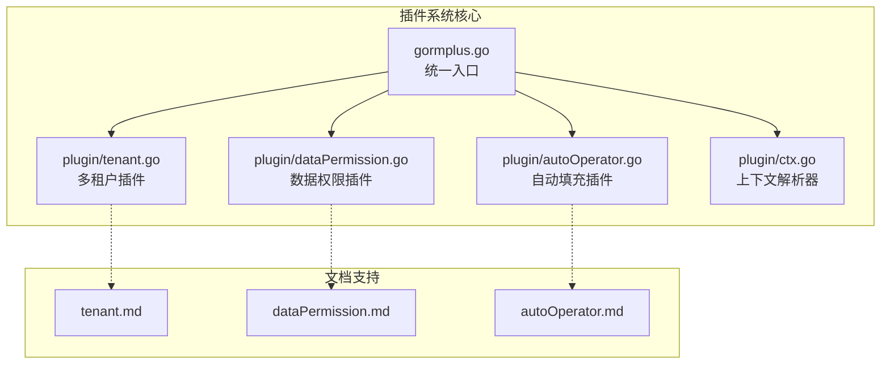
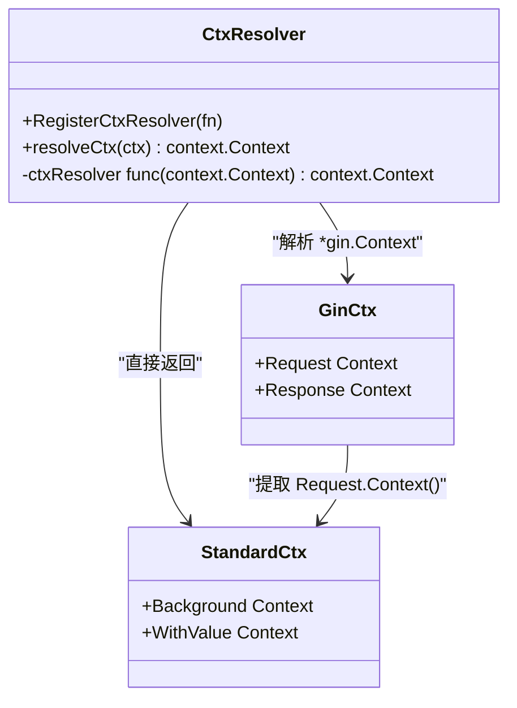
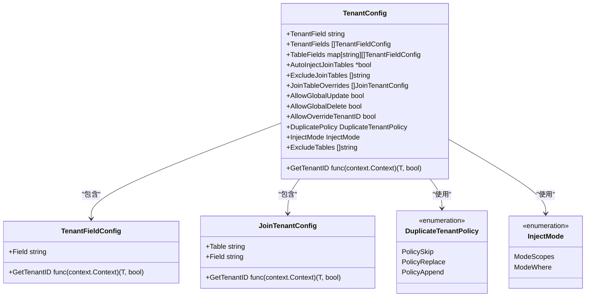
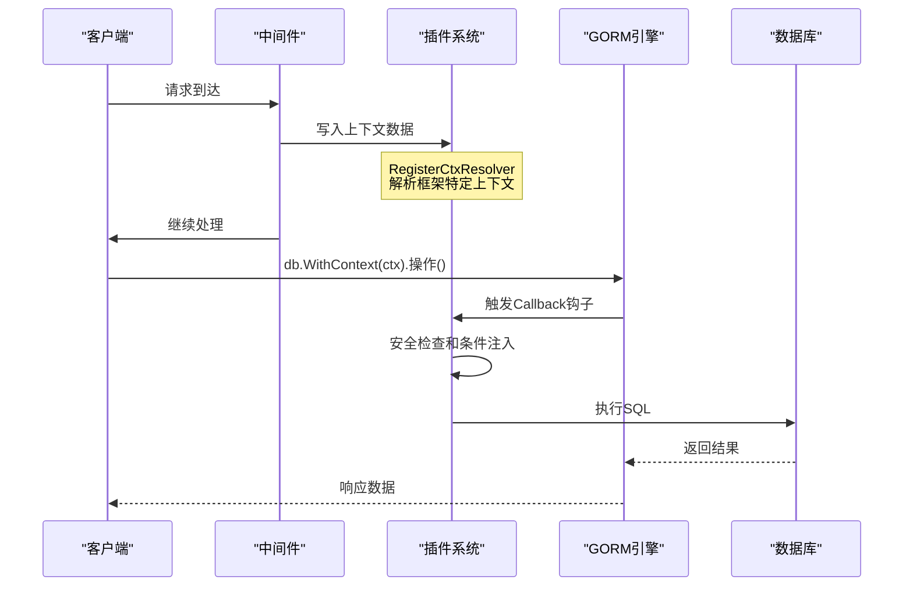
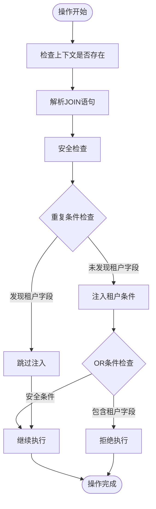
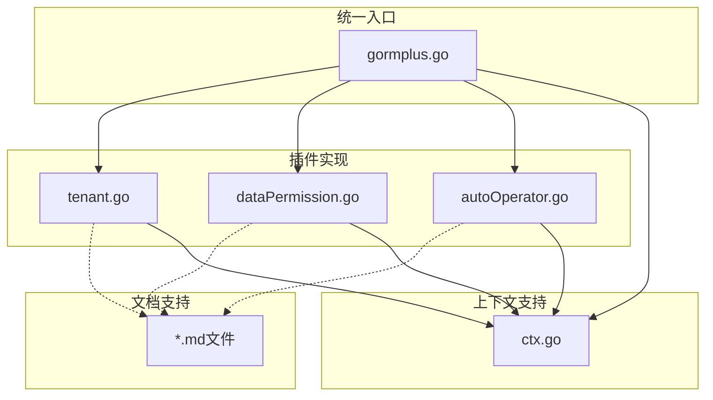
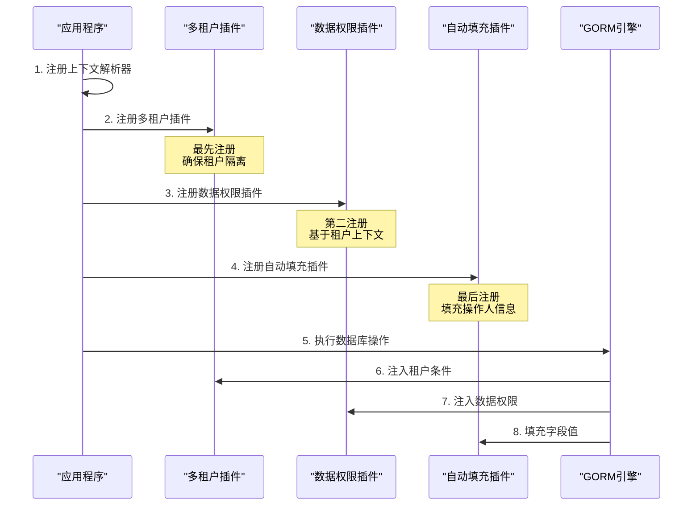
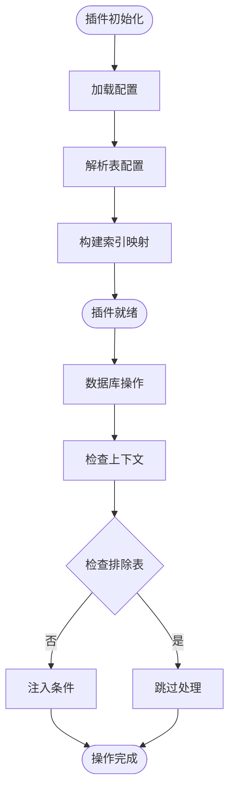

# 插件系统 API

<cite>
**本文档引用的文件**
- [plugin/tenant.go](file://plugin/tenant.go)
- [plugin/dataPermission.go](file://plugin/dataPermission.go)
- [plugin/autoOperator.go](file://plugin/autoOperator.go)
- [plugin/ctx.go](file://plugin/ctx.go)
- [gormplus.go](file://gormplus.go)
- [plugin/tenant.md](file://plugin/tenant.md)
- [plugin/dataPermission.md](file://plugin/dataPermission.md)
- [plugin/autoOperator.md](file://plugin/autoOperator.md)
</cite>

## 目录
1. [简介](#简介)
2. [项目结构](#项目结构)
3. [核心组件](#核心组件)
4. [架构概览](#架构概览)
5. [详细组件分析](#详细组件分析)
6. [依赖关系分析](#依赖关系分析)
7. [性能考虑](#性能考虑)
8. [故障排除指南](#故障排除指南)
9. [结论](#结论)

## 简介

GORM-Plus 插件系统是一个基于 GORM Callback 钩子的增强扩展包，提供了三个核心插件：多租户插件、数据权限插件和自动填充插件。这些插件通过统一的上下文传递机制，在不修改业务代码的情况下实现数据安全隔离和自动化数据填充。

插件系统的核心特性包括：
- **无侵入性**：业务代码无需修改即可享受插件功能
- **上下文驱动**：通过 context 传递租户 ID、操作人信息等上下文数据
- **安全隔离**：防止租户数据泄露和越权访问
- **灵活配置**：支持多种配置模式和运行时动态调整

## 项目结构



**图表来源**
- [gormplus.go:1-100](file://gormplus.go#L1-L100)
- [plugin/tenant.go:1-50](file://plugin/tenant.go#L1-L50)
- [plugin/dataPermission.go:1-30](file://plugin/dataPermission.go#L1-L30)
- [plugin/autoOperator.go:1-30](file://plugin/autoOperator.go#L1-L30)

**章节来源**
- [gormplus.go:1-100](file://gormplus.go#L1-L100)
- [plugin/tenant.go:1-50](file://plugin/tenant.go#L1-L50)
- [plugin/dataPermission.go:1-30](file://plugin/dataPermission.go#L1-L30)
- [plugin/autoOperator.go:1-30](file://plugin/autoOperator.go#L1-L30)

## 核心组件

### 上下文解析器

插件系统的核心在于统一的上下文解析机制，解决了不同 Web 框架（Gin、Go-Zero、Fiber 等）之间的兼容性问题。



**图表来源**
- [plugin/ctx.go:7-44](file://plugin/ctx.go#L7-L44)

### 多租户插件架构

多租户插件提供了三种配置模式，支持复杂的租户隔离需求：



**图表来源**
- [plugin/tenant.go:192-336](file://plugin/tenant.go#L192-L336)

**章节来源**
- [plugin/ctx.go:7-44](file://plugin/ctx.go#L7-L44)
- [plugin/tenant.go:192-336](file://plugin/tenant.go#L192-L336)

## 架构概览

插件系统的整体架构采用 GORM Callback 钩子机制，在数据库操作的不同阶段自动注入相应的安全控制逻辑。



**图表来源**
- [gormplus.go:30-85](file://gormplus.go#L30-L85)
- [plugin/ctx.go:16-44](file://plugin/ctx.go#L16-L44)

## 详细组件分析

### 多租户插件 (Tenant Plugin)

#### 配置结构

多租户插件支持三种配置模式，满足不同的业务需求：

**单字段配置模式**
```go
plugin.RegisterTenant(db, plugin.TenantConfig[int64]{
    TenantField: "tenant_id",
    ExcludeTables: []string{"sys_config", "sys_dict"},
})
```

**多字段配置模式**
```go
plugin.RegisterTenant(db, plugin.TenantConfig[int64]{
    TenantFields: []plugin.TenantFieldConfig[int64]{
        {Field: "tenant_id"},
        {Field: "org_id", GetTenantID: func(ctx context.Context) (int64, bool) {
            id, ok := ctx.Value("orgID").(int64)
            return id, ok && id != 0
        }},
    },
})
```

**按表配置模式**
```go
plugin.RegisterTenant(db, plugin.TenantConfig[int64]{
    TenantField: "tenant_id",
    TableFields: map[string][]plugin.TenantFieldConfig[int64]{
        "sys_contract": {{Field: "company_id"}},
        "sys_order": {
            {Field: "tenant_id"},
            {Field: "org_id", GetTenantID: orgIDGetter},
        },
        "sys_log": {},
    },
    ExcludeTables: []string{"sys_config", "sys_dict"},
})
```

#### 安全机制

多租户插件实现了多层次的安全保护：



**图表来源**
- [plugin/tenant.go:385-482](file://plugin/tenant.go#L385-L482)

#### 运行时控制

多租户插件提供了丰富的运行时控制选项：

**临时放开全表操作**
```go
ctx = plugin.AllowGlobalOperation(ctx)
db.WithContext(ctx).Model(&Account{}).Updates(map[string]any{"status": 0})
```

**覆盖租户 ID**
```go
ctx = plugin.WithOverrideTenantID(ctx, int64(2002))
db.WithContext(ctx).Find(&list) // WHERE tenant_id = 2002
```

**跳过租户过滤**
```go
ctx = plugin.SkipTenant(ctx)
db.WithContext(ctx).Find(&all) // 无租户条件
```

**动态排除表**
```go
plugin.AddExcludeTable[int64](db, "log_audit", "sys_trace")
plugin.RemoveExcludeTable[int64](db, "sys_dict")
```

**章节来源**
- [plugin/tenant.go:15-129](file://plugin/tenant.go#L15-L129)
- [plugin/tenant.go:385-525](file://plugin/tenant.go#L385-L525)
- [plugin/tenant.go:527-800](file://plugin/tenant.go#L527-L800)

### 数据权限插件 (Data Permission Plugin)

#### 配置结构

数据权限插件采用函数式配置，业务层通过中间件注入自定义的权限控制逻辑：

```go
type DataPermissionConfig struct {
    InjectMode DataPermissionInjectMode
    ExcludeTables []string
}

type DataPermissionInjectFn func(db *gorm.DB, tableName string)
```

#### 中间件集成

数据权限插件与 Web 框架的集成方式：

**Gin 中间件示例**
```go
func DataPermissionMiddleware() gin.HandlerFunc {
    return func(c *gin.Context) {
        claims, err := jwt.ParseToken(c.GetHeader("Authorization"))
        if err != nil { 
            c.Next() 
            return 
        }
        
        injectFn := func(db *gorm.DB, tableName string) {
            switch claims.DataScope {
            case "2": // 本角色相关部门
                db.Where(tableName+".create_by IN (SELECT sys_user.user_id FROM sys_role_dept LEFT JOIN sys_user ON sys_user.dept_id = sys_role_dept.dept_id WHERE sys_role_dept.role_id = ?)", claims.RoleId)
            case "3": // 本部门
                db.Where(tableName+".create_by IN (SELECT user_id FROM sys_user WHERE dept_id = ?)", claims.DeptId)
            case "4": // 本部门及子部门
                db.Where(tableName+".create_by IN (SELECT user_id FROM sys_user WHERE dept_id IN (SELECT dept_id FROM sys_dept WHERE dept_path LIKE ?))", "%/"+strconv.FormatInt(claims.DeptId, 10)+"/%")
            case "5": // 仅本人
                db.Where(tableName+".create_by = ?", claims.UserId)
            }
        }
        
        ctx := plugin.WithDataPermission(c.Request.Context(), injectFn)
        c.Request = c.Request.WithContext(ctx)
        c.Next()
    }
}
```

#### 运行时控制

数据权限插件提供了灵活的运行时控制：

**跳过数据权限过滤**
```go
ctx = plugin.SkipDataPermission(ctx)
db.WithContext(ctx).Find(&allData) // 无数据权限条件
```

**动态排除表**
```go
plugin.AddDataPermissionExcludeTable(db, "log_audit", "sys_trace")
plugin.RemoveDataPermissionExcludeTable(db, "sys_dict")
```

**章节来源**
- [plugin/dataPermission.go:12-339](file://plugin/dataPermission.go#L12-L339)

### 自动填充插件 (Auto Fill Plugin)

#### 配置结构

自动填充插件支持多种字段类型和自定义数据源：

```go
type AutoFillConfig struct {
    Fields []FieldConfig
}

type FieldConfig struct {
    Name string
    Getter FieldGetter
    OnCreate bool
    OnUpdate bool
}

type FieldGetter func(ctx context.Context) any
```

#### 字段配置示例

**基础操作人填充**
```go
db.Use(plugin.NewAutoFillPlugin(plugin.AutoFillConfig{
    Fields: []plugin.FieldConfig{
        {Name: "CreatedBy", Getter: plugin.OperatorGetter[int64](), OnCreate: true},
        {Name: "UpdatedBy", Getter: plugin.OperatorGetter[int64](), OnCreate: true, OnUpdate: true},
    },
}))
```

**多字段混合配置**
```go
db.Use(plugin.NewAutoFillPlugin(plugin.AutoFillConfig{
    Fields: []plugin.FieldConfig{
        {Name: "CreatedBy", Getter: plugin.OperatorGetter[int64](), OnCreate: true},
        {Name: "UpdatedBy", Getter: plugin.OperatorGetter[int64](), OnCreate: true, OnUpdate: true},
        {Name: "TenantID", Getter: plugin.CtxGetter[string]("tenantId"), OnCreate: true},
        {Name: "Source", Getter: func(ctx context.Context) any {
            if src, ok := resolveCtx(ctx).Value("source").(string); ok {
                return src
            }
            return "unknown"
        }, OnCreate: true},
    },
}))
```

#### 上下文键值管理

插件系统提供了最多10个预定义的上下文键值：

```go
var (
    CtxContextKey1 = plugin.CtxOperatorKey1  // 建议存操作人 ID
    CtxContextKey2 = plugin.CtxOperatorKey2  // 建议存操作人姓名
    CtxContextKey3 = plugin.CtxOperatorKey3  // 建议存部门 ID
    // ... 支持最多10个键值
)
```

**章节来源**
- [plugin/autoOperator.go:10-309](file://plugin/autoOperator.go#L10-L309)

## 依赖关系分析

插件系统各组件之间的依赖关系清晰，遵循单一职责原则：



**图表来源**
- [gormplus.go:88-101](file://gormplus.go#L88-L101)
- [plugin/tenant.go:131-141](file://plugin/tenant.go#L131-L141)
- [plugin/dataPermission.go:3-10](file://plugin/dataPermission.go#L3-L10)
- [plugin/autoOperator.go:3-8](file://plugin/autoOperator.go#L3-L8)

### 插件注册顺序

插件的注册顺序对系统行为有重要影响：



**图表来源**
- [gormplus.go:22-85](file://gormplus.go#L22-L85)

**章节来源**
- [gormplus.go:22-85](file://gormplus.go#L22-L85)

## 性能考虑

### 注入模式对比

插件系统提供了多种注入模式，各有不同的性能特征：

| 注入模式 | 性能特征 | 使用场景 | 安全性 |
|---------|----------|----------|--------|
| ModeScopes | 中等性能，语义清晰 | 推荐使用 | 高 |
| ModeWhere | 最高性能，直接注入 | 高性能要求场景 | 高 |
| PolicySkip | 最安全，跳过重复条件 | 默认推荐 | 最高 |
| PolicyReplace | 强制隔离，移除重复条件 | 严格安全场景 | 高 |
| PolicyAppend | 性能最优，可能重复 | 确保无重复条件场景 | 中等 |

### 运行时优化



**图表来源**
- [plugin/tenant.go:355-381](file://plugin/tenant.go#L355-L381)
- [plugin/dataPermission.go:243-266](file://plugin/dataPermission.go#L243-L266)

## 故障排除指南

### 常见问题及解决方案

**问题1：Gin 框架上下文读取失败**
```go
// 错误做法
ctx := plugin.WithTenantID(c, tenantID) // 直接传 *gin.Context

// 正确做法
plugin.RegisterCtxResolver(func(ctx context.Context) context.Context {
    if ginCtx, ok := ctx.(*gin.Context); ok {
        return ginCtx.Request.Context()
    }
    return ctx
})

// 或者手动提取
ctx := plugin.WithTenantID(c.Request.Context(), tenantID)
```

**问题2：租户条件重复注入**
```go
// 多租户插件会自动检测重复条件并跳过注入
// 无需担心手动添加租户条件导致的重复
db.WithContext(ctx).Where("tenant_id = ?", 1001).Find(&list)
// 生成：WHERE tenant_id = 1001（不重复）
```

**问题3：OR 条件绕过安全**
```go
// 多租户插件会拒绝包含租户字段的 OR 条件
db.WithContext(ctx).Where("tenant_id = ? OR status = 1", 9999).Find(&list)
// 抛出错误：租户字段出现在 OR 条件中，可能绕过租户隔离
```

**问题4：数据权限注入失败**
```go
// 确保中间件正确设置 DataPermissionInjectFn
func DataPermissionMiddleware() gin.HandlerFunc {
    return func(c *gin.Context) {
        // 确保 injectFn 不为 nil
        if injectFn == nil {
            c.Next()
            return
        }
        ctx := plugin.WithDataPermission(c.Request.Context(), injectFn)
        c.Request = c.Request.WithContext(ctx)
        c.Next()
    }
}
```

**章节来源**
- [plugin/tenant.go:97-129](file://plugin/tenant.go#L97-L129)
- [plugin/dataPermission.go:164-204](file://plugin/dataPermission.go#L164-L204)

### 调试技巧

**启用插件调试**
```go
// 使用 gormplus.RegisterSlowQuery 进行性能监控
gormplus.RegisterSlowQuery(db, gormplus.SlowQueryConfig{
    Threshold: 200 * time.Millisecond,
    Logger: func(ctx context.Context, info gormplus.SlowQueryInfo) {
        log.Printf("SQL: %s\nParameters: %v\nDuration: %v", 
                   info.SQL, info.Parameters, info.Duration)
    },
})
```

**检查排除表状态**
```go
// 获取当前排除表列表
tables, err := gormplus.ExcludedTables[int64](db)
if err == nil {
    fmt.Println("当前排除表:", tables)
}
```

## 结论

GORM-Plus 插件系统通过精心设计的架构和丰富的配置选项，为现代应用提供了强大的数据安全和自动化能力。三个核心插件相互协作，形成了完整的数据治理解决方案。

### 主要优势

1. **统一入口**：通过 gormplus.go 提供统一的 API 接口
2. **灵活配置**：支持多种配置模式满足不同业务需求
3. **安全可靠**：多层次安全检查防止数据泄露
4. **性能优化**：提供多种注入模式和运行时优化选项
5. **易于集成**：支持主流 Web 框架，集成成本低

### 最佳实践

1. **正确的注册顺序**：先注册多租户插件，再注册数据权限插件，最后注册自动填充插件
2. **合理的配置策略**：根据业务需求选择合适的注入模式和安全策略
3. **完善的中间件**：确保中间件正确设置上下文数据
4. **定期审计**：定期检查排除表配置和权限设置
5. **性能监控**：使用慢查询监控插件进行性能优化

插件系统的设计充分体现了现代软件工程的最佳实践，既保证了功能的完整性，又确保了系统的可维护性和可扩展性。