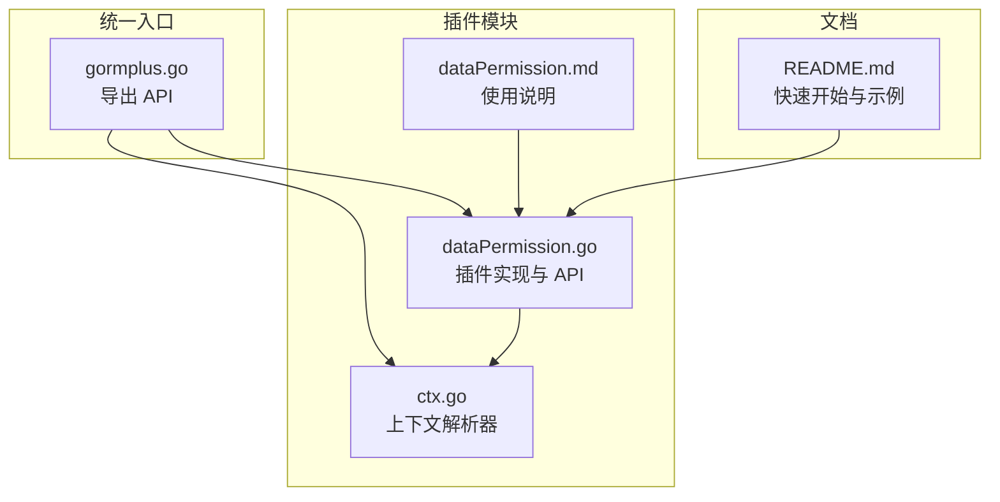
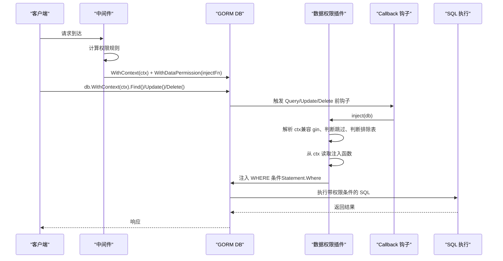
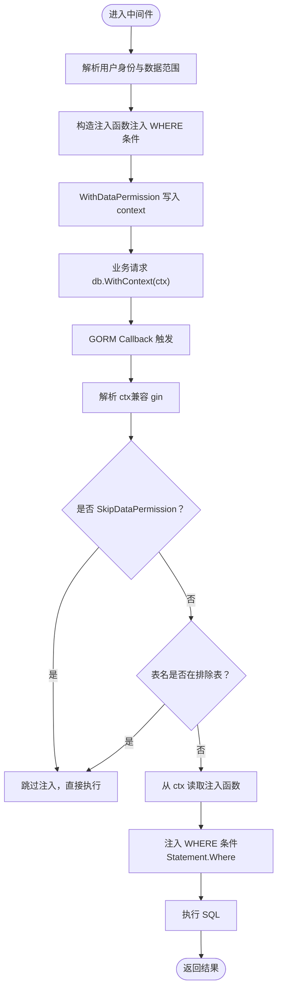
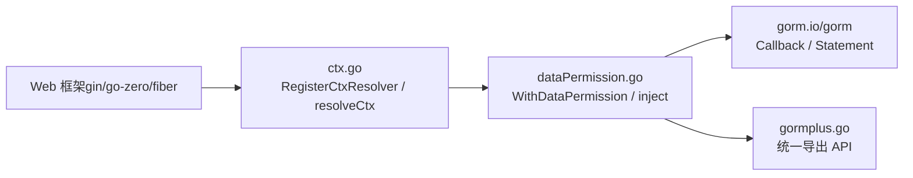

# 数据权限插件 API

<cite>
**本文引用的文件**
- [plugin/dataPermission.go](file://plugin/dataPermission.go)
- [plugin/dataPermission.md](file://plugin/dataPermission.md)
- [plugin/ctx.go](file://plugin/ctx.go)
- [gormplus.go](file://gormplus.go)
- [README.md](file://README.md)
</cite>

## 目录
1. [简介](#简介)
2. [项目结构](#项目结构)
3. [核心组件](#核心组件)
4. [架构总览](#架构总览)
5. [详细组件分析](#详细组件分析)
6. [依赖分析](#依赖分析)
7. [性能考量](#性能考量)
8. [故障排查指南](#故障排查指南)
9. [结论](#结论)
10. [附录](#附录)

## 简介
本文件为“数据权限插件”的全面 API 参考文档，面向希望在 GORM 应用中实现基于上下文的动态数据权限控制的开发者。文档覆盖以下关键主题：
- RegisterDataPermission 函数：插件注册入口与配置说明
- DataPermissionConfig 配置结构体：注入模式、排除表等
- 权限规则配置与动态权限计算机制：通过中间件注入函数实现复杂权限逻辑
- 基于上下文的数据权限注入：WithDataPermission、DataPermissionFromCtx、SkipDataPermission
- 排除表配置与运行时动态维护：AddDataPermissionExcludeTable、RemoveDataPermissionExcludeTable、DataPermissionExcludedTables
- 中间件集成方式与权限验证流程：回调触发、表名解析、条件注入时机
- 实际使用场景与最佳实践：示例与注意事项

## 项目结构
数据权限插件位于 plugin 子模块，核心实现集中在 dataPermission.go，配套文档在 dataPermission.md，上下文解析器在 ctx.go。gormplus.go 提供统一入口导出，README.md 提供快速开始与使用示例。

图表来源
- [plugin/dataPermission.go:1-339](file://plugin/dataPermission.go#L1-L339)
- [plugin/ctx.go:1-44](file://plugin/ctx.go#L1-L44)
- [gormplus.go:663-748](file://gormplus.go#L663-L748)
- [README.md:493-532](file://README.md#L493-L532)

章节来源
- [plugin/dataPermission.go:1-339](file://plugin/dataPermission.go#L1-L339)
- [plugin/ctx.go:1-44](file://plugin/ctx.go#L1-L44)
- [gormplus.go:663-748](file://gormplus.go#L663-L748)
- [README.md:493-532](file://README.md#L493-L532)

## 核心组件
- 注册与配置
  - RegisterDataPermission：向指定 gorm.DB 注册数据权限插件，仅需调用一次
  - DataPermissionConfig：配置注入模式与排除表
  - NewDataPermissionPlugin：工厂函数，返回插件实例供手动 db.Use 注册
- 上下文注入与读取
  - WithDataPermission：将权限注入函数写入 context（通常在中间件）
  - DataPermissionFromCtx：从 context 读取注入函数（不存在时返回 nil）
  - SkipDataPermission：返回跳过数据权限过滤的新 context（超管/特权场景）
- 运行时动态排除表
  - AddDataPermissionExcludeTable：动态添加排除表（线程安全）
  - RemoveDataPermissionExcludeTable：动态移除排除表（线程安全）
  - DataPermissionExcludedTables：返回当前排除表快照（调试用）

章节来源
- [plugin/dataPermission.go:231-266](file://plugin/dataPermission.go#L231-L266)
- [plugin/dataPermission.go:69-104](file://plugin/dataPermission.go#L69-L104)
- [plugin/dataPermission.go:282-338](file://plugin/dataPermission.go#L282-L338)
- [gormplus.go:673-748](file://gormplus.go#L673-L748)

## 架构总览
数据权限插件通过 gorm.Callback 在 Query/Update/Delete 三个阶段前注入条件。插件从 db.WithContext(ctx) 的上下文中读取注入函数，结合表名与排除表配置，动态追加 WHERE 条件。上下文解析器屏蔽不同 Web 框架的差异，确保 gin 等框架能正确读取中间件写入的 context 数据。

图表来源
- [plugin/dataPermission.go:140-204](file://plugin/dataPermission.go#L140-L204)
- [plugin/ctx.go:37-43](file://plugin/ctx.go#L37-L43)
- [gormplus.go:673-748](file://gormplus.go#L673-L748)

## 详细组件分析

### RegisterDataPermission 函数
- 作用：向指定 gorm.DB 注册数据权限插件，仅需调用一次
- 行为：将 DataPermissionConfig 中的 ExcludeTables 转换为小写集合，注入插件实例
- 使用场景：应用启动时注册，后续所有 db.WithContext(ctx) 的查询/更新/删除自动注入权限条件（若 ctx 中存在注入函数且非跳过状态）

章节来源
- [plugin/dataPermission.go:231-249](file://plugin/dataPermission.go#L231-L249)
- [gormplus.go:673-685](file://gormplus.go#L673-L685)

### DataPermissionConfig 配置结构体
- 字段
  - InjectMode：注入方式（ModeScopes/ModeWhere）。底层行为一致（均使用 db.Statement.Where），仅语义区分
  - ExcludeTables：排除表名列表（精确匹配、不区分大小写、不含库名前缀）
- 说明：ExcludeTables 用于避免对某些公共表（如配置表、字典表、菜单表）进行权限过滤

章节来源
- [plugin/dataPermission.go:108-126](file://plugin/dataPermission.go#L108-L126)
- [gormplus.go:665-666](file://gormplus.go#L665-L666)

### 权限规则配置与动态权限计算机制
- 注入函数类型：DataPermissionInjectFn(db *gorm.DB, tableName string)
- 中间件职责：解析用户身份与数据范围，构造注入函数，并通过 WithDataPermission 写入 context
- 注入时机：在 gorm.Callback 的 Query/Update/Delete 阶段前自动触发
- 表名解析：去除库名前缀与反引号，统一转为小写，便于规则匹配
- 条件注入：通过 db.Where(...) 追加 WHERE 条件，支持复杂子查询与多表关联

章节来源
- [plugin/dataPermission.go:14-35](file://plugin/dataPermission.go#L14-L35)
- [plugin/dataPermission.go:169-204](file://plugin/dataPermission.go#L169-L204)
- [plugin/dataPermission.go:206-216](file://plugin/dataPermission.go#L206-L216)

### 基于上下文的数据权限注入
- WithDataPermission(ctx, fn)：将注入函数写入 context，通常在中间件中调用
- DataPermissionFromCtx(ctx)：从 context 读取注入函数，不存在时返回 nil
- SkipDataPermission(ctx)：返回跳过数据权限过滤的新 context（超管/特权场景）

章节来源
- [plugin/dataPermission.go:69-104](file://plugin/dataPermission.go#L69-L104)
- [gormplus.go:692-733](file://gormplus.go#L692-L733)

### 排除表配置与运行时动态维护
- 注册时配置：ExcludeTables 在注册时生效
- 运行时维护：
  - AddDataPermissionExcludeTable：动态添加排除表（线程安全）
  - RemoveDataPermissionExcludeTable：动态移除排除表（线程安全）
  - DataPermissionExcludedTables：返回当前排除表快照（调试用）

章节来源
- [plugin/dataPermission.go:108-126](file://plugin/dataPermission.go#L108-L126)
- [plugin/dataPermission.go:282-338](file://plugin/dataPermission.go#L282-L338)
- [gormplus.go:735-748](file://gormplus.go#L735-L748)

### 中间件集成方式与权限验证流程
- 中间件步骤
  - 解析用户身份与数据范围（如 JWT、RBAC）
  - 构造注入函数（根据数据范围生成 WHERE 条件）
  - 调用 WithDataPermission 写入 context
  - 业务层通过 db.WithContext(ctx).Find()/Update()/Delete() 执行，插件自动注入条件
- 跳过机制：在特权场景调用 SkipDataPermission，插件将跳过注入
- 表名解析：插件从 gorm.Statement.Table 中提取表名，去除库名与反引号，统一小写
- 排除表：若表名在排除集合中，插件直接跳过注入

图表来源
- [plugin/dataPermission.go:169-204](file://plugin/dataPermission.go#L169-L204)
- [plugin/ctx.go:37-43](file://plugin/ctx.go#L37-L43)
- [plugin/dataPermission.go:206-216](file://plugin/dataPermission.go#L206-L216)

## 依赖分析
- 插件依赖
  - gorm.io/gorm：GORM 核心库，用于注册回调、访问 Statement、执行 SQL
  - gorm-plus/plugin/ctx.go：上下文解析器，屏蔽 gin/go-zero/fiber 等框架差异
- 组件耦合
  - dataPermission.go 与 ctx.go：通过 resolveCtx 解析上下文，确保 gin 场景下能读取中间件写入的 Request.Context
  - gormplus.go：统一导出 API，简化用户使用；内部调用 plugin 包的具体实现
- 外部集成点
  - Web 框架：gin 中间件通过 WithDataPermission 写入 context；gormplus.RegisterCtxResolver 用于 gin 场景

图表来源
- [plugin/ctx.go:16-43](file://plugin/ctx.go#L16-L43)
- [plugin/dataPermission.go:69-204](file://plugin/dataPermission.go#L69-L204)
- [gormplus.go:663-748](file://gormplus.go#L663-L748)

章节来源
- [plugin/ctx.go:16-43](file://plugin/ctx.go#L16-L43)
- [plugin/dataPermission.go:69-204](file://plugin/dataPermission.go#L69-L204)
- [gormplus.go:663-748](file://gormplus.go#L663-L748)

## 性能考量
- 注入时机：插件在 gorm.Callback 的 Query/Update/Delete 阶段前注入，避免在 Scopes 阶段无效导致的额外开销
- 条件注入：统一使用 db.Statement.Where 直接注入，减少中间层转换成本
- 排除表：通过小写集合快速判断，避免对公共表进行权限过滤
- 线程安全：排除表集合采用互斥锁保护，保证运行时动态维护的并发安全
- 建议：尽量将复杂权限逻辑放在中间件中一次性构造注入函数，避免在回调中重复计算

章节来源
- [plugin/dataPermission.go:47-65](file://plugin/dataPermission.go#L47-L65)
- [plugin/dataPermission.go:169-204](file://plugin/dataPermission.go#L169-L204)
- [plugin/dataPermission.go:218-227](file://plugin/dataPermission.go#L218-L227)

## 故障排查指南
- 问题：gin 场景下插件无法读取中间件写入的 context
  - 原因：未注册 ctx 解析器
  - 解决：调用 gormplus.RegisterCtxResolver，将 *gin.Context 转换为 Request.Context
- 问题：注册后未生效
  - 原因：未在业务请求中使用 db.WithContext(ctx)，或 ctx 中未写入注入函数
  - 解决：确认中间件已调用 WithDataPermission，业务层使用 db.WithContext(ctx)
- 问题：排除表未生效
  - 原因：表名大小写或库名前缀未按约定（不含库名前缀、不区分大小写）
  - 解决：确保 ExcludeTables 中的表名为小写且不含库名前缀
- 问题：特权场景仍被过滤
  - 原因：未正确调用 SkipDataPermission 或在后续中间件中覆盖了 context
  - 解决：在特权接口处调用 SkipDataPermission 并确保后续中间件不覆盖

章节来源
- [plugin/ctx.go:16-35](file://plugin/ctx.go#L16-L35)
- [plugin/dataPermission.go:169-204](file://plugin/dataPermission.go#L169-L204)
- [plugin/dataPermission.go:108-126](file://plugin/dataPermission.go#L108-L126)

## 结论
数据权限插件通过“中间件注入函数 + 回调自动注入”的设计，实现了灵活、可扩展、低侵入的数据权限控制。其核心优势包括：
- 业务与权限解耦：权限规则由业务中间件实现，插件仅负责注入
- 高度可配置：支持注入模式、排除表、运行时动态维护
- 跨框架兼容：通过 ctx 解析器屏蔽 gin/go-zero/fiber 的差异
- 性能友好：直接使用 Statement.Where 注入，避免无效的 Scopes 调用

## 附录

### API 一览（函数与类型）
- 注册与配置
  - RegisterDataPermission(db, cfg) error
  - DataPermissionConfig{InjectMode, ExcludeTables}
  - NewDataPermissionPlugin(cfg) (gorm.Plugin, error)
- 上下文注入与读取
  - WithDataPermission(ctx, fn) context.Context
  - DataPermissionFromCtx(ctx) DataPermissionInjectFn
  - SkipDataPermission(ctx) context.Context
- 运行时动态排除表
  - AddDataPermissionExcludeTable(db, tables ...string) error
  - RemoveDataPermissionExcludeTable(db, tables ...string) error
  - DataPermissionExcludedTables(db) ([]string, error)

章节来源
- [plugin/dataPermission.go:231-266](file://plugin/dataPermission.go#L231-L266)
- [plugin/dataPermission.go:69-104](file://plugin/dataPermission.go#L69-L104)
- [plugin/dataPermission.go:282-338](file://plugin/dataPermission.go#L282-L338)
- [gormplus.go:665-748](file://gormplus.go#L665-L748)

### 使用示例与最佳实践
- 快速开始
  - 注册 ctx 解析器（gin 场景）
  - 注册数据权限插件（可配置 ExcludeTables）
  - 中间件中构造注入函数并写入 context
  - 业务层使用 db.WithContext(ctx) 执行查询/更新/删除
- 最佳实践
  - 将复杂权限逻辑集中在中间件，避免在回调中重复计算
  - 对公共表（如配置、字典、菜单）加入 ExcludeTables
  - 特权场景使用 SkipDataPermission，避免误删数据
  - 使用 DataPermissionExcludedTables 调试当前排除表快照

章节来源
- [README.md:493-532](file://README.md#L493-L532)
- [plugin/dataPermission.md:1-50](file://plugin/dataPermission.md#L1-L50)