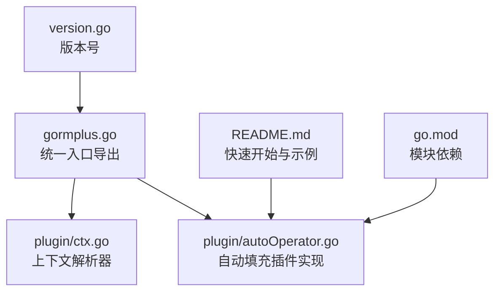
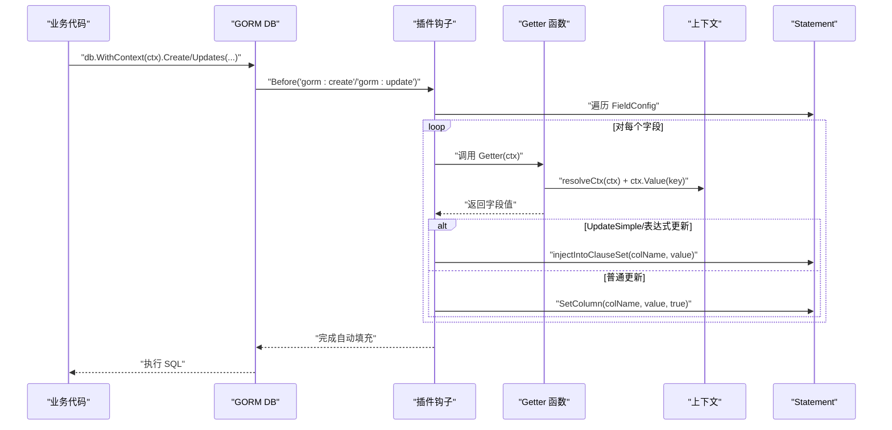
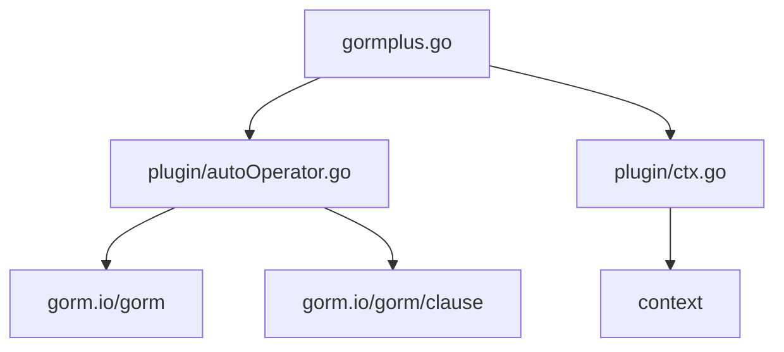

# 自动填充插件 API

<cite>
**本文引用的文件**
- [plugin/autoOperator.go](file://plugin/autoOperator.go)
- [plugin/ctx.go](file://plugin/ctx.go)
- [plugin/autoOperator.md](file://plugin/autoOperator.md)
- [gormplus.go](file://gormplus.go)
- [README.md](file://README.md)
- [go.mod](file://go.mod)
- [version.go](file://version.go)
</cite>

## 目录
1. [简介](#简介)
2. [项目结构](#项目结构)
3. [核心组件](#核心组件)
4. [架构总览](#架构总览)
5. [详细组件分析](#详细组件分析)
6. [依赖关系分析](#依赖关系分析)
7. [性能考量](#性能考量)
8. [故障排查指南](#故障排查指南)
9. [结论](#结论)
10. [附录](#附录)

## 简介
本文件为“自动填充插件”的完整 API 参考文档，聚焦以下主题：
- RegisterAutoOperator 函数（注：仓库中未提供该函数，但提供 NewAutoFillPlugin 与 gormplus.NewAutoFillPlugin）
- OperatorConfig 配置结构体（注：仓库中未提供该结构体，但提供 AutoFillConfig 与 FieldConfig）
- 创建人/更新人自动写入机制
- GetOperatorID 获取函数（注：仓库中未提供该函数，但提供 CtxGetter、OperatorGetter、CtxGetter[T]、OperatorGetter[T]）
- 字段映射配置
- 中间件集成方式
- WithOperatorID 上下文设置（注：仓库中未提供该函数，但提供 CtxGetter[T]、OperatorGetter[T] 等）
- OperatorInfo 结构体（注：仓库中未提供该结构体，但提供上下文键与 Getter）
- 自动填充触发时机与字段覆盖规则
- 中间件实现示例与业务集成最佳实践

## 项目结构
自动填充插件位于 plugin/autoOperator.go，配套上下文解析器在 plugin/ctx.go。gormplus.go 提供统一入口导出，README.md 提供快速开始与集成示例。

图表来源
- [gormplus.go:750-800](file://gormplus.go#L750-L800)
- [plugin/autoOperator.go:140-208](file://plugin/autoOperator.go#L140-L208)
- [plugin/ctx.go:7-43](file://plugin/ctx.go#L7-L43)
- [README.md:536-563](file://README.md#L536-L563)

章节来源
- [gormplus.go:750-800](file://gormplus.go#L750-L800)
- [plugin/autoOperator.go:140-208](file://plugin/autoOperator.go#L140-L208)
- [plugin/ctx.go:7-43](file://plugin/ctx.go#L7-L43)
- [README.md:536-563](file://README.md#L536-L563)

## 核心组件
- 自动填充插件实例：AutoFillPlugin，提供 NewAutoFillPlugin 工厂函数与 gormplus.NewAutoFillPlugin 统一入口导出。
- 配置结构体：AutoFillConfig（包含 Fields 字段）、FieldConfig（单字段配置）。
- Getter 类型与工厂：FieldGetter、CtxGetter[T]、OperatorGetter[T]。
- 上下文键：CtxOperatorKey1..10（用于在中间件与插件间传递操作人信息）。
- 上下文解析器：RegisterCtxResolver、resolveCtx，解决 gin 等框架的 *gin.Context 与标准 context 的差异。
- 触发时机：Create 前（OnCreate=true）、Update 前（OnUpdate=true），以及 UpdateColumn/SkipHooks 路径的特殊处理。

章节来源
- [plugin/autoOperator.go:140-208](file://plugin/autoOperator.go#L140-L208)
- [plugin/autoOperator.go:120-138](file://plugin/autoOperator.go#L120-L138)
- [plugin/autoOperator.go:90-118](file://plugin/autoOperator.go#L90-L118)
- [plugin/autoOperator.go:35-74](file://plugin/autoOperator.go#L35-L74)
- [plugin/ctx.go:16-43](file://plugin/ctx.go#L16-L43)

## 架构总览
自动填充插件通过 gorm 的回调钩子在 Create/Update 前注入字段值。插件读取配置中的 FieldConfig，逐个字段调用 Getter 从上下文中取值，并通过 gorm 的 SetColumn 或 clause.Set 注入到 SQL。

图表来源
- [plugin/autoOperator.go:190-208](file://plugin/autoOperator.go#L190-L208)
- [plugin/autoOperator.go:210-275](file://plugin/autoOperator.go#L210-L275)
- [plugin/autoOperator.go:285-308](file://plugin/autoOperator.go#L285-L308)
- [plugin/ctx.go:37-43](file://plugin/ctx.go#L37-L43)

## 详细组件分析

### 自动填充插件实例与注册
- NewAutoFillPlugin(cfg): 创建插件实例，供 db.Use() 注册。
- gormplus.NewAutoFillPlugin(cfg): 统一入口导出，便于直接使用。
- Initialize(db): 注册 Create/Update 两类回调钩子，分别在 gorm:create/gorm:update 之前执行。

章节来源
- [plugin/autoOperator.go:182-188](file://plugin/autoOperator.go#L182-L188)
- [plugin/autoOperator.go:190-208](file://plugin/autoOperator.go#L190-L208)
- [gormplus.go:783-793](file://gormplus.go#L783-L793)

### 配置结构体
- AutoFillConfig
  - Fields: []FieldConfig，定义要自动填充的字段集合。
- FieldConfig
  - Name: 字段名（Go 结构体字段名或数据库列名，插件自动解析）。
  - Getter: FieldGetter，从上下文取值的函数。
  - OnCreate: 是否在 Create 时填充。
  - OnUpdate: 是否在 Update 时填充。

章节来源
- [plugin/autoOperator.go:120-138](file://plugin/autoOperator.go#L120-L138)
- [plugin/autoOperator.go:90-118](file://plugin/autoOperator.go#L90-L118)

### Getter 类型与工厂
- FieldGetter: func(ctx context.Context) any，返回任意类型值，gorm 会按目标字段类型自动处理。
- CtxGetter[T](key): 通用 Getter 工厂，从上下文读取指定 key 的值，类型不匹配时返回 T 的零值。
- OperatorGetter[T](): 专用 Getter 工厂，从 CtxOperatorKey1..10 读取操作人标识，语义更清晰。
- 上下文解析：resolveCtx(ctx) 会将 *gin.Context 等框架特定上下文转换为标准 context，确保中间件写入的值能被读取。

章节来源
- [plugin/autoOperator.go:35-74](file://plugin/autoOperator.go#L35-L74)
- [plugin/ctx.go:7-43](file://plugin/ctx.go#L7-L43)

### 上下文键与 Getter 使用
- CtxOperatorKey1..10：预定义的上下文键，用于在中间件与插件间传递操作人信息。
- 建议用法：
  - CtxContextKey1：操作人 ID（int64/string/uuid）
  - CtxContextKey2：操作人姓名（string）
  - CtxContextKey3：部门 ID（int64/string）
  - 其余：自定义业务字段
- Getter 使用：
  - CtxGetter[T](CtxContextKey1) 读取操作人 ID
  - CtxGetter[string](CtxContextKey2) 读取操作人姓名
  - OperatorGetter[T]() 读取操作人 ID（语义更清晰）

章节来源
- [plugin/autoOperator.go:14-33](file://plugin/autoOperator.go#L14-L33)
- [gormplus.go:770-781](file://gormplus.go#L770-L781)

### 触发时机与字段覆盖规则
- Create 前：仅填充 OnCreate=true 的字段。
- Update 前（SkipHooks=false）：仅填充 OnUpdate=true 的字段。
- UpdateColumn/SkipHooks=true：直接写入 Dest map 或退回 SetColumn。
- UpdateSimple/表达式更新：通过 injectIntoClauseSet 追加到 clause.Set，避免重复注入。
- 覆盖规则：
  - 普通 Update：SetColumn(col, val, true) 生效。
  - UpdateSimple：若 clause.Set 已存在且包含该列，则跳过重复注入。
  - SkipHooks 路径：map 路径直接写入列名，struct 路径退回 SetColumn。

章节来源
- [plugin/autoOperator.go:210-275](file://plugin/autoOperator.go#L210-L275)
- [plugin/autoOperator.go:285-308](file://plugin/autoOperator.go#L285-L308)

### 中间件集成方式与最佳实践
- gin 项目：
  - 注册上下文解析器：RegisterCtxResolver(func(ctx) context.Context)，将 *gin.Context 转换为 Request.Context。
  - 中间件写入：context.WithValue(Request.Context(), CtxContextKey1/2/... , value)。
  - 业务代码直接传 *gin.Context 给 db.WithContext(ctx)。
- go-zero/fiber 项目：
  - 使用标准 context，无需注册解析器。
  - 中间件写入：context.WithValue(r.Context(), CtxContextKey1/2/... , value)。
- 最佳实践：
  - 在路由中间件中统一写入操作人信息，避免分散处理。
  - 对于 UUID 场景，使用 string 类型的 Getter。
  - 对于多字段场景，合理分配 CtxContextKey1..10，避免冲突。
  - 对于 UpdateSimple/表达式更新，确保 Getter 返回值与目标字段类型兼容。

章节来源
- [plugin/autoOperator.md:1-32](file://plugin/autoOperator.md#L1-L32)
- [plugin/autoOperator.md:54-101](file://plugin/autoOperator.md#L54-L101)
- [README.md:536-563](file://README.md#L536-L563)

### API 一览（按功能分组）

- 插件注册
  - NewAutoFillPlugin(cfg): 创建插件实例
  - gormplus.NewAutoFillPlugin(cfg): 统一入口导出
  - db.Use(plugin): 注册插件

- 配置
  - AutoFillConfig{Fields: []FieldConfig}
  - FieldConfig{Name, Getter, OnCreate, OnUpdate}

- Getter
  - FieldGetter: func(ctx context.Context) any
  - CtxGetter[T](key): 通用 Getter 工厂
  - OperatorGetter[T](): 专用 Getter 工厂（从 CtxOperatorKey1..10 读取）

- 上下文键
  - CtxOperatorKey1..10：预定义键
  - gormplus.CtxContextKey1..10：统一入口导出

- 上下文解析器
  - RegisterCtxResolver(fn): 注册解析器
  - resolveCtx(ctx): 解析框架特定上下文

- 触发与注入
  - Create 前：SetColumn(col, val, true)
  - Update 前：SetColumn(col, val, true)，UpdateSimple：injectIntoClauseSet
  - SkipHooks：map 路径直接写入，struct 路径退回 SetColumn

章节来源
- [plugin/autoOperator.go:182-188](file://plugin/autoOperator.go#L182-L188)
- [gormplus.go:783-793](file://gormplus.go#L783-L793)
- [plugin/autoOperator.go:120-138](file://plugin/autoOperator.go#L120-L138)
- [plugin/autoOperator.go:90-118](file://plugin/autoOperator.go#L90-L118)
- [plugin/autoOperator.go:35-74](file://plugin/autoOperator.go#L35-L74)
- [plugin/ctx.go:16-43](file://plugin/ctx.go#L16-L43)
- [plugin/autoOperator.go:210-275](file://plugin/autoOperator.go#L210-L275)
- [plugin/autoOperator.go:285-308](file://plugin/autoOperator.go#L285-L308)

## 依赖关系分析
- gormplus.go 导出统一入口，内部调用 plugin 包实现。
- plugin/autoOperator.go 依赖 gorm.io/gorm 与 gorm.io/gorm/clause。
- plugin/ctx.go 提供上下文解析器，屏蔽框架差异。
- README.md 提供快速开始与集成示例。

图表来源
- [gormplus.go:88-101](file://gormplus.go#L88-L101)
- [plugin/autoOperator.go:3-8](file://plugin/autoOperator.go#L3-L8)
- [plugin/ctx.go:3](file://plugin/ctx.go#L3)

章节来源
- [gormplus.go:88-101](file://gormplus.go#L88-L101)
- [plugin/autoOperator.go:3-8](file://plugin/autoOperator.go#L3-L8)
- [plugin/ctx.go:3](file://plugin/ctx.go#L3)

## 性能考量
- 自动填充在回调钩子中进行，仅对具备 schema 的操作生效（原生 SQL 无 schema 时跳过）。
- Getter 为函数调用，成本较低；字段数量与 Getter 复杂度直接影响性能。
- UpdateSimple/表达式更新通过 injectIntoClauseSet 追加，避免 SetColumn 无效导致的额外开销。
- 建议：
  - 控制字段数量，仅配置必要的自动填充字段。
  - Getter 中避免复杂计算，尽量从上下文直接读取。
  - 对高频写入场景，优先使用普通 Update 路径而非 UpdateSimple。

章节来源
- [plugin/autoOperator.go:279-283](file://plugin/autoOperator.go#L279-L283)
- [plugin/autoOperator.go:285-308](file://plugin/autoOperator.go#L285-L308)

## 故障排查指南
- 问题：gin 项目传 *gin.Context 无法读取中间件写入的值
  - 解决：注册上下文解析器 RegisterCtxResolver，将 *gin.Context 转换为 Request.Context。
- 问题：字段未填充
  - 检查：FieldConfig 的 Name 是否与结构体字段或列名一致；Getter 是否返回非零值；OnCreate/OnUpdate 是否启用。
- 问题：UpdateSimple 未生效
  - 检查：是否已注入到 clause.Set；是否与已有赋值冲突。
- 问题：SkipHooks 路径无效
  - 检查：Dest 类型是否为 map[string]interface{}；否则退回 SetColumn。

章节来源
- [plugin/ctx.go:16-35](file://plugin/ctx.go#L16-L35)
- [plugin/autoOperator.go:251-275](file://plugin/autoOperator.go#L251-L275)

## 结论
自动填充插件通过简洁的配置与灵活的 Getter 机制，实现了创建人/更新人等字段的自动化写入。结合上下文解析器与统一入口导出，可在多种 Web 框架中无缝集成。遵循触发时机与覆盖规则，可确保在不同更新路径下的稳定表现。

## 附录
- 版本信息：v1.0.13
- 模块依赖：gorm.io/gorm、gorm.io/gorm/clause、context

章节来源
- [version.go:3](file://version.go#L3)
- [go.mod:5-10](file://go.mod#L5-L10)