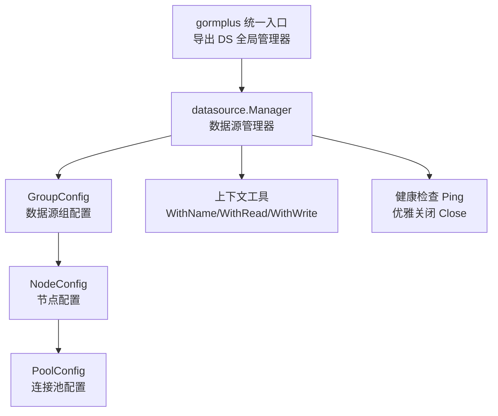
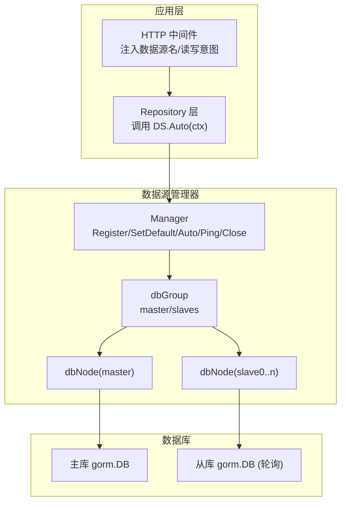
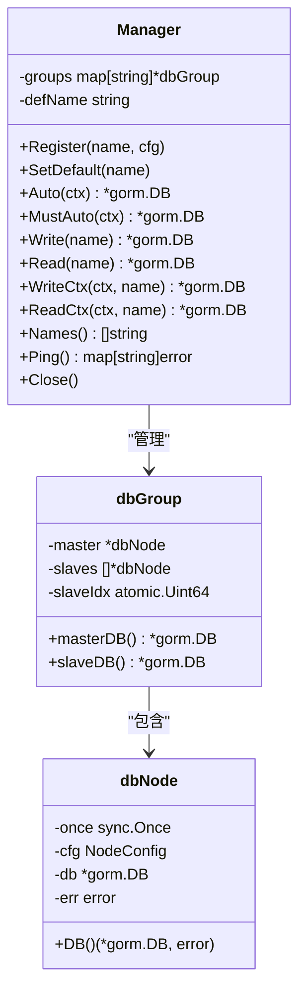
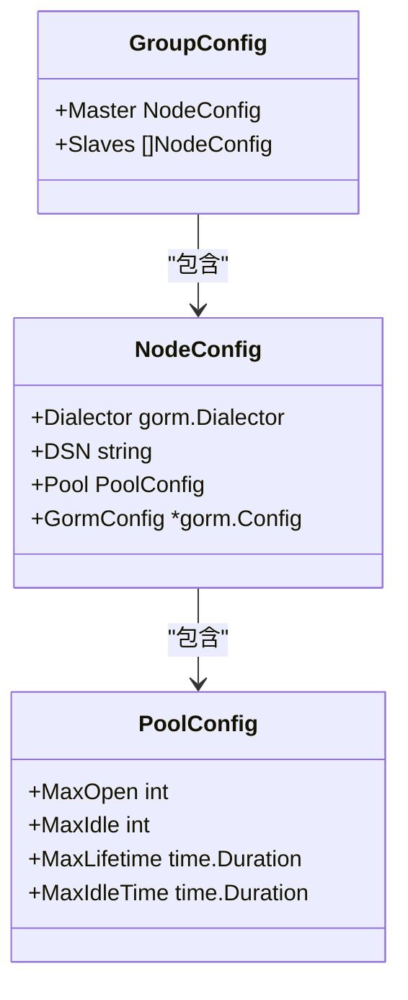
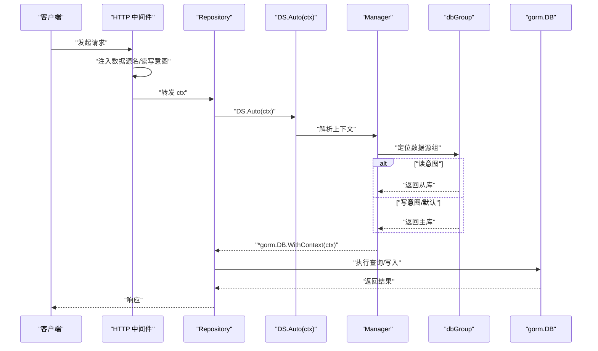
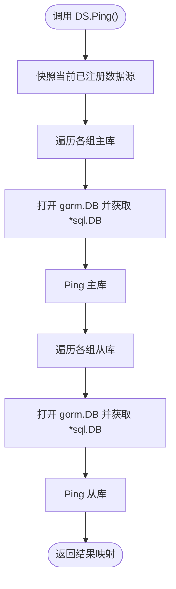
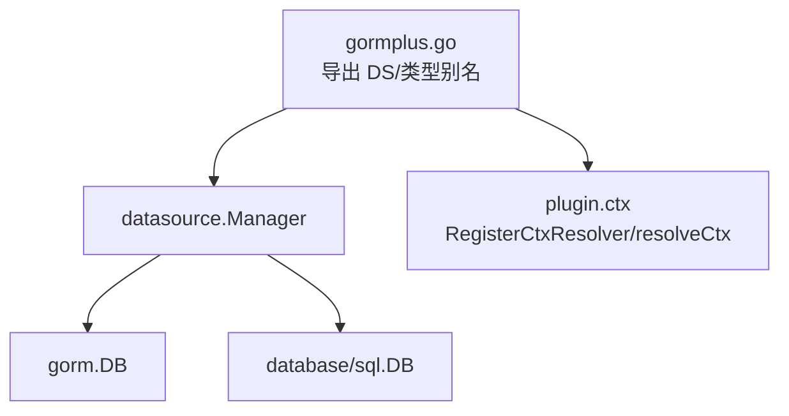

# 数据源管理 API

<cite>
**本文引用的文件**
- [gormplus.go](file://gormplus.go)
- [manager.go](file://datasource/manager.go)
- [README.md](file://README.md)
- [ctx.go](file://plugin/ctx.go)
</cite>

## 目录
1. [简介](#简介)
2. [项目结构](#项目结构)
3. [核心组件](#核心组件)
4. [架构概览](#架构概览)
5. [详细组件分析](#详细组件分析)
6. [依赖分析](#依赖分析)
7. [性能考虑](#性能考虑)
8. [故障排查指南](#故障排查指南)
9. [结论](#结论)
10. [附录](#附录)

## 简介
本文件为多数据源管理模块的详细 API 参考文档，覆盖数据源注册、配置管理、自动切换、读写分离、主从切换、上下文传递、健康检查与优雅关闭等完整能力。文档面向不同技术背景的读者，既提供高层概览，也给出代码级的结构图与流程图，帮助快速理解与落地使用。

## 项目结构
多数据源管理模块位于 datasource 子包，通过 gormplus 统一入口导出，核心为 Manager 类型及其配套的上下文工具函数。README 提供了完整的使用示例与最佳实践。

图表来源
- [gormplus.go:155-214](file://gormplus.go#L155-L214)
- [manager.go:246-251](file://datasource/manager.go#L246-L251)
- [manager.go:205-211](file://datasource/manager.go#L205-L211)
- [manager.go:173-203](file://datasource/manager.go#L173-L203)
- [manager.go:151-169](file://datasource/manager.go#L151-L169)
- [manager.go:539-578](file://datasource/manager.go#L539-L578)

章节来源
- [gormplus.go:129-214](file://gormplus.go#L129-L214)
- [manager.go:15-148](file://datasource/manager.go#L15-L148)
- [README.md:139-217](file://README.md#L139-L217)

## 核心组件
- 数据源管理器：提供注册、自动切换、读写分离、健康检查、优雅关闭等能力。
- 数据源组配置：支持一主多从，主库必填，从库可选。
- 节点配置：支持 Dialector（推荐）或 DSN（向后兼容）。
- 连接池配置：支持 MaxOpen、MaxIdle、MaxLifetime、MaxIdleTime。
- 上下文工具：在中间件中注入数据源名与读写意图，供 Auto 自动决策。

章节来源
- [manager.go:246-251](file://datasource/manager.go#L246-L251)
- [manager.go:205-211](file://datasource/manager.go#L205-L211)
- [manager.go:173-203](file://datasource/manager.go#L173-L203)
- [manager.go:151-169](file://datasource/manager.go#L151-L169)
- [manager.go:539-578](file://datasource/manager.go#L539-L578)

## 架构概览
多数据源管理器采用“命名数据源 + 上下文自动切换”的设计，结合读写分离与从库轮询，实现高性能与易用性的平衡。

图表来源
- [manager.go:246-251](file://datasource/manager.go#L246-L251)
- [manager.go:227-242](file://datasource/manager.go#L227-L242)
- [manager.go:222-225](file://datasource/manager.go#L222-L225)
- [manager.go:394-430](file://datasource/manager.go#L394-L430)

## 详细组件分析

### 数据源管理器（Manager）
- 职责：注册命名数据源组、自动切换（根据上下文）、读写分离、健康检查、优雅关闭。
- 并发：内部使用互斥锁保护注册表，读多写少场景性能良好。
- 默认行为：首次注册的数据源名为默认数据源；Auto 无上下文标记时走主库。

图表来源
- [manager.go:246-251](file://datasource/manager.go#L246-L251)
- [manager.go:227-242](file://datasource/manager.go#L227-L242)
- [manager.go:215-225](file://datasource/manager.go#L215-L225)

章节来源
- [manager.go:258-284](file://datasource/manager.go#L258-L284)
- [manager.go:288-332](file://datasource/manager.go#L288-L332)
- [manager.go:336-380](file://datasource/manager.go#L336-L380)
- [manager.go:383-442](file://datasource/manager.go#L383-L442)

### 数据源组与节点配置
- GroupConfig：包含 Master（必填）与 Slaves（可选）。
- NodeConfig：支持 Dialector（推荐）与 DSN（向后兼容），并可配置 Pool 与 GormConfig。
- 连接池：支持 MaxOpen、MaxIdle、MaxLifetime、MaxIdleTime；未设置时使用默认推荐值。

图表来源
- [manager.go:205-211](file://datasource/manager.go#L205-L211)
- [manager.go:173-203](file://datasource/manager.go#L173-L203)
- [manager.go:151-169](file://datasource/manager.go#L151-L169)

章节来源
- [manager.go:173-203](file://datasource/manager.go#L173-L203)
- [manager.go:151-169](file://datasource/manager.go#L151-L169)

### 自动切换与读写分离
- Auto(ctx)：从上下文读取数据源名与读写意图，自动选择主库或从库（从库轮询）。
- 上下文工具：WithName、WithRead、WithWrite；IsRead、IsWrite 辅助判断。
- 读写分离：GET 请求建议 WithRead，其他请求 WithWrite；Auto 默认写意图。

图表来源
- [manager.go:288-332](file://datasource/manager.go#L288-L332)
- [manager.go:539-578](file://datasource/manager.go#L539-L578)

章节来源
- [manager.go:288-332](file://datasource/manager.go#L288-L332)
- [manager.go:539-578](file://datasource/manager.go#L539-L578)
- [README.md:179-215](file://README.md#L179-L215)

### 健康检查与优雅关闭
- Ping：遍历所有数据源节点（主库与从库），返回每个节点的连通性映射。
- Close：关闭所有数据源连接，建议在应用退出时调用。

图表来源
- [manager.go:394-430](file://datasource/manager.go#L394-L430)

章节来源
- [manager.go:394-430](file://datasource/manager.go#L394-L430)
- [manager.go:432-442](file://datasource/manager.go#L432-L442)

### 上下文解析器（与框架解耦）
- 为不同框架（如 gin、go-zero、fiber）提供统一的 ctx 解析能力，确保插件能从 Request.Context 中读取中间件写入的值。
- gormplus 层面提供 RegisterCtxResolver 注册解析器，插件层提供 resolveCtx 使用解析器。

章节来源
- [gormplus.go:105-125](file://gormplus.go#L105-L125)
- [ctx.go:16-43](file://plugin/ctx.go#L16-L43)

## 依赖分析
- gormplus 统一入口导出 DS（datasource.Manager）与相关类型别名。
- datasource.Manager 依赖 gorm 与 database/sql，内部通过懒连接与原子索引实现从库轮询。
- 上下文工具与解析器解耦框架差异，保证在 gin、go-zero、fiber 等环境下一致行为。

图表来源
- [gormplus.go:129-214](file://gormplus.go#L129-L214)
- [manager.go:3-13](file://datasource/manager.go#L3-L13)
- [ctx.go:16-43](file://plugin/ctx.go#L16-L43)

章节来源
- [gormplus.go:129-214](file://gormplus.go#L129-L214)
- [manager.go:3-13](file://datasource/manager.go#L3-L13)
- [ctx.go:16-43](file://plugin/ctx.go#L16-L43)

## 性能考虑
- 连接池参数建议：MaxOpen≈CPU×4~8，MaxIdle≈MaxOpen/2，MaxLifetime<MySQL wait_timeout，MaxIdleTime 适中。
- 从库轮询：dbGroup 使用原子计数器实现简单公平轮询，适合读多写少场景。
- 懒连接：首次 Write/Read 时才建立连接，减少启动阻塞。
- 健康检查：Ping 仅用于运维监控，不建议在高频路径中频繁调用。

章节来源
- [manager.go:163-169](file://datasource/manager.go#L163-L169)
- [manager.go:236-242](file://datasource/manager.go#L236-L242)
- [manager.go:456-490](file://datasource/manager.go#L456-L490)

## 故障排查指南
- 未注册数据源：Auto(ctx) 返回“未找到数据源名且未设置默认数据源”或“数据源未注册”错误。
- 未设置 Dialector：NodeConfig.Dialector 为空且 DSN 为空时会触发错误；建议使用 Dialector 明确驱动。
- 从库不可用：Ping 返回对应节点错误；检查从库连通性与网络策略。
- 上下文未注入：未调用 WithName/WithRead/WithWrite 导致 Auto 无法识别读写意图；建议在中间件统一注入。

章节来源
- [manager.go:261-277](file://datasource/manager.go#L261-L277)
- [manager.go:299-322](file://datasource/manager.go#L299-L322)
- [manager.go:456-490](file://datasource/manager.go#L456-L490)

## 结论
多数据源管理模块通过“命名数据源 + 上下文自动切换 + 读写分离 + 健康检查 + 优雅关闭”的组合，提供了灵活、高性能、易维护的多数据源解决方案。结合 README 的示例与本 API 参考，可在 Gin、Go-Zero、Fiber 等框架中快速落地。

## 附录

### API 一览（按类别）
- 注册与管理
  - Register(name, cfg)
  - SetDefault(name)
  - Names()
  - Close()
- 自动切换
  - Auto(ctx) → *gorm.DB
  - MustAuto(ctx) → *gorm.DB
- 显式指定
  - Write(name) / Read(name)
  - WriteCtx(ctx, name) / ReadCtx(ctx, name)
  - MustWrite(name)
- 健康检查
  - Ping() → map[string]error
- 上下文工具
  - WithName(ctx, name)
  - WithRead(ctx) / WithWrite(ctx)
  - IsRead(ctx) / IsWrite(ctx)
  - NameFromCtx(ctx)

章节来源
- [manager.go:258-284](file://datasource/manager.go#L258-L284)
- [manager.go:288-332](file://datasource/manager.go#L288-L332)
- [manager.go:336-380](file://datasource/manager.go#L336-L380)
- [manager.go:394-430](file://datasource/manager.go#L394-L430)
- [manager.go:539-578](file://datasource/manager.go#L539-L578)

### 使用示例（来自 README）
- 注册数据源（MySQL/PostgreSQL/SQLite/SQLServer）
- 中间件注入数据源名与读写意图
- Repository 层通过 DS.Auto(ctx) 获取 DB
- 健康检查 DS.Ping()

章节来源
- [README.md:143-215](file://README.md#L143-L215)