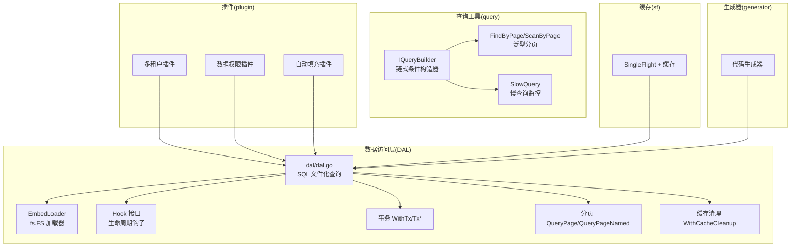
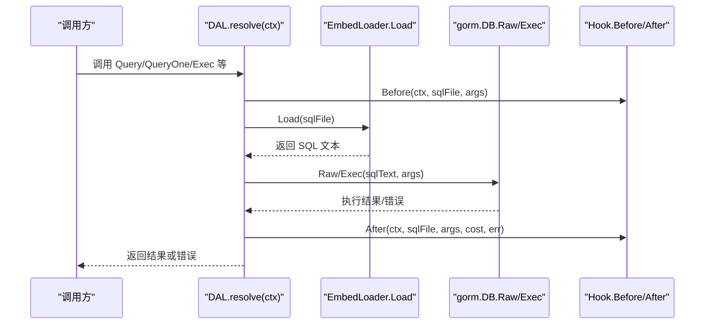
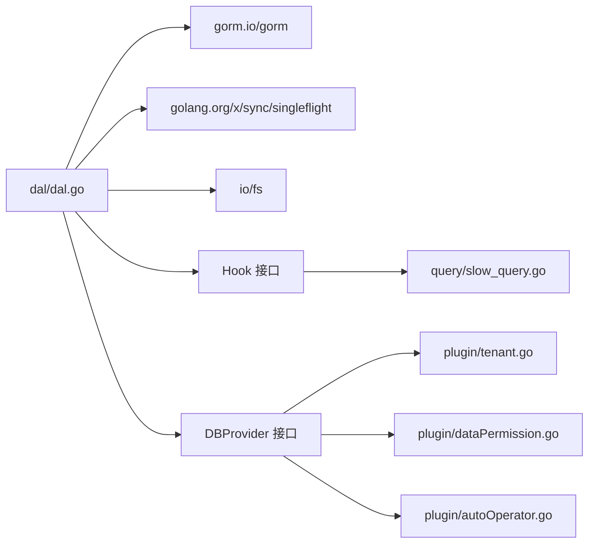
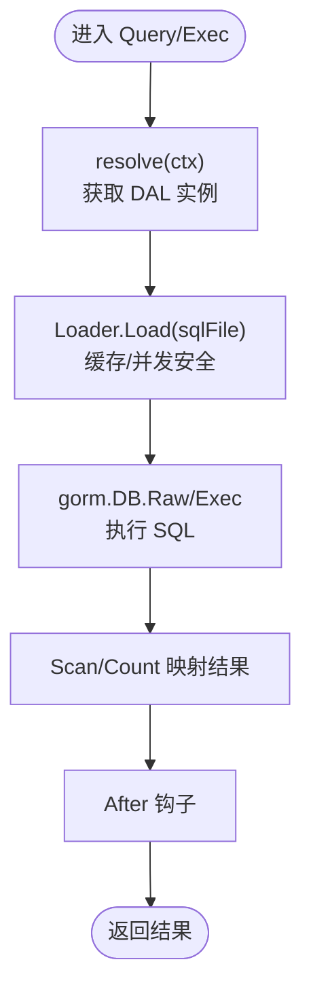

# 数据访问层 API

<cite>
**本文引用的文件**
- [dal/dal.go](file://dal/dal.go)
- [dal/dal_test.go](file://dal/dal_test.go)
- [query/query_builder.go](file://query/query_builder.go)
- [query/query_option.go](file://query/query_option.go)
- [query/utils.go](file://query/utils.go)
- [query/slow_query.go](file://query/slow_query.go)
- [plugin/tenant.go](file://plugin/tenant.go)
- [plugin/dataPermission.go](file://plugin/dataPermission.go)
- [plugin/autoOperator.go](file://plugin/autoOperator.go)
- [sf/sf.go](file://sf/sf.go)
- [generator/generator.go](file://generator/generator.go)
- [generator/config.go](file://generator/config.go)
- [generator/template/mapper_template.txt](file://generator/template/mapper_template.txt)
- [generator/template/repository_template.txt](file://generator/template/repository_template.txt)
- [generator/template/api_template.txt](file://generator/template/api_template.txt)
- [generator/template/dto_template.txt](file://generator/template/dto_template.txt)
- [generator/template/vo_template.txt](file://generator/template/vo_template.txt)
- [generator/template/repository_gen_template.txt](file://generator/template/repository_gen_template.txt)
- [version.go](file://version.go)
- [gormplus.go](file://gormplus.go)
- [README.md](file://README.md)
</cite>

## 目录
1. [简介](#简介)
2. [项目结构](#项目结构)
3. [核心组件](#核心组件)
4. [架构概览](#架构概览)
5. [详细组件分析](#详细组件分析)
6. [依赖分析](#依赖分析)
7. [性能考虑](#性能考虑)
8. [故障排查指南](#故障排查指南)
9. [结论](#结论)
10. [附录](#附录)

## 简介
本文件为数据访问层（DAL）模块的详细 API 参考文档，聚焦 SQL 文件化查询的实现机制与使用方法，涵盖泛型查询、事务处理、分页查询、缓存管理、Hook 生命周期钩子、多数据源支持等能力，并对比传统 DAO 模式，阐述其优势与最佳实践。

## 项目结构
- dal：SQL 文件化查询核心实现，提供包级函数与实例化 API，支持嵌入式 SQL 文件加载、泛型结果映射、事务、分页、Hook、缓存清理等。
- query：原生 gorm 链式条件构造器、分页扫描、慢查询监控插件等。
- plugin：多租户、数据权限、自动填充等 gorm 插件。
- sf：SingleFlight + 可插拔缓存（防缓存击穿）。
- generator：代码生成器（Model/Repository/API/DTO/VO 等）。
- gormplus.go：统一入口，聚合导出各模块能力。
- README.md：快速开始与使用说明。

图表来源
- [dal/dal.go:113-182](file://dal/dal.go#L113-L182)
- [query/query_builder.go:66-145](file://query/query_builder.go#L66-L145)
- [query/slow_query.go:91-109](file://query/slow_query.go#L91-L109)
- [plugin/tenant.go:355-381](file://plugin/tenant.go#L355-L381)
- [plugin/dataPermission.go:140-162](file://plugin/dataPermission.go#L140-L162)
- [plugin/autoOperator.go:190-208](file://plugin/autoOperator.go#L190-L208)
- [sf/sf.go:1-200](file://sf/sf.go#L1-L200)
- [generator/generator.go:1-200](file://generator/generator.go#L1-L200)

章节来源
- [README.md:1-110](file://README.md#L1-L110)

## 核心组件
- SQL 文件加载器（EmbedLoader）：基于 fs.FS（embed.FS）加载 SQL，带缓存与 singleflight 防击穿。
- DAL 实例：封装 DBProvider、SQLLoader、选项（Debug/Hook/缓存清理）。
- 泛型查询 API：Query、QueryOne、QueryNamed、QueryOneNamed、Count、QueryPage、QueryPageNamed。
- 事务 API：WithTx、TxQuery、TxQueryOne、TxQueryNamed、TxCount、TxExec。
- Hook 生命周期：Before/After，支持慢 SQL 监控、指标上报、链路追踪等。
- 多数据源：WithDB 注入上下文，Provider 动态切换。
- 缓存清理：WithCacheCleanup 定时清理 SQL 缓存。

章节来源
- [dal/dal.go:89-182](file://dal/dal.go#L89-L182)
- [dal/dal.go:287-430](file://dal/dal.go#L287-L430)
- [dal/dal.go:572-829](file://dal/dal.go#L572-L829)
- [dal/dal.go:1022-1121](file://dal/dal.go#L1022-L1121)
- [dal/dal.go:1144-1444](file://dal/dal.go#L1144-L1444)
- [dal/dal.go:188-220](file://dal/dal.go#L188-L220)
- [dal/dal.go:432-461](file://dal/dal.go#L432-L461)
- [dal/dal.go:265-281](file://dal/dal.go#L265-L281)

## 架构概览
DAL 采用“SQL 文件化 + 泛型 + Hook + 事务 + 缓存”的架构设计，核心流程：
- 初始化：NewDal/NewWithProvider 注册 DBProvider、SQLLoader、选项。
- 查询：resolve(ctx) 获取实例，Loader.Load 加载 SQL，GORM Raw 执行，Scan 结果映射。
- 事务：WithTx 获取事务对象，Tx* 系列 API 在事务上下文中执行。
- Hook：Before/After 钩子贯穿查询生命周期，支持慢 SQL 监控等。
- 缓存：EmbedLoader 缓存 SQL，WithCacheCleanup 定时清理。

图表来源
- [dal/dal.go:594-628](file://dal/dal.go#L594-L628)
- [dal/dal.go:853-912](file://dal/dal.go#L853-L912)
- [dal/dal.go:556-566](file://dal/dal.go#L556-L566)

## 详细组件分析

### SQL 文件化查询 API
- Query[T](ctx, sqlFile, args...)：位置参数查询多条记录，泛型自动映射。
- QueryOne[T](ctx, sqlFile, args...)：位置参数查询单条记录，返回指针或 nil。
- QueryNamed[T](ctx, sqlFile, params map[string]any)：命名参数查询多条记录。
- QueryOneNamed[T](ctx, sqlFile, params map[string]any)：命名参数查询单条记录。
- Count(ctx, sqlFile, args...)：查询数量，支持位置/命名参数。
- QueryPage[T](ctx, dataSqlFile, filterArgs []any, pageArgs []any)：分页查询，自动推导 count SQL。
- QueryPageNamed[T](ctx, dataSqlFile, params map[string]any)：命名参数分页查询。

参数与返回值
- 泛型 T：结果类型，支持 VO/DTO 等结构体。
- args...：位置参数（?）。
- params：命名参数（@name）。
- filterArgs/pageArgs：分页过滤参数与分页参数（LIMIT/OFFSET）。

章节来源
- [dal/dal.go:572-628](file://dal/dal.go#L572-L628)
- [dal/dal.go:630-691](file://dal/dal.go#L630-L691)
- [dal/dal.go:693-762](file://dal/dal.go#L693-L762)
- [dal/dal.go:764-829](file://dal/dal.go#L764-L829)
- [dal/dal.go:918-975](file://dal/dal.go#L918-L975)
- [dal/dal.go:1022-1051](file://dal/dal.go#L1022-L1051)
- [dal/dal.go:1053-1115](file://dal/dal.go#L1053-L1115)

### 事务处理 API
- WithTx(ctx, fn)：开启事务，返回 nil 提交，error 回滚。
- TxQuery[T]、TxQueryOne[T]、TxQueryNamed[T]：事务内查询。
- TxCount(ctx, tx, sqlFile, args...)：事务内查询数量。
- TxExec(ctx, tx, sqlFile, args...)：事务内执行 SQL。

章节来源
- [dal/dal.go:1127-1149](file://dal/dal.go#L1127-L1149)
- [dal/dal.go:1151-1207](file://dal/dal.go#L1151-L1207)
- [dal/dal.go:1209-1274](file://dal/dal.go#L1209-L1274)
- [dal/dal.go:1276-1338](file://dal/dal.go#L1276-L1338)
- [dal/dal.go:1340-1391](file://dal/dal.go#L1340-L1391)
- [dal/dal.go:1393-1444](file://dal/dal.go#L1393-L1444)

### Hook 生命周期与慢查询监控
- Hook 接口：Before(ctx, sqlFile, args)、After(ctx, sqlFile, args, cost, err)。
- WithHook(option)：注册多个 Hook，按注册顺序执行。
- 慢查询监控：RegisterSlowQuery(db, cfg) 基于 gorm Callback 钩子，支持阈值、自定义 Logger、traceID 透传。

章节来源
- [dal/dal.go:188-220](file://dal/dal.go#L188-L220)
- [dal/dal.go:251-263](file://dal/dal.go#L251-L263)
- [query/slow_query.go:91-109](file://query/slow_query.go#L91-L109)
- [query/slow_query.go:113-161](file://query/slow_query.go#L113-L161)

### 多数据源与上下文切换
- DBProvider 接口：Get(ctx) 返回 *gorm.DB。
- NewWithProvider：自定义 Provider，支持读写分离、多租户等。
- WithDB(ctx, d)：将指定 DAL 实例注入 context，后续调用自动使用该实例。

章节来源
- [dal/dal.go:89-108](file://dal/dal.go#L89-L108)
- [dal/dal.go:353-391](file://dal/dal.go#L353-L391)
- [dal/dal.go:432-461](file://dal/dal.go#L432-L461)

### 缓存管理与预热
- EmbedLoader：基于 fs.FS 的 SQL 加载器，带缓存与 singleflight。
- WithCacheCleanup(interval)：定时清理 SQL 缓存。
- Preload(files...)：应用启动时预热 SQL 文件，提前暴露路径错误。

章节来源
- [dal/dal.go:114-182](file://dal/dal.go#L114-L182)
- [dal/dal.go:265-281](file://dal/dal.go#L265-L281)
- [dal/dal.go:463-492](file://dal/dal.go#L463-L492)

### 与传统 DAO 模式的差异与优势
- SQL 文件化：SQL 与业务逻辑分离，便于 DBA 审核、版本管理、复杂 SQL 管理。
- 泛型查询：无需手动类型断言，自动映射到 VO/DTO。
- 位置参数与命名参数：灵活传参，命名参数适合参数较多场景。
- 事务与 Hook：统一事务入口与生命周期钩子，便于监控与审计。
- 多数据源：通过 Provider 与 WithDB 实现透明切换。
- 缓存与清理：SQL 文件缓存 + 定时清理，避免内存无限增长。
- 与链式条件构造器互补：复杂 SQL 用 DAL，简单条件用 query/IQueryBuilder。

章节来源
- [README.md:696-800](file://README.md#L696-L800)
- [query/query_builder.go:46-64](file://query/query_builder.go#L46-L64)

## 依赖分析
- DAL 依赖 GORM（Raw/Exec/Scan）、golang.org/x/sync/singleflight（防击穿）。
- Hook 与慢查询监控依赖 gorm Callback。
- 多数据源通过 Provider 抽象，支持读写分离与多租户。
- 缓存清理通过后台 goroutine 定时执行。

图表来源
- [dal/dal.go:71-83](file://dal/dal.go#L71-L83)
- [query/slow_query.go:4-11](file://query/slow_query.go#L4-L11)
- [plugin/tenant.go:131-141](file://plugin/tenant.go#L131-L141)
- [plugin/dataPermission.go:129-141](file://plugin/dataPermission.go#L129-L141)
- [plugin/autoOperator.go:179-189](file://plugin/autoOperator.go#L179-L189)

章节来源
- [dal/dal.go:71-83](file://dal/dal.go#L71-L83)
- [query/slow_query.go:4-11](file://query/slow_query.go#L4-L11)
- [plugin/tenant.go:131-141](file://plugin/tenant.go#L131-L141)
- [plugin/dataPermission.go:129-141](file://plugin/dataPermission.go#L129-L141)
- [plugin/autoOperator.go:179-189](file://plugin/autoOperator.go#L179-L189)

## 性能考虑
- SQL 缓存：EmbedLoader 内置缓存，避免重复读取 fs.FS；WithCacheCleanup 定时清理，防止内存膨胀。
- singleflight：同一 SQL 并发请求合并，减少重复解析与执行。
- 分页优化：QueryPage 自动推导 count SQL，避免重复 SQL；Count 与数据 SQL 参数分离。
- Hook 成本：Debug 模式会打印 SQL、参数、耗时，生产环境建议关闭。
- 事务：WithTx 统一封装事务，避免重复开启/关闭带来的开销。
- 缓存策略：结合 SF（SingleFlight + 可插拔缓存）实现热点查询的缓存与防击穿。

章节来源
- [dal/dal.go:150-174](file://dal/dal.go#L150-L174)
- [dal/dal.go:265-281](file://dal/dal.go#L265-L281)
- [dal/dal.go:1022-1051](file://dal/dal.go#L1022-L1051)
- [dal/dal.go:235-249](file://dal/dal.go#L235-L249)

## 故障排查指南
常见问题与定位方法
- 未初始化：调用包级函数前未调用 NewDal/NewWithProvider，会 panic。解决：确保初始化后使用包级函数。
- SQL 文件不存在：Loader.Load 报错。解决：确认 embed 路径与文件名一致。
- 返回零行：Debug 模式打印 WARN，检查 SQL 路径与过滤条件。
- 事务异常：WithTx 返回 error 时自动回滚；检查 Tx* API 的参数与 SQL。
- Hook 未生效：确认 WithHook 注册顺序与 SQL 文件路径正确。
- 多数据源切换：确认 WithDB 注入与 Provider 实现正确。

章节来源
- [dal/dal_test.go:310-321](file://dal/dal_test.go#L310-L321)
- [dal/dal_test.go:213-220](file://dal/dal_test.go#L213-L220)
- [dal/dal_test.go:284-298](file://dal/dal_test.go#L284-L298)
- [dal/dal_test.go:859-869](file://dal/dal_test.go#L859-L869)
- [dal/dal_test.go:964-983](file://dal/dal_test.go#L964-L983)
- [dal/dal_test.go:226-262](file://dal/dal_test.go#L226-L262)

## 结论
DAL 模块通过 SQL 文件化、泛型查询、Hook、事务、缓存与多数据源支持，提供了稳定、可维护、高性能的数据访问方案。相比传统 DAO，它更适合复杂 SQL、强审计与多数据源场景，且与链式条件构造器形成互补，满足不同业务需求。

## 附录

### API 方法签名与参数说明（摘录）
- Query[T](ctx, sqlFile, args...): 泛型查询多条记录。
- QueryOne[T](ctx, sqlFile, args...): 泛型查询单条记录。
- QueryNamed[T](ctx, sqlFile, params): 命名参数查询多条记录。
- QueryOneNamed[T](ctx, sqlFile, params): 命名参数查询单条记录。
- Count(ctx, sqlFile, args...): 查询数量。
- QueryPage[T](ctx, dataSqlFile, filterArgs, pageArgs): 分页查询。
- QueryPageNamed[T](ctx, dataSqlFile, params): 命名参数分页查询。
- WithTx(ctx, fn): 事务入口。
- TxQuery[T]/TxQueryOne[T]/TxQueryNamed[T]/TxCount/TxExec: 事务内查询与执行。
- WithHook/Hook 接口：Before/After 生命周期钩子。
- WithCacheCleanup(interval): 定时清理 SQL 缓存。
- Preload(files...): 预热 SQL 文件。
- WithDB(ctx, d): 多数据源注入。

章节来源
- [dal/dal.go:572-829](file://dal/dal.go#L572-L829)
- [dal/dal.go:918-1115](file://dal/dal.go#L918-L1115)
- [dal/dal.go:1127-1444](file://dal/dal.go#L1127-L1444)
- [dal/dal.go:188-220](file://dal/dal.go#L188-L220)
- [dal/dal.go:265-281](file://dal/dal.go#L265-L281)
- [dal/dal.go:463-492](file://dal/dal.go#L463-L492)
- [dal/dal.go:432-461](file://dal/dal.go#L432-L461)

### SQL 文件加载与执行流程

图表来源
- [dal/dal.go:594-628](file://dal/dal.go#L594-L628)
- [dal/dal.go:853-912](file://dal/dal.go#L853-L912)
- [dal/dal.go:556-566](file://dal/dal.go#L556-L566)

### 与链式条件构造器的对比
- 链式条件构造器（query/IQueryBuilder）：适合简单条件拼装、联表查询、泛型分页（FindByPage/ScanByPage）。
- SQL 文件化（DAL）：适合复杂 SQL、DBA 审核、版本管理、命名参数与分页自动推导。

章节来源
- [query/query_builder.go:46-64](file://query/query_builder.go#L46-L64)
- [query/query_builder.go:246-306](file://query/query_builder.go#L246-L306)
- [README.md:219-283](file://README.md#L219-L283)