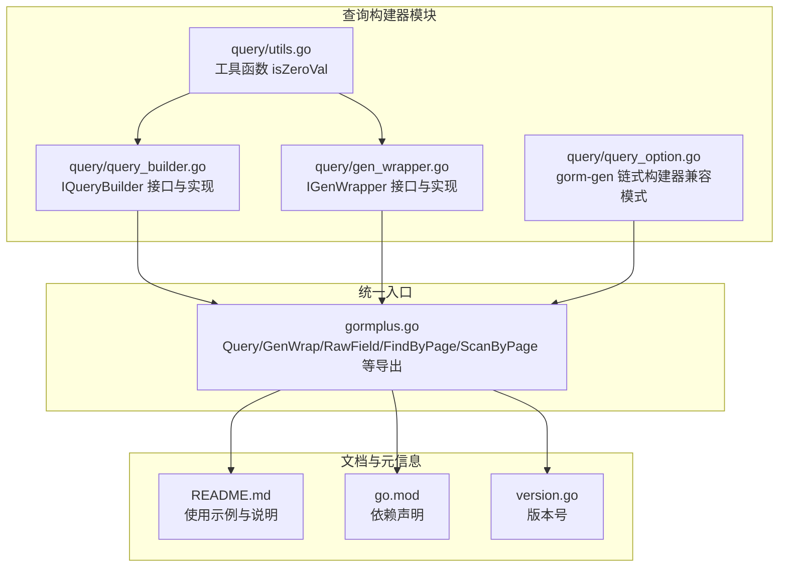
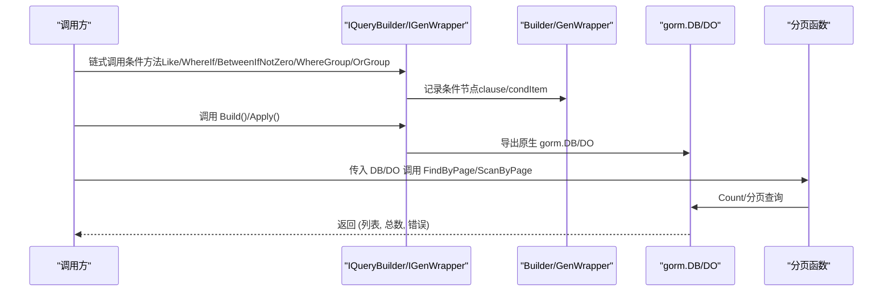
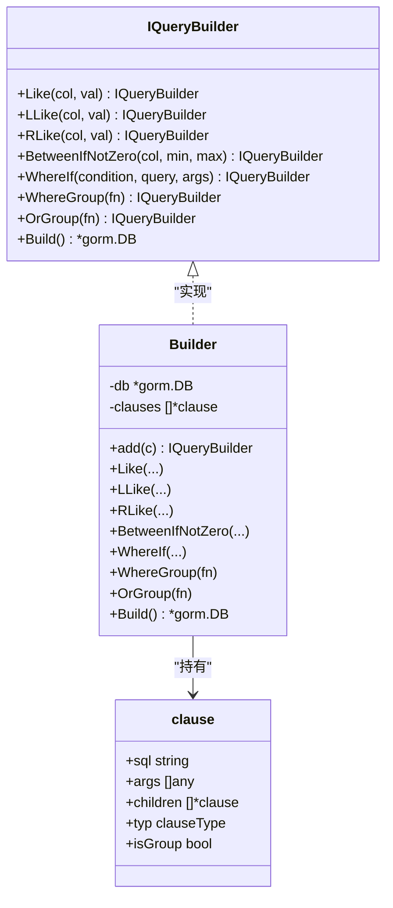
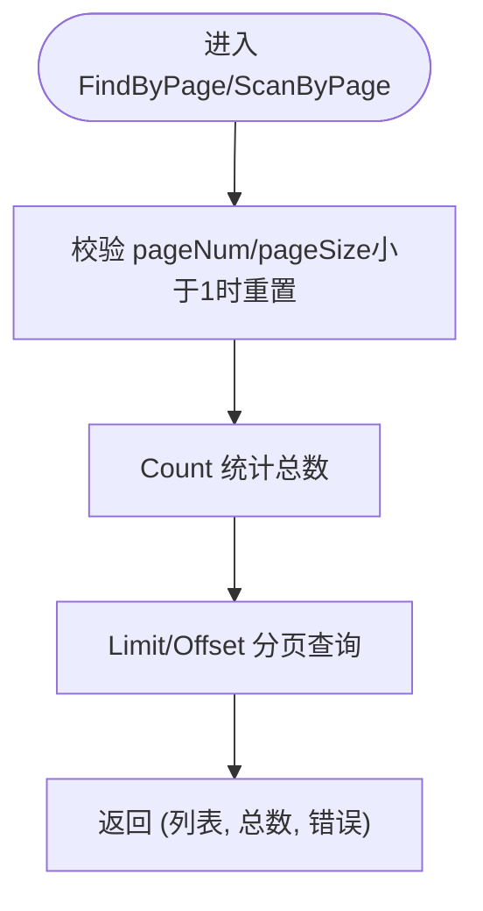
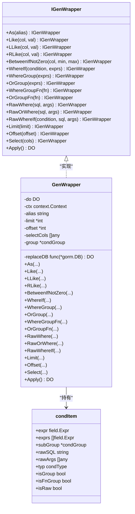
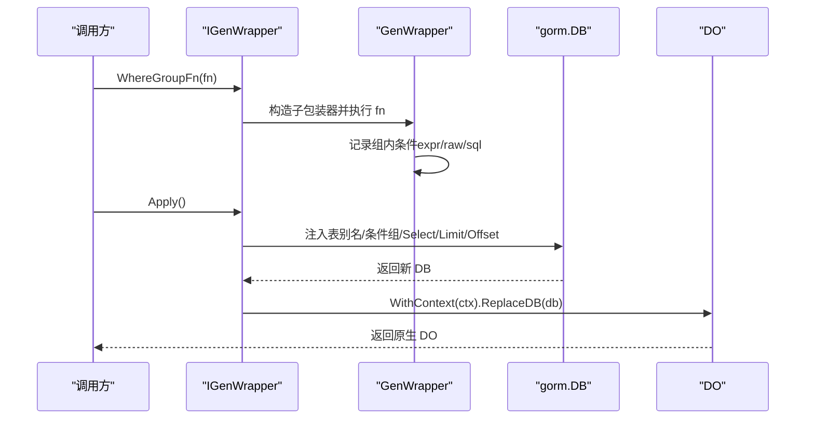

# 查询构建器 API

<cite>
**本文引用的文件**
- [query/query_builder.go](file://query/query_builder.go)
- [query/gen_wrapper.go](file://query/gen_wrapper.go)
- [query/query_option.go](file://query/query_option.go)
- [query/utils.go](file://query/utils.go)
- [gormplus.go](file://gormplus.go)
- [README.md](file://README.md)
- [go.mod](file://go.mod)
- [version.go](file://version.go)
</cite>

## 目录
1. [简介](#简介)
2. [项目结构](#项目结构)
3. [核心组件](#核心组件)
4. [架构概览](#架构概览)
5. [详细组件分析](#详细组件分析)
6. [依赖分析](#依赖分析)
7. [性能考虑](#性能考虑)
8. [故障排查指南](#故障排查指南)
9. [结论](#结论)
10. [附录](#附录)

## 简介
本文件为 gorm-plus 查询构建器模块的完整 API 参考文档，聚焦以下能力：
- 原生 gorm 链式条件构造器 IQueryBuilder：链式条件拼装、模糊查询、范围查询、条件分组、Build 导出原生 gorm.DB。
- gorm-gen 类型安全链式构造器 IGenWrapper：Wrap 入口、模糊查询、范围查询、简单/函数分组、原生 SQL 条件、表别名、Apply 导出原生 DO。
- 泛型分页查询 FindByPage 与 ScanByPage：统一分页流程，自动 Count 并分页读取。
- RawField 原生字段处理：在 gorm-gen 场景中构造原生 SQL 片段。
- 与原生 GORM 的兼容性与扩展能力：所有扩展方法均在 Build/Apply 后无缝衔接原生 API。

## 项目结构
查询构建器相关代码主要位于 query 子包，并通过 gormplus.go 提供统一入口导出。

图表来源
- [query/query_builder.go:1-307](file://query/query_builder.go#L1-L307)
- [query/gen_wrapper.go:1-543](file://query/gen_wrapper.go#L1-L543)
- [query/query_option.go:1-199](file://query/query_option.go#L1-L199)
- [query/utils.go:1-44](file://query/utils.go#L1-L44)
- [gormplus.go:1-800](file://gormplus.go#L1-L800)
- [README.md:1-891](file://README.md#L1-L891)
- [go.mod:1-26](file://go.mod#L1-L26)
- [version.go:1-4](file://version.go#L1-L4)

章节来源
- [query/query_builder.go:1-307](file://query/query_builder.go#L1-L307)
- [query/gen_wrapper.go:1-543](file://query/gen_wrapper.go#L1-L543)
- [query/query_option.go:1-199](file://query/query_option.go#L1-L199)
- [query/utils.go:1-44](file://query/utils.go#L1-L44)
- [gormplus.go:1-800](file://gormplus.go#L1-L800)
- [README.md:1-891](file://README.md#L1-L891)
- [go.mod:1-26](file://go.mod#L1-L26)
- [version.go:1-4](file://version.go#L1-L4)

## 核心组件
- IQueryBuilder：原生 gorm 扩展条件构造器接口，提供 Like/LLike/RLike、BetweenIfNotZero、WhereIf、WhereGroup/OrGroup、Build 等方法，最终导出原生 gorm.DB。
- IGenWrapper：gorm-gen 类型安全扩展条件构造器接口，提供 As、Like/LLike/RLike、BetweenIfNotZero、WhereIf、WhereGroup/OrGroup、WhereGroupFn/OrGroupFn、RawWhere/RawOrWhere/RawWhereIf、Limit/Offset/Select、Apply 等方法，最终导出原生 DO。
- 泛型分页：FindByPage 与 ScanByPage，统一处理分页与总数统计。
- RawField：在 gorm-gen 场景中构造原生 SQL 片段，配合 Select/Where 等使用。
- 工具函数：isZeroVal 用于判断零值，支撑 BetweenIfNotZero 等“零值跳过”逻辑。

章节来源
- [query/query_builder.go:66-145](file://query/query_builder.go#L66-L145)
- [query/gen_wrapper.go:165-319](file://query/gen_wrapper.go#L165-L319)
- [query/query_builder.go:244-306](file://query/query_builder.go#L244-L306)
- [query/gen_wrapper.go:537-543](file://query/gen_wrapper.go#L537-L543)
- [query/utils.go:6-43](file://query/utils.go#L6-L43)

## 架构概览
查询构建器采用“扩展条件收集 + 最终导出”的设计，分别面向原生 gorm 与 gorm-gen 两种使用场景，保持与原生 API 的完全兼容。

图表来源
- [query/query_builder.go:215-221](file://query/query_builder.go#L215-L221)
- [query/gen_wrapper.go:454-475](file://query/gen_wrapper.go#L454-L475)
- [query/query_builder.go:257-271](file://query/query_builder.go#L257-L271)
- [query/query_builder.go:292-306](file://query/query_builder.go#L292-L306)

## 详细组件分析

### IQueryBuilder 接口与实现
- 方法清单与行为
  - Like(col, val)：双侧模糊查询，空值自动跳过。
  - LLike(col, val)：左侧模糊查询，空值自动跳过。
  - RLike(col, val)：右侧模糊查询，空值自动跳过。
  - BetweenIfNotZero(col, min, max)：闭区间 [min,max]，任一零值时整体跳过。
  - WhereIf(condition, query, args...)：condition 为真时追加 AND 条件，支持占位符。
  - WhereGroup(fn)：将函数内条件用括号包裹后以 AND 连接。
  - OrGroup(fn)：将函数内条件用括号包裹后以 OR 连接。
  - Build()：结束扩展条件构建，返回原生 gorm.DB，可继续调用原生方法（Select/Joins/Order/Limit/Find/Count 等）。
- 数据结构
  - clause：内部条件节点，包含 SQL 模板、参数、子节点、类型（AND/OR）、是否分组等。
  - Builder：持有 gorm.DB 与条件节点切片，负责条件拼装与导出。
- SQL 构建
  - applyClause：递归处理条件节点，支持分组、OR/AND 连接、原生 SQL 注入。
- 泛型分页
  - FindByPage(q, pageNum, pageSize)：使用 Find，适合直接映射到模型结构体的列表查询。
  - ScanByPage(q, pageNum, pageSize)：使用 Scan，适合联表查询、自定义 SELECT 字段映射到 VO 的场景。
- 兼容性与扩展
  - 所有扩展方法在 Build() 后无缝衔接原生 gorm.DB 的所有能力。
  - 分页函数内部自动处理 pageNum/pageSize 边界与总数统计。

章节来源
- [query/query_builder.go:66-145](file://query/query_builder.go#L66-L145)
- [query/query_builder.go:149-242](file://query/query_builder.go#L149-L242)
- [query/query_builder.go:215-242](file://query/query_builder.go#L215-L242)
- [query/query_builder.go:244-306](file://query/query_builder.go#L244-L306)
- [query/utils.go:6-43](file://query/utils.go#L6-L43)

#### IQueryBuilder 类图

图表来源
- [query/query_builder.go:66-145](file://query/query_builder.go#L66-L145)
- [query/query_builder.go:149-242](file://query/query_builder.go#L149-L242)

#### IQueryBuilder 分页流程图

图表来源
- [query/query_builder.go:257-271](file://query/query_builder.go#L257-L271)
- [query/query_builder.go:292-306](file://query/query_builder.go#L292-L306)

### IGenWrapper 接口与实现
- 方法清单与行为
  - As(alias)：为当前模型设置表别名，便于联表查询时区分字段归属。
  - Like/LLike/RLike(col, val)：双侧/左侧/右侧模糊，空值自动跳过。
  - BetweenIfNotZero(col, min, max)：任一零值时整体跳过。
  - WhereIf(condition, exprs...)：condition 为真时追加一个或多个 AND 条件。
  - WhereGroup(exprs...) / OrGroup(exprs...)：简单分组，组内以 AND 连接。
  - WhereGroupFn(fn)/OrGroupFn(fn)：函数分组，组内可使用完整 wrapper 能力。
  - RawWhere/RawOrWhere/RawWhereIf(sql, args...)：原生 SQL 条件，支持占位符。
  - Limit/Offset/Select：在回调内限制行数、偏移与指定字段。
  - Apply()：结束扩展条件构建，返回原生 DO，可继续调用原生方法。
- 数据结构
  - condItem/condGroup：内部条件节点与组，支持普通表达式、简单分组、函数分组、原生 SQL。
  - GenWrapper：持有 DO、上下文、别名、限制与选择字段、条件组，负责条件拼装与导出。
- SQL 构建
  - applyCondGroup：递归处理条件组，支持分组、OR/AND 连接、原生 SQL 注入与表别名注入。
- RawField
  - RawField(sql, vars...)：构造原生字段，用于 SELECT/Where 等场景。
- 兼容性与扩展
  - 所有扩展方法在 Apply() 后无缝衔接原生 DO 的所有能力。
  - 通过 callFieldMethod 反射调用 gorm-gen 生成的列方法（如 Like/Between）。

章节来源
- [query/gen_wrapper.go:165-319](file://query/gen_wrapper.go#L165-L319)
- [query/gen_wrapper.go:321-475](file://query/gen_wrapper.go#L321-L475)
- [query/gen_wrapper.go:477-514](file://query/gen_wrapper.go#L477-L514)
- [query/gen_wrapper.go:537-543](file://query/gen_wrapper.go#L537-L543)

#### IGenWrapper 类图

图表来源
- [query/gen_wrapper.go:165-319](file://query/gen_wrapper.go#L165-L319)
- [query/gen_wrapper.go:321-475](file://query/gen_wrapper.go#L321-L475)

#### IGenWrapper 条件分组序列图

图表来源
- [query/gen_wrapper.go:414-422](file://query/gen_wrapper.go#L414-L422)
- [query/gen_wrapper.go:454-475](file://query/gen_wrapper.go#L454-L475)

### gorm-gen 链式构建器（兼容模式）
- QueryBuilder：提供 Where/Order/Select/Omit/Limit/WithSingleFlight/WithCache/MergeQueryOptions 等配置聚合能力，适合与 gorm-gen DO 组合使用。
- QueryOption：承载 Cond/Order/Select/OmitFields/Limit/SF/Cache 等配置项。
- 说明：该构建器与 IGenWrapper 不冲突，可根据场景选择使用。

章节来源
- [query/query_option.go:21-138](file://query/query_option.go#L21-L138)
- [query/query_option.go:140-199](file://query/query_option.go#L140-L199)

## 依赖分析
- 模块依赖
  - gorm-plus 通过 gormplus.go 统一导出查询构建器能力，内部依赖 query 子包。
  - query 子包依赖 gorm.io/gorm 与 gorm.io/gen（用于 IGenWrapper）。
- 版本与兼容
  - go.mod 指定 gorm.io/gorm v1.31.1、gorm.io/gen v0.3.27、gorm.io/driver/mysql v1.6.0 等。
  - README 与统一入口文档展示了与原生 GORM 的完全兼容性。

章节来源
- [go.mod:1-26](file://go.mod#L1-L26)
- [gormplus.go:86-101](file://gormplus.go#L86-L101)
- [README.md:1-891](file://README.md#L1-L891)

## 性能考虑
- 零值跳过：BetweenIfNotZero 与模糊查询均在零值时跳过条件，减少不必要的 SQL 条件拼装。
- 分页优化：FindByPage/ScanByPage 内部自动去除 ORDER BY 进行 Count，避免排序带来的额外开销。
- 原生兼容：所有扩展在 Build/Apply 后直接使用原生 gorm/gorm-gen 能力，避免额外封装成本。
- 建议：在高频查询场景结合 SF（SingleFlight + 可插拔缓存）使用，进一步降低数据库压力。

## 故障排查指南
- 条件未生效
  - 检查模糊查询参数是否为空字符串，空值会被自动跳过。
  - 检查 BetweenIfNotZero 的边界值是否为零值，零值会被自动跳过。
- 分组括号问题
  - WhereGroup/OrGroup 会自动加括号；若需要更复杂的组合，请使用 WhereGroupFn/OrGroupFn。
- 原生 SQL 注入
  - 使用 RawWhere/RawOrWhere/RawWhereIf 时确保参数绑定与占位符匹配，避免 SQL 注入风险。
- 分页异常
  - pageNum/pageSize 小于 1 时会被重置为默认值；确认分页参数是否符合预期。
- gorm-gen 反射调用
  - callFieldMethod 通过反射调用列方法，若列方法名不匹配可能导致返回空；请确认列表达式与方法名一致。

章节来源
- [query/query_builder.go:176-188](file://query/query_builder.go#L176-L188)
- [query/query_builder.go:186-188](file://query/query_builder.go#L186-L188)
- [query/gen_wrapper.go:424-437](file://query/gen_wrapper.go#L424-L437)
- [query/query_builder.go:257-271](file://query/query_builder.go#L257-L271)
- [query/gen_wrapper.go:518-535](file://query/gen_wrapper.go#L518-L535)

## 结论
gorm-plus 查询构建器模块提供了两类互补的链式条件构造方案：
- IQueryBuilder：面向原生 gorm 的扩展，语法简洁、零值跳过、分组清晰、与原生 API 完全兼容。
- IGenWrapper：面向 gorm-gen 的类型安全扩展，支持表别名、原生 SQL、函数分组与 Apply 导出原生 DO。
配合 FindByPage/ScanByPage 的泛型分页与 RawField 原生字段处理，能够覆盖从简单列表到复杂联表查询的广泛场景，并与原生 GORM 生态保持高度兼容。

## 附录

### API 一览（方法签名与说明）
- IQueryBuilder
  - Like(col, val)：双侧模糊，空值跳过。
  - LLike(col, val)：左侧模糊，空值跳过。
  - RLike(col, val)：右侧模糊，空值跳过。
  - BetweenIfNotZero(col, min, max)：闭区间 [min,max]，任一零值跳过。
  - WhereIf(condition, query, args...)：条件成立时追加 AND。
  - WhereGroup(fn)：AND 分组。
  - OrGroup(fn)：OR 分组。
  - Build()：导出原生 gorm.DB。
- 泛型分页
  - FindByPage(q, pageNum, pageSize)：返回 (列表, 总数, 错误)，使用 Find。
  - ScanByPage(q, pageNum, pageSize)：返回 (列表, 总数, 错误)，使用 Scan。
- IGenWrapper
  - As(alias)：设置表别名。
  - Like/LLike/RLike(col, val)：模糊查询，空值跳过。
  - BetweenIfNotZero(col, min, max)：范围查询，任一零值跳过。
  - WhereIf(condition, exprs...)：条件成立时追加 AND。
  - WhereGroup(exprs...) / OrGroup(exprs...)：简单分组。
  - WhereGroupFn(fn)/OrGroupFn(fn)：函数分组。
  - RawWhere/RawOrWhere/RawWhereIf(sql, args...)：原生 SQL 条件。
  - Limit/Offset/Select：限制行数、偏移与指定字段。
  - Apply()：导出原生 DO。
- RawField
  - RawField(sql, vars...)：构造原生字段。

章节来源
- [query/query_builder.go:66-145](file://query/query_builder.go#L66-L145)
- [query/query_builder.go:244-306](file://query/query_builder.go#L244-L306)
- [query/gen_wrapper.go:165-319](file://query/gen_wrapper.go#L165-L319)
- [query/gen_wrapper.go:537-543](file://query/gen_wrapper.go#L537-L543)

### 使用示例（路径引用）
- 原生 gorm 链式条件构造器
  - [README.md:219-272](file://README.md#L219-L272)
- gorm-gen 类型安全链式构造器
  - [README.md:286-327](file://README.md#L286-L327)
- 泛型分页（FindByPage/ScanByPage）
  - [README.md:220-256](file://README.md#L220-L256)
- RawField 使用
  - [README.md:340-346](file://README.md#L340-L346)