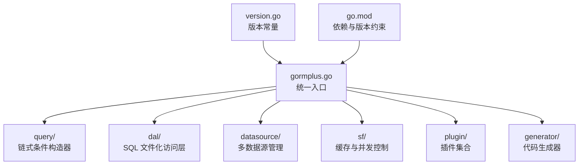
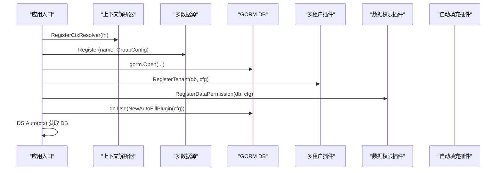
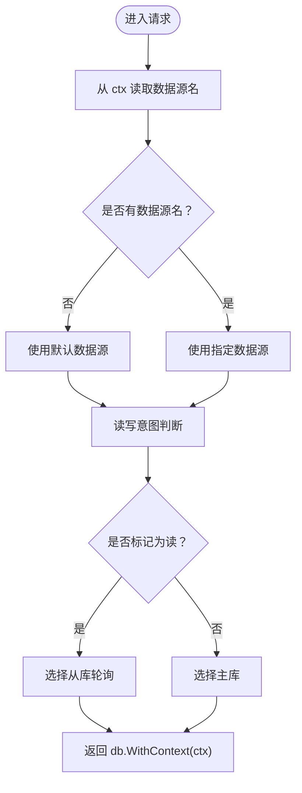
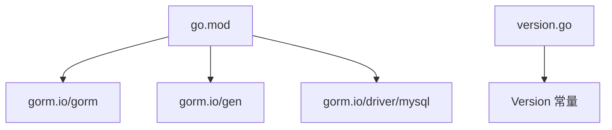

# 核心 API

<cite>
**本文引用的文件**
- [gormplus.go](file://gormplus.go)
- [version.go](file://version.go)
- [go.mod](file://go.mod)
- [README.md](file://README.md)
- [query/query_builder.go](file://query/query_builder.go)
- [dal/dal.go](file://dal/dal.go)
- [datasource/manager.go](file://datasource/manager.go)
- [sf/sf.go](file://sf/sf.go)
- [plugin/tenant.go](file://plugin/tenant.go)
- [plugin/dataPermission.go](file://plugin/dataPermission.go)
- [plugin/autoOperator.go](file://plugin/autoOperator.go)
- [plugin/ctx.go](file://plugin/ctx.go)
- [generator/config.go](file://generator/config.go)
- [generator/generator.go](file://generator/generator.go)
- [generator/example_test.go](file://generator/example_test.go)
</cite>

## 目录
1. [简介](#简介)
2. [项目结构](#项目结构)
3. [核心组件](#核心组件)
4. [架构总览](#架构总览)
5. [详细组件分析](#详细组件分析)
6. [依赖分析](#依赖分析)
7. [性能考虑](#性能考虑)
8. [故障排查指南](#故障排查指南)
9. [结论](#结论)
10. [附录](#附录)

## 简介
本文件为 GORM Plus 统一入口包的核心 API 参考文档，覆盖模块初始化、版本管理与全局配置相关的公开接口。内容面向工程实践，提供初始化顺序说明、版本兼容性信息、最佳实践建议，并通过图示与示例帮助读者正确集成与使用。

## 项目结构
GORM Plus 以统一入口包的形式对外暴露能力，内部按功能域拆分为多个子模块：
- 统一入口与导出：gormplus.go
- 版本常量：version.go
- 查询与链式条件：query/
- SQL 文件化访问层：dal/
- 多数据源管理：datasource/
- 缓存与并发控制：sf/
- 插件生态：plugin/（多租户、数据权限、自动填充、上下文解析）
- 代码生成器：generator/

图表来源
- [gormplus.go:1-120](file://gormplus.go#L1-L120)
- [version.go:1-4](file://version.go#L1-L4)
- [go.mod:1-26](file://go.mod#L1-L26)

章节来源
- [gormplus.go:1-120](file://gormplus.go#L1-L120)
- [version.go:1-4](file://version.go#L1-L4)
- [go.mod:1-26](file://go.mod#L1-L26)

## 核心组件
本节概述统一入口包提供的核心 API，按功能域分类并给出函数签名要点、参数说明、返回值与典型使用场景。

- 上下文解析器
  - RegisterCtxResolver(fn)：注册自定义 ctx 解析器，解决 Gin 等框架将 *gin.Context 传入 db.WithContext() 时插件无法读取 Request.Context() 的问题。仅在 Gin 项目中注册一次。
  - 使用场景：Gin 中间件写入 ctx 后，插件自动从 Request.Context() 读取。
  - 章节来源
    - [gormplus.go:105-125](file://gormplus.go#L105-L125)
    - [plugin/ctx.go:16-44](file://plugin/ctx.go#L16-L44)

- 多数据源管理
  - DS：全局多数据源管理器，支持一主多从、读写分离、自动切换。
  - DS.Register(name, GroupConfig)：注册命名数据源组。
  - DS.Auto(ctx)：根据 ctx 自动选择数据源与读写意图（读=从库，写=主库）。
  - DS.WithName(ctx, name) / DSWithRead(ctx) / DSWithWrite(ctx)：在中间件中写入数据源名与读写标记。
  - DS.Ping() / DS.Close()：健康检查与优雅关闭。
  - 使用场景：多业务库、读写分离、按请求自动路由。
  - 章节来源
    - [gormplus.go:127-214](file://gormplus.go#L127-L214)
    - [datasource/manager.go:286-333](file://datasource/manager.go#L286-L333)
    - [datasource/manager.go:539-579](file://datasource/manager.go#L539-L579)

- 原生 gorm 链式条件构造器
  - Query[T](db, ctx)：创建 IQueryBuilder，支持 Like/LLike/RLike、BetweenIfNotZero、WhereIf、WhereGroup/OrGroup、Build()。
  - FindByPage[T]、ScanByPage[T]：泛型分页查询（Find/Scan）。
  - 使用场景：复杂筛选、分页、联表查询、条件分组。
  - 章节来源
    - [gormplus.go:216-288](file://gormplus.go#L216-L288)
    - [query/query_builder.go:46-145](file://query/query_builder.go#L46-L145)
    - [query/query_builder.go:244-307](file://query/query_builder.go#L244-L307)

- gorm-gen 类型安全链式构造器
  - GenWrap(do)：将 gorm-gen DO 包裹为 IGenWrapper，支持 As、RawWhere、WhereGroupFn、OrGroupFn、Apply()。
  - 使用场景：强类型链式条件、联表查询、条件分组。
  - 章节来源
    - [gormplus.go:290-347](file://gormplus.go#L290-L347)
    - [query/query_builder.go:1-38](file://query/query_builder.go#L1-L38)

- SingleFlight + 可插拔缓存（SF）
  - RegisterCache(c)：注册自定义缓存实现（默认内存缓存），必须在第一次调用 SF 之前。
  - SF(fn, fnName, args, ttl...) / SFWithTTL / SFNoCache：合并并发请求并可选缓存。
  - SFInvalidate(fnName, args)：主动失效缓存。
  - StopSFCache()：停止内置内存缓存后台清理 goroutine。
  - 使用场景：列表/统计查询、配置/字典缓存、详情/实时数据（SFNoCache）。
  - 章节来源
    - [gormplus.go:348-474](file://gormplus.go#L348-L474)
    - [sf/sf.go:101-131](file://sf/sf.go#L101-L131)
    - [sf/sf.go:237-350](file://sf/sf.go#L237-L350)

- 多租户插件
  - RegisterTenant(db, cfg)：注册多租户插件，自动注入租户条件，支持多字段、按表覆盖、联表自动注入。
  - WithTenantID(ctx, tenantID) / TenantIDFromCtx(ctx) / SkipTenant(ctx) / AllowGlobalOperation(ctx) / WithOverrideTenantID(ctx, tenantID)。
  - AddExcludeTable / RemoveExcludeTable / ExcludedTables：运行时动态维护排除表。
  - 使用场景：SaaS 多租户隔离、跨租户统计、批量任务。
  - 章节来源
    - [gormplus.go:475-662](file://gormplus.go#L475-L662)
    - [plugin/tenant.go:143-189](file://plugin/tenant.go#L143-L189)
    - [plugin/tenant.go:338-381](file://plugin/tenant.go#L338-L381)

- 数据权限插件
  - RegisterDataPermission(db, cfg)：注册数据权限插件，自动注入业务层定义的条件。
  - WithDataPermission(ctx, fn) / DataPermissionFromCtx(ctx) / SkipDataPermission(ctx)。
  - AddDataPermissionExcludeTable / RemoveDataPermissionExcludeTable / DataPermissionExcludedTables。
  - 使用场景：按角色/部门隔离数据、超管跳过。
  - 章节来源
    - [gormplus.go:663-749](file://gormplus.go#L663-L749)
    - [plugin/dataPermission.go:106-127](file://plugin/dataPermission.go#L106-L127)
    - [plugin/dataPermission.go:229-266](file://plugin/dataPermission.go#L229-L266)

- 自动填充插件
  - NewAutoFillPlugin(cfg)：db.Use 注册，支持多字段、Create/Update 条件填充。
  - CtxGetter[T]/CtxContextKey1..10：从 ctx 获取字段值的 Getter 工厂与上下文 key。
  - 使用场景：创建人/更新人自动写入。
  - 章节来源
    - [gormplus.go:750-801](file://gormplus.go#L750-L801)
    - [plugin/autoOperator.go:35-88](file://plugin/autoOperator.go#L35-L88)
    - [plugin/autoOperator.go:140-186](file://plugin/autoOperator.go#L140-L186)

- 代码生成器
  - LoadConfig(path) / Generate(cfg)：从 YAML 加载配置并生成 Model/Repository/API/VO/DTO。
  - Config：数据库与输出路径配置。
  - 使用场景：快速生成 CRUD 基础设施，保持一致性。
  - 章节来源
    - [generator/config.go:10-47](file://generator/config.go#L10-L47)
    - [generator/generator.go:37-68](file://generator/generator.go#L37-L68)
    - [generator/generator.go:680-800](file://generator/generator.go#L680-L800)

- 版本管理
  - Version：包版本常量，便于运行时查询。
  - 章节来源
    - [version.go:3-4](file://version.go#L3-L4)

章节来源
- [gormplus.go:105-801](file://gormplus.go#L105-L801)
- [datasource/manager.go:286-579](file://datasource/manager.go#L286-L579)
- [query/query_builder.go:46-307](file://query/query_builder.go#L46-L307)
- [sf/sf.go:101-350](file://sf/sf.go#L101-L350)
- [plugin/tenant.go:143-800](file://plugin/tenant.go#L143-L800)
- [plugin/dataPermission.go:106-339](file://plugin/dataPermission.go#L106-L339)
- [plugin/autoOperator.go:35-309](file://plugin/autoOperator.go#L35-L309)
- [generator/config.go:10-47](file://generator/config.go#L10-L47)
- [generator/generator.go:37-800](file://generator/generator.go#L37-L800)
- [version.go:3-4](file://version.go#L3-L4)

## 架构总览
统一入口包将各模块能力聚合导出，形成“插件 + 工具 + 访问层”的一体化方案。初始化顺序强调“先解析器，再数据源，后插件”，确保上下文与路由正确。

图表来源
- [gormplus.go:22-85](file://gormplus.go#L22-L85)
- [datasource/manager.go:258-277](file://datasource/manager.go#L258-L277)
- [plugin/tenant.go:338-480](file://plugin/tenant.go#L338-L480)
- [plugin/dataPermission.go:231-266](file://plugin/dataPermission.go#L231-L266)
- [plugin/autoOperator.go:182-208](file://plugin/autoOperator.go#L182-L208)

章节来源
- [gormplus.go:22-85](file://gormplus.go#L22-L85)
- [datasource/manager.go:258-277](file://datasource/manager.go#L258-L277)
- [plugin/tenant.go:338-480](file://plugin/tenant.go#L338-L480)
- [plugin/dataPermission.go:231-266](file://plugin/dataPermission.go#L231-L266)
- [plugin/autoOperator.go:182-208](file://plugin/autoOperator.go#L182-L208)

## 详细组件分析

### 初始化顺序与最佳实践
- 推荐初始化顺序（来自统一入口注释与示例）：
  1) 注册上下文解析器（Gin 项目必须）
  2) 注册多数据源（外部传入 Dialector，不内置驱动）
  3) 打开 DB（多数据源场景可通过 DS.Write/Read 或 DS.Auto 获取）
  4) 注册多租户插件
  5) 注册数据权限插件
  6) 注册自动填充插件（db.Use）
  7) 注册慢查询监控（如需）
  8) 注册 SF 缓存（可选，默认内存缓存）
  9) 优雅退出：StopSFCache()、DS.Close()

- 版本兼容性
  - go.mod 指定 Go 版本与依赖版本范围，确保与 GORM 生态兼容。
  - 版本常量 Version 便于运维与诊断。

- 最佳实践
  - Gin 项目务必注册上下文解析器，避免插件无法读取中间件写入的 ctx 数据。
  - 多数据源建议结合中间件标记读写意图，实现 GET 走从库、其他走主库。
  - SF 缓存注册必须在第一次调用 SF 之前；Redis 缓存模式下无需 StopSFCache。
  - 多租户与数据权限插件均支持运行时动态维护排除表，便于灰度与调试。

章节来源
- [gormplus.go:22-85](file://gormplus.go#L22-L85)
- [go.mod:3-26](file://go.mod#L3-L26)
- [version.go:3-4](file://version.go#L3-L4)

### 多数据源管理 API
- DS.Register(name, GroupConfig)
  - 参数：name（数据源名）、GroupConfig（主库 + 从库列表）
  - 返回：无
  - 使用场景：注册命名数据源组，支持运行时热注册
- DS.Auto(ctx)
  - 参数：ctx（携带数据源名与读写标记）
  - 返回：*gorm.DB、error
  - 使用场景：Repository 层首选调用，自动选择数据源与读写
- DS.WithName(ctx, name) / DSWithRead(ctx) / DSWithWrite(ctx)
  - 参数：ctx、name
  - 返回：context.Context
  - 使用场景：中间件中写入数据源名与读写意图
- DS.Ping() / DS.Close()
  - 返回：健康检查映射、无返回值
  - 使用场景：/health 接口、优雅退出

图表来源
- [datasource/manager.go:288-333](file://datasource/manager.go#L288-L333)
- [datasource/manager.go:539-579](file://datasource/manager.go#L539-L579)

章节来源
- [gormplus.go:127-214](file://gormplus.go#L127-L214)
- [datasource/manager.go:288-579](file://datasource/manager.go#L288-L579)

### 原生 gorm 链式条件构造器 API
- Query[T](db, ctx)
  - 返回：IQueryBuilder
  - 支持：Like/LLike/RLike、BetweenIfNotZero、WhereIf、WhereGroup/OrGroup、Build()
- FindByPage[T](q, pageNum, pageSize)
  - 返回：列表、总数、错误
- ScanByPage[T](q, pageNum, pageSize)
  - 返回：列表、总数、错误
- 使用建议
  - WhereIf 用于可选筛选，BetweenIfNotZero 用于区间筛选
  - WhereGroup/OrGroup 保证括号语义正确
  - Build() 后可继续使用 gorm 原生方法（Find/Count/Scan/Joins/Order/Limit）

章节来源
- [gormplus.go:216-288](file://gormplus.go#L216-L288)
- [query/query_builder.go:46-307](file://query/query_builder.go#L46-L307)

### gorm-gen 类型安全链式构造器 API
- GenWrap(do)
  - 返回：IGenWrapper
  - 支持：As、RawWhere、WhereGroup/OrGroup（函数版）、Apply()
- 使用建议
  - 与 gorm-gen DO 配合，获得类型安全的链式条件
  - Apply() 后可继续使用 gorm-gen 原生方法

章节来源
- [gormplus.go:290-347](file://gormplus.go#L290-L347)
- [query/query_builder.go:1-38](file://query/query_builder.go#L1-L38)

### SingleFlight + 可插拔缓存 API
- RegisterCache(c)
  - 参数：SFCache 实现
  - 说明：必须在第一次调用 SF 之前注册
- SF(fn, fnName, args, ttl...)
- SFWithTTL(fn, fnName, args, ttl)
- SFNoCache(fn, fnName, args)
- SFInvalidate(fnName, args)
- StopSFCache()
- 使用建议
  - 列表/统计：TTL 3s~30s
  - 配置/字典：TTL 1min~5min（默认）
  - 详情/实时：TTL=0 或 SFNoCache
  - 写操作后主动失效：SFInvalidate(fnName, args)

章节来源
- [gormplus.go:348-474](file://gormplus.go#L348-L474)
- [sf/sf.go:101-350](file://sf/sf.go#L101-L350)

### 多租户插件 API
- RegisterTenant(db, cfg)
  - cfg：TenantConfig[T]，支持单字段、多字段、按表覆盖、联表自动注入、排除表、安全策略
- WithTenantID(ctx, tenantID) / TenantIDFromCtx(ctx) / SkipTenant(ctx) / AllowGlobalOperation(ctx) / WithOverrideTenantID(ctx, tenantID)
- AddExcludeTable / RemoveExcludeTable / ExcludedTables
- 使用建议
  - 默认禁止无业务条件的全表 Update/Delete，可通过 AllowGlobalOperation 临时放开
  - 重复条件策略：PolicySkip（默认）、PolicyReplace、PolicyAppend
  - 联表自动注入，别名自动识别

章节来源
- [gormplus.go:475-662](file://gormplus.go#L475-L662)
- [plugin/tenant.go:143-800](file://plugin/tenant.go#L143-L800)

### 数据权限插件 API
- RegisterDataPermission(db, cfg)
  - cfg：DataPermissionConfig，支持注入方式、排除表
- WithDataPermission(ctx, fn) / DataPermissionFromCtx(ctx) / SkipDataPermission(ctx)
- AddDataPermissionExcludeTable / RemoveDataPermissionExcludeTable / DataPermissionExcludedTables
- 使用建议
  - 注入函数由业务层在中间件实现，插件回调时自动调用
  - 超管场景使用 SkipDataPermission

章节来源
- [gormplus.go:663-749](file://gormplus.go#L663-L749)
- [plugin/dataPermission.go:106-339](file://plugin/dataPermission.go#L106-L339)

### 自动填充插件 API
- NewAutoFillPlugin(cfg)：db.Use 注册
- cfg：AutoFillConfig，Fields：FieldConfig 列表
- FieldConfig：Name、Getter、OnCreate、OnUpdate
- Getter：CtxGetter[T](key) / OperatorGetter[T]()
- 使用建议
  - 中间件写入 CtxContextKey1..10，自动填充插件读取
  - 支持 int64/string/uuid 等类型

章节来源
- [gormplus.go:750-801](file://gormplus.go#L750-L801)
- [plugin/autoOperator.go:35-309](file://plugin/autoOperator.go#L35-L309)

### 代码生成器 API
- LoadConfig(path)：从 YAML 加载配置
- Generate(cfg)：生成 Model/Repository/API/VO/DTO
- Config：数据库与输出路径配置
- 使用建议
  - Model 每次生成覆盖；Repository/API/VO/DTO 已存在时跳过
  - 支持交互式输入表名或生成所有表的 Model

章节来源
- [generator/config.go:10-47](file://generator/config.go#L10-L47)
- [generator/generator.go:37-800](file://generator/generator.go#L37-L800)
- [generator/example_test.go:7-36](file://generator/example_test.go#L7-L36)

## 依赖分析
- 语言与工具
  - Go 版本：>= 1.25.5
  - 依赖管理：go.mod
- 关键依赖
  - gorm.io/gorm、gorm.io/gen、gorm.io/driver/mysql 等
- 版本与兼容性
  - 通过 go.mod 锁定依赖版本，确保与 GORM 生态兼容
  - 版本常量 Version 便于运行时识别

图表来源
- [go.mod:3-26](file://go.mod#L3-L26)
- [version.go:3-4](file://version.go#L3-L4)

章节来源
- [go.mod:3-26](file://go.mod#L3-L26)
- [version.go:3-4](file://version.go#L3-L4)

## 性能考虑
- 多数据源
  - 懒连接：首次 Write/Read 时建立连接，启动不阻塞
  - 从库轮询：读操作负载均衡
  - 连接池独立配置：支持生产推荐默认值
- 缓存与并发
  - SF：合并并发请求，可选缓存，避免缓存击穿
  - 默认内存缓存后台清理 goroutine，定期扫描过期键
- 查询优化
  - Query/GenWrap：条件拼装与 Build 后复用 gorm 原生能力
  - DAL：SQL 文件化，支持复杂 SQL、DBA 审核与版本管理

## 故障排查指南
- Gin 项目插件读不到 ctx 数据
  - 现象：插件无法读取中间件写入的值
  - 处理：注册上下文解析器，将 *gin.Context 转换为 Request.Context
  - 章节来源
    - [gormplus.go:105-125](file://gormplus.go#L105-L125)
    - [plugin/ctx.go:16-44](file://plugin/ctx.go#L16-L44)

- 多数据源未注册或未设置默认数据源
  - 现象：DS.Auto(ctx) 报错“未找到数据源名且未设置默认数据源”
  - 处理：先 DS.Register，必要时 DS.SetDefault
  - 章节来源
    - [datasource/manager.go:288-333](file://datasource/manager.go#L288-L333)

- SF 缓存未生效或注册无效
  - 现象：SF 注册后仍使用默认内存缓存
  - 处理：必须在第一次调用 SF 之前注册 RegisterCache；Redis 模式无需 StopSFCache
  - 章节来源
    - [sf/sf.go:101-131](file://sf/sf.go#L101-L131)
    - [gormplus.go:385-401](file://gormplus.go#L385-L401)

- 多租户条件注入冲突或被拒绝
  - 现象：WHERE 中出现租户字段在 OR 条件中被拒绝执行
  - 处理：调整业务 SQL，避免租户字段出现在 OR；或使用 SkipTenant（特权场景）
  - 章节来源
    - [plugin/tenant.go:420-482](file://plugin/tenant.go#L420-L482)

- 数据权限注入未生效
  - 现象：业务代码未注入数据权限条件
  - 处理：中间件中调用 WithDataPermission(ctx, fn)，确保 ctx 中存在注入函数
  - 章节来源
    - [plugin/dataPermission.go:69-91](file://plugin/dataPermission.go#L69-L91)

章节来源
- [gormplus.go:105-125](file://gormplus.go#L105-L125)
- [plugin/ctx.go:16-44](file://plugin/ctx.go#L16-L44)
- [datasource/manager.go:288-333](file://datasource/manager.go#L288-L333)
- [sf/sf.go:101-131](file://sf/sf.go#L101-L131)
- [plugin/tenant.go:420-482](file://plugin/tenant.go#L420-L482)
- [plugin/dataPermission.go:69-91](file://plugin/dataPermission.go#L69-L91)

## 结论
GORM Plus 通过统一入口包将多数据源、链式条件构造、类型安全扩展、插件化治理（多租户/数据权限/自动填充）、缓存与并发控制、SQL 文件化访问层以及代码生成器整合为一体。遵循推荐初始化顺序、合理配置缓存与数据源、并在 Gin 项目中注册上下文解析器，可显著提升系统的可维护性与稳定性。

## 附录
- 初始化示例（来自 README 与统一入口注释）
  - 顺序：注册上下文解析器 → 注册多数据源 → 打开 DB → 注册多租户/数据权限/自动填充 → 注册慢查询 → 注册 SF 缓存 → 优雅退出
  - 章节来源
    - [README.md:44-110](file://README.md#L44-L110)
    - [gormplus.go:22-85](file://gormplus.go#L22-L85)

- 版本与依赖
  - 章节来源
    - [version.go:3-4](file://version.go#L3-L4)
    - [go.mod:3-26](file://go.mod#L3-L26)