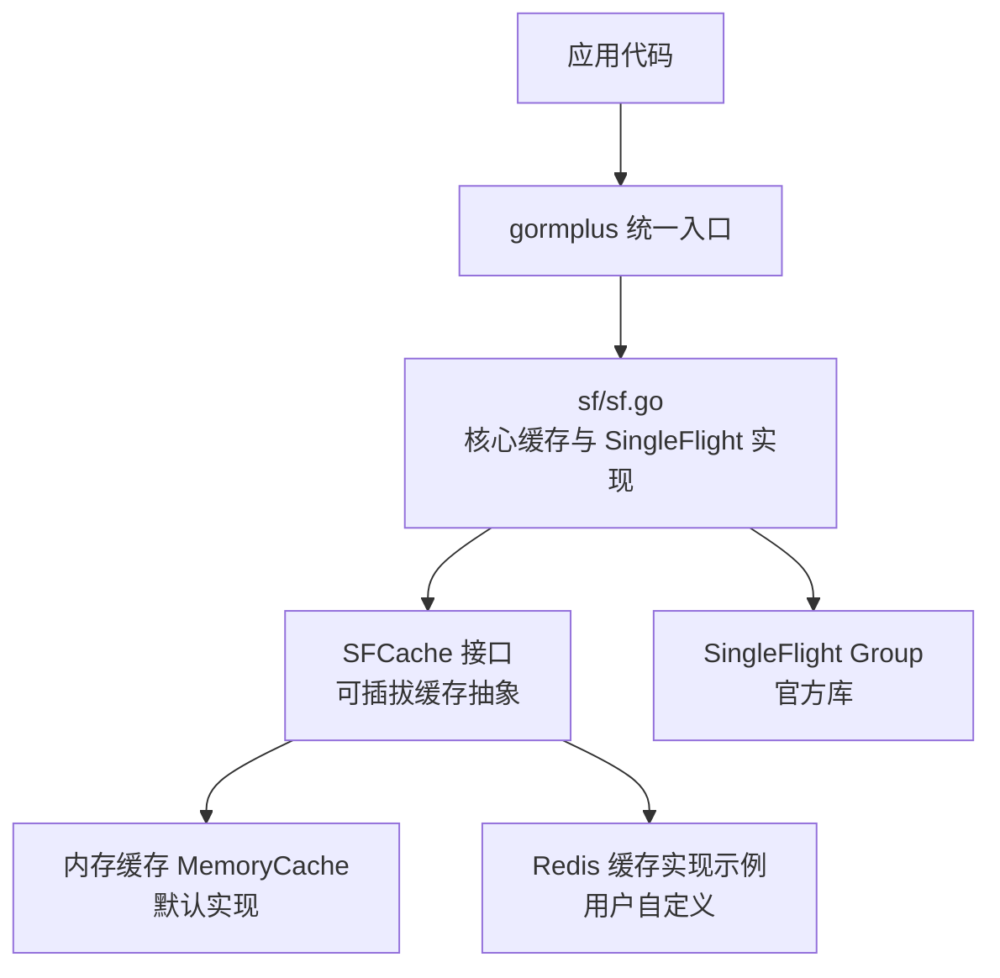
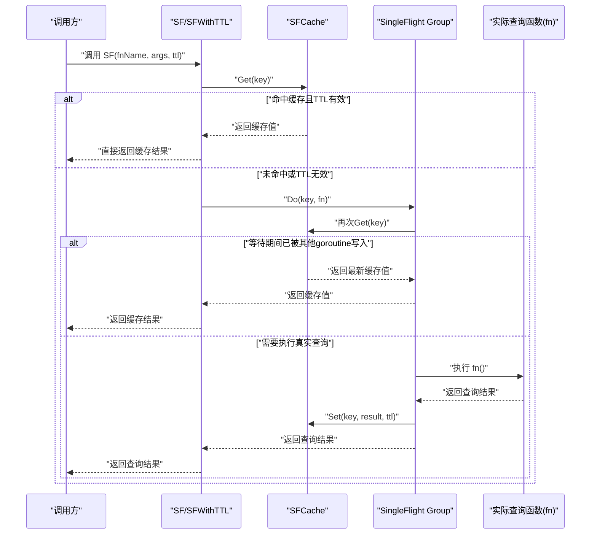
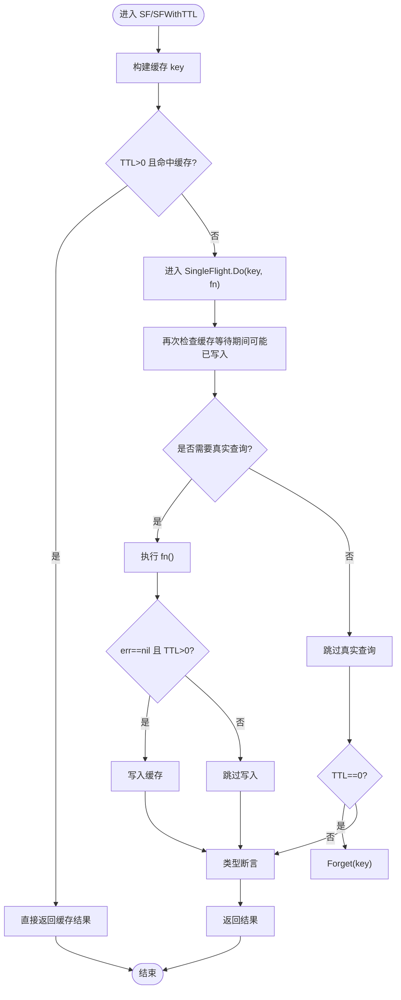
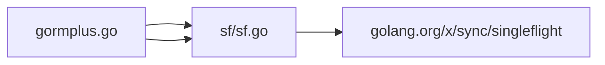

# 缓存系统 API

<cite>
**本文引用的文件**
- [sf.go](file://sf/sf.go)
- [gormplus.go](file://gormplus.go)
- [README.md](file://README.md)
- [version.go](file://version.go)
- [dal.go](file://dal/dal.go)
</cite>

## 目录
1. [简介](#简介)
2. [项目结构](#项目结构)
3. [核心组件](#核心组件)
4. [架构总览](#架构总览)
5. [详细组件分析](#详细组件分析)
6. [依赖分析](#依赖分析)
7. [性能考量](#性能考量)
8. [故障排查指南](#故障排查指南)
9. [结论](#结论)
10. [附录](#附录)

## 简介
本文件为缓存系统（SingleFlight + 可插拔缓存，简称 SF）模块的完整 API 参考文档。该模块提供三层查询保护与缓存能力：
- 纯 SingleFlight：同一时刻仅一个 goroutine 执行真实查询，其余等待共享结果，适合对实时性要求高的场景。
- SingleFlight + 可插拔缓存：在上述基础上增加缓存层，TTL 内重复请求直接返回缓存，支持内存缓存与 Redis 等外部缓存。
- 主动失效：写操作后主动清除对应缓存键，避免脏读。

模块特性包括：
- 零配置默认使用内存缓存，亦可通过 RegisterCache 注入自定义缓存实现（如 Redis）。
- 提供 SF、SFWithTTL、SFNoCache、SFInvalidate 等核心 API。
- 提供缓存生命周期管理（StopSFCache）与 TTL 建议。
- 与 gorm-plus 统一入口集成，便于在业务中无缝使用。

## 项目结构
- 缓存系统位于 sf/sf.go，提供核心接口与实现。
- 统一入口 gormplus.go 导出 SF 相关 API，并提供 RegisterCache、StopSFCache 等便捷入口。
- README.md 提供使用示例与最佳实践。
- version.go 提供版本信息。
- dal.go 展示了 SQL 文件化查询中的缓存与 SingleFlight 防击穿实践，有助于理解 SF 的应用场景。

图表来源
- [sf.go:1-395](file://sf/sf.go#L1-L395)
- [gormplus.go:348-473](file://gormplus.go#L348-L473)

章节来源
- [sf.go:1-395](file://sf/sf.go#L1-L395)
- [gormplus.go:348-473](file://gormplus.go#L348-L473)
- [README.md:567-641](file://README.md#L567-L641)

## 核心组件
- SFCache 接口：可插拔缓存抽象，定义 Get/Set/Del 三个方法，用于替换默认内存缓存。
- MemoryCache：内置内存缓存实现，带后台过期清理 goroutine，支持 Stop 停止。
- RegisterCache：注册自定义缓存实现，需在首次调用 SF 之前完成。
- SF/SFWithTTL/SFNoCache/SFInvalidate：对外公开的四类核心 API，分别对应“带 TTL 缓存”、“指定 TTL 缓存”、“纯 SingleFlight 不缓存”、“主动失效”。

章节来源
- [sf.go:51-92](file://sf/sf.go#L51-L92)
- [sf.go:135-187](file://sf/sf.go#L135-L187)
- [sf.go:101-114](file://sf/sf.go#L101-L114)
- [sf.go:237-349](file://sf/sf.go#L237-L349)
- [sf.go:275-291](file://sf/sf.go#L275-L291)

## 架构总览
下图展示了 SF 的整体工作流：缓存快速路径、SingleFlight 并发合并、缓存写入与失效。

图表来源
- [sf.go:302-349](file://sf/sf.go#L302-L349)

章节来源
- [sf.go:293-349](file://sf/sf.go#L293-L349)

## 详细组件分析

### SFCache 接口与可插拔缓存
- 接口职责
  - Get(key)：若 key 存在且未过期，返回 (value, true)，否则返回 (nil, false)。
  - Set(key, value, ttl)：存储键值对，ttl 后自动过期。
  - Del(key)：主动删除指定 key，供 SFInvalidate 使用。
- 默认实现
  - MemoryCache：基于 sync.Map 的内存缓存，带后台 goroutine 每 30 秒清理过期项，支持 Stop 停止。
- 注册与替换
  - RegisterCache(c)：在首次调用 SF 之前注册，替换默认内存缓存；注册后所有 SF/SFWithTTL/SFInvalidate 均使用新缓存。

章节来源
- [sf.go:51-92](file://sf/sf.go#L51-L92)
- [sf.go:135-187](file://sf/sf.go#L135-L187)
- [sf.go:101-114](file://sf/sf.go#L101-L114)

### 内存缓存 MemoryCache
- 特性
  - 使用 sync.Map 存储键值与过期时间。
  - 后台 goroutine 每 30 秒扫描并删除过期项。
  - Stop() 主动停止后台清理 goroutine。
- 生命周期
  - 默认懒初始化；若显式注册，可在单元测试中替换。
  - 应用退出时调用 StopSFCache（若使用默认内存缓存）。

章节来源
- [sf.go:135-187](file://sf/sf.go#L135-L187)
- [sf.go:208-225](file://sf/sf.go#L208-L225)

### SF / SFWithTTL / SFNoCache / SFInvalidate
- SF(fn, fnName, args, ttl...)
  - 最常用入口；若未传 ttl 使用默认 TTL（5 分钟）；传 0 等价于 SFNoCache。
- SFWithTTL(fn, fnName, args, ttl)
  - 底层实现，手动指定 TTL；TTL>0 时先查缓存，命中则直接返回；否则进入 SingleFlight。
- SFNoCache(fn, fnName, args)
  - 纯 SingleFlight，不缓存结果；适合对实时性要求高的场景。
- SFInvalidate(fnName, args)
  - 主动失效指定查询的缓存键；写操作后调用，避免脏读。

图表来源
- [sf.go:302-349](file://sf/sf.go#L302-L349)

章节来源
- [sf.go:237-273](file://sf/sf.go#L237-L273)
- [sf.go:275-291](file://sf/sf.go#L275-L291)
- [sf.go:293-349](file://sf/sf.go#L293-L349)

### 缓存键构建与参数序列化
- buildSFKey(fnName, args)
  - 将 fnName 与 args 组合为确定性 key。
  - args 为空时使用特殊标记；非空时对 map key 按字母序排序后 JSON 序列化，再进行 MD5 哈希。
- marshalSorted(m)
  - 对 map 的 key 进行排序，逐项 JSON 序列化，保证 key 生成与参数顺序无关。

章节来源
- [sf.go:353-394](file://sf/sf.go#L353-L394)

### 统一入口 gormplus
- gormplus 提供与 sf 等价的 API，便于在业务中统一导入使用。
- RegisterCache、StopSFCache、SF、SFWithTTL、SFNoCache、SFInvalidate 均为对 sf 的直接转发。

章节来源
- [gormplus.go:376-473](file://gormplus.go#L376-L473)

## 依赖分析
- 外部依赖
  - golang.org/x/sync/singleflight：提供 SingleFlight 的 Do/Forget 等能力。
- 内部依赖
  - gormplus 统一入口依赖 sf 模块。
  - SFInvalidate 依赖 getCache() 获取当前缓存实例并调用 Del。

图表来源
- [gormplus.go:100-101](file://gormplus.go#L100-L101)
- [sf.go](file://sf/sf.go#L14)

章节来源
- [gormplus.go:100-101](file://gormplus.go#L100-L101)
- [sf.go](file://sf/sf.go#L14)

## 性能考量
- TTL 选择建议
  - 列表/统计（允许短暂延迟）：3s ~ 30s
  - 配置/字典（几乎不变）：1min ~ 5min（默认 TTL）
  - 详情/用户实时数据：0（SFNoCache）
- 缓存命中率
  - args 参数顺序无关，key 由排序后的 JSON 序列化生成，减少重复 key。
- 并发控制
  - SingleFlight 合并同一 key 的并发请求，避免缓存穿透与热点压力放大。
- 内存缓存清理
  - MemoryCache 后台每 30 秒清理过期项，防止内存无限增长；应用退出时应调用 StopSFCache。
- Redis 缓存
  - 多实例部署推荐使用 Redis，避免缓存不一致；注册后业务代码无需改动。

章节来源
- [sf.go:40-47](file://sf/sf.go#L40-L47)
- [sf.go:189-206](file://sf/sf.go#L189-L206)
- [README.md:633-639](file://README.md#L633-L639)

## 故障排查指南
- 注册时机问题
  - 必须在首次调用 SF 之前调用 RegisterCache，否则默认内存缓存已懒初始化，注册无效。
- 类型断言失败
  - SF 返回值进行类型断言失败时，会返回错误；请检查 fn 返回类型与泛型类型一致。
- 缓存未生效
  - 确认 args 与查询时传入完全一致（key-value 相同，顺序无关）。
  - 检查 TTL 设置是否合理，TTL=0 等价于 SFNoCache。
- 内存泄漏
  - 使用默认内存缓存时，应用退出前调用 StopSFCache；使用 Redis 等自定义缓存时，由用户自行管理生命周期。
- 键冲突
  - 自定义 Redis 缓存建议加前缀，避免 key 冲突。

章节来源
- [sf.go:104-105](file://sf/sf.go#L104-L105)
- [sf.go:342-347](file://sf/sf.go#L342-L347)
- [sf.go:208-225](file://sf/sf.go#L208-L225)
- [README.md:595-624](file://README.md#L595-L624)

## 结论
SF 模块通过“SingleFlight + 可插拔缓存”的设计，在保证高并发一致性的同时，显著降低数据库压力与响应延迟。默认零配置内存缓存满足大多数场景，结合 RegisterCache 可轻松适配 Redis 等分布式缓存。通过 SF、SFWithTTL、SFNoCache、SFInvalidate 四大 API，开发者可以在不同场景下灵活选择缓存策略，并通过主动失效保障数据一致性。

## 附录

### API 一览与使用要点
- SFCache 接口
  - Get(key) -> (any, bool)
  - Set(key, any, ttl)
  - Del(key)
- MemoryCache
  - NewMemoryCache() / Stop()
- RegisterCache(c)
- SF(fn, fnName, args, ttl...)
- SFWithTTL(fn, fnName, args, ttl)
- SFNoCache(fn, fnName, args)
- SFInvalidate(fnName, args)
- StopSFCache()

章节来源
- [sf.go:51-92](file://sf/sf.go#L51-L92)
- [sf.go:135-187](file://sf/sf.go#L135-L187)
- [sf.go:101-114](file://sf/sf.go#L101-L114)
- [sf.go:237-273](file://sf/sf.go#L237-L273)
- [sf.go:275-291](file://sf/sf.go#L275-L291)
- [sf.go:208-225](file://sf/sf.go#L208-L225)