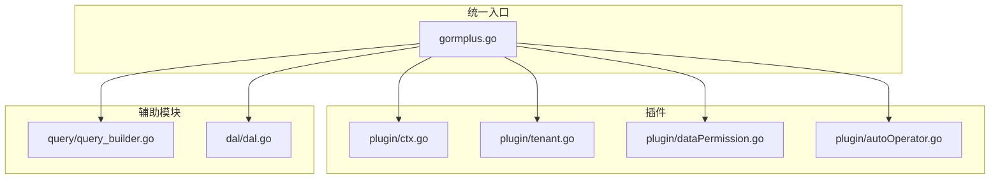
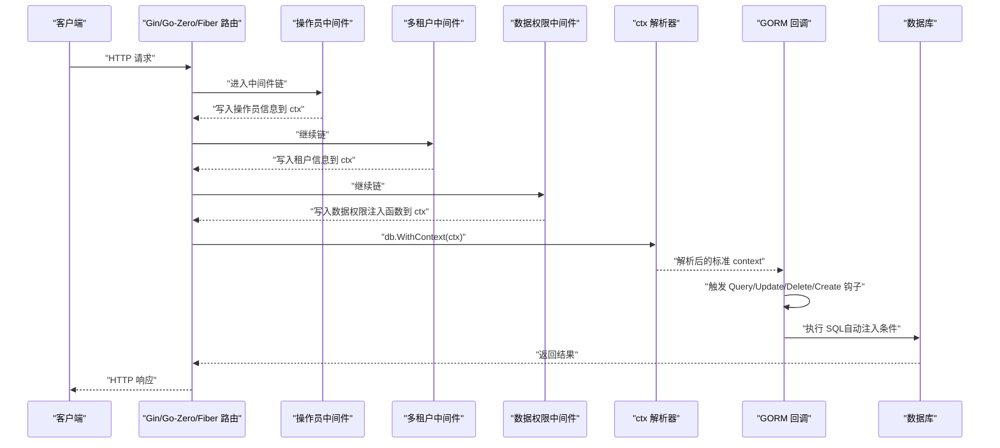
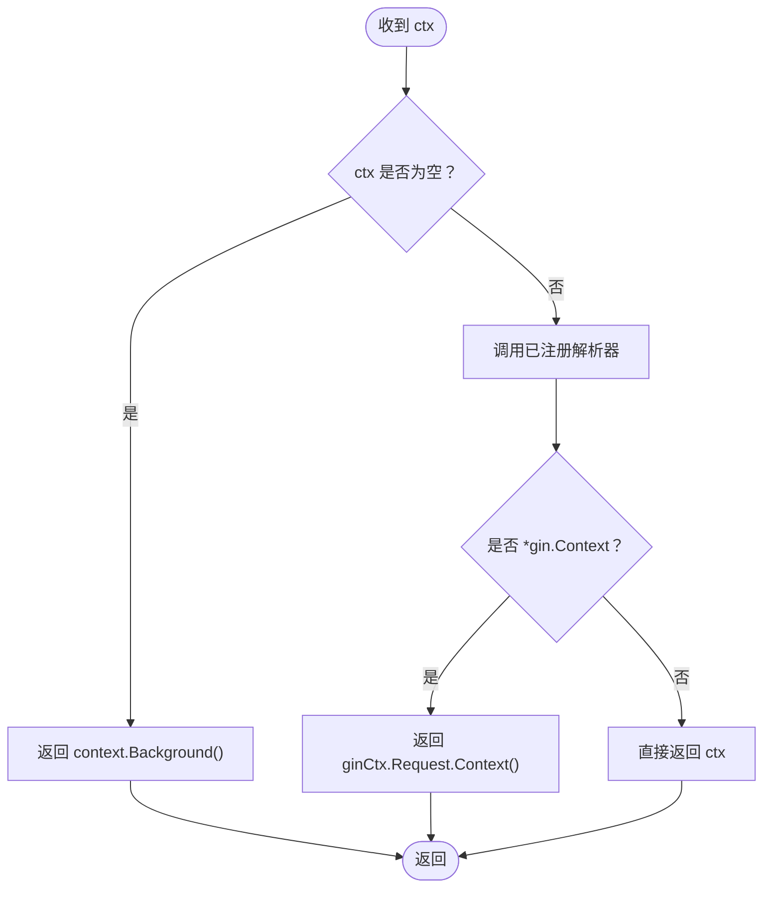
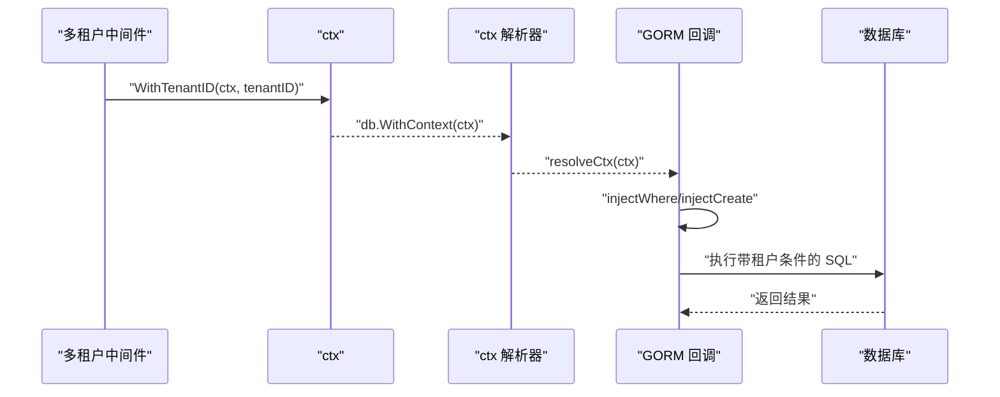
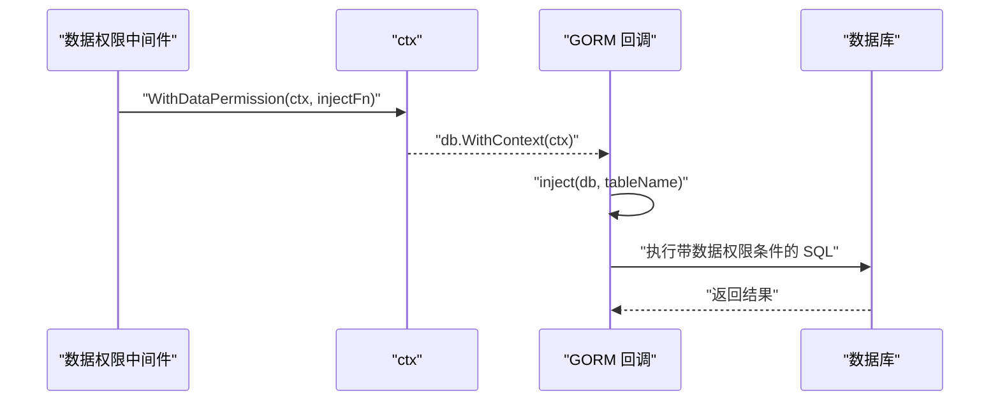
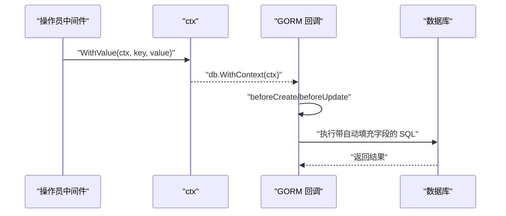
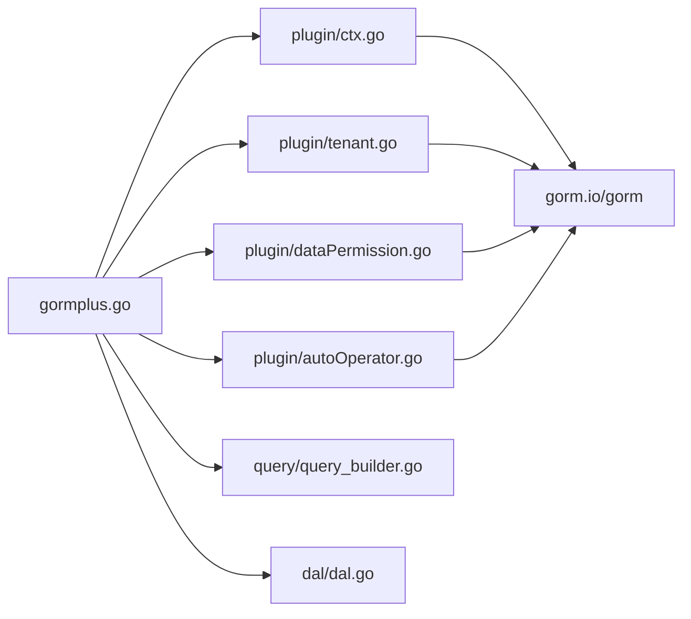

# 中间件集成

<cite>
**本文引用的文件**
- [gormplus.go](file://gormplus.go)
- [plugin/ctx.go](file://plugin/ctx.go)
- [plugin/tenant.go](file://plugin/tenant.go)
- [plugin/dataPermission.go](file://plugin/dataPermission.go)
- [plugin/autoOperator.go](file://plugin/autoOperator.go)
- [plugin/tenant.md](file://plugin/tenant.md)
- [plugin/dataPermission.md](file://plugin/dataPermission.md)
- [plugin/autoOperator.md](file://plugin/autoOperator.md)
- [README.md](file://README.md)
- [go.mod](file://go.mod)
- [version.go](file://version.go)
- [dal/dal.go](file://dal/dal.go)
- [query/query_builder.go](file://query/query_builder.go)
</cite>

## 目录
1. [简介](#简介)
2. [项目结构](#项目结构)
3. [核心组件](#核心组件)
4. [架构总览](#架构总览)
5. [详细组件分析](#详细组件分析)
6. [依赖分析](#依赖分析)
7. [性能考虑](#性能考虑)
8. [故障排查指南](#故障排查指南)
9. [结论](#结论)
10. [附录](#附录)

## 简介
本技术文档聚焦“中间件集成功能”，围绕以下目标展开：
- 深入解释 ctx 解析器的设计理念与实现机制，说明如何屏蔽不同 Web 框架的上下文差异（Gin、Go-Zero、Fiber 等）。
- 详解多租户、数据权限、自动填充三大中间件插件的集成方法与最佳实践。
- 说明中间件的执行顺序与优先级处理机制，给出完整配置示例（多租户、数据权限、操作员信息注入）。
- 提供性能优化与错误处理策略，并总结中间件开发与扩展指南。

## 项目结构
本仓库采用“统一入口 + 插件化”的组织方式：
- 统一入口：gormplus.go 提供注册、初始化与导出能力，集中暴露多租户、数据权限、自动填充等插件 API。
- 插件模块：plugin 目录下包含 ctx 解析器与三大插件（tenant、dataPermission、autoOperator）。
- 辅助模块：query 提供链式条件构造器，dal 提供 SQL 文件化访问层，sf 提供缓存与慢查询监控等。

图表来源
- [gormplus.go:1-125](file://gormplus.go#L1-L125)
- [plugin/ctx.go:1-44](file://plugin/ctx.go#L1-L44)
- [plugin/tenant.go:1-1223](file://plugin/tenant.go#L1-L1223)
- [plugin/dataPermission.go:1-339](file://plugin/dataPermission.go#L1-L339)
- [plugin/autoOperator.go:1-309](file://plugin/autoOperator.go#L1-L309)
- [query/query_builder.go:1-200](file://query/query_builder.go#L1-L200)
- [dal/dal.go:1-200](file://dal/dal.go#L1-L200)

章节来源
- [README.md:17-41](file://README.md#L17-L41)
- [gormplus.go:86-125](file://gormplus.go#L86-L125)

## 核心组件
- ctx 解析器：统一从各框架的上下文对象中提取标准 context，解决 Gin 直传 *gin.Context 导致插件无法读取 Request.Context() 的问题。
- 多租户插件：在 Query/Update/Delete/Create 前自动注入租户条件，支持多字段、联表自动注入、安全策略与覆盖/跳过机制。
- 数据权限插件：通过中间件注入业务函数，在 Query/Update/Delete 前自动追加数据范围条件。
- 自动填充插件：在 Create/Update 前自动填充操作人等字段，支持多种 Getter 与字段组合。

章节来源
- [plugin/ctx.go:7-43](file://plugin/ctx.go#L7-L43)
- [plugin/tenant.go:143-381](file://plugin/tenant.go#L143-L381)
- [plugin/dataPermission.go:128-204](file://plugin/dataPermission.go#L128-L204)
- [plugin/autoOperator.go:140-208](file://plugin/autoOperator.go#L140-L208)

## 架构总览
中间件集成的关键在于“统一上下文解析 + 插件回调钩子 + 中间件注入”。下图展示 Gin/Go-Zero/Fiber 三种框架下的集成流程与优先级。

图表来源
- [gormplus.go:103-125](file://gormplus.go#L103-L125)
- [plugin/tenant.go:529-595](file://plugin/tenant.go#L529-L595)
- [plugin/dataPermission.go:164-204](file://plugin/dataPermission.go#L164-L204)
- [plugin/autoOperator.go:210-275](file://plugin/autoOperator.go#L210-L275)

## 详细组件分析

### ctx 解析器设计与实现
- 设计理念
  - 通过全局解析器函数屏蔽框架差异：Gin 直传 *gin.Context 时，解析器自动提取 Request.Context()；Go-Zero/Fiber 使用标准 context，无需额外处理。
  - 在统一入口 gormplus.RegisterCtxResolver 中注册，插件内部统一调用 resolveCtx，确保所有插件（多租户、数据权限、自动填充）均受益。
- 实现要点
  - 默认解析器直接返回（适配标准 context）。
  - Gin 注册示例：将 *gin.Context 转换为其 Request.Context()。
  - resolveCtx 在插件内部统一调用，保证兼容性。
- 与框架的关系
  - Gin：必须注册解析器。
  - Go-Zero：无需注册。
  - Fiber：无需注册（使用标准 context）。

图表来源
- [plugin/ctx.go:9-43](file://plugin/ctx.go#L9-L43)
- [gormplus.go:105-125](file://gormplus.go#L105-L125)

章节来源
- [plugin/ctx.go:7-43](file://plugin/ctx.go#L7-L43)
- [gormplus.go:103-125](file://gormplus.go#L103-L125)
- [README.md:114-136](file://README.md#L114-L136)

### 多租户插件（Tenant）
- 工作原理
  - 在 Query/Update/Delete 前注册回调，自动注入 WHERE 条件；Create 前自动填充结构体字段。
  - 支持多字段、按表覆盖、联表自动注入、安全策略（重复条件跳过/替换、OR 危险拒绝、全表保护）。
- 关键配置
  - 单字段/多字段/按表覆盖三种注入方式，支持联表排除与覆盖。
  - 安全策略：PolicySkip/PolicyReplace/PolicyAppend；全表 Update/Delete 可配置允许或临时放开。
- 中间件注入
  - 中间件将租户 ID 写入 ctx（WithTenantID），插件在回调中读取并注入。
  - 支持覆盖租户 ID（AllowOverrideTenantID）与超管跳过（SkipTenant）。
- 执行顺序与优先级
  - 多租户插件在 gorm 回调中按 Query/Update/Delete/Create 的 Before/After 钩子执行，确保在业务 SQL 之前完成条件注入。
  - 联表注入在主表注入完成后进行，自动解析别名并注入对应字段。

图表来源
- [plugin/tenant.go:529-595](file://plugin/tenant.go#L529-L595)
- [plugin/tenant.go:749-779](file://plugin/tenant.go#L749-L779)
- [plugin/tenant.go:355-381](file://plugin/tenant.go#L355-L381)

章节来源
- [plugin/tenant.go:1-129](file://plugin/tenant.go#L1-L129)
- [plugin/tenant.go:237-336](file://plugin/tenant.go#L237-L336)
- [plugin/tenant.go:529-595](file://plugin/tenant.go#L529-L595)
- [plugin/tenant.go:749-779](file://plugin/tenant.go#L749-L779)
- [plugin/tenant.md:1-30](file://plugin/tenant.md#L1-L30)

### 数据权限插件（DataPermission）
- 工作原理
  - 中间件定义注入函数（DataPermissionInjectFn），写入 ctx；插件在 Query/Update/Delete 回调中读取并注入业务条件。
  - 支持跳过（SkipDataPermission）、排除表（ExcludeTables）与运行时动态维护。
- 中间件注入
  - 中间件将注入函数写入 ctx（WithDataPermission），插件在回调中读取并调用。
- 执行顺序与优先级
  - 在 gorm 回调中注册 Query/Update/Delete 钩子，确保在业务 SQL 之前注入。

图表来源
- [plugin/dataPermission.go:164-204](file://plugin/dataPermission.go#L164-L204)
- [plugin/dataPermission.go:140-162](file://plugin/dataPermission.go#L140-L162)

章节来源
- [plugin/dataPermission.go:1-106](file://plugin/dataPermission.go#L1-L106)
- [plugin/dataPermission.go:107-127](file://plugin/dataPermission.go#L107-L127)
- [plugin/dataPermission.go:164-204](file://plugin/dataPermission.go#L164-L204)
- [plugin/dataPermission.md:1-50](file://plugin/dataPermission.md#L1-L50)

### 自动填充插件（AutoFill）
- 工作原理
  - 在 Create/Update 回调前自动填充字段，支持多种 Getter（内置 OperatorGetter、CtxGetter 与自定义）。
  - 支持 UpdateSimple/UpdateColumn 等路径的差异处理。
- 中间件注入
  - 中间件将操作人信息写入 ctx（如 CtxContextKey1/2 等），Getter 从 ctx 读取并填充。
- 执行顺序与优先级
  - 在 gorm 回调中注册 Create/Update 钩子，确保在业务写入前完成字段填充。

图表来源
- [plugin/autoOperator.go:210-275](file://plugin/autoOperator.go#L210-L275)
- [plugin/autoOperator.go:190-208](file://plugin/autoOperator.go#L190-L208)

章节来源
- [plugin/autoOperator.go:1-100](file://plugin/autoOperator.go#L1-L100)
- [plugin/autoOperator.go:120-139](file://plugin/autoOperator.go#L120-L139)
- [plugin/autoOperator.go:210-275](file://plugin/autoOperator.go#L210-L275)
- [plugin/autoOperator.md:1-102](file://plugin/autoOperator.md#L1-L102)

### 中间件执行顺序与优先级
- 推荐顺序（示例）
  - 操作员中间件 → 多租户中间件 → 数据权限中间件
  - 说明：先写入操作员信息，再写入租户信息，最后写入数据权限注入函数，确保插件回调能读取到完整上下文。
- 与 gorm 回调的关系
  - 插件在 gorm 回调钩子中执行，顺序由插件注册时的 Before/After 决定，确保在业务 SQL 之前完成注入。

章节来源
- [README.md:106-109](file://README.md#L106-L109)
- [plugin/tenant.go:355-381](file://plugin/tenant.go#L355-L381)
- [plugin/dataPermission.go:140-162](file://plugin/dataPermission.go#L140-L162)
- [plugin/autoOperator.go:190-208](file://plugin/autoOperator.go#L190-L208)

### 完整中间件配置示例（多租户、数据权限、操作员信息）
- Gin 项目
  - 注册 ctx 解析器（必须）
  - 注册多租户、数据权限插件
  - 注册自动填充插件
  - 中间件顺序：操作员 → 多租户 → 数据权限
- Go-Zero/Fiber 项目
  - 无需注册 ctx 解析器（使用标准 context）
  - 其余步骤与 Gin 类似

章节来源
- [README.md:46-110](file://README.md#L46-L110)
- [gormplus.go:103-125](file://gormplus.go#L103-L125)
- [plugin/tenant.md:1-30](file://plugin/tenant.md#L1-L30)
- [plugin/dataPermission.md:1-50](file://plugin/dataPermission.md#L1-L50)
- [plugin/autoOperator.md:1-102](file://plugin/autoOperator.md#L1-L102)

## 依赖分析
- 模块依赖
  - gormplus.go 依赖 plugin/* 与 query/*、dal/* 等模块。
  - 插件内部依赖 gorm.io/gorm 与 gorm.io/gen（通过 go.mod 可见）。
- 关键依赖关系
  - ctx 解析器统一入口：gormplus.RegisterCtxResolver → plugin.RegisterCtxResolver → resolveCtx。
  - 插件注册：RegisterTenant/RegisterDataPermission/NewAutoFillPlugin → db.Use/Callback 注册。

图表来源
- [gormplus.go:88-101](file://gormplus.go#L88-L101)
- [go.mod:5-10](file://go.mod#L5-L10)

章节来源
- [go.mod:1-26](file://go.mod#L1-L26)
- [gormplus.go:88-101](file://gormplus.go#L88-L101)

## 性能考虑
- ctx 解析器
  - 默认解析器为 O(1)，Gin 注册解析器仅做一次类型判断与上下文提取，开销极低。
- 多租户插件
  - PolicyAppend 最优性能（不扫描已有条件），但可能产生重复条件；PolicySkip/Replace 更安全但略增开销。
  - 联表注入通过解析 JOIN 子句自动识别别名，避免重复注入。
- 数据权限插件
  - 注入函数在回调中调用，底层统一使用 db.Statement.Where 注入，避免在回调阶段使用 db.Scopes 的无效路径。
- 自动填充插件
  - Create/Update 前注入，UpdateSimple/UpdateColumn 路径分别处理，避免重复注入。
- 缓存与慢查询
  - 提供慢查询监控与 SingleFlight 可插拔缓存，建议结合使用以降低热点查询压力。

章节来源
- [plugin/tenant.go:549-595](file://plugin/tenant.go#L549-L595)
- [plugin/dataPermission.go:164-204](file://plugin/dataPermission.go#L164-L204)
- [plugin/autoOperator.go:210-275](file://plugin/autoOperator.go#L210-L275)
- [README.md:643-658](file://README.md#L643-L658)

## 故障排查指南
- Gin 项目无法读取中间件写入的 ctx 数据
  - 现象：插件无法从 *gin.Context 读取 Request.Context()。
  - 处理：注册 ctx 解析器（gormplus.RegisterCtxResolver），将 *gin.Context 转换为其 Request.Context()。
- 多租户条件注入异常
  - 现象：重复条件或 OR 绕过导致拒绝执行。
  - 处理：调整 DuplicatePolicy（PolicySkip/PolicyReplace/PolicyAppend）；确认业务 SQL 中未包含 OR 涉及租户字段。
- 数据权限未生效
  - 现象：中间件未写入注入函数或 ctx 中无注入函数。
  - 处理：确认中间件已调用 WithDataPermission；检查 ctx 是否被后续中间件覆盖。
- 自动填充字段未写入
  - 现象：Create/Update 后字段未填充。
  - 处理：确认中间件已写入对应 key；确认 Getter 返回值类型与结构体字段匹配；确认插件已注册。

章节来源
- [plugin/ctx.go:16-35](file://plugin/ctx.go#L16-L35)
- [plugin/tenant.go:383-482](file://plugin/tenant.go#L383-L482)
- [plugin/dataPermission.go:164-204](file://plugin/dataPermission.go#L164-L204)
- [plugin/autoOperator.go:210-275](file://plugin/autoOperator.go#L210-L275)

## 结论
- ctx 解析器统一屏蔽框架差异，是中间件集成的基础。
- 多租户、数据权限、自动填充三大插件通过 gorm 回调钩子在业务 SQL 之前完成注入，实现“零侵入”与“零改动”。
- 合理配置执行顺序与安全策略，可在保障数据隔离与合规的前提下获得良好性能。
- 建议在 Gin 项目中注册 ctx 解析器，在 Go-Zero/Fiber 项目中直接使用标准 context；结合缓存与慢查询监控进一步优化系统表现。

## 附录
- 版本信息
  - 当前版本：v1.0.13
- 相关模块
  - 链式条件构造器：query/IQueryBuilder
  - SQL 文件化访问层：dal
  - 缓存与慢查询：sf

章节来源
- [version.go:1-4](file://version.go#L1-L4)
- [query/query_builder.go:1-200](file://query/query_builder.go#L1-L200)
- [dal/dal.go:1-200](file://dal/dal.go#L1-L200)