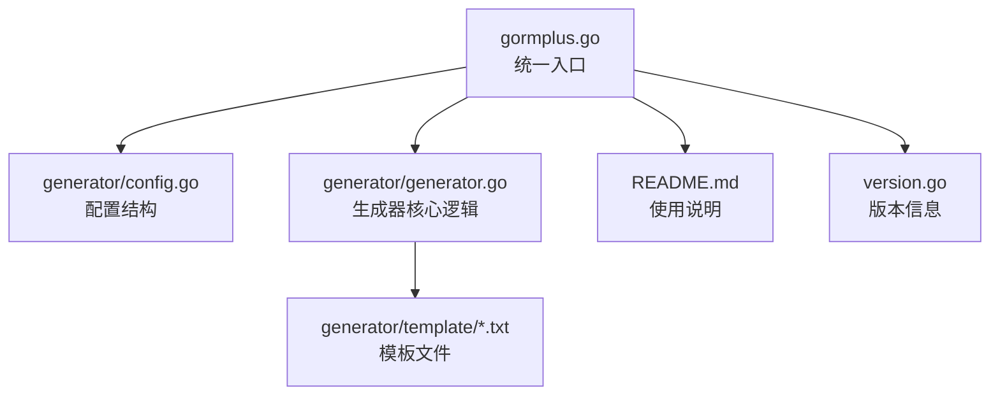
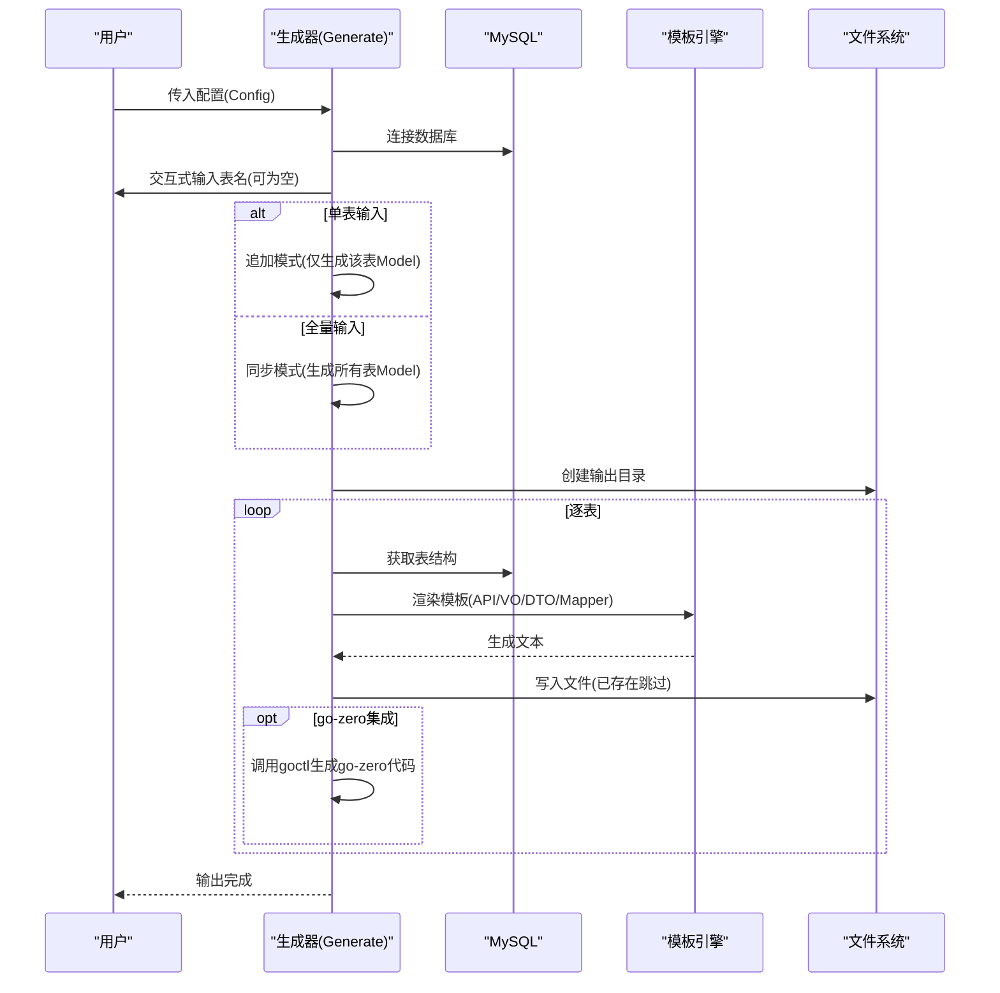
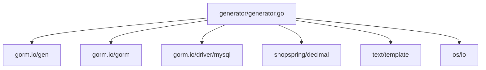

# API/DTO 生成

<cite>
**本文引用的文件**
- [generator.go](file://generator/generator.go)
- [config.go](file://generator/config.go)
- [generator.example.yaml](file://generator/generator.example.yaml)
- [api_template.txt](file://generator/template/api_template.txt)
- [dto_template.txt](file://generator/template/dto_template.txt)
- [mapper_template.txt](file://generator/template/mapper_template.txt)
- [repository_template.txt](file://generator/template/repository_template.txt)
- [vo_template.txt](file://generator/template/vo_template.txt)
- [example_test.go](file://generator/example_test.go)
- [README.md](file://README.md)
- [gormplus.go](file://gormplus.go)
- [version.go](file://version.go)
</cite>

## 目录
1. [简介](#简介)
2. [项目结构](#项目结构)
3. [核心组件](#核心组件)
4. [架构总览](#架构总览)
5. [详细组件分析](#详细组件分析)
6. [依赖分析](#依赖分析)
7. [性能考虑](#性能考虑)
8. [故障排查指南](#故障排查指南)
9. [结论](#结论)
10. [附录](#附录)

## 简介
本技术文档围绕 API/DTO 生成能力展开，系统阐述其在微服务架构中的定位、实现原理、模板机制、生成规则与最佳实践。API/DTO 生成通过数据库表结构推导，结合模板引擎渲染，输出符合团队规范的请求/响应结构体、校验规则、JSON 标签与导入依赖，从而降低重复劳动、提升一致性与可维护性。同时，文档还涵盖生成器的配置、使用示例、自定义模板与性能优化建议。

## 项目结构
- 生成器位于 generator 目录，包含配置、模板与生成逻辑。
- 顶层入口通过 gormplus 提供统一调用。
- README 提供快速开始与生成器使用说明。

图表来源
- [gormplus.go:895-897](file://gormplus.go#L895-L897)
- [generator/config.go:10-31](file://generator/config.go#L10-L31)
- [generator/generator.go:1038-1259](file://generator/generator.go#L1038-L1259)

章节来源
- [README.md:662-694](file://README.md#L662-L694)
- [gormplus.go:895-897](file://gormplus.go#L895-L897)

## 核心组件
- 配置模块：定义数据库连接、输出路径、包名等配置项，并提供 YAML 加载能力。
- 生成器核心：负责连接数据库、解析表结构、生成 Model、Repository、API、VO、DTO、Mapper 等文件。
- 模板系统：内置多套模板，支持用户自定义覆盖；模板通过 text/template 渲染。
- 辅助工具：路径解析、驼峰转换、JSON 标签生成、校验规则生成、goctl 集成等。

章节来源
- [config.go:10-47](file://generator/config.go#L10-L47)
- [generator.go:1038-1259](file://generator/generator.go#L1038-L1259)
- [generator.go:322-340](file://generator/generator.go#L322-L340)
- [generator.go:287-320](file://generator/generator.go#L287-L320)

## 架构总览
生成流程分为两阶段：
- 第一阶段：生成数据模型（Model）。支持单表追加与全量同步两种模式。
- 第二阶段：逐表生成 Repository、API、VO、DTO、Mapper。已存在文件跳过，避免覆盖手写代码。

图表来源
- [generator.go:1038-1259](file://generator/generator.go#L1038-L1259)
- [generator.go:837-959](file://generator/generator.go#L837-L959)

## 详细组件分析

### 配置与入口
- 配置结构包含数据库连接参数、输出路径、项目包名等，支持 YAML 加载。
- 顶层入口 gormplus.Generate 直接委托给 generator.Generate，便于统一调用。

章节来源
- [config.go:10-47](file://generator/config.go#L10-L47)
- [gormplus.go:895-897](file://gormplus.go#L895-L897)
- [generator.example.yaml:1-17](file://generator/generator.example.yaml#L1-L17)

### 生成器核心逻辑
- 路径解析：自动定位项目根目录，将相对路径解析为绝对路径，确保跨目录运行一致性。
- 模板加载：优先从文件系统加载用户自定义模板，不存在时回退到内嵌模板。
- 表结构解析：通过 SHOW FULL COLUMNS 与 INFORMATION_SCHEMA.TABLES 获取字段与注释。
- 类型映射：针对 API/DTO/VO 的不同需求，提供差异化 Go 类型映射策略。
- JSON 标签与校验规则：根据字段属性与注释生成 json 标签与 validate 规则。
- goctl 集成：当配置 api_path 时，生成 .api 文件并调用 goctl 生成 go-zero 代码。

章节来源
- [generator.go:37-68](file://generator/generator.go#L37-L68)
- [generator.go:322-340](file://generator/generator.go#L322-L340)
- [generator.go:185-210](file://generator/generator.go#L185-L210)
- [generator.go:745-773](file://generator/generator.go#L745-L773)
- [generator.go:287-320](file://generator/generator.go#L287-L320)
- [generator.go:886-895](file://generator/generator.go#L886-L895)

### API/DTO/VO/Mapper 模板与数据模型
- API 模板：生成 .api 文件，包含请求/响应结构体、分页结构体、服务路由与中间件配置。
- DTO 模板：生成请求 DTO 结构体，包含字段、JSON 标签与 validate 规则。
- VO 模板：生成响应 VO 结构体，字段类型与 API/DTO 一致。
- Mapper 模板：生成映射器接口与实现，负责 DTO/Entity/VO 之间的相互转换，自动引入 time 与 decimal 包。

章节来源
- [api_template.txt:1-93](file://generator/template/api_template.txt#L1-L93)
- [dto_template.txt:1-20](file://generator/template/dto_template.txt#L1-L20)
- [vo_template.txt:1-10](file://generator/template/vo_template.txt#L1-L10)
- [mapper_template.txt:1-82](file://generator/template/mapper_template.txt#L1-L82)

### 数据模型与生成规则
- ColumnInfo：承载字段元信息，包括原始类型、Go 类型、JSON 标签、可空、主键、注释、审计字段、十进制度量类型等。
- ApiTemplateData/VoTemplateData/MapperTemplateData：分别用于 API/VO/Mapper 模板的数据上下文。
- 类型映射策略：
  - API/DTO：decimal/float/double → string；datetime/timestamp/date → int64；其余与通用映射一致。
  - VO：decimal/float/double → string；datetime/timestamp/date → int64；其余与通用映射一致。
  - 通用映射：varchar/text/char → string；int 系列 → int64；json → datatypes.JSON；decimal → decimal.Decimal。
- JSON 标签：默认采用小驼峰，deleted_at 字段排除；nullable 字段追加 optional。
- 校验规则：根据字段可空、主键、字段名关键词（email/mobile）、注释枚举、状态/类型字段等生成 validate 规则。
- Mapper 数据构建：自动识别时间/十进制度量/审计字段，决定是否引入 time 与 decimal 包。

章节来源
- [generator.go:212-227](file://generator/generator.go#L212-L227)
- [generator.go:229-242](file://generator/generator.go#L229-L242)
- [generator.go:259-279](file://generator/generator.go#L259-L279)
- [generator.go:719-773](file://generator/generator.go#L719-L773)
- [generator.go:1108-1120](file://generator/generator.go#L1108-L1120)
- [generator.go:1126-1146](file://generator/generator.go#L1126-L1146)
- [generator.go:342-389](file://generator/generator.go#L342-L389)
- [generator.go:602-641](file://generator/generator.go#L602-L641)
- [generator.go:562-600](file://generator/generator.go#L562-L600)
- [generator.go:644-717](file://generator/generator.go#L644-L717)

### 生成流程与文件写入策略
- Model 生成：单表追加模式仅追加新表至现有 gen.go；全量同步模式生成所有表的 Model 并执行。
- Repository：生成 _gen.go 与 .go 两份文件，_gen.go 由生成器覆盖，.go 由用户扩展。
- API：生成 .api 文件，若 api_path 配置存在，调用 goctl 生成 go-zero 代码。
- VO/DTO：在非 go-zero 模式下生成；go-zero 模式下跳过，使用 goctl 生成的 types。
- Mapper：每张表生成一个平铺文件，用户复制后自行调整 import 路径。

章节来源
- [generator.go:1167-1238](file://generator/generator.go#L1167-L1238)
- [generator.go:837-959](file://generator/generator.go#L837-L959)
- [generator.go:805-834](file://generator/generator.go#L805-L834)

### 使用示例与最佳实践
- 使用示例：通过配置结构或 YAML 加载配置，调用 gormplus.Generate 或 generator.Generate。
- 最佳实践：
  - 优先使用 YAML 配置，集中管理生成规则。
  - 在 go-zero 项目中，配置 api_path 后跳过 VO/DTO 生成，由 goctl 生成 types。
  - 自定义模板时，优先在本地覆盖 template 目录下的同名文件，避免破坏内嵌模板。
  - 生成后及时检查 Mapper 的 import 路径，确保包路径正确。
  - 对于复杂校验规则，可在注释中约定枚举格式，生成器会自动解析并生成 oneof 规则。

章节来源
- [example_test.go:8-35](file://generator/example_test.go#L8-L35)
- [generator.example.yaml:1-17](file://generator/generator.example.yaml#L1-L17)
- [README.md:662-694](file://README.md#L662-L694)

## 依赖分析
- 外部依赖：gorm.io/gen、gorm.io/gorm、gorm.io/driver/mysql、shopspring/decimal。
- 模块内聚：生成器核心逻辑集中在 generator/generator.go，配置与模板解耦。
- 耦合点：goctl 集成与 API 生成强相关；Mapper 模板依赖 time 与 decimal 包。

图表来源
- [generator.go:3-20](file://generator/generator.go#L3-L20)
- [generator.go:322-340](file://generator/generator.go#L322-L340)

章节来源
- [generator.go:3-20](file://generator/generator.go#L3-L20)

## 性能考虑
- 模板加载：优先从文件系统加载，减少二进制体积；仅在缺失时回退内嵌模板。
- 文件写入：已存在文件跳过写入，避免重复 I/O；_gen.go/.go 文件区分覆盖策略。
- 数据库访问：仅在必要时查询表结构与注释；批量生成时复用连接。
- goctl 调用：仅在配置 api_path 时触发，避免不必要的外部进程调用。
- 类型映射与标签生成：在内存中完成，复杂度与字段数量线性相关。

[本节为通用指导，不涉及具体文件分析]

## 故障排查指南
- 未找到 go.mod：路径解析失败，检查项目根目录是否存在 go.mod。
- 模板加载失败：确认 template 目录存在且包含所需模板；或设置 GENERATOR_TEMPLATE_DIR 环境变量。
- 数据库连接失败：检查 host/port/username/password/database 配置。
- goctl 调用失败：确认 goctl 已安装且 PATH 可用；或手动指定 goctl 路径。
- 文件写入失败：检查输出目录权限与磁盘空间；确认文件未被占用。
- 生成文件被覆盖：对于用户自定义的 .go 文件，生成器会跳过写入；如需覆盖，请清理旧文件。

章节来源
- [generator.go:37-68](file://generator/generator.go#L37-L68)
- [generator.go:322-340](file://generator/generator.go#L322-L340)
- [generator.go:1049-1052](file://generator/generator.go#L1049-L1052)
- [generator.go:886-895](file://generator/generator.go#L886-L895)
- [generator.go:814-834](file://generator/generator.go#L814-L834)

## 结论
API/DTO 生成器通过标准化的模板与规则，将数据库表结构转化为一致的请求/响应结构体与映射逻辑，显著提升微服务开发效率与一致性。结合 go-zero 集成与自定义模板能力，既能满足通用场景，也能适配团队特定规范。建议在团队内统一配置与模板，配合 CI/CD 自动化生成，持续优化生成质量与性能。

[本节为总结性内容，不涉及具体文件分析]

## 附录
- 版本信息：v1.0.13
- 快速开始与生成器使用说明详见 README

章节来源
- [version.go:1-4](file://version.go#L1-L4)
- [README.md:662-694](file://README.md#L662-L694)