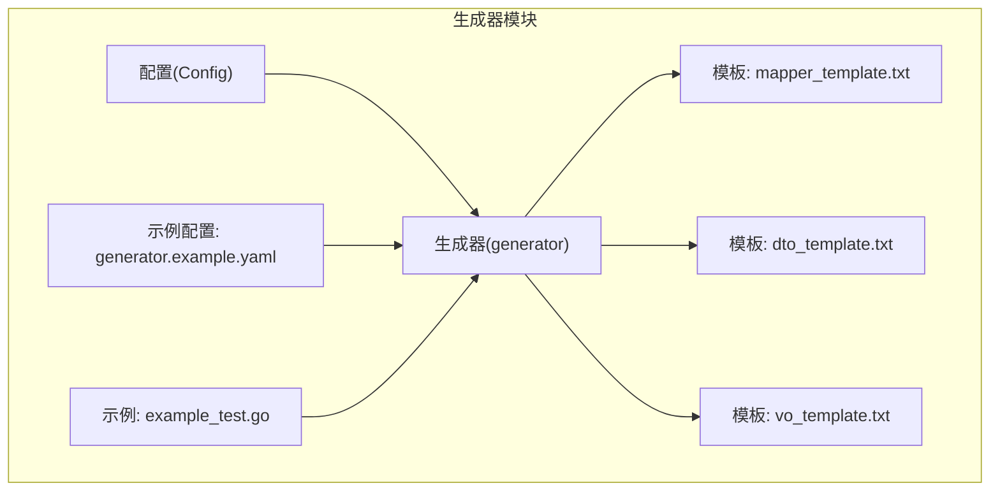
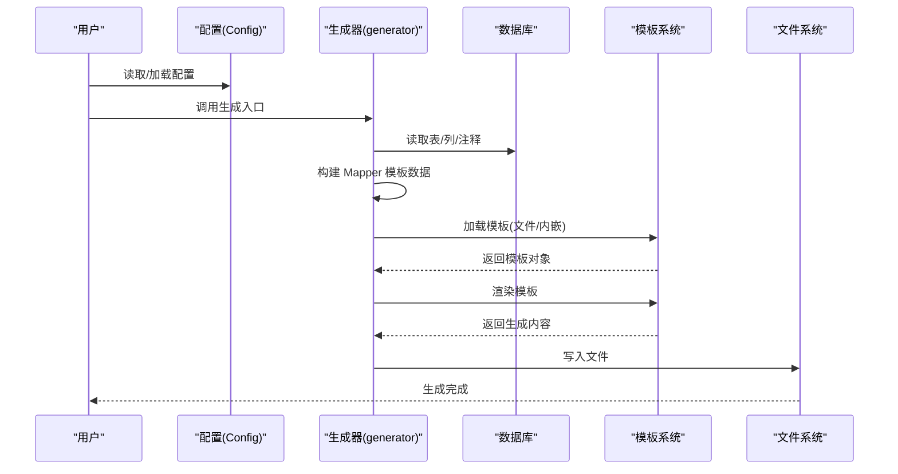
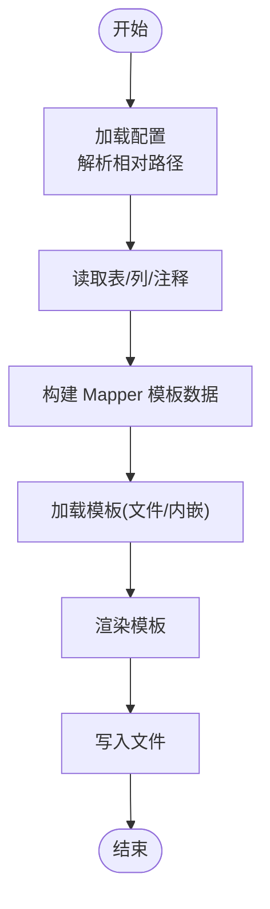
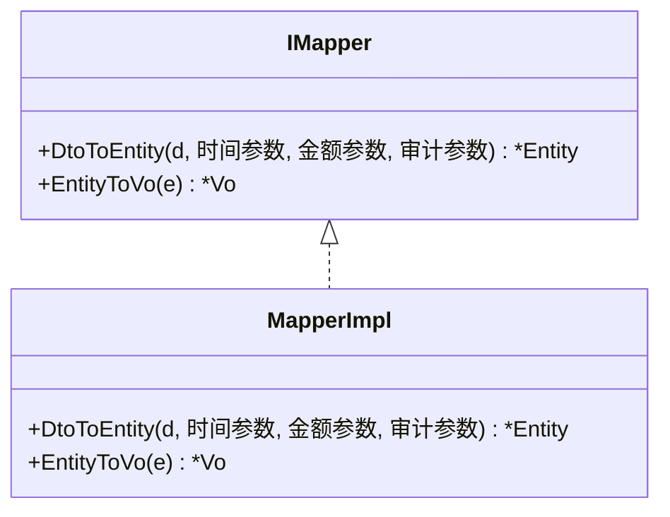
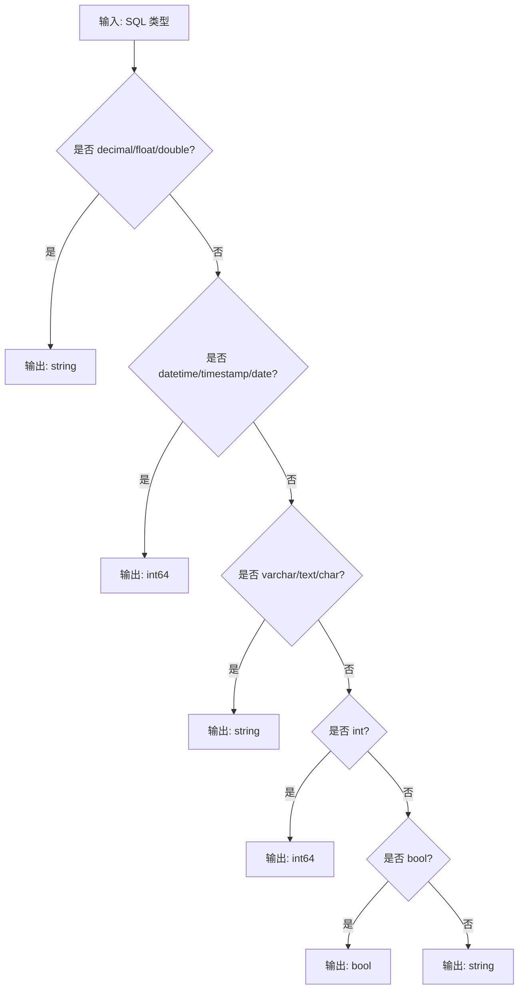
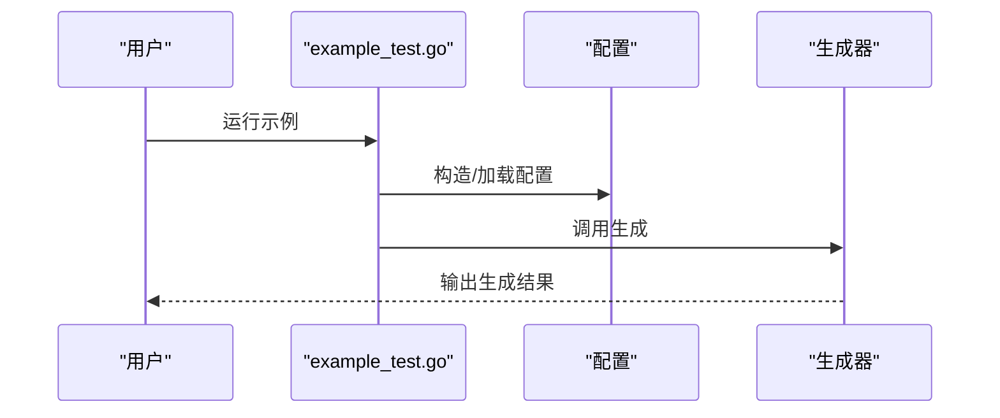
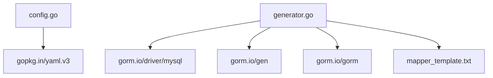

# Mapper 生成

<cite>
**本文引用的文件**
- [generator.go](file://generator/generator.go)
- [config.go](file://generator/config.go)
- [mapper_template.txt](file://generator/template/mapper_template.txt)
- [dto_template.txt](file://generator/template/dto_template.txt)
- [vo_template.txt](file://generator/template/vo_template.txt)
- [generator.example.yaml](file://generator/generator.example.yaml)
- [example_test.go](file://generator/example_test.go)
- [README.md](file://README.md)
- [go.mod](file://go.mod)
</cite>

## 目录
1. [简介](#简介)
2. [项目结构](#项目结构)
3. [核心组件](#核心组件)
4. [架构概览](#架构概览)
5. [详细组件分析](#详细组件分析)
6. [依赖分析](#依赖分析)
7. [性能考虑](#性能考虑)
8. [故障排查指南](#故障排查指南)
9. [结论](#结论)
10. [附录](#附录)

## 简介
本章节面向“Mapper 生成”能力，系统阐述其作用、使用场景、实现原理与最佳实践。Mapper 生成的核心价值在于：
- 将数据库实体（Model）与请求/响应对象（DTO/VO）之间的双向转换自动化，降低样板代码与映射错误风险。
- 通过统一的模板与类型映射规则，保证前后端交互数据的一致性与可维护性。
- 支持多种项目风格（普通项目与 go-zero 项目），并提供灵活的导入路径与结构体命名策略。

## 项目结构
与 Mapper 生成直接相关的模块位于 generator 子目录，包含：
- 配置与生成入口：config.go、generator.go、example_test.go、generator.example.yaml
- 模板：mapper_template.txt、dto_template.txt、vo_template.txt、api_template.txt、repository_template.txt、repository_gen_template.txt
- 顶层入口与文档：README.md、go.mod

图表来源
- [config.go:1-47](file://generator/config.go#L1-L47)
- [generator.go:1-1260](file://generator/generator.go#L1-L1260)
- [mapper_template.txt:1-82](file://generator/template/mapper_template.txt#L1-L82)
- [dto_template.txt:1-20](file://generator/template/dto_template.txt#L1-L20)
- [vo_template.txt:1-10](file://generator/template/vo_template.txt#L1-L10)
- [generator.example.yaml:1-17](file://generator/generator.example.yaml#L1-L17)
- [example_test.go:1-36](file://generator/example_test.go#L1-L36)

章节来源
- [README.md:660-695](file://README.md#L660-L695)
- [go.mod:1-26](file://go.mod#L1-L26)

## 核心组件
- 配置(Config)：定义数据库连接、输出路径、包名等生成参数。
- 生成器(generator)：负责读取数据库元信息、构建模板数据、加载模板、渲染并输出文件。
- 模板：分别定义 DTO/VO/Mapper 的结构与字段映射规则。
- 示例与配置：提供最小可运行示例与 YAML 配置样例。

章节来源
- [config.go:10-31](file://generator/config.go#L10-L31)
- [generator.go:643-717](file://generator/generator.go#L643-L717)
- [mapper_template.txt:1-82](file://generator/template/mapper_template.txt#L1-L82)
- [dto_template.txt:1-20](file://generator/template/dto_template.txt#L1-L20)
- [vo_template.txt:1-10](file://generator/template/vo_template.txt#L1-L10)
- [generator.example.yaml:1-17](file://generator/generator.example.yaml#L1-L17)
- [example_test.go:7-35](file://generator/example_test.go#L7-L35)

## 架构概览
Mapper 生成的整体流程如下：
- 读取配置与数据库元信息（表、列、注释等）
- 构建 Mapper 模板数据（含 DTO/VO 包路径、结构体名、字段类型与注释）
- 加载模板（优先文件系统，不存在时回退到内嵌模板）
- 渲染模板，生成 Mapper 接口与实现
- 输出到指定路径

图表来源
- [generator.go:322-340](file://generator/generator.go#L322-L340)
- [generator.go:643-717](file://generator/generator.go#L643-L717)
- [generator.go:185-210](file://generator/generator.go#L185-L210)

## 详细组件分析

### 组件A：生成器与模板数据
- 生成器职责
  - 解析配置路径（相对路径解析为项目根目录绝对路径）
  - 读取数据库表结构与注释
  - 构建 Mapper 模板数据（含 DTO/VO 包名、结构体名、字段类型、审计字段、时间/金额类型标记）
  - 加载模板（优先文件系统，不存在时回退到内嵌模板）
  - 渲染并输出文件
- 模板数据关键点
  - DTO/VO 包路径与结构体名根据项目风格（普通/GoZero）决定
  - 字段类型映射区分 API/DTO（时间/金额转字符串）、VO（时间/金额转字符串）、通用（时间/金额转 int64）
  - 审计字段（created_by/updated_by）特殊处理
  - 时间/金额字段标记用于控制导入 time 与 decimal 包

图表来源
- [generator.go:37-68](file://generator/generator.go#L37-L68)
- [generator.go:185-210](file://generator/generator.go#L185-L210)
- [generator.go:643-717](file://generator/generator.go#L643-L717)
- [generator.go:322-340](file://generator/generator.go#L322-L340)

章节来源
- [generator.go:37-68](file://generator/generator.go#L37-L68)
- [generator.go:185-210](file://generator/generator.go#L185-L210)
- [generator.go:643-717](file://generator/generator.go#L643-L717)
- [generator.go:322-340](file://generator/generator.go#L322-L340)

### 组件B：Mapper 模板与双向转换
- Mapper 接口与实现
  - 接口定义：DtoToEntity、EntityToVo
  - 实现：包含字段映射、时间/金额类型转换、审计字段处理
- 字段映射规则
  - DTO/VO 生成：排除软删字段（deleted_at），其余字段按类型映射
  - Mapper 转换：
    - DtoToEntity：忽略主键与审计字段，时间/金额字段通过显式参数传入
    - EntityToVo：时间字段转 Unix 时间戳，金额字段转字符串，其余字段直接赋值
- 导入控制
  - 仅在存在时间/金额字段时导入相应包
  - DTO/VO 包导入根据项目风格与包路径决定

图表来源
- [mapper_template.txt:21-35](file://generator/template/mapper_template.txt#L21-L35)
- [mapper_template.txt:37-81](file://generator/template/mapper_template.txt#L37-L81)

章节来源
- [mapper_template.txt:1-82](file://generator/template/mapper_template.txt#L1-L82)
- [dto_template.txt:1-20](file://generator/template/dto_template.txt#L1-L20)
- [vo_template.txt:1-10](file://generator/template/vo_template.txt#L1-L10)

### 组件C：DTO/VO 与 Model 的类型映射
- API/DTO 映射规则
  - decimal/float/double → string（避免前端精度丢失）
  - datetime/timestamp/date → int64（前端传时间戳）
  - 其余类型映射为 string/int64/bool
- VO 映射规则
  - decimal/float/double → string（返回给前端时保持字符串格式）
  - datetime/timestamp/date → int64（返回时间戳，前端自行格式化）
  - 其余类型映射为 string/int64/bool
- 通用映射规则
  - varchar/text/char → string
  - int → int64
  - bool → bool
  - json → string
  - date → int64

图表来源
- [generator.go:719-773](file://generator/generator.go#L719-L773)

章节来源
- [generator.go:719-773](file://generator/generator.go#L719-L773)

### 组件D：生成入口与示例
- 生成入口
  - 支持直接传入配置对象或从 YAML 文件加载配置
  - 生成完成后提示输入表名，支持单表或全库生成
- 示例
  - example_test.go 展示了两种调用方式
  - generator.example.yaml 提供了典型配置项

图表来源
- [example_test.go:7-35](file://generator/example_test.go#L7-L35)
- [generator.example.yaml:1-17](file://generator/generator.example.yaml#L1-L17)

章节来源
- [example_test.go:7-35](file://generator/example_test.go#L7-L35)
- [generator.example.yaml:1-17](file://generator/generator.example.yaml#L1-L17)

## 依赖分析
- 外部依赖
  - gopkg.in/yaml.v3：YAML 解析
  - gorm.io/driver/mysql：MySQL 驱动
  - gorm.io/gen：GORM 代码生成扩展
  - gorm.io/gorm：GORM ORM 核心
- 内部依赖
  - 模板系统依赖内嵌模板，若文件系统存在同名文件则优先使用
  - 生成器依赖数据库元信息（SHOW FULL COLUMNS、INFORMATION_SCHEMA.TABLES）

图表来源
- [go.mod:5-10](file://go.mod#L5-L10)
- [config.go:3-8](file://generator/config.go#L3-L8)
- [generator.go:3-20](file://generator/generator.go#L3-L20)

章节来源
- [go.mod:1-26](file://go.mod#L1-L26)
- [config.go:3-8](file://generator/config.go#L3-L8)
- [generator.go:3-20](file://generator/generator.go#L3-L20)

## 性能考虑
- 模板加载与渲染
  - 优先从文件系统加载模板，减少不必要的内嵌模板解析
  - 使用单次渲染输出，避免多次 IO
- 数据库元信息读取
  - 一次性读取表列与注释，避免重复查询
- 导入控制
  - 仅在存在时间/金额字段时导入相应包，减少编译期负担
- 生成策略
  - Model 每次生成覆盖，其他文件（Repository/API/VO/DTO/Mapper）已存在时不覆盖，提升增量开发效率

## 故障排查指南
- 未找到 go.mod
  - 现象：查找项目根目录失败
  - 处理：确认项目根目录包含 go.mod，或在正确目录执行
- 模板加载失败
  - 现象：模板文件不存在或无法解析
  - 处理：检查模板路径是否正确，或确认内嵌模板可用
- 数据库连接失败
  - 现象：无法读取表/列信息
  - 处理：检查配置中的 host/port/username/password/database
- 生成文件被覆盖
  - 现象：Repository/API/VO/DTO/Mapper 已存在被覆盖
  - 处理：遵循“Model 每次覆盖，其他文件已存在跳过”的策略，将自定义代码迁移到非生成文件中

章节来源
- [generator.go:22-35](file://generator/generator.go#L22-L35)
- [generator.go:322-340](file://generator/generator.go#L322-L340)
- [README.md:692-693](file://README.md#L692-L693)

## 结论
Mapper 生成通过标准化的模板与类型映射规则，实现了 DTO/VO 与 Model 之间的高效双向转换，显著降低了数据转换的样板代码与维护成本。结合配置化的生成入口与灵活的模板机制，开发者可以在不同项目风格（普通/GoZero）下快速获得高质量的映射代码，并通过导入控制与生成策略进一步优化性能与可维护性。

## 附录
- 使用步骤
  - 准备配置文件（generator.example.yaml）或直接构造配置对象
  - 调用生成入口（example_test.go 展示了两种方式）
  - 按提示输入表名，完成生成
- 最佳实践
  - 将自定义扩展代码放置在非生成文件中，避免被覆盖
  - 对时间/金额字段保持统一的前后端交互格式（时间戳/字符串）
  - 在复杂项目中启用文件系统模板覆盖，便于团队定制

章节来源
- [generator.example.yaml:1-17](file://generator/generator.example.yaml#L1-L17)
- [example_test.go:7-35](file://generator/example_test.go#L7-L35)
- [README.md:660-695](file://README.md#L660-L695)