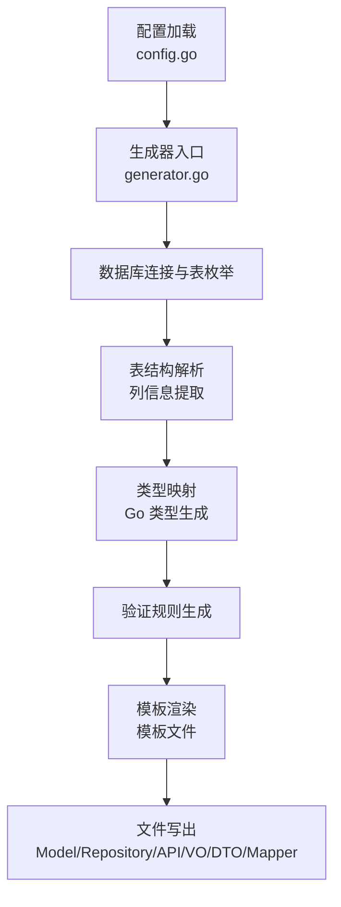
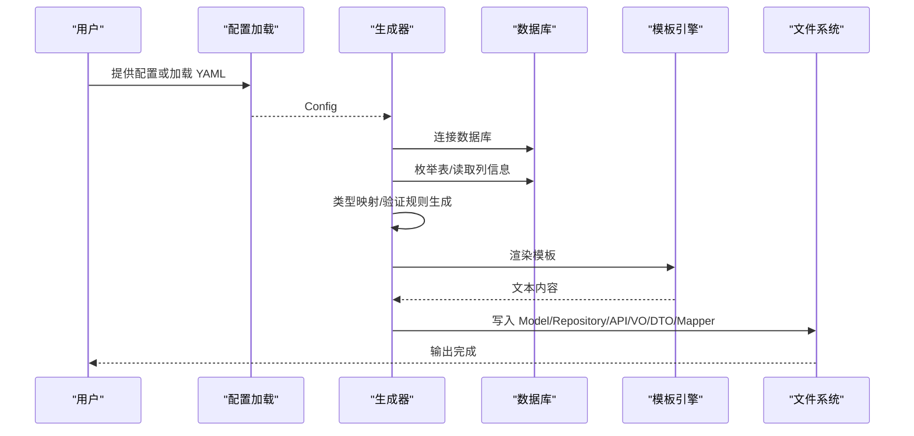
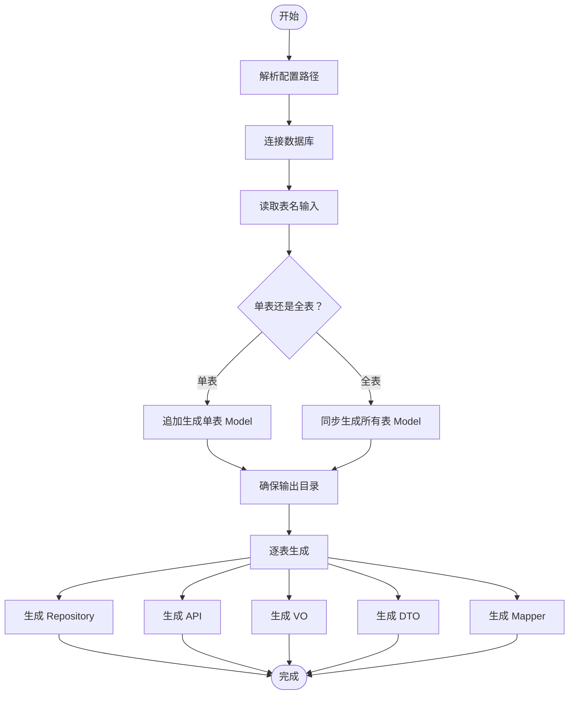
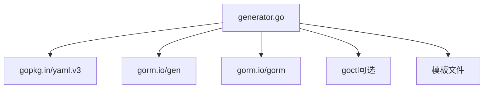

# Model 生成

<cite>
**本文引用的文件**
- [generator.go](file://generator/generator.go)
- [config.go](file://generator/config.go)
- [generator.example.yaml](file://generator/generator.example.yaml)
- [example_test.go](file://generator/example_test.go)
- [api_template.txt](file://generator/template/api_template.txt)
- [dto_template.txt](file://generator/template/dto_template.txt)
- [mapper_template.txt](file://generator/template/mapper_template.txt)
- [repository_gen_template.txt](file://generator/template/repository_gen_template.txt)
- [vo_template.txt](file://generator/template/vo_template.txt)
- [README.md](file://README.md)
</cite>

## 目录
1. [简介](#简介)
2. [项目结构](#项目结构)
3. [核心组件](#核心组件)
4. [架构总览](#架构总览)
5. [详细组件分析](#详细组件分析)
6. [依赖分析](#依赖分析)
7. [性能考虑](#性能考虑)
8. [故障排查指南](#故障排查指南)
9. [结论](#结论)
10. [附录](#附录)

## 简介
本文件面向“Model 生成”功能，系统性阐述其核心原理、实现机制与使用方法。重点覆盖以下方面：
- 数据库表结构解析与列信息提取
- 字段类型映射（MySQL → Go 类型）
- 验证规则生成（基于列属性与注释）
- 生成流程（Model、Repository、API、VO、DTO、Mapper）
- 模板体系与数据装配
- 配置项与自定义规则
- 最佳实践与常见问题

## 项目结构
围绕 Model 生成，关键模块与文件如下：
- 生成器入口与核心逻辑：generator/generator.go
- 配置定义与加载：generator/config.go、generator/generator.example.yaml
- 示例调用：generator/example_test.go
- 模板文件：generator/template/*.txt
- 顶层文档与使用说明：README.md

图表来源
- [generator.go:1038-1259](file://generator/generator.go#L1038-L1259)
- [config.go:10-47](file://generator/config.go#L10-L47)

章节来源
- [generator.go:1038-1259](file://generator/generator.go#L1038-L1259)
- [config.go:10-47](file://generator/config.go#L10-L47)
- [README.md:662-694](file://README.md#L662-L694)

## 核心组件
- 配置系统
  - Config：定义数据库连接、输出路径、包名等
  - LoadConfig：从 YAML 加载配置
- 生成器主体
  - Generate：主流程，负责 Model 生成、模板渲染、文件写出
  - generateForTable：逐表生成各产物
- 数据处理
  - getTableColumns：解析列信息（含是否可空、主键、额外信息、注释）
  - getGoType / getGoTypeForApiDto / getGoTypeForVo：类型映射规则
  - generateValidateRule：验证规则生成
- 模板与数据装配
  - buildMapperData：Mapper 模板数据组装
  - 各模板文件：api、dto、mapper、repository、vo
- 路径与 IO
  - resolveConfigPaths：将相对路径解析为绝对路径
  - ensureDir/writeFileIfNotExist/writeFileAlways：目录与文件管理

章节来源
- [config.go:10-47](file://generator/config.go#L10-L47)
- [generator.go:1038-1259](file://generator/generator.go#L1038-L1259)
- [generator.go:185-320](file://generator/generator.go#L185-L320)
- [generator.go:643-773](file://generator/generator.go#L643-L773)
- [generator.go:836-972](file://generator/generator.go#L836-L972)

## 架构总览
Model 生成的整体流程分为两阶段：
- 第一阶段：Model 生成（覆盖写入或追加）
- 第二阶段：逐表生成 Repository、API、VO、DTO、Mapper（已存在文件跳过）

图表来源
- [generator.go:1038-1259](file://generator/generator.go#L1038-L1259)
- [generator.go:322-340](file://generator/generator.go#L322-L340)
- [generator.go:836-972](file://generator/generator.go#L836-L972)

## 详细组件分析

### 数据库表结构解析与列信息提取
- 通过 SHOW FULL COLUMNS 获取列元数据，包括字段名、类型、是否可空、主键标记、额外信息、注释
- ColumnInfo 结构承载列的原始类型、Go 类型、字段名、JSON 标签、是否可空、是否主键、注释、验证规则、时间/数值/审计字段标记等
- getTableComment：读取表注释，作为 API/VO/DTO 的描述来源

章节来源
- [generator.go:185-227](file://generator/generator.go#L185-L227)
- [generator.go:281-285](file://generator/generator.go#L281-L285)

### 字段类型映射
- getGoType：通用映射（字符串、整型、浮点、布尔、时间戳等）
- getGoTypeForApiDto：API/DTO 专属映射（decimal/float/double → string；datetime/timestamp/date → int64）
- getGoTypeForVo：VO 专属映射（decimal/float/double → string；datetime/timestamp/date → int64）
- buildMapperData：在 Mapper 模板数据中识别 HasTimeField/HasDecimalField，以便导入 time/decimal 包

章节来源
- [generator.go:719-773](file://generator/generator.go#L719-L773)
- [generator.go:643-717](file://generator/generator.go#L643-L717)

### 验证规则生成
- generateValidateRule：依据列属性与注释生成校验规则
  - 非空字段：required
  - 主键字段：uuid
  - email/mobile 字段名特征：email/mobile
  - 注释中包含“数字是描述”的枚举规则：oneof=值1 值2 ...
  - 非空整型状态/类型/is_字段：gte=1
- API 模板：Create/Modify/Page 请求结构体字段附加 validate:"..." 标签
- DTO 模板：Create/Modify 结构体字段附加 validate 标签

章节来源
- [generator.go:287-320](file://generator/generator.go#L287-L320)
- [api_template.txt:12-23](file://generator/template/api_template.txt#L12-L23)
- [dto_template.txt:3-19](file://generator/template/dto_template.txt#L3-L19)

### 生成流程与控制流
- Generate 主流程
  - 解析配置路径（resolveConfigPaths）
  - 连接数据库（MySQL）
  - 交互式输入表名（空输入代表全表）
  - 选择模板目录（环境变量/可执行文件路径/工作目录）
  - gorm-gen 生成 Model（覆盖或追加）
  - 确保输出目录存在
  - 逐表生成 Repository/API/VO/DTO/Mapper（已存在跳过）
- generateForTable：按表生成各产物，调用对应生成函数与模板渲染

图表来源
- [generator.go:1038-1259](file://generator/generator.go#L1038-L1259)
- [generator.go:836-972](file://generator/generator.go#L836-L972)

章节来源
- [generator.go:1038-1259](file://generator/generator.go#L1038-L1259)
- [generator.go:836-972](file://generator/generator.go#L836-L972)

### 模板与数据装配
- 模板加载优先级：文件系统存在则优先使用；否则回退到内嵌模板
- 模板数据结构
  - ApiTemplateData/VoTemplateData：API/VO 模板数据
  - RepositoryTemplateData：Repository 模板数据（含主键字段/列信息）
  - MapperTemplateData：Mapper 模板数据（含 DTO/VO 包路径、结构体名、时间/decimal 标记、列信息）
- 渲染与写出
  - renderMapperTemplate：加载并渲染 Mapper 模板
  - writeFileIfNotExist：已存在文件跳过
  - writeFileAlways：始终覆盖（如 _gen.go/_option.go）

章节来源
- [generator.go:322-340](file://generator/generator.go#L322-L340)
- [generator.go:229-279](file://generator/generator.go#L229-L279)
- [generator.go:961-972](file://generator/generator.go#L961-L972)
- [generator.go:814-834](file://generator/generator.go#L814-L834)

### 生成产物与结构特点
- Model（gorm-gen）
  - 生成位置：out_path（默认 ./internal/dal/dao）
  - 包路径：model_pkg_path（默认 ./internal/dal/model/entity）
  - 名称策略：驼峰 + Entity 后缀
  - JSON 标签策略：lowerFirst(CamelCase)
  - 特殊字段：created_at/updated_at/soft delete 字段的 GORM 标签与注释
- Repository
  - 生成位置：repo_path（默认 ./internal/dal/repository）
  - 生成两类文件：_gen.go（默认实现）与 .go（扩展实现）
  - 默认实现包含 CRUD、分页、条件查询、存在性与计数等方法
- API（go-zero）
  - 生成位置：api_path（默认 ./apps/admin/desc）
  - 生成 .api 文件并调用 goctl 生成 go 代码
  - 请求/响应结构体字段带 validate 标签
- VO（View Object）
  - 生成位置：vo_path（默认 ./internal/dal/vo）
  - 字段类型遵循 VO 映射规则（decimal/time → string/int64）
- DTO（Data Transfer Object）
  - 生成位置：dto_path（默认 ./internal/dal/dto）
  - 字段类型遵循 API/DTO 映射规则（decimal/time → string/int64）
- Mapper
  - 生成位置：mapper_path（默认 ./internal/dal/mapper）
  - 接口定义 DtoToEntity/EntityToVo，实现类包含字段映射逻辑
  - 根据列类型自动导入 time/decimal 包

章节来源
- [generator.go:1095-1146](file://generator/generator.go#L1095-L1146)
- [generator.go:1167-1238](file://generator/generator.go#L1167-L1238)
- [generator.go:836-972](file://generator/generator.go#L836-L972)
- [api_template.txt:12-57](file://generator/template/api_template.txt#L12-L57)
- [dto_template.txt:3-19](file://generator/template/dto_template.txt#L3-L19)
- [vo_template.txt:3-9](file://generator/template/vo_template.txt#L3-L9)
- [mapper_template.txt:21-81](file://generator/template/mapper_template.txt#L21-L81)

### 使用示例与配置选项
- 配置文件示例：generator/generator.example.yaml
- 代码示例：generator/example_test.go（直接传 Config 或 LoadConfig）
- 命令行交互：输入表名（空输入生成所有表的 Model）
- 注意事项：Model 每次都会覆盖；Repository/API/VO/DTO 文件已存在时跳过

章节来源
- [generator.example.yaml:1-17](file://generator/generator.example.yaml#L1-L17)
- [example_test.go:7-35](file://generator/example_test.go#L7-L35)
- [README.md:662-694](file://README.md#L662-L694)

### 自定义规则与字段处理逻辑
- 类型映射自定义
  - gorm-gen DataTypeMap：int/decimal/json 等映射
  - getGoType/getGoTypeForApiDto/getGoTypeForVo：可扩展映射规则
- JSON 标签策略
  - JSON 标签：lowerFirst(CamelCase)，deleted_at 排除
- 验证规则扩展
  - generateValidateRule：可按业务需求增加规则（如长度、范围、正则等）
- 模板扩展
  - 优先使用文件系统模板；不存在时回退到内嵌模板
  - 可在本地 generator/template 目录自定义模板

章节来源
- [generator.go:1108-1120](file://generator/generator.go#L1108-L1120)
- [generator.go:1126-1131](file://generator/generator.go#L1126-L1131)
- [generator.go:287-320](file://generator/generator.go#L287-L320)
- [generator.go:322-340](file://generator/generator.go#L322-L340)

## 依赖分析
- 外部依赖
  - gorm.io/gen：Model 生成与字段标签配置
  - gorm.io/gorm：数据库连接与查询
  - gopkg.in/yaml.v3：YAML 配置解析
  - goctl：go-zero API 代码生成（可选）
- 内部依赖
  - 模板文件与生成器逻辑强耦合，模板数据结构与生成函数一一对应
  - 路径解析与 IO 操作贯穿全流程

图表来源
- [generator.go:3-20](file://generator/generator.go#L3-L20)
- [generator.go:1049-1052](file://generator/generator.go#L1049-L1052)
- [generator.go:886-894](file://generator/generator.go#L886-L894)

章节来源
- [generator.go:3-20](file://generator/generator.go#L3-L20)
- [generator.go:1049-1052](file://generator/generator.go#L1049-L1052)

## 性能考虑
- 模板渲染：模板数量有限，渲染开销可忽略
- 数据库访问：表枚举与列信息读取为 O(N) 操作，建议在本地或低延迟网络环境运行
- 文件写出：逐表顺序写出，IO 为瓶颈；可考虑并发写出（需注意文件冲突与锁）
- gorm-gen：Model 生成为一次性操作，建议在 CI/CD 中缓存依赖以减少重复生成

## 故障排查指南
- 未找到 go.mod
  - 现象：解析项目根目录失败
  - 处理：确保在项目根目录运行，或修正工作目录
- 数据库连接失败
  - 现象：连接数据库报错
  - 处理：检查 host/port/username/password/database
- 模板加载失败
  - 现象：模板文件不存在或解析失败
  - 处理：确认模板路径存在，或使用内嵌模板
- goctl 未安装
  - 现象：生成 API 后调用 goctl 失败
  - 处理：安装 goctl 并确保 PATH 可找到
- 文件已存在跳过
  - 现象：Repository/API/VO/DTO 文件未被覆盖
  - 处理：删除已有文件或调整输出路径

章节来源
- [generator.go:22-35](file://generator/generator.go#L22-L35)
- [generator.go:1049-1052](file://generator/generator.go#L1049-L1052)
- [generator.go:322-340](file://generator/generator.go#L322-L340)
- [generator.go:886-894](file://generator/generator.go#L886-L894)
- [generator.go:814-834](file://generator/generator.go#L814-L834)

## 结论
Model 生成器以 gorm-gen 为核心，结合自定义模板与规则，实现了从数据库表到 Go 结构体、Repository、API、VO、DTO、Mapper 的一体化生成。通过可配置的类型映射、验证规则与模板策略，既能满足通用场景，又便于扩展定制。建议在团队内统一配置与模板，配合 CI/CD 流水线自动化生成，提升开发效率与一致性。

## 附录
- 配置项说明
  - db_type/host/port/username/password/database：数据库连接
  - out_path/model_pkg_path/repo_path/api_path/vo_path/dto_path/mapper_path：各产物输出路径
  - package：项目包名
- 生成行为
  - Model：每次覆盖
  - Repository/API/VO/DTO：已存在跳过
  - Mapper：已存在跳过

章节来源
- [config.go:10-31](file://generator/config.go#L10-L31)
- [generator.example.yaml:1-17](file://generator/generator.example.yaml#L1-L17)
- [README.md:692-692](file://README.md#L692-L692)