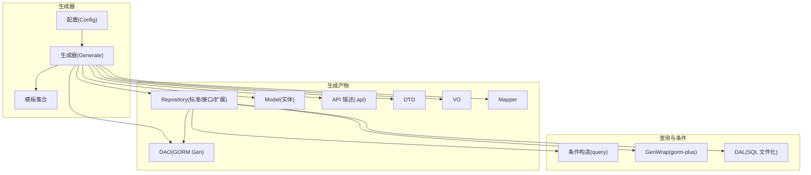
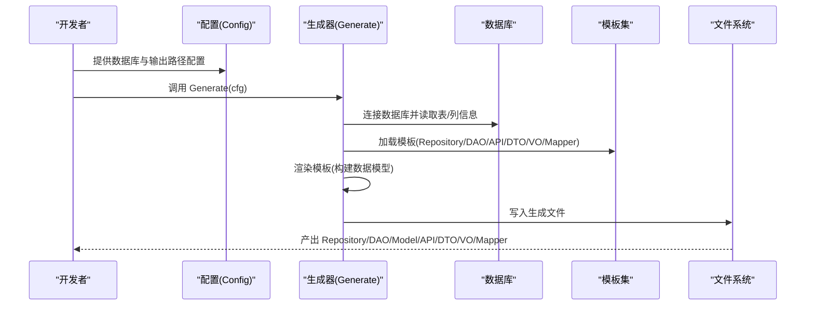
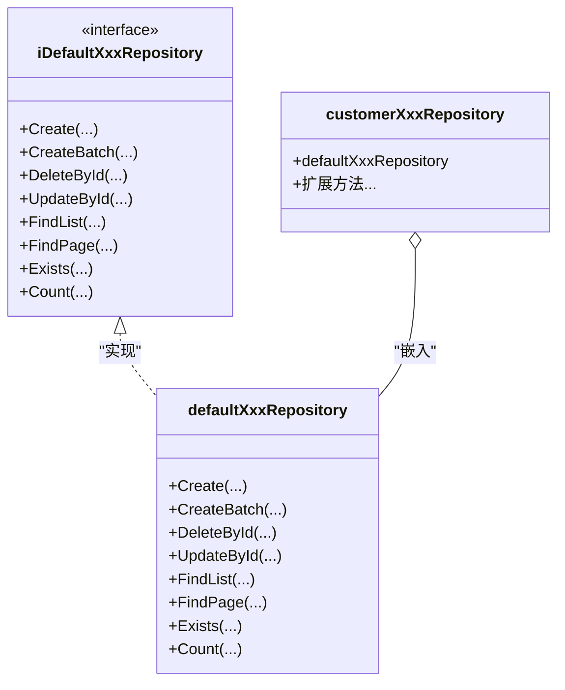
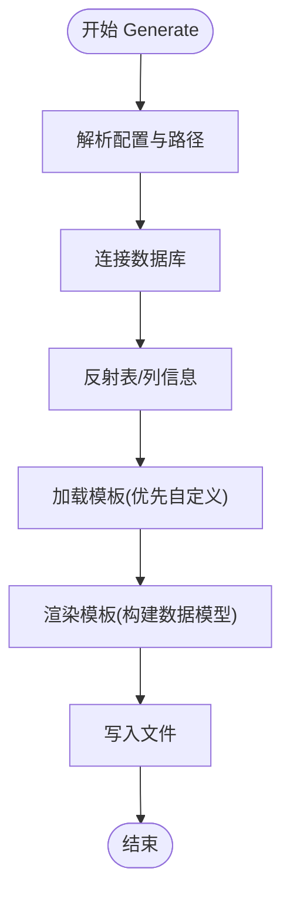
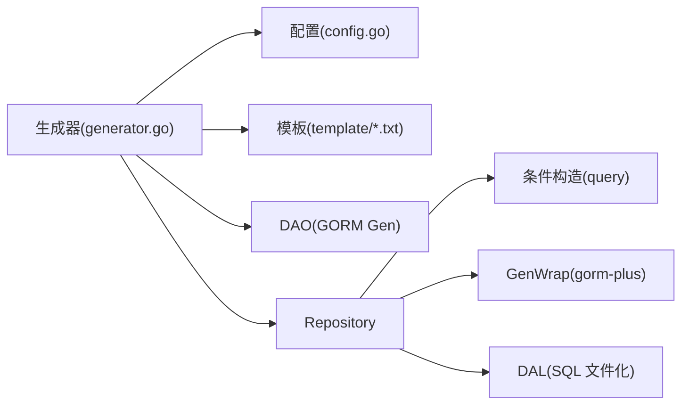

# Repository 生成

<cite>
**本文引用的文件**
- [generator.go](file://generator/generator.go)
- [config.go](file://generator/config.go)
- [example_test.go](file://generator/example_test.go)
- [generator.example.yaml](file://generator/generator.example.yaml)
- [repository_template.txt](file://generator/template/repository_template.txt)
- [repository_gen_template.txt](file://generator/template/repository_gen_template.txt)
- [api_template.txt](file://generator/template/api_template.txt)
- [dto_template.txt](file://generator/template/dto_template.txt)
- [vo_template.txt](file://generator/template/vo_template.txt)
- [mapper_template.txt](file://generator/template/mapper_template.txt)
- [query_builder.go](file://query/query_builder.go)
- [gormplus.go](file://gormplus.go)
- [dal.go](file://dal/dal.go)
</cite>

## 目录
1. [简介](#简介)
2. [项目结构](#项目结构)
3. [核心组件](#核心组件)
4. [架构总览](#架构总览)
5. [详细组件分析](#详细组件分析)
6. [依赖分析](#依赖分析)
7. [性能考虑](#性能考虑)
8. [故障排查指南](#故障排查指南)
9. [结论](#结论)
10. [附录](#附录)

## 简介
本文件面向 Repository 生成能力，系统阐述三种生成类型：标准 Repository、Repository 接口、Repository 扩展方法，以及它们的使用场景与差异。文档深入解释生成实现原理（DAO 层集成、CRUD 方法生成、查询条件构建）、生成产物结构与组织方式、使用示例与策略选择、以及自定义与扩展指南。读者可据此在项目中高效落地 Repository 层，获得类型安全、可维护、可扩展的数据访问层。

## 项目结构
- 生成器位于 generator 目录，包含配置、模板与生成逻辑。
- 生成产物包括 Repository、DAO、Model、API 描述、DTO、VO、Mapper 等。
- 查询与条件构建由 query 包提供，结合 gorm-plus 的 GenWrap 能力实现类型安全的链式条件构造。
- DAL 提供 SQL 文件化查询能力，与 Repository 的生成形成互补。



**图表来源**
- [generator.go:1037-1260](file://generator/generator.go#L1037-L1260)
- [config.go:10-31](file://generator/config.go#L10-L31)
- [repository_gen_template.txt:1-346](file://generator/template/repository_gen_template.txt#L1-L346)
- [repository_template.txt:1-28](file://generator/template/repository_template.txt#L1-L28)
- [query_builder.go:46-145](file://query/query_builder.go#L46-L145)
- [gormplus.go:290-341](file://gormplus.go#L290-L341)
- [dal.go:594-628](file://dal/dal.go#L594-L628)

**章节来源**
- [generator.go:1037-1260](file://generator/generator.go#L1037-L1260)
- [config.go:10-31](file://generator/config.go#L10-L31)

## 核心组件
- 生成器配置(Config)：定义数据库连接、输出路径、包名等。
- 生成器主流程(Generate)：解析配置、加载模板、连接数据库、反射表结构、渲染模板并落盘。
- 模板系统：包含 Repository、DAO、Model、API、DTO、VO、Mapper 等模板。
- 查询与条件构建：IQueryBuilder、GenWrap、QueryOption 等，支撑 Repository 的查询能力。
- DAO 层：由 GORM Gen 生成，Repository 通过 DAO 访问数据库。
- DAL：SQL 文件化查询，与 Repository 并行存在，适合复杂 SQL 场景。

**章节来源**
- [config.go:10-31](file://generator/config.go#L10-L31)
- [generator.go:1037-1260](file://generator/generator.go#L1037-L1260)
- [query_builder.go:46-145](file://query/query_builder.go#L46-L145)
- [gormplus.go:290-341](file://gormplus.go#L290-L341)
- [dal.go:594-628](file://dal/dal.go#L594-L628)

## 架构总览
Repository 生成采用“模板 + 数据模型”的方式，将数据库表元信息映射为 Go 代码。生成的 Repository 通过 DAO 访问数据库，同时可结合 GenWrap 与 QueryOption 构建复杂查询条件，实现类型安全与灵活组合。



**图表来源**
- [generator.go:1037-1260](file://generator/generator.go#L1037-L1260)
- [config.go:10-31](file://generator/config.go#L10-L31)

## 详细组件分析

### 三种 Repository 生成类型与使用场景
- 标准 Repository(defaultXxxRepository)
  - 作用：提供完整的 CRUD 与查询能力，封装 DAO 访问。
  - 特点：包含 Create/CreateBatch/Delete/Update/Find/Exists/Count 等方法族，支持 Tx 与 Wrapper 条件。
  - 适用：通用数据访问层，快速落地业务 CRUD。
- Repository 接口(iDefaultXxxRepository)
  - 作用：定义标准契约，便于依赖倒置与测试替身。
  - 特点：与 defaultXxxRepository 同名方法签名一致，便于替换实现。
  - 适用：需要解耦或进行接口隔离的场景。
- Repository 扩展方法(customerXxxRepository)
  - 作用：在 defaultXxxRepository 基础上嵌入扩展，实现业务定制。
  - 特点：通过匿名字段嵌入 defaultXxxRepository，可覆盖或新增方法；NewXxxRepository 返回扩展实例。
  - 适用：需要在通用能力之上叠加业务方法或覆盖默认行为。



**图表来源**
- [repository_gen_template.txt:15-346](file://generator/template/repository_gen_template.txt#L15-L346)
- [repository_template.txt:6-25](file://generator/template/repository_template.txt#L6-L25)

**章节来源**
- [repository_gen_template.txt:1-346](file://generator/template/repository_gen_template.txt#L1-L346)
- [repository_template.txt:1-28](file://generator/template/repository_template.txt#L1-L28)

### 生成实现原理与 DAO 集成
- 配置解析与路径解析：resolveConfigPaths 将相对路径解析为绝对路径，确保生成器在不同工作目录下行为一致。
- 模板加载：优先从文件系统加载用户自定义模板，若不存在则回退到内嵌模板。
- 表结构反射：getTableColumns 读取列信息，getTableComment 读取表注释，用于生成 API/DTO/VO 等。
- 类型映射：getGoType/getGoTypeForApiDto/getGoTypeForVo 将 SQL 类型映射为 Go 类型，确保 API/VO/DAL 的一致性。
- 生成流程：Generate 调用各 generateXxxFile 系列函数，渲染模板并写入文件。



**图表来源**
- [generator.go:37-68](file://generator/generator.go#L37-L68)
- [generator.go:185-210](file://generator/generator.go#L185-L210)
- [generator.go:322-340](file://generator/generator.go#L322-L340)
- [generator.go:1037-1260](file://generator/generator.go#L1037-L1260)

**章节来源**
- [generator.go:37-68](file://generator/generator.go#L37-L68)
- [generator.go:185-210](file://generator/generator.go#L185-L210)
- [generator.go:322-340](file://generator/generator.go#L322-L340)
- [generator.go:1037-1260](file://generator/generator.go#L1037-L1260)

### CRUD 方法生成与查询条件构建
- CRUD 方法族：Create/CreateBatch/Delete/Update/Find/Exists/Count 等，支持 Tx 与 Wrapper 条件版本。
- 查询选项(QueryOption)：buildTx/buildWrapperTx 统一处理 Where/Select/Omit/Order/Limit 等，保证查询一致性。
- GenWrap：通过 IGenWrapper 提供类型安全的链式条件构造，支持 AND/OR 分组、函数分组等。
- 原生条件：DeleteByCondition/UpdateByCondition/FindList/FindPage 等直接接受 gen.Condition，满足复杂条件需求。

```mermaid
sequenceDiagram
participant Repo as "Repository"
participant Opt as "QueryOption"
participant Wrap as "GenWrap"
participant DAO as "DAO"
participant DB as "数据库"
Repo->>Repo : buildTx(ctx, query)
Repo->>Opt : 解析 Cond/Select/Omit/Order/Limit
Repo->>DAO : WithContext(ctx).Where(...).Select(...).Order(...).Limit(...)
DAO->>DB : 执行查询/更新/删除
Repo->>Repo : buildWrapperTx(ctx, fn, query)
Repo->>Wrap : GenWrap(WithContext).Where(fn).Apply()
Wrap->>DAO : Apply() 返回 DO
DAO->>DB : 执行查询/更新/删除
```

**图表来源**
- [repository_gen_template.txt:74-128](file://generator/template/repository_gen_template.txt#L74-L128)
- [repository_gen_template.txt:132-342](file://generator/template/repository_gen_template.txt#L132-L342)
- [gormplus.go:290-341](file://gormplus.go#L290-L341)
- [query_builder.go:46-145](file://query/query_builder.go#L46-L145)

**章节来源**
- [repository_gen_template.txt:74-128](file://generator/template/repository_gen_template.txt#L74-L128)
- [repository_gen_template.txt:132-342](file://generator/template/repository_gen_template.txt#L132-L342)
- [gormplus.go:290-341](file://gormplus.go#L290-L341)
- [query_builder.go:46-145](file://query/query_builder.go#L46-L145)

### 生成产物结构与组织方式
- 输出路径：通过 Config.out_path/model_pkg_path/repo_path/api_path/vo_path/dto_path/mapper_path 控制。
- 包名：Config.package 指定项目包名，模板中通过 {{.Package}}/{{.ModelPkgPath}} 等占位符生成 import。
- 生成文件：Repository(标准/接口/扩展)、DAO(Model)、API(.api)、DTO、VO、Mapper 等。
- 模板数据：RepositoryTemplateData/MapperTemplateData 等承载表结构、字段类型、包路径等信息。

**章节来源**
- [config.go:20-31](file://generator/config.go#L20-L31)
- [repository_gen_template.txt:5-13](file://generator/template/repository_gen_template.txt#L5-L13)
- [mapper_template.txt:3-19](file://generator/template/mapper_template.txt#L3-L19)

### 使用示例与策略选择
- 示例入口：ExampleGenerate 展示了直接传入配置或从 YAML 加载配置两种方式。
- 策略选择：
  - 标准 Repository：快速起步，覆盖常见 CRUD 与分页。
  - Repository 接口：需要解耦或进行接口隔离时使用。
  - 扩展方法：在 defaultXxxRepository 基础上叠加业务方法或覆盖默认行为。
- 生成策略：通过配置 out_path/model_pkg_path/repo_path 等路径，决定生成位置；通过 api_path/vo_path/dto_path/mapper_path 控制其他产物。

**章节来源**
- [example_test.go:7-35](file://generator/example_test.go#L7-L35)
- [generator.example.yaml:1-17](file://generator/generator.example.yaml#L1-L17)

### 自定义与扩展指南
- 自定义模板：在文件系统提供同名模板文件可覆盖内嵌模板，实现个性化生成。
- 生成器入口：gormplus.Generate(cfg) 提供统一入口，便于在业务工程中集成。
- DAO 与 Repository：DAO 由 GORM Gen 生成，Repository 通过 DAO 访问数据库；可在扩展 Repository 中组合 GenWrap 与 QueryOption 实现复杂查询。
- API/DTO/VO/Mapper：生成 API 描述、DTO、VO、Mapper 便于前后端交互与数据映射。

**章节来源**
- [generator.go:322-340](file://generator/generator.go#L322-L340)
- [gormplus.go:894-906](file://gormplus.go#L894-L906)
- [repository_gen_template.txt:5-13](file://generator/template/repository_gen_template.txt#L5-L13)
- [mapper_template.txt:1-82](file://generator/template/mapper_template.txt#L1-L82)

## 依赖分析
- 生成器依赖：gorm.io/gorm、gorm.io/gen、gorm.io/gen/field、gopkg.in/yaml.v3 等。
- 查询依赖：query 包提供 IQueryBuilder；gormplus 提供 GenWrap；DAL 提供 SQL 文件化查询。
- 生成器与查询模块的耦合度低，Repository 既可通过 DAO 访问数据库，也可结合 GenWrap 与 QueryOption 构建复杂查询。



**图表来源**
- [generator.go:1-20](file://generator/generator.go#L1-L20)
- [query_builder.go:39-44](file://query/query_builder.go#L39-L44)
- [gormplus.go:88-101](file://gormplus.go#L88-L101)
- [dal.go:71-83](file://dal/dal.go#L71-L83)

**章节来源**
- [generator.go:1-20](file://generator/generator.go#L1-L20)
- [query_builder.go:39-44](file://query/query_builder.go#L39-L44)
- [gormplus.go:88-101](file://gormplus.go#L88-L101)
- [dal.go:71-83](file://dal/dal.go#L71-L83)

## 性能考虑
- 模板加载：优先使用文件系统自定义模板，减少内嵌模板解析成本。
- 查询优化：通过 QueryOption 统一设置 Select/Omit/Order/Limit，避免不必要的字段与排序。
- GenWrap：在复杂条件场景使用类型安全的链式构造，减少手写 SQL 的错误与重复。
- DAL：SQL 文件化查询支持缓存与清理，适合复杂 SQL 场景；与 Repository 并行使用，按场景选择。

[本节为通用指导，无需具体文件分析]

## 故障排查指南
- 配置问题：确认 Config 中数据库连接与输出路径正确；使用 resolveConfigPaths 确保路径解析一致。
- 模板问题：检查文件系统是否存在同名模板；若缺失则回退到内嵌模板。
- 类型映射：确认 SQL 类型映射规则符合预期；API/VO/DAL 的类型映射需保持一致。
- 查询异常：检查 QueryOption 与 GenWrap 的使用；确认条件构造的 AND/OR 分组正确。
- 生成失败：查看 Generate 的错误返回，定位模板渲染或文件写入阶段的问题。

**章节来源**
- [generator.go:37-68](file://generator/generator.go#L37-L68)
- [generator.go:322-340](file://generator/generator.go#L322-L340)
- [generator.go:1037-1260](file://generator/generator.go#L1037-L1260)

## 结论
Repository 生成提供了标准化、可扩展的数据访问层方案。通过三种生成类型（标准、接口、扩展），开发者可以在通用能力与业务定制之间取得平衡。结合 DAO、GenWrap、QueryOption 与 DAL，可实现类型安全、高性能、易维护的数据访问层。建议在项目中统一使用生成器，配合清晰的目录结构与模板约定，提升团队协作效率与代码质量。

[本节为总结，无需具体文件分析]

## 附录
- 生成器入口：gormplus.Generate(cfg)
- 配置示例：generator.example.yaml
- 模板清单：repository_template.txt、repository_gen_template.txt、api_template.txt、dto_template.txt、vo_template.txt、mapper_template.txt

**章节来源**
- [gormplus.go:894-906](file://gormplus.go#L894-L906)
- [generator.example.yaml:1-17](file://generator/generator.example.yaml#L1-L17)
- [repository_template.txt:1-28](file://generator/template/repository_template.txt#L1-L28)
- [repository_gen_template.txt:1-346](file://generator/template/repository_gen_template.txt#L1-L346)
- [api_template.txt:1-93](file://generator/template/api_template.txt#L1-L93)
- [dto_template.txt:1-20](file://generator/template/dto_template.txt#L1-L20)
- [vo_template.txt:1-10](file://generator/template/vo_template.txt#L1-L10)
- [mapper_template.txt:1-82](file://generator/template/mapper_template.txt#L1-L82)