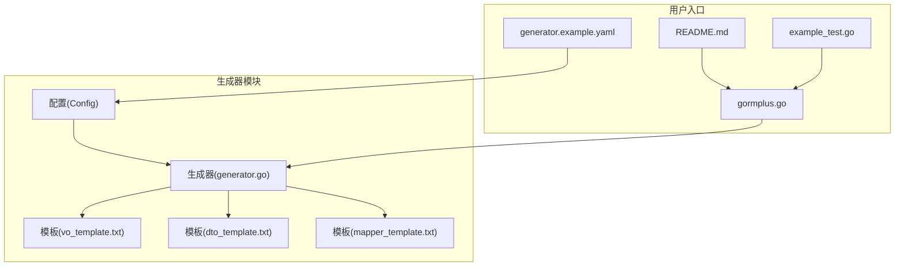
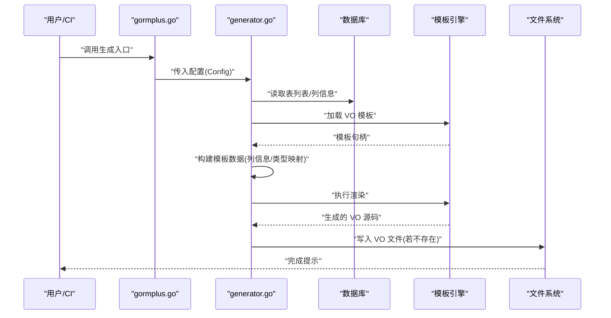
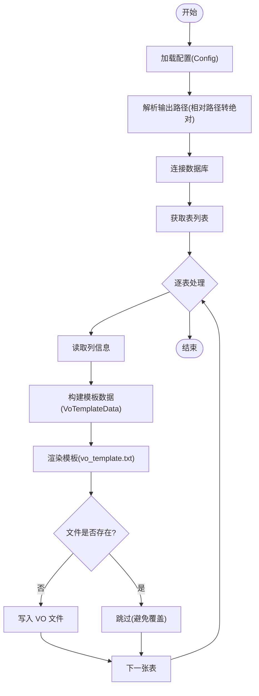
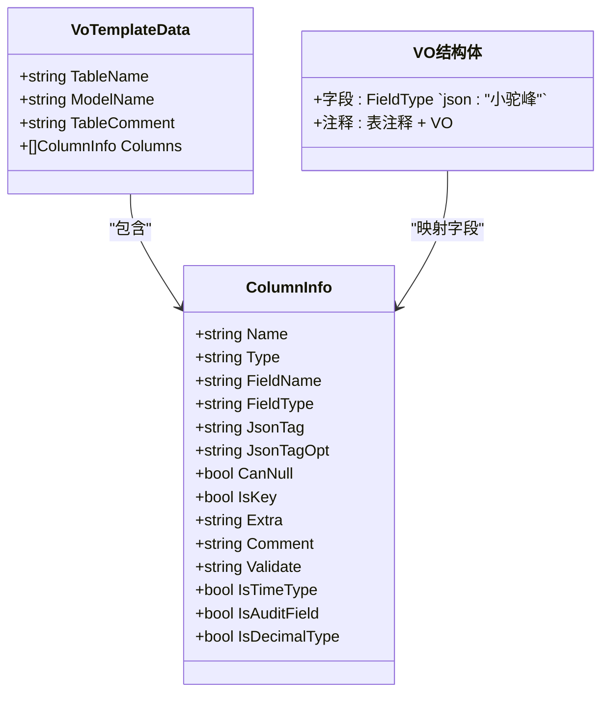
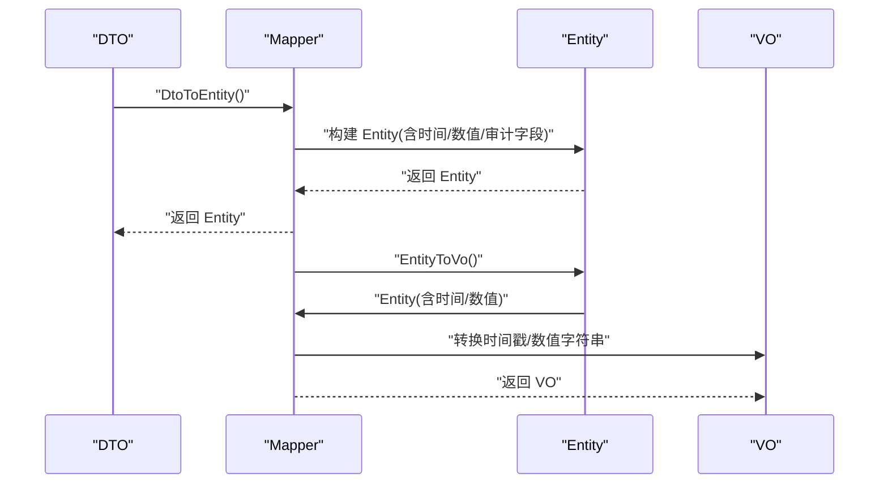
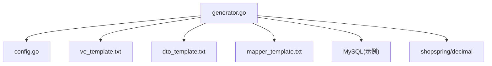

# VO 生成

<cite>
**本文引用的文件**
- [generator.go](file://generator/generator.go)
- [config.go](file://generator/config.go)
- [generator.example.yaml](file://generator/generator.example.yaml)
- [vo_template.txt](file://generator/template/vo_template.txt)
- [dto_template.txt](file://generator/template/dto_template.txt)
- [mapper_template.txt](file://generator/template/mapper_template.txt)
- [example_test.go](file://generator/example_test.go)
- [README.md](file://README.md)
- [gormplus.go](file://gormplus.go)
</cite>

## 目录
1. [简介](#简介)
2. [项目结构](#项目结构)
3. [核心组件](#核心组件)
4. [架构总览](#架构总览)
5. [详细组件分析](#详细组件分析)
6. [依赖分析](#依赖分析)
7. [性能考虑](#性能考虑)
8. [故障排查指南](#故障排查指南)
9. [结论](#结论)
10. [附录](#附录)

## 简介
本章节面向“VO（Value Object）生成”能力，系统阐述其作用、应用场景、与 Model/DTO 的区别，以及在本项目中的实现原理、使用方式、生成规则与输出格式定制、结构特性与设计模式。VO 生成的目标是为数据库表生成面向前端展示的只读视图对象，强调简洁、可序列化、便于前后端契约传递。

- VO 的定位：面向前端的轻量视图对象，字段通常与数据库列一一对应，但经过类型转换与序列化标签优化，便于 JSON 序列化/反序列化。
- 与 Model 的区别：Model 更偏向 ORM 映射与持久化，字段与数据库 schema 严格一致；VO 更偏向表现层，关注序列化与展示。
- 与 DTO 的区别：DTO 通常用于请求/响应校验与传输，常含验证标签；VO 侧重展示，一般不携带验证标签，但可包含序列化规则。

## 项目结构
围绕 VO 生成的相关模块主要位于 generator 子包，包含：
- 配置与入口：config.go、generator.go、generator.example.yaml
- 模板：vo_template.txt、dto_template.txt、mapper_template.txt
- 使用示例：example_test.go
- 文档与集成：README.md、gormplus.go

**图表来源**
- [generator.go](file://generator/generator.go)
- [config.go](file://generator/config.go)
- [vo_template.txt](file://generator/template/vo_template.txt)
- [dto_template.txt](file://generator/template/dto_template.txt)
- [mapper_template.txt](file://generator/template/mapper_template.txt)
- [README.md](file://README.md)
- [gormplus.go](file://gormplus.go)
- [generator.example.yaml](file://generator/generator.example.yaml)

**章节来源**
- [generator.go](file://generator/generator.go)
- [config.go](file://generator/config.go)
- [README.md](file://README.md)
- [gormplus.go](file://gormplus.go)

## 核心组件
- 配置结构 Config：定义数据库连接、输出路径（含 vo_path）、项目包名等，用于驱动生成流程。
- 生成器主流程：负责解析配置、加载模板、读取表元数据、构建模板数据、渲染并落盘。
- 模板系统：VO 模板定义 VO 结构体的字段、类型与 JSON 标签；DTO 模板定义请求/修改结构体及校验规则；Mapper 模板定义实体与 VO 的映射方法。
- 类型映射：VO 采用 getGoTypeForVo 规则，对 decimal/float/double 保持字符串、datetime/timestamp/date 映射为 int64（时间戳），其余与通用规则一致。
- 字段处理：VO 模板会跳过 deleted_at 字段，避免软删除字段暴露给前端。

**章节来源**
- [config.go](file://generator/config.go)
- [generator.go](file://generator/generator.go)
- [vo_template.txt](file://generator/template/vo_template.txt)
- [dto_template.txt](file://generator/template/dto_template.txt)
- [mapper_template.txt](file://generator/template/mapper_template.txt)

## 架构总览
下图展示了 VO 生成的端到端流程：从配置加载、表元数据采集、模板渲染到文件落盘。

**图表来源**
- [generator.go](file://generator/generator.go)
- [vo_template.txt](file://generator/template/vo_template.txt)
- [README.md](file://README.md)
- [gormplus.go](file://gormplus.go)

## 详细组件分析

### VO 生成实现原理
- 表元数据采集：通过 SHOW FULL COLUMNS 与 INFORMATION_SCHEMA.TABLES 获取列名、类型、可空、主键、注释与表注释。
- 模板数据构建：遍历列，计算字段名（驼峰）、Go 类型（VO 规则）、JSON 标签（小驼峰）、可空标志、审计字段标记、时间/数值类型标记等。
- 渲染与落盘：使用 text/template 渲染模板，生成 VO 结构体，写入到 vo_path 下对应文件（若文件不存在则写入，已存在则跳过）。

**图表来源**
- [generator.go](file://generator/generator.go)
- [vo_template.txt](file://generator/template/vo_template.txt)

**章节来源**
- [generator.go](file://generator/generator.go)
- [vo_template.txt](file://generator/template/vo_template.txt)

### VO 模板与结构特性
- 包与注释：模板固定 package 为 model，并在结构体上添加注释（表注释 + VO）。
- 字段定义：遍历列，跳过 deleted_at；字段名为驼峰，类型来自 getGoTypeForVo；JSON 标签为小驼峰。
- 类型转换规则（VO）：
  - decimal/float/double → string（保持字符串，避免前端精度问题）
  - datetime/timestamp/date → int64（时间戳，前端自行格式化）
  - 其余类型与通用规则一致（varchar/text/char→string，int→int64，bool→bool，json→string）

**图表来源**
- [generator.go](file://generator/generator.go)
- [vo_template.txt](file://generator/template/vo_template.txt)

**章节来源**
- [vo_template.txt](file://generator/template/vo_template.txt)
- [generator.go](file://generator/generator.go)

### 与 DTO 的区别与协作
- DTO：面向请求/响应，包含校验标签（如 required、email、mobile、oneof 等），用于输入校验与传输约束。
- VO：面向展示，不包含校验标签，字段简洁，JSON 标签小驼峰，便于前端消费。
- Mapper：提供 DTO/Entity 与 VO 的双向映射方法，处理时间/数值类型的转换（如 Entity 时间转 VO Unix 时间、decimal.StringFixed）。

**图表来源**
- [mapper_template.txt](file://generator/template/mapper_template.txt)
- [dto_template.txt](file://generator/template/dto_template.txt)
- [generator.go](file://generator/generator.go)

**章节来源**
- [mapper_template.txt](file://generator/template/mapper_template.txt)
- [dto_template.txt](file://generator/template/dto_template.txt)
- [generator.go](file://generator/generator.go)

### 类型映射与字段处理细节
- getGoTypeForVo：decimal/float/double→string；datetime/timestamp/date→int64；其余与通用规则一致。
- VO 模板：跳过 deleted_at；JSON 标签小驼峰；字段注释来自数据库列注释。
- DTO 模板：根据列可空、主键、邮箱/手机号关键字、注释枚举等生成 validate 标签。
- Mapper 模板：根据列类型自动导入 time、decimal 包；区分审计字段与时间/数值类型进行特殊处理。

**章节来源**
- [generator.go](file://generator/generator.go)
- [vo_template.txt](file://generator/template/vo_template.txt)
- [dto_template.txt](file://generator/template/dto_template.txt)
- [mapper_template.txt](file://generator/template/mapper_template.txt)

### 使用示例与配置
- 配置文件示例：generator.example.yaml 提供数据库连接、输出路径（含 vo_path）、项目包名等。
- 代码示例：example_test.go 展示如何直接传入 Config 或通过 LoadConfig 加载 YAML 并调用 Generate。
- README 集成：README.md 在“代码生成器”章节给出 YAML 配置与调用 Generate 的示例，强调 VO 生成的触发条件与行为。

**章节来源**
- [generator.example.yaml](file://generator/generator.example.yaml)
- [example_test.go](file://generator/example_test.go)
- [README.md](file://README.md)

## 依赖分析
- 外部依赖：gorm.io/driver/mysql（示例驱动）、gorm.io/gen（模型生成）、shopspring/decimal（数值处理）。
- 内部依赖：生成器依赖模板系统、配置解析、数据库元数据读取；VO 生成与 DTO/Mapper 生成相互独立，但共享类型映射与字段处理逻辑。

**图表来源**
- [generator.go](file://generator/generator.go)
- [config.go](file://generator/config.go)
- [vo_template.txt](file://generator/template/vo_template.txt)
- [dto_template.txt](file://generator/template/dto_template.txt)
- [mapper_template.txt](file://generator/template/mapper_template.txt)

**章节来源**
- [generator.go](file://generator/generator.go)
- [config.go](file://generator/config.go)

## 性能考虑
- 模板渲染：使用内嵌模板与 text/template，避免磁盘 IO；仅在模板不存在时回退到文件系统读取。
- 文件落盘策略：VO 文件已存在则跳过，避免重复写入；Model 生成采用追加模式，减少全量重建成本。
- 数据库访问：仅读取列信息与表注释，查询次数与表数量线性相关，通常可忽略。

[本节为通用指导，不涉及具体文件分析]

## 故障排查指南
- 未找到 go.mod：resolveConfigPaths 会在当前目录向上查找 go.mod，若找不到会报错。请确认项目根目录包含 go.mod。
- 模板加载失败：优先尝试文件系统模板，不存在时回退到内嵌模板；若两者均失败，检查模板文件名与路径。
- 生成跳过：VO 文件已存在时跳过；如需强制覆盖，请先删除已有文件或调整生成策略。
- 数据库连接：确保配置中的 host/port/username/password/database 正确；如使用非 MySQL 驱动，需在外部传入 Dialector 并在生成器中使用相应驱动。

**章节来源**
- [generator.go](file://generator/generator.go)

## 结论
VO 生成在本项目中提供了面向前端展示的轻量视图对象，具备清晰的类型转换规则、简洁的字段定义与稳定的模板机制。结合 DTO 的输入校验与 Mapper 的双向映射，形成从前端请求到数据库实体再到前端展示的完整链路。通过 YAML 配置与示例入口，用户可以快速启用并定制生成规则。

[本节为总结性内容，不涉及具体文件分析]

## 附录

### VO 生成配置项说明
- db_type/host/port/username/password/database：数据库连接信息
- out_path/model_pkg_path/repo_path/api_path/vo_path/dto_path/mapper_path：各产物输出路径
- package：项目包名

**章节来源**
- [config.go](file://generator/config.go)
- [generator.example.yaml](file://generator/generator.example.yaml)

### VO 输出格式与定制
- 输出包：固定为 model
- 结构体命名：{ModelName}Vo
- 字段命名：驼峰（首字母大写）
- JSON 标签：小驼峰
- 注释：表注释 + VO
- 特殊字段：deleted_at 跳过
- 类型映射：decimal/float/double→string；datetime/timestamp/date→int64；其余与通用规则一致

**章节来源**
- [vo_template.txt](file://generator/template/vo_template.txt)
- [generator.go](file://generator/generator.go)

### 与 gormplus 集成入口
- gormplus.go 暴露统一入口，包含代码生成器模块；README.md 提供调用示例与注意事项。

**章节来源**
- [gormplus.go](file://gormplus.go)
- [README.md](file://README.md)