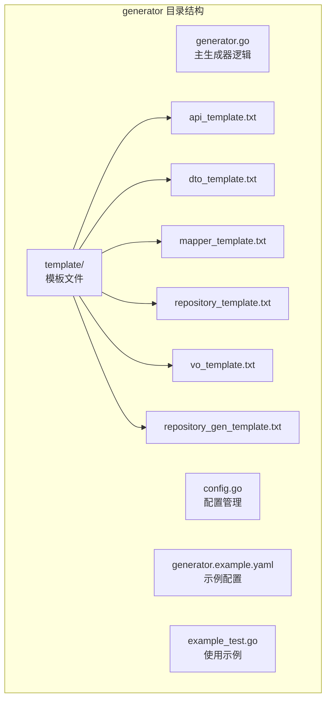
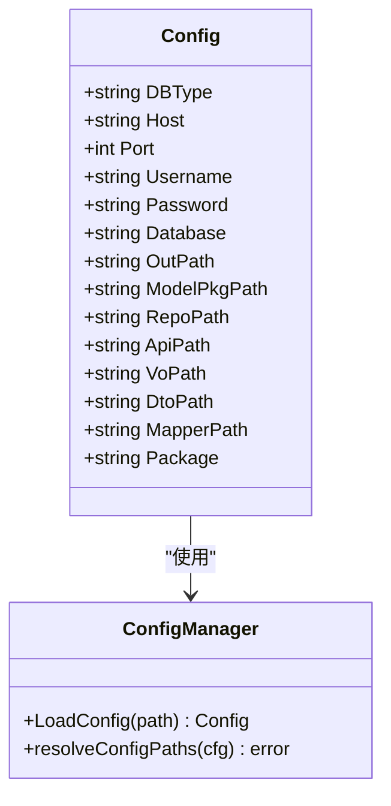
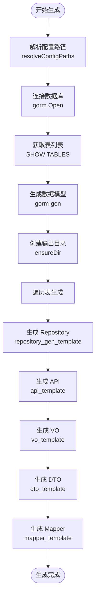
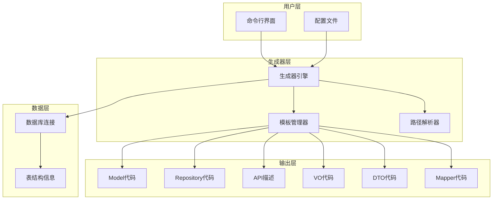
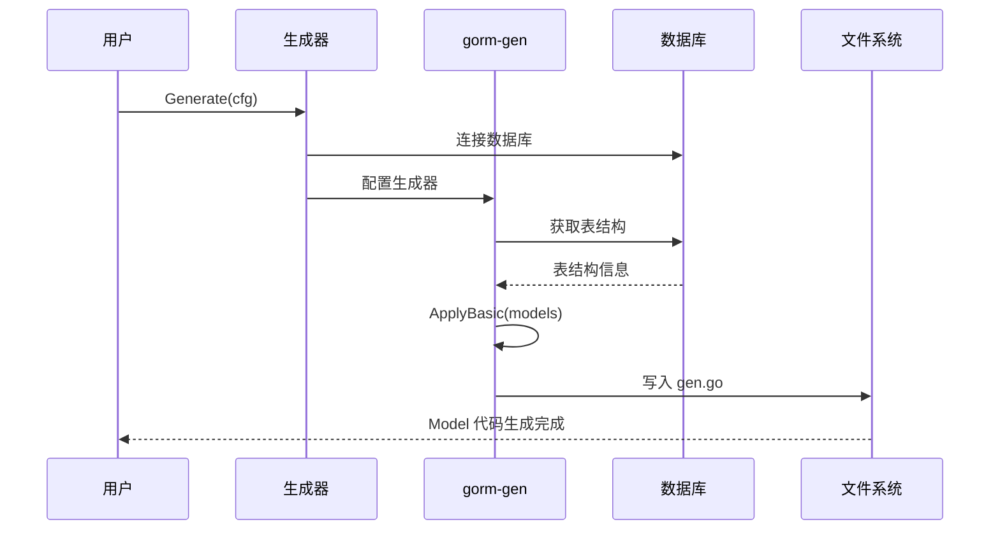
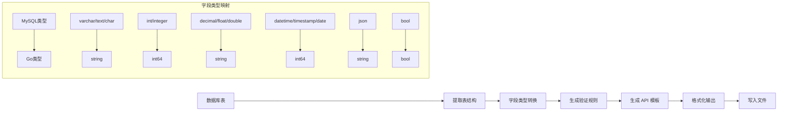
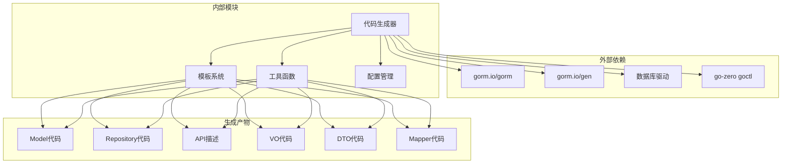

# 代码生成功能

<cite>
**本文档引用的文件**
- [generator.go](file://generator/generator.go)
- [config.go](file://generator/config.go)
- [generator.example.yaml](file://generator/generator.example.yaml)
- [example_test.go](file://generator/example_test.go)
- [api_template.txt](file://generator/template/api_template.txt)
- [dto_template.txt](file://generator/template/dto_template.txt)
- [mapper_template.txt](file://generator/template/mapper_template.txt)
- [repository_template.txt](file://generator/template/repository_template.txt)
- [vo_template.txt](file://generator/template/vo_template.txt)
- [repository_gen_template.txt](file://generator/template/repository_gen_template.txt)
- [README.md](file://README.md)
- [gormplus.go](file://gormplus.go)
</cite>

## 目录
1. [简介](#简介)
2. [项目结构](#项目结构)
3. [核心组件](#核心组件)
4. [架构概览](#架构概览)
5. [详细组件分析](#详细组件分析)
6. [依赖关系分析](#依赖关系分析)
7. [性能考虑](#性能考虑)
8. [故障排除指南](#故障排除指南)
9. [结论](#结论)

## 简介

代码生成器是基于 gorm 和 gorm-gen 的增强扩展包，提供了完整的 CRUD 代码生成解决方案。该工具能够自动生成 Model、Repository、API、VO/DTO、Mapper 等多种类型的代码，支持多种数据库类型和项目结构，大大提高了开发效率。

主要特性包括：
- 多种代码生成类型支持（Model、Repository、API、VO/DTO、Mapper）
- 智能字段类型映射和验证规则生成
- 支持 go-zero 项目集成
- 模板化设计，易于定制和扩展
- 自动跳过已存在文件，保护用户自定义代码

## 项目结构

代码生成器位于 `generator` 目录下，采用模块化的文件组织方式：



**图表来源**
- [generator.go:1-1260](file://generator/generator.go#L1-L1260)
- [config.go:1-47](file://generator/config.go#L1-L47)

**章节来源**
- [generator.go:1-1260](file://generator/generator.go#L1-L1260)
- [config.go:1-47](file://generator/config.go#L1-L47)

## 核心组件

### 配置管理系统

配置系统采用 YAML 格式，支持灵活的项目配置：



**图表来源**
- [config.go:10-31](file://generator/config.go#L10-L31)

### 生成器核心引擎

生成器采用分阶段的生成策略，确保代码质量和可维护性：



**图表来源**
- [generator.go:1038-1259](file://generator/generator.go#L1038-L1259)

**章节来源**
- [config.go:33-47](file://generator/config.go#L33-L47)
- [generator.go:1038-1259](file://generator/generator.go#L1038-L1259)

## 架构概览

代码生成器采用分层架构设计，各层职责清晰：



**图表来源**
- [generator.go:1-1260](file://generator/generator.go#L1-L1260)

## 详细组件分析

### Model 生成器

Model 生成器基于 gorm-gen，提供类型安全的数据访问层：



**图表来源**
- [generator.go:1167-1238](file://generator/generator.go#L1167-L1238)

Model 生成特点：
- 支持多种数据类型映射（int → int64, decimal → decimal.Decimal）
- 自动生成 JSON 标签和 GORM 标签
- 支持软删除字段（deleted_at → gorm.DeletedAt）
- 自动添加创建/更新时间字段标签

**章节来源**
- [generator.go:1108-1146](file://generator/generator.go#L1108-L1146)

### Repository 生成器

Repository 生成器提供仓储模式的实现：

```mermaid
classDiagram
class default~T~Repository {
+Create(ctx, model) error
+CreateBatch(ctx, models) error
+DeleteById(ctx, id) error
+UpdateById(ctx, id, columns) error
+FindList(ctx, options) []Model
+FindPage(ctx, page, size, options) (list, total)
+FindById(ctx, id) Model
+Exists(ctx, cond) bool
+Count(ctx, cond) int64
}
class iDefault~T~Repository {
<<interface>>
+Create(ctx, model) error
+CreateBatch(ctx, models) error
+DeleteById(ctx, id) error
+UpdateById(ctx, id, columns) error
+FindList(ctx, options) []Model
+FindPage(ctx, page, size, options) (list, total)
+FindById(ctx, id) Model
+Exists(ctx, cond) bool
+Count(ctx, cond) int64
}
class customer~T~Repository {
+default~T~Repository
}
iDefault~T~Repository <|-- default~T~Repository
customer~T~Repository --> default~T~Repository : "嵌入"
```

**图表来源**
- [repository_gen_template.txt:15-70](file://generator/template/repository_gen_template.txt#L15-L70)

Repository 生成特点：
- 提供完整的 CRUD 操作接口
- 支持条件查询和分页查询
- 集成 gorm-plus 的查询包装器
- 支持事务操作

**章节来源**
- [repository_gen_template.txt:1-346](file://generator/template/repository_gen_template.txt#L1-L346)

### API 生成器

API 生成器支持 go-zero 框架的 API 描述生成：



**图表来源**
- [generator.go:719-773](file://generator/generator.go#L719-L773)

API 生成特点：
- 自动生成 go-zero API 描述文件
- 智能验证规则生成（required、uuid、email、mobile、oneof 等）
- 支持枚举值验证（从注释中提取）
- 自动生成 CRUD 操作接口

**章节来源**
- [api_template.txt:1-93](file://generator/template/api_template.txt#L1-L93)
- [generator.go:287-320](file://generator/generator.go#L287-L320)

### VO/DTO 生成器

VO（Value Object）和 DTO（Data Transfer Object）生成器提供数据传输层：

```mermaid
classDiagram
class Create~T~DTO {
<<DTO>>
+字段 : 类型 `json : "字段"`
+验证规则 validate : "规则"
}
class Modify~T~DTO {
<<DTO>>
+ID : int64 `json : "id" validate : "required,number,gte=1"`
+Create~T~DTO
}
class ~T~Vo {
<<VO>>
+字段 : 类型 `json : "字段"`
}
Create~T~DTO --> ~T~Vo : "映射关系"
Modify~T~DTO --> Create~T~DTO : "继承"
```

**图表来源**
- [dto_template.txt:3-19](file://generator/template/dto_template.txt#L3-L19)
- [vo_template.txt:3-9](file://generator/template/vo_template.txt#L3-L9)

VO/DTO 生成特点：
- DTO 支持请求验证规则
- VO 提供响应数据结构
- 自动处理时间类型转换（int64 ↔ time.Time）
- 支持 decimal 类型的字符串格式化

**章节来源**
- [dto_template.txt:1-20](file://generator/template/dto_template.txt#L1-L20)
- [vo_template.txt:1-10](file://generator/template/vo_template.txt#L1-L10)

### Mapper 生成器

Mapper 生成器提供数据映射层：

```mermaid
classDiagram
class I~T~Mapper {
<<interface>>
+DtoToEntity(dto) *ModelEntity
+EntityToVo(entity) *~T~Vo
}
class ~t~Mapper {
+DtoToEntity(dto) *ModelEntity
+EntityToVo(entity) *~T~Vo
}
class MapperTemplateData {
+string TableName
+string ModelName
+string Package
+string ModelPkgPath
+string DtoPkgPath
+string VoPkgPath
+bool HasTimeField
+bool HasDecimalField
+bool IsGoZero
+[]ColumnInfo Columns
}
I~T~Mapper <|.. ~t~Mapper
MapperTemplateData --> I~T~Mapper : "模板数据"
```

**图表来源**
- [mapper_template.txt:21-27](file://generator/template/mapper_template.txt#L21-L27)

Mapper 生成特点：
- 支持 go-zero 项目集成
- 自动处理时间类型和 decimal 类型映射
- 提供接口和实现类分离
- 支持审计字段（created_by/updated_by）特殊处理

**章节来源**
- [mapper_template.txt:1-82](file://generator/template/mapper_template.txt#L1-L82)
- [generator.go:643-717](file://generator/generator.go#L643-L717)

## 依赖关系分析

代码生成器的依赖关系清晰，遵循单一职责原则：



**图表来源**
- [generator.go:3-20](file://generator/generator.go#L3-L20)

**章节来源**
- [generator.go:3-20](file://generator/generator.go#L3-L20)

## 性能考虑

代码生成器在性能方面采用了多项优化策略：

1. **模板缓存机制**：内嵌模板减少文件 I/O 操作
2. **增量生成**：Repository、API、VO、DTO 文件已存在时跳过
3. **批量处理**：支持一次性生成所有表的 Model
4. **智能路径解析**：确保无论从哪里运行都指向同一项目根目录

## 故障排除指南

### 常见问题及解决方案

**问题1：找不到 go.mod 文件**
- 确认项目根目录包含 go.mod 文件
- 确保从项目根目录运行生成器

**问题2：数据库连接失败**
- 检查数据库配置（host、port、username、password、database）
- 确认数据库服务正在运行

**问题3：模板文件加载失败**
- 检查模板文件是否存在
- 确认模板文件格式正确

**问题4：生成的代码编译错误**
- 检查字段类型映射是否正确
- 确认导入包路径正确

**章节来源**
- [generator.go:42-48](file://generator/generator.go#L42-L48)
- [generator.go:1049-1052](file://generator/generator.go#L1049-L1052)

## 结论

代码生成器提供了完整的 CRUD 代码生成解决方案，具有以下优势：

1. **功能完整性**：支持多种代码类型的生成
2. **智能化程度高**：自动类型映射、验证规则生成
3. **灵活性强**：支持自定义模板和配置
4. **安全性好**：保护用户自定义代码，避免覆盖
5. **易用性强**：提供清晰的配置和使用方式

通过合理使用代码生成器，可以显著提高开发效率，减少重复劳动，确保代码风格的一致性。建议在项目初期就建立完善的代码生成配置，以便在整个项目生命周期中持续受益。