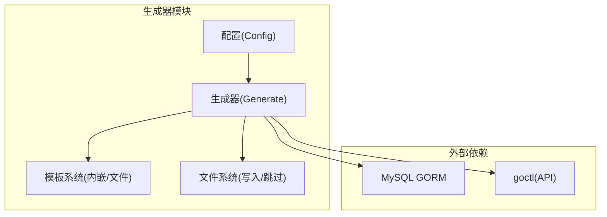
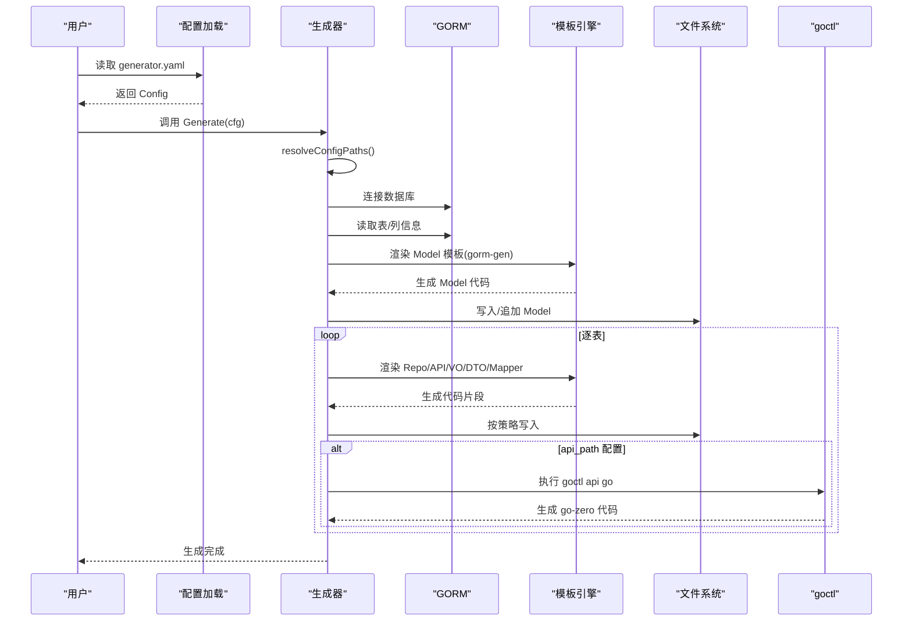
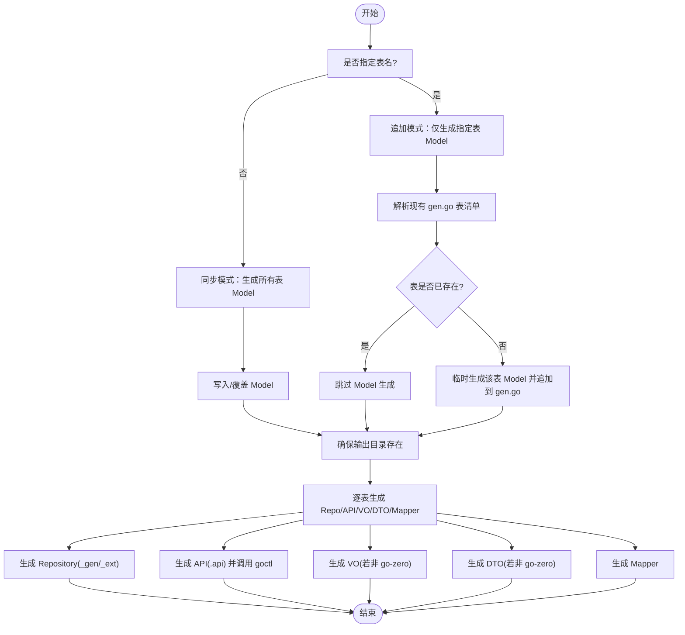
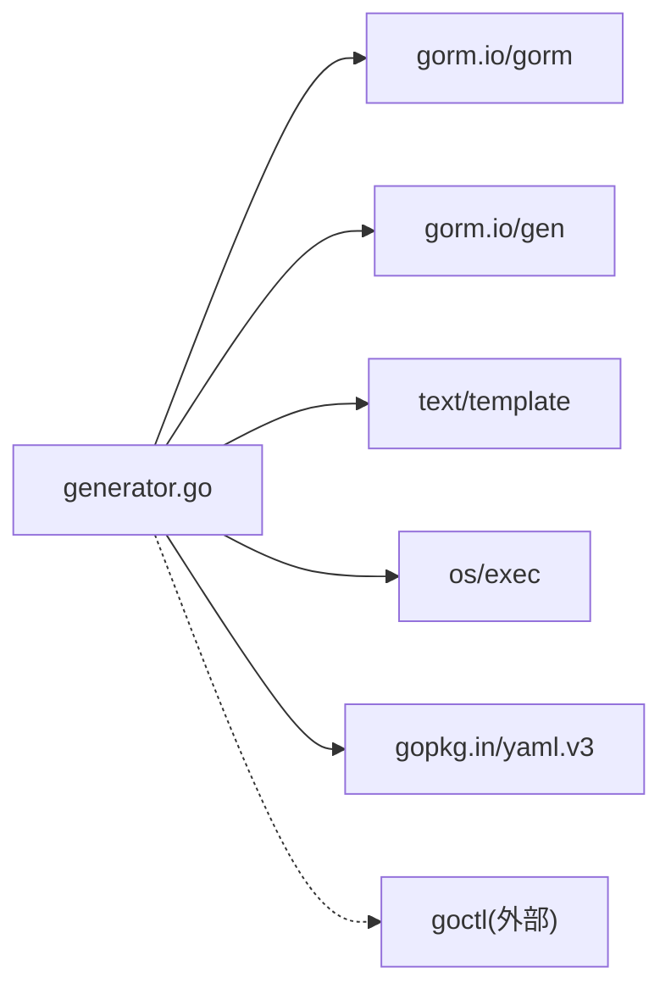

# 代码生成器

<cite>
**本文引用的文件**   
- [generator.go](file://generator/generator.go)
- [config.go](file://generator/config.go)
- [generator.example.yaml](file://generator/generator.example.yaml)
- [gormplus_generator.go](file://gormplus_generator.go)
- [README.md](file://README.md)
- [version.go](file://version.go)
- [api_template.txt](file://generator/template/api_template.txt)
- [repository_gen_template.txt](file://generator/template/repository_gen_template.txt)
- [mapper_template.txt](file://generator/template/mapper_template.txt)
</cite>

## 目录
1. [简介](#简介)
2. [项目结构](#项目结构)
3. [核心组件](#核心组件)
4. [架构总览](#架构总览)
5. [详细组件分析](#详细组件分析)
6. [依赖分析](#依赖分析)
7. [性能考虑](#性能考虑)
8. [故障排查指南](#故障排查指南)
9. [结论](#结论)
10. [附录](#附录)

## 简介
本代码生成器基于 gorm 与 gorm-gen，提供从数据库表结构一键生成 Model、Repository、API、VO、DTO、Mapper 的能力。生成器遵循"Model 每次覆盖、其余文件已存在则跳过"的策略，避免覆盖用户自定义代码；同时支持 go-zero API 代码生成联动。

**重要更新**：README.md 中的代码生成器文档已简化，移除了详细的高级特性和实现说明，仅保留基本使用示例。

## 项目结构
- generator：生成器核心与模板
  - generator.go：生成流程、模板加载、文件写入、路径解析、类型映射、验证规则生成等
  - config.go：配置结构与 YAML 加载
  - template/：模板文件集合
    - api_template.txt
    - repository_gen_template.txt
    - mapper_template.txt
  - generator.example.yaml：示例配置
- gormplus_generator.go：统一入口，导出 LoadGeneratorConfig 与 Generate
- README.md：快速开始与使用说明（已简化）
- version.go：版本常量

**图表来源**
- [generator.go:1038-1259](file://generator/generator.go#L1038-L1259)
- [config.go:10-31](file://generator/config.go#L10-L31)

**章节来源**
- [generator.go:1038-1259](file://generator/generator.go#L1038-L1259)
- [config.go:10-31](file://generator/config.go#L10-L31)
- [README.md:662-694](file://README.md#L662-L694)

## 核心组件
- 配置系统
  - Config：包含数据库连接参数与各产物输出路径、项目包名
  - LoadConfig：从 YAML 文件加载配置
- 生成流程
  - Generate：主流程，负责路径解析、连接数据库、生成 Model、逐表生成 Repo/API/VO/DTO/Mapper
  - resolveConfigPaths：将相对路径解析为绝对路径，确保跨目录运行一致性
- 模板系统
  - 内嵌模板：通过 go:embed 嵌入，保证打包后可直接使用
  - 文件优先：优先从文件系统加载用户自定义模板，不存在则回退到内嵌模板
- 文件写入策略
  - Model：始终覆盖（同步模式）
  - 其余文件：若目标文件已存在则跳过，避免覆盖用户自定义代码

**章节来源**
- [config.go:10-31](file://generator/config.go#L10-L31)
- [generator.go:37-68](file://generator/generator.go#L37-L68)
- [generator.go:322-340](file://generator/generator.go#L322-L340)

## 架构总览
生成器采用"配置驱动 + 模板渲染 + 文件写入"的三层架构：
- 配置层：解析 YAML，定位项目根目录，统一输出路径
- 渲染层：gorm-gen 生成 Model；text/template 渲染各类模板
- 输出层：按策略写入文件，必要时调用 goctl 生成 go-zero API

**图表来源**
- [generator.go:1038-1259](file://generator/generator.go#L1038-L1259)
- [generator.go:322-340](file://generator/generator.go#L322-L340)
- [generator.go:836-959](file://generator/generator.go#L836-L959)

**章节来源**
- [generator.go:1038-1259](file://generator/generator.go#L1038-L1259)

## 详细组件分析

### 配置与路径解析
- 配置项
  - 数据库：db_type、host、port、username、password、database
  - 输出路径：out_path、model_pkg_path、repo_path、api_path、vo_path、dto_path、mapper_path
  - 项目包名：package
- 路径解析
  - resolveConfigPaths：将相对路径解析为相对于项目根目录的绝对路径，确保跨目录运行一致性
- YAML 加载
  - LoadConfig：读取并解析 YAML，返回 Config

**章节来源**
- [config.go:10-31](file://generator/config.go#L10-L31)
- [generator.go:37-68](file://generator/generator.go#L37-L68)
- [generator.go:775-803](file://generator/generator.go#L775-L803)

### 模板系统与渲染
- 模板加载优先级
  - 优先从文件系统加载用户自定义模板
  - 文件不存在时回退到内嵌模板
- 模板数据结构
  - Model/DAO：gorm-gen 生成，不在本节详述
  - API：ApiTemplateData（表名、模型名、注释、列信息）
  - Repository：RepositoryTemplateData（模型名、包、路径、主键等）
  - Mapper：MapperTemplateData（包、模型/DTO/VO 包路径与名称、字段、go-zero 标识、导入控制等）

**章节来源**
- [generator.go:322-340](file://generator/generator.go#L322-L340)
- [generator.go:229-279](file://generator/generator.go#L229-L279)
- [api_template.txt:1-93](file://generator/template/api_template.txt#L1-L93)
- [repository_gen_template.txt:1-346](file://generator/template/repository_gen_template.txt#L1-L346)
- [mapper_template.txt:1-82](file://generator/template/mapper_template.txt#L1-L82)

### 生成流程与策略
- Model 生成
  - 单表输入：追加模式，仅追加该表的 Model，保留已存在表定义
  - 全量输入：同步模式，生成所有表的 Model
- 其余文件生成
  - 逐表生成 Repo（_gen.go/_ext.go）、API、VO、DTO、Mapper
  - 若目标文件已存在则跳过，避免覆盖用户自定义代码
- go-zero 集成
  - 配置 api_path 时，生成 .api 后调用 goctl 生成 go-zero 代码

**图表来源**
- [generator.go:1167-1259](file://generator/generator.go#L1167-L1259)
- [generator.go:836-959](file://generator/generator.go#L836-L959)

**章节来源**
- [generator.go:1167-1259](file://generator/generator.go#L1167-L1259)
- [generator.go:836-959](file://generator/generator.go#L836-L959)

### API/Repository/Mapper 模板详解
- API 模板（api_template.txt）
  - 生成 .api 文件，包含请求/响应结构体、分页结构体、服务路由与处理器
  - 支持字段 JSON 标签、可选字段、校验规则
- Repository 模板
  - repository_gen_template.txt：生成 defaultXxxRepository 的完整 CRUD/分页/条件查询实现
- Mapper 模板（mapper_template.txt）
  - 生成 IXXMapper 接口与实现，支持时间/decimal/审计字段映射
  - 支持 go-zero 模式下的结构体命名差异与 import 控制

**章节来源**
- [api_template.txt:1-93](file://generator/template/api_template.txt#L1-L93)
- [repository_gen_template.txt:1-346](file://generator/template/repository_gen_template.txt#L1-L346)
- [mapper_template.txt:1-82](file://generator/template/mapper_template.txt#L1-L82)

### 使用示例与最佳实践
- 快速开始
  - 通过 gormplus.LoadGeneratorConfig 与 gormplus.Generate 使用
  - README 提供 YAML 配置与调用示例
- 最佳实践
  - 优先在 generator/template 下维护自定义模板，文件系统优先
  - 仅在需要时覆盖 Model，其余文件保持跳过策略以保留自定义扩展
  - go-zero 项目：配置 api_path 后，VO/DTO 由 go-zero 生成，Mapper 生成后自行调整 import
- 版本与入口
  - gormplus 统一导出 LoadGeneratorConfig 与 Generate
  - version.go 提供版本常量

**章节来源**
- [README.md:662-694](file://README.md#L662-L694)
- [gormplus_generator.go:8-34](file://gormplus_generator.go#L8-L34)
- [version.go:1-4](file://version.go#L1-L4)

## 依赖分析
- 内部依赖
  - generator 依赖 gorm、gorm-gen 进行 Model 生成与类型映射
  - 通过 text/template 渲染模板
- 外部依赖
  - goctl：当配置 api_path 时，生成 .api 后调用 goctl 生成 go-zero 代码
- 耦合度与内聚性
  - 生成器内部职责清晰：配置解析、模板加载、文件写入、类型映射
  - 与外部工具（goctl）通过命令行集成，低耦合

**图表来源**
- [generator.go:3-20](file://generator/generator.go#L3-L20)
- [config.go:3-8](file://generator/config.go#L3-L8)

**章节来源**
- [generator.go:3-20](file://generator/generator.go#L3-L20)
- [config.go:3-8](file://generator/config.go#L3-L8)

## 性能考虑
- 模板渲染
  - 采用内嵌模板与文件系统优先策略，减少 IO 开销
- 文件写入
  - 已存在文件跳过写入，避免重复 IO
- 数据库访问
  - 仅在生成阶段读取表结构，生成完成后断开连接
- 并发与资源
  - 生成流程为顺序执行，避免并发写冲突

## 故障排查指南
- 未找到 go.mod
  - 现象：解析项目根目录失败
  - 处理：确保在包含 go.mod 的项目根目录运行，或在正确目录执行
- 模板加载失败
  - 现象：找不到模板文件或内嵌模板缺失
  - 处理：确认模板文件存在于 generator/template 或使用内嵌模板
- 数据库连接失败
  - 现象：连接数据库报错
  - 处理：检查 host/port/username/password/database 配置
- goctl 未安装或不可执行
  - 现象：生成 .api 后调用 goctl 失败
  - 处理：安装 goctl 或设置 PATH，或禁用 api_path
- 文件写入失败
  - 现象：写入目标文件失败
  - 处理：检查输出目录权限与磁盘空间

**章节来源**
- [generator.go:22-35](file://generator/generator.go#L22-L35)
- [generator.go:1049-1052](file://generator/generator.go#L1049-L1052)
- [generator.go:886-894](file://generator/generator.go#L886-L894)

## 结论
本代码生成器通过清晰的配置与模板体系，实现了从数据库表到业务代码的高效自动化生成。其"Model 覆盖、其余跳过"的策略有效保护了用户的自定义扩展；与 go-zero 的集成进一步提升了 API 侧的开发效率。建议在团队内统一模板与配置，结合版本管理策略，持续迭代生成器以适配业务演进。

**重要说明**：README.md 中的代码生成器文档已简化，移除了详细的高级特性和实现说明，仅保留基本使用示例。详细的技术实现细节请参考本文档的其他章节。

## 附录

### 配置参数说明
- db_type：数据库类型（如 mysql）
- host/port/username/password/database：数据库连接信息
- out_path：DAO 输出路径
- model_pkg_path：Model 包路径
- repo_path：Repository 输出路径
- api_path：API 描述文件输出路径（配置后生成 .api 并调用 goctl）
- vo_path/dto_path：VO/DTO 输出路径（未配置 api_path 时生成）
- mapper_path：Mapper 输出路径
- package：项目包名（用于 import 与生成代码的包声明）

**章节来源**
- [config.go:10-31](file://generator/config.go#L10-L31)
- [generator.example.yaml:1-17](file://generator/generator.example.yaml#L1-L17)

### 生成流程与文件策略
- Model：同步/追加模式，覆盖写入
- Repository：_gen.go/_ext.go，已存在跳过
- API：.api 文件，已存在跳过；若配置 api_path，生成后调用 goctl
- VO/DTO：已存在跳过（非 go-zero 模式）
- Mapper：已存在跳过，生成后需手动调整 import

**章节来源**
- [generator.go:814-834](file://generator/generator.go#L814-L834)
- [generator.go:836-959](file://generator/generator.go#L836-L959)

### 入口函数说明
- LoadGeneratorConfig：从 YAML 文件加载代码生成器配置
- Generate：执行代码生成，根据数据库表结构生成 Model / Repository / API 文件

**章节来源**
- [gormplus_generator.go:8-34](file://gormplus_generator.go#L8-L34)