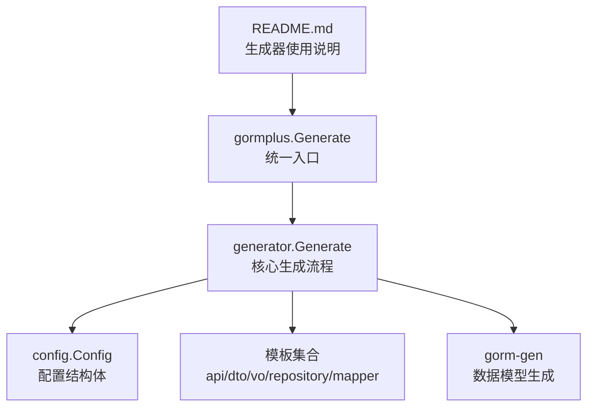
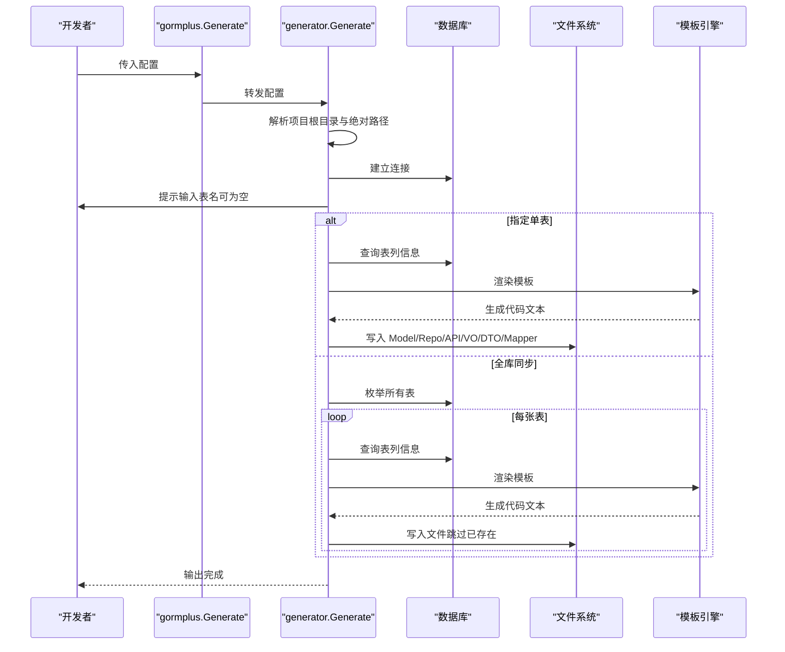
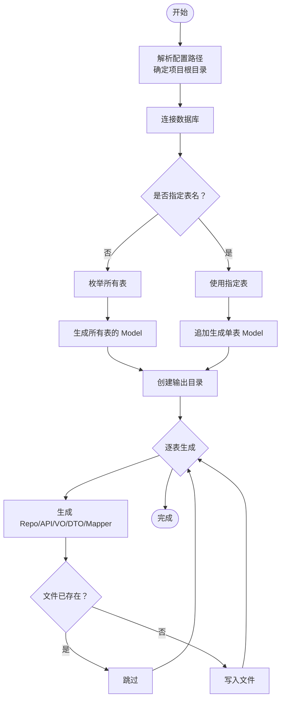
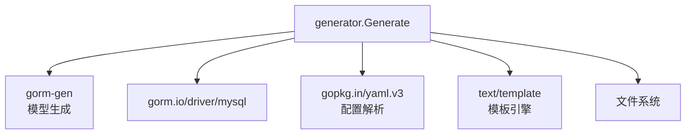

# 使用示例

<cite>
**本文引用的文件**
- [README.md](file://README.md)
- [gormplus.go](file://gormplus.go)
- [generator.go](file://generator/generator.go)
- [config.go](file://generator/config.go)
- [generator.example.yaml](file://generator/generator.example.yaml)
- [example_test.go](file://generator/example_test.go)
- [api_template.txt](file://generator/template/api_template.txt)
- [dto_template.txt](file://generator/template/dto_template.txt)
- [vo_template.txt](file://generator/template/vo_template.txt)
- [repository_template.txt](file://generator/template/repository_template.txt)
- [mapper_template.txt](file://generator/template/mapper_template.txt)
</cite>

## 目录
1. [简介](#简介)
2. [项目结构](#项目结构)
3. [核心组件](#核心组件)
4. [架构总览](#架构总览)
5. [详细组件分析](#详细组件分析)
6. [依赖分析](#依赖分析)
7. [性能考虑](#性能考虑)
8. [故障排除指南](#故障排除指南)
9. [结论](#结论)
10. [附录](#附录)

## 简介
本文件面向使用 gorm-plus 代码生成器的开发者，提供从安装到使用的完整流程示例，涵盖环境准备、配置文件设置、命令行使用、不同项目结构下的配置方案、常见使用模式与最佳实践、避免覆盖已有代码的策略、版本管理建议、调试技巧与故障排除等内容。目标是帮助你在最短时间内搭建起稳定高效的代码生成流水线。

## 项目结构
- 代码生成器位于 generator 目录，包含配置定义、模板与生成逻辑。
- 顶层入口通过 gormplus.Generate 暴露统一调用接口。
- README 提供了生成器的 YAML 配置示例与基本使用说明。

图表来源
- [README.md:662-693](file://README.md#L662-L693)
- [gormplus.go:895-897](file://gormplus.go#L895-L897)
- [generator.go:1038-1260](file://generator/generator.go#L1038-L1260)
- [config.go:10-31](file://generator/config.go#L10-L31)

章节来源
- [README.md:17-40](file://README.md#L17-L40)
- [README.md:662-693](file://README.md#L662-L693)
- [gormplus.go:895-897](file://gormplus.go#L895-L897)
- [generator.go:1038-1260](file://generator/generator.go#L1038-L1260)
- [config.go:10-31](file://generator/config.go#L10-L31)

## 核心组件
- 配置结构体：定义数据库连接、输出路径、包名等。
- 生成器入口：统一对外暴露 Generate(cfg)。
- 生成流程：解析路径、连接数据库、选择表、生成 Model、创建输出目录、逐表生成 Repo/API/VO/DTO/Mapper，并跳过已存在文件。
- 模板系统：支持用户自定义覆盖与内嵌模板回退。

章节来源
- [config.go:10-31](file://generator/config.go#L10-L31)
- [gormplus.go:895-897](file://gormplus.go#L895-L897)
- [generator.go:1038-1260](file://generator/generator.go#L1038-L1260)

## 架构总览
以下序列图展示了从配置加载到生成完成的整体流程，以及与模板系统的交互。

图表来源
- [gormplus.go:895-897](file://gormplus.go#L895-L897)
- [generator.go:1038-1260](file://generator/generator.go#L1038-L1260)

## 详细组件分析

### 配置与路径解析
- 支持从 YAML 文件加载配置，也支持直接构造 Config 结构体。
- 路径解析会基于当前工作目录向上查找 go.mod 确定项目根目录，并将相对路径转换为绝对路径，确保无论从哪里运行都指向同一位置。
- 生成器会根据配置中的路径创建输出目录，若为空则跳过对应生成步骤。

章节来源
- [config.go:33-46](file://generator/config.go#L33-L46)
- [generator.go:37-68](file://generator/generator.go#L37-L68)
- [generator.go:1240-1246](file://generator/generator.go#L1240-L1246)

### 生成流程与模式
- 单表追加模式：仅对 gen.go 追加新增表的 Model 定义，保留其他表定义。
- 全库同步模式：生成所有表的 Model 并覆盖执行。
- 逐表生成：对 Repo、API、VO、DTO、Mapper 逐表生成，已存在文件自动跳过，避免覆盖已有自定义代码。

图表来源
- [generator.go:1038-1260](file://generator/generator.go#L1038-L1260)

章节来源
- [generator.go:1038-1260](file://generator/generator.go#L1038-L1260)

### 模板系统与数据模型
- 模板优先从文件系统加载，若不存在则回退到内嵌模板。
- 模板数据结构包含表名、注释、列信息等，列信息包含字段名、Go 类型、JSON Tag、校验规则、审计字段标记、时间/数值类型标记等。
- 不同模板的数据构建函数略有差异，但均遵循统一的数据结构。

章节来源
- [generator.go:322-340](file://generator/generator.go#L322-L340)
- [generator.go:229-279](file://generator/generator.go#L229-L279)
- [api_template.txt:1-93](file://generator/template/api_template.txt#L1-L93)
- [dto_template.txt:1-20](file://generator/template/dto_template.txt#L1-L20)
- [vo_template.txt:1-10](file://generator/template/vo_template.txt#L1-L10)
- [repository_template.txt:1-28](file://generator/template/repository_template.txt#L1-L28)
- [mapper_template.txt:1-82](file://generator/template/mapper_template.txt#L1-L82)

### 常见使用场景与示例

#### 场景一：快速开始（YAML 配置 + 命令行交互）
- 准备数据库连接信息与输出路径。
- 运行生成器，按提示输入表名（留空则生成所有表）。
- 生成完成后，检查输出目录中的文件。

章节来源
- [README.md:662-693](file://README.md#L662-L693)
- [generator.example.yaml:1-17](file://generator/generator.example.yaml#L1-L17)
- [example_test.go:7-35](file://generator/example_test.go#L7-L35)

#### 场景二：直接传入配置（无交互）
- 在代码中构造 Config，然后调用 Generate(cfg)。
- 适用于 CI/CD 流水线或自动化脚本。

章节来源
- [example_test.go:7-35](file://generator/example_test.go#L7-L35)

#### 场景三：自定义模板
- 在项目中提供同名模板文件即可覆盖内嵌模板。
- 模板引擎使用标准 text/template，支持自定义函数（如小驼峰转换）。

章节来源
- [generator.go:322-340](file://generator/generator.go#L322-L340)

#### 场景四：不同项目结构下的配置方案
- 通用方案：将 out_path、model_pkg_path、repo_path、api_path、vo_path、dto_path、mapper_path 设置为相对路径，生成器会解析为项目根目录下的绝对路径。
- go-zero 项目：配置 api_path 后不生成 VO/DTO，mapper 生成后再手动调整 import 路径。

章节来源
- [generator.example.yaml:11-12](file://generator/generator.example.yaml#L11-L12)
- [generator.go:1056-1091](file://generator/generator.go#L1056-L1091)

### 最佳实践与注意事项
- 避免覆盖已有代码：生成器对 Repo/API/VO/DTO/Mapper 已存在文件会自动跳过，仅覆盖 Model。请将自定义逻辑放在这些文件中，或在生成后进行二次编辑。
- 版本管理策略：Model 文件每次都会重新生成，建议将其纳入版本管理；对于已存在文件，建议在生成前备份或通过分支管理。
- 路径一致性：使用相对路径并确保项目根目录包含 go.mod，避免因工作目录不同导致路径解析错误。
- 模板定制：优先在项目中提供自定义模板，以便团队统一风格。

章节来源
- [README.md:692-692](file://README.md#L692-L692)
- [generator.go:1038-1260](file://generator/generator.go#L1038-L1260)

## 依赖分析
- 生成器依赖 gorm 与 gorm-gen 进行数据模型生成与查询接口扩展。
- 生成器内部使用 go:embed 将模板嵌入二进制，减少外部依赖。
- 生成器通过 YAML 配置文件加载，支持灵活的路径与包名配置。

图表来源
- [generator.go:16-20](file://generator/generator.go#L16-L20)
- [config.go:3-8](file://generator/config.go#L3-L8)

章节来源
- [generator.go:16-20](file://generator/generator.go#L16-L20)
- [config.go:3-8](file://generator/config.go#L3-L8)

## 性能考虑
- 生成器在全库同步模式下会对每张表执行一次 SHOW FULL COLUMNS 查询，建议在生产数据库上谨慎使用。
- 模板渲染与文件写入为本地 IO 操作，通常耗时较短。
- 若生成大量表，可考虑分批执行或在 CI 环境中并行化处理。

## 故障排除指南
- 无法找到 go.mod：请确认当前工作目录或其父目录包含 go.mod，否则路径解析会失败。
- 数据库连接失败：检查 host、port、username、password、database 配置是否正确。
- 模板加载失败：确认模板文件是否存在或路径是否正确；若使用自定义模板，请确保文件名与内嵌模板一致。
- 生成后文件未更新：确认输出目录权限、磁盘空间、文件是否被外部工具锁定。
- 覆盖风险：若需要覆盖 Model，请先备份或通过版本管理回滚；Repo/API/VO/DTO/Mapper 已存在文件会被跳过。

章节来源
- [generator.go:37-68](file://generator/generator.go#L37-L68)
- [generator.go:1049-1052](file://generator/generator.go#L1049-L1052)
- [generator.go:322-340](file://generator/generator.go#L322-L340)

## 结论
gorm-plus 代码生成器提供了从配置到生成的完整链路，支持多种项目结构与模板定制。通过合理的路径解析、文件覆盖策略与版本管理，可以在保证效率的同时维持代码质量与可维护性。建议在团队内统一模板风格与生成流程，并在 CI/CD 中集成生成步骤以提升交付效率。

## 附录

### 快速开始清单
- 准备数据库连接信息与输出路径。
- 创建 generator.yaml 或在代码中构造 Config。
- 运行生成器，按提示输入表名或直接生成所有表。
- 检查输出目录，必要时进行二次编辑。

章节来源
- [README.md:662-693](file://README.md#L662-L693)
- [generator.example.yaml:1-17](file://generator/generator.example.yaml#L1-L17)
- [example_test.go:7-35](file://generator/example_test.go#L7-L35)