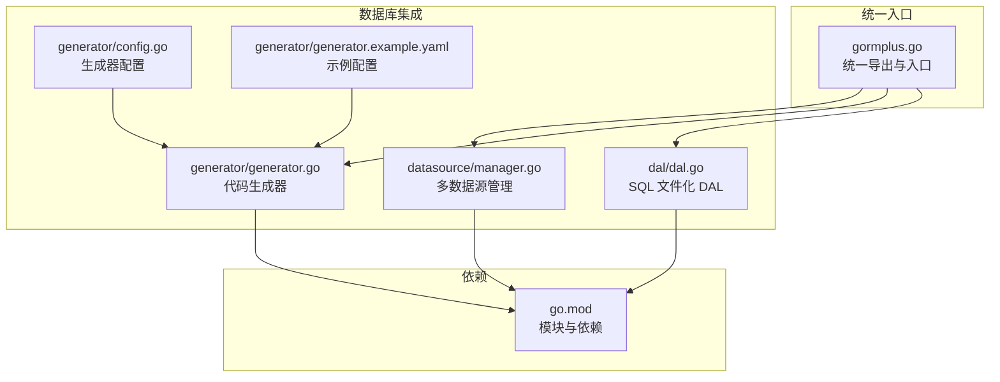
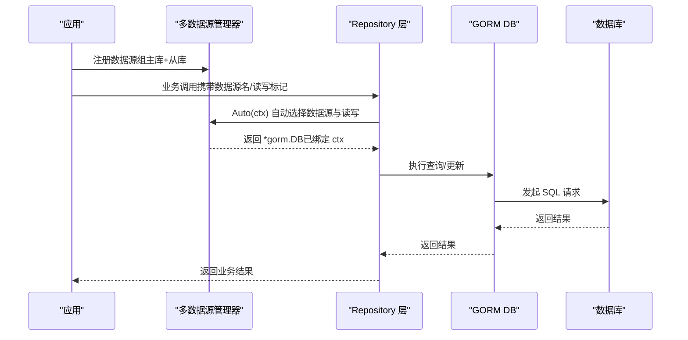
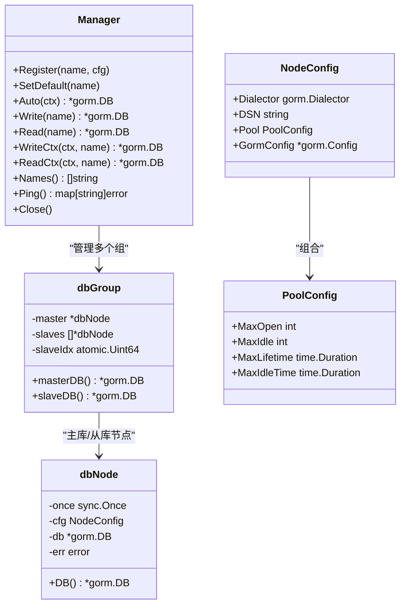
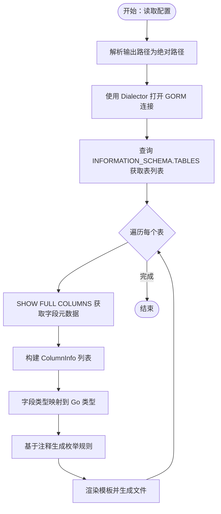
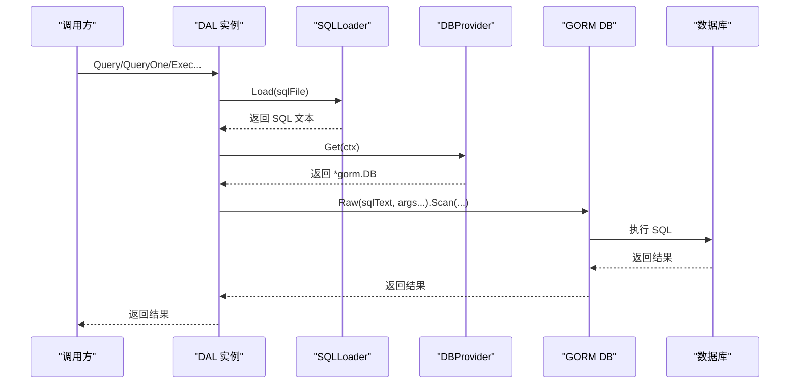
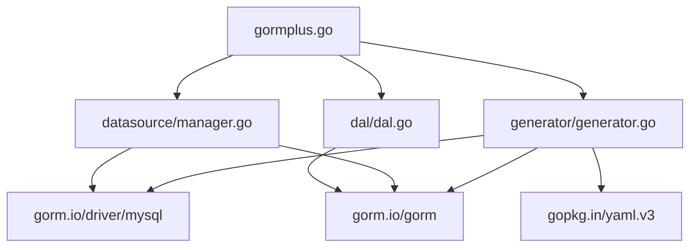

# 数据库集成

<cite>
**本文引用的文件**
- [gormplus.go](file://gormplus.go)
- [go.mod](file://go.mod)
- [datasource/manager.go](file://datasource/manager.go)
- [generator/config.go](file://generator/config.go)
- [generator/generator.go](file://generator/generator.go)
- [generator/generator.example.yaml](file://generator/generator.example.yaml)
- [dal/dal.go](file://dal/dal.go)
- [dal/dal_test.go](file://dal/dal_test.go)
</cite>

## 目录
1. [简介](#简介)
2. [项目结构](#项目结构)
3. [核心组件](#核心组件)
4. [架构总览](#架构总览)
5. [详细组件分析](#详细组件分析)
6. [依赖分析](#依赖分析)
7. [性能考量](#性能考量)
8. [故障排除指南](#故障排除指南)
9. [结论](#结论)
10. [附录](#附录)

## 简介
本文件面向“代码生成器”的数据库集成功能，系统性阐述以下主题：
- 数据库连接的建立与管理：包括 MySQL 驱动使用、连接池配置、多数据源与读写分离。
- 表结构自动发现与元数据获取：字段、注释、主键、可空性等。
- 字段类型到 Go 类型映射规则与特殊类型处理：时间、数值、枚举等。
- 数据库配置最佳实践与性能优化建议。
- 连接故障排除与常见问题解决方案。

## 项目结构
该项目围绕“统一入口”模块 gormplus 提供多数据源、代码生成器、DAL、插件等能力。数据库集成主要体现在：
- 多数据源管理（datasource）：支持一主多从、懒连接、自动读写分离、健康检查、优雅关闭。
- 代码生成器（generator）：基于 gorm.io/driver/mysql 与 gorm.io/gorm，自动发现表结构并生成模型、仓库、API、DTO、VO、Mapper 等。
- DAL（dal）：SQL 文件化访问层，支持命名参数、分页、Hook、缓存清理等，与多数据源结合使用。

图表来源
- [gormplus.go:1-120](file://gormplus.go#L1-L120)
- [datasource/manager.go:1-120](file://datasource/manager.go#L1-L120)
- [generator/generator.go:1-40](file://generator/generator.go#L1-L40)
- [generator/config.go:1-47](file://generator/config.go#L1-L47)
- [generator/generator.example.yaml:1-17](file://generator/generator.example.yaml#L1-L17)
- [dal/dal.go:1-80](file://dal/dal.go#L1-L80)
- [go.mod:1-26](file://go.mod#L1-L26)

章节来源
- [gormplus.go:1-120](file://gormplus.go#L1-L120)
- [go.mod:1-26](file://go.mod#L1-L26)

## 核心组件
- 多数据源管理器（datasource.Manager）
  - 支持注册命名数据源组（一主多从），懒连接（首次使用时建立），独立连接池配置，自动读写分离，健康检查，优雅关闭。
  - 通过上下文自动选择数据源与读写意图，简化 Repository 层调用。
- 代码生成器（generator）
  - 基于 gorm.io/driver/mysql 与 gorm.io/gorm，自动执行 SHOW FULL COLUMNS、INFORMATION_SCHEMA.TABLES 等 SQL 获取表结构与注释。
  - 提供多种类型映射规则（通用、API/DTO、VO），并支持基于注释的枚举规则生成。
- DAL（dal）
  - SQL 文件化管理，支持命名参数、分页、Hook、缓存清理，与多数据源结合使用。

章节来源
- [datasource/manager.go:15-120](file://datasource/manager.go#L15-L120)
- [generator/generator.go:185-285](file://generator/generator.go#L185-L285)
- [dal/dal.go:1-120](file://dal/dal.go#L1-L120)

## 架构总览
下图展示数据库连接与代码生成器的关键交互路径，以及多数据源在运行时如何根据上下文自动选择主/从库。

图表来源
- [datasource/manager.go:288-332](file://datasource/manager.go#L288-L332)
- [gormplus.go:155-214](file://gormplus.go#L155-L214)

## 详细组件分析

### 多数据源管理器（datasource.Manager）
- 功能要点
  - 注册命名数据源组（GroupConfig），包含 Master 与 Slaves。
  - 懒连接：首次使用时才打开连接，避免启动阻塞。
  - 连接池独立配置（PoolConfig），提供生产推荐默认值（MaxOpen、MaxIdle、MaxLifetime、MaxIdleTime）。
  - 自动切换：通过上下文写入数据源名与读写标记，Auto(ctx) 自动决策。
  - 健康检查与优雅关闭：Ping 返回每个节点状态，Close 关闭所有连接。
- 关键 API
  - Register、SetDefault、Auto、Write、Read、WriteCtx、ReadCtx、Names、Ping、Close。
  - 上下文工具：WithName、NameFromCtx、WithRead、WithWrite、IsRead、IsWrite。
- 连接池配置与默认值
  - 默认池参数：MaxOpen=50、MaxIdle=10、MaxLifetime=30m、MaxIdleTime=10m。
  - 通过 NodeConfig.Pool 覆盖默认值；零值字段使用默认值。
- 驱动与 DSN
  - 优先使用 NodeConfig.Dialector（支持任意 gorm 驱动，如 MySQL、PostgreSQL、SQLite、SQL Server）。
  - DSN 已弃用，若仅配置 DSN 会提示改为 Dialector。

图表来源
- [datasource/manager.go:246-277](file://datasource/manager.go#L246-L277)
- [datasource/manager.go:227-242](file://datasource/manager.go#L227-L242)
- [datasource/manager.go:173-203](file://datasource/manager.go#L173-L203)
- [datasource/manager.go:151-169](file://datasource/manager.go#L151-L169)

章节来源
- [datasource/manager.go:15-120](file://datasource/manager.go#L15-L120)
- [datasource/manager.go:288-332](file://datasource/manager.go#L288-L332)
- [datasource/manager.go:492-513](file://datasource/manager.go#L492-L513)
- [datasource/manager.go:539-578](file://datasource/manager.go#L539-L578)

### 代码生成器（generator）
- 表结构自动发现与元数据获取
  - 使用 SHOW FULL COLUMNS 获取字段名、类型、可空、键、默认值、额外信息、注释。
  - 使用 INFORMATION_SCHEMA.TABLES 获取表注释。
  - 将结果映射为 ColumnInfo，包含字段名、原始类型、是否主键、是否可空、注释、是否时间类型、是否审计字段、是否十进制等。
- 字段类型到 Go 类型映射规则
  - 通用映射：字符串、整型、浮点、布尔、时间戳（int64）、日期（int64）、JSON（string）。
  - API/DTO 映射：十进制/浮点/双精度 → string（避免前端精度丢失）；时间类型 → int64（时间戳）。
  - VO 映射：十进制/浮点/双精度 → string；时间类型 → int64。
- 枚举规则生成
  - 基于注释中“数字是描述”的模式（如“1是启用，2是禁用”）提取枚举值集合，生成 oneof 校验规则。
- 配置与路径解析
  - 支持 YAML 配置文件（db_type、host、port、username、password、database、输出路径等）。
  - 配置中的相对路径解析为相对于项目根目录的绝对路径，保证跨目录运行一致性。
- 模板与生成产物
  - 内嵌模板（api、dto、repository、vo、mapper），支持文件系统覆盖。
  - 生成模型、DAO、Repository、API、DTO、VO、Mapper 等文件。

图表来源
- [generator/generator.go:22-68](file://generator/generator.go#L22-L68)
- [generator/generator.go:185-210](file://generator/generator.go#L185-L210)
- [generator/generator.go:281-285](file://generator/generator.go#L281-L285)
- [generator/generator.go:719-773](file://generator/generator.go#L719-L773)
- [generator/generator.go:287-320](file://generator/generator.go#L287-L320)
- [generator/config.go:10-47](file://generator/config.go#L10-L47)

章节来源
- [generator/generator.go:185-285](file://generator/generator.go#L185-L285)
- [generator/generator.go:719-773](file://generator/generator.go#L719-L773)
- [generator/generator.go:287-320](file://generator/generator.go#L287-L320)
- [generator/config.go:10-47](file://generator/config.go#L10-L47)
- [generator/generator.example.yaml:1-17](file://generator/generator.example.yaml#L1-L17)

### DAL（SQL 文件化访问层）
- 功能要点
  - SQL 文件通过 embed 打包，支持位置参数与命名参数。
  - 支持分页查询、计数 SQL 自动推导、事务、Hook、缓存清理。
  - 与多数据源结合：通过 WithDB 将指定 DAL 实例注入上下文，后续调用自动使用该实例。
- 关键 API
  - NewDal、NewWithProvider、WithDB、Preload、Query、QueryOne、QueryNamed、QueryOneNamed、Exec、ExecAffected、Count、QueryPage、QueryPageNamed、WithTx、TxQuery、TxQueryOne、TxQueryNamed。
- 与多数据源协作
  - DBProvider 接口抽象，singleDBProvider 实现单库；可自定义 Provider 实现读写分离、多租户等。
  - WithDB 将 DAL 实例注入上下文，resolve(ctx) 自动选择实例或默认全局实例。

图表来源
- [dal/dal.go:594-628](file://dal/dal.go#L594-L628)
- [dal/dal.go:521-523](file://dal/dal.go#L521-L523)
- [dal/dal.go:450-461](file://dal/dal.go#L450-L461)

章节来源
- [dal/dal.go:1-120](file://dal/dal.go#L1-L120)
- [dal/dal.go:594-628](file://dal/dal.go#L594-L628)
- [dal/dal.go:450-461](file://dal/dal.go#L450-L461)

## 依赖分析
- 模块依赖
  - gorm.io/gorm、gorm.io/driver/mysql、gorm.io/gen、gopkg.in/yaml.v3。
  - gorm-plus 通过统一入口导出多模块能力，不直接依赖具体数据库驱动，驱动通过外部传入（dialector）。
- 生成器与驱动
  - 代码生成器使用 gorm.io/driver/mysql 与 gorm.io/gorm 进行连接与元数据查询。
- 多数据源与驱动
  - 多数据源管理器支持任意 gorm 驱动（MySQL、PostgreSQL、SQLite、SQL Server 等），通过 NodeConfig.Dialector 明确指定。

图表来源
- [gormplus.go:88-101](file://gormplus.go#L88-L101)
- [go.mod:5-10](file://go.mod#L5-L10)
- [generator/generator.go:16-20](file://generator/generator.go#L16-L20)

章节来源
- [go.mod:1-26](file://go.mod#L1-L26)
- [gormplus.go:88-101](file://gormplus.go#L88-L101)
- [generator/generator.go:16-20](file://generator/generator.go#L16-L20)

## 性能考量
- 连接池配置
  - 生产推荐默认值：MaxOpen=50、MaxIdle=10、MaxLifetime=30m、MaxIdleTime=10m。
  - 根据 CPU 核数调整 MaxOpen（CPU×4~8），MaxIdle≈MaxOpen/2。
  - MaxLifetime 须小于数据库 wait_timeout，避免连接被回收导致频繁重建。
- 懒连接与自动切换
  - 多数据源懒连接减少启动时间；Auto(ctx) 基于上下文自动选择主/从，避免业务层硬编码。
- SQL 缓存与清理
  - DAL 的 EmbedLoader 使用 singleflight 防击穿，支持定时缓存清理，防止内存无限增长。
- 生成器路径解析
  - 配置中的相对路径解析为绝对路径，避免因工作目录变化导致生成路径不一致。

章节来源
- [datasource/manager.go:163-169](file://datasource/manager.go#L163-L169)
- [datasource/manager.go:492-513](file://datasource/manager.go#L492-L513)
- [dal/dal.go:502-519](file://dal/dal.go#L502-L519)
- [generator/generator.go:37-68](file://generator/generator.go#L37-L68)

## 故障排除指南
- 未找到 go.mod
  - 现象：查找项目根目录失败。
  - 处理：确认项目结构包含 go.mod，或从正确的目录运行命令。
- 未初始化 DAL
  - 现象：调用包级函数前未调用 NewDal。
  - 处理：在应用启动时调用 NewDal 初始化默认实例。
- 未注册数据源
  - 现象：Auto(ctx) 报错“未找到数据源名且未设置默认数据源”。
  - 处理：在 main 中注册至少一个数据源组，并设置默认数据源名。
- DSN 与 Dialector
  - 现象：仅配置 DSN 导致错误提示改为使用 Dialector。
  - 处理：通过 NodeConfig.Dialector 明确指定驱动（如 gorm.io/driver/mysql）。
- 连接池参数无效
  - 现象：连接池未生效。
  - 处理：检查 PoolConfig 的 MaxOpen/MaxIdle/MaxLifetime/MaxIdleTime 是否为零值（零值使用默认值）。
- 生成器配置路径不正确
  - 现象：生成文件输出路径不符合预期。
  - 处理：使用相对路径时，确认配置文件与运行目录，或使用绝对路径；生成器会解析为绝对路径。
- SQL 文件缺失
  - 现象：Query/Exec 报错找不到 SQL 文件。
  - 处理：确认 SQL 文件已通过 embed 正确打包，或文件路径正确。

章节来源
- [generator/generator.go:22-35](file://generator/generator.go#L22-L35)
- [dal/dal.go:314-351](file://dal/dal.go#L314-L351)
- [datasource/manager.go:306-323](file://datasource/manager.go#L306-L323)
- [datasource/manager.go:462-478](file://datasource/manager.go#L462-L478)
- [datasource/manager.go:492-513](file://datasource/manager.go#L492-L513)
- [generator/generator.go:37-68](file://generator/generator.go#L37-L68)
- [dal/dal.go:480-492](file://dal/dal.go#L480-L492)

## 结论
本项目的数据库集成功能以“多数据源 + 代码生成器 + SQL 文件化访问层”为核心，实现了：
- 驱动解耦：通过 Dialector 明确指定驱动，不内置任何数据库依赖。
- 连接池与懒连接：提供生产推荐默认值，减少启动阻塞与资源浪费。
- 自动读写分离：通过上下文自动选择主/从库，简化业务层调用。
- 元数据驱动的代码生成：自动发现表结构与注释，生成高质量代码产物。
- 可观测与可维护：健康检查、缓存清理、Hook、路径解析等机制保障稳定性与可维护性。

## 附录
- 生成器配置示例
  - db_type、host、port、username、password、database、out_path、model_pkg_path、repo_path、api_path、vo_path、dto_path、mapper_path、package。
- 生成器类型映射速查
  - 通用：字符串、整型、浮点、布尔、时间戳（int64）、日期（int64）、JSON（string）。
  - API/DTO：十进制/浮点/双精度 → string；时间类型 → int64。
  - VO：十进制/浮点/双精度 → string；时间类型 → int64。

章节来源
- [generator/generator.example.yaml:1-17](file://generator/generator.example.yaml#L1-L17)
- [generator/generator.go:719-773](file://generator/generator.go#L719-L773)