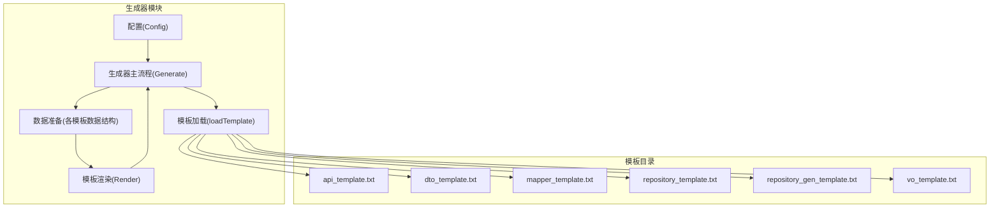
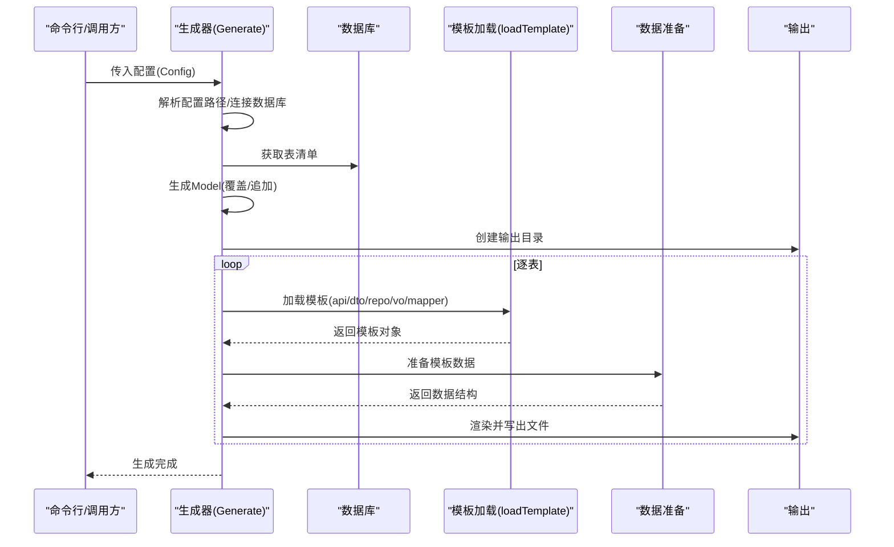
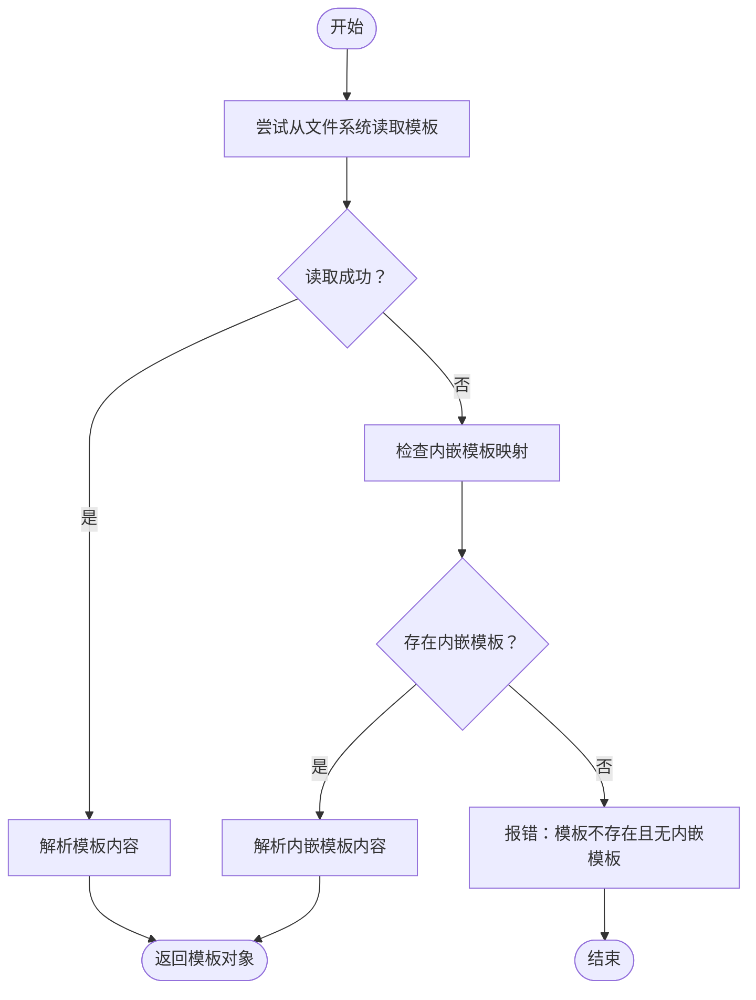
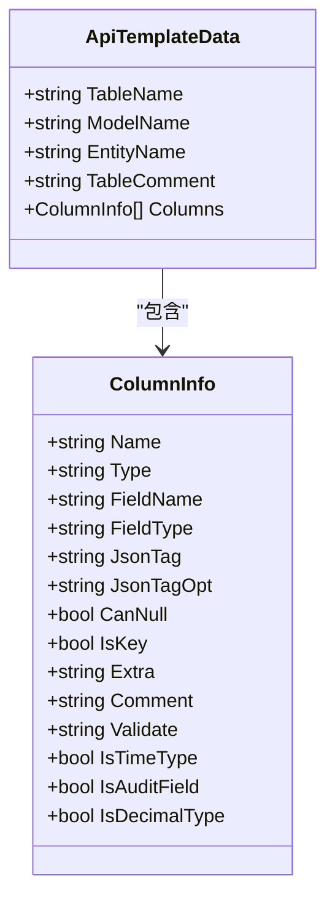
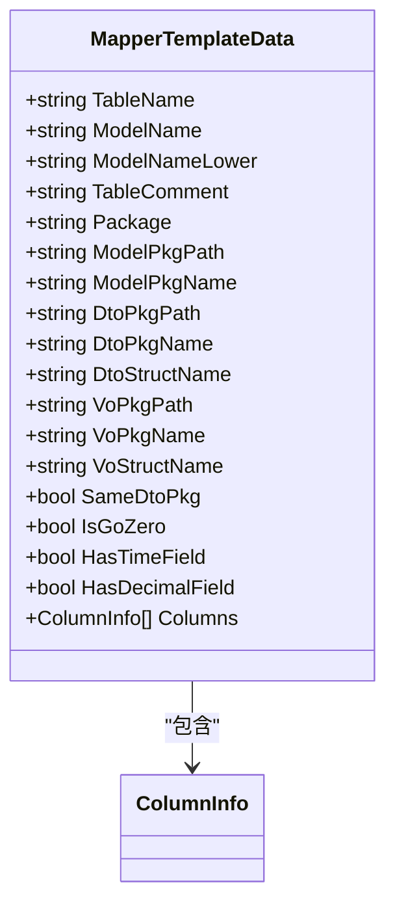
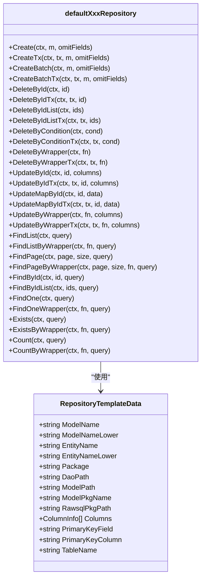
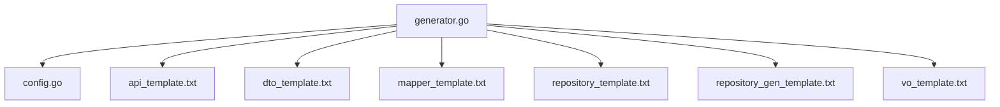

# 模板系统

<cite>
**本文引用的文件**   
- [generator.go](file://generator/generator.go)
- [config.go](file://generator/config.go)
- [api_template.txt](file://generator/template/api_template.txt)
- [dto_template.txt](file://generator/template/dto_template.txt)
- [mapper_template.txt](file://generator/template/mapper_template.txt)
- [repository_template.txt](file://generator/template/repository_template.txt)
- [repository_gen_template.txt](file://generator/template/repository_gen_template.txt)
- [vo_template.txt](file://generator/template/vo_template.txt)
- [generator.example.yaml](file://generator/generator.example.yaml)
- [example_test.go](file://generator/example_test.go)
- [README.md](file://README.md)
</cite>

## 更新摘要
**变更内容**   
- 更新了 Repository 生成模板（repository_gen_template.txt）的缓存失效逻辑说明
- 新增了增强的缓存失效策略和改进的仓库模式支持说明
- 更新了模板功能描述，反映了最新的缓存管理和写操作失效机制

## 目录
1. [简介](#简介)
2. [项目结构](#项目结构)
3. [核心组件](#核心组件)
4. [架构总览](#架构总览)
5. [详细组件分析](#详细组件分析)
6. [依赖分析](#依赖分析)
7. [性能考虑](#性能考虑)
8. [故障排查指南](#故障排查指南)
9. [结论](#结论)
10. [附录](#附录)

## 简介
本模板系统为代码生成器的核心模块，负责加载、解析与渲染各类业务模板（API、DTO、Mapper、Repository、VO 等）。系统采用 Go 内置 text/template 引擎，结合内嵌模板与文件系统模板的优先级策略，既保证默认模板的可移植性，又允许用户自定义覆盖。模板渲染过程中提供统一的数据模型与内置函数（如 lowerFirst），并针对不同目标语言类型（Go、API 描述等）进行类型映射与校验规则生成。

**更新** 本版本重点增强了 Repository 生成模板的缓存失效逻辑，提供了更精细的缓存管理策略和改进的仓库模式支持。

## 项目结构
模板系统位于 generator 子模块，包含以下关键目录与文件：
- generator/template：内嵌模板文件集合，涵盖 API、DTO、Mapper、Repository、VO 等模板
- generator/config.go：配置结构体与 YAML 加载逻辑
- generator/generator.go：模板加载、数据准备、渲染流程与生成器主流程
- generator/generator.example.yaml：示例配置
- generator/example_test.go：使用示例
- README.md：项目总体介绍与代码生成器使用说明

**图表来源**
- [generator.go:1038-1259](file://generator/generator.go#L1038-L1259)
- [config.go:10-46](file://generator/config.go#L10-L46)
- [api_template.txt:1-93](file://generator/template/api_template.txt#L1-L93)
- [dto_template.txt:1-20](file://generator/template/dto_template.txt#L1-L20)
- [mapper_template.txt:1-82](file://generator/template/mapper_template.txt#L1-L82)
- [repository_template.txt:1-28](file://generator/template/repository_template.txt#L1-L28)
- [repository_gen_template.txt:1-538](file://generator/template/repository_gen_template.txt#L1-L538)
- [vo_template.txt:1-10](file://generator/template/vo_template.txt#L1-L10)

**章节来源**
- [generator.go:1038-1259](file://generator/generator.go#L1038-L1259)
- [config.go:10-46](file://generator/config.go#L10-L46)

## 核心组件
- 配置系统：Config 结构体定义数据库连接、输出路径与项目包名等，支持从 YAML 文件加载
- 模板加载：loadTemplate 优先从文件系统读取模板，若不存在则回退到内嵌模板
- 数据准备：为每类模板准备专用数据结构（如 ApiTemplateData、VoTemplateData、RepositoryTemplateData、MapperTemplateData）
- 渲染引擎：基于 text/template，内置 lowerFirst 等函数，按模板语法渲染输出
- 生成流程：Generate 主流程负责连接数据库、确定表清单、生成 Model、创建输出目录、逐表渲染并写出文件

**章节来源**
- [config.go:10-46](file://generator/config.go#L10-L46)
- [generator.go:322-340](file://generator/generator.go#L322-L340)
- [generator.go:229-279](file://generator/generator.go#L229-L279)
- [generator.go:1038-1259](file://generator/generator.go#L1038-L1259)

## 架构总览
模板系统整体工作流如下：
- 读取配置并解析为绝对路径
- 连接数据库，获取表清单
- 生成数据模型（Model）
- 创建输出目录
- 逐表加载模板、准备数据、渲染并写出文件

**图表来源**
- [generator.go:1038-1259](file://generator/generator.go#L1038-L1259)
- [generator.go:322-340](file://generator/generator.go#L322-L340)
- [generator.go:229-279](file://generator/generator.go#L229-L279)

## 详细组件分析

### 模板加载与回退机制
- 优先从文件系统读取模板，便于用户自定义覆盖
- 若文件不存在，则回退到内嵌模板（通过 go:embed 注入）
- 模板函数映射：lowerFirst → lowerFirst

**图表来源**
- [generator.go:322-340](file://generator/generator.go#L322-L340)

**章节来源**
- [generator.go:322-340](file://generator/generator.go#L322-L340)

### API 模板（api_template.txt）
- 用途：生成 API 描述文件（如 go-zero desc），包含请求/响应结构体、服务路由与中间件
- 数据模型：ApiTemplateData（表名、模型名、实体名、注释、列信息）
- 特性：
  - 自动过滤审计字段与软删字段
  - JSON tag 与 optional 控制
  - 校验规则生成（required、uuid、email、mobile、enum、gte 等）

**图表来源**
- [generator.go:229-235](file://generator/generator.go#L229-L235)
- [generator.go:212-227](file://generator/generator.go#L212-L227)
- [api_template.txt:1-93](file://generator/template/api_template.txt#L1-L93)

**章节来源**
- [generator.go:229-235](file://generator/generator.go#L229-L235)
- [generator.go:287-320](file://generator/generator.go#L287-L320)
- [api_template.txt:1-93](file://generator/template/api_template.txt#L1-L93)

### DTO 模板（dto_template.txt）
- 用途：生成请求 DTO（Create/Modify）
- 数据模型：VoTemplateData（与 API 模板共享）
- 特性：
  - lowerFirst 用于 JSON tag 名称
  - 自动过滤 id、created_at、updated_at、deleted_at
  - 校验规则生成

**章节来源**
- [dto_template.txt:1-20](file://generator/template/dto_template.txt#L1-L20)
- [generator.go:602-641](file://generator/generator.go#L602-L641)

### VO 模板（vo_template.txt）
- 用途：生成响应 VO
- 数据模型：VoTemplateData
- 特性：
  - lowerFirst 用于 JSON tag 名称
  - 过滤 deleted_at 字段

**章节来源**
- [vo_template.txt:1-10](file://generator/template/vo_template.txt#L1-L10)
- [generator.go:562-600](file://generator/generator.go#L562-L600)

### Mapper 模板（mapper_template.txt）
- 用途：生成实体与 DTO/VO 的映射器（接口与实现）
- 数据模型：MapperTemplateData
- 特性：
  - 导入控制：根据字段类型动态引入 time、decimal
  - go-zero 适配：结构体命名与包导入差异
  - lowerFirst 用于字段参数名
  - 审计字段、时间字段、decimal 字段的特殊映射

**图表来源**
- [generator.go:259-279](file://generator/generator.go#L259-L279)
- [generator.go:646-717](file://generator/generator.go#L646-L717)
- [mapper_template.txt:1-82](file://generator/template/mapper_template.txt#L1-L82)

**章节来源**
- [generator.go:646-717](file://generator/generator.go#L646-L717)
- [mapper_template.txt:1-82](file://generator/template/mapper_template.txt#L1-L82)

### Repository 模板（repository_template.txt）
- 用途：生成用户可自定义的 Repository 接口与实现骨架
- 特性：
  - 用户自定义文件，不会被生成器覆盖
  - 提供 customerXxxRepository 与接口定义

**章节来源**
- [repository_template.txt:1-28](file://generator/template/repository_template.txt#L1-L28)

### Repository 生成模板（repository_gen_template.txt）
- 用途：生成默认 Repository 实现（defaultXxxRepository）与接口（iDefaultXxxRepository）
- 能力：
  - CRUD、批量创建、删除、条件删除、Wrapper 删除
  - 更新（按 ID、Map、Wrapper）、Wrapper 更新
  - 列表、分页、单条、存在性、计数
  - 条件构建与排序、分页偏移计算
- 特性：
  - 主键字段与列名自动识别
  - 上下文支持、事务支持
  - **新增** 增强的缓存失效逻辑和改进的仓库模式支持

**更新** 本模板现在包含了完整的缓存失效策略，包括精确失效和前缀失效的组合使用，以及针对不同写操作的差异化缓存管理。

**图表来源**
- [generator.go:244-257](file://generator/generator.go#L244-L257)
- [repository_gen_template.txt:1-538](file://generator/template/repository_gen_template.txt#L1-L538)

**章节来源**
- [generator.go:391-560](file://generator/generator.go#L391-L560)
- [repository_gen_template.txt:1-538](file://generator/template/repository_gen_template.txt#L1-L538)

### 增强的缓存失效逻辑

**新增功能** Repository 生成模板现在包含了完整的缓存失效策略，这是本次更新的核心增强功能：

#### 缓存失效策略总览
系统采用统一的缓存失效策略，以 `"{{.TableName}}.方法名"` 作为缓存键前缀：

- **写操作失效范围**：
  - Create / Update / Delete（按ID）：`invalidateWriteCaches` - 清理 List/Page/Count/Exists 全部前缀
  - Delete（按ID）：额外精确失效单条 FindById
  - 条件 Update/Delete：`invalidateAllTableCaches` - 整张表（按表名前缀失效）

#### 具体实现机制

**精确失效函数**：
- `invalidateWriteCaches()`：失效所有受写操作影响的缓存（List/Page/Count/Exists + 衍生方法）
- `invalidateAllTableCaches()`：失效整张表所有缓存（用于条件 Update/Delete）

**批量失效优化**：
- 使用 `SFInvalidatePrefixes` 批量接口，将 Redis 场景下的 11 次 SCAN 降为 1 次 pipeline
- 设计说明：三类写操作的 List/Aggregate 失效范围相同，合并成一个函数，避免 Redis 多次 SCAN

**写操作自动失效**：
- Create/CreateBatch：自动失效 List/Page/Count/Exists 前缀缓存
- DeleteById/DeleteByIdList：失效单条 FindById + List/Page/Count/Exists 前缀缓存
- DeleteByCondition/DeleteByWrapper：整表缓存失效（最安全策略）
- UpdateById/UpdateMapById：失效单条 FindById + List/Page 前缀缓存

**章节来源**
- [repository_gen_template.txt:72-110](file://generator/template/repository_gen_template.txt#L72-L110)
- [repository_gen_template.txt:172-377](file://generator/template/repository_gen_template.txt#L172-L377)

### 类型映射与校验规则
- 类型映射：
  - getGoType：通用 Go 类型映射
  - getGoTypeForApiDto：API/DTO 使用字符串映射 decimal/float/double 与时间类型
  - getGoTypeForVo：VO 使用字符串映射 decimal/float/double 与时间类型
- 校验规则：
  - required、uuid、email、mobile、enum(oneof)、gte 等

**章节来源**
- [generator.go:719-773](file://generator/generator.go#L719-L773)
- [generator.go:287-320](file://generator/generator.go#L287-L320)

### 模板变量与内置函数
- lowerFirst：将字段名转为小驼峰（用于 JSON tag 与参数名）
- 模板中使用：
  - JSON tag 名称：lowerFirst .FieldName
  - 参数名：lowerFirst .FieldName（Mapper 模板）
  - 结构体字段名：.FieldName（保持首字母大写）

**章节来源**
- [generator.go:148-150](file://generator/generator.go#L148-L150)
- [dto_template.txt](file://generator/template/dto_template.txt#L7)
- [mapper_template.txt](file://generator/template/mapper_template.txt#L24)
- [mapper_template.txt:40-56](file://generator/template/mapper_template.txt#L40-L56)
- [mapper_template.txt:65-79](file://generator/template/mapper_template.txt#L65-L79)

### 模板定制指南与最佳实践
- 自定义模板：
  - 在文件系统中提供同名模板文件即可覆盖内嵌模板
  - 保持模板语法一致，复用内置函数与数据结构
- 最佳实践：
  - 为每个模板保留最小差异的自定义版本，避免过度魔改
  - 使用 lowerFirst 保持 JSON tag 一致性
  - Mapper 模板中根据 HasTimeField/HasDecimalField 动态导入依赖
  - Repository 模板中区分用户自定义与默认实现，避免覆盖用户代码
  - **新增** 利用增强的缓存失效逻辑，确保缓存一致性

**更新** 新增了关于缓存失效策略的最佳实践指导。

**章节来源**
- [generator.go:328-339](file://generator/generator.go#L328-L339)
- [mapper_template.txt:3-18](file://generator/template/mapper_template.txt#L3-L18)

### 使用示例与配置
- 示例配置 generator.example.yaml：包含数据库连接与输出路径
- 示例调用 example_test.go：展示两种使用方式（直接传配置/加载 YAML）
- README.md：项目总体介绍与代码生成器使用说明

**章节来源**
- [generator.example.yaml:1-17](file://generator/generator.example.yaml#L1-L17)
- [example_test.go:7-35](file://generator/example_test.go#L7-L35)
- [README.md:662-694](file://README.md#L662-L694)

## 依赖分析
- 模板系统依赖：
  - gorm、gen：用于数据库元数据与模型生成
  - text/template：模板渲染引擎
  - yaml.v3：配置解析
- 模块内聚与耦合：
  - 生成器主流程集中于 generator.go，职责清晰
  - 模板与数据结构解耦，便于扩展新模板
  - 配置模块独立，便于外部集成

**图表来源**
- [generator.go:1-20](file://generator/generator.go#L1-L20)
- [config.go:1-9](file://generator/config.go#L1-L9)
- [api_template.txt:1-93](file://generator/template/api_template.txt#L1-L93)
- [dto_template.txt:1-20](file://generator/template/dto_template.txt#L1-L20)
- [mapper_template.txt:1-82](file://generator/template/mapper_template.txt#L1-L82)
- [repository_template.txt:1-28](file://generator/template/repository_template.txt#L1-L28)
- [repository_gen_template.txt:1-538](file://generator/template/repository_gen_template.txt#L1-L538)
- [vo_template.txt:1-10](file://generator/template/vo_template.txt#L1-L10)

## 性能考虑
- 模板加载：优先文件系统，减少不必要的内嵌模板解析
- 数据准备：按需计算字段类型与校验规则，避免重复计算
- 生成流程：全量表时尽量减少 IO 操作，批量写出文件
- **新增** 缓存失效优化：使用批量失效接口，将 Redis SCAN 操作从 11 次优化为 1 次 pipeline
- 建议：
  - 将常用模板放在本地磁盘，避免每次走内嵌模板路径
  - 控制模板复杂度，减少条件分支与循环层数
  - **新增** 利用增强的缓存失效策略，平衡缓存命中率与一致性

**更新** 新增了关于缓存失效性能优化的考虑。

## 故障排查指南
- 模板加载失败：
  - 检查模板路径是否正确，确认文件存在
  - 若使用自定义模板，确认文件名与内嵌模板一致
- 渲染失败：
  - 检查数据结构字段是否匹配模板引用
  - 确认 lowerFirst 等函数在模板中正确使用
- 配置问题：
  - 确认 YAML 配置项完整，路径解析为绝对路径
  - 检查数据库连接信息与网络连通性
- 输出目录：
  - 确保输出目录存在或生成器具备创建权限
  - 注意已存在文件会被跳过，避免误覆盖
- **新增** 缓存一致性问题：
  - 检查写操作是否正确调用了缓存失效函数
  - 验证缓存键前缀格式是否符合 `"{{.TableName}}.方法名"` 规范
  - 确认批量失效接口（SFInvalidatePrefixes）的使用正确性

**更新** 新增了关于缓存失效相关的故障排查指导。

**章节来源**
- [generator.go:322-340](file://generator/generator.go#L322-L340)
- [generator.go:1038-1259](file://generator/generator.go#L1038-L1259)
- [config.go:33-46](file://generator/config.go#L33-L46)

## 结论
模板系统通过"文件系统优先 + 内嵌回退"的策略，在保证默认模板可移植的同时，给予用户充分的自定义空间。借助统一的数据模型与内置函数，系统能够稳定地生成 API、DTO、Mapper、Repository、VO 等多类文件，满足不同项目架构需求。

**更新** 本次更新重点增强了 Repository 生成模板的缓存失效逻辑，提供了更精细的缓存管理策略，包括精确失效、前缀失效和批量失效优化，显著提升了缓存一致性和性能表现。建议在实际使用中遵循最小差异定制原则，配合增强的缓存失效策略，提升代码质量与一致性。

## 附录
- 快速开始：参考 README 中的代码生成器使用说明与示例
- 配置参考：generator.example.yaml 提供完整字段说明
- 示例调用：example_test.go 展示两种使用方式

**章节来源**
- [README.md:662-694](file://README.md#L662-L694)
- [generator.example.yaml:1-17](file://generator/generator.example.yaml#L1-L17)
- [example_test.go:7-35](file://generator/example_test.go#L7-L35)