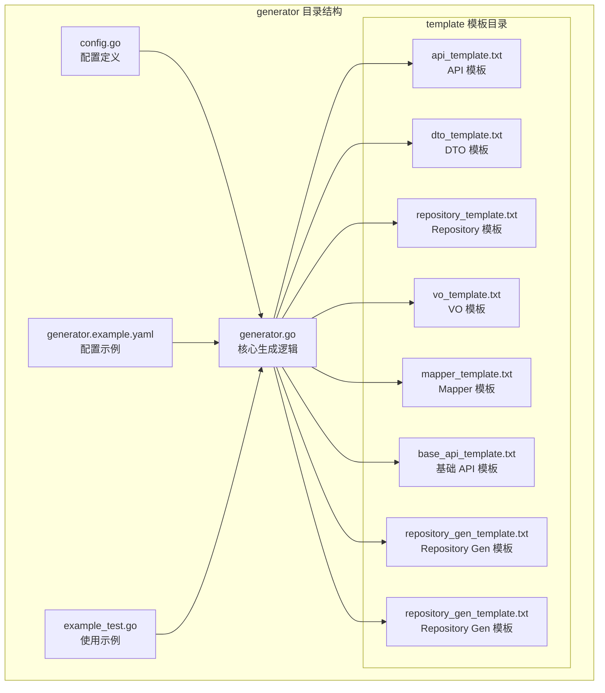
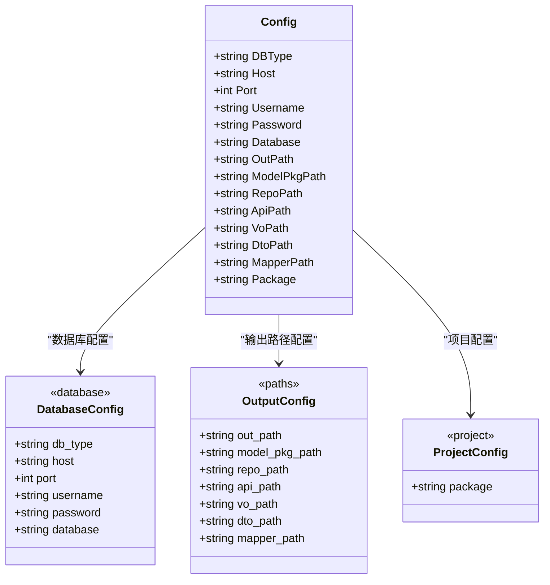
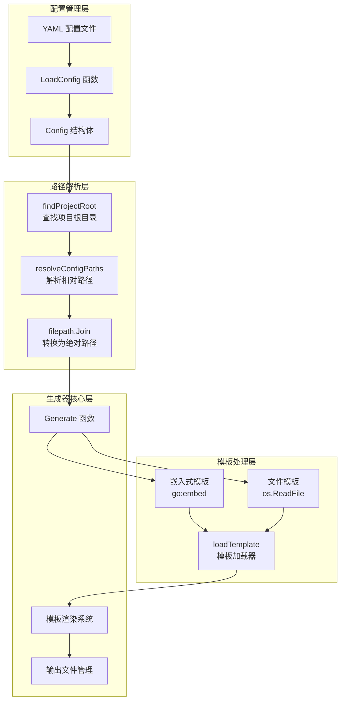
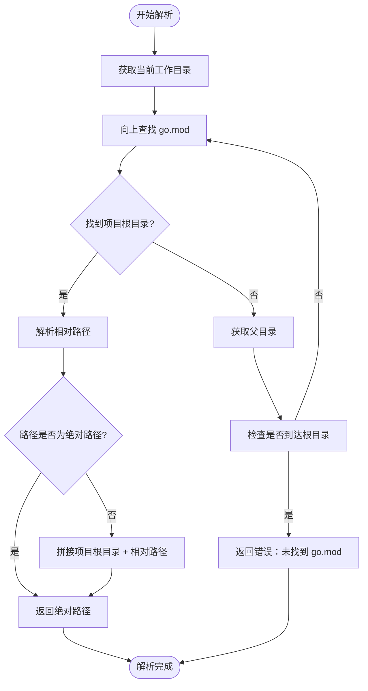
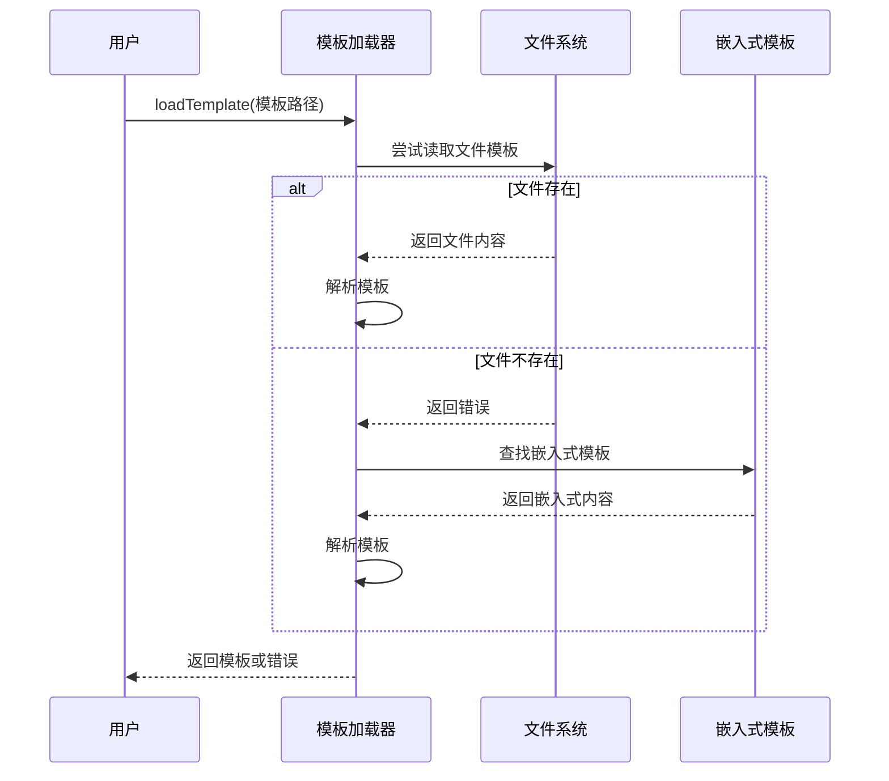
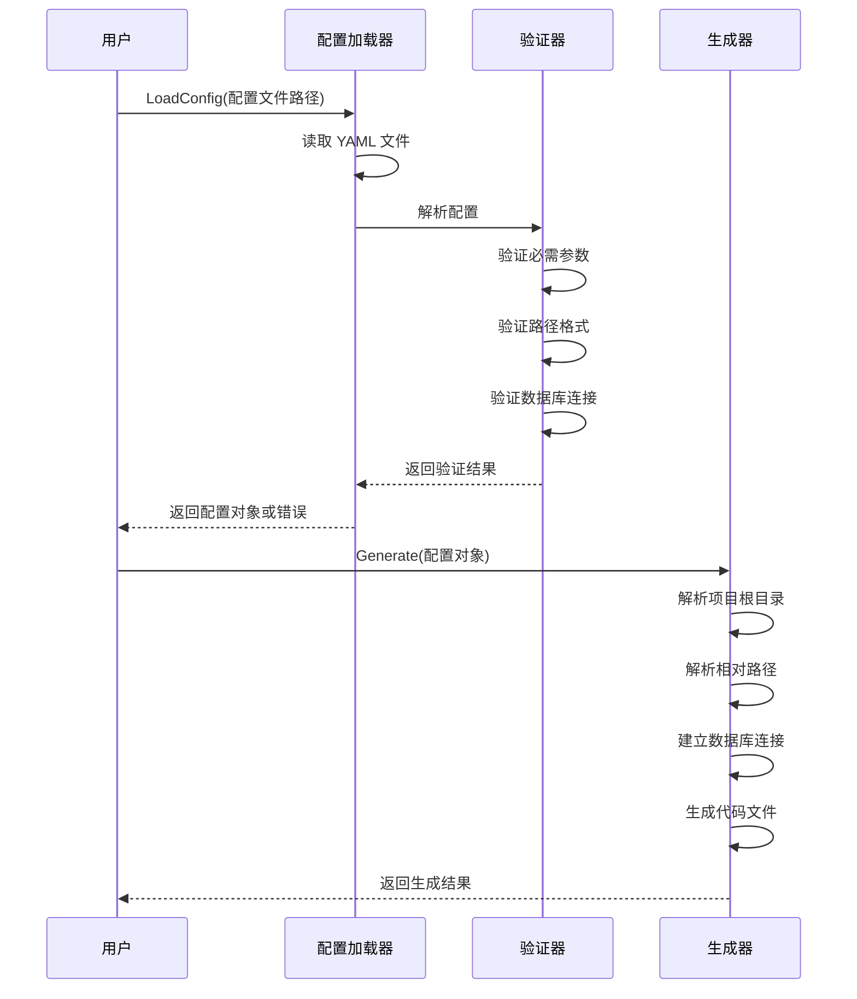

# 配置管理

<cite>
**本文档引用的文件**
- [config.go](file://generator/config.go)
- [generator.go](file://generator/generator.go)
- [generator.example.yaml](file://generator/generator.example.yaml)
- [example_test.go](file://generator/example_test.go)
- [api_template.txt](file://generator/template/api_template.txt)
- [base_api_template.txt](file://generator/template/base_api_template.txt)
- [dto_template.txt](file://generator/template/dto_template.txt)
- [repository_template.txt](file://generator/template/repository_template.txt)
- [vo_template.txt](file://generator/template/vo_template.txt)
- [mapper_template.txt](file://generator/template/mapper_template.txt)
- [README.md](file://README.md)
</cite>

## 更新摘要
**变更内容**
- 更新了模板处理机制的详细说明，包括嵌入式模板和文件优先级
- 增强了错误处理策略的描述，涵盖模板加载失败的处理
- 添加了新的配置选项和使用方式说明
- 更新了架构图以反映改进的模板处理流程

## 目录
1. [简介](#简介)
2. [项目结构](#项目结构)
3. [核心组件](#核心组件)
4. [架构概览](#架构概览)
5. [详细组件分析](#详细组件分析)
6. [依赖关系分析](#依赖关系分析)
7. [性能考虑](#性能考虑)
8. [故障排除指南](#故障排除指南)
9. [结论](#结论)
10. [附录](#附录)

## 简介

本文档详细介绍了 gorm-plus 代码生成器的配置管理系统。该系统提供了灵活的配置文件结构，支持数据库连接配置、输出路径配置、包路径配置等功能。文档深入解释了配置文件的解析机制、路径解析逻辑、配置验证策略，并提供了完整的配置示例和最佳实践。

**更新** 代码生成器配置系统现已包含改进的模板处理机制和更完善的错误处理策略，支持嵌入式模板和文件优先级处理。

## 项目结构

代码生成器配置管理位于 `generator` 目录下，主要包含以下关键文件：



**图表来源**
- [config.go:1-47](file://generator/config.go#L1-L47)
- [generator.go:1-929](file://generator/generator.go#L1-L929)
- [generator.example.yaml:1-17](file://generator/generator.example.yaml#L1-L17)

**章节来源**
- [config.go:1-47](file://generator/config.go#L1-L47)
- [generator.go:1-929](file://generator/generator.go#L1-L929)
- [generator.example.yaml:1-17](file://generator/generator.example.yaml#L1-L17)

## 核心组件

### 配置结构定义

配置系统的核心是一个简洁的结构体，定义了代码生成器所需的所有配置参数：



**图表来源**
- [config.go:10-31](file://generator/config.go#L10-L31)

### 配置加载机制

配置系统提供了两种加载方式：

1. **文件加载**：从 YAML 文件加载配置
2. **直接配置**：通过代码直接创建配置对象

**章节来源**
- [config.go:33-46](file://generator/config.go#L33-L46)
- [example_test.go:7-35](file://generator/example_test.go#L7-L35)

## 架构概览

配置管理系统采用分层架构设计，确保配置的灵活性和可维护性。**更新** 新增了改进的模板处理机制和错误处理策略：



**图表来源**
- [generator.go:22-68](file://generator/generator.go#L22-L68)
- [generator.go:351-362](file://generator/generator.go#L351-L362)
- [generator.go:770-929](file://generator/generator.go#L770-L929)

## 详细组件分析

### 数据库连接配置

数据库连接配置是代码生成器的基础，支持多种数据库类型：

| 参数名称 | 类型 | 必填 | 默认值 | 说明 |
|---------|------|------|--------|------|
| db_type | string | 是 | - | 数据库类型，如 "mysql" |
| host | string | 是 | - | 数据库主机地址 |
| port | int | 是 | - | 数据库端口号 |
| username | string | 是 | - | 数据库用户名 |
| password | string | 是 | - | 数据库密码 |
| database | string | 是 | - | 数据库名称 |

**章节来源**
- [config.go:12-18](file://generator/config.go#L12-L18)
- [generator.example.yaml:1-6](file://generator/generator.example.yaml#L1-L6)

### 输出路径配置

输出路径配置决定了生成文件的存储位置：

| 参数名称 | 类型 | 必填 | 默认值 | 说明 |
|---------|------|------|--------|------|
| out_path | string | 是 | - | DAO 输出路径 |
| model_pkg_path | string | 是 | - | Model 包路径 |
| repo_path | string | 否 | 空 | Repository 输出路径 |
| api_path | string | 否 | 空 | API 描述文件路径 |
| vo_path | string | 否 | 空 | VO 输出路径 |
| dto_path | string | 否 | 空 | DTO 输出路径 |
| mapper_path | string | 否 | 空 | Mapper 输出路径 |

**章节来源**
- [config.go:20-27](file://generator/config.go#L20-L27)
- [generator.example.yaml:7-15](file://generator/generator.example.yaml#L7-L15)

### 包路径配置

包路径配置定义了生成代码的包结构：

| 参数名称 | 类型 | 必填 | 默认值 | 说明 |
|---------|------|------|--------|------|
| package | string | 是 | - | 项目包名 |

**章节来源**
- [config.go:29-30](file://generator/config.go#L29-L30)
- [generator.example.yaml:16](file://generator/generator.example.yaml#L16)

### 路径解析机制

路径解析机制确保无论从哪里运行代码生成器，都能正确解析到项目根目录：



**图表来源**
- [generator.go:37-68](file://generator/generator.go#L37-L68)

**章节来源**
- [generator.go:22-68](file://generator/generator.go#L22-L68)

### 模板处理机制

**更新** 模板处理机制现已包含嵌入式模板支持和文件优先级处理：



**图表来源**
- [generator.go:351-362](file://generator/generator.go#L351-L362)

模板处理的新特性包括：
- **文件优先级**：优先使用文件系统中的模板文件
- **嵌入式回退**：文件不存在时自动使用内置模板
- **统一解析**：通过 `loadTemplate` 函数统一处理模板加载

**章节来源**
- [generator.go:351-362](file://generator/generator.go#L351-L362)
- [generator.go:70-99](file://generator/generator.go#L70-L99)

### 配置验证机制

配置系统实现了多层次的验证机制：



**图表来源**
- [config.go:33-46](file://generator/config.go#L33-L46)
- [generator.go:770-929](file://generator/generator.go#L770-L929)

**章节来源**
- [config.go:33-46](file://generator/config.go#L33-L46)
- [generator.go:770-929](file://generator/generator.go#L770-L929)

### 错误处理策略

**更新** 错误处理策略现已包含模板加载和文件操作的详细处理：

配置系统采用了全面的错误处理策略：

| 错误类型 | 处理方式 | 示例场景 |
|---------|----------|----------|
| 文件读取错误 | 返回详细错误信息 | 配置文件不存在或权限不足 |
| YAML 解析错误 | 返回解析失败信息 | 配置文件格式不正确 |
| 路径解析错误 | 返回路径解析失败 | 相对路径无法解析到项目根目录 |
| 数据库连接错误 | 返回连接失败信息 | 数据库凭据错误或网络问题 |
| 模板加载错误 | 回退到内嵌模板 | 自定义模板文件缺失 |
| 模板渲染错误 | 返回渲染失败信息 | 模板语法错误或数据绑定失败 |
| 文件写入错误 | 记录错误并继续处理 | 输出文件权限不足或磁盘空间不足 |

**章节来源**
- [config.go:33-46](file://generator/config.go#L33-L46)
- [generator.go:33-46](file://generator/generator.go#L33-L46)
- [generator.go:351-362](file://generator/generator.go#L351-L362)

## 依赖关系分析

配置管理系统与其他模块的依赖关系如下：

```mermaid
graph TB
subgraph "配置系统"
CFG[Config 结构体]
LOAD[LoadConfig 函数]
RESOLVE[路径解析函数]
end
subgraph "外部依赖"
YAML[yaml.v3<br/>YAML 解析]
OS[os<br/>文件系统操作]
PATH[path/filepath<br/>路径处理]
GORM[gorm.io<br/>数据库 ORM]
MYSQL[gorm.io/driver/mysql<br/>MySQL 驱动]
TEXT[text/template<br/>模板引擎]
END
subgraph "内部模块"
GEN[Generate 函数]
TEMPLATES[模板系统]
UTILS[工具函数]
PARSER[表解析器]
NAMER[命名工具]
INPUT[标准输入]
end
CFG --> YAML
CFG --> OS
RESOLVE --> PATH
RESOLVE --> OS
GEN --> GORM
GEN --> MYSQL
GEN --> TEMPLATES
GEN --> UTILS
GEN --> PARSER
GEN --> NAMER
GEN --> INPUT
TEMPLATES --> TEXT
PARSER --> REGEXP
NAMER --> STRINGS
INPUT --> BUFIO
INPUT --> EXEC
```

**图表来源**
- [config.go:3-8](file://generator/config.go#L3-L8)
- [generator.go:3-21](file://generator/generator.go#L3-L21)

**章节来源**
- [config.go:3-8](file://generator/config.go#L3-L8)
- [generator.go:3-21](file://generator/generator.go#L3-L21)

## 性能考虑

配置系统的性能优化主要体现在以下几个方面：

### 路径解析优化
- 使用缓存机制避免重复解析项目根目录
- 采用一次性解析策略，减少文件系统访问次数
- 支持绝对路径直接返回，跳过解析过程

### 模板处理优化
- **嵌入式模板预编译**：模板内容在编译时就绪，减少运行时开销
- **模板缓存机制**：避免重复解析相同模板
- **文件优先级策略**：优先使用文件系统模板，减少嵌入式模板的使用

### 内存管理
- 配置对象生命周期管理
- 模板内容的内存复用
- 临时文件的及时清理

### 并发安全
- 配置读取的线程安全
- 路径解析的原子性操作
- 错误信息的不可变性

## 故障排除指南

### 常见配置问题

| 问题描述 | 可能原因 | 解决方案 |
|---------|----------|----------|
| 配置文件解析失败 | YAML 格式错误 | 检查缩进和特殊字符 |
| 路径解析错误 | 相对路径不正确 | 使用绝对路径或检查项目结构 |
| 数据库连接失败 | 凭据错误或网络问题 | 验证数据库连接信息 |
| 模板加载失败 | 自定义模板缺失 | 检查模板文件路径或使用默认模板 |
| 模板渲染错误 | 模板语法错误 | 检查模板语法和数据绑定 |
| 文件写入失败 | 权限不足或磁盘空间不足 | 检查文件权限和磁盘空间 |

### 调试技巧

1. **启用详细日志**：在开发环境中启用详细的错误信息输出
2. **验证配置文件**：使用在线 YAML 验证工具检查配置文件格式
3. **逐步调试**：分步骤验证每个配置项的有效性
4. **环境隔离**：在独立的测试环境中验证配置
5. **模板测试**：单独测试模板文件的语法正确性

**章节来源**
- [generator.go:33-46](file://generator/generator.go#L33-L46)
- [generator.go:770-929](file://generator/generator.go#L770-L929)

## 结论

gorm-plus 代码生成器的配置管理系统提供了强大而灵活的配置能力。通过清晰的配置结构、完善的路径解析机制、全面的验证策略和健壮的错误处理，系统能够满足各种复杂的代码生成需求。

**更新** 新的模板处理机制和错误处理策略进一步增强了系统的稳定性和可靠性。系统的主要优势包括：

- **灵活性**：支持多种数据库类型和输出格式
- **可靠性**：完善的错误处理和验证机制
- **易用性**：直观的配置语法和丰富的示例
- **可维护性**：清晰的代码结构和文档支持
- **稳定性**：嵌入式模板和文件优先级处理确保系统稳定运行

## 附录

### 配置文件示例

完整的配置文件示例展示了所有可用的配置选项：

```yaml
# 数据库配置
db_type: mysql
host: localhost
port: 3306
username: root
password: "123456"
database: gin-admin-api

# 输出路径配置
out_path: ./internal/dal/dao
model_pkg_path: ./internal/dal/model/entity
repo_path: ./internal/dal/repository
api_path: ./apps/admin/desc
vo_path: ./internal/dal/vo
dto_path: ./internal/dal/dto
mapper_path: ./internal/dal/mapper

# 项目配置
package: gin-admin-api
```

**章节来源**
- [generator.example.yaml:1-17](file://generator/generator.example.yaml#L1-L17)

### 最佳实践

1. **项目结构规划**：合理规划项目的目录结构，确保路径配置的一致性
2. **配置文件管理**：使用版本控制系统管理配置文件，便于追踪变更
3. **环境隔离**：为不同环境准备不同的配置文件
4. **安全性考虑**：敏感信息（如密码）应通过环境变量或密钥管理服务处理
5. **模板管理**：自定义模板文件应放在项目根目录下的 `generator/template` 目录中
6. **错误处理**：在生产环境中启用详细的错误日志记录
7. **性能优化**：合理配置模板目录，避免不必要的文件系统访问

### 版本管理和迁移指南

由于当前代码库未显示明确的版本管理信息，建议采用以下通用的版本管理策略：

1. **语义化版本控制**：遵循 MAJOR.MINOR.PATCH 的版本命名规则
2. **变更日志**：维护详细的变更日志，记录配置项的变更历史
3. **向后兼容性**：尽量保持配置文件的向后兼容性
4. **迁移脚本**：为重大配置变更提供自动化的迁移脚本

**章节来源**
- [README.md:662-694](file://README.md#L662-L694)