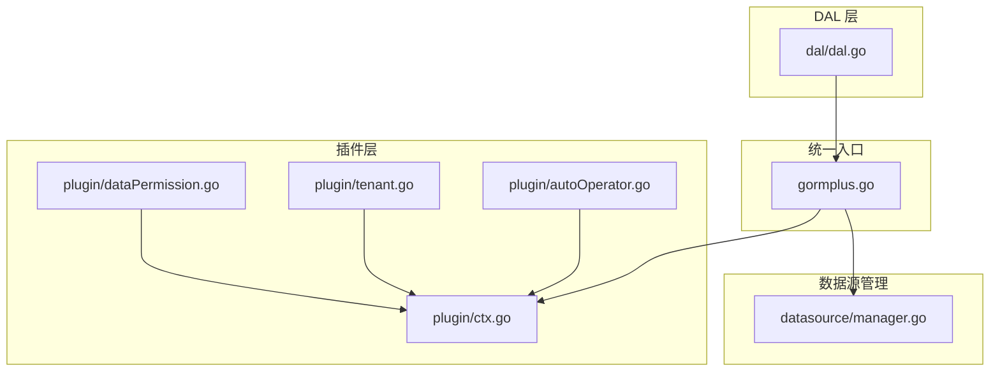
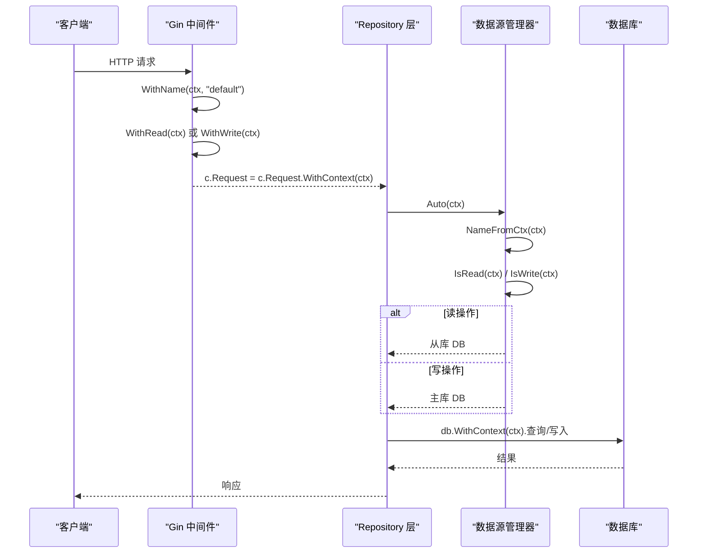
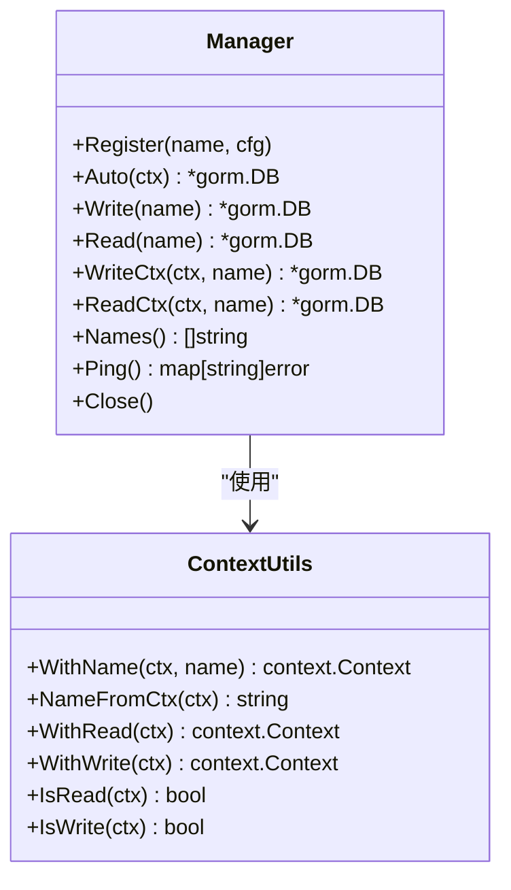
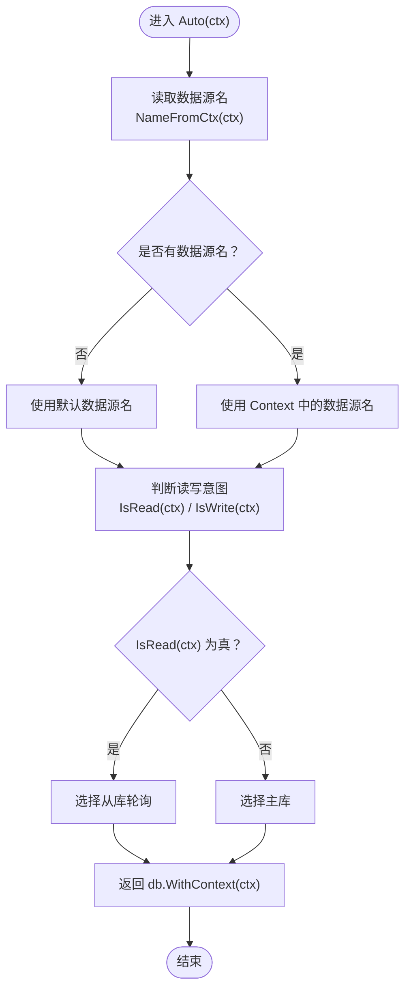
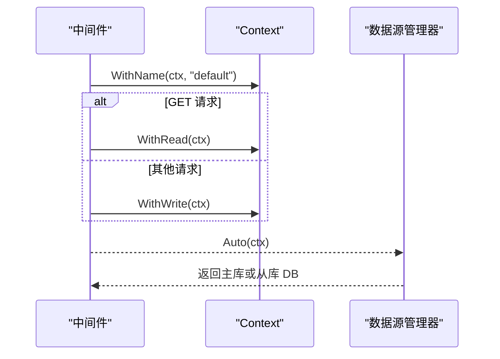
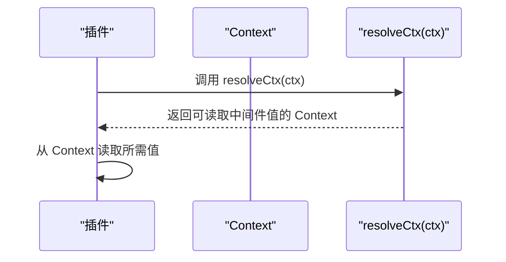
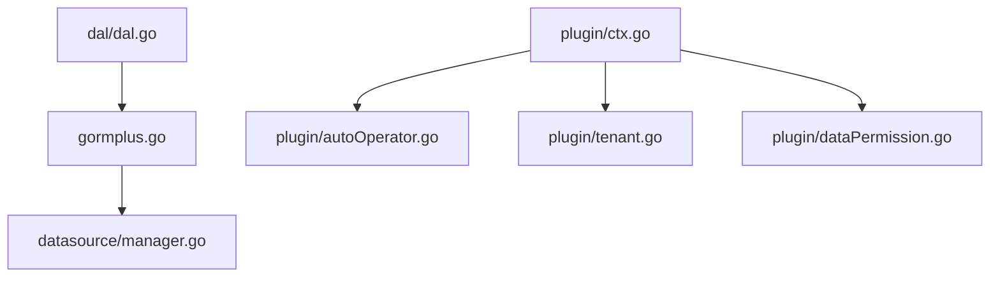

# Context 管理

<cite>
**本文引用的文件**
- [gormplus.go](file://gormplus.go)
- [manager.go](file://datasource/manager.go)
- [ctx.go](file://plugin/ctx.go)
- [autoOperator.go](file://plugin/autoOperator.go)
- [tenant.go](file://plugin/tenant.go)
- [dataPermission.go](file://plugin/dataPermission.go)
- [README.md](file://README.md)
- [dal.go](file://dal/dal.go)
</cite>

## 目录
1. [简介](#简介)
2. [项目结构](#项目结构)
3. [核心组件](#核心组件)
4. [架构总览](#架构总览)
5. [详细组件分析](#详细组件分析)
6. [依赖关系分析](#依赖关系分析)
7. [性能考量](#性能考量)
8. [故障排查指南](#故障排查指南)
9. [结论](#结论)
10. [附录](#附录)

## 简介
本技术文档围绕 Context 管理机制展开，重点阐述如何在中间件中使用 WithName、WithRead、WithWrite 函数来管理数据源上下文，以及 Context 中数据源名和读写标记的存储与读取机制。文档还提供了完整的中间件集成示例（固定数据源中间件与读写分离中间件）、Auto() 如何自动解析 Context 中的数据源信息与读写意图、IsRead()、IsWrite() 等辅助函数的使用方法、Context 传递的最佳实践与常见错误处理，以及与不同 Web 框架（如 Gin）的集成示例。

## 项目结构
本项目采用模块化设计，Context 管理相关能力主要分布在以下模块：
- gormplus.go：对外统一入口，导出 DSWithName、DSWithRead、DSWithWrite、DSIsRead、DSIsWrite 等便捷函数，屏蔽底层实现细节。
- datasource/manager.go：多数据源管理器，提供 WithName、NameFromCtx、WithRead、WithWrite、IsRead、IsWrite、Auto() 等核心 API。
- plugin/ctx.go：ctx 解析器，解决 Gin 等框架传入 *gin.Context 时无法从 Request.Context() 读取中间件写入值的问题。
- plugin/autoOperator.go、plugin/tenant.go、plugin/dataPermission.go：各插件在读取 Context 前统一通过解析器 resolveCtx(ctx) 兼容不同框架。
- dal/dal.go：DAL 层通过 WithDB 将 DAL 实例注入 Context，实现多数据源场景下的上下文传递。

**图表来源**
- [gormplus.go:123-214](file://gormplus.go#L123-L214)
- [manager.go:539-579](file://datasource/manager.go#L539-L579)
- [ctx.go:9-43](file://plugin/ctx.go#L9-L43)
- [autoOperator.go:61-74](file://plugin/autoOperator.go#L61-L74)
- [tenant.go:534-535](file://plugin/tenant.go#L534-L535)
- [dataPermission.go:86-91](file://plugin/dataPermission.go#L86-L91)
- [dal.go:446-448](file://dal/dal.go#L446-L448)

**章节来源**
- [gormplus.go:123-214](file://gormplus.go#L123-L214)
- [manager.go:539-579](file://datasource/manager.go#L539-L579)
- [ctx.go:9-43](file://plugin/ctx.go#L9-L43)
- [autoOperator.go:61-74](file://plugin/autoOperator.go#L61-L74)
- [tenant.go:534-535](file://plugin/tenant.go#L534-L535)
- [dataPermission.go:86-91](file://plugin/dataPermission.go#L86-L91)
- [dal.go:446-448](file://dal/dal.go#L446-L448)

## 核心组件
- 数据源管理器（Manager）：负责注册数据源组、自动切换（根据 Context 决定数据源名与读写意图）、显式指定读写、健康检查与优雅关闭。
- Context 工具函数：WithName、NameFromCtx、WithRead、WithWrite、IsRead、IsWrite，用于在 Context 中存储与读取数据源名与读写标记。
- Auto()：根据 Context 自动决策数据源与读写类型，是 Repository 层首选调用方式。
- ctx 解析器：RegisterCtxResolver、resolveCtx，屏蔽 Gin/GoZero/Fiber 等框架差异，确保中间件写入的值能被插件读取。

**章节来源**
- [manager.go:288-323](file://datasource/manager.go#L288-L323)
- [manager.go:539-579](file://datasource/manager.go#L539-L579)
- [ctx.go:31-43](file://plugin/ctx.go#L31-L43)

## 架构总览
Context 管理机制的关键流程如下：
- 中间件在请求入口处通过 WithName、WithRead/WithWrite 将数据源名与读写意图写入 Context。
- Repository 层调用 DS.Auto(ctx)，内部通过 NameFromCtx 读取数据源名，通过 IsRead/IsWrite 判断读写意图，从而选择主库或从库。
- 插件层（自动填充、多租户、数据权限）在读取 Context 前统一通过 resolveCtx(ctx) 解析，兼容不同框架传入的 *gin.Context。

**图表来源**
- [manager.go:299-323](file://datasource/manager.go#L299-L323)
- [manager.go:300-318](file://datasource/manager.go#L300-L318)
- [manager.go:542-566](file://datasource/manager.go#L542-L566)
- [README.md:179-194](file://README.md#L179-L194)

**章节来源**
- [manager.go:299-323](file://datasource/manager.go#L299-L323)
- [manager.go:300-318](file://datasource/manager.go#L300-L318)
- [manager.go:542-566](file://datasource/manager.go#L542-L566)
- [README.md:179-194](file://README.md#L179-L194)

## 详细组件分析

### 数据源管理器（Manager）与 Context 工具
- WithName(ctx, name)：将数据源名写入 Context，供 Auto() 读取。
- NameFromCtx(ctx)：从 Context 读取数据源名。
- WithRead(ctx) / WithWrite(ctx)：标记 Context 的读写意图。
- IsRead(ctx) / IsWrite(ctx)：判断 Context 的读写意图。
- Auto(ctx)：根据 Context 自动选择数据源与读写类型。

**图表来源**
- [manager.go:254-284](file://datasource/manager.go#L254-L284)
- [manager.go:288-323](file://datasource/manager.go#L288-L323)
- [manager.go:539-579](file://datasource/manager.go#L539-L579)

**章节来源**
- [manager.go:254-284](file://datasource/manager.go#L254-L284)
- [manager.go:288-323](file://datasource/manager.go#L288-L323)
- [manager.go:539-579](file://datasource/manager.go#L539-L579)

### Auto() 自动解析流程
Auto() 的决策规则：
1. 从 Context 读取数据源名（WithName 写入），无则使用默认数据源。
2. 从 Context 读取读写标记（WithRead/WithWrite 写入），无标记时默认走主库。
3. 读标记 → 从库（轮询，无从库 fallback 主库）。
4. 写标记 → 主库。

**图表来源**
- [manager.go:299-323](file://datasource/manager.go#L299-L323)
- [manager.go:300-318](file://datasource/manager.go#L300-L318)

**章节来源**
- [manager.go:299-323](file://datasource/manager.go#L299-L323)
- [manager.go:300-318](file://datasource/manager.go#L300-L318)

### 中间件集成示例
- 固定数据源中间件：在请求入口通过 WithName(ctx, "analytics") 固定数据源名，后续 Auto() 会自动选择该数据源。
- 读写分离中间件：GET 请求标记为读（WithRead），其他请求标记为写（WithWrite），Auto() 会据此选择从库或主库。

**图表来源**
- [README.md:179-194](file://README.md#L179-L194)
- [manager.go:542-566](file://datasource/manager.go#L542-L566)

**章节来源**
- [README.md:179-194](file://README.md#L179-L194)
- [manager.go:542-566](file://datasource/manager.go#L542-L566)

### 插件层对 Context 的解析
- 插件层在读取 Context 前统一调用 resolveCtx(ctx)，以兼容 Gin 等框架传入 *gin.Context 的场景。
- 自动填充插件、多租户插件、数据权限插件均通过 resolveCtx(ctx) 解析后，再从 Context 读取所需值。

**图表来源**
- [autoOperator.go:61-74](file://plugin/autoOperator.go#L61-L74)
- [tenant.go:534-535](file://plugin/tenant.go#L534-L535)
- [dataPermission.go:86-91](file://plugin/dataPermission.go#L86-L91)
- [ctx.go:38-43](file://plugin/ctx.go#L38-L43)

**章节来源**
- [autoOperator.go:61-74](file://plugin/autoOperator.go#L61-L74)
- [tenant.go:534-535](file://plugin/tenant.go#L534-L535)
- [dataPermission.go:86-91](file://plugin/dataPermission.go#L86-L91)
- [ctx.go:38-43](file://plugin/ctx.go#L38-L43)

### DAL 层的 Context 传递
- DAL 层通过 WithDB(ctx, d) 将 DAL 实例注入 Context，实现多数据源场景下的上下文传递。
- DAL.Resolve(ctx) 从 Context 取实例，取不到则使用默认全局实例。

**章节来源**
- [dal.go:446-448](file://dal/dal.go#L446-L448)
- [dal.go:450-461](file://dal/dal.go#L450-L461)

## 依赖关系分析
- gormplus.go 导出 DSWithName、DSWithRead、DSWithWrite、DSIsRead、DSIsWrite 等函数，底层均由 datasource/manager.go 实现。
- 插件层（autoOperator、tenant、dataPermission）依赖 plugin/ctx.go 的 ctx 解析器，确保在不同框架下都能正确读取中间件写入的值。
- DAL 层通过 WithDB 将实例注入 Context，与数据源管理器形成互补，共同完成多数据源场景下的上下文传递。

**图表来源**
- [gormplus.go:194-213](file://gormplus.go#L194-L213)
- [ctx.go:9-43](file://plugin/ctx.go#L9-L43)
- [autoOperator.go:61-74](file://plugin/autoOperator.go#L61-L74)
- [tenant.go:534-535](file://plugin/tenant.go#L534-L535)
- [dataPermission.go:86-91](file://plugin/dataPermission.go#L86-L91)
- [dal.go:446-448](file://dal/dal.go#L446-L448)

**章节来源**
- [gormplus.go:194-213](file://gormplus.go#L194-L213)
- [ctx.go:9-43](file://plugin/ctx.go#L9-L43)
- [autoOperator.go:61-74](file://plugin/autoOperator.go#L61-L74)
- [tenant.go:534-535](file://plugin/tenant.go#L534-L535)
- [dataPermission.go:86-91](file://plugin/dataPermission.go#L86-L91)
- [dal.go:446-448](file://dal/dal.go#L446-L448)

## 性能考量
- Auto() 决策逻辑简单，仅涉及 Context 读取与布尔判断，性能开销极低。
- 从库选择采用原子计数轮询，无锁竞争，性能稳定。
- ctx 解析器仅在插件层读取 Context 时调用一次，避免重复解析带来的额外成本。

[本节为通用指导，无需具体文件分析]

## 故障排查指南
- 未注册数据源或未设置默认数据源：Auto() 会返回“未找到数据源名且未设置默认数据源”的错误。请确保至少注册一个数据源组，并在必要时通过 SetDefault 指定默认数据源名。
- 未在中间件写入读写意图：若未调用 WithRead/WithWrite，Auto() 默认走主库。可通过 DSIsRead/DSIsWrite 辅助函数进行调试。
- Gin 框架无法读取中间件值：请在应用启动时调用 RegisterCtxResolver，将 *gin.Context 转换为 c.Request.Context()，确保插件层能读取到中间件写入的值。
- 重复条件与 OR 绕过：多租户插件会对重复条件与 OR 危险条件进行安全检查，发现风险会拒绝执行。请检查业务 SQL 是否无意中绕过租户隔离。

**章节来源**
- [manager.go:306-308](file://datasource/manager.go#L306-L308)
- [manager.go:568-578](file://datasource/manager.go#L568-L578)
- [ctx.go:31-43](file://plugin/ctx.go#L31-L43)
- [tenant.go:395-418](file://plugin/tenant.go#L395-L418)

## 结论
Context 管理机制通过 WithName、WithRead、WithWrite 三个函数，将数据源名与读写意图注入到请求上下文中，结合 Auto() 的自动解析，实现了在中间件与 Repository 层之间的无缝协作。插件层通过 ctx 解析器兼容不同 Web 框架，确保中间件写入的值能够被正确读取。该机制具备良好的扩展性与安全性，适合在多数据源、读写分离与多租户等复杂场景中使用。

[本节为总结性内容，无需具体文件分析]

## 附录

### 与不同 Web 框架的集成示例
- Gin：在应用启动时注册 ctx 解析器，将 *gin.Context 转换为 c.Request.Context()；在中间件中使用 WithName、WithRead/WithWrite 标记数据源与读写意图。
- GoZero/Fiber：使用标准 context.Context，无需注册 ctx 解析器。

**章节来源**
- [README.md:114-135](file://README.md#L114-L135)
- [gormplus.go:123-125](file://gormplus.go#L123-L125)

### Context 传递最佳实践
- 在请求入口中间件统一写入数据源名与读写意图，避免在业务代码中重复判断。
- 使用 DSIsRead/DSIsWrite 辅助函数进行调试与日志输出，便于定位问题。
- 在 Gin 场景务必注册 ctx 解析器，确保中间件写入的值能被插件层读取。
- 对于多数据源场景，建议通过 DAL.WithDB 将实例注入 Context，实现更细粒度的控制。

**章节来源**
- [manager.go:568-578](file://datasource/manager.go#L568-L578)
- [ctx.go:31-43](file://plugin/ctx.go#L31-L43)
- [dal.go:446-448](file://dal/dal.go#L446-L448)