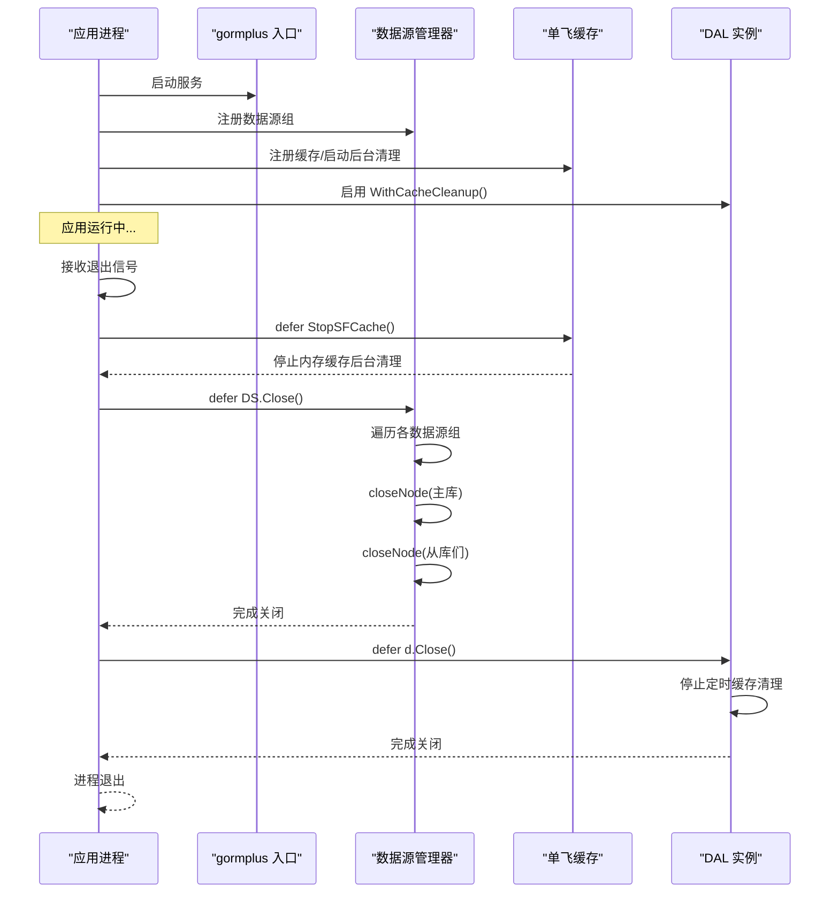
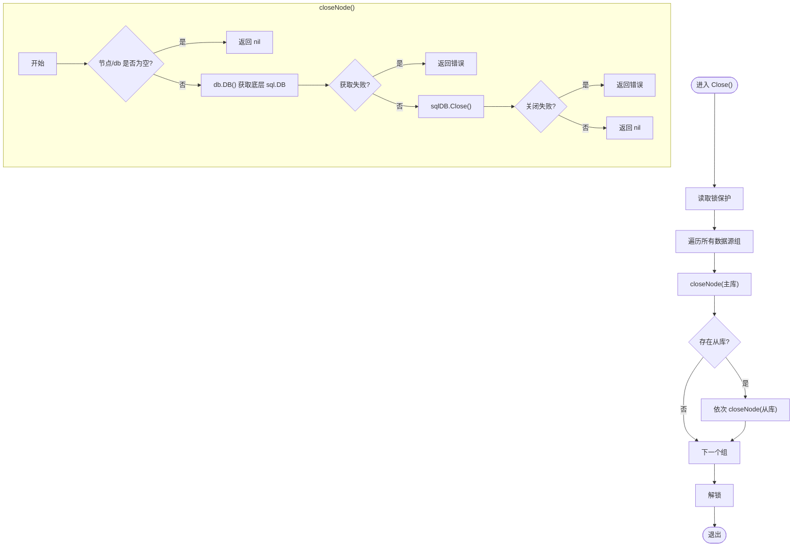
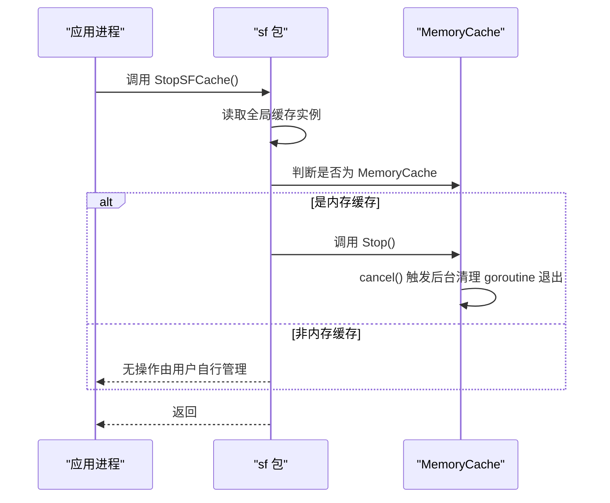
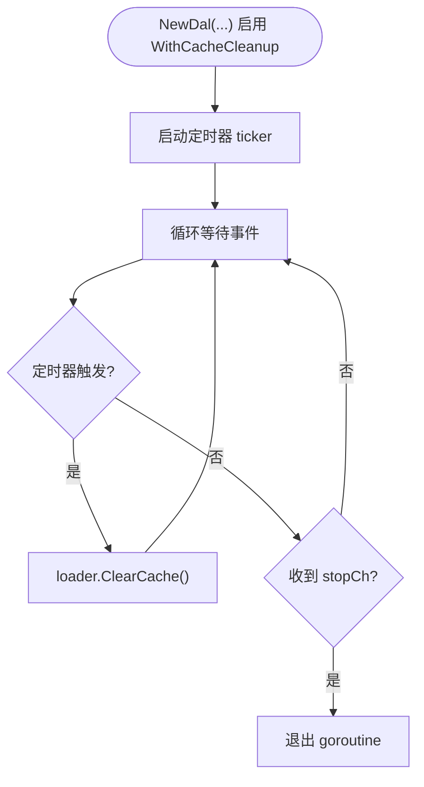
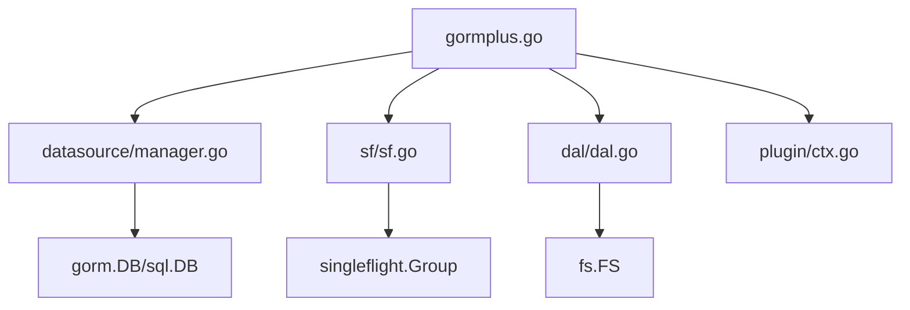

# 优雅关闭

<cite>
**本文引用的文件**
- [gormplus.go](file://gormplus.go)
- [manager.go](file://datasource/manager.go)
- [sf.go](file://sf/sf.go)
- [dal.go](file://dal/dal.go)
- [ctx.go](file://plugin/ctx.go)
- [version.go](file://version.go)
</cite>

## 目录
1. [简介](#简介)
2. [项目结构](#项目结构)
3. [核心组件](#核心组件)
4. [架构总览](#架构总览)
5. [详细组件分析](#详细组件分析)
6. [依赖关系分析](#依赖关系分析)
7. [性能考量](#性能考量)
8. [故障排查指南](#故障排查指南)
9. [结论](#结论)
10. [附录](#附录)

## 简介
本文件围绕“优雅关闭”主题，系统阐述 gorm-plus 在应用退出时如何安全地关闭所有数据源连接与后台资源，重点覆盖以下内容：
- Close() 方法的实现机制与调用时机
- closeNode() 函数如何处理单个节点的关闭过程（含错误处理与资源清理）
- 应用退出时的完整关闭流程示例（defer 语句的正确使用）
- 优雅关闭在微服务重启与部署中的重要性
- 长时间运行应用中平滑的数据库连接管理策略
- 优雅关闭与其他生命周期钩子的协调机制

## 项目结构
本项目采用模块化组织，与优雅关闭相关的关键模块包括：
- 数据源管理（datasource）：负责多数据源注册、读写分离、健康检查与优雅关闭
- 单飞缓存（sf）：提供 SingleFlight + 可插拔缓存能力，并在退出时停止后台清理 goroutine
- DAL：SQL 文件化访问层，支持后台缓存清理 goroutine，在退出时优雅停止
- 上层入口（gormplus）：对外暴露统一入口，提供 defer StopSFCache()、defer DS.Close() 的使用示例

```mermaid
graph TB
subgraph "应用入口"
GP["gormplus.go<br/>统一入口与示例"]
end
subgraph "数据源管理"
DM["datasource/manager.go<br/>Manager.Close()/closeNode()"]
end
subgraph "单飞缓存"
SF["sf/sf.go<br/>StopSFCache()/MemoryCache"]
end
subgraph "DAL"
DAL["dal/dal.go<br/>WithCacheCleanup()/Close()"]
end
subgraph "上下文工具"
CTX["plugin/ctx.go<br/>ctx 解析器"]
end
GP --> DM
GP --> SF
GP --> DAL
GP --> CTX
```

图表来源
- [gormplus.go](file://gormplus.go)
- [manager.go](file://datasource/manager.go)
- [sf.go](file://sf/sf.go)
- [dal.go](file://dal/dal.go)
- [ctx.go](file://plugin/ctx.go)

章节来源
- [gormplus.go:22-85](file://gormplus.go#L22-L85)
- [manager.go:432-442](file://datasource/manager.go#L432-L442)
- [sf.go:208-225](file://sf/sf.go#L208-L225)
- [dal.go:415-430](file://dal/dal.go#L415-L430)

## 核心组件
- 数据源管理器（Manager.Close）：遍历所有已注册的数据源组，逐个关闭主库与从库节点，确保连接池与底层连接被安全释放。
- 单飞缓存（StopSFCache）：停止内置内存缓存的后台过期清理 goroutine，避免资源泄漏。
- DAL（WithCacheCleanup/Close）：在启用定时缓存清理时，通过后台 goroutine 定期清空 SQL 缓存；退出时通过 Close() 停止该 goroutine。
- 上层入口（gormplus）：提供 defer StopSFCache()、defer DS.Close() 的使用示例，确保应用退出时按序清理。

章节来源
- [manager.go:432-442](file://datasource/manager.go#L432-L442)
- [manager.go:515-527](file://datasource/manager.go#L515-L527)
- [sf.go:208-225](file://sf/sf.go#L208-L225)
- [dal.go:415-430](file://dal/dal.go#L415-L430)
- [gormplus.go:82-84](file://gormplus.go#L82-L84)

## 架构总览
优雅关闭涉及两条主线：
- 数据源连接关闭：由 Manager.Close() 驱动，逐个节点调用 closeNode()，获取底层 sql.DB 并执行 Close()，同时捕获并返回错误。
- 后台资源清理：由 StopSFCache() 与 DAL.Close() 分别负责，前者停止内存缓存的清理循环，后者停止 SQL 缓存的定时清理循环。



图表来源
- [gormplus.go:82-84](file://gormplus.go#L82-L84)
- [manager.go:432-442](file://datasource/manager.go#L432-L442)
- [manager.go:515-527](file://datasource/manager.go#L515-L527)
- [sf.go:208-225](file://sf/sf.go#L208-L225)
- [dal.go:415-430](file://dal/dal.go#L415-L430)

## 详细组件分析

### 数据源管理器：Close() 与 closeNode()
- Close() 的职责
  - 读取锁保护下遍历所有已注册的数据源组
  - 对每个组先关闭主库，再依次关闭从库
  - 通过 closeNode() 获取底层 sql.DB 并执行 Close()，同时收集并返回错误
- closeNode() 的实现要点
  - 若节点为空或 gorm.DB 为空，直接返回（避免空指针）
  - 从 gorm.DB 中提取底层 sql.DB，若失败则返回错误
  - 调用 sql.DB.Close()，若失败则返回错误
  - 返回 nil 表示关闭成功



图表来源
- [manager.go:432-442](file://datasource/manager.go#L432-L442)
- [manager.go:515-527](file://datasource/manager.go#L515-L527)

章节来源
- [manager.go:432-442](file://datasource/manager.go#L432-L442)
- [manager.go:515-527](file://datasource/manager.go#L515-L527)

### 单飞缓存：StopSFCache() 与 MemoryCache
- StopSFCache() 的职责
  - 在全局缓存实例上判断是否为内置内存缓存
  - 若是，调用其 Stop() 停止后台清理 goroutine
  - 保证应用退出时不会残留后台任务
- MemoryCache 的后台清理
  - 启动时创建带取消的 context
  - 定时扫描过期键并删除，收到取消信号后退出循环



图表来源
- [sf.go:208-225](file://sf/sf.go#L208-L225)
- [sf.go:184-206](file://sf/sf.go#L184-L206)

章节来源
- [sf.go:208-225](file://sf/sf.go#L208-L225)
- [sf.go:184-206](file://sf/sf.go#L184-L206)

### DAL：WithCacheCleanup 与 Close()
- WithCacheCleanup
  - 在启用定时清理时，启动后台 goroutine，周期性调用 loader.ClearCache()
  - 通过 stopCh 控制 goroutine 生命周期
- Close()
  - 通过 select+default 模式安全关闭 stopCh，确保只关闭一次
  - 后台 goroutine 在收到 stopCh 后退出，避免资源泄漏



图表来源
- [dal.go:502-519](file://dal/dal.go#L502-L519)
- [dal.go:415-430](file://dal/dal.go#L415-L430)

章节来源
- [dal.go:502-519](file://dal/dal.go#L502-L519)
- [dal.go:415-430](file://dal/dal.go#L415-L430)

### 上层入口：gormplus 的优雅关闭示例
- gormplus 在示例中提供了 defer StopSFCache() 与 defer DS.Close() 的使用方式
- 建议在 main() 末尾按顺序 defer，确保先停止缓存后台任务，再关闭数据源连接

章节来源
- [gormplus.go:82-84](file://gormplus.go#L82-L84)

## 依赖关系分析
- gormplus 作为统一入口，聚合了数据源管理、单飞缓存、DAL 等能力
- datasource/manager.go 依赖 gorm.DB 与 sql.DB，负责连接池与底层连接的生命周期管理
- sf/sf.go 依赖 golang.org/x/sync/singleflight，提供缓存与清理 goroutine 的生命周期控制
- dal/dal.go 依赖 gorm.DB 与 fs.FS，提供 SQL 缓存与清理 goroutine 的生命周期控制
- plugin/ctx.go 提供上下文解析器，间接影响数据源在中间件场景下的行为一致性



图表来源
- [gormplus.go](file://gormplus.go)
- [manager.go](file://datasource/manager.go)
- [sf.go](file://sf/sf.go)
- [dal.go](file://dal/dal.go)
- [ctx.go](file://plugin/ctx.go)

章节来源
- [gormplus.go](file://gormplus.go)
- [manager.go](file://datasource/manager.go)
- [sf.go](file://sf/sf.go)
- [dal.go](file://dal/dal.go)
- [ctx.go](file://plugin/ctx.go)

## 性能考量
- 连接池参数：datasource/manager.go 提供默认连接池参数（MaxOpen、MaxIdle、MaxLifetime、MaxIdleTime），建议结合业务并发与数据库性能进行调优
- 缓存清理频率：DAL 的 WithCacheCleanup 与 sf 的内存缓存清理 goroutine 都是后台任务，建议根据业务规模与内存占用合理设置清理周期
- 优雅关闭顺序：先停止后台清理 goroutine，再关闭数据源连接，避免在清理过程中访问已关闭的连接

章节来源
- [manager.go:163-169](file://datasource/manager.go#L163-L169)
- [manager.go:492-513](file://datasource/manager.go#L492-L513)
- [sf.go:189-206](file://sf/sf.go#L189-L206)
- [dal.go:502-519](file://dal/dal.go#L502-L519)

## 故障排查指南
- 数据源关闭失败
  - 检查 closeNode() 返回的错误信息，定位具体节点标签（如 "default:master" 或 "default:slave0"）
  - 确认 gorm.DB.DB() 能否成功获取底层 sql.DB
- 缓存清理 goroutine 未退出
  - 确认是否调用了 StopSFCache()（仅对内置内存缓存有效）
  - 确认是否调用了 d.Close()（针对 DAL 的 SQL 缓存清理）
- 优雅关闭顺序不当
  - 若先关闭数据源再停止缓存清理，可能导致清理 goroutine 访问已关闭连接
  - 建议遵循：defer StopSFCache() -> defer DS.Close() -> defer d.Close()

章节来源
- [manager.go:515-527](file://datasource/manager.go#L515-L527)
- [sf.go:208-225](file://sf/sf.go#L208-L225)
- [dal.go:415-430](file://dal/dal.go#L415-L430)

## 结论
gorm-plus 的优雅关闭通过“先停止后台清理、再关闭数据源连接”的顺序，确保应用在退出时不会遗留 goroutine 或悬挂连接。数据源管理器的 Close() 与 closeNode() 提供了细粒度的节点关闭能力，单飞缓存与 DAL 的关闭流程分别覆盖了缓存与 SQL 缓存的清理。结合 defer 语句的正确使用，可在微服务重启与部署中实现平滑、可靠的停机过程。

## 附录
- 版本信息：v1.0.13
- 使用示例（来自 gormplus 入口）：在 main() 末尾添加 defer StopSFCache() 与 defer DS.Close()

章节来源
- [version.go:3](file://version.go#L3)
- [gormplus.go:82-84](file://gormplus.go#L82-L84)