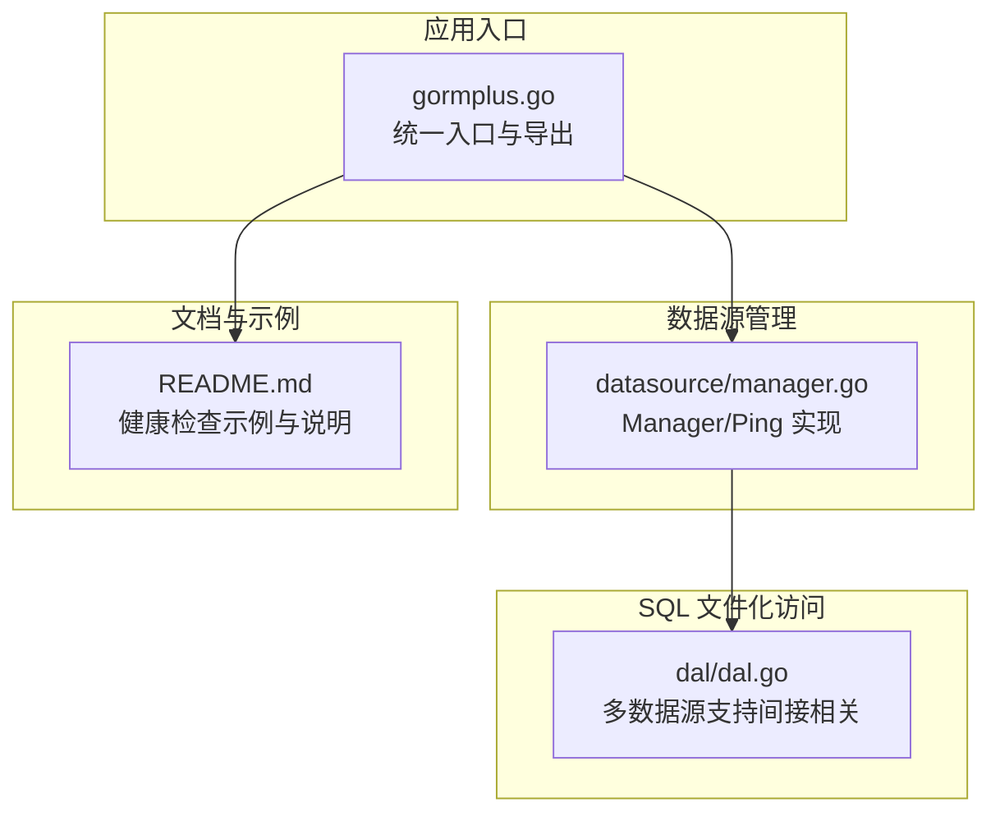
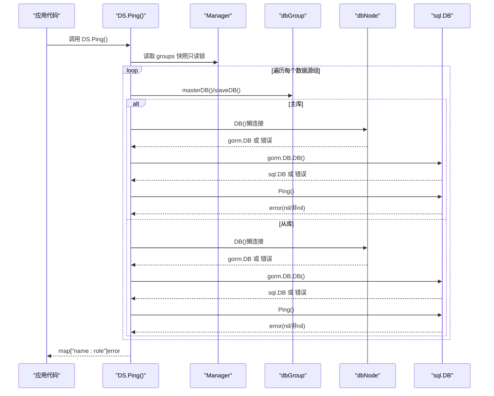
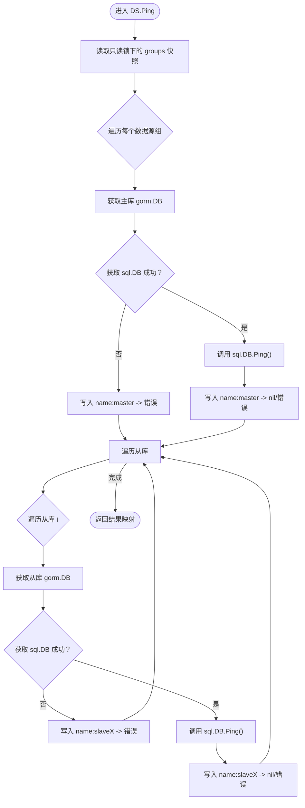
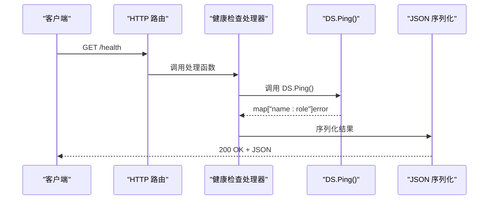
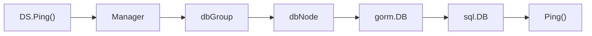

# 健康检查

<cite>
**本文引用的文件**
- [gormplus.go](file://gormplus.go)
- [README.md](file://README.md)
- [datasource/manager.go](file://datasource/manager.go)
- [dal/dal.go](file://dal/dal.go)
</cite>

## 目录
1. [简介](#简介)
2. [项目结构](#项目结构)
3. [核心组件](#核心组件)
4. [架构总览](#架构总览)
5. [详细组件分析](#详细组件分析)
6. [依赖分析](#依赖分析)
7. [性能考虑](#性能考虑)
8. [故障排查指南](#故障排查指南)
9. [结论](#结论)
10. [附录](#附录)

## 简介
本文件围绕健康检查功能进行系统化技术文档整理，重点解释 Ping() 方法的工作原理与实现机制，覆盖以下内容：
- 如何检查所有数据源节点的连通性（主库与从库）
- 健康检查返回的映射格式与键命名规则
- 在 Web 应用中集成 /health 接口的完整示例
- 健康检查结果的解读方法（区分数据源故障与网络问题）
- 健康检查的频率建议与监控告警配置
- 在微服务架构中的应用场景与最佳实践

## 项目结构
本项目采用模块化组织，健康检查能力位于多数据源管理模块中，通过全局管理器统一对外暴露。关键文件与职责如下：
- gormplus.go：统一入口，导出全局数据源管理器 DS，并提供初始化与插件注册等能力
- datasource/manager.go：多数据源管理器实现，包含 Ping() 健康检查方法
- README.md：包含健康检查使用示例与说明
- dal/dal.go：SQL 文件化访问层，与健康检查无直接关系，但体现多数据源支持

图表来源
- [gormplus.go:155-214](file://gormplus.go#L155-L214)
- [datasource/manager.go:394-430](file://datasource/manager.go#L394-L430)
- [README.md:212-215](file://README.md#L212-L215)
- [dal/dal.go:13](file://dal/dal.go#L13)

章节来源
- [gormplus.go:155-214](file://gormplus.go#L155-L214)
- [datasource/manager.go:394-430](file://datasource/manager.go#L394-L430)
- [README.md:212-215](file://README.md#L212-L215)
- [dal/dal.go:13](file://dal/dal.go#L13)

## 核心组件
- 全局数据源管理器 DS：通过 gormplus.DS 暴露，支持注册命名数据源组（一主多从）、自动读写分离、上下文切换、健康检查与优雅关闭
- Ping() 方法：遍历所有已注册数据源组，逐个检查主库与从库的连通性，返回键为“数据源名:角色”的映射，值为 error（nil 表示健康）

章节来源
- [gormplus.go:155-214](file://gormplus.go#L155-L214)
- [datasource/manager.go:394-430](file://datasource/manager.go#L394-L430)
- [README.md:212-215](file://README.md#L212-L215)

## 架构总览
健康检查在多数据源管理器内部完成，流程如下：
- 读取已注册数据源组快照（只读锁保护）
- 对每个数据源组：
  - 获取主库 gorm.DB，尝试获取底层 sql.DB 并调用 Ping()
  - 对每个从库重复上述步骤
- 返回“数据源名:角色”到 error 的映射

图表来源
- [datasource/manager.go:394-430](file://datasource/manager.go#L394-L430)
- [datasource/manager.go:222-225](file://datasource/manager.go#L222-L225)
- [datasource/manager.go:236-242](file://datasource/manager.go#L236-L242)

## 详细组件分析

### Ping() 方法工作原理与实现机制
- 输入：无
- 输出：map[string]error
  - 键格式：“数据源名:角色”，其中角色为 master 或 slaveX（X 为从库索引）
  - 值为 error：nil 表示健康，非 nil 表示异常
- 实现要点：
  - 使用只读锁快照当前已注册的数据源组，避免并发写入影响
  - 主库与从库均通过 dbNode.DB() 懒连接，首次访问时才建立连接
  - 通过 gorm.DB.DB() 获取底层 sql.DB，再调用 sql.DB.Ping() 进行连通性探测
  - 从库采用轮询策略（在读取时），但健康检查时逐个 Ping，确保覆盖所有从库

图表来源
- [datasource/manager.go:394-430](file://datasource/manager.go#L394-L430)

章节来源
- [datasource/manager.go:394-430](file://datasource/manager.go#L394-L430)

### 健康检查返回映射格式与键命名规则
- 键格式：name:role
  - name：数据源名称（注册时使用的名称）
  - role：master 或 slaveX（X 为从库索引，从 0 开始）
- 值：error
  - nil：表示该节点健康
  - 非 nil：表示该节点不可用（可能是连接失败、认证失败、网络不通等）

章节来源
- [datasource/manager.go:394-430](file://datasource/manager.go#L394-L430)

### /health 接口集成完整示例（Web 应用）
以下为在常见 Web 框架中集成 /health 的思路与步骤（以 Gin 为例，其他框架类似）：
- 在应用启动时注册数据源（参考 README 中的示例）
- 在路由中添加 /health 路由，调用 gormplus.DS.Ping()，将结果序列化为 JSON 返回
- 健康检查结果解读：
  - 若所有节点的 error 均为 nil，则整体健康
  - 若存在非 nil，需根据键定位具体数据源与角色，结合日志与监控告警定位问题

图表来源
- [README.md:212-215](file://README.md#L212-L215)
- [datasource/manager.go:394-430](file://datasource/manager.go#L394-L430)

章节来源
- [README.md:212-215](file://README.md#L212-L215)
- [datasource/manager.go:394-430](file://datasource/manager.go#L394-L430)

### 健康检查结果解读方法
- 全部为 nil：服务健康
- 存在非 nil：
  - 若 name:master 为非 nil：主库不可用，检查主库连接串、认证、网络连通性、数据库状态
  - 若 name:slaveX 为非 nil：从库不可用，检查从库连接串、网络连通性、从库状态
  - 若多个从库均不可用：可能存在网络分区或从库配置问题
- 结合日志与监控：
  - 将 DS.Ping() 的结果写入应用日志，便于审计
  - 将非 nil 的节点映射作为告警指标，触发告警

章节来源
- [datasource/manager.go:394-430](file://datasource/manager.go#L394-L430)

### 健康检查频率建议与监控告警配置
- 频率建议：
  - 服务端探活：每 10–30 秒一次，避免过于频繁造成数据库压力
  - 客户端探活：每 30–60 秒一次，结合业务流量与 SLA
- 告警配置：
  - 告警级别：严重（主库不可用）、警告（从库不可用）
  - 告警条件：任一节点 error 非 nil
  - 告警收敛：同节点连续失败多次后再触发，避免抖动
  - 告警通知：邮件/IM/电话，包含节点键（name:role）与错误摘要

[本节为通用建议，不直接分析具体文件]

### 微服务架构中的应用场景与最佳实践
- 应用场景：
  - 容器编排平台（Kubernetes）的 readiness/liveness 探针
  - API 网关与服务网格的健康检查
  - 多数据源微服务（如订单库、用户库、分析库）的独立健康检查
- 最佳实践：
  - 将 /health 与业务路由分离，避免健康检查影响业务性能
  - 对主库与从库分别设置不同的探活阈值与告警策略
  - 在多数据源场景下，对每个数据源组单独暴露健康检查端点或在统一端点中返回各组状态
  - 与服务注册与发现联动，自动摘除不健康实例

[本节为通用建议，不直接分析具体文件]

## 依赖分析
- DS.Ping() 依赖：
  - Manager 内部的只读锁保护，保证快照一致性
  - dbNode 的懒连接机制，首次访问才建立连接
  - gorm.DB.DB() 获取底层 sql.DB，再调用 sql.DB.Ping()

图表来源
- [datasource/manager.go:394-430](file://datasource/manager.go#L394-L430)
- [datasource/manager.go:222-225](file://datasource/manager.go#L222-L225)
- [datasource/manager.go:236-242](file://datasource/manager.go#L236-L242)

章节来源
- [datasource/manager.go:394-430](file://datasource/manager.go#L394-L430)
- [datasource/manager.go:222-225](file://datasource/manager.go#L222-L225)
- [datasource/manager.go:236-242](file://datasource/manager.go#L236-L242)

## 性能考虑
- 懒连接：Ping() 仅在需要时建立连接，避免启动时阻塞
- 并发安全：使用只读锁快照数据源组，避免写操作干扰
- 负载均衡：从库采用轮询策略，Ping() 会逐一探测，确保覆盖所有从库
- 建议：
  - 控制健康检查频率，避免对数据库造成压力
  - 对主库与从库分别设置合理的超时与重试策略

[本节为通用建议，不直接分析具体文件]

## 故障排查指南
- 常见问题与定位：
  - 主库不可用：检查主库连接串、认证信息、网络连通性、数据库状态
  - 从库不可用：检查从库连接串、网络连通性、从库状态
  - 数据源未注册：确认 DS.Register() 是否被调用，以及数据源名称是否正确
- 日志与监控：
  - 将 DS.Ping() 的结果写入应用日志，便于审计与回溯
  - 将非 nil 的节点映射作为告警指标，触发告警

章节来源
- [datasource/manager.go:394-430](file://datasource/manager.go#L394-L430)

## 结论
- DS.Ping() 提供了对多数据源主从节点的统一健康检查能力，返回“数据源名:角色”到 error 的映射
- 在 Web 应用中，可通过 /health 接口暴露健康检查结果，结合日志与监控实现自动化运维
- 在微服务架构中，建议对主库与从库分别设置探活策略与告警，确保快速发现问题并恢复

[本节为总结，不直接分析具体文件]

## 附录
- 参考示例：README 中提供了 DS.Ping() 的使用示例与返回格式说明
- 多数据源支持：dal/dal.go 中体现了多数据源支持，健康检查与之协同工作

章节来源
- [README.md:212-215](file://README.md#L212-L215)
- [dal/dal.go:13](file://dal/dal.go#L13)