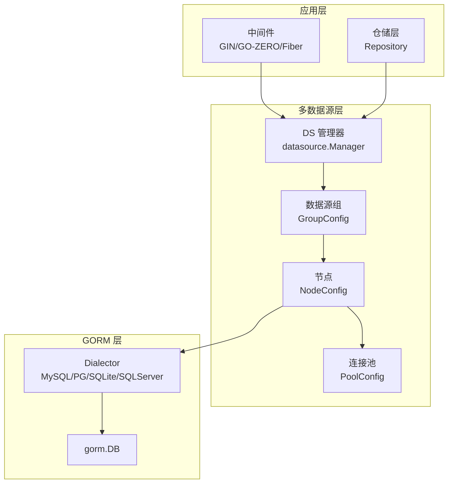
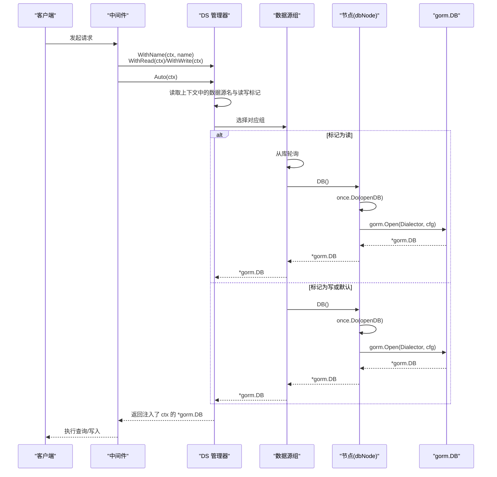
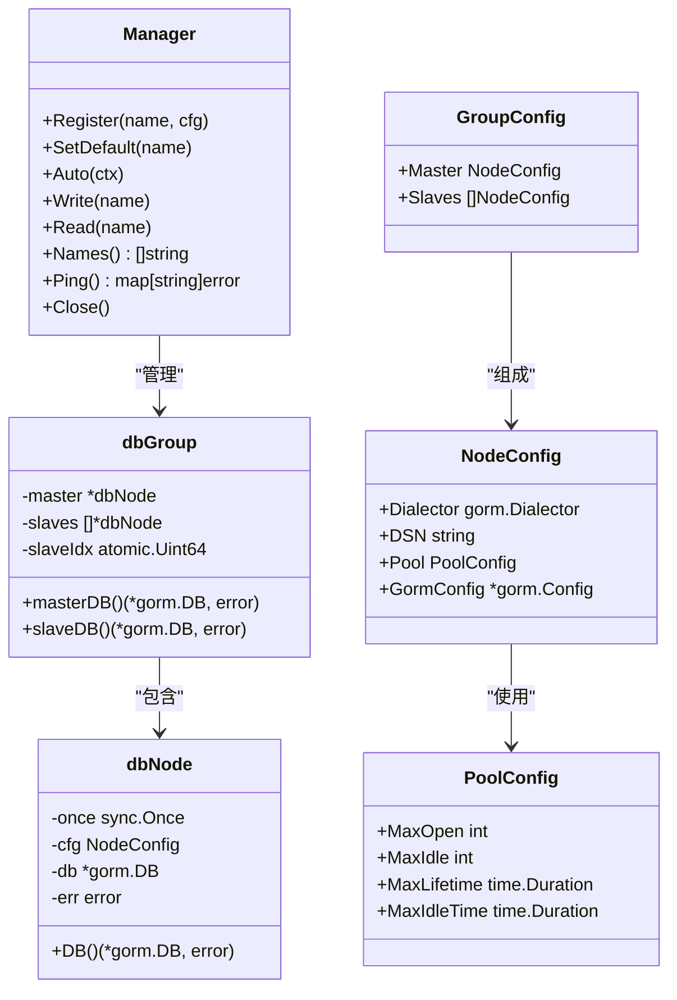
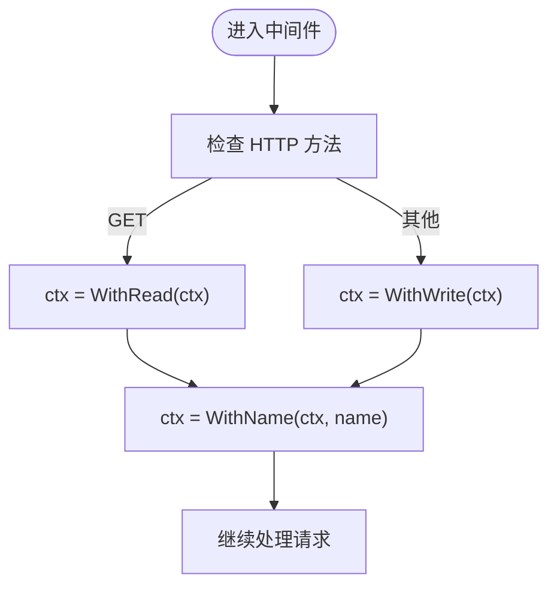
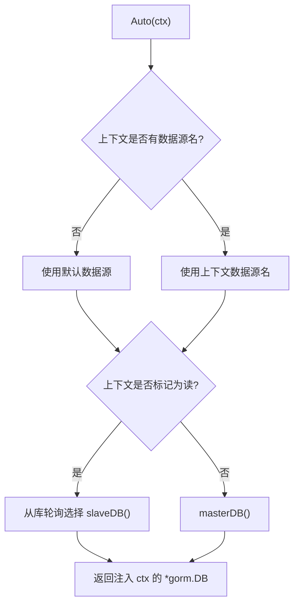
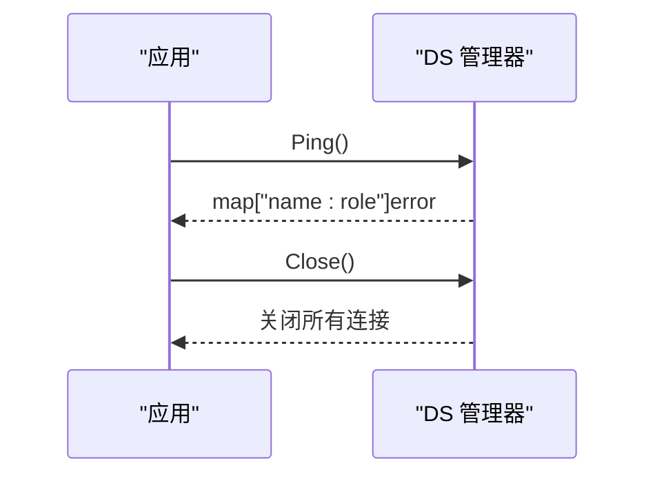
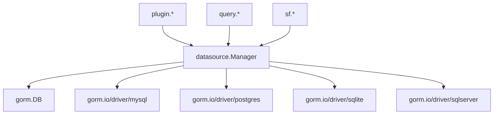

# 多数据源管理

<cite>
**本文档引用的文件**
- [gormplus.go](file://gormplus.go)
- [manager.go](file://datasource/manager.go)
- [dal.go](file://dal/dal.go)
- [ctx.go](file://plugin/ctx.go)
- [tenant.go](file://plugin/tenant.go)
- [dataPermission.go](file://plugin/dataPermission.go)
- [autoOperator.go](file://plugin/autoOperator.go)
- [query_builder.go](file://query/query_builder.go)
- [slow_query.go](file://query/slow_query.go)
- [generator.go](file://generator/generator.go)
- [sf.go](file://sf/sf.go)
- [dal_test.go](file://dal/dal_test.go)
</cite>

## 目录
1. [简介](#简介)
2. [项目结构](#项目结构)
3. [核心组件](#核心组件)
4. [架构总览](#架构总览)
5. [详细组件分析](#详细组件分析)
6. [依赖分析](#依赖分析)
7. [性能考虑](#性能考虑)
8. [故障排查指南](#故障排查指南)
9. [结论](#结论)
10. [附录](#附录)

## 简介
本技术文档围绕多数据源管理模块展开，系统阐述其设计理念、架构实现与使用方法。模块支持一主多从、读写分离、上下文自动切换、连接池配置、健康检查、运行时热注册与优雅关闭等能力，并提供与中间件集成的最佳实践。文档同时涵盖与不同数据库驱动的兼容性、故障转移与容错处理、性能优化与监控指标等内容。

## 项目结构
多数据源管理位于 datasource 包，通过 gormplus 包对外暴露统一入口。核心文件包括：
- datasource/manager.go：多数据源管理器、数据源组配置、读写选择与上下文工具
- gormplus.go：对外 API 暴露，包含 DS 全局管理器、上下文工具、驱动兼容说明
- dal/dal.go：DAL 层对多数据源的支持（通过 WithDB 注入不同实例）
- plugin/*：上下文解析、多租户、数据权限等插件，与多数据源协同工作
- query/*：慢查询监控插件，可与多数据源配合使用
- sf/*：SingleFlight + 可插拔缓存，用于查询去抖与缓存一致性
- generator/*：代码生成器，支持多数据源场景下的模型与仓库生成

图表来源
- [gormplus.go:127-214](file://gormplus.go#L127-L214)
- [manager.go:246-277](file://datasource/manager.go#L246-L277)
- [manager.go:205-211](file://datasource/manager.go#L205-L211)
- [manager.go:173-203](file://datasource/manager.go#L173-L203)
- [manager.go:151-169](file://datasource/manager.go#L151-L169)

章节来源
- [gormplus.go:127-214](file://gormplus.go#L127-L214)
- [manager.go:246-277](file://datasource/manager.go#L246-L277)

## 核心组件
- 多数据源管理器（Manager）：负责数据源组的注册、默认数据源设置、自动切换、显式读写选择、健康检查与优雅关闭
- 数据源组配置（GroupConfig）：定义一主多从的配置结构
- 节点配置（NodeConfig）：定义单个节点的 Dialector、DSN、连接池与 gorm 配置
- 连接池配置（PoolConfig）：支持 MaxOpen、MaxIdle、MaxLifetime、MaxIdleTime
- 上下文工具：WithName、WithRead、WithWrite、IsRead、IsWrite，用于中间件与业务层协作
- 健康检查（Ping）：对主从节点进行连通性检查
- 优雅关闭（Close）：关闭所有连接

章节来源
- [manager.go:246-277](file://datasource/manager.go#L246-L277)
- [manager.go:205-211](file://datasource/manager.go#L205-L211)
- [manager.go:173-203](file://datasource/manager.go#L173-L203)
- [manager.go:151-169](file://datasource/manager.go#L151-L169)
- [manager.go:539-579](file://datasource/manager.go#L539-L579)

## 架构总览
多数据源管理采用“懒连接 + 线程安全”的设计：
- 懒连接：首次调用 Write/Read/Auto 时才打开连接，避免启动阻塞
- 线程安全：使用互斥锁保护数据源组注册与访问
- 自动切换：通过 context 读取数据源名与读写标记，自动选择主库或从库
- 从库轮询：从库列表使用原子计数器实现简单轮询
- 运行时热注册：支持运行时注册新的数据源组
- 健康检查：Ping 返回 map["name:role"]error，便于 /health 接口使用

图表来源
- [manager.go:288-332](file://datasource/manager.go#L288-L332)
- [manager.go:234-242](file://datasource/manager.go#L234-L242)
- [manager.go:222-225](file://datasource/manager.go#L222-L225)
- [manager.go:456-490](file://datasource/manager.go#L456-L490)

章节来源
- [manager.go:288-332](file://datasource/manager.go#L288-L332)
- [manager.go:234-242](file://datasource/manager.go#L234-L242)
- [manager.go:222-225](file://datasource/manager.go#L222-L225)
- [manager.go:456-490](file://datasource/manager.go#L456-L490)

## 详细组件分析

### 数据源注册与配置
- 注册流程：通过 Register(name, GroupConfig) 注册数据源组，支持运行时热注册
- 默认数据源：第一个注册的数据源自动成为默认数据源，Auto 在上下文无数据源名时使用
- 节点配置：NodeConfig 支持 Dialector（推荐）与 DSN（向后兼容，内部默认 MySQL 驱动）
- 连接池：PoolConfig 支配 MaxOpen、MaxIdle、MaxLifetime、MaxIdleTime，默认值为生产推荐

图表来源
- [manager.go:246-277](file://datasource/manager.go#L246-L277)
- [manager.go:227-242](file://datasource/manager.go#L227-L242)
- [manager.go:205-211](file://datasource/manager.go#L205-L211)
- [manager.go:173-203](file://datasource/manager.go#L173-L203)
- [manager.go:151-169](file://datasource/manager.go#L151-L169)

章节来源
- [manager.go:258-277](file://datasource/manager.go#L258-L277)
- [manager.go:279-284](file://datasource/manager.go#L279-L284)
- [manager.go:173-203](file://datasource/manager.go#L173-L203)
- [manager.go:151-169](file://datasource/manager.go#L151-L169)

### 上下文工具与中间件集成
- WithName：将数据源名写入上下文，Auto 会读取它
- WithRead/WithWrite：标记读/写意图，Auto 会据此选择从库或主库
- IsRead/IsWrite：判断上下文中读写标记
- 中间件最佳实践：GET 请求标记为读，其他请求标记为写；固定数据源或按业务动态切换

图表来源
- [manager.go:539-579](file://datasource/manager.go#L539-L579)

章节来源
- [manager.go:539-579](file://datasource/manager.go#L539-L579)

### 从库轮询与读写分离
- 从库轮询：使用原子计数器对从库列表进行轮询，无从库时回退到主库
- 读写分离：Auto 根据上下文读写标记自动选择节点；显式调用 Write/Read 可强制指定

图表来源
- [manager.go:288-332](file://datasource/manager.go#L288-L332)
- [manager.go:234-242](file://datasource/manager.go#L234-L242)
- [manager.go:234-238](file://datasource/manager.go#L234-L238)

章节来源
- [manager.go:288-332](file://datasource/manager.go#L288-L332)
- [manager.go:234-242](file://datasource/manager.go#L234-L242)

### 健康检查与优雅关闭
- 健康检查：Ping 返回 map["name:role"]error，支持 /health 接口
- 优雅关闭：Close 关闭所有数据源连接，应用退出时调用

图表来源
- [manager.go:394-430](file://datasource/manager.go#L394-L430)
- [manager.go:432-442](file://datasource/manager.go#L432-L442)

章节来源
- [manager.go:394-430](file://datasource/manager.go#L394-L430)
- [manager.go:432-442](file://datasource/manager.go#L432-L442)

### 与 DAL 的协同
- DAL 支持多数据源：通过 WithDB(ctx, dal) 将不同 DAL 实例注入上下文，后续所有 dal 调用自动使用该实例
- 与 DS 的结合：可在中间件中同时设置数据源名、读写标记与 DAL 实例，实现“多数据源 + 读写分离 + 自动切换”

章节来源
- [dal.go:432-448](file://dal/dal.go#L432-L448)
- [dal.go:450-461](file://dal/dal.go#L450-L461)

### 与插件的协同
- 上下文解析：plugin.RegisterCtxResolver 解决 Gin 等框架上下文差异，确保插件能从 Request.Context 读取中间件写入的数据
- 多租户与数据权限：通过 WithTenantID、WithDataPermission 等写入上下文，插件在回调中自动注入条件；与 DS 的 WithName/WithRead/WithWrite 协同工作

章节来源
- [ctx.go:16-43](file://plugin/ctx.go#L16-L43)
- [tenant.go:570-610](file://plugin/tenant.go#L570-L610)
- [dataPermission.go:80-91](file://plugin/dataPermission.go#L80-L91)

### 与慢查询监控的协同
- 慢查询插件通过 gorm 回调在 SQL 执行前后记录耗时，可与 DS 的 Auto/Write/Read 返回的 *gorm.DB 协同使用
- 支持自定义 Logger，便于接入链路追踪与告警系统

章节来源
- [slow_query.go:104-109](file://query/slow_query.go#L104-L109)
- [slow_query.go:163-234](file://query/slow_query.go#L163-L234)

## 依赖分析
- 外部依赖：gorm.io/gorm、gorm.io/driver/*（MySQL/PostgreSQL/SQLite/SQLServer 通过 Dialector 传入，不内置依赖）
- 内部依赖：plugin/*（上下文解析、多租户、数据权限）、query/*（慢查询监控）、sf/*（SingleFlight + 缓存）

图表来源
- [manager.go:462-478](file://datasource/manager.go#L462-L478)
- [gormplus.go:136-149](file://gormplus.go#L136-L149)

章节来源
- [manager.go:462-478](file://datasource/manager.go#L462-L478)
- [gormplus.go:136-149](file://gormplus.go#L136-L149)

## 性能考虑
- 连接池参数建议（生产）：MaxOpen≈CPU×4~8、MaxIdle≈MaxOpen/2、MaxLifetime<MySQL wait_timeout、MaxIdleTime 适中
- 从库轮询：简单轮询满足大多数场景；若需权重或健康度，可在上层扩展
- 懒连接：减少启动时间与资源占用
- 健康检查：定期 Ping，及时发现不可用节点
- 缓存与去抖：结合 sf 包的 SF/SFWithTTL/SFNoCache/SFInvalidate，降低热点查询压力并保证一致性

章节来源
- [manager.go:163-169](file://datasource/manager.go#L163-L169)
- [manager.go:492-513](file://datasource/manager.go#L492-L513)
- [sf.go:237-349](file://sf/sf.go#L237-L349)

## 故障排查指南
- 未找到数据源名：检查中间件是否正确调用 WithName，或设置默认数据源
- 未注册数据源：调用 DS.Names() 查看已注册列表，确认名称拼写
- 连接失败：检查 Dialector/DSN 配置与驱动导入；确认 Ping 返回的错误定位具体节点
- 读写标记冲突：确认中间件是否正确区分 GET 与其他方法；避免在读标记下执行写操作
- 上下文解析问题：Gin 项目需注册 ctx 解析器，确保插件能从 Request.Context 读取数据

章节来源
- [manager.go:288-332](file://datasource/manager.go#L288-L332)
- [manager.go:444-452](file://datasource/manager.go#L444-L452)
- [manager.go:394-430](file://datasource/manager.go#L394-L430)
- [ctx.go:16-43](file://plugin/ctx.go#L16-L43)

## 结论
多数据源管理模块通过懒连接、线程安全、自动切换与健康检查等机制，提供了稳定可靠的多数据源能力。结合中间件的上下文工具、DAL 的实例注入、插件的条件注入以及慢查询监控与缓存去抖，可满足生产环境对性能、可观测性与一致性的综合需求。

## 附录

### 使用示例（初始化与中间件）
- 初始化：注册 DS，配置主从节点与连接池
- 中间件：按请求方法设置读写标记，按业务设置数据源名
- 仓储：使用 DS.Auto(ctx) 获取 DB，或显式 DS.Write/Read

章节来源
- [gormplus.go:22-84](file://gormplus.go#L22-L84)
- [manager.go:26-81](file://datasource/manager.go#L26-L81)
- [manager.go:82-137](file://datasource/manager.go#L82-L137)

### 与不同数据库驱动的兼容性
- 通过 NodeConfig.Dialector 明确指定驱动，支持 MySQL、PostgreSQL、SQLite、SQL Server 等
- DSN 方式已标注弃用，建议改用 Dialector

章节来源
- [manager.go:173-203](file://datasource/manager.go#L173-L203)
- [manager.go:462-478](file://datasource/manager.go#L462-L478)

### 代码生成器与多数据源
- generator 支持多数据源场景下的模型与仓库生成，可配置输出路径与模板

章节来源
- [generator.go:1-80](file://generator/generator.go#L1-L80)