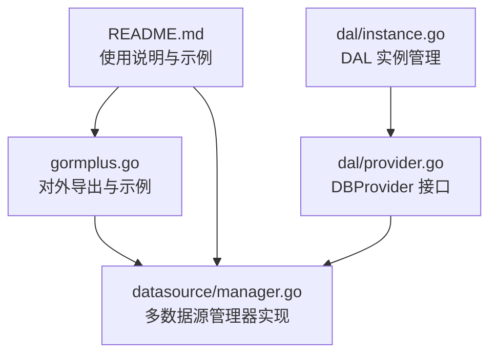
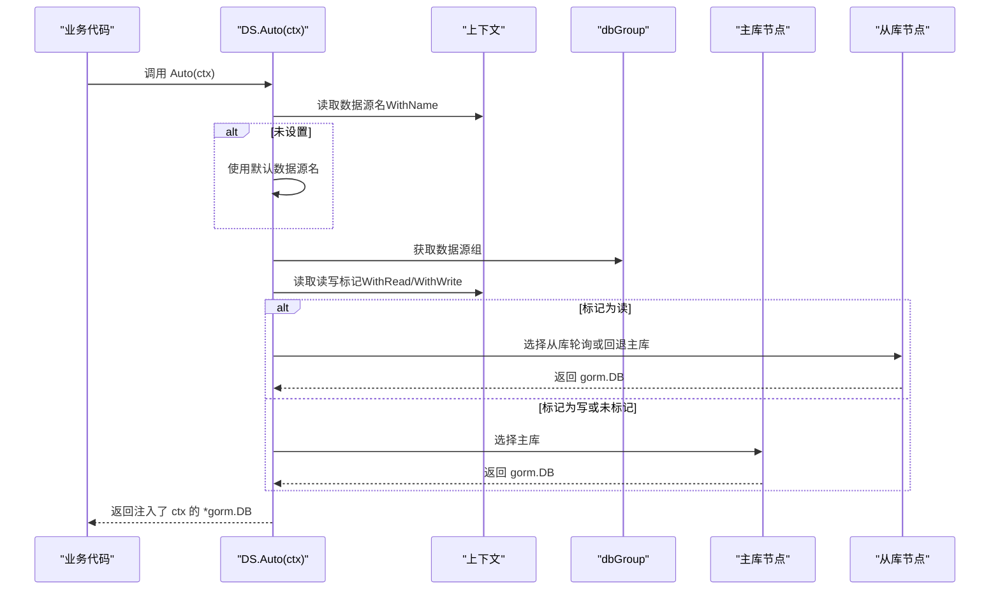
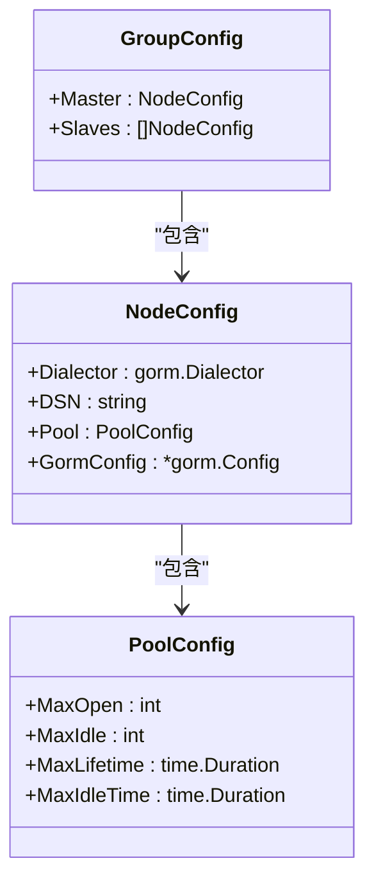
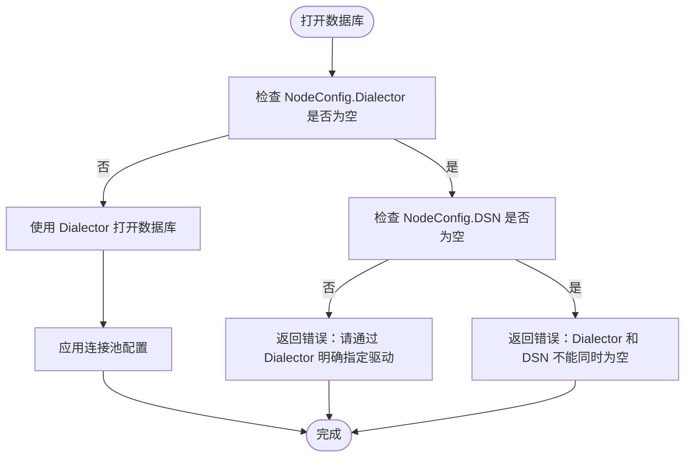
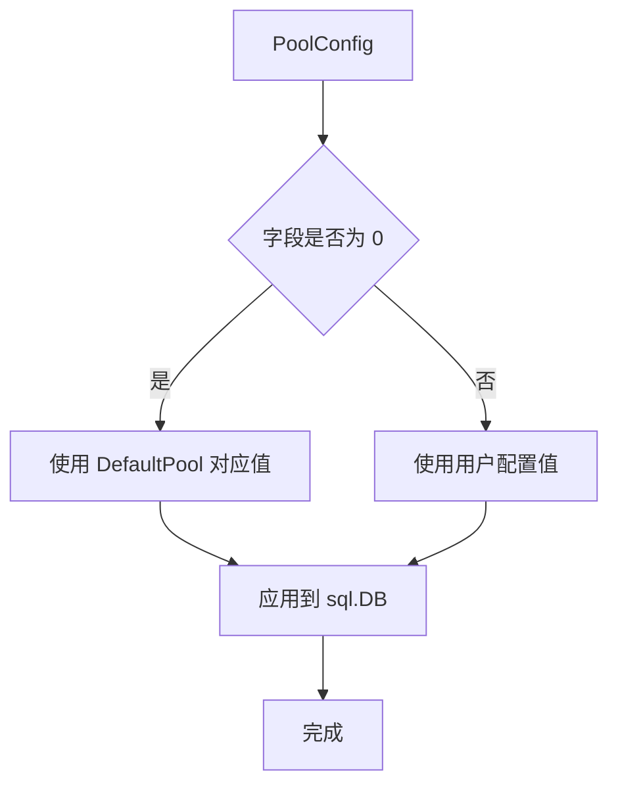
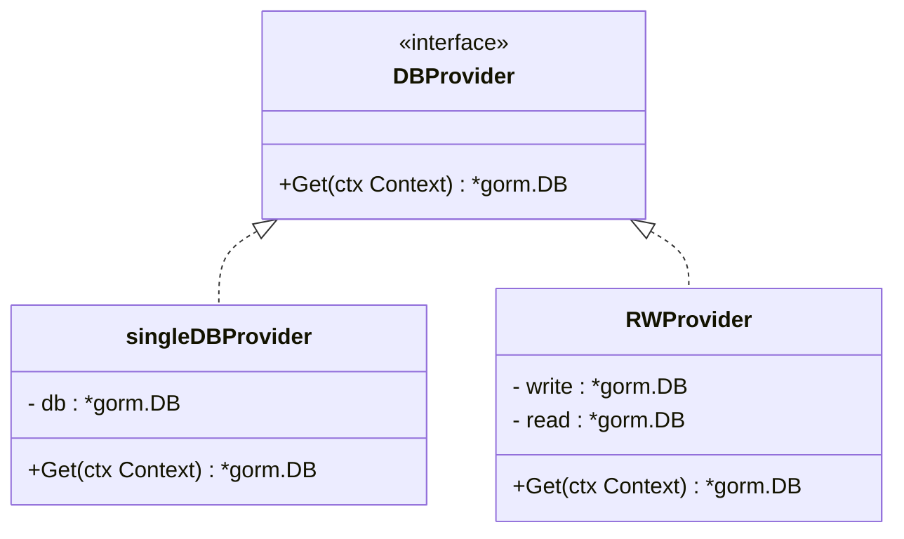
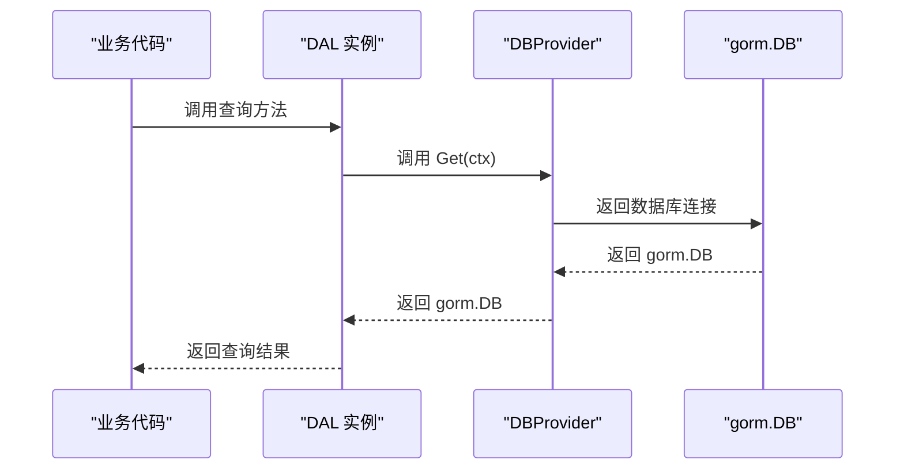
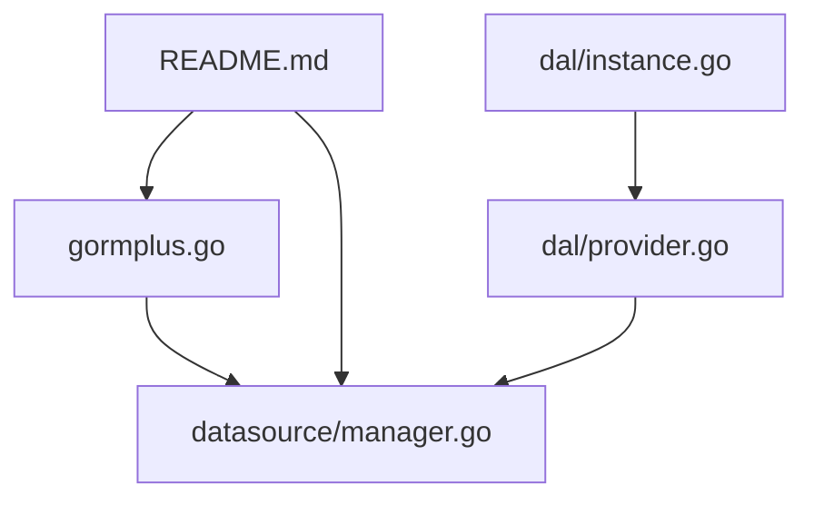

# 数据源配置

<cite>
**本文引用的文件**
- [gormplus.go](file://gormplus.go)
- [gormplus_datasource.go](file://gormplus_datasource.go)
- [datasource/manager.go](file://datasource/manager.go)
- [dal/provider.go](file://dal/provider.go)
- [dal/instance.go](file://dal/instance.go)
- [README.md](file://README.md)
</cite>

## 更新摘要
**变更内容**
- 新增 provider 系统架构分析，展示连接管理和路由能力的增强
- 更新数据源管理器的自动切换机制说明
- 增强多数据源配置的最佳实践指导
- 完善 DBProvider 接口的设计理念和使用场景

## 目录
1. [简介](#简介)
2. [项目结构](#项目结构)
3. [核心组件](#核心组件)
4. [架构概览](#架构概览)
5. [详细组件分析](#详细组件分析)
6. [Provider 系统增强](#provider-系统增强)
7. [依赖分析](#依赖分析)
8. [性能考虑](#性能考虑)
9. [故障排查指南](#故障排查指南)
10. [结论](#结论)
11. [附录](#附录)

## 简介
本章节聚焦"数据源配置"主题，系统性阐述 gorm-plus 多数据源管理模块的注册机制、配置选项与最佳实践。重点包括：
- 数据源组与节点的结构体定义与职责
- 主库与从库的配置方法
- Dialector 驱动配置与 DSN 兼容模式的差异
- 连接池 PoolConfig 的参数与推荐值
- 不同数据库驱动（MySQL、PostgreSQL、SQLite、SQL Server）的配置示例
- 默认连接池 DefaultPool 的生产环境推荐参数
- 配置验证与错误处理机制
- **新增**：Provider 系统提供的连接管理和路由能力增强

## 项目结构
数据源配置位于 gorm-plus 的 datasource 子模块，对外通过 gormplus 包进行统一导出与使用。关键文件与职责如下：
- gormplus.go：对外导出类型别名与全局管理器 DS，并提供示例与说明
- datasource/manager.go：多数据源管理器实现，包含注册、自动切换、读写分离、健康检查、连接池应用等核心逻辑
- **新增**：dal/provider.go：DBProvider 接口定义，提供统一的数据库访问抽象
- **新增**：dal/instance.go：DAL 实例管理，支持自定义 Provider 的多数据源场景
- README.md：官方使用说明与示例，涵盖多数据源注册、中间件标记读写、Repository 层获取 DB 等



**图表来源**
- [gormplus.go:129-214](file://gormplus.go#L129-L214)
- [manager.go:15-148](file://datasource/manager.go#L15-L148)
- [provider.go:13-33](file://dal/provider.go#L13-L33)
- [instance.go:17-31](file://dal/instance.go#L17-L31)
- [README.md:139-216](file://README.md#L139-L216)

**章节来源**
- [gormplus.go:129-214](file://gormplus.go#L129-L214)
- [manager.go:15-148](file://datasource/manager.go#L15-L148)
- [provider.go:13-33](file://dal/provider.go#L13-L33)
- [instance.go:17-31](file://dal/instance.go#L17-L31)
- [README.md:139-216](file://README.md#L139-L216)

## 核心组件
- 数据源管理器 DS：全局多数据源管理器，支持一主多从、读写分离、上下文自动切换、健康检查与优雅关闭
- 数据源组 GroupConfig：描述一个数据源组（一主多从）
- 数据源节点 NodeConfig：描述单个数据库节点（包含 Dialector、DSN、Pool、GormConfig）
- 连接池 PoolConfig：描述连接池参数（MaxOpen、MaxIdle、MaxLifetime、MaxIdleTime）
- 默认连接池 DefaultPool：生产推荐的默认连接池参数
- **新增**：DBProvider 接口：统一的数据库访问抽象，支持单库、多库、读写分离、多租户、分库分表等场景
- **新增**：DAL 实例：支持自定义 Provider 的多数据源场景，提供透明的数据源切换能力

上述组件在 gormplus.go 中以类型别名形式对外暴露，便于业务侧直接使用。

**章节来源**
- [gormplus.go:129-153](file://gormplus.go#L129-L153)
- [manager.go:151-211](file://datasource/manager.go#L151-L211)
- [manager.go:163-169](file://datasource/manager.go#L163-L169)
- [provider.go:13-33](file://dal/provider.go#L13-L33)
- [instance.go:17-31](file://dal/instance.go#L17-L31)

## 架构概览
多数据源管理器通过"命名数据源组"的方式组织主库与从库，结合上下文标记实现自动读写分离与数据源选择。新增的 Provider 系统提供了更灵活的连接管理和路由能力。其核心流程如下：



**图表来源**
- [manager.go:288-323](file://datasource/manager.go#L288-L323)
- [manager.go:539-578](file://datasource/manager.go#L539-L578)

**章节来源**
- [manager.go:288-323](file://datasource/manager.go#L288-L323)
- [manager.go:539-578](file://datasource/manager.go#L539-L578)

## 详细组件分析

### 数据源组与节点结构体
- GroupConfig：包含 Master（必需）与 Slaves（可选，为空时读操作回退到主库）
- NodeConfig：包含 Dialector（推荐）、DSN（向后兼容，不推荐）、Pool（连接池配置）、GormConfig（gorm 配置）



**图表来源**
- [manager.go:205-211](file://datasource/manager.go#L205-L211)
- [manager.go:173-203](file://datasource/manager.go#L173-L203)
- [manager.go:151-161](file://datasource/manager.go#L151-L161)

**章节来源**
- [manager.go:205-211](file://datasource/manager.go#L205-L211)
- [manager.go:173-203](file://datasource/manager.go#L173-L203)
- [manager.go:151-161](file://datasource/manager.go#L151-L161)

### 主库与从库配置方法
- 主库：GroupConfig.Master 必填，推荐通过 NodeConfig.Dialector 明确指定驱动
- 从库：GroupConfig.Slaves 可为空；若为空，读操作将回退到主库
- 注册：通过 DS.Register(name, GroupConfig) 完成，支持运行时热注册

**章节来源**
- [manager.go:205-211](file://datasource/manager.go#L205-L211)
- [manager.go:258-277](file://datasource/manager.go#L258-L277)

### Dialector 驱动配置与 DSN 兼容模式
- Dialector 优先：NodeConfig.Dialector 优先使用，支持任意 gorm 驱动（MySQL、PostgreSQL、SQLite、SQL Server 等）
- DSN 兼容：若 Dialector 为空，将尝试使用 DSN；但不再内置 MySQL 驱动依赖，需显式传入 Dialector
- 错误提示：当 DSN 非空而 Dialector 为空时，会返回明确的错误提示，引导用户改用 Dialector



**图表来源**
- [manager.go:456-490](file://datasource/manager.go#L456-L490)

**章节来源**
- [manager.go:456-490](file://datasource/manager.go#L456-L490)

### 连接池配置 PoolConfig 详解
- MaxOpen：最大开放连接数，建议 CPU×4~8，0 时使用默认值 50
- MaxIdle：最大空闲连接数，建议 MaxOpen/2，0 时使用默认值 10
- MaxLifetime：连接最大存活时间，须小于 MySQL wait_timeout（默认 8h），0 时使用默认值 30min
- MaxIdleTime：空闲连接最大存活时间，0 时使用默认值 10min
- 应用逻辑：openDB 时将 PoolConfig 与 DefaultPool 合并，然后调用 sql.DB 的 SetMaxOpenConns/SetMaxIdleConns/SetConnMaxLifetime/SetConnMaxIdleTime



**图表来源**
- [manager.go:492-513](file://datasource/manager.go#L492-L513)
- [manager.go:163-169](file://datasource/manager.go#L163-L169)

**章节来源**
- [manager.go:151-161](file://datasource/manager.go#L151-L161)
- [manager.go:492-513](file://datasource/manager.go#L492-L513)
- [manager.go:163-169](file://datasource/manager.go#L163-L169)

### 默认连接池 DefaultPool 的生产推荐参数
- MaxOpen：50
- MaxIdle：10
- MaxLifetime：30 分钟
- MaxIdleTime：10 分钟
- 适用场景：生产环境推荐值，可根据业务并发与数据库资源做微调

**章节来源**
- [manager.go:163-169](file://datasource/manager.go#L163-L169)

### 不同数据库驱动的配置示例
以下示例展示如何为不同数据库驱动配置数据源组（MySQL、PostgreSQL、SQLite、SQL Server）。示例来源于 gormplus.go 与 README.md 的注释与示例代码。

- MySQL（一主两从）
  - 主库与从库均通过 NodeConfig.Dialector 指定驱动与 DSN
  - 可为每个节点单独配置 Pool
- PostgreSQL
  - 主库通过 NodeConfig.Dialector 指定驱动与 DSN
- SQLite（测试场景）
  - 主库通过 NodeConfig.Dialector 指定驱动与 DSN（如 ":memory:"）
- SQL Server
  - 主库通过 NodeConfig.Dialector 指定驱动与 DSN

**章节来源**
- [gormplus.go:159-182](file://gormplus.go#L159-L182)
- [manager.go:30-74](file://datasource/manager.go#L30-L74)
- [README.md:145-177](file://README.md#L145-L177)

### 配置验证与错误处理机制
- 注册校验：Register(name, cfg) 时，若 Master.Dialector 与 Master.DSN 同时为空，将 panic 提示必须配置 Dialector 或 DSN
- 打开数据库：openDB 时若 Dialector 为空且 DSN 也为空，返回错误；若仅 DSN 非空，返回明确的错误提示，引导用户改用 Dialector
- Auto(ctx)：若上下文未设置数据源名且未设置默认数据源，返回错误；若数据源未注册，返回错误
- Ping：遍历所有数据源节点，逐个执行 Ping 并返回映射结果
- Close：遍历所有数据源节点，逐个关闭底层 sql.DB

```mermaid
flowchart TD
Start(["注册数据源"]) --> CheckMaster["校验 Master.Dialector 与 Master.DSN"]
CheckMaster --> |均为空| Panic["panic：必须配置 Dialector 或 DSN"]
CheckMaster --> |至少一个非空| OK["注册成功"]
subgraph 打开数据库
O1["openDB(cfg)"] --> O2{"Dialector 是否为空"}
O2 --> |否| O3["gorm.Open(Dialector, gormCfg)"]
O2 --> |是| O4{"DSN 是否为空"}
O4 --> |否| O5["返回错误：请通过 Dialector 明确指定驱动"]
O4 --> |是| O6["返回错误：Dialector 和 DSN 不能同时为空"]
O3 --> O7["应用连接池配置"]
end
subgraph Auto(ctx)
A1["读取数据源名"] --> A2{"是否存在"}
A2 --> |否| A3["返回错误：未找到数据源名且未设置默认数据源"]
A2 --> |是| A4["读取读写标记"]
A4 --> |读| A5["选择从库轮询或回退主库"]
A4 --> |写/未标记| A6["选择主库"]
end
```

**图表来源**
- [manager.go:258-277](file://datasource/manager.go#L258-L277)
- [manager.go:456-490](file://datasource/manager.go#L456-L490)
- [manager.go:288-323](file://datasource/manager.go#L288-L323)

**章节来源**
- [manager.go:258-277](file://datasource/manager.go#L258-L277)
- [manager.go:456-490](file://datasource/manager.go#L456-L490)
- [manager.go:288-323](file://datasource/manager.go#L288-L323)

## Provider 系统增强

### DBProvider 接口设计
**新增** DBProvider 接口提供了统一的数据库访问抽象，支持多种数据源场景：



**图表来源**
- [provider.go:13-33](file://dal/provider.go#L13-L33)

### Provider 系统优势
- **统一抽象**：通过 DBProvider 接口抽象不同数据源的访问方式
- **灵活路由**：支持读写分离、多租户、分库分表等复杂路由场景
- **透明切换**：DAL 层通过 Provider 实现数据源的透明切换
- **扩展性强**：易于扩展新的数据源类型和路由策略

### DAL 实例与 Provider 集成
**新增** DAL 实例支持自定义 Provider，提供完整的多数据源解决方案：



**图表来源**
- [instance.go:256-259](file://dal/instance.go#L256-L259)
- [provider.go:25-33](file://dal/provider.go#L25-L33)

**章节来源**
- [provider.go:13-33](file://dal/provider.go#L13-L33)
- [instance.go:256-259](file://dal/instance.go#L256-L259)

## 依赖分析
- gormplus 包通过类型别名将 datasource 包中的 Manager、GroupConfig、NodeConfig、PoolConfig、DefaultPool 暴露给业务使用
- datasource/manager.go 依赖 gorm 与 gorm logger，负责数据库连接、连接池应用、健康检查与优雅关闭
- **新增**：dal/provider.go 定义了 DBProvider 接口，为多数据源场景提供统一的抽象层
- **新增**：dal/instance.go 实现了 DAL 实例管理，支持自定义 Provider 的多数据源场景
- README.md 提供使用示例与最佳实践，指导业务如何注册数据源、中间件标记读写以及在 Repository 层获取 DB



**图表来源**
- [gormplus.go:88-101](file://gormplus.go#L88-L101)
- [manager.go:3-13](file://datasource/manager.go#L3-L13)
- [provider.go:1-13](file://dal/provider.go#L1-L13)
- [instance.go:1-15](file://dal/instance.go#L1-L15)
- [README.md:139-216](file://README.md#L139-L216)

**章节来源**
- [gormplus.go:88-101](file://gormplus.go#L88-L101)
- [manager.go:3-13](file://datasource/manager.go#L3-L13)
- [provider.go:1-13](file://dal/provider.go#L1-L13)
- [instance.go:1-15](file://dal/instance.go#L1-L15)
- [README.md:139-216](file://README.md#L139-L216)

## 性能考虑
- 连接池参数建议遵循 DefaultPool 的生产推荐值，并根据业务并发与数据库资源做微调
- MaxOpen 建议为 CPU×4~8，MaxIdle 建议为 MaxOpen/2
- MaxLifetime 建议小于 MySQL wait_timeout（默认 8h），避免连接被数据库回收导致抖动
- MaxIdleTime 建议与 MaxLifetime 协调，避免空闲连接过多占用资源
- 读写分离与从库轮询可有效分摊读压力，但需确保主从延迟可控
- **新增**：Provider 系统的连接复用和路由优化可进一步提升性能表现

## 故障排查指南
- 注册失败：检查 GroupConfig.Master.Dialector 或 DSN 是否配置，避免两者同时为空
- 打开数据库失败：确认 Dialector 正确导入并传入；若仅配置 DSN，将收到明确的错误提示
- Auto(ctx) 失败：确认已在中间件中通过 WithName 设置数据源名，或设置默认数据源；确认数据源已注册
- 健康检查：使用 DS.Ping() 查看各节点状态，定位连接问题
- 优雅关闭：应用退出时调用 DS.Close()，确保释放所有数据库连接
- **新增**：Provider 相关问题：检查 DBProvider 实现是否正确，确保 Get(ctx) 方法返回有效的 gorm.DB

**章节来源**
- [manager.go:258-277](file://datasource/manager.go#L258-L277)
- [manager.go:456-490](file://datasource/manager.go#L456-L490)
- [manager.go:288-323](file://datasource/manager.go#L288-L323)
- [manager.go:394-430](file://datasource/manager.go#L394-L430)
- [manager.go:432-442](file://datasource/manager.go#L432-L442)

## 结论
gorm-plus 的数据源配置以"命名数据源组 + 上下文自动切换 + 连接池独立配置"为核心设计，既保证了灵活性（支持任意 gorm 驱动），又提供了生产友好的默认值与完善的错误处理。**新增的 Provider 系统进一步增强了连接管理和路由能力，通过 DBProvider 接口提供了统一的抽象层，支持读写分离、多租户、分库分表等多种复杂场景。**通过明确的 Dialector 配置与 DefaultPool 推荐参数，可在保证稳定性的同时获得良好的性能表现。

## 附录
- 使用示例与最佳实践可参考 gormplus.go 与 README.md 中的注释与示例代码
- 多数据源注册、中间件标记读写、Repository 层获取 DB 的完整流程可参考 README.md 的"多数据源管理"章节
- **新增**：Provider 系统的详细使用指南可参考 dal/provider.go 和 dal/instance.go 的实现

**章节来源**
- [gormplus.go:159-182](file://gormplus.go#L159-L182)
- [README.md:139-216](file://README.md#L139-L216)
- [provider.go:13-33](file://dal/provider.go#L13-L33)
- [instance.go:87-125](file://dal/instance.go#L87-L125)