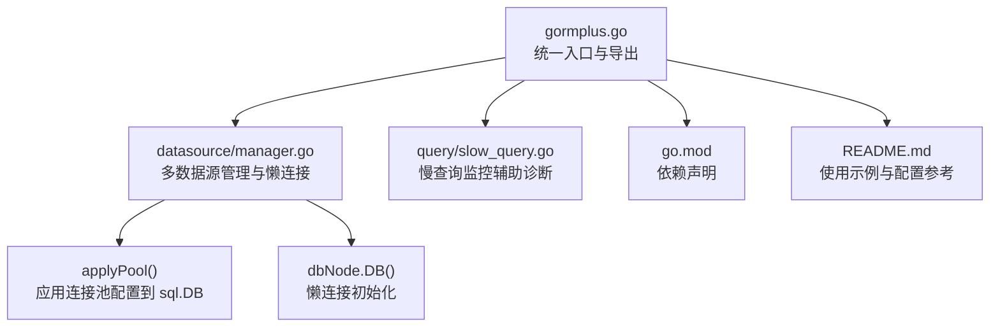
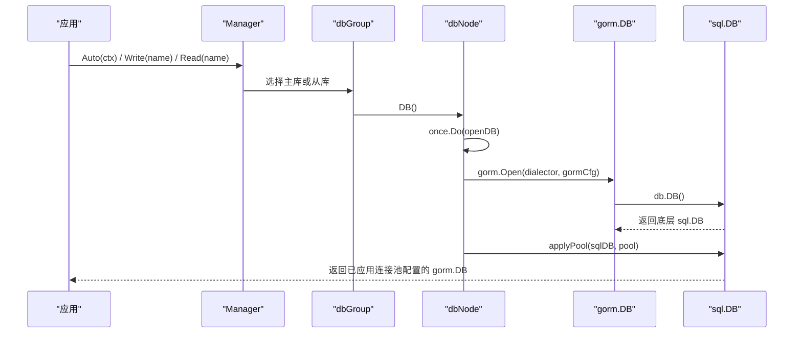
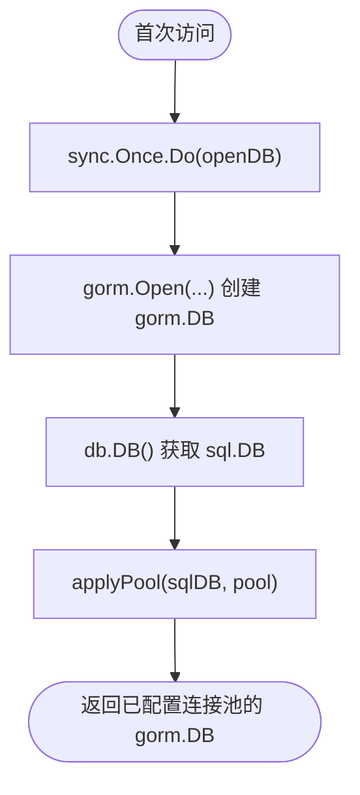
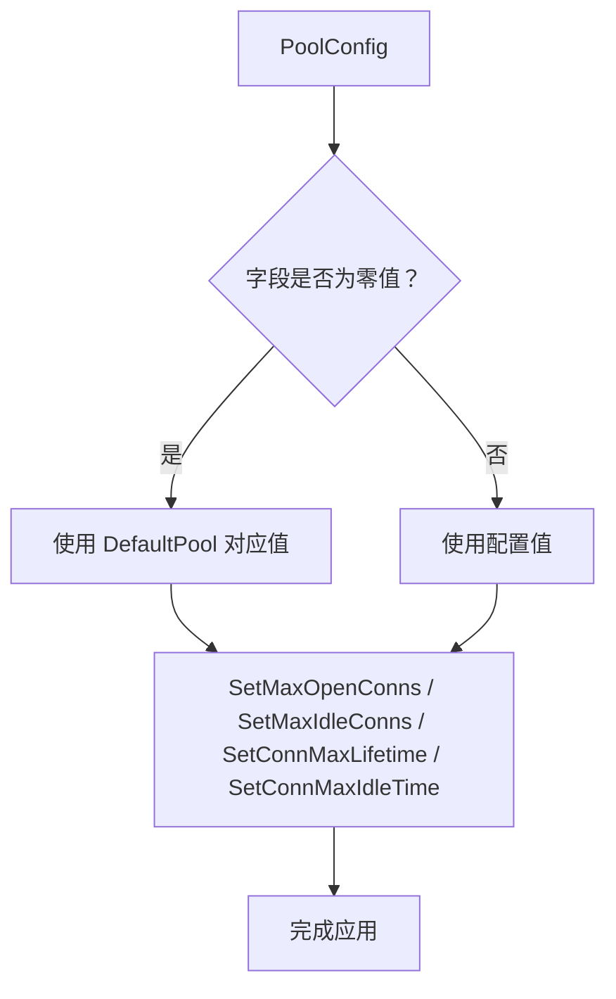

# 连接池管理

<cite>
**本文引用的文件**
- [gormplus.go](file://gormplus.go)
- [datasource/manager.go](file://datasource/manager.go)
- [query/slow_query.go](file://query/slow_query.go)
- [go.mod](file://go.mod)
- [README.md](file://README.md)
</cite>

## 目录
1. [简介](#简介)
2. [项目结构](#项目结构)
3. [核心组件](#核心组件)
4. [架构总览](#架构总览)
5. [详细组件分析](#详细组件分析)
6. [依赖分析](#依赖分析)
7. [性能考量](#性能考量)
8. [故障排查指南](#故障排查指南)
9. [结论](#结论)
10. [附录](#附录)

## 简介
本技术文档围绕连接池管理展开，重点解释懒连接机制的实现原理与优势、连接池配置参数的作用与调优建议、applyPool() 如何将配置应用到底层 sql.DB、生产环境的最佳实践、连接池与数据库性能的关系、以及监控与故障排查方法。文档内容严格基于仓库源码与示例，确保技术细节准确可靠。

## 项目结构
本项目采用模块化组织，连接池相关能力集中在多数据源管理模块中，通过懒连接与独立的连接池配置，实现“首次读写时才建立连接”的策略，并在底层通过 gorm.DB.DB() 获取 sql.DB 并应用连接池参数。

图表来源
- [gormplus.go:129-153](file://gormplus.go#L129-L153)
- [datasource/manager.go:149-169](file://datasource/manager.go#L149-L169)
- [datasource/manager.go:492-513](file://datasource/manager.go#L492-L513)
- [datasource/manager.go:222-225](file://datasource/manager.go#L222-L225)
- [query/slow_query.go:91-109](file://query/slow_query.go#L91-L109)
- [go.mod:1-26](file://go.mod#L1-26)
- [README.md:140-216](file://README.md#L140-L216)

章节来源
- [gormplus.go:129-153](file://gormplus.go#L129-L153)
- [datasource/manager.go:149-169](file://datasource/manager.go#L149-L169)
- [datasource/manager.go:492-513](file://datasource/manager.go#L492-L513)
- [datasource/manager.go:222-225](file://datasource/manager.go#L222-L225)
- [query/slow_query.go:91-109](file://query/slow_query.go#L91-L109)
- [go.mod:1-26](file://go.mod#L1-26)
- [README.md:140-216](file://README.md#L140-L216)

## 核心组件
- 连接池配置结构：PoolConfig，包含 MaxOpen、MaxIdle、MaxLifetime、MaxIdleTime 四个字段，零值时使用默认值 DefaultPool。
- 懒连接节点：dbNode，通过 sync.Once 在首次访问时打开数据库连接，避免启动阻塞。
- 应用函数：applyPool()，将 PoolConfig 的配置应用到底层 sql.DB。
- 多数据源管理器：Manager，负责注册数据源组、自动切换（读写/从库轮询）、健康检查与优雅关闭。

章节来源
- [datasource/manager.go:151-161](file://datasource/manager.go#L151-L161)
- [datasource/manager.go:163-169](file://datasource/manager.go#L163-L169)
- [datasource/manager.go:215-225](file://datasource/manager.go#L215-L225)
- [datasource/manager.go:492-513](file://datasource/manager.go#L492-L513)
- [datasource/manager.go:246-251](file://datasource/manager.go#L246-L251)

## 架构总览
连接池管理的整体流程如下：应用启动时仅注册数据源组，不立即建立连接；当业务首次发起读写请求时，dbNode.DB() 通过 sync.Once 打开连接；openDB() 创建 gorm.DB 后，调用 applyPool() 将 PoolConfig 应用到 sql.DB，从而实现懒连接与连接池配置的解耦。

图表来源
- [datasource/manager.go:288-323](file://datasource/manager.go#L288-L323)
- [datasource/manager.go:234-242](file://datasource/manager.go#L234-L242)
- [datasource/manager.go:222-225](file://datasource/manager.go#L222-L225)
- [datasource/manager.go:456-490](file://datasource/manager.go#L456-L490)
- [datasource/manager.go:492-513](file://datasource/manager.go#L492-L513)

## 详细组件分析

### 懒连接机制
- 实现原理
  - dbNode 使用 sync.Once 保证连接只在首次访问时打开。
  - openDB() 在创建 gorm.DB 后，通过 db.DB() 获取底层 sql.DB，并调用 applyPool() 应用连接池配置。
- 优势
  - 启动时不阻塞，降低冷启动时间。
  - 仅在真实请求到达时才占用数据库连接资源，减少不必要的连接占用。
  - 与多数据源结合，支持按需初始化各数据源节点。

图表来源
- [datasource/manager.go:222-225](file://datasource/manager.go#L222-L225)
- [datasource/manager.go:456-490](file://datasource/manager.go#L456-L490)
- [datasource/manager.go:492-513](file://datasource/manager.go#L492-L513)

章节来源
- [datasource/manager.go:215-225](file://datasource/manager.go#L215-L225)
- [datasource/manager.go:456-490](file://datasource/manager.go#L456-L490)
- [datasource/manager.go:492-513](file://datasource/manager.go#L492-L513)

### 连接池配置参数详解
- MaxOpen（最大开放连接数）
  - 作用：限制数据库连接池中同时存在的连接上限。
  - 默认值：DefaultPool.MaxOpen = 50。
  - 调优建议：CPU 核心数 × 4 ~ 8；高并发写入场景适当提高，避免连接不足导致排队。
- MaxIdle（最大空闲连接数）
  - 作用：限制连接池中空闲连接的最大数量。
  - 默认值：DefaultPool.MaxIdle = 10。
  - 调优建议：建议 MaxOpen/2；避免过多空闲连接造成资源浪费。
- MaxLifetime（连接最大存活时间）
  - 作用：连接在池中允许存活的最长时间，到期后会被回收。
  - 默认值：DefaultPool.MaxLifetime = 30 分钟。
  - 调优建议：应小于数据库 wait_timeout；避免连接老化导致超时。
- MaxIdleTime（空闲连接最大存活时间）
  - 作用：空闲连接在池中的最长存活时间，到期后被回收。
  - 默认值：DefaultPool.MaxIdleTime = 10 分钟。
  - 调优建议：根据业务空闲周期设置，平衡资源占用与连接重建成本。

章节来源
- [datasource/manager.go:151-161](file://datasource/manager.go#L151-L161)
- [datasource/manager.go:163-169](file://datasource/manager.go#L163-L169)

### applyPool() 应用连接池配置
- 作用：将 PoolConfig 的四个参数应用到底层 sql.DB。
- 实现要点：
  - 零值字段使用 DefaultPool 对应值。
  - 通过 sql.DB.SetMaxOpenConns、SetMaxIdleConns、SetConnMaxLifetime、SetConnMaxIdleTime 设置。
- 适用范围：在 openDB() 成功创建 gorm.DB 后调用，确保每个数据源节点的连接池配置生效。

图表来源
- [datasource/manager.go:492-513](file://datasource/manager.go#L492-L513)
- [datasource/manager.go:163-169](file://datasource/manager.go#L163-L169)

章节来源
- [datasource/manager.go:492-513](file://datasource/manager.go#L492-L513)
- [datasource/manager.go:163-169](file://datasource/manager.go#L163-L169)

### 生产环境最佳实践
- 默认推荐值
  - MaxOpen = 50；MaxIdle = 10；MaxLifetime = 30 分钟；MaxIdleTime = 10 分钟。
- 不同负载场景建议
  - 低并发读多写少：适当降低 MaxOpen，增大 MaxIdle，延长 MaxIdleTime。
  - 高并发写入：提高 MaxOpen，缩短 MaxLifetime 以避免连接老化。
  - 长事务/批处理：适度提高 MaxLifetime，避免频繁重建连接。
- 与数据库参数协同
  - MaxLifetime 应小于数据库 wait_timeout，避免连接被数据库回收导致异常。
- 多数据源场景
  - 为每个数据源组单独配置 PoolConfig，避免共享连接池导致互相影响。
- 与慢查询监控配合
  - 使用慢查询插件定位慢 SQL，结合连接池参数优化数据库端索引与查询计划。

章节来源
- [datasource/manager.go:163-169](file://datasource/manager.go#L163-L169)
- [query/slow_query.go:91-109](file://query/slow_query.go#L91-L109)
- [README.md:140-216](file://README.md#L140-L216)

### 连接池与数据库性能的关系
- 连接池直接影响数据库的并发承载能力与资源占用。
- 合理的 MaxOpen 可避免连接不足导致的排队与超时。
- 合理的 MaxIdle/MaxIdleTime 可减少空闲连接占用，降低数据库压力。
- 合理的 MaxLifetime 可避免连接老化引发的超时与重连开销。
- 与数据库 wait_timeout 协同，避免连接被数据库回收导致的抖动。

章节来源
- [datasource/manager.go:151-161](file://datasource/manager.go#L151-L161)
- [datasource/manager.go:163-169](file://datasource/manager.go#L163-L169)

## 依赖分析
- gorm-plus 通过 gorm.Open 创建 gorm.DB，再通过 db.DB() 获取底层 sql.DB，最终调用 applyPool() 应用连接池配置。
- README 提供了多数据源注册与连接池配置的示例，便于快速上手。

图表来源
- [datasource/manager.go:456-490](file://datasource/manager.go#L456-L490)
- [datasource/manager.go:492-513](file://datasource/manager.go#L492-L513)
- [README.md:140-216](file://README.md#L140-L216)

章节来源
- [datasource/manager.go:456-490](file://datasource/manager.go#L456-L490)
- [datasource/manager.go:492-513](file://datasource/manager.go#L492-L513)
- [README.md:140-216](file://README.md#L140-L216)

## 性能考量
- 启动性能：懒连接避免启动时阻塞，缩短冷启动时间。
- 运行时性能：合理的连接池参数可减少连接争用与超时，提升吞吐。
- 资源占用：通过 MaxIdle 与 MaxIdleTime 控制空闲连接，避免资源浪费。
- 数据库侧协同：MaxLifetime 小于 wait_timeout，避免连接被数据库回收。

章节来源
- [datasource/manager.go:19-24](file://datasource/manager.go#L19-L24)
- [datasource/manager.go:163-169](file://datasource/manager.go#L163-L169)

## 故障排查指南
- 连接池参数不当
  - 症状：连接不足导致排队、超时；空闲连接过多导致资源浪费。
  - 排查：检查 MaxOpen、MaxIdle、MaxLifetime、MaxIdleTime 的设置是否合理。
- 连接被数据库回收
  - 症状：MaxLifetime 过长或数据库 wait_timeout 过短，出现连接超时。
  - 排查：对比 MaxLifetime 与数据库 wait_timeout，适当下调 MaxLifetime。
- 慢查询放大连接池问题
  - 症状：慢查询导致连接长时间占用，加剧排队。
  - 排查：启用慢查询监控，定位慢 SQL 并优化索引与查询计划。
- 多数据源连接泄漏
  - 症状：应用退出后仍有连接未释放。
  - 排查：确保调用 Manager.Close() 关闭所有数据源连接。

章节来源
- [datasource/manager.go:432-442](file://datasource/manager.go#L432-L442)
- [query/slow_query.go:91-109](file://query/slow_query.go#L91-L109)
- [datasource/manager.go:163-169](file://datasource/manager.go#L163-L169)

## 结论
懒连接机制与独立的连接池配置，使得 gorm-plus 在启动性能、运行时稳定性与资源占用之间取得良好平衡。通过合理的参数调优与与数据库参数协同，可显著提升数据库访问性能。配合慢查询监控与健康检查，能够有效定位与解决连接池相关问题。

## 附录
- 参考示例与配置
  - 多数据源与连接池配置示例：[README.md:140-216](file://README.md#L140-L216)
  - 慢查询监控插件注册：[query/slow_query.go:91-109](file://query/slow_query.go#L91-L109)
  - 依赖声明：[go.mod:1-26](file://go.mod#L1-L26)