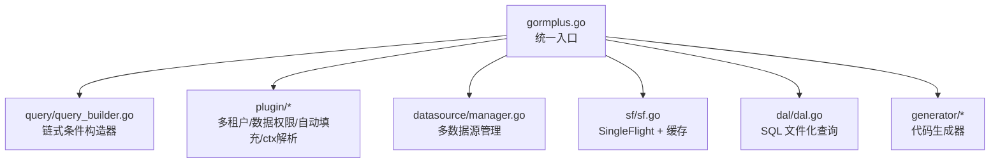
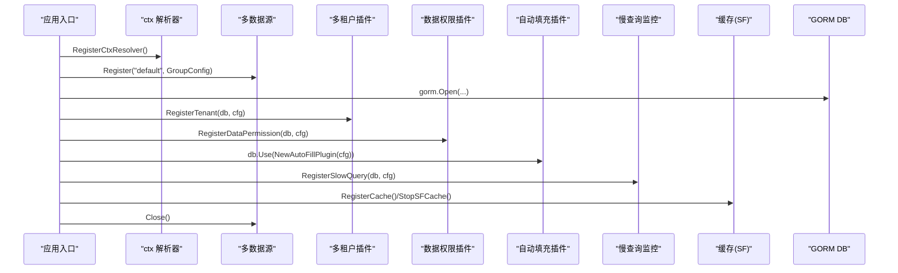
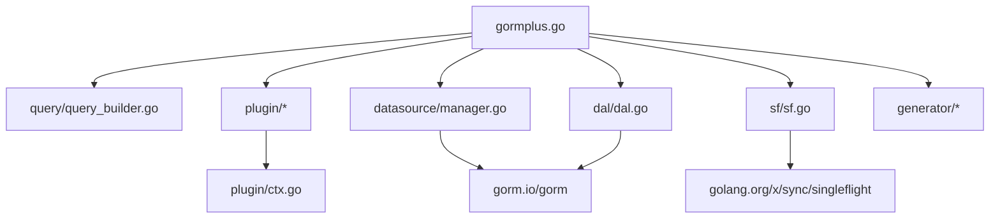

# 快速开始

<cite>
**本文引用的文件**
- [README.md](file://README.md)
- [gormplus.go](file://gormplus.go)
- [go.mod](file://go.mod)
- [version.go](file://version.go)
- [plugin/ctx.go](file://plugin/ctx.go)
- [plugin/tenant.go](file://plugin/tenant.go)
- [plugin/dataPermission.go](file://plugin/dataPermission.go)
- [plugin/autoOperator.go](file://plugin/autoOperator.go)
- [query/query_builder.go](file://query/query_builder.go)
- [datasource/manager.go](file://datasource/manager.go)
- [sf/sf.go](file://sf/sf.go)
- [dal/dal.go](file://dal/dal.go)
- [dal/dal_test.go](file://dal/dal_test.go)
- [generator/example_test.go](file://generator/example_test.go)
</cite>

## 目录
1. [简介](#简介)
2. [项目结构](#项目结构)
3. [核心组件](#核心组件)
4. [架构总览](#架构总览)
5. [详细组件分析](#详细组件分析)
6. [依赖关系分析](#依赖关系分析)
7. [性能考虑](#性能考虑)
8. [故障排查指南](#故障排查指南)
9. [结论](#结论)
10. [附录](#附录)

## 简介
GORM Plus 是基于 GORM 与 gorm-gen 的增强扩展包，提供链式条件构造器、多数据源管理、多租户与数据权限自动注入、自动填充、SingleFlight 可插拔缓存、慢查询监控以及代码生成器等能力。本文档面向初学者，提供从安装到初始化、中间件集成、首个业务查询的完整快速开始指南，帮助你在 10 分钟内完成基础配置并运行第一个查询。

## 项目结构
仓库采用模块化组织，核心模块包括：
- gormplus.go：统一入口，导出所有功能
- query：原生 gorm 链式条件构造器与泛型分页
- plugin：多租户、数据权限、自动填充、ctx 解析器
- datasource：多数据源管理（读写分离、连接池、健康检查）
- sf：SingleFlight + 可插拔缓存
- dal：SQL 文件化查询（embed + 泛型）
- generator：代码生成器（Model/Repository/API）

图表来源
- [gormplus.go:1-120](file://gormplus.go#L1-L120)
- [query/query_builder.go:1-60](file://query/query_builder.go#L1-L60)
- [plugin/tenant.go:1-60](file://plugin/tenant.go#L1-L60)
- [plugin/dataPermission.go:1-60](file://plugin/dataPermission.go#L1-L60)
- [plugin/autoOperator.go:1-60](file://plugin/autoOperator.go#L1-L60)
- [datasource/manager.go:1-60](file://datasource/manager.go#L1-L60)
- [sf/sf.go:1-60](file://sf/sf.go#L1-L60)
- [dal/dal.go:1-60](file://dal/dal.go#L1-L60)
- [generator/example_test.go:1-36](file://generator/example_test.go#L1-L36)

章节来源
- [README.md:17-42](file://README.md#L17-L42)
- [gormplus.go:1-120](file://gormplus.go#L1-L120)

## 核心组件
- 统一入口：通过 gormplus 导出所有能力，无需逐个导入子包
- 链式条件构造器：简化 WHERE 条件拼装，支持模糊、范围、分组、AND/OR
- 多数据源：支持一主多从、读写分离、连接池、健康检查
- 多租户/数据权限：自动注入隔离条件，支持安全策略与覆盖
- 自动填充：自动写入创建/更新人信息
- 缓存：SingleFlight 防击穿 + 可插拔缓存（内存/Redis）
- SQL 文件化查询：embed 打包 SQL，支持命名参数、分页、事务
- 代码生成器：一键生成 Model/Repository/API/VO/DTO

章节来源
- [gormplus.go:1-120](file://gormplus.go#L1-L120)
- [query/query_builder.go:1-60](file://query/query_builder.go#L1-L60)
- [datasource/manager.go:1-60](file://datasource/manager.go#L1-L60)
- [plugin/tenant.go:1-60](file://plugin/tenant.go#L1-L60)
- [plugin/dataPermission.go:1-60](file://plugin/dataPermission.go#L1-L60)
- [plugin/autoOperator.go:1-60](file://plugin/autoOperator.go#L1-L60)
- [sf/sf.go:1-60](file://sf/sf.go#L1-L60)
- [dal/dal.go:1-60](file://dal/dal.go#L1-L60)
- [generator/example_test.go:1-36](file://generator/example_test.go#L1-L36)

## 架构总览
下图展示了初始化流程与各模块协作关系，涵盖 ctx 解析器、多数据源、插件注册、缓存与慢查询监控。

图表来源
- [gormplus.go:103-125](file://gormplus.go#L103-L125)
- [datasource/manager.go:258-277](file://datasource/manager.go#L258-L277)
- [plugin/tenant.go:355-381](file://plugin/tenant.go#L355-L381)
- [plugin/dataPermission.go:243-249](file://plugin/dataPermission.go#L243-L249)
- [plugin/autoOperator.go:182-208](file://plugin/autoOperator.go#L182-L208)
- [sf/sf.go:101-131](file://sf/sf.go#L101-L131)
- [dal/dal.go:415-430](file://dal/dal.go#L415-L430)

## 详细组件分析

### 安装与版本
- 使用 go get 安装
- go.mod 指定 GORM 生态依赖与 Go 版本
- 版本号在 version.go 中定义

章节来源
- [README.md:9-13](file://README.md#L9-L13)
- [go.mod:1-26](file://go.mod#L1-L26)
- [version.go:1-4](file://version.go#L1-L4)

### 初始化流程（10 分钟快速开始）
以下步骤来自 README 的“快速开始”，按顺序执行即可完成基础初始化：
1) ctx 解析器注册（Gin 项目必须；Go-Zero/Fiber 跳过）
2) 多数据源注册（Dialector 外部传入，不内置驱动）
3) 打开 DB（多数据源场景也可从 DS.Write/Read 获取）
4) 注册多租户插件
5) 注册数据权限插件
6) 注册自动填充插件
7) 注册慢查询监控
8) 优雅退出（StopSFCache、DS.Close）

章节来源
- [README.md:44-110](file://README.md#L44-L110)
- [gormplus.go:103-125](file://gormplus.go#L103-L125)
- [datasource/manager.go:258-277](file://datasource/manager.go#L258-L277)
- [plugin/tenant.go:355-381](file://plugin/tenant.go#L355-L381)
- [plugin/dataPermission.go:243-249](file://plugin/dataPermission.go#L243-L249)
- [plugin/autoOperator.go:182-208](file://plugin/autoOperator.go#L182-L208)
- [sf/sf.go:208-225](file://sf/sf.go#L208-L225)

### 中间件集成最佳实践
- Gin：注册 ctx 解析器；在路由中间件中写入租户/数据权限/操作人上下文；注册中间件链
- Go-Zero：无需 ctx 解析器；直接在中间件写入 context
- Fiber：无需 ctx 解析器；直接在中间件写入 context

章节来源
- [README.md:114-135](file://README.md#L114-L135)
- [plugin/ctx.go:16-35](file://plugin/ctx.go#L16-L35)

### 多数据源管理
- 支持一主多从、读写分离、连接池、健康检查、优雅关闭
- 支持通过 WithName/WithRead/WithWrite 标记 context，DS.Auto(ctx) 自动选择
- 支持运行时热注册与 Ping 健康检查

章节来源
- [README.md:139-216](file://README.md#L139-L216)
- [datasource/manager.go:286-333](file://datasource/manager.go#L286-L333)
- [datasource/manager.go:394-430](file://datasource/manager.go#L394-L430)

### 链式条件构造器（Query）
- 支持 Like/LLike/RLike、BetweenIfNotZero、WhereIf、WhereGroup/OrGroup
- Build() 返回原生 gorm.DB，可继续使用 Find/Count/Joins 等
- 提供 FindByPage/ScanByPage 泛型分页

章节来源
- [README.md:219-283](file://README.md#L219-L283)
- [query/query_builder.go:66-145](file://query/query_builder.go#L66-L145)
- [query/query_builder.go:244-306](file://query/query_builder.go#L244-L306)

### gorm-gen 类型安全链式构造器（GenWrap）
- 包裹 gorm-gen DO，扩展 WhereIf/Like/Group 等能力
- Apply() 后返回原生 DO，继续使用 gorm-gen 原生方法

章节来源
- [README.md:286-327](file://README.md#L286-L327)
- [gormplus.go:290-341](file://gormplus.go#L290-L341)

### 多租户插件
- 注册一次，自动注入租户条件；支持多字段、按表覆盖、联表自动注入
- 安全策略：重复条件跳过、OR 绕过拒绝、全表 Update/Delete 保护
- 支持覆盖租户 ID、超管跳过、动态排除表

章节来源
- [README.md:331-490](file://README.md#L331-L490)
- [plugin/tenant.go:338-595](file://plugin/tenant.go#L338-L595)
- [plugin/tenant.go:596-713](file://plugin/tenant.go#L596-L713)

### 数据权限插件
- 注册一次，自动注入业务层定义的数据权限条件
- 支持跳过、动态排除表、注入方式（ModeScopes/ModeWhere）

章节来源
- [README.md:493-533](file://README.md#L493-L533)
- [plugin/dataPermission.go:128-204](file://plugin/dataPermission.go#L128-L204)
- [plugin/dataPermission.go:229-339](file://plugin/dataPermission.go#L229-L339)

### 自动填充插件
- 在 Create/Update 时自动填充字段（如创建人、更新人）
- 支持多字段、自定义 Getter、UpdateColumn/Simple 路径兼容

章节来源
- [README.md:536-564](file://README.md#L536-L564)
- [plugin/autoOperator.go:140-275](file://plugin/autoOperator.go#L140-L275)

### SingleFlight + 可插拔缓存（SF）
- SF：缓存 + singleflight，TTL 内共享结果
- SFNoCache：纯 singleflight，适合实时性要求高的场景
- SFInvalidate：写操作后主动失效
- 支持内存缓存与 Redis 等自定义实现

章节来源
- [README.md:567-641](file://README.md#L567-L641)
- [sf/sf.go:235-349](file://sf/sf.go#L235-L349)
- [sf/sf.go:351-395](file://sf/sf.go#L351-L395)

### 慢查询监控
- 注册后对超过阈值的 SQL 记录日志，包含耗时、表名、SQL、影响行数、错误

章节来源
- [README.md:643-658](file://README.md#L643-L658)
- [gormplus.go:721-733](file://gormplus.go#L721-L733)

### SQL 文件化查询（DAL）
- 通过 //go:embed 打包 SQL，支持位置参数与命名参数
- 支持分页、事务、Hook、预热、多数据源实例
- 提供 Query/QueryOne/QueryNamed/Exec/Count/QueryPage 等 API

章节来源
- [README.md:696-790](file://README.md#L696-L790)
- [dal/dal.go:1-120](file://dal/dal.go#L1-L120)
- [dal/dal.go:568-800](file://dal/dal.go#L568-L800)
- [dal/dal_test.go:1-120](file://dal/dal_test.go#L1-L120)

### 代码生成器
- 支持 YAML 配置与 LoadConfig
- 一键生成 Model/Repository/API/VO/DTO，Model 每次覆盖，其他文件跳过

章节来源
- [README.md:662-694](file://README.md#L662-L694)
- [generator/example_test.go:1-36](file://generator/example_test.go#L1-L36)

## 依赖关系分析
- gormplus.go 导入并聚合各模块
- plugin/ctx.go 为多租户/数据权限/自动填充提供 ctx 解析能力
- datasource/manager.go 依赖 gorm 与 gorm.io/plugin/dbresolver
- sf/sf.go 依赖 golang.org/x/sync/singleflight
- dal/dal.go 依赖 gorm 与 singleflight

图表来源
- [gormplus.go:88-101](file://gormplus.go#L88-L101)
- [plugin/ctx.go:1-44](file://plugin/ctx.go#L1-L44)
- [datasource/manager.go:1-14](file://datasource/manager.go#L1-L14)
- [sf/sf.go:1-16](file://sf/sf.go#L1-L16)
- [dal/dal.go:71-84](file://dal/dal.go#L71-L84)

章节来源
- [gormplus.go:88-101](file://gormplus.go#L88-L101)
- [go.mod:5-25](file://go.mod#L5-L25)

## 性能考虑
- 多数据源连接池：默认 MaxOpen=50、MaxIdle=10、MaxLifetime=30min、MaxIdleTime=10min，生产推荐值
- 缓存 TTL 建议：列表/统计 3s~30s；配置/字典 1min~5min；详情/实时 0 或 SFNoCache
- SingleFlight 防击穿：同一瞬间仅一次真实查询，其余等待共享结果
- SQL 文件化查询：embed 缓存 + singleflight 防击穿，支持定时清理缓存

章节来源
- [datasource/manager.go:163-169](file://datasource/manager.go#L163-L169)
- [README.md:633-640](file://README.md#L633-L640)
- [sf/sf.go:40-45](file://sf/sf.go#L40-L45)
- [dal/dal.go:265-281](file://dal/dal.go#L265-L281)

## 故障排查指南
- 未初始化：调用 DAL 查询前未调用 NewDal，resolve(ctx) 会 panic
- 未注册数据源：DS.Auto(ctx) 报错“未找到数据源名且未设置默认数据源”
- 未注册插件：调用 WithTenantID/WithDataPermission 时插件未注册
- Gin ctx 读取不到中间件值：未注册 RegisterCtxResolver 或未传 *gin.Context
- 缓存未生效：未在第一次调用 SF 之前注册 RegisterCache
- SQL 文件路径错误：Preload/Query 报错“file not found”

章节来源
- [dal/dal.go:450-461](file://dal/dal.go#L450-L461)
- [datasource/manager.go:306-323](file://datasource/manager.go#L306-L323)
- [plugin/ctx.go:37-43](file://plugin/ctx.go#L37-L43)
- [sf/sf.go:101-114](file://sf/sf.go#L101-L114)
- [dal/dal_test.go:300-321](file://dal/dal_test.go#L300-L321)

## 结论
通过本快速开始指南，你可以在 10 分钟内完成 GORM Plus 的安装、初始化与首个业务查询。建议在开发环境开启 Debug/Hook，在生产环境合理配置缓存 TTL 与连接池参数，并结合中间件实现多租户与数据权限自动注入，以获得更好的隔离性与性能表现。

## 附录

### 安装与版本
- go get github.com/kuangshp/gorm-plus
- go.mod 指定 GORM 生态依赖与 Go 版本
- version.go 定义版本号

章节来源
- [README.md:9-13](file://README.md#L9-L13)
- [go.mod:1-26](file://go.mod#L1-L26)
- [version.go:1-4](file://version.go#L1-L4)

### 初始化示例（代码片段路径）
- ctx 解析器注册：[RegisterCtxResolver:103-125](file://gormplus.go#L103-L125)
- 多数据源注册：[Register:258-277](file://datasource/manager.go#L258-L277)
- 打开 DB：[gorm.Open:49-50](file://gormplus.go#L49-L50)
- 多租户插件注册：[RegisterTenant:512-572](file://gormplus.go#L512-L572)
- 数据权限插件注册：[RegisterDataPermission:673-685](file://gormplus.go#L673-L685)
- 自动填充插件注册：[NewAutoFillPlugin:783-793](file://gormplus.go#L783-L793)
- 慢查询监控注册：[RegisterSlowQuery:721-733](file://gormplus.go#L721-L733)
- 优雅退出：[StopSFCache/DS.Close:82-84](file://gormplus.go#L82-L84)

章节来源
- [README.md:44-110](file://README.md#L44-L110)
- [gormplus.go:49-84](file://gormplus.go#L49-L84)

### 中间件写入示例（代码片段路径）
- Gin ctx 解析器注册：[RegisterCtxResolver:16-35](file://plugin/ctx.go#L16-L35)
- 租户中间件写入：[WithTenantID:583-596](file://gormplus.go#L583-L596)
- 数据权限中间件写入：[WithDataPermission:692-720](file://gormplus.go#L692-L720)
- 自动填充中间件写入：[CtxGetter:55-74](file://plugin/autoOperator.go#L55-L74)

章节来源
- [README.md:114-135](file://README.md#L114-L135)
- [plugin/ctx.go:16-35](file://plugin/ctx.go#L16-L35)
- [gormplus.go:583-596](file://gormplus.go#L583-L596)
- [gormplus.go:692-720](file://gormplus.go#L692-L720)
- [plugin/autoOperator.go:55-74](file://plugin/autoOperator.go#L55-L74)

### 链式条件构造器使用（代码片段路径）
- 新建构造器：[NewQuery:46-64](file://query/query_builder.go#L46-L64)
- 模糊/范围/条件开关：[Like/LLike/RLike/BetweenIfNotZero/WhereIf:176-195](file://query/query_builder.go#L176-L195)
- 条件分组：[WhereGroup/OrGroup:197-213](file://query/query_builder.go#L197-L213)
- 泛型分页：[FindByPage/ScanByPage:246-306](file://query/query_builder.go#L246-L306)

章节来源
- [query/query_builder.go:46-64](file://query/query_builder.go#L46-L64)
- [query/query_builder.go:176-213](file://query/query_builder.go#L176-L213)
- [query/query_builder.go:246-306](file://query/query_builder.go#L246-L306)

### 多数据源使用（代码片段路径）
- 自动选择：[Auto:288-323](file://datasource/manager.go#L288-L323)
- 显式读写：[Write/Read:336-352](file://datasource/manager.go#L336-L352)
- 健康检查：[Ping:394-430](file://datasource/manager.go#L394-L430)

章节来源
- [datasource/manager.go:288-323](file://datasource/manager.go#L288-L323)
- [datasource/manager.go:336-352](file://datasource/manager.go#L336-L352)
- [datasource/manager.go:394-430](file://datasource/manager.go#L394-L430)

### 缓存与慢查询（代码片段路径）
- SF 缓存：[SF/SFWithTTL/SFNoCache:237-273](file://sf/sf.go#L237-L273)
- 主动失效：[SFInvalidate:275-291](file://sf/sf.go#L275-L291)
- 慢查询注册：[RegisterSlowQuery:721-733](file://gormplus.go#L721-L733)

章节来源
- [sf/sf.go:237-291](file://sf/sf.go#L237-L291)
- [gormplus.go:721-733](file://gormplus.go#L721-L733)

### SQL 文件化查询（代码片段路径）
- 初始化：[NewDal:334-351](file://dal/dal.go#L334-L351)
- 查询多条/单条/命名参数：[Query/QueryOne/QueryNamed:594-762](file://dal/dal.go#L594-L762)
- 分页查询：[QueryPage/QueryPageNamed:572-661](file://dal/dal.go#L572-L661)
- 事务：[WithTx/TxQuery/TxQueryOne:664-781](file://dal/dal.go#L664-L781)

章节来源
- [dal/dal.go:334-351](file://dal/dal.go#L334-L351)
- [dal/dal.go:594-762](file://dal/dal.go#L594-L762)
- [dal/dal.go:572-661](file://dal/dal.go#L572-L661)
- [dal/dal.go:664-781](file://dal/dal.go#L664-L781)

### 代码生成器（代码片段路径）
- 生成示例：[ExampleGenerate:7-35](file://generator/example_test.go#L7-L35)
- 配置加载：[LoadConfig:29-34](file://generator/example_test.go#L29-L34)

章节来源
- [generator/example_test.go:7-35](file://generator/example_test.go#L7-L35)