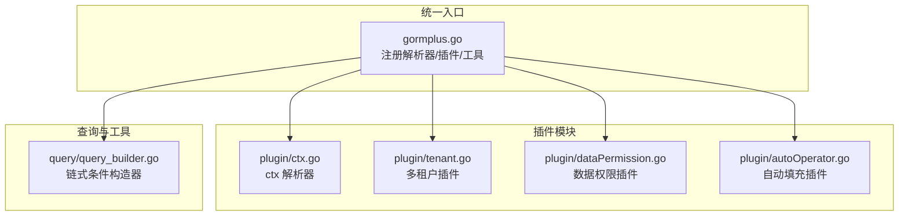
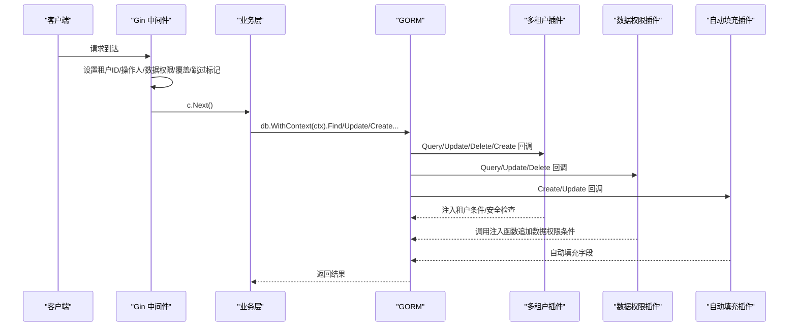
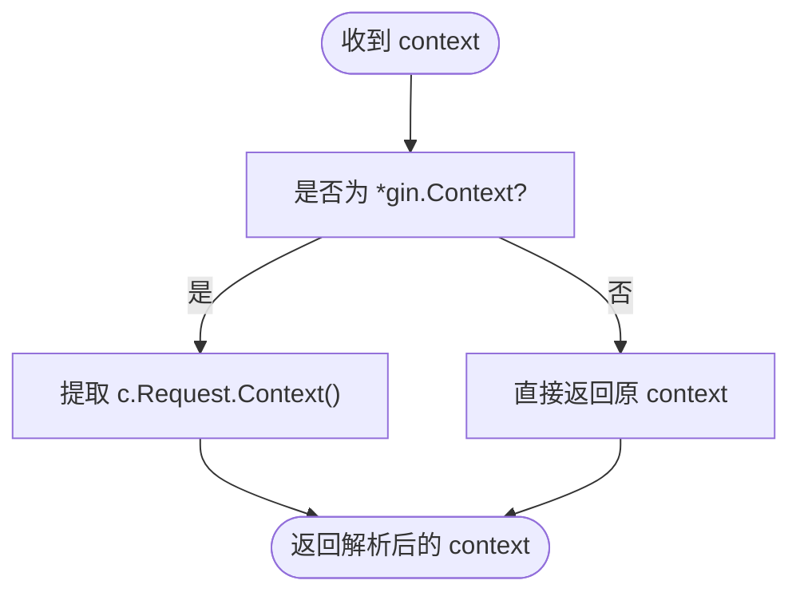
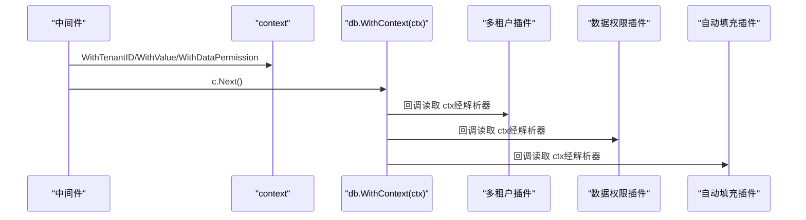
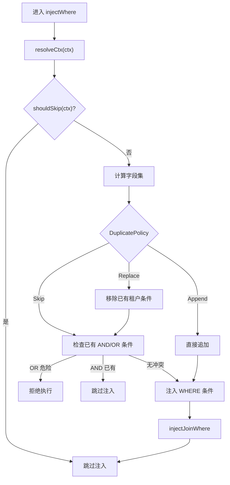
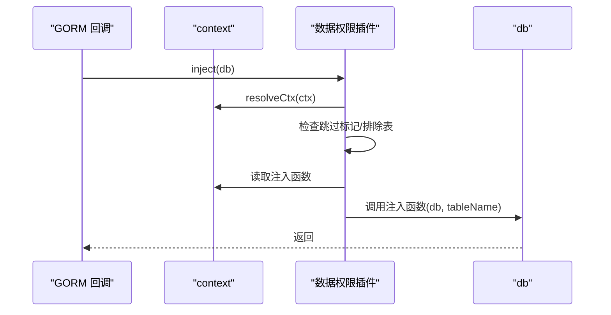
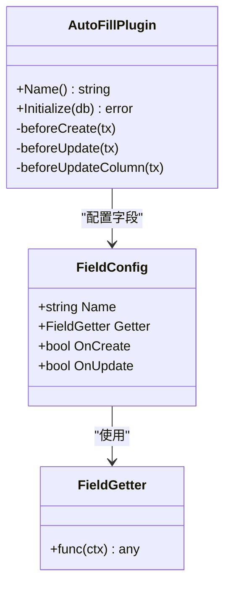
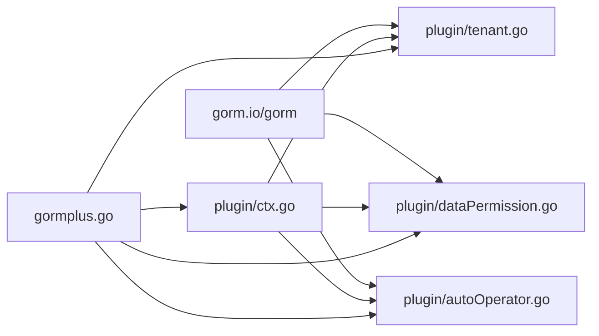

# 上下文管理

<cite>
**本文引用的文件**
- [plugin/ctx.go](file://plugin/ctx.go)
- [plugin/tenant.go](file://plugin/tenant.go)
- [plugin/dataPermission.go](file://plugin/dataPermission.go)
- [plugin/autoOperator.go](file://plugin/autoOperator.go)
- [gormplus.go](file://gormplus.go)
- [README.md](file://README.md)
- [plugin/tenant.md](file://plugin/tenant.md)
- [plugin/dataPermission.md](file://plugin/dataPermission.md)
- [plugin/autoOperator.md](file://plugin/autoOperator.md)
- [go.mod](file://go.mod)
- [version.go](file://version.go)
- [query/query_builder.go](file://query/query_builder.go)
</cite>

## 目录
1. [简介](#简介)
2. [项目结构](#项目结构)
3. [核心组件](#核心组件)
4. [架构总览](#架构总览)
5. [详细组件分析](#详细组件分析)
6. [依赖分析](#依赖分析)
7. [性能考虑](#性能考虑)
8. [故障排查指南](#故障排查指南)
9. [结论](#结论)
10. [附录](#附录)

## 简介
本技术文档聚焦“上下文管理系统”，围绕 Context 在插件系统中的作用、传递机制、生命周期与作用域控制进行深入说明，并结合多租户、数据权限、自动填充三大插件，给出中间件集成示例（尤其是 Gin）、解析器实现、错误处理与异常场景、性能优化与调试技巧。读者将获得从框架差异屏蔽、中间件设置、插件读取、安全策略到运行时动态调整的完整知识图谱。

## 项目结构
本仓库采用“统一入口 + 插件模块”的组织方式：
- 统一入口：gormplus.go 提供注册解析器、注册插件、导出上下文工具等统一 API
- 插件模块：plugin/ 下包含 ctx 解析器、多租户、数据权限、自动填充四个插件
- 查询与工具：query/ 提供链式条件构造器，便于在中间件与业务层组合使用
- 文档与示例：各插件配套 md 文档，展示 Gin/GoZero/Fiber 等框架的集成要点

图表来源
- [gormplus.go:103-125](file://gormplus.go#L103-L125)
- [plugin/ctx.go:1-44](file://plugin/ctx.go#L1-L44)
- [plugin/tenant.go:1-40](file://plugin/tenant.go#L1-L40)
- [plugin/dataPermission.go:1-40](file://plugin/dataPermission.go#L1-L40)
- [plugin/autoOperator.go:1-40](file://plugin/autoOperator.go#L1-L40)
- [query/query_builder.go:1-45](file://query/query_builder.go#L1-L45)

章节来源
- [README.md:17-41](file://README.md#L17-L41)
- [gormplus.go:86-125](file://gormplus.go#L86-L125)

## 核心组件
- ctx 解析器：屏蔽 Gin/GoZero/Fiber 等框架的 ctx 类型差异，确保插件能从 *gin.Context 中读取 Request.Context() 的中间件数据
- 多租户插件：在 Query/Update/Delete/Create 前自动注入租户条件，支持多字段、联表、安全策略与覆盖/跳过
- 数据权限插件：在 Query/Update/Delete 前调用业务注入函数追加数据范围条件
- 自动填充插件：在 Create/Update 前自动填充 CreatedBy/UpdatedBy 等字段，支持多字段与自定义 Getter
- 统一入口：gormplus.go 将解析器与插件注册统一封装，简化业务接入

章节来源
- [plugin/ctx.go:7-43](file://plugin/ctx.go#L7-L43)
- [plugin/tenant.go:338-381](file://plugin/tenant.go#L338-L381)
- [plugin/dataPermission.go:128-162](file://plugin/dataPermission.go#L128-L162)
- [plugin/autoOperator.go:140-186](file://plugin/autoOperator.go#L140-L186)
- [gormplus.go:103-125](file://gormplus.go#L103-L125)

## 架构总览
Context 在插件系统中的传递链路如下：
- 中间件在请求进入时，将租户 ID、操作人信息、数据权限注入函数、覆盖/跳过标记等写入 context
- 业务层通过 db.WithContext(ctx) 将 context 传入 GORM
- 插件在 GORM Callback 阶段读取 ctx，经解析器转换后，按各自策略注入条件或填充字段
- Gin 场景需注册 ctx 解析器，以兼容 *gin.Context

图表来源
- [plugin/tenant.go:355-381](file://plugin/tenant.go#L355-L381)
- [plugin/dataPermission.go:140-162](file://plugin/dataPermission.go#L140-L162)
- [plugin/autoOperator.go:190-208](file://plugin/autoOperator.go#L190-L208)
- [gormplus.go:512-581](file://gormplus.go#L512-L581)

## 详细组件分析

### 1) ctx 解析器与框架差异屏蔽
- 目标：解决 Gin 项目直接传 *gin.Context 给 db.WithContext() 时，插件无法从 *gin.Context 读取到中间件写入 Request.Context() 的问题
- 机制：全局注册一个 ctxResolver 函数，resolveCtx 在插件读取 ctx 前统一调用，将 *gin.Context 转换为 c.Request.Context()
- 使用：Gin 项目必须在启动时注册；GoZero/Fiber 使用标准 context，无需注册

图表来源
- [plugin/ctx.go:31-43](file://plugin/ctx.go#L31-L43)
- [gormplus.go:123-125](file://gormplus.go#L123-L125)

章节来源
- [plugin/ctx.go:7-43](file://plugin/ctx.go#L7-L43)
- [gormplus.go:103-125](file://gormplus.go#L103-L125)
- [README.md:114-136](file://README.md#L114-L136)

### 2) 中间件设置与传递：租户 ID、操作人信息、数据权限
- 租户 ID：在中间件中调用 WithTenantID 写入 context，随后在 db.WithContext(ctx) 时自动注入
- 操作人信息：通过 context.WithValue 写入自定义 key，自动填充插件通过 CtxGetter/OperatorGetter 读取
- 数据权限：在中间件中构造注入函数，调用 WithDataPermission 写入 context，插件回调阶段自动调用
- 覆盖/跳过：AllowGlobalOperation/WithOverrideTenantID/SkipTenant 用于特殊场景

图表来源
- [plugin/tenant.go:1160-1195](file://plugin/tenant.go#L1160-L1195)
- [plugin/dataPermission.go:69-91](file://plugin/dataPermission.go#L69-L91)
- [plugin/autoOperator.go:42-74](file://plugin/autoOperator.go#L42-L74)

章节来源
- [plugin/tenant.go:1160-1222](file://plugin/tenant.go#L1160-L1222)
- [plugin/dataPermission.go:69-104](file://plugin/dataPermission.go#L69-L104)
- [plugin/autoOperator.go:42-74](file://plugin/autoOperator.go#L42-L74)
- [plugin/tenant.md:20-30](file://plugin/tenant.md#L20-L30)
- [plugin/dataPermission.md:17-35](file://plugin/dataPermission.md#L17-L35)
- [plugin/autoOperator.md:54-102](file://plugin/autoOperator.md#L54-L102)

### 3) 多租户插件：解析器、注入策略与安全
- 注入时机：Query/Update/Delete 前注册钩子；Create 前注入租户字段值
- 注入策略：
  - PolicySkip：默认，若业务已写 AND 条件则跳过；检测 OR 危险条件直接拒绝
  - PolicyReplace：先移除业务条件，再注入 ctx 值，强制隔离
  - PolicyAppend：不检查直接追加，性能最优但可能重复
- 联表注入：自动解析 JOIN 别名，支持按表覆盖字段名
- 安全保护：禁止无业务条件的全表 Update/Delete；支持 AllowGlobalOperation 临时放开
- 覆盖/跳过：WithOverrideTenantID/AllowOverrideTenantID；SkipTenant

图表来源
- [plugin/tenant.go:529-595](file://plugin/tenant.go#L529-L595)
- [plugin/tenant.go:385-482](file://plugin/tenant.go#L385-L482)
- [plugin/tenant.go:644-713](file://plugin/tenant.go#L644-L713)

章节来源
- [plugin/tenant.go:338-381](file://plugin/tenant.go#L338-L381)
- [plugin/tenant.go:529-595](file://plugin/tenant.go#L529-L595)
- [plugin/tenant.go:809-865](file://plugin/tenant.go#L809-L865)
- [plugin/tenant.go:1132-1222](file://plugin/tenant.go#L1132-L1222)

### 4) 数据权限插件：业务注入函数与排除表
- 注入时机：Query/Update/Delete 前回调
- 注入方式：从 ctx 读取业务注入函数，直接调用 db.Where(...) 追加条件
- 排除表：支持运行时动态增删，线程安全
- 跳过标记：SkipDataPermission 用于特权场景

图表来源
- [plugin/dataPermission.go:164-204](file://plugin/dataPermission.go#L164-L204)
- [plugin/dataPermission.go:282-316](file://plugin/dataPermission.go#L282-L316)

章节来源
- [plugin/dataPermission.go:128-162](file://plugin/dataPermission.go#L128-L162)
- [plugin/dataPermission.go:164-204](file://plugin/dataPermission.go#L164-L204)
- [plugin/dataPermission.go:282-316](file://plugin/dataPermission.go#L282-L316)

### 5) 自动填充插件：Getter 与字段填充
- Getter：内置 CtxGetter/OperatorGetter，也支持自定义 FieldGetter
- 注入时机：Create/Update 前回调，分别处理普通路径与 UpdateColumn 路径
- 字段映射：通过 gorm schema 自动解析列名，支持 struct/slice/map 等目标类型

图表来源
- [plugin/autoOperator.go:140-186](file://plugin/autoOperator.go#L140-L186)
- [plugin/autoOperator.go:190-275](file://plugin/autoOperator.go#L190-L275)

章节来源
- [plugin/autoOperator.go:140-186](file://plugin/autoOperator.go#L140-L186)
- [plugin/autoOperator.go:190-275](file://plugin/autoOperator.go#L190-L275)

### 6) 生命周期与作用域控制
- 生命周期：
  - 中间件：请求进入时写入 context，请求结束时释放
  - 插件：在 GORM Callback 阶段读取并消费，不持久化
- 作用域控制：
  - Gin：必须注册 ctx 解析器，确保 *gin.Context 转换为 c.Request.Context()
  - 跳过/覆盖：通过 SkipTenant/WithOverrideTenantID/AllowGlobalOperation 等标记控制
  - 排除表：运行时 Add/Remove，线程安全

章节来源
- [plugin/ctx.go:31-43](file://plugin/ctx.go#L31-L43)
- [plugin/tenant.go:1132-1222](file://plugin/tenant.go#L1132-L1222)
- [plugin/dataPermission.go:282-316](file://plugin/dataPermission.go#L282-L316)

### 7) 不同插件如何从 Context 获取所需信息
- 多租户：TenantIDFromCtx/DefaultGetTenantID/WithTenantID/WithOverrideTenantID/SkipTenant/AllowGlobalOperation
- 数据权限：WithDataPermission/DataPermissionFromCtx/SkipDataPermission
- 自动填充：CtxGetter/OperatorGetter/自定义 FieldGetter

章节来源
- [plugin/tenant.go:1132-1222](file://plugin/tenant.go#L1132-L1222)
- [plugin/dataPermission.go:69-104](file://plugin/dataPermission.go#L69-L104)
- [plugin/autoOperator.go:42-74](file://plugin/autoOperator.go#L42-L74)

### 8) 错误处理与异常场景
- OR 绕过：检测到租户字段出现在 OR 条件中直接拒绝执行
- 全表保护：无业务条件的 Update/Delete 被拒绝，可通过 AllowGlobalOperation 临时放开
- 覆盖/跳过：AllowOverrideTenantID 仅在开启时生效；SkipTenant 完全跳过租户过滤
- 注册解析器：Gin 必须注册，否则插件无法读取中间件数据

章节来源
- [plugin/tenant.go:420-482](file://plugin/tenant.go#L420-L482)
- [plugin/tenant.go:823-865](file://plugin/tenant.go#L823-L865)
- [plugin/tenant.go:1132-1222](file://plugin/tenant.go#L1132-L1222)
- [plugin/ctx.go:31-43](file://plugin/ctx.go#L31-L43)

## 依赖分析
- 统一入口依赖插件模块：gormplus.go 导出 RegisterCtxResolver/RegisterTenant/RegisterDataPermission/NewAutoFillPlugin 等
- 插件模块依赖 GORM：通过 db.Use()/Callback 注册钩子
- Gin 依赖：Gin 项目需注册 ctx 解析器；GoZero/Fiber 使用标准 context

图表来源
- [plugin/tenant.go:355-381](file://plugin/tenant.go#L355-L381)
- [plugin/dataPermission.go:140-162](file://plugin/dataPermission.go#L140-L162)
- [plugin/autoOperator.go:190-208](file://plugin/autoOperator.go#L190-L208)
- [gormplus.go:103-125](file://gormplus.go#L103-L125)

章节来源
- [go.mod:5-25](file://go.mod#L5-L25)
- [gormplus.go:88-101](file://gormplus.go#L88-L101)

## 性能考虑
- ctx 解析器：仅在插件读取时调用一次，成本极低
- 多租户注入策略：
  - PolicySkip：默认，兼顾安全与性能
  - PolicyReplace：严格模式，先移除再注入，额外一次条件扫描
  - PolicyAppend：不检查直接追加，性能最优但可能重复条件
- 自动填充：仅在 Create/Update 前回调，字段数量与 Getter 复杂度为主要成本
- 数据权限：注入函数由业务实现，应尽量避免复杂子查询与重复计算

章节来源
- [plugin/tenant.go:157-188](file://plugin/tenant.go#L157-L188)
- [plugin/autoOperator.go:277-309](file://plugin/autoOperator.go#L277-L309)
- [plugin/dataPermission.go:164-204](file://plugin/dataPermission.go#L164-L204)

## 故障排查指南
- Gin 无法读取中间件数据
  - 现象：插件读取不到租户 ID/操作人信息
  - 处理：确认已注册 ctx 解析器；业务层传入 c.Request.Context() 或使用 gormplus.RegisterCtxResolver
- OR 条件导致执行被拒
  - 现象：报错提示租户字段出现在 OR 条件中
  - 处理：修改为 AND 条件，或使用 SkipTenant/WithOverrideTenantID（谨慎使用）
- 全表 Update/Delete 被拒绝
  - 现象：无业务 WHERE 条件时报错
  - 处理：添加业务条件，或使用 AllowGlobalOperation 临时放开
- 数据权限未生效
  - 现象：未注入数据范围条件
  - 处理：确认中间件已调用 WithDataPermission；检查排除表配置；确认回调阶段 ctx 未被覆盖
- 自动填充字段未写入
  - 现象：CreatedBy/UpdatedBy 等字段为空
  - 处理：确认中间件已写入对应 key；确认插件配置的 FieldConfig 名称与 Getter 正确

章节来源
- [plugin/ctx.go:31-43](file://plugin/ctx.go#L31-L43)
- [plugin/tenant.go:420-482](file://plugin/tenant.go#L420-L482)
- [plugin/tenant.go:823-865](file://plugin/tenant.go#L823-L865)
- [plugin/dataPermission.go:164-204](file://plugin/dataPermission.go#L164-L204)
- [plugin/autoOperator.go:190-275](file://plugin/autoOperator.go#L190-L275)

## 结论
上下文管理是插件系统高效协作的关键。通过 ctx 解析器屏蔽框架差异，中间件在请求生命周期内准确写入租户 ID、操作人信息、数据权限注入函数与控制标记，插件在 GORM 回调阶段安全、可控地完成条件注入与字段填充。配合严格的 OR 绕过检测、全表保护与覆盖/跳过机制，系统在保证安全的同时提供了灵活的运行时控制能力。建议在 Gin 项目中务必注册解析器，在生产中优先使用 PolicySkip 并谨慎启用覆盖/跳过功能。

## 附录
- 版本信息：v1.0.13
- 依赖：gorm.io/gorm、gorm.io/gen、gorm.io/driver/mysql 等
- 链式条件构造器：query.NewQuery 支持 WhereIf/Like/Between/分组等，便于与中间件组合使用

章节来源
- [version.go:1-4](file://version.go#L1-L4)
- [go.mod:5-25](file://go.mod#L5-L25)
- [query/query_builder.go:46-64](file://query/query_builder.go#L46-L64)