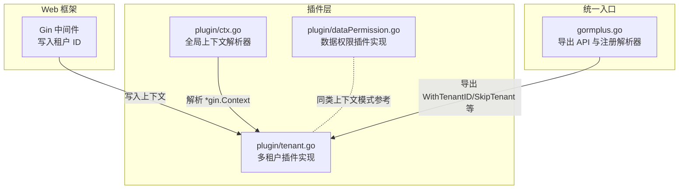
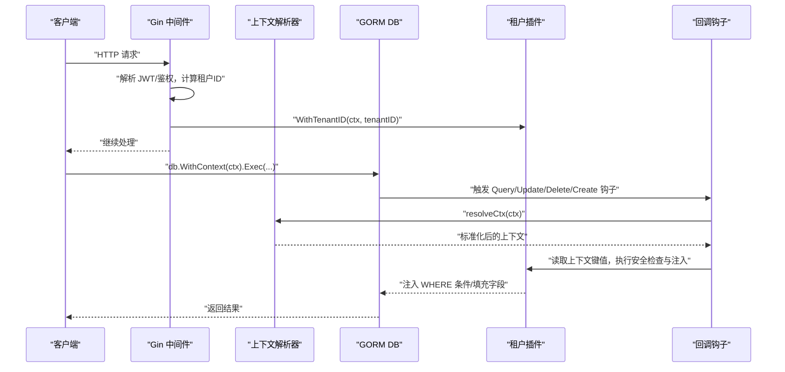
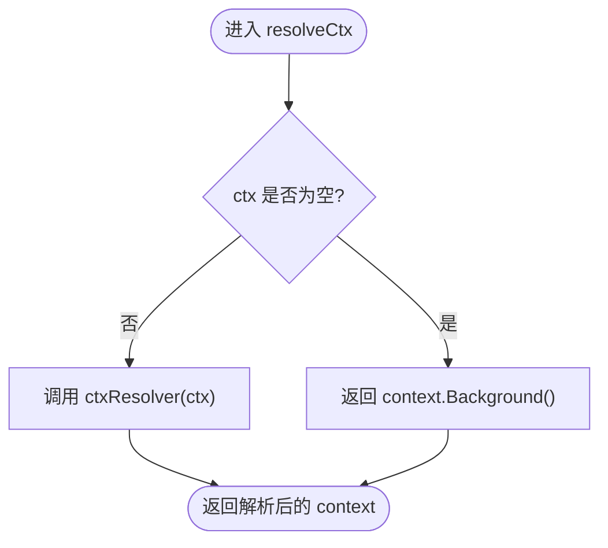
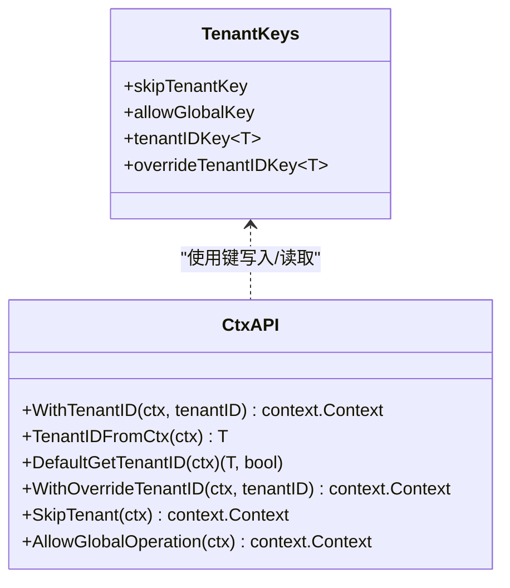
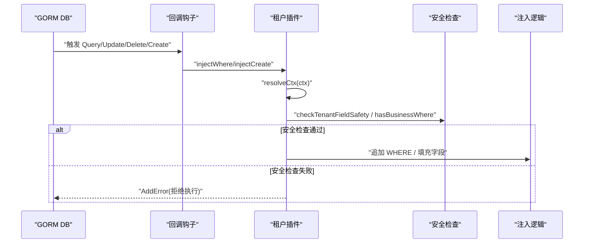
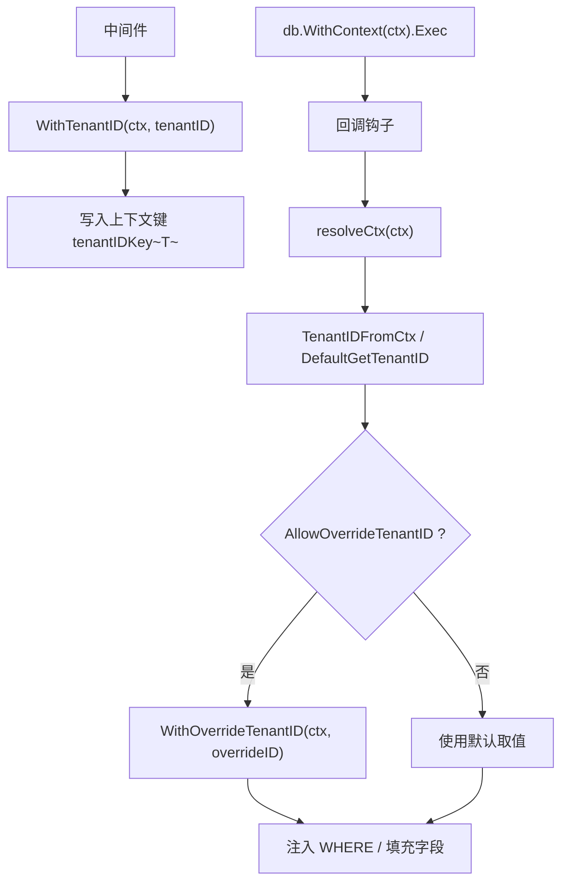
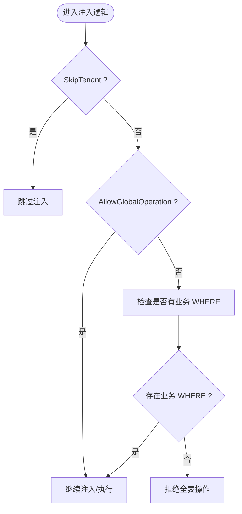
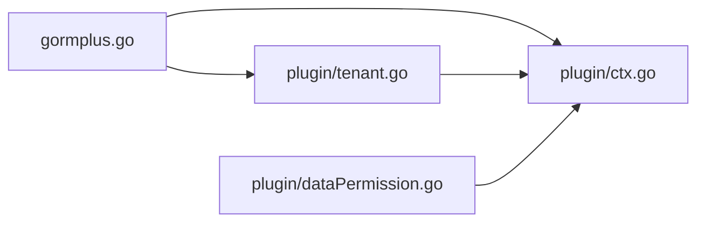

# 上下文管理

<cite>
**本文引用的文件**
- [plugin/ctx.go](file://plugin/ctx.go)
- [plugin/tenant.go](file://plugin/tenant.go)
- [plugin/dataPermission.go](file://plugin/dataPermission.go)
- [gormplus.go](file://gormplus.go)
- [plugin/tenant.md](file://plugin/tenant.md)
</cite>

## 目录
1. [简介](#简介)
2. [项目结构](#项目结构)
3. [核心组件](#核心组件)
4. [架构总览](#架构总览)
5. [详细组件分析](#详细组件分析)
6. [依赖分析](#依赖分析)
7. [性能考量](#性能考量)
8. [故障排查指南](#故障排查指南)
9. [结论](#结论)
10. [附录](#附录)

## 简介
本章节面向多租户插件的“上下文管理”能力，系统阐述 Context 上下文的使用机制与传递流程，重点覆盖以下函数与行为：
- WithTenantID：在中间件中写入租户 ID 到上下文
- WithOverrideTenantID：在允许覆盖的前提下临时切换租户 ID
- SkipTenant：跳过租户过滤（超管/跨租户统计）
- AllowGlobalOperation：临时允许无业务条件的全表更新/删除
- 上下文解析器 RegisterCtxResolver：解决 Gin 等框架传入 *gin.Context 导致插件无法读取 Request.Context 的问题
- 上下文与 GORM 回调机制的集成：Query/Update/Delete/Create 钩子中读取上下文并注入租户条件
- 中间件集成示例与最佳实践、常见错误处理、调试技巧与性能优化建议

## 项目结构
围绕上下文管理的关键文件与职责：
- plugin/ctx.go：全局上下文解析器与解析函数，屏蔽框架差异
- plugin/tenant.go：多租户插件实现，包含上下文键、解析与注入逻辑
- plugin/dataPermission.go：数据权限插件，展示与上下文交互的同类模式
- gormplus.go：统一入口，导出上下文相关 API 并复用插件层实现
- plugin/tenant.md：使用示例（注册解析器、中间件写入）

图表来源
- [plugin/ctx.go:1-44](file://plugin/ctx.go#L1-L44)
- [plugin/tenant.go:1132-1222](file://plugin/tenant.go#L1132-L1222)
- [plugin/dataPermission.go:67-104](file://plugin/dataPermission.go#L67-L104)
- [gormplus.go:103-125](file://gormplus.go#L103-L125)

章节来源
- [plugin/ctx.go:1-44](file://plugin/ctx.go#L1-L44)
- [plugin/tenant.go:1132-1222](file://plugin/tenant.go#L1132-L1222)
- [plugin/dataPermission.go:67-104](file://plugin/dataPermission.go#L67-L104)
- [gormplus.go:103-125](file://gormplus.go#L103-L125)

## 核心组件
- 上下文解析器与解析函数
  - 全局变量 ctxResolver：默认透传，可通过 RegisterCtxResolver 注册框架特定解析逻辑
  - resolveCtx：在插件内部统一使用，屏蔽 *gin.Context 与标准 context 的差异
- 上下文键与读写函数
  - WithTenantID / TenantIDFromCtx：写入与读取租户 ID
  - WithOverrideTenantID：在允许覆盖的前提下写入覆盖租户 ID
  - SkipTenant：标记跳过租户过滤
  - AllowGlobalOperation：标记允许无业务条件全表操作
- GORM 回调集成
  - Query/Update/Delete/Create 钩子中读取上下文，注入 WHERE 条件或填充结构体字段
  - 安全检查：重复条件跳过、OR 绕过拒绝、全表保护

章节来源
- [plugin/ctx.go:7-43](file://plugin/ctx.go#L7-L43)
- [plugin/tenant.go:1132-1222](file://plugin/tenant.go#L1132-L1222)
- [plugin/tenant.go:355-381](file://plugin/tenant.go#L355-L381)

## 架构总览
上下文管理在多租户插件中的工作流：
- Web 框架中间件在请求入口写入租户 ID 到上下文
- 插件注册解析器，确保 Gin 等框架传入 *gin.Context 时能正确读取 Request.Context
- GORM 回调在执行前读取上下文，进行安全检查与注入
- 特殊场景通过 SkipTenant/AllowGlobalOperation/WithOverrideTenantID 控制行为

图表来源
- [plugin/tenant.go:529-595](file://plugin/tenant.go#L529-L595)
- [plugin/tenant.go:749-779](file://plugin/tenant.go#L749-L779)
- [plugin/ctx.go:37-43](file://plugin/ctx.go#L37-L43)

章节来源
- [plugin/tenant.go:529-595](file://plugin/tenant.go#L529-L595)
- [plugin/tenant.go:749-779](file://plugin/tenant.go#L749-L779)
- [plugin/ctx.go:37-43](file://plugin/ctx.go#L37-L43)

## 详细组件分析

### 上下文解析器与解析函数
- 设计目的：解决 Gin 项目直接传 *gin.Context 给 db.WithContext() 时，插件无法从 *gin.Context 读取到中间件写入 Request.Context() 的问题
- 使用方式：在应用启动时调用 RegisterCtxResolver，传入框架特定解析逻辑
- 解析流程：resolveCtx(ctx) -> ctxResolver(ctx) -> 标准化后的 context

图表来源
- [plugin/ctx.go:37-43](file://plugin/ctx.go#L37-L43)
- [plugin/ctx.go:7-14](file://plugin/ctx.go#L7-L14)

章节来源
- [plugin/ctx.go:7-43](file://plugin/ctx.go#L7-L43)

### 上下文键与读写函数
- WithTenantID：写入租户 ID 到上下文，类型安全键
- TenantIDFromCtx：从上下文中读取租户 ID，类型安全读取
- DefaultGetTenantID：默认取值函数，读取 WithTenantID 写入的值
- WithOverrideTenantID：写入覆盖租户 ID（需 AllowOverrideTenantID=true）
- SkipTenant：标记跳过租户过滤
- AllowGlobalOperation：标记允许无业务条件全表操作

图表来源
- [plugin/tenant.go:1132-1222](file://plugin/tenant.go#L1132-L1222)

章节来源
- [plugin/tenant.go:1132-1222](file://plugin/tenant.go#L1132-L1222)

### 上下文与 GORM 回调机制的集成
- 注册钩子：Query/Update/Delete/Create 回调在执行前触发
- 读取上下文：resolveCtx(db.Statement.Context)
- 安全检查：重复条件跳过、OR 绕过拒绝、全表保护
- 注入逻辑：为 WHERE 条件追加租户字段；Create 前填充结构体字段

图表来源
- [plugin/tenant.go:355-381](file://plugin/tenant.go#L355-L381)
- [plugin/tenant.go:529-595](file://plugin/tenant.go#L529-L595)
- [plugin/tenant.go:749-779](file://plugin/tenant.go#L749-L779)
- [plugin/tenant.go:823-865](file://plugin/tenant.go#L823-L865)

章节来源
- [plugin/tenant.go:355-381](file://plugin/tenant.go#L355-L381)
- [plugin/tenant.go:529-595](file://plugin/tenant.go#L529-L595)
- [plugin/tenant.go:749-779](file://plugin/tenant.go#L749-L779)
- [plugin/tenant.go:823-865](file://plugin/tenant.go#L823-L865)

### 租户 ID 的传递流程与解析过程
- 中间件写入：在请求入口调用 WithTenantID 写入租户 ID
- 解析器介入：resolveCtx 将 *gin.Context 解析为 Request.Context
- 回调读取：各回调在执行前读取上下文，按策略解析租户 ID
- 覆盖与跳过：AllowOverrideTenantID=true 时优先使用 WithOverrideTenantID；SkipTenant 跳过注入

图表来源
- [plugin/tenant.go:1160-1195](file://plugin/tenant.go#L1160-L1195)
- [plugin/tenant.go:1197-1222](file://plugin/tenant.go#L1197-L1222)
- [plugin/tenant.go:940-953](file://plugin/tenant.go#L940-L953)

章节来源
- [plugin/tenant.go:1160-1195](file://plugin/tenant.go#L1160-L1195)
- [plugin/tenant.go:1197-1222](file://plugin/tenant.go#L1197-L1222)
- [plugin/tenant.go:940-953](file://plugin/tenant.go#L940-L953)

### 覆盖租户 ID 与超管跳过的特殊场景
- 覆盖租户 ID：需在注册时开启 AllowOverrideTenantID；通过 WithOverrideTenantID 写入覆盖值，resolveTenantID 优先使用
- 超管跳过：SkipTenant 标记后，shouldSkip 返回 true，跳过注入；适合跨租户统计、超管查看等特权场景
- 全表保护：无业务条件的 Update/Delete 默认拒绝；AllowGlobalOperation 临时放开

图表来源
- [plugin/tenant.go:878-883](file://plugin/tenant.go#L878-L883)
- [plugin/tenant.go:823-865](file://plugin/tenant.go#L823-L865)
- [plugin/tenant.go:1147-1158](file://plugin/tenant.go#L1147-L1158)

章节来源
- [plugin/tenant.go:878-883](file://plugin/tenant.go#L878-L883)
- [plugin/tenant.go:823-865](file://plugin/tenant.go#L823-L865)
- [plugin/tenant.go:1147-1158](file://plugin/tenant.go#L1147-L1158)

### 中间件集成示例与最佳实践
- Gin 中间件写入租户 ID：在中间件中调用 WithTenantID，将 ctx.WithContext(ctx) 写回请求
- 注册解析器：Gin 项目必须注册解析器，go-zero/fiber 使用标准 context 无需注册
- 最佳实践：
  - 在中间件尽早写入上下文，避免后续逻辑遗漏
  - 对于 Gin，务必注册解析器，确保 *gin.Context 能被正确解析
  - 超管场景使用 SkipTenant，临时全表操作使用 AllowGlobalOperation
  - 覆盖租户 ID 仅在必要场景开启 AllowOverrideTenantID，并谨慎使用 WithOverrideTenantID

章节来源
- [plugin/tenant.md:1-30](file://plugin/tenant.md#L1-L30)
- [gormplus.go:583-625](file://gormplus.go#L583-L625)

## 依赖分析
- 插件层依赖
  - plugin/ctx.go：提供全局解析器与解析函数
  - plugin/tenant.go：实现上下文键、解析与注入逻辑，注册 GORM 回调
  - plugin/dataPermission.go：展示与上下文交互的同类模式（With/FromCtx/Skip）
- 统一入口依赖
  - gormplus.go：导出 API 并复用插件层实现，简化用户接入

图表来源
- [gormplus.go:103-125](file://gormplus.go#L103-L125)
- [plugin/tenant.go:1132-1222](file://plugin/tenant.go#L1132-L1222)
- [plugin/dataPermission.go:67-104](file://plugin/dataPermission.go#L67-L104)

章节来源
- [gormplus.go:103-125](file://gormplus.go#L103-L125)
- [plugin/tenant.go:1132-1222](file://plugin/tenant.go#L1132-L1222)
- [plugin/dataPermission.go:67-104](file://plugin/dataPermission.go#L67-L104)

## 性能考量
- 上下文解析成本极低：仅一次函数调用与键查找
- 注入策略选择：
  - PolicySkip（默认）：扫描现有 WHERE 条件，避免重复注入，兼顾安全与性能
  - PolicyReplace：先移除业务条件再注入，保证隔离但略增开销
  - PolicyAppend：不扫描直接追加，性能最优但可能产生重复条件
- 全表保护：避免误操作导致的全表扫描，减少数据库压力
- 建议：
  - 一般场景使用默认策略
  - 对性能敏感且确定业务不会手动写租户条件时可考虑 PolicyAppend
  - 合理使用 AllowGlobalOperation，避免频繁临时放开

[本节为通用指导，不直接分析具体文件]

## 故障排查指南
- 症状：Gin 传入 *gin.Context 后插件读不到上下文
  - 原因：未注册解析器
  - 处理：在应用启动时注册解析器，将 *gin.Context 解析为 Request.Context
- 症状：WHERE 条件中出现 OR 且包含租户字段
  - 原因：租户隔离被绕过风险
  - 处理：插件拒绝执行；改为使用业务条件或使用 SkipTenant（仅特权场景）
- 症状：无业务条件的 Update/Delete 被拒绝
  - 原因：全表保护
  - 处理：使用 AllowGlobalOperation 临时放开，或在配置中允许全局更新/删除
- 症状：覆盖租户 ID 无效
  - 原因：未开启 AllowOverrideTenantID 或未写入 WithOverrideTenantID
  - 处理：注册时开启 AllowOverrideTenantID，并在需要时写入覆盖租户 ID

章节来源
- [plugin/ctx.go:16-35](file://plugin/ctx.go#L16-L35)
- [plugin/tenant.go:420-482](file://plugin/tenant.go#L420-L482)
- [plugin/tenant.go:823-865](file://plugin/tenant.go#L823-L865)
- [plugin/tenant.go:1197-1222](file://plugin/tenant.go#L1197-L1222)

## 结论
多租户插件通过统一的上下文解析器与上下文键，实现了在不同 Web 框架下的稳定传递；结合 GORM 回调机制，在查询、更新、删除、创建阶段自动注入租户条件或填充字段，既保障了数据隔离，又提供了覆盖租户 ID、超管跳过、临时全表放行等灵活控制手段。遵循中间件写入、解析器注册、策略选择与安全检查的最佳实践，可有效提升系统的安全性与可维护性。

[本节为总结性内容，不直接分析具体文件]

## 附录
- 中间件集成要点
  - Gin：注册解析器 + 中间件写入 WithTenantID
  - go-zero/fiber：直接写入标准 context，无需解析器
- 常用 API
  - WithTenantID / TenantIDFromCtx / SkipTenant / AllowGlobalOperation / WithOverrideTenantID
  - RegisterCtxResolver（统一入口导出）

章节来源
- [plugin/tenant.md:1-30](file://plugin/tenant.md#L1-L30)
- [gormplus.go:583-642](file://gormplus.go#L583-L642)