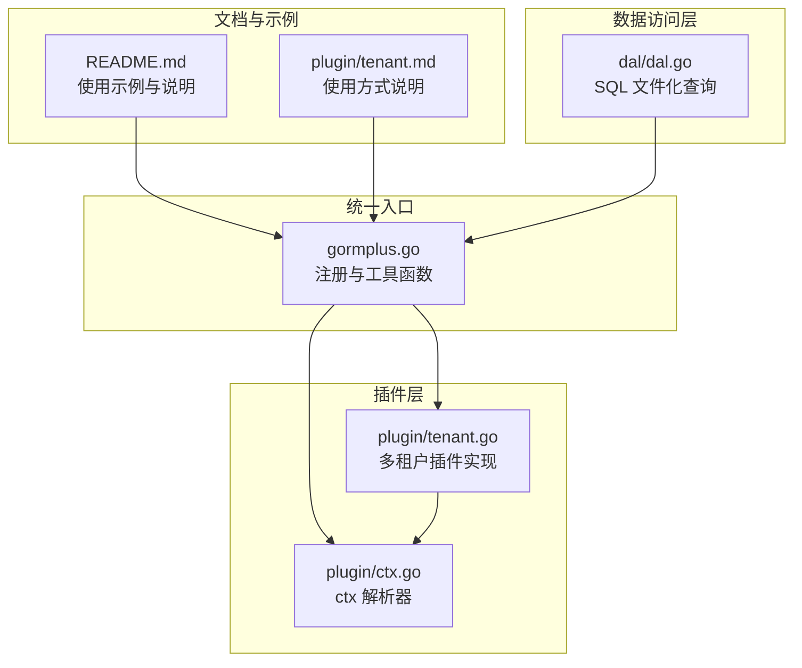
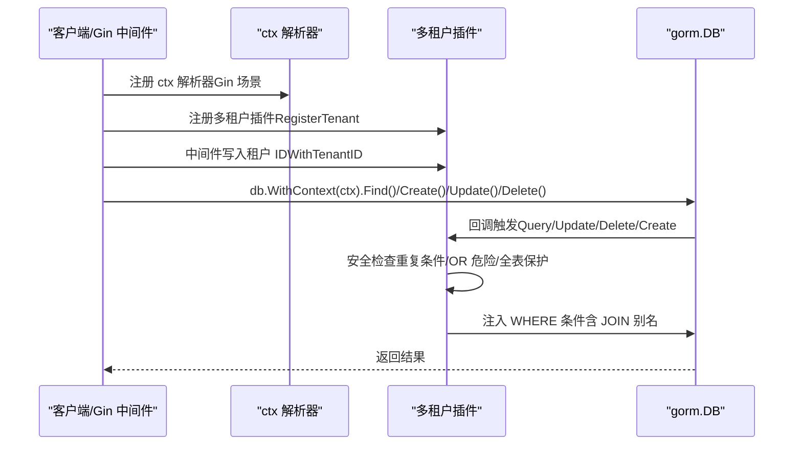
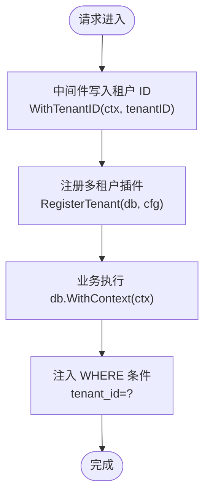
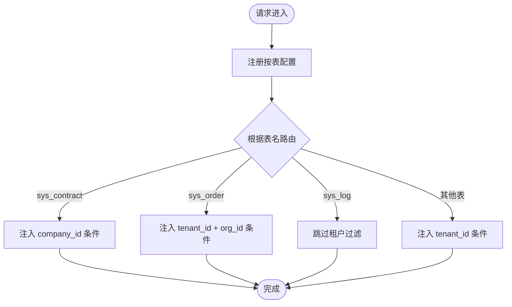
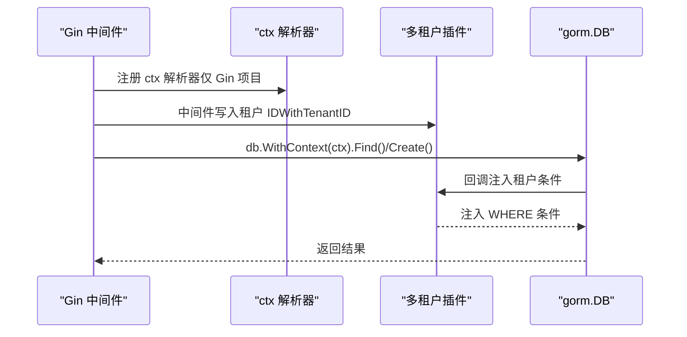
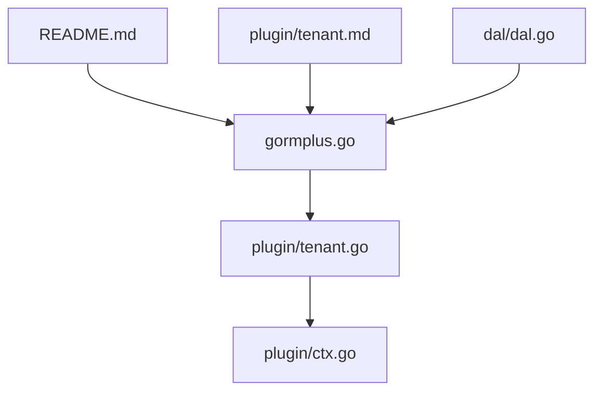

# 基础使用模式

<cite>
**本文引用的文件**
- [plugin/tenant.go](file://plugin/tenant.go)
- [plugin/tenant.md](file://plugin/tenant.md)
- [plugin/ctx.go](file://plugin/ctx.go)
- [gormplus.go](file://gormplus.go)
- [README.md](file://README.md)
- [dal/dal.go](file://dal/dal.go)
</cite>

## 目录
1. [简介](#简介)
2. [项目结构](#项目结构)
3. [核心组件](#核心组件)
4. [架构总览](#架构总览)
5. [详细组件分析](#详细组件分析)
6. [依赖分析](#依赖分析)
7. [性能考虑](#性能考虑)
8. [故障排查指南](#故障排查指南)
9. [结论](#结论)
10. [附录](#附录)

## 简介
本章节面向“多租户插件”的基础使用模式，聚焦三种核心场景：
- 单字段租户模式：最简单、向后兼容，适用于所有表统一使用一个租户字段。
- 多字段租户模式：同一张表注入多个租户字段，满足复杂的业务隔离需求。
- 按表配置租户模式：不同表使用不同的租户字段名，实现精细化隔离。

文档将系统讲解 TenantConfig 的关键字段：TenantField、TenantFields、TableFields 的作用与配置方式，并提供完整的中间件集成示例（Gin 框架），以及查询、创建等操作的自动租户条件注入效果说明。

## 项目结构
- 多租户插件位于 plugin/tenant.go，提供注册、注入、安全策略、上下文工具等能力。
- 上层统一入口 gormplus.go 暴露 RegisterTenant、WithTenantID 等便捷函数，简化业务接入。
- README.md 提供快速开始、多租户使用示例与最佳实践。
- plugin/ctx.go 提供 ctx 解析器，解决 Gin/Go-Zero/Fiber 等框架的 ctx 类型差异。
- dal/dal.go 提供 SQL 文件化查询能力，与多租户插件协同工作。



图表来源
- [plugin/tenant.go](file://plugin/tenant.go)
- [plugin/ctx.go](file://plugin/ctx.go)
- [gormplus.go](file://gormplus.go)
- [README.md](file://README.md)
- [plugin/tenant.md](file://plugin/tenant.md)
- [dal/dal.go](file://dal/dal.go)

章节来源
- [plugin/tenant.go](file://plugin/tenant.go)
- [gormplus.go](file://gormplus.go)
- [README.md](file://README.md)
- [plugin/tenant.md](file://plugin/tenant.md)
- [plugin/ctx.go](file://plugin/ctx.go)
- [dal/dal.go](file://dal/dal.go)

## 核心组件
- 多租户插件注册与生命周期
  - RegisterTenant：一次性注册到 gorm.DB，自动在 Query/Update/Delete/Create 回调阶段注入租户条件。
  - NewTenantPlugin：工厂函数，返回插件实例供手动 db.Use() 注册。
- 配置结构 TenantConfig[T]
  - TenantField/TenantFields/TableFields：决定注入的字段集合与来源优先级。
  - AutoInjectJoinTables/ExcludeJoinTables/JoinTableOverrides：控制 JOIN 关联表的租户注入行为。
  - AllowGlobalUpdate/AllowGlobalDelete/DuplicatePolicy/AllowOverrideTenantID：安全与策略控制。
  - InjectMode/ExcludeTables/GetTenantID：注入方式、排除表、默认取值函数。
- 上下文工具
  - WithTenantID/TenantIDFromCtx/SkipTenant/AllowGlobalOperation/WithOverrideTenantID：在中间件中写入/读取租户 ID，或临时放宽限制。
- ctx 解析器
  - RegisterCtxResolver：屏蔽 Gin/Go-Zero/Fiber 的 ctx 类型差异，确保插件能从 *gin.Context 读取 Request.Context()。

章节来源
- [plugin/tenant.go](file://plugin/tenant.go)
- [gormplus.go](file://gormplus.go)
- [plugin/ctx.go](file://plugin/ctx.go)

## 架构总览
多租户插件通过 gorm 的回调钩子在执行前注入租户条件，支持：
- Query/Update/Delete：自动追加 WHERE 条件
- Create：反射填充结构体的租户字段
- JOIN：自动解析关联表与别名，注入对应租户条件
- 安全保护：重复条件跳过、OR 绕过拒绝、全表更新/删除保护、覆盖租户 ID（可选）



图表来源
- [plugin/tenant.go](file://plugin/tenant.go)
- [plugin/ctx.go](file://plugin/ctx.go)
- [gormplus.go](file://gormplus.go)

## 详细组件分析

### 三种基础使用场景

#### 场景一：单字段租户模式（最简单，向后兼容）
- 适用：所有表统一使用一个租户字段（如 tenant_id）。
- 配置要点：
  - TenantField 指定字段名
  - ExcludeTables 可排除公共表（如 sys_config、sys_dict）
- 中间件写法：在 Gin 中间件中调用 WithTenantID 写入租户 ID。
- 效果：查询自动追加 WHERE `tenant_id` = ?；创建自动填充 tenant_id 字段。



图表来源
- [plugin/tenant.go](file://plugin/tenant.go)
- [gormplus.go](file://gormplus.go)

章节来源
- [plugin/tenant.go](file://plugin/tenant.go)
- [gormplus.go](file://gormplus.go)
- [README.md](file://README.md)

#### 场景二：多字段租户模式（同一张表注入多个租户字段）
- 适用：同一张表需要同时满足多个维度的租户隔离（如 tenant_id + org_id）。
- 配置要点：
  - TenantFields 指定多个字段，每个字段可独立配置 GetTenantID 取值函数。
- 中间件写法：在 Gin 中间件中写入多个上下文值，插件按字段分别取值。
- 效果：WHERE `tenant_id` = ? AND `org_id` = ?。

```mermaid
flowchart TD
Start(["请求进入"]) --> Middleware["中间件写入多个值<br/>WithTenantID(ctx, t1)<br/>ctx = context.WithValue(ctx, \"orgID\", t2)"]
Middleware --> Register["注册多字段租户配置"]
Register --> Exec["业务执行 db.WithContext(ctx)"]
Exec --> Inject["注入多个 WHERE 条件<br/>tenant_id=? AND org_id=?"]
Inject --> Done(["完成"])
```

图表来源
- [plugin/tenant.go](file://plugin/tenant.go)
- [gormplus.go](file://gormplus.go)

章节来源
- [plugin/tenant.go](file://plugin/tenant.go)
- [gormplus.go](file://gormplus.go)
- [README.md](file://README.md)

#### 场景三：按表配置租户模式（不同表用不同字段名）
- 适用：不同表使用不同的租户字段名，或某些表需要跳过租户过滤。
- 配置要点：
  - TenantField 作为兜底字段
  - TableFields 为具体表指定字段集合；空 slice 表示该表跳过租户过滤
  - ExcludeTables 排除公共表
- 效果：
  - sys_contract：WHERE `company_id` = ?
  - sys_order：WHERE `tenant_id` = ? AND `org_id` = ?
  - sys_log：无租户条件（跳过）
  - 其他表：WHERE `tenant_id` = ?



图表来源
- [plugin/tenant.go](file://plugin/tenant.go)
- [gormplus.go](file://gormplus.go)

章节来源
- [plugin/tenant.go](file://plugin/tenant.go)
- [gormplus.go](file://gormplus.go)
- [README.md](file://README.md)

### TenantConfig 关键字段详解

- TenantField
  - 作用：单字段快捷配置，所有表统一使用该字段名。
  - 适用：单字段租户模式。
- TenantFields
  - 作用：同一张表注入多个租户字段，每个字段可独立配置取值函数。
  - 适用：多字段租户模式。
- TableFields
  - 作用：按表精确配置字段集合；空 slice 表示该表跳过租户过滤。
  - 适用：按表配置租户模式。
- AutoInjectJoinTables/ExcludeJoinTables/JoinTableOverrides
  - 作用：控制 JOIN 关联表的租户注入行为；可排除公共表或覆盖个别表的字段名。
  - 适用：联表查询自动注入租户条件。
- AllowGlobalUpdate/AllowGlobalDelete
  - 作用：是否允许无业务条件的全表 Update/Delete。
  - 适用：批量任务、数据迁移等场景。
- DuplicatePolicy
  - 作用：当业务代码已手动写了租户字段条件时的处理策略（跳过/替换/追加）。
  - 适用：与 OR 危险检测配合，防止租户隔离被绕过。
- AllowOverrideTenantID
  - 作用：是否允许业务代码覆盖中间件注入的租户 ID。
  - 适用：超管后台、数据迁移等特殊场景。
- InjectMode/ExcludeTables/GetTenantID
  - 作用：注入方式、排除表、默认取值函数。
  - 适用：通用配置与扩展。

章节来源
- [plugin/tenant.go](file://plugin/tenant.go)
- [gormplus.go](file://gormplus.go)

### 中间件集成（Gin 框架）
- ctx 解析器注册：在 Gin 项目中必须注册 ctx 解析器，以便插件从 *gin.Context 读取 Request.Context()。
- 中间件写入租户 ID：在中间件中调用 WithTenantID 写入租户 ID，随后在业务层直接使用 db.WithContext(ctx)。
- 超管/临时放开：在特权接口中使用 SkipTenant 或 AllowGlobalOperation。



图表来源
- [plugin/ctx.go](file://plugin/ctx.go)
- [plugin/tenant.go](file://plugin/tenant.go)
- [gormplus.go](file://gormplus.go)

章节来源
- [plugin/ctx.go](file://plugin/ctx.go)
- [plugin/tenant.go](file://plugin/tenant.go)
- [gormplus.go](file://gormplus.go)
- [plugin/tenant.md](file://plugin/tenant.md)
- [README.md](file://README.md)

### 业务代码示例（自动租户条件注入）
- 查询：db.WithContext(ctx).Find(&list) → 自动追加 WHERE `tenant_id` = ?（或多个字段条件）
- 创建：db.WithContext(ctx).Create(&entity) → 自动填充实体的租户字段
- 联表：db.WithContext(ctx).Table("a").Joins("...").Find(&list) → 自动为关联表注入租户条件（别名自动识别）
- 全表保护：无业务条件的 Update/Delete 会被拒绝（可通过 AllowGlobalOperation 临时放开）

章节来源
- [plugin/tenant.go](file://plugin/tenant.go)
- [gormplus.go](file://gormplus.go)
- [README.md](file://README.md)

## 依赖分析
- 插件依赖 gorm 的回调机制（Query/Update/Delete/Create）进行条件注入。
- ctx 解析器依赖业务框架的 ctx 类型差异，统一解析到标准 context。
- 上层统一入口 gormplus.go 将插件能力暴露为易用 API，减少业务层样板代码。



图表来源
- [gormplus.go](file://gormplus.go)
- [plugin/tenant.go](file://plugin/tenant.go)
- [plugin/ctx.go](file://plugin/ctx.go)
- [README.md](file://README.md)
- [plugin/tenant.md](file://plugin/tenant.md)
- [dal/dal.go](file://dal/dal.go)

章节来源
- [gormplus.go](file://gormplus.go)
- [plugin/tenant.go](file://plugin/tenant.go)
- [plugin/ctx.go](file://plugin/ctx.go)
- [README.md](file://README.md)
- [plugin/tenant.md](file://plugin/tenant.md)
- [dal/dal.go](file://dal/dal.go)

## 性能考虑
- 注入策略：DuplicatePolicy=PolicyAppend 时性能最优，但可能产生重复条件；PolicySkip/PolicyReplace 更安全。
- JOIN 自动注入：默认开启，别名自动识别；如需提升性能可关闭 AutoInjectJoinTables 并按需手动注入。
- 全表保护：默认禁止无业务条件的 Update/Delete，避免误操作带来的全表扫描风险。

章节来源
- [plugin/tenant.go](file://plugin/tenant.go)

## 故障排查指南
- 重复条件与 OR 绕过
  - 现象：业务代码已写租户字段条件时，插件默认跳过注入；若在 OR 中出现租户字段，插件会拒绝执行。
  - 处理：调整 DuplicatePolicy 或重构 SQL，避免在 OR 中使用租户字段。
- 全表保护被拒绝
  - 现象：无业务条件的 Update/Delete 报错。
  - 处理：添加业务 WHERE 条件，或使用 AllowGlobalOperation 临时放开。
- 覆盖租户 ID 无效
  - 现象：WithOverrideTenantID 写入的值未生效。
  - 处理：确认注册时 AllowOverrideTenantID=true，且 ctx 传入 db.WithContext(ctx)。
- Gin 中间件读取不到租户 ID
  - 现象：插件无法从 *gin.Context 读取 Request.Context()。
  - 处理：注册 ctx 解析器，或改为直接传 *gin.Context 给 db.WithContext()。

章节来源
- [plugin/tenant.go](file://plugin/tenant.go)
- [plugin/ctx.go](file://plugin/ctx.go)
- [gormplus.go](file://gormplus.go)

## 结论
多租户插件通过统一的配置与回调机制，在不侵入业务代码的前提下实现了自动化的租户隔离。三种基础使用模式覆盖了从简单到复杂的典型场景，结合中间件与上下文工具，可快速落地到 Gin 等主流框架。通过合理配置 TenantConfig 的关键字段与策略，既能保证数据安全，又能兼顾性能与灵活性。

## 附录
- 快速开始与示例参考：README.md 中的“多租户插件”章节
- 上层统一入口：gormplus.go 的 RegisterTenant/WithTenantID 等函数
- ctx 解析器：plugin/ctx.go 的 RegisterCtxResolver/resolveCtx
- SQL 文件化查询：dal/dal.go 的 Query/Exec 等能力，与多租户插件协同使用

章节来源
- [README.md](file://README.md)
- [gormplus.go](file://gormplus.go)
- [plugin/ctx.go](file://plugin/ctx.go)
- [dal/dal.go](file://dal/dal.go)