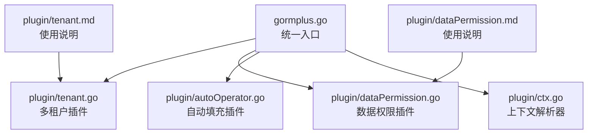
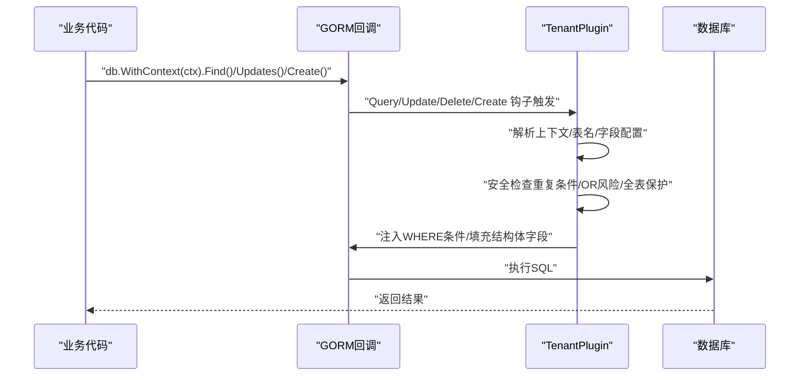
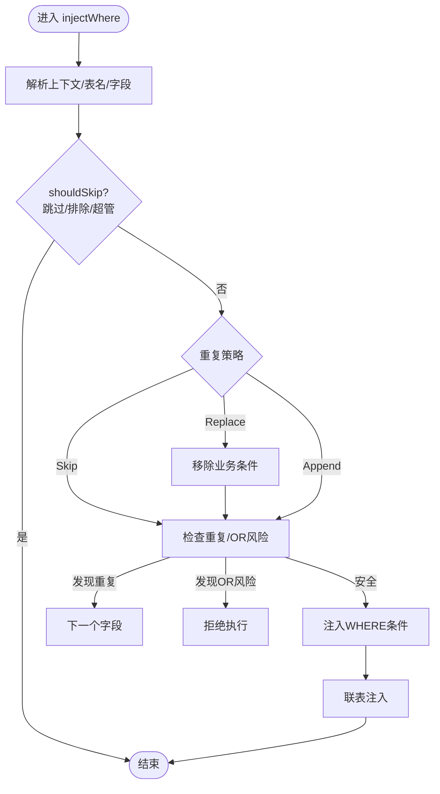
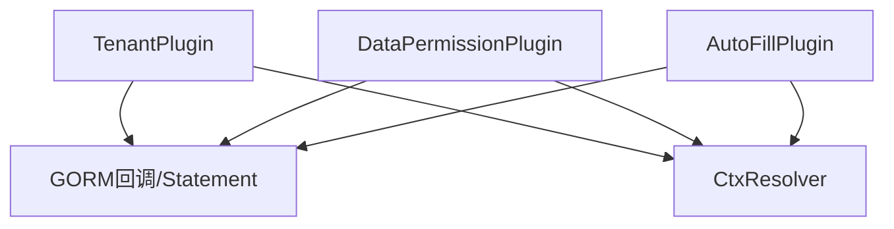

# 多租户插件

<cite>
**本文引用的文件**
- [tenant.go](file://plugin/tenant.go)
- [tenant.md](file://plugin/tenant.md)
- [ctx.go](file://plugin/ctx.go)
- [autoOperator.go](file://plugin/autoOperator.go)
- [dataPermission.go](file://plugin/dataPermission.go)
- [dataPermission.md](file://plugin/dataPermission.md)
- [gormplus.go](file://gormplus.go)
- [version.go](file://version.go)
</cite>

## 目录
1. [简介](#简介)
2. [项目结构](#项目结构)
3. [核心组件](#核心组件)
4. [架构总览](#架构总览)
5. [详细组件分析](#详细组件分析)
6. [依赖分析](#依赖分析)
7. [性能考虑](#性能考虑)
8. [故障排查指南](#故障排查指南)
9. [结论](#结论)
10. [附录](#附录)

## 简介
本多租户插件基于 GORM Callback 机制，在 Query/Update/Delete/Create 等关键生命周期钩子中自动注入租户条件，实现“零侵入”的多租户隔离。插件支持三种使用模式：单字段租户、多字段租户、按表配置租户；具备联表查询自动注入与别名识别能力；提供重复条件检测、OR 绕过防护、全表操作保护等安全机制；并通过上下文工具支持覆盖租户 ID 与超管跳过等特殊场景。

## 项目结构
- 插件核心位于 plugin 目录，包含多租户、数据权限、自动填充等插件实现与文档。
- gormplus.go 提供统一入口，聚合各插件能力，并暴露简化 API。
- version.go 提供版本信息。



图表来源
- [gormplus.go:1-120](file://gormplus.go#L1-L120)
- [tenant.go:1-120](file://plugin/tenant.go#L1-L120)
- [dataPermission.go:1-120](file://plugin/dataPermission.go#L1-L120)
- [autoOperator.go:1-120](file://plugin/autoOperator.go#L1-L120)
- [ctx.go:1-44](file://plugin/ctx.go#L1-L44)

章节来源
- [gormplus.go:1-120](file://gormplus.go#L1-L120)
- [version.go:1-4](file://version.go#L1-L4)

## 核心组件
- 多租户插件（TenantPlugin）
  - 通过 GORM Callback 注册 Query/Update/Delete/Create 钩子，自动注入/填充租户条件。
  - 支持单字段、多字段、按表配置三种模式。
  - 支持联表自动注入与别名识别。
  - 安全策略：重复条件跳过、OR 绕过拒绝、全表保护。
- 上下文解析器（CtxResolver）
  - 解决 Gin 等框架传入 *gin.Context 时无法读取中间件写入的 Request.Context 的问题。
- 数据权限插件（DataPermissionPlugin）
  - 通过中间件注入函数在回调阶段追加数据权限条件。
- 自动填充插件（AutoFillPlugin）
  - 在 Create/Update 时自动填充字段值（如创建人、更新人等）。

章节来源
- [tenant.go:143-336](file://plugin/tenant.go#L143-L336)
- [ctx.go:16-44](file://plugin/ctx.go#L16-L44)
- [dataPermission.go:106-266](file://plugin/dataPermission.go#L106-L266)
- [autoOperator.go:140-309](file://plugin/autoOperator.go#L140-L309)

## 架构总览
多租户插件在 GORM 生命周期中通过回调钩子拦截 SQL 构造过程，结合上下文解析器读取租户 ID，按配置注入 WHERE 条件或填充结构体字段。对于联表查询，插件解析 JOIN 子句中的表名与别名，自动为目标表注入租户条件。



图表来源
- [tenant.go:355-381](file://plugin/tenant.go#L355-L381)
- [tenant.go:529-595](file://plugin/tenant.go#L529-L595)
- [tenant.go:749-779](file://plugin/tenant.go#L749-L779)

## 详细组件分析

### 多租户插件（TenantPlugin）
- 注册钩子
  - Query/Update/Delete：在执行前注册检查与注入逻辑。
  - Create：在创建前注册结构体字段填充逻辑。
- 注入策略
  - 注入方式：ModeScopes/ModeWhere（底层均通过 db.Statement.Where 注入）。
  - 重复策略：PolicySkip（默认）、PolicyReplace、PolicyAppend。
- 字段配置
  - 单字段：TenantField。
  - 多字段：TenantFields。
  - 按表配置：TableFields。
- 联表注入
  - AutoInjectJoinTables 控制是否自动注入。
  - ExcludeJoinTables 排除公共表。
  - JoinTableOverrides 覆盖特定关联表的字段与取值函数。
  - 别名识别：parseJoinTable 自动解析 JOIN 中的表名与别名。
- 安全保护
  - 重复条件检测：checkTenantFieldSafety。
  - OR 绕过防护：containsTenantField + checkExprForTenantField。
  - 全表保护：checkGlobalUpdate/checkGlobalDelete。
- 特殊场景
  - 覆盖租户 ID：AllowOverrideTenantID + WithOverrideTenantID。
  - 超管跳过：SkipTenant。
  - 临时放开全表保护：AllowGlobalOperation。

```mermaid
classDiagram
class TenantConfig {
+string TenantField
+[]TenantFieldConfig TenantFields
+map[string][]TenantFieldConfig TableFields
+*bool AutoInjectJoinTables
+[]string ExcludeJoinTables
+[]JoinTenantConfig JoinTableOverrides
+bool AllowGlobalUpdate
+bool AllowGlobalDelete
+bool AllowOverrideTenantID
+DuplicateTenantPolicy DuplicatePolicy
+InjectMode InjectMode
+[]string ExcludeTables
+GetTenantID(ctx) (T,bool)
}
class TenantFieldConfig {
+string Field
+GetTenantID(ctx) (T,bool)
}
class JoinTenantConfig {
+string Table
+string Field
+GetTenantID(ctx) (T,bool)
}
class tenantPlugin {
-TenantConfig cfg
-[]TenantFieldConfig defaultField
-map[string][]TenantFieldConfig tableFields
-bool autoInjectJoin
-map[string]struct{} excludeJoinSet
-map[string]JoinTenantConfig joinOverrideMap
-map[string]struct{} excludeSet
+Initialize(db) error
+injectWhere(db)
+injectCreate(db)
+injectJoinWhere(db,ctx)
+resolveTenantID(ctx,getter) (T,bool)
}
TenantConfig --> TenantFieldConfig : "包含"
TenantConfig --> JoinTenantConfig : "包含"
tenantPlugin --> TenantConfig : "使用"
```

图表来源
- [tenant.go:239-336](file://plugin/tenant.go#L239-L336)
- [tenant.go:340-349](file://plugin/tenant.go#L340-L349)



图表来源
- [tenant.go:529-595](file://plugin/tenant.go#L529-L595)
- [tenant.go:385-482](file://plugin/tenant.go#L385-L482)
- [tenant.go:644-713](file://plugin/tenant.go#L644-L713)

章节来源
- [tenant.go:355-381](file://plugin/tenant.go#L355-L381)
- [tenant.go:529-595](file://plugin/tenant.go#L529-L595)
- [tenant.go:644-713](file://plugin/tenant.go#L644-L713)
- [tenant.go:809-865](file://plugin/tenant.go#L809-L865)
- [tenant.go:940-953](file://plugin/tenant.go#L940-L953)

### 使用模式与配置详解
- 单字段租户（最简单，向后兼容）
  - 配置：TenantField + ExcludeTables。
  - 中间件：WithTenantID 写入租户 ID。
- 多字段租户（同一张表注入多个租户字段）
  - 配置：TenantFields，每字段可独立 GetTenantID。
- 按表配置租户（不同表用不同字段名）
  - 配置：TableFields，key 为小写表名；值为空 slice 时表示该表跳过。
- 联表查询（JOIN 自动注入，别名自动识别）
  - 配置：AutoInjectJoinTables/ExcludeJoinTables/JoinTableOverrides。
  - 别名解析：parseJoinTable。
- 安全保护
  - 重复条件：PolicySkip（默认）。
  - OR 绕过：检测到租户字段出现在 OR 条件中直接拒绝。
  - 全表保护：无业务条件的 Update/Delete 被拒绝，可通过 AllowGlobalOperation 临时放开。
- 覆盖租户 ID 与超管跳过
  - AllowOverrideTenantID=true 时，WithOverrideTenantID 可覆盖租户 ID。
  - SkipTenant 可完全跳过租户过滤（超管专用）。

章节来源
- [tenant.go:15-128](file://plugin/tenant.go#L15-L128)
- [tenant.go:239-336](file://plugin/tenant.go#L239-L336)
- [tenant.go:644-713](file://plugin/tenant.go#L644-L713)
- [tenant.go:809-865](file://plugin/tenant.go#L809-L865)
- [tenant.go:1139-1222](file://plugin/tenant.go#L1139-L1222)

### 上下文解析器与中间件集成
- 上下文解析器
  - RegisterCtxResolver：注册框架特定的 ctx 解析逻辑（如 Gin）。
  - resolveCtx：统一解析入口，屏蔽框架差异。
- 中间件写入租户 ID
  - WithTenantID：在中间件中写入租户 ID。
  - TenantIDFromCtx：读取租户 ID。
- Gin 集成示例
  - 在 gin 中注册解析器与中间件，直接传 *gin.Context 即可。

章节来源
- [ctx.go:16-44](file://plugin/ctx.go#L16-L44)
- [tenant.md:1-30](file://plugin/tenant.md#L1-L30)
- [tenant.go:1160-1195](file://plugin/tenant.go#L1160-L1195)

### 与其他插件的协作
- 数据权限插件
  - 通过中间件注入函数在回调阶段追加数据权限条件。
  - 与多租户插件并行工作，共同实现“表级隔离 + 数据范围”双重保护。
- 自动填充插件
  - 在 Create/Update 时自动填充字段值（如创建人、更新人），与多租户插件互不冲突。

章节来源
- [dataPermission.go:106-266](file://plugin/dataPermission.go#L106-L266)
- [autoOperator.go:140-309](file://plugin/autoOperator.go#L140-L309)

## 依赖分析
- 组件耦合
  - TenantPlugin 依赖 GORM 的 Callback 与 Statement，依赖上下文解析器。
  - 与数据权限插件、自动填充插件通过独立回调共存。
- 外部依赖
  - gorm.io/gorm、gorm.io/gorm/clause、gorm.io/gorm/schema。
- 循环依赖
  - 插件间无循环依赖，通过 db.Use 注册，彼此独立。



图表来源
- [tenant.go:355-381](file://plugin/tenant.go#L355-L381)
- [dataPermission.go:140-162](file://plugin/dataPermission.go#L140-L162)
- [autoOperator.go:190-208](file://plugin/autoOperator.go#L190-L208)

章节来源
- [tenant.go:355-381](file://plugin/tenant.go#L355-L381)
- [dataPermission.go:140-162](file://plugin/dataPermission.go#L140-L162)
- [autoOperator.go:190-208](file://plugin/autoOperator.go#L190-L208)

## 性能考虑
- 注入方式
  - ModeScopes/ModeWhere 底层一致，均通过 db.Statement.Where 注入，避免额外开销。
- 重复策略
  - PolicyAppend 性能最优（不扫描已有条件），但可能产生重复条件；适合确定业务代码不会手动写租户条件的场景。
  - PolicySkip 默认更安全，会检测 OR 危险并跳过重复注入。
  - PolicyReplace 会在严格模式下先移除业务条件再注入，保证隔离但略增开销。
- 联表注入
  - AutoInjectJoinTables=true 时，解析 JOIN 子句并注入条件，对性能影响有限；可通过 ExcludeJoinTables 与 JoinTableOverrides 精准控制。
- 全表保护
  - 无业务条件的 Update/Delete 会被拒绝，避免误操作带来的全表扫描风险。

[本节为通用指导，无需具体文件分析]

## 故障排查指南
- “检测到租户字段出现在 OR 条件中，可能绕过租户隔离”
  - 现象：执行 WHERE (tenant_id = ? OR ...) 抛错。
  - 处理：将 OR 条件改为 AND 条件，或使用 SkipTenant(ctx) 临时跳过（仅特权场景）。
- “禁止无业务条件的全表 Update/Delete”
  - 现象：未带 WHERE 条件的 Update/Delete 抛错。
  - 处理：添加业务 WHERE 条件，或使用 AllowGlobalOperation(ctx) 临时放开。
- “重复条件导致注入异常”
  - 现象：业务代码已写租户条件，插件仍注入造成重复。
  - 处理：使用 PolicySkip（默认）自动跳过；若需强制替换，使用 PolicyReplace 并确保业务代码不包含 OR。
- “联表未注入租户条件”
  - 现象：JOIN 关联表未自动注入 tenant_id。
  - 处理：检查 AutoInjectJoinTables/ExcludeJoinTables/JoinTableOverrides 配置；确认别名解析正确。
- “覆盖租户 ID 无效”
  - 现象：WithOverrideTenantID 写入的值未生效。
  - 处理：确认 TenantConfig.AllowOverrideTenantID=true；否则仅能使用中间件注入的租户 ID。

章节来源
- [tenant.go:385-482](file://plugin/tenant.go#L385-L482)
- [tenant.go:809-865](file://plugin/tenant.go#L809-L865)
- [tenant.go:1197-1222](file://plugin/tenant.go#L1197-L1222)

## 结论
本多租户插件通过 GORM Callback 机制实现了对 Query/Update/Delete/Create 的全面保护，具备灵活的字段配置、联表自动注入与别名识别、完善的重复条件与 OR 绕过防护、全表操作保护等安全特性。结合上下文解析器与中间件集成，可在不改动业务代码的前提下实现零侵入的多租户隔离。对于需要超管操作、跨租户查询或覆盖租户 ID 的特殊场景，提供了 SkipTenant 与 WithOverrideTenantID 等工具，满足运维与管理后台需求。

[本节为总结，无需具体文件分析]

## 附录
- 版本信息
  - 当前版本：v1.0.13。
- 使用示例与集成要点
  - Gin 项目需注册上下文解析器与中间件，直接传 *gin.Context 即可。
  - 多租户、数据权限、自动填充插件可并行注册，互不冲突。

章节来源
- [version.go:1-4](file://version.go#L1-L4)
- [tenant.md:1-30](file://plugin/tenant.md#L1-L30)
- [dataPermission.md:1-50](file://plugin/dataPermission.md#L1-L50)