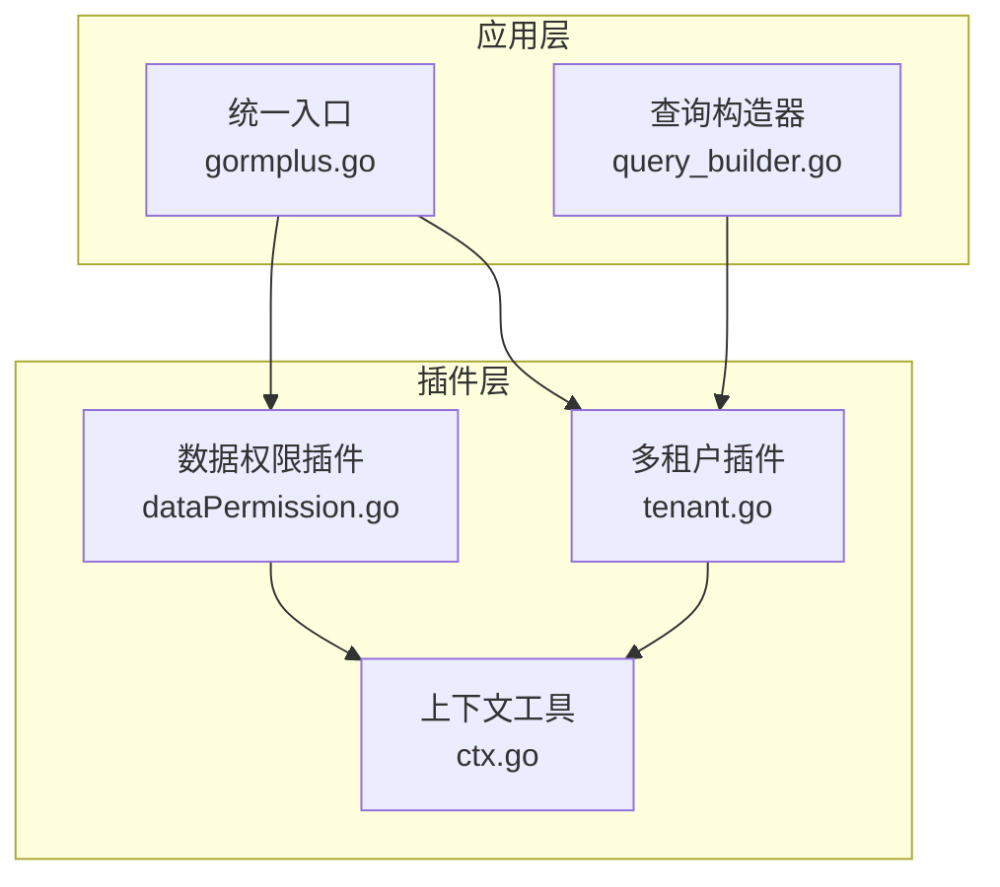
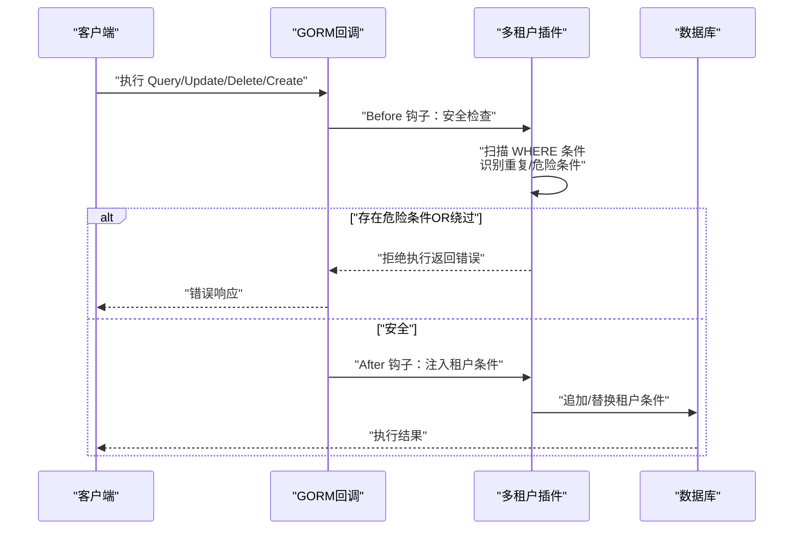
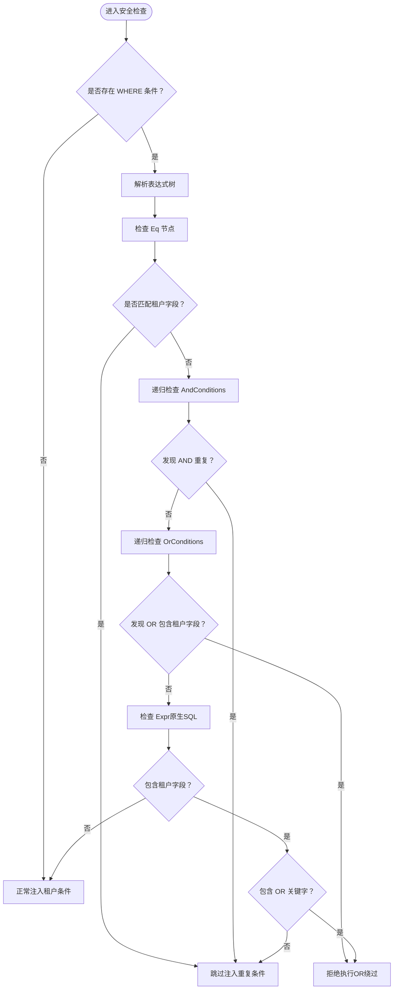
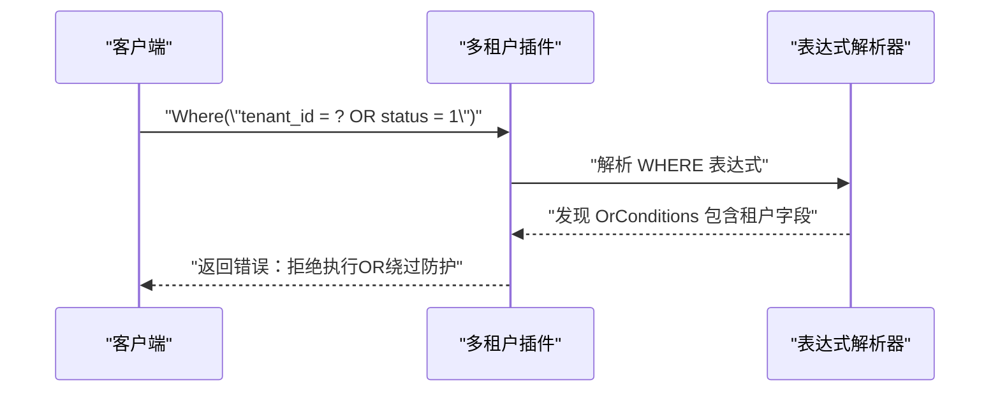
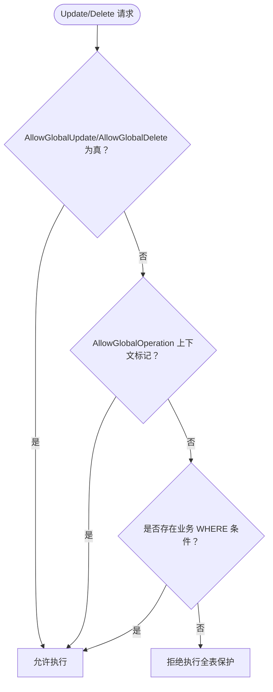
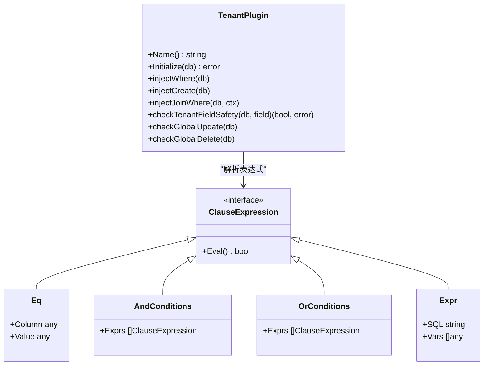
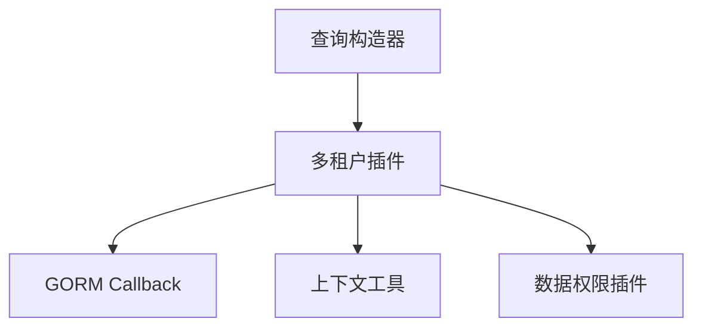

# 安全保护机制

<cite>
**本文档引用的文件**
- [tenant.go](file://plugin/tenant.go)
- [tenant.md](file://plugin/tenant.md)
- [dataPermission.go](file://plugin/dataPermission.go)
- [dataPermission.md](file://plugin/dataPermission.md)
- [ctx.go](file://plugin/ctx.go)
- [gormplus.go](file://gormplus.go)
- [query_builder.go](file://query/query_builder.go)
- [README.md](file://README.md)
</cite>

## 目录
1. [简介](#简介)
2. [项目结构](#项目结构)
3. [核心组件](#核心组件)
4. [架构概览](#架构概览)
5. [详细组件分析](#详细组件分析)
6. [依赖分析](#依赖分析)
7. [性能考虑](#性能考虑)
8. [故障排查指南](#故障排查指南)
9. [结论](#结论)
10. [附录](#附录)

## 简介
本文件系统性阐述多租户插件的安全保护机制，重点覆盖三大核心安全功能：
- 重复条件检测机制：防止租户条件重复注入，避免重复条件导致的逻辑混乱与性能浪费
- OR 绕过防护：检测并拒绝包含租户字段的 OR 条件，防止租户隔离被绕过
- 全表操作保护：禁止无业务条件的 Update/Delete，防止误操作造成大规模数据影响

通过对 WHERE 条件扫描、表达式解析、危险条件识别等算法的深入分析，帮助开发者准确理解安全检查的工作原理，并提供触发场景与错误信息示例。同时说明 AllowGlobalOperation 上下文标记的使用方式，以及安全最佳实践与常见问题的解决方案。

## 项目结构
多租户插件位于 plugin 目录，围绕 GORM Callback 钩子实现安全保护与租户条件注入。核心文件与职责如下：
- plugin/tenant.go：多租户插件实现，包含安全检查、条件注入、全表保护、上下文工具等
- plugin/tenant.md：使用示例与快速入门
- plugin/dataPermission.go：数据权限插件（与多租户协同工作）
- plugin/dataPermission.md：数据权限插件使用说明
- plugin/ctx.go：上下文解析器与工具函数
- gormplus.go：统一入口与对外 API
- query/query_builder.go：链式查询构造器（与安全保护的交互）

**图表来源**
- [tenant.go](file://plugin/tenant.go)
- [dataPermission.go](file://plugin/dataPermission.go)
- [ctx.go](file://plugin/ctx.go)
- [gormplus.go](file://gormplus.go)
- [query_builder.go](file://query/query_builder.go)

**章节来源**
- [tenant.go](file://plugin/tenant.go)
- [dataPermission.go](file://plugin/dataPermission.go)
- [ctx.go](file://plugin/ctx.go)
- [gormplus.go](file://gormplus.go)
- [query_builder.go](file://query/query_builder.go)

## 核心组件
- 安全检查模块：负责扫描 WHERE 条件、解析表达式、识别危险条件（OR 绕过），并根据策略决定是否注入租户条件
- 条件注入模块：在 Query/Update/Delete/Create 前注入租户条件，支持多字段、多表、联表自动注入
- 全表保护模块：在 Update/Delete 前检查是否存在业务条件，若无业务条件则拒绝执行
- 上下文工具：提供 SkipTenant、AllowGlobalOperation、WithTenantID 等上下文标记与值读取能力

**章节来源**
- [tenant.go](file://plugin/tenant.go)
- [ctx.go](file://plugin/ctx.go)

## 架构概览
多租户插件通过 GORM Callback 在关键生命周期钩子中执行安全检查与条件注入，形成“前置检查 + 自动注入”的安全架构。

**图表来源**
- [tenant.go](file://plugin/tenant.go)

**章节来源**
- [tenant.go](file://plugin/tenant.go)

## 详细组件分析

### 重复条件检测机制
- 目标：防止用户手动写入的租户条件与插件自动注入的条件重复
- 策略：
  - PolicySkip：默认策略，若发现已有 AND 条件包含租户字段，跳过注入
  - PolicyReplace：先移除业务代码的租户条件，再注入正确的租户值
  - PolicyAppend：不检查直接追加，性能最优但可能产生重复条件
- 算法流程：
  1) 读取 Statement.Clauses["WHERE"] 的表达式树
  2) 递归遍历表达式，识别 Eq/AndConditions/OrConditions/Expr 等节点
  3) 对 Eq 节点进行列名匹配，判断是否命中租户字段
  4) 对 AndConditions 递归检查子表达式
  5) 对 OrConditions 检测是否包含租户字段，一旦发现即拒绝执行
  6) 对 Expr（原生 SQL）进行字符串扫描，若包含租户字段且包含 OR 关键字则拒绝

**图表来源**
- [tenant.go](file://plugin/tenant.go)

**章节来源**
- [tenant.go](file://plugin/tenant.go)

### OR 绕过防护
- 触发条件：在 OR 条件中出现租户字段
- 防护策略：立即拒绝执行，返回明确的错误信息，提示使用 SkipTenant 进行跨租户查询
- 错误信息示例：
  - "tenant: 检测到租户字段 "tenant_id" 出现在 OR 条件中，可能绕过租户隔离，已拒绝执行。如需跨租户查询请使用 plugin.SkipTenant(ctx)"
  - "tenant: 原生 SQL 条件中检测到租户字段 "tenant_id" 与 OR 同时出现，可能绕过租户隔离，已拒绝执行。如需跨租户查询请使用 plugin.SkipTenant(ctx)"

**图表来源**
- [tenant.go](file://plugin/tenant.go)

**章节来源**
- [tenant.go](file://plugin/tenant.go)

### 全表操作保护
- 触发条件：Update/Delete 操作未包含业务 WHERE 条件（租户条件不算）
- 防护策略：
  - 默认拒绝：无业务条件的全表 Update/Delete 直接拒绝
  - 临时放宽：AllowGlobalOperation 上下文标记允许本次请求执行
  - 配置放宽：TenantConfig 中 AllowGlobalUpdate/AllowGlobalDelete 设为 true
- 错误信息示例：
  - "tenant: 禁止无业务条件的全表 Update（表: account），如需执行请使用 plugin.AllowGlobalOperation(ctx) 临时放开，或在 TenantConfig 中设置 AllowGlobalUpdate: true"
  - "tenant: 禁止无业务条件的全表 Delete（表: account），如需执行请使用 plugin.AllowGlobalOperation(ctx) 临时放开，或在 TenantConfig 中设置 AllowGlobalDelete: true"

**图表来源**
- [tenant.go](file://plugin/tenant.go)

**章节来源**
- [tenant.go](file://plugin/tenant.go)

### 条件注入与联表自动注入
- 注入时机：Query/Update/Delete 前置钩子注入，Create 前置钩子填充租户字段
- 注入策略：根据 DuplicatePolicy 决定是否扫描已有条件、是否移除重复条件
- 联表注入：解析 JOIN 子句，自动识别表名与别名，按配置为关联表注入租户条件
- 别名解析：支持 "LEFT JOIN table b ON ..."、"JOIN table AS alias ..." 等多种格式

**图表来源**
- [tenant.go](file://plugin/tenant.go)

**章节来源**
- [tenant.go](file://plugin/tenant.go)

## 依赖分析
- 多租户插件依赖 GORM 的 Callback 机制，在 Query/Update/Delete/Create 生命周期中注册钩子
- 与上下文工具协作，通过 WithTenantID/SkipTenant/AllowGlobalOperation 等上下文键值控制行为
- 与数据权限插件并行工作，共同实现数据隔离与访问控制

**图表来源**
- [tenant.go](file://plugin/tenant.go)
- [dataPermission.go](file://plugin/dataPermission.go)
- [ctx.go](file://plugin/ctx.go)
- [query_builder.go](file://query/query_builder.go)

**章节来源**
- [tenant.go](file://plugin/tenant.go)
- [dataPermission.go](file://plugin/dataPermission.go)
- [ctx.go](file://plugin/ctx.go)
- [query_builder.go](file://query/query_builder.go)

## 性能考虑
- PolicyAppend：不扫描已有条件，直接追加，性能最优，但可能产生重复条件
- PolicyReplace：需要先移除业务条件再注入，有一定开销，但能确保租户隔离
- PolicySkip：扫描表达式树，递归检查，性能适中，兼顾安全与性能
- 联表注入：解析 JOIN 子句，按需为关联表注入条件，避免不必要的注入

[本节为通用性能讨论，无需具体文件分析]

## 故障排查指南
- OR 绕过错误：检查 WHERE 条件中是否包含租户字段与 OR 的组合，必要时使用 SkipTenant 进行跨租户查询
- 全表保护错误：为 Update/Delete 添加业务 WHERE 条件，或使用 AllowGlobalOperation 临时放宽，或在配置中开启 AllowGlobalUpdate/AllowGlobalDelete
- 重复条件问题：确认是否已手动写入租户条件，选择合适的 DuplicatePolicy 策略
- 联表注入异常：检查 JOIN 子句格式与表名/别名解析，确认 ExcludeJoinTables 与 JoinTableOverrides 配置

**章节来源**
- [tenant.go](file://plugin/tenant.go)
- [README.md](file://README.md)

## 结论
多租户插件通过“重复条件检测 + OR 绕过防护 + 全表操作保护”三位一体的安全机制，有效保障了多租户场景下的数据隔离与操作安全。结合灵活的上下文标记与配置选项，既能满足严格的隔离需求，又能在特定场景下提供必要的灵活性。建议在生产环境中默认启用安全保护，并通过 AllowGlobalOperation 与配置项谨慎放宽限制。

[本节为总结性内容，无需具体文件分析]

## 附录

### 安全最佳实践
- 默认使用 PolicySkip，确保在业务代码已写租户条件时跳过注入
- 严格禁止在 OR 条件中使用租户字段，必要时使用 SkipTenant 进行跨租户查询
- 为 Update/Delete 操作始终添加业务 WHERE 条件，避免误操作
- 使用 AllowGlobalOperation 仅在内部批量任务或数据迁移等受控场景临时放宽
- 对联表查询启用自动注入，确保关联表也具备租户隔离

### 常见安全问题与解决方案
- 误删全表数据：为 Update/Delete 添加业务条件，或使用 AllowGlobalOperation 临时放宽
- 租户隔离被绕过：避免在 OR 条件中使用租户字段，使用 SkipTenant 进行跨租户查询
- 重复注入导致性能下降：使用 PolicySkip 或 PolicyReplace，避免 PolicyAppend 导致的重复条件

**章节来源**
- [tenant.go](file://plugin/tenant.go)
- [README.md](file://README.md)