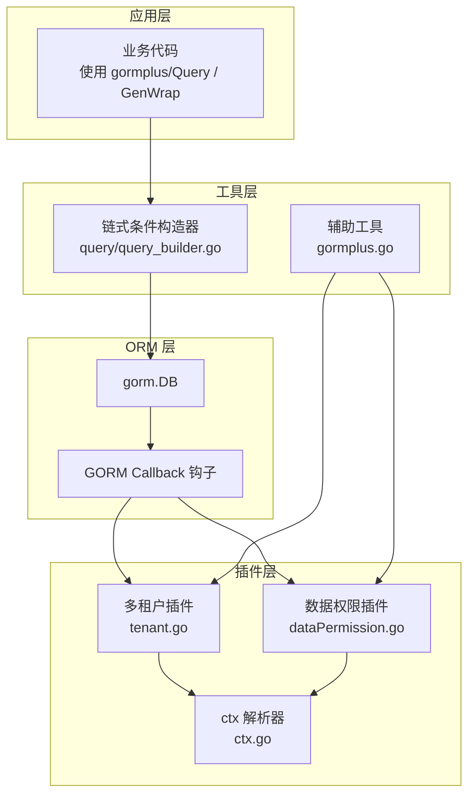
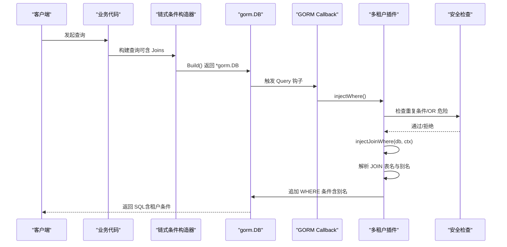
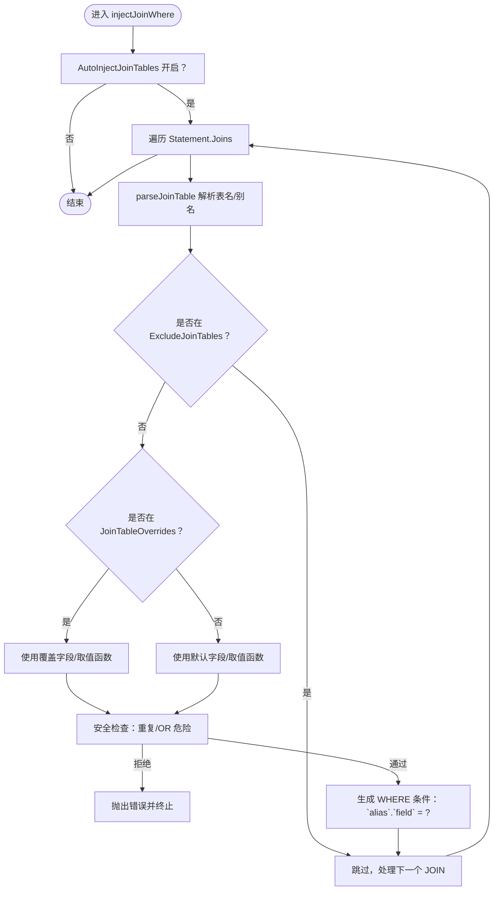
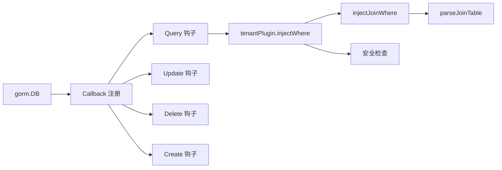

# 联表查询注入

<cite>
**本文引用的文件**   
- [plugin/tenant.go](file://plugin/tenant.go)
- [plugin/tenant.md](file://plugin/tenant.md)
- [plugin/dataPermission.go](file://plugin/dataPermission.go)
- [plugin/dataPermission.md](file://plugin/dataPermission.md)
- [plugin/autoOperator.go](file://plugin/autoOperator.go)
- [plugin/ctx.go](file://plugin/ctx.go)
- [query/query_builder.go](file://query/query_builder.go)
- [README.md](file://README.md)
- [gormplus.go](file://gormplus.go)
</cite>

## 目录
1. [简介](#简介)
2. [项目结构](#项目结构)
3. [核心组件](#核心组件)
4. [架构总览](#架构总览)
5. [详细组件分析](#详细组件分析)
6. [依赖分析](#依赖分析)
7. [性能考虑](#性能考虑)
8. [故障排查指南](#故障排查指南)
9. [结论](#结论)
10. [附录](#附录)

## 简介
本篇文档聚焦“多租户插件”的联表查询自动注入能力，系统讲解 JOIN 查询的自动租户条件注入机制，包括：
- 联表解析与别名识别
- 条件生成规则与安全策略
- 配置项 AutoInjectJoinTables、ExcludeJoinTables、JoinTableOverrides 的作用与使用
- 联表字段覆盖配置的使用场景与配置方法
- 与 ExcludeTables 的协同使用示例
- 性能优化建议与常见问题排查

## 项目结构
围绕多租户插件与联表注入，相关模块分布如下：
- 插件层：tenant.go 实现多租户插件，包含 JOIN 注入、安全检查、动态排除表等功能
- 上层封装：gormplus.go 暴露统一入口与配置类型别名
- 查询构造器：query/query_builder.go 提供链式条件构造器，便于联表与条件组合
- 文档与示例：README.md、plugin/*.md 提供使用说明与示例

图表来源
- [plugin/tenant.go:355-381](file://plugin/tenant.go#L355-L381)
- [plugin/dataPermission.go:140-162](file://plugin/dataPermission.go#L140-L162)
- [plugin/ctx.go:37-44](file://plugin/ctx.go#L37-L44)
- [query/query_builder.go:46-64](file://query/query_builder.go#L46-L64)
- [gormplus.go:512-581](file://gormplus.go#L512-L581)

章节来源
- [README.md:17-41](file://README.md#L17-L41)
- [plugin/tenant.go:355-381](file://plugin/tenant.go#L355-L381)
- [plugin/dataPermission.go:140-162](file://plugin/dataPermission.go#L140-L162)
- [plugin/ctx.go:37-44](file://plugin/ctx.go#L37-L44)
- [query/query_builder.go:46-64](file://query/query_builder.go#L46-L64)
- [gormplus.go:512-581](file://gormplus.go#L512-L581)

## 核心组件
- 多租户插件 tenantPlugin：负责在 Query/Update/Delete/Create 回调中注入租户条件，并在 JOIN 场景自动解析关联表与别名，生成 `alias.field = ?` 或 `table.field = ?` 条件
- 安全检查：重复条件策略（PolicySkip/PolicyReplace/PolicyAppend）、OR 危险检测、全表保护（AllowGlobalUpdate/AllowGlobalDelete）
- 配置体系：TenantConfig、TenantFieldConfig、JoinTenantConfig，支持单字段、多字段、按表覆盖、联表覆盖、排除表等
- 上层封装：gormplus.RegisterTenant 等统一入口，简化注册与使用

章节来源
- [plugin/tenant.go:239-336](file://plugin/tenant.go#L239-L336)
- [plugin/tenant.go:529-595](file://plugin/tenant.go#L529-L595)
- [plugin/tenant.go:644-713](file://plugin/tenant.go#L644-L713)
- [plugin/tenant.go:385-482](file://plugin/tenant.go#L385-L482)
- [plugin/tenant.go:823-865](file://plugin/tenant.go#L823-L865)
- [gormplus.go:512-581](file://gormplus.go#L512-L581)

## 架构总览
多租户插件通过 GORM Callback 钩子在关键阶段拦截 SQL 构造过程，完成租户条件注入与安全校验。JOIN 注入流程在 Query 阶段执行，解析 Statement.Joins 并逐个注入。

图表来源
- [plugin/tenant.go:529-595](file://plugin/tenant.go#L529-L595)
- [plugin/tenant.go:644-713](file://plugin/tenant.go#L644-L713)
- [plugin/tenant.go:385-482](file://plugin/tenant.go#L385-L482)

## 详细组件分析

### JOIN 自动注入机制
- 自动注入开关：AutoInjectJoinTables 控制是否对所有 JOIN 关联表注入租户条件，默认开启
- 解析与识别：parseJoinTable 从 JOIN 字符串解析表名与别名，支持 AS、反引号、空格等语法
- 排除策略：ExcludeJoinTables 指定不注入的关联表名（不区分大小写）
- 字段覆盖：JoinTableOverrides 为特定关联表覆盖租户字段名或取值函数
- 安全检查：针对已存在租户字段条件进行 PolicySkip/PolicyReplace/PolicyAppend 处理；若发现 OR 中包含租户字段，直接拒绝执行

图表来源
- [plugin/tenant.go:644-713](file://plugin/tenant.go#L644-L713)
- [plugin/tenant.go:715-747](file://plugin/tenant.go#L715-L747)
- [plugin/tenant.go:385-482](file://plugin/tenant.go#L385-L482)

章节来源
- [plugin/tenant.go:257-287](file://plugin/tenant.go#L257-L287)
- [plugin/tenant.go:644-713](file://plugin/tenant.go#L644-L713)
- [plugin/tenant.go:715-747](file://plugin/tenant.go#L715-L747)
- [plugin/tenant.go:385-482](file://plugin/tenant.go#L385-L482)

### 配置项详解与使用
- AutoInjectJoinTables
  - 作用：是否对所有 JOIN 关联表自动注入租户条件
  - 默认：true；可通过指针显式关闭
  - 使用：在注册时设置，配合 Joins(...) 直接书写 JOIN 即可自动注入
- ExcludeJoinTables
  - 作用：排除不需要注入租户条件的关联表（如公共字典表）
  - 使用：传入表名数组（不区分大小写），插件内部转为小写集合
- JoinTableOverrides
  - 作用：覆盖特定关联表的租户字段名或取值函数
  - 使用：仅需配置差异部分；未配置的字段沿用默认值
- 与 ExcludeTables 协同
  - ExcludeTables 控制主表是否注入租户条件；ExcludeJoinTables 控制 JOIN 关联表是否注入
  - 两者可并行使用，分别作用于主表与关联表

章节来源
- [plugin/tenant.go:257-287](file://plugin/tenant.go#L257-L287)
- [plugin/tenant.go:998-1010](file://plugin/tenant.go#L998-L1010)
- [plugin/tenant.go:1012-1015](file://plugin/tenant.go#L1012-L1015)
- [plugin/tenant.go:281-287](file://plugin/tenant.go#L281-L287)

### 联表字段覆盖配置
- 使用场景
  - 关联表租户字段名与主表不一致（如 sys_contract_detail 使用 company_id）
  - 关联表需要不同的取值函数（如 org_id）
- 配置方法
  - 在 JoinTableOverrides 中为特定表指定 Field 或 GetTenantID
  - 未指定时沿用默认字段与取值函数
- 注意事项
  - 仅配置差异字段，避免冗余
  - 与 TableFields 的按表覆盖策略相辅相成

章节来源
- [plugin/tenant.go:216-235](file://plugin/tenant.go#L216-L235)
- [plugin/tenant.go:281-287](file://plugin/tenant.go#L281-L287)
- [plugin/tenant.go:1003-1010](file://plugin/tenant.go#L1003-L1010)

### 联表查询示例（描述性）
- LEFT JOIN 基础
  - 业务代码：Table("a") + Joins("LEFT JOIN b ...") + Joins("LEFT JOIN c ...")
  - 自动注入：WHERE `a`.`tenant_id` = ? AND `b`.`tenant_id` = ? AND `c`.`tenant_id` = ?
- INNER JOIN
  - 业务代码：Joins("INNER JOIN ...")，行为与 LEFT JOIN 一致，自动注入别名字段
- 带别名的复杂联表
  - 业务代码：Joins("LEFT JOIN b_alias ...")，自动识别别名并注入 `b_alias.tenant_id`
- 排除公共表
  - 注册时设置 ExcludeJoinTables：排除 sys_dict、sys_config 等
- 字段覆盖
  - 注册时设置 JoinTableOverrides：为 sys_contract_detail 指定 Field="company_id"

章节来源
- [plugin/tenant.go:70-96](file://plugin/tenant.go#L70-L96)
- [plugin/tenant.go:40-68](file://plugin/tenant.go#L40-L68)
- [plugin/tenant.go:84-96](file://plugin/tenant.go#L84-L96)

### 安全与全表保护
- 重复条件策略
  - PolicySkip：发现已有 AND 条件时跳过注入，同时检测 OR 危险
  - PolicyReplace：先移除业务条件，再注入 ctx 中的值
  - PolicyAppend：直接追加，不检查（可能重复，但性能最优）
- OR 危险检测
  - 若租户字段出现在 OR 条件中，直接拒绝执行，防止绕过隔离
- 全表保护
  - 未携带业务 WHERE 条件的 Update/Delete 默认拒绝
  - 可通过 AllowGlobalOperation 临时放开，或在配置中允许

章节来源
- [plugin/tenant.go:157-188](file://plugin/tenant.go#L157-L188)
- [plugin/tenant.go:385-482](file://plugin/tenant.go#L385-L482)
- [plugin/tenant.go:823-865](file://plugin/tenant.go#L823-L865)

### 与数据权限插件的协作
- 数据权限插件在 Query/Update/Delete 阶段注入业务数据范围条件
- 多租户插件在相同阶段注入租户隔离条件
- 两者通过 GORM Callback 顺序协作，互不冲突

章节来源
- [plugin/dataPermission.go:140-162](file://plugin/dataPermission.go#L140-L162)
- [plugin/tenant.go:355-381](file://plugin/tenant.go#L355-L381)

## 依赖分析
- 多租户插件依赖 GORM 的 Callback 机制，在 Query/Update/Delete/Create 阶段注册钩子
- 通过 Statement.Joins 读取 JOIN 信息，解析表名与别名
- 通过 Statement.Where 追加租户条件
- 通过 ctx 解析器兼容 gin/go-zero/fiber 等框架

图表来源
- [plugin/tenant.go:355-381](file://plugin/tenant.go#L355-L381)
- [plugin/tenant.go:644-713](file://plugin/tenant.go#L644-L713)
- [plugin/tenant.go:715-747](file://plugin/tenant.go#L715-L747)
- [plugin/ctx.go:37-44](file://plugin/ctx.go#L37-L44)

章节来源
- [plugin/tenant.go:355-381](file://plugin/tenant.go#L355-L381)
- [plugin/tenant.go:644-713](file://plugin/tenant.go#L644-L713)
- [plugin/tenant.go:715-747](file://plugin/tenant.go#L715-L747)
- [plugin/ctx.go:37-44](file://plugin/ctx.go#L37-L44)

## 性能考虑
- JOIN 自动注入的开销主要来自字符串解析与集合查找，通常可忽略
- 若业务代码大量手写复杂 JOIN 且无需注入，可将 AutoInjectJoinTables 设为 false，减少解析成本
- 重复条件策略 PolicyAppend 可提升性能，但需确保业务代码不手动写租户条件
- 全表保护避免误操作导致的全表扫描，间接提升整体性能与稳定性

## 故障排查指南
- 注入未生效
  - 检查是否注册了多租户插件与 ctx 解析器
  - 确认业务代码使用 db.WithContext(ctx) 传入包含租户 ID 的上下文
- JOIN 未注入
  - 确认 AutoInjectJoinTables 未被显式关闭
  - 检查表名是否在 ExcludeJoinTables 中
  - 确认关联表字段名与主表不一致时是否配置了 JoinTableOverrides
- 重复条件或 OR 危险报错
  - 若业务代码已写租户条件，PolicySkip 会跳过注入；PolicyReplace 会先移除再注入
  - 若发现 OR 中包含租户字段，将直接拒绝执行
- 全表 Update/Delete 被拒绝
  - 为 Update/Delete 添加业务 WHERE 条件
  - 或使用 AllowGlobalOperation 临时放开，或在配置中允许

章节来源
- [plugin/tenant.go:385-482](file://plugin/tenant.go#L385-L482)
- [plugin/tenant.go:823-865](file://plugin/tenant.go#L823-L865)
- [plugin/tenant.go:257-287](file://plugin/tenant.go#L257-L287)
- [plugin/tenant.go:1012-1015](file://plugin/tenant.go#L1012-L1015)
- [plugin/tenant.go:1003-1010](file://plugin/tenant.go#L1003-L1010)

## 结论
多租户插件在 JOIN 场景实现了“零配置”的自动注入：自动解析 JOIN 表与别名、按需注入租户条件、严格的安全策略与全表保护，既保障了数据隔离，又兼顾了易用性与性能。通过 AutoInjectJoinTables、ExcludeJoinTables、JoinTableOverrides 与 ExcludeTables 的组合，可灵活适配复杂的业务场景。

## 附录
- 使用示例与最佳实践可参考：
  - README 中的多租户插件章节
  - plugin/tenant.md 中的使用说明
  - gormplus.go 中的统一入口与类型别名

章节来源
- [README.md:331-434](file://README.md#L331-L434)
- [plugin/tenant.md:1-30](file://plugin/tenant.md#L1-L30)
- [gormplus.go:512-581](file://gormplus.go#L512-L581)