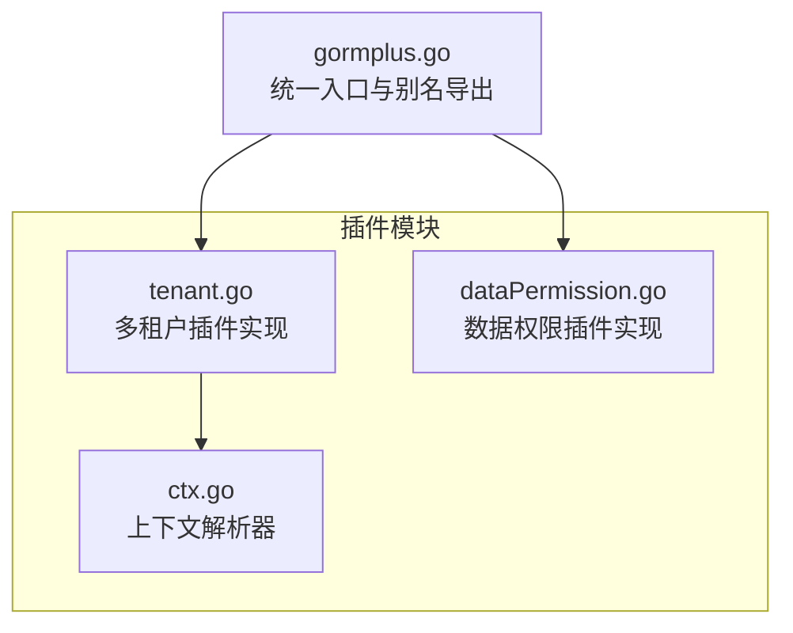
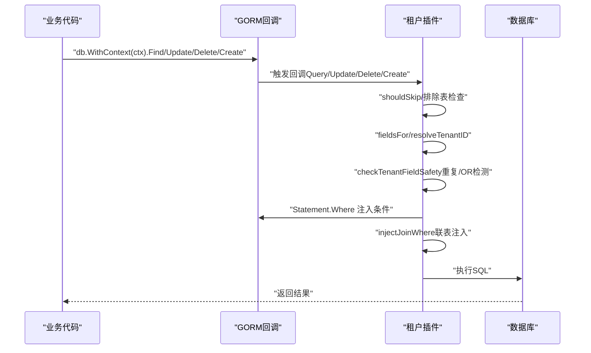
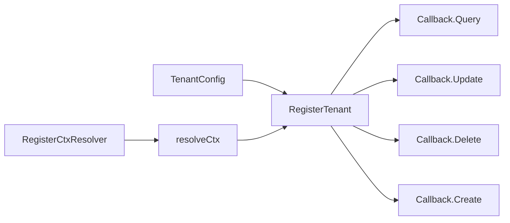

# 配置选项详解

<cite>
**本文引用的文件**
- [plugin/tenant.go](file://plugin/tenant.go)
- [plugin/tenant.md](file://plugin/tenant.md)
- [plugin/dataPermission.go](file://plugin/dataPermission.go)
- [plugin/dataPermission.md](file://plugin/dataPermission.md)
- [plugin/ctx.go](file://plugin/ctx.go)
- [gormplus.go](file://gormplus.go)
</cite>

## 目录
1. [简介](#简介)
2. [项目结构](#项目结构)
3. [核心组件](#核心组件)
4. [架构总览](#架构总览)
5. [详细组件分析](#详细组件分析)
6. [依赖关系分析](#依赖关系分析)
7. [性能考量](#性能考量)
8. [故障排查指南](#故障排查指南)
9. [结论](#结论)
10. [附录](#附录)

## 简介
本文件面向多租户插件的使用者与维护者，系统梳理并解释 TenantConfig 结构体的所有配置字段及其取值、使用场景、影响效果与最佳实践。重点覆盖以下方面：
- 注入方式（InjectMode）
- 重复策略（DuplicatePolicy）
- 安全配置（AllowGlobalUpdate/AllowGlobalDelete/AllowOverrideTenantID）
- 其他配置（ExcludeTables/GetTenantID/TenantField/TenantFields/TableFields/AutoInjectJoinTables/ExcludeJoinTables/JoinTableOverrides/TenantFieldConfig/JoinTenantConfig）
- 配置组合与依赖关系
- 验证方法与常见错误排查

## 项目结构
多租户插件位于 plugin/tenant.go，配套文档在 plugin/tenant.md；上下文解析器在 plugin/ctx.go；gormplus.go 提供统一入口与别名导出。数据权限插件（plugin/dataPermission.go）与文档（plugin/dataPermission.md）作为对比参考，便于理解插件注册与上下文工具的通用模式。

图表来源
- [plugin/tenant.go:1029-1068](file://plugin/tenant.go#L1029-L1068)
- [plugin/ctx.go:31-43](file://plugin/ctx.go#L31-L43)
- [gormplus.go:512-581](file://gormplus.go#L512-L581)

章节来源
- [plugin/tenant.go:1029-1068](file://plugin/tenant.go#L1029-L1068)
- [plugin/ctx.go:31-43](file://plugin/ctx.go#L31-L43)
- [gormplus.go:512-581](file://gormplus.go#L512-L581)

## 核心组件
- TenantConfig：多租户插件的主配置对象，支持单字段、多字段、按表精确配置，并提供联表注入、安全策略与排除表等能力。
- InjectMode：注入方式枚举，支持 ModeScopes 与 ModeWhere（底层行为一致）。
- DuplicateTenantPolicy：重复租户条件策略，支持 PolicySkip、PolicyReplace、PolicyAppend。
- TenantFieldConfig：单个租户字段的注入配置（Field + GetTenantID）。
- JoinTenantConfig：联表中特定关联表的租户字段覆盖配置（Table + Field + GetTenantID）。
- 上下文工具：WithTenantID、TenantIDFromCtx、SkipTenant、AllowGlobalOperation、WithOverrideTenantID、DefaultGetTenantID 等。

章节来源
- [plugin/tenant.go:145-188](file://plugin/tenant.go#L145-L188)
- [plugin/tenant.go:205-235](file://plugin/tenant.go#L205-L235)
- [plugin/tenant.go:239-336](file://plugin/tenant.go#L239-L336)
- [plugin/tenant.go:1132-1222](file://plugin/tenant.go#L1132-L1222)

## 架构总览
多租户插件通过 gorm 的回调钩子在 Query/Update/Delete/Create 前注入租户条件，支持：
- 主表 WHERE 注入（含重复条件检测与 OR 绕过防护）
- 联表 JOIN 条件自动注入（别名解析）
- 创建时自动填充租户字段
- 全表保护（禁止无业务条件的 Update/Delete）
- 覆盖租户 ID（需开启 AllowOverrideTenantID）

图表来源
- [plugin/tenant.go:355-380](file://plugin/tenant.go#L355-L380)
- [plugin/tenant.go:529-595](file://plugin/tenant.go#L529-L595)
- [plugin/tenant.go:644-713](file://plugin/tenant.go#L644-L713)

## 详细组件分析

### TenantConfig 字段详解与取值说明
- TenantField
  - 含义：单字段快捷配置，所有表统一使用此字段名。
  - 取值：字符串，数据库列名。
  - 场景：最简配置，适用于全库统一租户字段名。
  - 影响：若同时配置了 TenantFields/TableFields，则优先级为 TableFields > TenantFields > TenantField。
- TenantFields
  - 含义：同一张表注入多个租户字段（多字段场景）。
  - 取值：TenantFieldConfig 数组。
  - 场景：一张表需要同时注入多个维度的租户字段（如 tenant_id + org_id）。
  - 影响：每个字段可独立指定 GetTenantID，未指定时回退到全局 GetTenantID。
- TableFields
  - 含义：按表名精确配置，不同表用不同字段（优先级最高）。
  - 取值：map[string][]TenantFieldConfig，key 为小写表名；value 为空 slice 时表示跳过该表。
  - 场景：不同表使用不同的租户字段名或取值逻辑。
  - 影响：优先级最高，覆盖 TenantFields/TenantField。
- AutoInjectJoinTables
  - 含义：是否自动为所有 JOIN 关联表注入租户条件。
  - 取值：布尔指针（nil 视为 true）。
  - 场景：默认开启，自动解析别名并注入；关闭时需手动在业务代码中加条件。
  - 影响：提升联表查询的自动化程度，减少遗漏。
- ExcludeJoinTables
  - 含义：联表时不注入租户条件的关联表名集合。
  - 取值：字符串数组（不区分大小写）。
  - 场景：公共字典表、配置表等无需租户过滤。
  - 影响：避免对非业务表造成不必要的条件注入。
- JoinTableOverrides
  - 含义：特定关联表的字段覆盖配置。
  - 取值：JoinTenantConfig 数组。
  - 场景：某张关联表的租户字段名与主表不一致时，通过覆盖配置指定其字段名或取值函数。
  - 影响：保证联表注入的准确性。
- AllowGlobalUpdate
  - 含义：允许无业务条件的全表 Update。
  - 取值：布尔。
  - 场景：批量任务、数据迁移等需要整租户操作的内部场景。
  - 影响：默认禁止，防止误操作；可通过 AllowGlobalOperation 临时放开。
- AllowGlobalDelete
  - 含义：允许无业务条件的全表 Delete。
  - 取值：布尔。
  - 场景：与 AllowGlobalUpdate 类似。
  - 影响：默认禁止，防止误删。
- AllowOverrideTenantID
  - 含义：允许业务代码通过 WithOverrideTenantID 覆盖中间件注入的租户 ID。
  - 取值：布尔。
  - 场景：超管后台查看指定租户数据、数据迁移等。
  - 影响：默认关闭，防止租户隔离被绕过；开启后优先使用覆盖值。
- DuplicatePolicy
  - 含义：当业务代码已手动写了租户字段条件时的处理策略。
  - 取值：PolicySkip（默认）、PolicyReplace、PolicyAppend。
  - 场景：与业务代码协作时的安全策略选择。
  - 影响：Skip 以业务为准且检测 OR；Replace 强制隔离；Append 性能最优但可能重复。
- InjectMode
  - 含义：注入方式（ModeScopes/ModeWhere）。
  - 取值：枚举。
  - 场景：兼容旧配置；底层行为相同。
  - 影响：语义上区分，底层均为 Statement.Where 注入。
- ExcludeTables
  - 含义：主表排除列表（公共表不参与租户过滤）。
  - 取值：字符串数组（不区分大小写）。
  - 场景：配置表、字典表等。
  - 影响：避免对非业务表注入租户条件。
- GetTenantID
  - 含义：全局默认取值函数。
  - 取值：函数签名 (context.Context) -> (T, bool)。
  - 场景：未在字段级别指定 GetTenantID 时的回退。
  - 影响：默认使用 DefaultGetTenantID（读取 WithTenantID 写入的值）。

章节来源
- [plugin/tenant.go:241-336](file://plugin/tenant.go#L241-L336)

### 注入方式（InjectMode）
- ModeScopes：语义上表示“由 gorm 统一管理条件”，底层与 ModeWhere 相同（均使用 db.Statement.Where）。
- ModeWhere：直接操作 db.Statement.Where 注入。
- 选择建议：保持默认（ModeScopes），仅在兼容旧配置时考虑 ModeWhere。

章节来源
- [plugin/tenant.go:145-153](file://plugin/tenant.go#L145-L153)
- [plugin/tenant.go:326-327](file://plugin/tenant.go#L326-L327)

### 重复策略（DuplicatePolicy）
- PolicySkip（默认）
  - 行为：发现已有租户字段 AND 条件时跳过注入，以业务代码为准。
  - 安全：检测 OR 危险条件，发现则拒绝执行。
  - 适用：信任业务代码、避免重复注入。
- PolicyReplace
  - 行为：先移除业务代码写的租户条件，再由插件注入 ctx 中的值。
  - 安全：仍会检测 OR 危险条件，发现则拒绝执行。
  - 适用：不信任业务代码、需要严格强制隔离。
- PolicyAppend
  - 行为：不检查直接追加，性能最好。
  - 安全：可能产生重复条件，但不影响结果。
  - 适用：确定业务代码不会手动写租户条件、追求极致性能。

章节来源
- [plugin/tenant.go:157-188](file://plugin/tenant.go#L157-L188)
- [plugin/tenant.go:549-592](file://plugin/tenant.go#L549-L592)

### 安全配置
- AllowGlobalUpdate/AllowGlobalDelete
  - 默认：false（禁止无业务条件的全表 Update/Delete）。
  - 临时放开：AllowGlobalOperation(ctx)。
  - 场景：批量任务、数据迁移等内部场景。
- AllowOverrideTenantID
  - 默认：false（不允许覆盖）。
  - 开启后：WithOverrideTenantID(ctx, tenantID) 生效，优先使用覆盖值。
  - 场景：超管后台、数据迁移。
- OR 绕过防护
  - 机制：若租户字段出现在 OR 条件中，直接拒绝执行。
  - 适用：WHERE (tenant_id = 9999 OR status = 1) 等绕过隔离的情况。

章节来源
- [plugin/tenant.go:291-301](file://plugin/tenant.go#L291-L301)
- [plugin/tenant.go:823-865](file://plugin/tenant.go#L823-L865)
- [plugin/tenant.go:420-482](file://plugin/tenant.go#L420-L482)

### 其他配置
- ExcludeTables
  - 作用：排除主表，不参与租户过滤。
  - 动态管理：AddExcludeTable/RemoveExcludeTable/ExcludedTables。
- GetTenantID
  - 作用：全局默认取值函数；未指定时使用 DefaultGetTenantID。
  - 默认：读取 WithTenantID 写入的值。
- 上下文工具
  - WithTenantID/TenantIDFromCtx：写入/读取租户 ID。
  - SkipTenant：跳过租户过滤（超管专用）。
  - AllowGlobalOperation：临时允许无业务条件的全表更新/删除。
  - WithOverrideTenantID：覆盖租户 ID（需 AllowOverrideTenantID=true）。

章节来源
- [plugin/tenant.go:329-335](file://plugin/tenant.go#L329-L335)
- [plugin/tenant.go:1132-1222](file://plugin/tenant.go#L1132-L1222)

### 配置组合与最佳实践
- 字段优先级
  - TableFields > TenantFields > TenantField。
  - 建议：优先使用 TableFields 精确控制不同表的字段名与取值。
- 多字段注入
  - 使用 TenantFields 为同一张表注入多个租户字段，分别指定 GetTenantID。
  - 适用：组织/公司/部门等多维隔离。
- 联表注入
  - AutoInjectJoinTables 默认开启，自动解析别名并注入。
  - ExcludeJoinTables 用于排除公共表（如 sys_dict/sys_config）。
  - JoinTableOverrides 用于覆盖字段名不一致的关联表。
- 安全策略
  - 默认使用 PolicySkip，兼顾安全与灵活性。
  - 严格隔离场景使用 PolicyReplace。
  - 极致性能场景使用 PolicyAppend（需确保业务代码不手动写租户条件）。
- 全表保护
  - 默认禁止无业务条件的全表 Update/Delete。
  - 临时放开使用 AllowGlobalOperation；长期放宽需在配置中设置 AllowGlobalUpdate/AllowGlobalDelete。
- 覆盖租户 ID
  - 默认关闭 AllowOverrideTenantID。
  - 开启后仅限超管后台、数据迁移等受控场景使用 WithOverrideTenantID。
- 上下文解析
  - gin 项目需注册 RegisterCtxResolver，确保 *gin.Context 传入时能读取到中间件写入的 Request.Context。

章节来源
- [plugin/tenant.go:961-1026](file://plugin/tenant.go#L961-L1026)
- [plugin/tenant.md:14-29](file://plugin/tenant.md#L14-L29)
- [gormplus.go:512-581](file://gormplus.go#L512-L581)

### 配置验证方法
- 运行时排除表管理
  - AddExcludeTable/RemoveExcludeTable/ExcludedTables：动态增删与查询排除表。
- 联表注入验证
  - 使用示例：Joins("LEFT JOIN ...") 后，确认联表条件已自动注入且别名解析正确。
- 全表保护验证
  - 无业务条件的 Update/Delete 应被拒绝；临时放开需使用 AllowGlobalOperation。
- 覆盖租户 ID 验证
  - AllowOverrideTenantID=true 时，WithOverrideTenantID 生效；否则无效。
- 上下文解析验证
  - gin 项目需注册 RegisterCtxResolver；否则 WithTenantID 写入的值无法被读取。

章节来源
- [plugin/tenant.go:1085-1130](file://plugin/tenant.go#L1085-L1130)
- [plugin/tenant.go:644-713](file://plugin/tenant.go#L644-L713)
- [plugin/tenant.go:823-865](file://plugin/tenant.go#L823-L865)
- [plugin/tenant.go:1197-1222](file://plugin/tenant.go#L1197-L1222)
- [plugin/ctx.go:31-43](file://plugin/ctx.go#L31-L43)

### 配置项之间的依赖关系与冲突处理
- 字段优先级
  - TableFields > TenantFields > TenantField；三者不可同时为空。
- 重复策略与 OR 绕过
  - 三种策略均会检测 OR 危险条件，发现则拒绝执行。
- 全表保护与 AllowGlobalOperation
  - AllowGlobalUpdate/AllowGlobalDelete 为 false 时，无业务条件的全表操作被拒绝；可通过 AllowGlobalOperation 临时放开。
- 覆盖租户 ID 与 AllowOverrideTenantID
  - AllowOverrideTenantID=false 时，WithOverrideTenantID 无效；开启后优先使用覆盖值。
- 联表注入与排除
  - AutoInjectJoinTables=true 时，ExcludeJoinTables 与 JoinTableOverrides 生效；false 时关闭自动注入。

章节来源
- [plugin/tenant.go:970-974](file://plugin/tenant.go#L970-L974)
- [plugin/tenant.go:420-482](file://plugin/tenant.go#L420-L482)
- [plugin/tenant.go:823-865](file://plugin/tenant.go#L823-L865)
- [plugin/tenant.go:1197-1222](file://plugin/tenant.go#L1197-L1222)
- [plugin/tenant.go:644-713](file://plugin/tenant.go#L644-L713)

## 依赖关系分析
- 插件注册与初始化
  - RegisterTenant/NewTenantPlugin：注册租户插件，向 gorm 注册 Query/Update/Delete/Create 回调。
- 上下文解析
  - RegisterCtxResolver：解决 gin 项目传入 *gin.Context 时无法读取 Request.Context 的问题。
- 数据权限插件对比
  - 数据权限插件采用相同上下文解析与回调注册模式，便于理解插件通用机制。

图表来源
- [plugin/tenant.go:1057-1063](file://plugin/tenant.go#L1057-L1063)
- [plugin/tenant.go:355-380](file://plugin/tenant.go#L355-L380)
- [plugin/ctx.go:31-43](file://plugin/ctx.go#L31-L43)

章节来源
- [plugin/tenant.go:1057-1063](file://plugin/tenant.go#L1057-L1063)
- [plugin/tenant.go:355-380](file://plugin/tenant.go#L355-L380)
- [plugin/ctx.go:31-43](file://plugin/ctx.go#L31-L43)

## 性能考量
- DuplicatePolicy=PolicyAppend 性能最优，但可能产生重复条件；适合确定业务代码不会手动写租户条件的场景。
- AutoInjectJoinTables=true 时，联表注入会增加 WHERE 条件数量，建议结合 ExcludeJoinTables 与 JoinTableOverrides 控制范围。
- ExcludeTables 与 TableFields 的合理配置可减少不必要的条件注入，提高查询效率。

## 故障排查指南
- 问题：WHERE 条件重复
  - 现象：出现重复的租户字段条件。
  - 排查：检查 DuplicatePolicy 设置；若使用 PolicyAppend，确认业务代码未手动写租户条件。
- 问题：租户字段出现在 OR 条件中被拒绝
  - 现象：报错提示租户字段出现在 OR 条件中，可能绕过隔离。
  - 排查：修改查询逻辑，避免在 OR 中使用租户字段；如需跨租户查询，使用 SkipTenant。
- 问题：无业务条件的全表 Update/Delete 被拒绝
  - 现象：报错提示禁止无业务条件的全表 Update/Delete。
  - 排查：添加业务 WHERE 条件；或临时使用 AllowGlobalOperation；或在配置中设置 AllowGlobalUpdate/AllowGlobalDelete。
- 问题：覆盖租户 ID 无效
  - 现象：WithOverrideTenantID 写入的值未生效。
  - 排查：确认 AllowOverrideTenantID=true；确保覆盖值非零值；检查上下文传递路径。
- 问题：联表注入异常
  - 现象：联表条件未注入或别名解析错误。
  - 排查：确认 AutoInjectJoinTables=true；检查 ExcludeJoinTables 与 JoinTableOverrides；核对表名大小写与别名格式。
- 问题：gin 项目上下文读取不到租户 ID
  - 现象：WithTenantID 写入的值无法被读取。
  - 排查：注册 RegisterCtxResolver；确保传入的是 *gin.Context 并通过 c.Request.Context() 传递。

章节来源
- [plugin/tenant.go:420-482](file://plugin/tenant.go#L420-L482)
- [plugin/tenant.go:823-865](file://plugin/tenant.go#L823-L865)
- [plugin/tenant.go:1197-1222](file://plugin/tenant.go#L1197-L1222)
- [plugin/tenant.go:644-713](file://plugin/tenant.go#L644-L713)
- [plugin/ctx.go:31-43](file://plugin/ctx.go#L31-L43)

## 结论
TenantConfig 提供了灵活而强大的多租户隔离能力，涵盖字段配置、联表注入、安全策略与运行时排除表管理。通过合理的配置组合与最佳实践，可在保证安全的前提下满足多样化的业务需求。建议优先使用 TableFields 精准控制，配合 ExcludeJoinTables 与 JoinTableOverrides 提升联表注入的准确性；在安全与性能之间根据场景选择合适的 DuplicatePolicy；谨慎开启 AllowGlobalOperation 与 AllowOverrideTenantID，并仅限受控场景使用。

## 附录
- 使用示例与文档参考
  - 多租户插件使用方式与中间件示例：[plugin/tenant.md:1-30](file://plugin/tenant.md#L1-L30)
  - 数据权限插件使用方式与中间件示例：[plugin/dataPermission.md:1-50](file://plugin/dataPermission.md#L1-L50)
- 统一入口与别名导出
  - gormplus.RegisterTenant/gormplus.WithTenantID 等：[gormplus.go:512-661](file://gormplus.go#L512-L661)