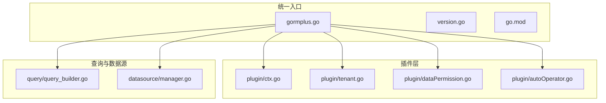
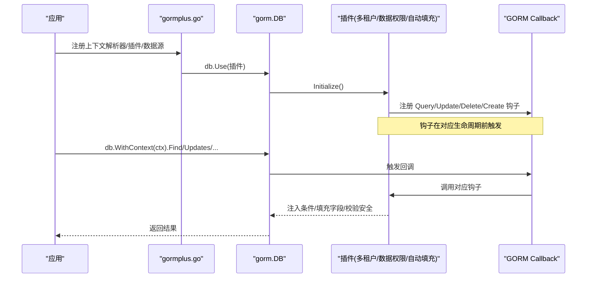
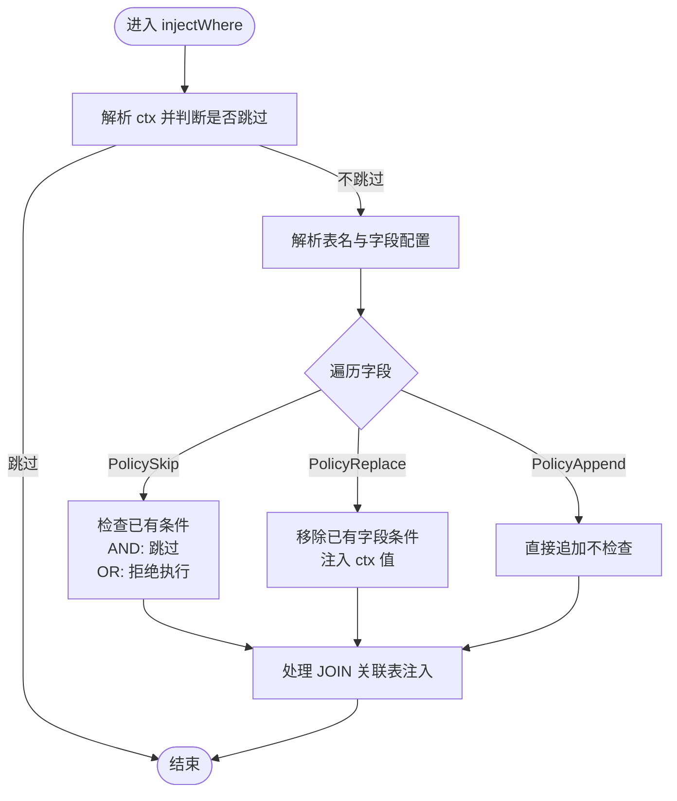
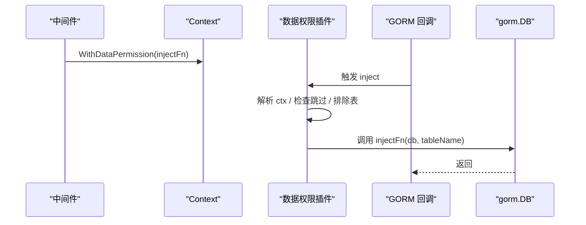
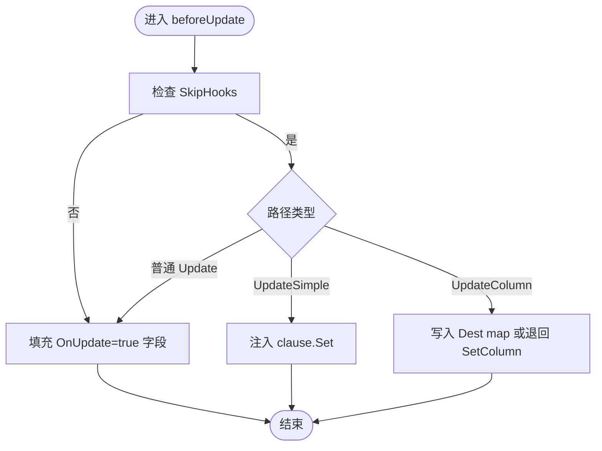
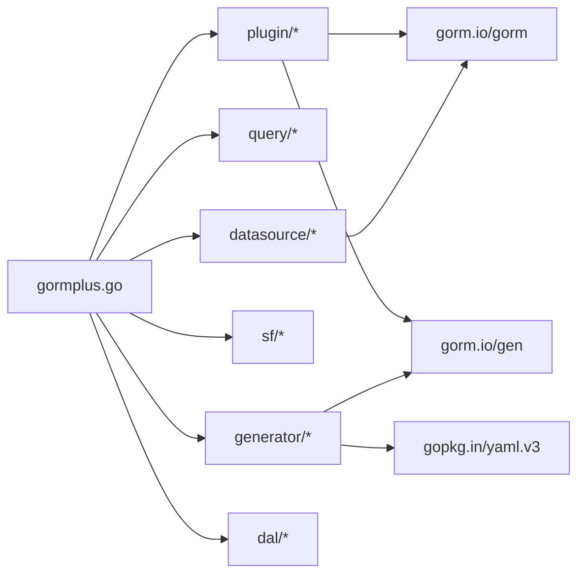

# 插件系统

<cite>
**本文引用的文件**
- [README.md](file://README.md)
- [gormplus.go](file://gormplus.go)
- [version.go](file://version.go)
- [go.mod](file://go.mod)
- [plugin/ctx.go](file://plugin/ctx.go)
- [plugin/tenant.go](file://plugin/tenant.go)
- [plugin/dataPermission.go](file://plugin/dataPermission.go)
- [plugin/autoOperator.go](file://plugin/autoOperator.go)
- [query/query_builder.go](file://query/query_builder.go)
- [datasource/manager.go](file://datasource/manager.go)
</cite>

## 目录
1. [简介](#简介)
2. [项目结构](#项目结构)
3. [核心组件](#核心组件)
4. [架构总览](#架构总览)
5. [详细组件分析](#详细组件分析)
6. [依赖关系分析](#依赖关系分析)
7. [性能考量](#性能考量)
8. [故障排查指南](#故障排查指南)
9. [结论](#结论)
10. [附录](#附录)

## 简介
本项目是一个基于 GORM 的增强扩展包，提供统一入口导出全部能力，涵盖：
- 多租户插件：通过 GORM Callback 自动注入租户条件，支持多字段、联表自动注入、安全策略与覆盖机制
- 数据权限插件：通过回调注入业务自定义的数据范围条件，支持排除表与跳过策略
- 自动填充插件：在 Create/Update 前自动填充操作人等字段，支持多种 Getter 与上下文键
- 多数据源管理：支持一主多从、读写分离、连接池、健康检查与优雅关闭
- 链式条件构造器：原生 GORM 扩展与 gorm-gen 类型安全链式构造器
- SingleFlight + 可插拔缓存：防缓存击穿的并发合并与缓存层抽象
- 慢查询监控：基于 GORM 插件的慢查询记录
- 代码生成器与 DAL：SQL 文件化查询与代码生成

## 项目结构
仓库采用模块化组织，核心模块如下：
- gormplus.go：统一入口，导出全部功能
- plugin/*：插件实现（多租户、数据权限、自动填充、ctx 解析器）
- query/*：链式条件构造器与 gorm-gen 包装
- datasource/*：多数据源管理
- sf/*：SingleFlight + 可插拔缓存
- generator/*：代码生成器
- dal/*：SQL 文件化查询
- version.go：版本号
- go.mod：依赖声明

**图表来源**
- [gormplus.go:86-101](file://gormplus.go#L86-L101)
- [plugin/ctx.go:1-44](file://plugin/ctx.go#L1-L44)
- [plugin/tenant.go:1-129](file://plugin/tenant.go#L1-L129)
- [plugin/dataPermission.go:1-50](file://plugin/dataPermission.go#L1-L50)
- [plugin/autoOperator.go:1-50](file://plugin/autoOperator.go#L1-L50)
- [query/query_builder.go:1-50](file://query/query_builder.go#L1-L50)
- [datasource/manager.go:1-50](file://datasource/manager.go#L1-L50)

**章节来源**
- [README.md:17-41](file://README.md#L17-L41)
- [gormplus.go:86-101](file://gormplus.go#L86-L101)

## 核心组件
- 统一入口与导出：gormplus.go 提供 RegisterCtxResolver、RegisterTenant、RegisterDataPermission、NewAutoFillPlugin、RegisterCache、SF 系列、Query、GenWrap 等统一 API
- 插件注册与生命周期：通过 db.Use()/Callback 注册，Initialize 生命周期完成钩子注册
- 上下文解析器：屏蔽 gin/go-zero/fiber 差异，确保插件能从 *gin.Context 读取中间件写入的 Request.Context 数据
- 多租户插件：Query/Update/Delete/Create 钩子自动注入租户条件，支持多字段、联表别名识别、安全策略（重复条件策略、OR 绕过拒绝、全表保护）
- 数据权限插件：在 Query/Update/Delete 钩子中调用业务注入函数，追加数据范围条件
- 自动填充插件：Create/Update 钩子前填充字段，支持多 Getter 与上下文键
- 多数据源管理：命名数据源、读写分离、连接池、健康检查、优雅关闭
- 链式条件构造器：IQueryBuilder 提供 Like/LLike/RLike/BetweenIfNotZero/WhereIf/WhereGroup/OrGroup 等扩展能力
- SingleFlight + 缓存：SF/SFWithTTL/SFNoCache/SFInvalidate/StopSFCache/注册缓存实现
- 慢查询监控：注册慢查询插件，记录耗时、表名、SQL、影响行数、错误
- 代码生成器与 DAL：模板与配置驱动的代码生成，SQL 文件化查询

**章节来源**
- [gormplus.go:103-125](file://gormplus.go#L103-L125)
- [gormplus.go:475-662](file://gormplus.go#L475-L662)
- [gormplus.go:663-750](file://gormplus.go#L663-L750)
- [gormplus.go:750-800](file://gormplus.go#L750-L800)
- [query/query_builder.go:39-64](file://query/query_builder.go#L39-L64)
- [datasource/manager.go:15-148](file://datasource/manager.go#L15-L148)

## 架构总览
插件系统围绕 GORM 的 Callback 机制工作，通过 db.Use() 注册插件，Initialize 中注册 Before/After 钩子，在具体生命周期阶段注入业务逻辑。统一入口 gormplus.go 将各模块能力聚合，提供易用 API。

**图表来源**
- [gormplus.go:512-581](file://gormplus.go#L512-L581)
- [plugin/tenant.go:355-381](file://plugin/tenant.go#L355-L381)
- [plugin/dataPermission.go:140-162](file://plugin/dataPermission.go#L140-L162)
- [plugin/autoOperator.go:190-208](file://plugin/autoOperator.go#L190-L208)

## 详细组件分析

### 多租户插件
- 设计理念
  - 通过 GORM Callback 在 Query/Update/Delete/Create 前注入租户条件，Create 自动填充字段
  - 支持单字段、多字段、按表覆盖、联表自动注入与别名识别
  - 安全策略：重复条件策略（跳过/替换/追加）、OR 危险条件拒绝、全表 Update/Delete 保护
- 注册与生命周期
  - gormplus.RegisterTenant 注册插件，内部委托 plugin.RegisterTenant
  - Initialize 中注册 query/update/delete/create 钩子
- 核心流程
  - injectWhere：解析 ctx，判断是否跳过，定位表字段配置，按策略检查已有条件，注入 WHERE 条件，再处理 JOIN 关联表
  - injectCreate：反射填充结构体字段
  - injectJoinWhere：解析 JOIN 子句，识别别名，按覆盖规则注入
- 上下文与安全
  - WithTenantID/SkipTenant/AllowGlobalOperation/WithOverrideTenantID 控制租户值与跳过策略
  - checkTenantFieldSafety/containsTenantField 检测 OR 危险与重复条件
- 配置要点
  - TenantField/TenantFields/TableFields 决定字段来源与优先级
  - AutoInjectJoinTables/ExcludeJoinTables/JoinTableOverrides 控制联表注入
  - DuplicatePolicy/AllowGlobalUpdate/AllowGlobalDelete/AllowOverrideTenantID 控制安全策略

**图表来源**
- [plugin/tenant.go:529-595](file://plugin/tenant.go#L529-L595)
- [plugin/tenant.go:644-713](file://plugin/tenant.go#L644-L713)
- [plugin/tenant.go:385-482](file://plugin/tenant.go#L385-L482)

**章节来源**
- [plugin/tenant.go:1-129](file://plugin/tenant.go#L1-L129)
- [plugin/tenant.go:239-336](file://plugin/tenant.go#L239-L336)
- [plugin/tenant.go:355-381](file://plugin/tenant.go#L355-L381)
- [plugin/tenant.go:529-595](file://plugin/tenant.go#L529-L595)
- [plugin/tenant.go:644-713](file://plugin/tenant.go#L644-L713)
- [plugin/tenant.go:385-482](file://plugin/tenant.go#L385-L482)

### 数据权限插件
- 设计理念
  - 业务层在中间件中定义注入函数，插件在回调中调用，追加数据范围条件
  - 支持排除表与跳过策略
- 注册与生命周期
  - RegisterDataPermission/NewDataPermissionPlugin 注册插件
  - Initialize 注册 Query/Update/Delete 钩子
- 核心流程
  - inject：解析 ctx，检查跳过标记与排除表，获取业务注入函数并调用
  - tableName/isExcluded：解析表名与排除集合
- 配置要点
  - InjectMode（ModeScopes/ModeWhere，底层均为 Statement.Where）
  - ExcludeTables

**图表来源**
- [plugin/dataPermission.go:164-204](file://plugin/dataPermission.go#L164-L204)
- [plugin/dataPermission.go:231-249](file://plugin/dataPermission.go#L231-L249)

**章节来源**
- [plugin/dataPermission.go:1-50](file://plugin/dataPermission.go#L1-L50)
- [plugin/dataPermission.go:108-126](file://plugin/dataPermission.go#L108-L126)
- [plugin/dataPermission.go:140-162](file://plugin/dataPermission.go#L140-L162)
- [plugin/dataPermission.go:164-204](file://plugin/dataPermission.go#L164-L204)
- [plugin/dataPermission.go:231-249](file://plugin/dataPermission.go#L231-L249)

### 自动填充插件
- 设计理念
  - 在 Create/Update 前自动填充字段，支持多 Getter 与上下文键
  - 支持 UpdateSimple/UpdateColumn 等不同路径
- 注册与生命周期
  - NewAutoFillPlugin 创建插件实例，db.Use 注册
  - Initialize 注册 Create/Update 钩子
- 核心流程
  - beforeCreate：填充 OnCreate=true 的字段
  - beforeUpdate：填充 OnUpdate=true 的字段，处理 UpdateSimple 的 clause.Set
  - beforeUpdateColumn：处理 SkipHooks=true 的 UpdateColumn 路径
  - injectIntoClauseSet：向已存在的 SET 中追加赋值，避免重复注入

**图表来源**
- [plugin/autoOperator.go:229-275](file://plugin/autoOperator.go#L229-L275)
- [plugin/autoOperator.go:285-308](file://plugin/autoOperator.go#L285-L308)

**章节来源**
- [plugin/autoOperator.go:1-50](file://plugin/autoOperator.go#L1-L50)
- [plugin/autoOperator.go:120-138](file://plugin/autoOperator.go#L120-L138)
- [plugin/autoOperator.go:190-208](file://plugin/autoOperator.go#L190-L208)
- [plugin/autoOperator.go:229-275](file://plugin/autoOperator.go#L229-L275)
- [plugin/autoOperator.go:285-308](file://plugin/autoOperator.go#L285-L308)

### 上下文解析器
- 作用：屏蔽 gin/go-zero/fiber 差异，确保插件能从 *gin.Context 读取中间件写入的 Request.Context 数据
- 注册：RegisterCtxResolver，gin 项目必须注册；go-zero/fiber 使用标准 context，无需注册
- 使用：resolveCtx 在插件内部统一解析

**章节来源**
- [plugin/ctx.go:16-44](file://plugin/ctx.go#L16-L44)
- [gormplus.go:105-125](file://gormplus.go#L105-L125)

### 多数据源管理
- 能力：命名数据源、一主多从、懒连接、独立连接池、自动切换、读写分离、健康检查、优雅关闭
- 注册：DS.Register，支持任意 gorm 驱动
- 中间件：DSWithName/DSWithRead/DSWithWrite 标记数据源与读写意图
- 获取 DB：DS.Auto(ctx) 自动选择数据源与读写；DS.Write/Read/WriteCtx/ReadCtx 显式指定
- 退出：DS.Close

**章节来源**
- [datasource/manager.go:15-148](file://datasource/manager.go#L15-L148)
- [datasource/manager.go:171-200](file://datasource/manager.go#L171-L200)
- [gormplus.go:155-214](file://gormplus.go#L155-L214)

### 链式条件构造器
- IQueryBuilder：提供 Like/LLike/RLike/BetweenIfNotZero/WhereIf/WhereGroup/OrGroup 等扩展方法
- Build：返回原生 *gorm.DB，继续使用 gorm 原生方法
- GenWrap：包装 gorm-gen DO，提供类型安全链式构造

**章节来源**
- [query/query_builder.go:66-145](file://query/query_builder.go#L66-L145)
- [gormplus.go:218-288](file://gormplus.go#L218-L288)

### SingleFlight + 可插拔缓存
- SF/SFWithTTL/SFNoCache/SFInvalidate/StopSFCache 提供缓存与并发合并
- RegisterCache 注册自定义缓存实现（如 Redis），默认内存缓存
- 使用建议：列表/统计 3s~30s；配置/字典 1min~5min；详情/实时 0（SFNoCache）

**章节来源**
- [gormplus.go:348-474](file://gormplus.go#L348-L474)

### 慢查询监控
- RegisterSlowQuery 注册插件，Threshold 设置阈值，Logger 记录慢查询信息

**章节来源**
- [README.md:643-658](file://README.md#L643-L658)
- [gormplus.go:750-800](file://gormplus.go#L750-L800)

## 依赖关系分析
- 统一入口 gormplus.go 导入 plugin、query、datasource、sf、generator、dal 模块
- 插件依赖 gorm.io/gorm 与 gorm.io/gen
- 多数据源依赖 gorm.io/gorm
- 代码生成器依赖 gopkg.in/yaml.v3 与 gorm.io/gen

**图表来源**
- [gormplus.go:88-101](file://gormplus.go#L88-L101)
- [go.mod:5-25](file://go.mod#L5-L25)

**章节来源**
- [gormplus.go:88-101](file://gormplus.go#L88-L101)
- [go.mod:5-25](file://go.mod#L5-L25)

## 性能考量
- 多租户插件
  - PolicyAppend 性能最优，但可能产生重复条件；PolicySkip/Replace 更安全
  - 联表自动注入按 JOIN 解析别名，避免重复注入
- 数据权限插件
  - 注入函数由业务层实现，尽量使用高效 SQL 与索引
- 自动填充插件
  - 仅在 Create/Update 前执行，Schema 校验避免无意义填充
- 多数据源
  - 连接池默认值生产推荐：MaxOpen=50、MaxIdle=10、MaxLifetime=30min、MaxIdleTime=10min
- 缓存
  - 列表/统计短 TTL，详情/实时使用 SFNoCache，避免缓存击穿
- 慢查询
  - 合理设置阈值，结合日志与监控定位热点

## 故障排查指南
- gin 项目无法读取中间件写入的 ctx
  - 现象：插件无法从 *gin.Context 读取 Request.Context 数据
  - 处理：注册上下文解析器
  - 参考：gormplus.RegisterCtxResolver
- 多租户 OR 绕过被拒绝
  - 现象：WHERE 中出现租户字段与 OR，直接拒绝执行
  - 处理：调整业务条件或使用 SkipTenant
  - 参考：checkTenantFieldSafety/containsTenantField
- 全表 Update/Delete 被拒绝
  - 现象：无业务 WHERE 条件的全表操作被拒绝
  - 处理：添加业务条件或临时 AllowGlobalOperation
  - 参考：checkGlobalUpdate/checkGlobalDelete
- 数据权限未生效
  - 现象：中间件注入函数未写入或被跳过
  - 处理：确认 WithDataPermission 写入、未标记 SkipDataPermission、表不在排除列表
  - 参考：WithDataPermission/DataPermissionFromCtx/SkipDataPermission
- 自动填充字段未填充
  - 现象：Create/Update 后字段未更新
  - 处理：确认 Getter 返回值、OnCreate/OnUpdate 配置、Schema 存在
  - 参考：CtxGetter/OperatorGetter/hasSchema
- 多数据源连接异常
  - 现象：Ping 失败或连接池耗尽
  - 处理：检查 DSN/Dialector、连接池配置、网络连通性
  - 参考：DS.Ping/DefaultPool

**章节来源**
- [plugin/ctx.go:16-44](file://plugin/ctx.go#L16-L44)
- [plugin/tenant.go:385-482](file://plugin/tenant.go#L385-L482)
- [plugin/tenant.go:355-381](file://plugin/tenant.go#L355-L381)
- [plugin/dataPermission.go:169-204](file://plugin/dataPermission.go#L169-L204)
- [plugin/autoOperator.go:279-283](file://plugin/autoOperator.go#L279-L283)
- [datasource/manager.go:139-148](file://datasource/manager.go#L139-L148)

## 结论
本插件系统以 GORM Callback 为核心，围绕多租户、数据权限、自动填充三大能力构建，辅以多数据源、链式条件构造器、缓存与慢查询监控，形成一套可扩展、可配置、可运维的数据库访问增强方案。通过统一入口与清晰的生命周期管理，开发者可在不侵入业务代码的前提下实现强隔离与高可用。

## 附录
- 快速开始与完整示例参考 README.md
- 版本号：v1.0.13
- 依赖：gorm.io/gorm、gorm.io/gen、gorm.io/driver/mysql、gopkg.in/yaml.v3 等

**章节来源**
- [README.md:44-110](file://README.md#L44-L110)
- [version.go:1-4](file://version.go#L1-L4)
- [go.mod:5-25](file://go.mod#L5-L25)