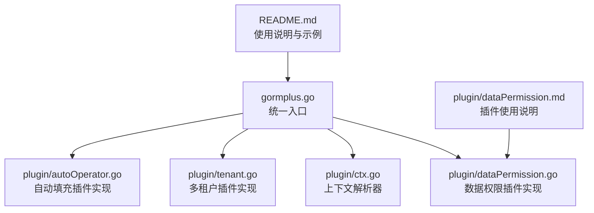
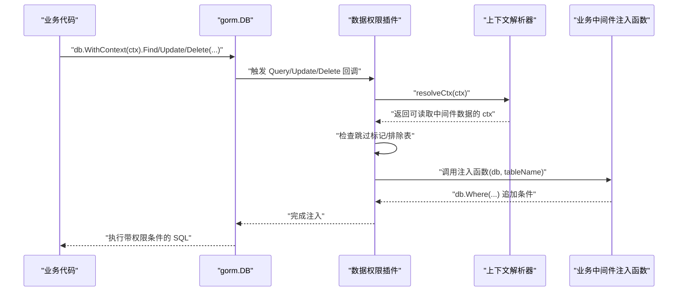
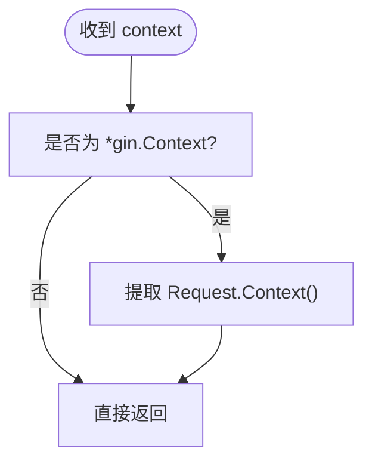
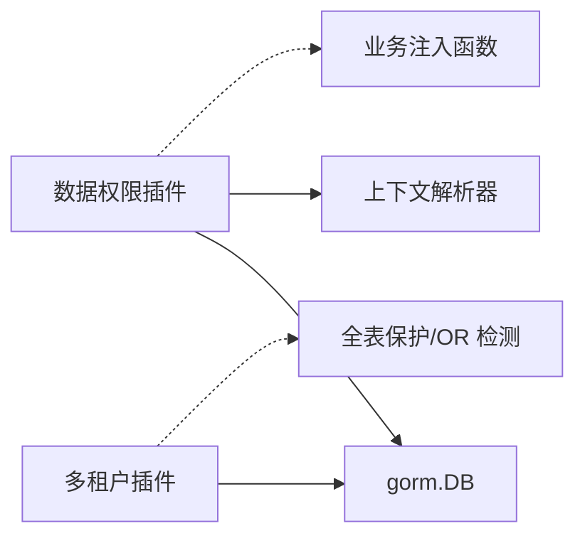

# 数据权限插件

<cite>
**本文引用的文件**
- [plugin/dataPermission.go](file://plugin/dataPermission.go)
- [plugin/dataPermission.md](file://plugin/dataPermission.md)
- [plugin/ctx.go](file://plugin/ctx.go)
- [gormplus.go](file://gormplus.go)
- [README.md](file://README.md)
- [plugin/tenant.go](file://plugin/tenant.go)
- [plugin/autoOperator.go](file://plugin/autoOperator.go)
- [version.go](file://version.go)
</cite>

## 目录
1. [简介](#简介)
2. [项目结构](#项目结构)
3. [核心组件](#核心组件)
4. [架构总览](#架构总览)
5. [详细组件分析](#详细组件分析)
6. [依赖关系分析](#依赖关系分析)
7. [性能考量](#性能考量)
8. [故障排查指南](#故障排查指南)
9. [结论](#结论)
10. [附录](#附录)

## 简介
本文件为“数据权限插件”的技术文档，面向希望在业务系统中实现“基于上下文自动注入数据权限条件”的开发者。该插件通过 gorm 的回调机制，在 Query/Update/Delete 操作前自动读取业务上下文中的权限注入函数，并将其追加到 WHERE 条件中，从而实现“业务代码零改动、自动隔离”的数据权限控制。插件设计强调：
- 与业务解耦：注入逻辑由业务中间件实现，插件不关心具体业务 SQL。
- 上下文驱动：通过 context 注入权限函数，支持 gin/go-zero/fiber 等多种框架。
- 安全可控：支持跳过条件注入（超管/内部任务）、排除表白名单、运行时动态维护排除表。
- 与多租户插件协同：两者均在 gorm 回调中注入条件，遵循相同的注入时机与安全策略。

## 项目结构
本项目采用模块化组织，数据权限插件位于 plugin 子目录，统一入口在 gormplus.go 中导出。README.md 提供快速开始与使用示例，各插件均有配套的使用说明文档。



图表来源
- [gormplus.go:1-120](file://gormplus.go#L1-L120)
- [plugin/dataPermission.go:1-120](file://plugin/dataPermission.go#L1-L120)
- [plugin/ctx.go:1-44](file://plugin/ctx.go#L1-L44)
- [plugin/tenant.go:1-120](file://plugin/tenant.go#L1-L120)
- [plugin/autoOperator.go:1-120](file://plugin/autoOperator.go#L1-L120)
- [README.md:1-120](file://README.md#L1-L120)
- [plugin/dataPermission.md:1-50](file://plugin/dataPermission.md#L1-L50)

章节来源
- [gormplus.go:1-120](file://gormplus.go#L1-L120)
- [README.md:1-120](file://README.md#L1-L120)

## 核心组件
- 数据权限插件主体：负责注册 gorm 回调、解析上下文、判断排除表、调用业务注入函数。
- 上下文解析器：屏蔽 gin/go-zero/fiber 等框架差异，确保插件能从 *gin.Context 中读取到中间件写入的 Request.Context。
- 配置对象：包含注入方式与排除表列表。
- 注入函数类型：由业务中间件实现，接收 db 与当前表名，追加 WHERE 条件。
- 运行时排除表管理：支持动态增删排除表，线程安全。

章节来源
- [plugin/dataPermission.go:108-126](file://plugin/dataPermission.go#L108-L126)
- [plugin/dataPermission.go:132-136](file://plugin/dataPermission.go#L132-L136)
- [plugin/dataPermission.go:169-204](file://plugin/dataPermission.go#L169-L204)
- [plugin/dataPermission.go:243-249](file://plugin/dataPermission.go#L243-L249)
- [plugin/dataPermission.go:282-338](file://plugin/dataPermission.go#L282-L338)
- [plugin/ctx.go:7-43](file://plugin/ctx.go#L7-L43)

## 架构总览
数据权限插件在 gorm 的 Query/Update/Delete 回调中执行，其工作流如下：
- 注册阶段：插件注册三个回调（query/update/delete）。
- 执行阶段：在回调中解析上下文，检查跳过标记、排除表、注入函数是否存在，然后调用注入函数追加 WHERE 条件。
- 安全性：若上下文中无注入函数或被标记跳过，则不注入；排除表命中也不注入。



图表来源
- [plugin/dataPermission.go:140-162](file://plugin/dataPermission.go#L140-L162)
- [plugin/dataPermission.go:169-204](file://plugin/dataPermission.go#L169-L204)
- [plugin/ctx.go:37-43](file://plugin/ctx.go#L37-L43)

## 详细组件分析

### 数据权限插件实现
- 注册与生命周期
  - 初始化时注册 Query/Update/Delete 三类回调，名称包含操作类型，便于定位。
  - 注册失败会返回错误，提示具体失败的回调类型。
- 注入流程
  - 解析上下文，兼容 *gin.Context。
  - 检查跳过标记（超管/内部任务场景）。
  - 解析当前表名（去库名前缀与反引号，转小写）。
  - 判断是否在排除表集合中（线程安全读取）。
  - 从上下文中取出注入函数，调用追加 WHERE 条件。
- 注入方式
  - 支持 ModeScopes 与 ModeWhere 两种语义，底层均使用 db.Statement.Where 注入，ModeScopes 仅语义区分。
- 配置与运行时维护
  - 注册时传入配置，包含注入方式与排除表列表。
  - 提供运行时动态添加/移除排除表与查询当前排除表快照的接口。

```mermaid
classDiagram
class DataPermissionPlugin {
-injectMode : DataPermissionInjectMode
-excludeSet : map[string]struct{}
-mu : RWMutex
+Name() string
+Initialize(db) error
-inject(db)
-tableName(db) string
-isExcluded(table) bool
}
class DataPermissionConfig {
+InjectMode : DataPermissionInjectMode
+ExcludeTables : []string
}
class DataPermissionInjectFn {
<<function>>
+(db, tableName)
}
DataPermissionPlugin --> DataPermissionConfig : "使用"
DataPermissionPlugin --> DataPermissionInjectFn : "调用"
```

图表来源
- [plugin/dataPermission.go:132-136](file://plugin/dataPermission.go#L132-L136)
- [plugin/dataPermission.go:108-126](file://plugin/dataPermission.go#L108-L126)
- [plugin/dataPermission.go:169-204](file://plugin/dataPermission.go#L169-L204)

章节来源
- [plugin/dataPermission.go:140-162](file://plugin/dataPermission.go#L140-L162)
- [plugin/dataPermission.go:169-204](file://plugin/dataPermission.go#L169-L204)
- [plugin/dataPermission.go:243-249](file://plugin/dataPermission.go#L243-L249)
- [plugin/dataPermission.go:282-338](file://plugin/dataPermission.go#L282-L338)

### 上下文解析器
- 设计目的：解决 gin 项目直接传 *gin.Context 给 db.WithContext() 时，插件无法从 *gin.Context 读取到中间件写入 Request.Context() 的问题。
- 使用方式：在应用启动时注册解析器；go-zero/fiber 等标准 context 无需注册。
- 作用范围：包内所有插件（多租户、数据权限、自动填充）均自动使用该解析器。



图表来源
- [plugin/ctx.go:37-43](file://plugin/ctx.go#L37-L43)
- [gormplus.go:105-125](file://gormplus.go#L105-L125)

章节来源
- [plugin/ctx.go:7-43](file://plugin/ctx.go#L7-L43)
- [gormplus.go:105-125](file://gormplus.go#L105-L125)

### 注册与生命周期管理
- 注册入口
  - gormplus.RegisterDataPermission：统一入口，包装 plugin.RegisterDataPermission。
  - plugin.RegisterDataPermission：向 gorm 注册插件，仅需调用一次。
- 生命周期
  - Initialize：注册回调。
  - 回调执行：在 Query/Update/Delete 前注入条件。
- 与多租户插件对比
  - 多租户插件在 Query/Update/Delete/Create/Update/Update/Create 等多处注册回调，且包含全表保护与 OR 危险检测。
  - 数据权限插件仅在 Query/Update/Delete 注册回调，注入方式统一使用 db.Statement.Where。

章节来源
- [gormplus.go:673-690](file://gormplus.go#L673-L690)
- [plugin/dataPermission.go:140-162](file://plugin/dataPermission.go#L140-L162)
- [plugin/tenant.go:355-380](file://plugin/tenant.go#L355-L380)

### 配置方式与规则
- 注册配置
  - DataPermissionConfig：包含 InjectMode 与 ExcludeTables。
  - 注册时一次性传入，插件内部转换为小写并建立集合，线程安全读取。
- 排除表
  - 精确匹配，不区分大小写，不含库名前缀。
  - 支持运行时动态添加/移除，线程安全。
- 注入函数
  - 由业务中间件实现，接收 db 与当前表名（小写、去库名前缀与反引号），在 db.Where(...) 中追加条件。
  - 未设置注入函数或被标记跳过时，不注入。

章节来源
- [plugin/dataPermission.go:108-126](file://plugin/dataPermission.go#L108-L126)
- [plugin/dataPermission.go:243-249](file://plugin/dataPermission.go#L243-L249)
- [plugin/dataPermission.go:282-338](file://plugin/dataPermission.go#L282-L338)

### 业务上下文解析与注入
- 中间件职责
  - 从 JWT/Session 等解析用户身份与权限范围。
  - 构造注入函数，将权限条件写入 db.Where(...)。
  - 通过 WithDataPermission 将注入函数写入上下文。
- 超管跳过
  - 通过 SkipDataPermission 返回新的上下文，插件在回调中检测到后直接跳过注入。
- 与多租户插件的协作
  - 两者均在 gorm 回调中注入条件，遵循相同注入时机。
  - 多租户插件具备更严格的全表保护与 OR 危险检测，数据权限插件专注于业务维度的权限隔离。

章节来源
- [plugin/dataPermission.go:69-104](file://plugin/dataPermission.go#L69-L104)
- [plugin/dataPermission.go:169-204](file://plugin/dataPermission.go#L169-L204)
- [plugin/tenant.go:385-482](file://plugin/tenant.go#L385-L482)

### 使用示例与场景
- 快速开始
  - 注册上下文解析器（gin 项目必须）。
  - 注册数据权限插件，配置排除表。
  - 在中间件中解析用户权限，构造注入函数并通过 WithDataPermission 写入上下文。
  - 业务代码直接使用 db.WithContext(ctx).Find(...)，自动注入数据权限条件。
- 超管场景
  - 在特权接口中使用 SkipDataPermission，使后续查询无数据权限条件。
- 运行时排除表
  - 通过 AddDataPermissionExcludeTable/RemoveDataPermissionExcludeTable 动态维护排除表。

章节来源
- [README.md:493-532](file://README.md#L493-L532)
- [plugin/dataPermission.md:1-50](file://plugin/dataPermission.md#L1-L50)
- [gormplus.go:673-748](file://gormplus.go#L673-L748)

## 依赖关系分析
- 插件依赖
  - gorm.io/gorm：回调注册与 Statement 操作。
  - gorm.io/gorm/clause：条件表达式解析（多租户插件中使用，数据权限插件不直接依赖）。
- 与上下文解析器的关系
  - 数据权限插件通过 resolveCtx 使用全局解析器，确保在 gin 等框架中能正确读取中间件写入的上下文。
- 与多租户插件的对比
  - 多租户插件在 Create/Update/Delete/Query 等多个阶段注册回调，并包含全表保护与 OR 危险检测。
  - 数据权限插件仅在 Query/Update/Delete 注册回调，注入方式统一使用 db.Statement.Where。



图表来源
- [plugin/dataPermission.go:140-162](file://plugin/dataPermission.go#L140-L162)
- [plugin/ctx.go:37-43](file://plugin/ctx.go#L37-L43)
- [plugin/tenant.go:355-380](file://plugin/tenant.go#L355-L380)

章节来源
- [plugin/dataPermission.go:140-162](file://plugin/dataPermission.go#L140-L162)
- [plugin/tenant.go:355-380](file://plugin/tenant.go#L355-L380)

## 性能考量
- 注入时机
  - 在 gorm 回调中注入，避免业务代码显式拼接条件，减少重复逻辑。
- 条件追加
  - 统一使用 db.Statement.Where，避免在回调中调用 db.Scopes()（gorm 回调阶段已跳过 Scopes 处理）。
- 排除表
  - 使用小写集合进行 O(1) 查找，线程安全读取，避免频繁字符串匹配。
- 运行时排除表
  - 添加/移除为 O(1) 操作，内部使用互斥锁保护，适合动态维护。
- 建议
  - 尽量将权限条件写在注入函数中，避免在业务层重复判断。
  - 对热点表可考虑将排除表配置在注册阶段，减少运行时变更。

[本节为通用性能建议，不直接分析具体文件]

## 故障排查指南
- 未注册上下文解析器（gin 项目）
  - 现象：插件无法从 *gin.Context 读取到中间件写入的 Request.Context。
  - 处理：在应用启动时调用 gormplus.RegisterCtxResolver 或 gormplus.RegisterCtxResolver(func(ctx){...})。
- 注册失败
  - 现象：RegisterDataPermission 返回错误，提示注册某个回调失败。
  - 处理：检查 gorm 版本与回调注册时机，确保在 db.Use(...) 之前完成注册。
- 未注入条件
  - 现象：业务查询未附加数据权限条件。
  - 排查：
    - 中间件是否调用了 WithDataPermission 并将注入函数写入上下文。
    - 是否在特权接口中使用了 SkipDataPermission。
    - 当前表是否在 ExcludeTables 中。
- 排除表维护
  - 现象：排除表变更后未生效。
  - 处理：确认使用 AddDataPermissionExcludeTable/RemoveDataPermissionExcludeTable，且在插件已注册后调用。
- 版本与依赖
  - 确认 gorm 版本与 gorm-plus 版本兼容，参考版本信息。

章节来源
- [plugin/dataPermission.go:157-160](file://plugin/dataPermission.go#L157-L160)
- [plugin/dataPermission.go:177-193](file://plugin/dataPermission.go#L177-L193)
- [plugin/dataPermission.go:282-338](file://plugin/dataPermission.go#L282-L338)
- [version.go:1-4](file://version.go#L1-L4)

## 结论
数据权限插件通过“上下文 + 回调 + 注入函数”的设计，实现了与业务解耦、零侵入的数据权限控制。其核心优势在于：
- 业务代码零改动，自动注入。
- 支持跳过注入（超管/内部任务）与排除表白名单。
- 与多租户插件协同，共同构建完善的访问控制体系。
- 提供运行时动态维护排除表的能力，满足灵活的业务需求。

[本节为总结性内容，不直接分析具体文件]

## 附录
- 快速开始与示例
  - 参考 README.md 中“六、数据权限插件”章节，包含注册、中间件与业务调用示例。
- 使用说明文档
  - 参考 plugin/dataPermission.md，包含注册、中间件与调试示例。
- 版本信息
  - 当前版本：v1.0.13。

章节来源
- [README.md:493-532](file://README.md#L493-L532)
- [plugin/dataPermission.md:1-50](file://plugin/dataPermission.md#L1-L50)
- [version.go:1-4](file://version.go#L1-L4)