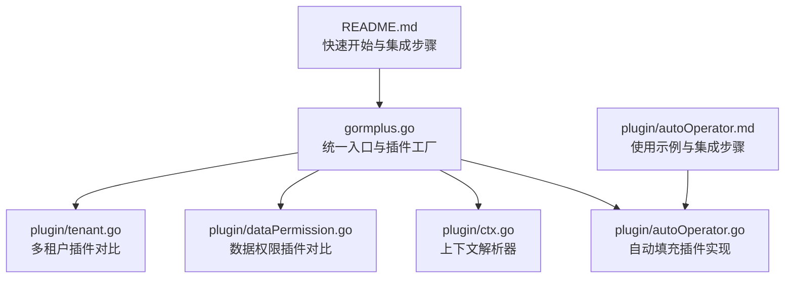
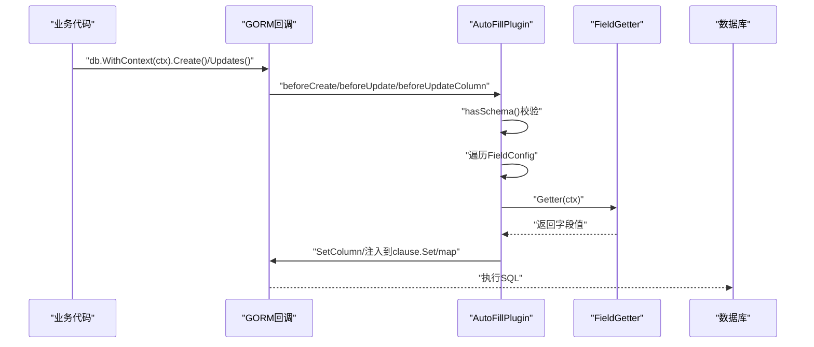
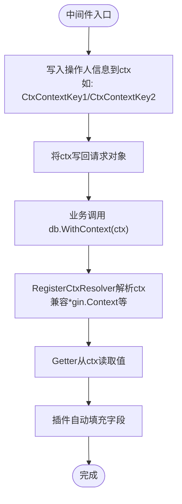
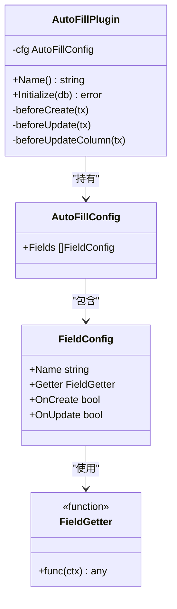
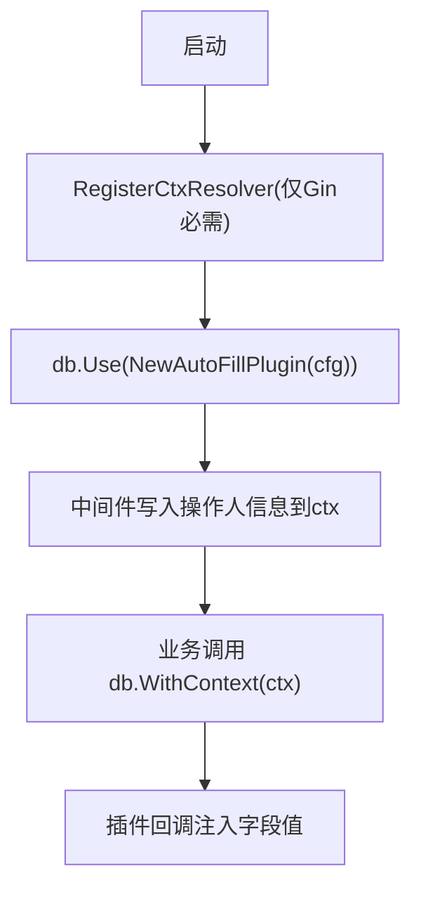
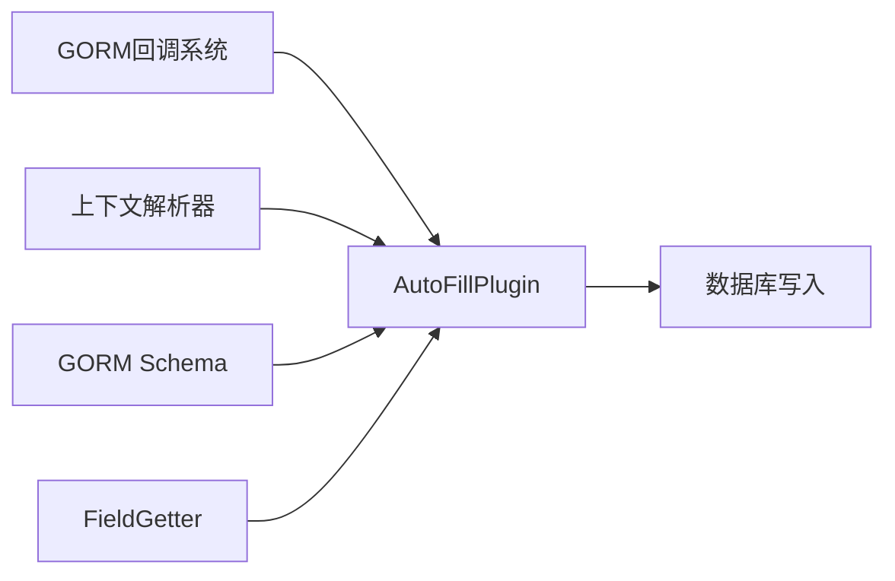

# 自动填充插件

<cite>
**本文引用的文件**
- [gormplus.go](file://gormplus.go)
- [autoOperator.go](file://plugin/autoOperator.go)
- [ctx.go](file://plugin/ctx.go)
- [autoOperator.md](file://plugin/autoOperator.md)
- [README.md](file://README.md)
- [dataPermission.go](file://plugin/dataPermission.go)
- [tenant.go](file://plugin/tenant.go)
- [version.go](file://version.go)
</cite>

## 目录
1. [简介](#简介)
2. [项目结构](#项目结构)
3. [核心组件](#核心组件)
4. [架构总览](#架构总览)
5. [详细组件分析](#详细组件分析)
6. [依赖关系分析](#依赖关系分析)
7. [性能考量](#性能考量)
8. [故障排查指南](#故障排查指南)
9. [结论](#结论)
10. [附录](#附录)

## 简介
本文件面向使用者与开发者，系统性阐述“自动填充插件”的设计与使用方法。插件通过 GORM 回调机制，在 Create/Update 等操作前自动将“创建人”“更新人”等字段写入数据库，实现业务零侵入、配置即用。插件支持多种上下文解析器，适配 Gin、Go-Zero、Fiber 等主流框架；支持多字段、多类型（int64、string、UUID 等）以及自定义 Getter；并提供完善的生命周期与注册流程说明。

## 项目结构
- 顶层入口统一导出：gormplus.go 提供统一注册、上下文解析器、插件工厂方法等。
- 插件模块：plugin/autoOperator.go 实现自动填充插件；plugin/ctx.go 提供上下文解析器与工具。
- 文档与示例：plugin/autoOperator.md 提供框架集成与中间件示例；README.md 提供快速开始与完整集成步骤。
- 其他插件参考：plugin/dataPermission.go、plugin/tenant.go 作为对比，展示回调注册、上下文读取与安全策略等通用模式。

**图表来源**
- [gormplus.go:1-120](file://gormplus.go#L1-L120)
- [autoOperator.go:140-208](file://plugin/autoOperator.go#L140-L208)
- [ctx.go:16-43](file://plugin/ctx.go#L16-L43)
- [dataPermission.go:140-162](file://plugin/dataPermission.go#L140-L162)
- [tenant.go:140-160](file://plugin/tenant.go#L140-L160)

**章节来源**
- [gormplus.go:1-120](file://gormplus.go#L1-L120)
- [README.md:44-110](file://README.md#L44-L110)

## 核心组件
- 上下文解析器（RegisterCtxResolver）：解决 Gin 等框架传入 *gin.Context 时，插件无法从 Request.Context() 读取中间件写入值的问题。注册一次即可全局生效。
- 自动填充插件（AutoFillPlugin）：通过 GORM 回调在 Create/Update 前注入字段值；支持多字段、多触发时机（OnCreate/OnUpdate）、多 Getter 类型。
- Getter 工厂（CtxGetter、OperatorGetter）：从 context 中读取指定键的值，支持泛型类型断言与零值兜底。
- 字段配置（FieldConfig）：Name 支持结构体字段名或数据库列名，插件自动解析；Getter 为函数类型；OnCreate/OnUpdate 控制触发时机。
- 插件配置（AutoFillConfig）：聚合多个 FieldConfig。

**章节来源**
- [ctx.go:16-43](file://plugin/ctx.go#L16-L43)
- [autoOperator.go:37-138](file://plugin/autoOperator.go#L37-L138)
- [gormplus.go:750-800](file://gormplus.go#L750-L800)

## 架构总览
自动填充插件在 GORM 生命周期中注册回调，分别在 Create 与 Update 前执行。插件根据配置逐个字段查找 Schema、调用 Getter、写入 Statement 的列值。针对 UpdateColumn/SkipHooks 的特殊路径，插件采用不同的注入策略（map 写入或退回 SetColumn）。

**图表来源**
- [autoOperator.go:190-208](file://plugin/autoOperator.go#L190-L208)
- [autoOperator.go:210-275](file://plugin/autoOperator.go#L210-L275)

## 详细组件分析

### 上下文解析器与中间件集成
- 上下文解析器：RegisterCtxResolver 允许注册自定义解析器，将 *gin.Context 等框架特定上下文转换为标准 context，从而让插件能从 Request.Context() 读取中间件写入的值。
- 中间件写入：在 Gin/Go-Zero/Fiber 等框架中，中间件将操作人信息写入 ctx 的指定 key（如 CtxContextKey1、CtxContextKey2 等），业务层直接传入框架上下文即可。
- 业务代码：db.WithContext(ctx) 时，插件自动解析 ctx 并读取 Getter 返回值。

**图表来源**
- [ctx.go:16-43](file://plugin/ctx.go#L16-L43)
- [autoOperator.md:54-101](file://plugin/autoOperator.md#L54-L101)
- [README.md:53-109](file://README.md#L53-L109)

**章节来源**
- [ctx.go:16-43](file://plugin/ctx.go#L16-L43)
- [autoOperator.md:1-101](file://plugin/autoOperator.md#L1-L101)
- [README.md:53-109](file://README.md#L53-L109)

### 自动填充插件工作原理与回调集成
- 回调注册：Initialize 在 Create/Update 三个路径注册回调（普通 Update、UpdateSimple、UpdateColumn/SkipHooks）。
- 字段解析：LookupField 支持结构体字段名或数据库列名；hasSchema 校验避免原生 SQL 无 Schema 的情况。
- 值注入：SetColumn 写入列值；UpdateSimple 路径通过 injectIntoClauseSet 追加到 clause.Set；UpdateColumn/SkipHooks 路径根据 Dest 类型选择 map 写入或退回 SetColumn。
- 触发控制：OnCreate/OnUpdate 严格控制注入时机，避免不必要的写入。

**图表来源**
- [autoOperator.go:140-188](file://plugin/autoOperator.go#L140-L188)
- [autoOperator.go:120-138](file://plugin/autoOperator.go#L120-L138)
- [autoOperator.go:91-118](file://plugin/autoOperator.go#L91-L118)
- [autoOperator.go:37-40](file://plugin/autoOperator.go#L37-L40)

**章节来源**
- [autoOperator.go:190-208](file://plugin/autoOperator.go#L190-L208)
- [autoOperator.go:210-275](file://plugin/autoOperator.go#L210-L275)

### Getter 工厂与字段配置
- CtxGetter[T]：从任意 key 读取值，类型断言失败返回 T 的零值；内部通过 resolveCtx 兼容框架上下文。
- OperatorGetter[T]：专用操作人 Getter，语义更清晰，等价于 CtxGetter[T](CtxOperatorKey)。
- FieldConfig：Name 支持结构体字段名或列名；Getter 支持内置工厂或自定义函数；OnCreate/OnUpdate 控制注入时机。
- AutoFillConfig：聚合多个 FieldConfig，形成完整的自动填充策略。

**章节来源**
- [autoOperator.go:42-88](file://plugin/autoOperator.go#L42-L88)
- [autoOperator.go:91-138](file://plugin/autoOperator.go#L91-L138)

### 生命周期与注册流程
- 启动阶段：RegisterCtxResolver（Gin 项目必须；Go-Zero/Fiber 可跳过）。
- 注册插件：db.Use(NewAutoFillPlugin(AutoFillConfig))。
- 中间件：在各框架中间件中写入操作人信息到 ctx 的指定 key。
- 业务调用：db.WithContext(ctx) 时，插件自动注入字段值。

**图表来源**
- [gormplus.go:105-125](file://gormplus.go#L105-L125)
- [gormplus.go:783-800](file://gormplus.go#L783-L800)
- [README.md:53-109](file://README.md#L53-L109)

**章节来源**
- [gormplus.go:105-125](file://gormplus.go#L105-L125)
- [gormplus.go:783-800](file://gormplus.go#L783-L800)
- [README.md:53-109](file://README.md#L53-L109)

### 实际业务场景与最佳实践
- 场景一：基础操作人（int64）。在中间件写入 CtxContextKey1；插件配置 CreatedBy/UpdatedBy 仅在 Create/Update 时注入。
- 场景二：UUID 操作人（string）。Getter 使用字符串类型，适用于 UUID 场景。
- 场景三：多字段混合。同时注入 CreatedBy/UpdatedBy、CreatedName/UpdatedName、TenantID、Source 等。
- 最佳实践：
  - 仅在必要时机注入（OnCreate/OnUpdate），避免冗余写入。
  - Getter 类型与字段类型一致，或可被 GORM 自动转换。
  - Gin 项目务必注册上下文解析器，否则无法从 *gin.Context 读取中间件写入值。
  - 中间件写入的 key 与插件配置一致，避免读取不到值。

**章节来源**
- [autoOperator.md:1-32](file://plugin/autoOperator.md#L1-L32)
- [autoOperator.md:54-101](file://plugin/autoOperator.md#L54-L101)
- [gormplus.go:783-800](file://gormplus.go#L783-L800)

## 依赖关系分析
- AutoFillPlugin 依赖 GORM 的回调系统与 Schema 解析；依赖上下文解析器以兼容不同框架。
- Getter 依赖 context 与类型断言；FieldConfig 依赖 GORM Schema 查找字段。
- 与其他插件的关系：上下文解析器与 Getter 模式与多租户、数据权限插件一致，体现统一的“回调 + 上下文 + Schema”的插件架构。

**图表来源**
- [autoOperator.go:190-208](file://plugin/autoOperator.go#L190-L208)
- [autoOperator.go:210-275](file://plugin/autoOperator.go#L210-L275)
- [ctx.go:16-43](file://plugin/ctx.go#L16-L43)

**章节来源**
- [autoOperator.go:190-208](file://plugin/autoOperator.go#L190-L208)
- [ctx.go:16-43](file://plugin/ctx.go#L16-L43)

## 性能考量
- 回调注册点：仅在 Create/Update 前注入，避免对查询等读操作造成额外开销。
- 字段解析：LookupField 与 hasSchema 校验，避免原生 SQL 无 Schema 的场景。
- 注入策略：UpdateSimple 通过 clause.Set 追加，UpdateColumn/SkipHooks 根据 Dest 类型选择 map 或 SetColumn，减少重复写入。
- Getter 类型断言：零值兜底，避免异常导致的性能问题。
- 建议：仅在必要字段与必要时机注入，避免过度配置导致的反射与断言成本。

[本节为通用性能讨论，不直接分析具体文件]

## 故障排查指南
- 症状：Gin 项目传入 *gin.Context，插件读取不到中间件写入的值。
  - 原因：未注册上下文解析器。
  - 处理：在启动时调用 RegisterCtxResolver，将 *gin.Context 转换为 Request.Context()。
- 症状：字段未注入。
  - 原因：Name 与结构体字段名/列名不匹配；Getter 返回值类型与字段类型不兼容；未满足 OnCreate/OnUpdate 条件。
  - 处理：确认 FieldConfig 的 Name 与 Getter；确认 OnCreate/OnUpdate；确认 Getter 返回值类型。
- 症状：UpdateColumn/SkipHooks 未生效。
  - 原因：SetColumn 在 SkipHooks=true 路径无效。
  - 处理：插件已针对 map 与 struct 分支分别处理，确认 Dest 类型与路径。
- 症状：原生 SQL 无 Schema。
  - 处理：插件已通过 hasSchema 跳过，属预期行为。

**章节来源**
- [ctx.go:16-43](file://plugin/ctx.go#L16-L43)
- [autoOperator.go:279-283](file://plugin/autoOperator.go#L279-L283)
- [autoOperator.go:251-275](file://plugin/autoOperator.go#L251-L275)

## 结论
自动填充插件以最小侵入的方式实现了“创建人/更新人”等字段的自动写入，具备良好的扩展性与兼容性。通过统一的上下文解析器、灵活的 Getter 工厂与严格的回调注入策略，插件在保证安全与性能的同时，提供了清晰的配置与使用体验。建议在 Gin 项目中务必注册上下文解析器，并结合中间件与插件配置，实现稳定可靠的自动填充能力。

[本节为总结性内容，不直接分析具体文件]

## 附录

### 快速开始与集成步骤
- 启动阶段注册上下文解析器（Gin 必须；Go-Zero/Fiber 可跳过）。
- 注册自动填充插件，配置字段与 Getter。
- 在中间件中写入操作人信息到 ctx 的指定 key。
- 业务层直接传入框架上下文，无需额外处理。

**章节来源**
- [README.md:53-109](file://README.md#L53-L109)
- [gormplus.go:783-800](file://gormplus.go#L783-L800)

### 版本信息
- 当前版本：v1.0.13

**章节来源**
- [version.go:1-4](file://version.go#L1-L4)