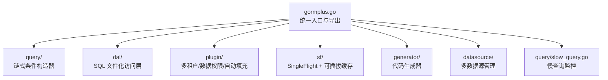
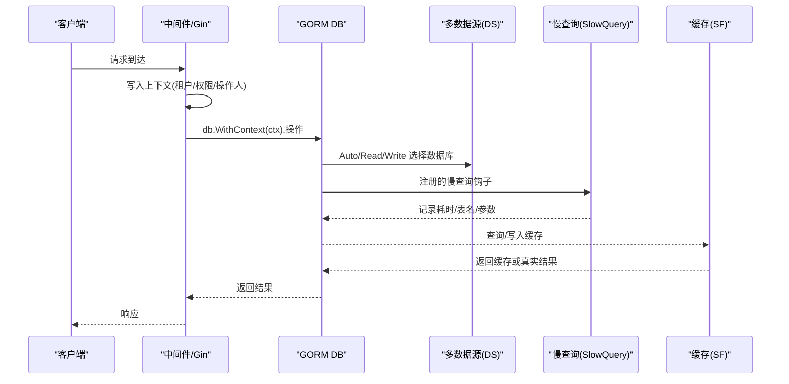
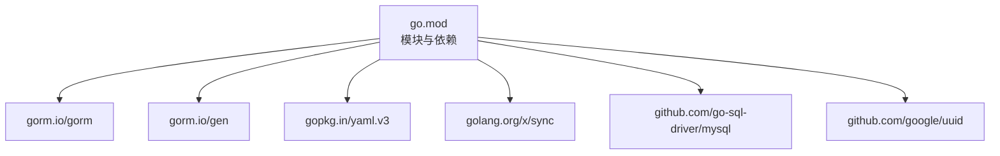

# 故障排查

<cite>
**本文引用的文件**
- [README.md](file://README.md)
- [gormplus.go](file://gormplus.go)
- [version.go](file://version.go)
- [dal/dal.go](file://dal/dal.go)
- [dal/dal_test.go](file://dal/dal_test.go)
- [plugin/tenant.go](file://plugin/tenant.go)
- [plugin/dataPermission.go](file://plugin/dataPermission.go)
- [plugin/autoOperator.go](file://plugin/autoOperator.go)
- [query/slow_query.go](file://query/slow_query.go)
- [sf/sf.go](file://sf/sf.go)
- [generator/config.go](file://generator/config.go)
- [generator/example_test.go](file://generator/example_test.go)
- [go.mod](file://go.mod)
</cite>

## 目录
1. [简介](#简介)
2. [项目结构](#项目结构)
3. [核心组件](#核心组件)
4. [架构总览](#架构总览)
5. [详细组件分析](#详细组件分析)
6. [依赖分析](#依赖分析)
7. [性能考虑](#性能考虑)
8. [故障排查指南](#故障排查指南)
9. [结论](#结论)
10. [附录](#附录)

## 简介
本指南面向 GORM Plus 的使用者与维护者，聚焦“故障排查”主题，系统化梳理常见问题与解决方案，涵盖配置错误、连接问题、查询异常、性能瓶颈、监控与告警、问题复现与测试验证、版本升级与迁移注意事项等。内容基于仓库源码与示例文档提炼，帮助读者快速定位与解决问题。

## 项目结构
GORM Plus 采用模块化设计，核心模块包括：
- 统一入口与导出：gormplus.go
- 多数据源管理：datasource（通过 gormplus.DS 使用）
- 原生链式条件构造器：query
- SQL 文件化访问层：dal
- 插件体系：多租户、数据权限、自动填充
- 慢查询监控：query/slow_query.go
- 缓存与合并查询：sf
- 代码生成器：generator
- 版本信息：version.go

图示来源
- [gormplus.go:1-120](file://gormplus.go#L1-L120)

章节来源
- [README.md:17-41](file://README.md#L17-L41)
- [gormplus.go:1-120](file://gormplus.go#L1-L120)

## 核心组件
- 多数据源管理（DS）：支持一主多从、读写分离、上下文自动切换；提供健康检查与优雅关闭。
- 原生链式条件构造器（Query）：支持模糊/范围/分组/联表等条件拼装，提供泛型分页与扫描。
- SQL 文件化访问层（DAL）：基于 embed 的 SQL 文件管理，支持位置参数与命名参数、分页、Hook、缓存清理。
- 插件体系：多租户（自动注入 WHERE）、数据权限（按业务注入条件）、自动填充（创建/更新自动写入字段）。
- 慢查询监控（SlowQuery）：基于 gorm Callback，在 SQL 执行前后记录耗时并触发自定义日志。
- 缓存与合并查询（SF）：提供 singleflight 与可插拔缓存，支持主动失效。
- 代码生成器（Generator）：从数据库表生成 Model/Repository/API/VO/DTO，支持 YAML 配置与交互式选择。

章节来源
- [README.md:139-216](file://README.md#L139-L216)
- [README.md:219-283](file://README.md#L219-L283)
- [README.md:696-790](file://README.md#L696-L790)
- [README.md:436-490](file://README.md#L436-L490)
- [README.md:493-533](file://README.md#L493-L533)
- [README.md:536-564](file://README.md#L536-L564)
- [README.md:643-658](file://README.md#L643-L658)
- [README.md:662-694](file://README.md#L662-L694)

## 架构总览
下图展示 GORM Plus 在请求链路上的关键交互：中间件写入上下文 -> 插件自动注入 -> 数据源选择 -> SQL 执行与监控 -> 缓存/合并查询 -> 返回结果。

图示来源
- [gormplus.go:155-214](file://gormplus.go#L155-L214)
- [query/slow_query.go:113-234](file://query/slow_query.go#L113-L234)
- [sf/sf.go:252-349](file://sf/sf.go#L252-L349)

## 详细组件分析

### 多数据源管理（DS）
- 上下文标记：DSWithName、DSWithRead/DSWithWrite、DSIsRead/DSIsWrite。
- 获取 DB：DS.Auto(ctx)、DS.Read/Write(name)、DS.WriteCtx(ctx, name)。
- 健康检查：DS.Ping()。
- 优雅关闭：defer DS.Close()。

常见问题与排查
- 未注册 ctx 解析器导致 gin 传入 *gin.Context 无法读取 Request.Context。
- 未在中间件标记读写，导致所有请求都走主库或从库。
- 未初始化数据源组，DS.Auto(ctx) 返回错误。
- 连接池配置不当导致连接耗尽或频繁重建。

章节来源
- [README.md:114-136](file://README.md#L114-L136)
- [README.md:179-194](file://README.md#L179-L194)
- [README.md:196-215](file://README.md#L196-L215)
- [gormplus.go:155-214](file://gormplus.go#L155-L214)

### 原生链式条件构造器（Query）
- 条件方法：Like/LLike/RLike、BetweenIfNotZero、WhereIf、WhereGroup/OrGroup、RawWhere/RawOrWhere/RawWhereIf。
- 分页：FindByPage、ScanByPage。
- 与 gorm 原生无缝衔接，Build() 返回 *gorm.DB。

常见问题与排查
- 条件为空时自动跳过，导致 SQL 与预期不符。
- 分组括号嵌套错误，导致 AND/OR 优先级异常。
- 泛型分页 Count 时自动去除 ORDER BY，注意 SQL 结构。

章节来源
- [README.md:219-283](file://README.md#L219-L283)
- [gormplus.go:246-288](file://gormplus.go#L246-L288)

### SQL 文件化访问层（DAL）
- 初始化：NewDal、WithDebug、WithHook、WithCacheCleanup。
- 查询：Query/QueryOne/QueryNamed/QueryOneNamed、Exec/ExecAffected、Count、QueryPage/QueryPageNamed。
- 多数据源：WithDB 注入 DAL 实例，后续调用自动使用该实例。
- Hook：Before/After 生命周期钩子，可用于慢 SQL 监控、指标采集、链路追踪。
- 缓存清理：WithCacheCleanup 定时清理 SQL 缓存，防止内存增长。

常见问题与排查
- 未初始化 DAL 导致 panic：“未初始化，请先调用 dal.NewDal()”。
- SQL 文件路径错误或参数不匹配导致执行失败。
- Debug 模式下返回零行会打印警告，便于定位路径或条件问题。
- 多数据源场景未注入 DAL 实例导致使用默认库。

章节来源
- [README.md:696-790](file://README.md#L696-L790)
- [dal/dal.go:334-431](file://dal/dal.go#L334-L431)
- [dal/dal.go:594-628](file://dal/dal.go#L594-L628)
- [dal/dal.go:655-691](file://dal/dal.go#L655-L691)
- [dal/dal.go:693-762](file://dal/dal.go#L693-L762)
- [dal/dal.go:764-800](file://dal/dal.go#L764-L800)
- [dal/dal.go:277-281](file://dal/dal.go#L277-L281)

### 插件体系
- 多租户（Tenant）
  - 注册：RegisterTenant，支持单字段、多字段、按表覆盖。
  - 安全策略：重复条件策略（PolicySkip/PolicyReplace/PolicyAppend）、OR 绕过拒绝、全表 Update/Delete 保护。
  - 跳过与覆盖：SkipTenant、AllowGlobalOperation、WithOverrideTenantID。
- 数据权限（DataPermission）
  - 注册：RegisterDataPermission，中间件注入注入函数 WithDataPermission。
  - 跳过：SkipDataPermission。
- 自动填充（AutoFill）
  - 注册：db.Use(NewAutoFillPlugin)，支持多字段与自定义 Getter。
  - 上下文键：CtxOperatorKey1..10。

常见问题与排查
- 未注册 ctx 解析器导致 *gin.Context 无法读取中间件写入的值。
- 重复条件策略导致注入行为不符合预期。
- OR 条件中出现租户字段被拒绝执行。
- 数据权限未注入或排除表配置错误。

章节来源
- [README.md:331-490](file://README.md#L331-L490)
- [README.md:493-533](file://README.md#L493-L533)
- [README.md:536-564](file://README.md#L536-L564)
- [plugin/tenant.go:355-381](file://plugin/tenant.go#L355-L381)
- [plugin/tenant.go:529-595](file://plugin/tenant.go#L529-L595)
- [plugin/tenant.go:644-713](file://plugin/tenant.go#L644-L713)
- [plugin/dataPermission.go:140-162](file://plugin/dataPermission.go#L140-L162)
- [plugin/dataPermission.go:169-204](file://plugin/dataPermission.go#L169-L204)
- [plugin/autoOperator.go:190-208](file://plugin/autoOperator.go#L190-L208)

### 慢查询监控（SlowQuery）
- 注册：RegisterSlowQuery，支持阈值与自定义 Logger。
- 信息：SQL（已替换参数）、耗时、影响/返回行数、主表名、错误。
- 与租户插件共存，互不干扰。

常见问题与排查
- 阈值设置过低导致大量告警。
- Logger 未配置导致仅输出到 stderr。
- SQL 可直接复制执行，便于 EXPLAIN 分析。

章节来源
- [README.md:643-658](file://README.md#L643-L658)
- [query/slow_query.go:104-109](file://query/slow_query.go#L104-L109)
- [query/slow_query.go:134-161](file://query/slow_query.go#L134-L161)

### 缓存与合并查询（SF）
- SF/SFWithTTL/SFNoCache：支持缓存与合并并发请求。
- RegisterCache：注册自定义缓存（如 Redis），需在首次调用前完成。
- SFInvalidate：写操作后主动失效缓存。
- 默认内存缓存：StopSFCache 优雅关闭后台清理 goroutine。

常见问题与排查
- 未在首次调用前注册自定义缓存导致替换失败。
- TTL 设置不当导致缓存命中率低或数据陈旧。
- args 参数不一致导致缓存键冲突或失效不生效。

章节来源
- [README.md:662-664](file://README.md#L662-L664)
- [README.md:666-666](file://README.md#L666-L666)
- [README.md:668-668](file://README.md#L668-L668)
- [README.md:670-670](file://README.md#L670-L670)
- [README.md:672-672](file://README.md#L672-L672)
- [README.md:674-674](file://README.md#L674-L674)
- [README.md:676-676](file://README.md#L676-L676)
- [README.md:678-678](file://README.md#L678-L678)
- [README.md:680-680](file://README.md#L680-L680)
- [README.md:682-682](file://README.md#L682-L682)
- [README.md:684-684](file://README.md#L684-L684)
- [README.md:686-686](file://README.md#L686-L686)
- [README.md:688-688](file://README.md#L688-L688)
- [README.md:690-690](file://README.md#L690-L690)
- [sf/sf.go:110-114](file://sf/sf.go#L110-L114)
- [sf/sf.go:288-291](file://sf/sf.go#L288-L291)
- [sf/sf.go:217-225](file://sf/sf.go#L217-L225)

### 代码生成器（Generator）
- 配置：Config（YAML/结构体），LoadConfig。
- 生成：Generate(cfg)。
- 示例：example_test.go。

常见问题与排查
- YAML 配置文件路径错误或字段缺失导致解析失败。
- 生成 Model 覆盖已有文件，Repository/API/VO/DTO 已存在则跳过。

章节来源
- [README.md:662-694](file://README.md#L662-L694)
- [generator/config.go:33-46](file://generator/config.go#L33-L46)
- [generator/example_test.go:8-35](file://generator/example_test.go#L8-L35)

## 依赖分析
- 语言与运行时：go.mod 指定 go 版本与依赖。
- 关键依赖：gorm.io/gorm、gorm.io/gen、gopkg.in/yaml.v3、golang.org/x/sync 等。
- 间接依赖：MySQL 驱动、UUID、工具集等。

图示来源
- [go.mod:1-26](file://go.mod#L1-L26)

章节来源
- [go.mod:1-26](file://go.mod#L1-L26)

## 性能考虑
- 慢查询阈值：建议生产环境设置 200ms~500ms，结合日志系统与告警。
- 缓存策略：列表/统计 3s~30s；配置/字典 1min~5min；详情/实时 0 或 SFNoCache。
- SQL 文件缓存：启用 WithCacheCleanup 定时清理，避免内存无限增长。
- 并发合并：SF/SFWithTTL/SFNoCache 降低热点查询压力。
- 数据源池：合理设置 MaxOpen/MaxIdle/ConnMaxLifetime，避免连接池耗尽。

章节来源
- [README.md:643-658](file://README.md#L643-L658)
- [README.md:633-640](file://README.md#L633-L640)
- [dal/dal.go:277-281](file://dal/dal.go#L277-L281)
- [sf/sf.go:252-273](file://sf/sf.go#L252-L273)

## 故障排查指南

### 一、配置错误
- 问题现象
  - 注册插件时报“注册失败”或“未初始化”。
  - YAML 配置解析失败。
  - 缓存未生效或替换失败。
- 排查步骤
  - 确认插件注册顺序与上下文解析器注册（gin 必须注册）。
  - 使用 LoadConfig 读取 YAML，检查字段是否齐全。
  - RegisterCache 必须在首次调用 SF 之前。
- 相关源码
  - [gormplus.go:123-125](file://gormplus.go#L123-L125)
  - [generator/config.go:33-46](file://generator/config.go#L33-L46)
  - [sf/sf.go:110-114](file://sf/sf.go#L110-L114)

章节来源
- [gormplus.go:123-125](file://gormplus.go#L123-L125)
- [generator/config.go:33-46](file://generator/config.go#L33-L46)
- [sf/sf.go:110-114](file://sf/sf.go#L110-L114)

### 二、连接问题
- 问题现象
  - DS.Auto(ctx) 报错或返回 nil。
  - DS.Ping() 返回错误。
  - 连接池耗尽或频繁重建。
- 排查步骤
  - 确认数据源组已注册，且主从节点 DSN 正确。
  - 检查上下文是否标记读写，或使用 DSWithName。
  - 调整连接池参数，观察慢查询与错误日志。
- 相关源码
  - [gormplus.go:186-193](file://gormplus.go#L186-L193)
  - [gormplus.go:195-214](file://gormplus.go#L195-L214)

章节来源
- [gormplus.go:186-193](file://gormplus.go#L186-L193)
- [gormplus.go:195-214](file://gormplus.go#L195-L214)

### 三、查询异常
- 问题现象
  - 返回零行或零影响，Debug 模式打印警告。
  - SQL 路径错误或参数不匹配。
  - 分页 Count 与数据 SQL 不一致。
- 排查步骤
  - 启用 DAL Debug，确认 SQL 文件路径与参数。
  - 使用 QueryPage 自动推导 count SQL，确保过滤条件一致。
  - 检查命名参数 @name 与 map 传参顺序无关。
- 相关源码
  - [dal/dal.go:546-554](file://dal/dal.go#L546-L554)
  - [dal/dal.go:594-628](file://dal/dal.go#L594-L628)
  - [dal/dal.go:655-691](file://dal/dal.go#L655-L691)
  - [dal/dal.go:693-762](file://dal/dal.go#L693-L762)
  - [dal/dal.go:764-800](file://dal/dal.go#L764-L800)

章节来源
- [dal/dal.go:546-554](file://dal/dal.go#L546-L554)
- [dal/dal.go:594-628](file://dal/dal.go#L594-L628)
- [dal/dal.go:655-691](file://dal/dal.go#L655-L691)
- [dal/dal.go:693-762](file://dal/dal.go#L693-L762)
- [dal/dal.go:764-800](file://dal/dal.go#L764-L800)

### 四、租户与数据权限
- 问题现象
  - OR 条件中出现租户字段被拒绝执行。
  - 重复条件策略导致注入行为异常。
  - 数据权限未注入或排除表配置错误。
- 排查步骤
  - 检查 DuplicatePolicy 与 AutoInjectJoinTables 配置。
  - 使用 SkipTenant/AllowGlobalOperation/SkipDataPermission 进行特权场景。
  - 动态维护排除表 Add/RemoveExcludedTables。
- 相关源码
  - [plugin/tenant.go:395-418](file://plugin/tenant.go#L395-L418)
  - [plugin/tenant.go:529-595](file://plugin/tenant.go#L529-L595)
  - [plugin/tenant.go:644-713](file://plugin/tenant.go#L644-L713)
  - [plugin/dataPermission.go:169-204](file://plugin/dataPermission.go#L169-L204)

章节来源
- [plugin/tenant.go:395-418](file://plugin/tenant.go#L395-L418)
- [plugin/tenant.go:529-595](file://plugin/tenant.go#L529-L595)
- [plugin/tenant.go:644-713](file://plugin/tenant.go#L644-L713)
- [plugin/dataPermission.go:169-204](file://plugin/dataPermission.go#L169-L204)

### 五、自动填充
- 问题现象
  - 字段未自动填充或类型不匹配。
  - 上下文键未正确写入或解析器未注册。
- 排查步骤
  - 确认中间件已写入 CtxOperatorKey1..10。
  - 使用 CtxGetter/OperatorGetter 检查类型与键名。
- 相关源码
  - [plugin/autoOperator.go:55-74](file://plugin/autoOperator.go#L55-L74)
  - [plugin/autoOperator.go:190-208](file://plugin/autoOperator.go#L190-L208)

章节来源
- [plugin/autoOperator.go:55-74](file://plugin/autoOperator.go#L55-L74)
- [plugin/autoOperator.go:190-208](file://plugin/autoOperator.go#L190-L208)

### 六、慢查询与监控
- 问题现象
  - 阈值过低导致大量告警。
  - Logger 未配置或输出到 stderr。
- 排查步骤
  - 调整 Threshold 至 200ms~500ms。
  - 自定义 Logger 输出到日志系统或告警平台。
- 相关源码
  - [query/slow_query.go:104-109](file://query/slow_query.go#L104-L109)
  - [query/slow_query.go:134-161](file://query/slow_query.go#L134-L161)

章节来源
- [query/slow_query.go:104-109](file://query/slow_query.go#L104-L109)
- [query/slow_query.go:134-161](file://query/slow_query.go#L134-L161)

### 七、缓存与合并查询
- 问题现象
  - 缓存命中率低或数据陈旧。
  - 写操作后读到旧数据。
- 排查步骤
  - 合理设置 TTL，写操作后调用 SFInvalidate。
  - 确认 args 与查询时一致（key/value 相同，顺序无关）。
- 相关源码
  - [sf/sf.go:252-273](file://sf/sf.go#L252-L273)
  - [sf/sf.go:288-291](file://sf/sf.go#L288-L291)

章节来源
- [sf/sf.go:252-273](file://sf/sf.go#L252-L273)
- [sf/sf.go:288-291](file://sf/sf.go#L288-L291)

### 八、问题复现与测试验证
- 使用单元测试模板与 mockLoader 快速复现问题。
- 测试覆盖：NewDal、Preload、Query/QueryOne/QueryNamed、Exec/ExecAffected、Count、QueryPage、WithTx 等。
- 建议：在测试中开启 Debug，观察零行警告与错误信息。

章节来源
- [dal/dal_test.go:123-149](file://dal/dal_test.go#L123-L149)
- [dal/dal_test.go:202-221](file://dal/dal_test.go#L202-L221)
- [dal/dal_test.go:268-322](file://dal/dal_test.go#L268-L322)
- [dal/dal_test.go:327-362](file://dal/dal_test.go#L327-L362)
- [dal/dal_test.go:367-401](file://dal/dal_test.go#L367-L401)
- [dal/dal_test.go:447-501](file://dal/dal_test.go#L447-L501)
- [dal/dal_test.go:507-540](file://dal/dal_test.go#L507-L540)
- [dal/dal_test.go:545-592](file://dal/dal_test.go#L545-L592)
- [dal/dal_test.go:638-662](file://dal/dal_test.go#L638-L662)
- [dal/dal_test.go:667-711](file://dal/dal_test.go#L667-L711)
- [dal/dal_test.go:716-782](file://dal/dal_test.go#L716-L782)

### 九、版本升级与迁移
- 版本信息：Version 字符串可在运行时读取。
- 升级建议：对照 README 的初始化顺序与各模块使用方式，逐步替换。
- 迁移要点：插件注册顺序、上下文解析器、缓存注册时机、SQL 文件路径与参数。

章节来源
- [version.go:3](file://version.go#L3)
- [README.md:22-85](file://README.md#L22-L85)

## 结论
通过系统化的故障排查流程与源码级定位方法，可快速识别并解决 GORM Plus 在配置、连接、查询、性能与监控等方面的常见问题。建议在生产环境中：
- 合理设置慢查询阈值与缓存 TTL。
- 严格控制租户与数据权限注入策略。
- 使用单元测试与 Debug 模式进行问题复现与验证。
- 在升级与迁移过程中遵循初始化顺序与注册时机。

## 附录
- 社区支持与问题反馈
  - 通过仓库 Issues 提交问题，附带最小可复现示例与日志。
  - 参考 README 的使用示例与模块说明，确保初始化顺序与配置正确。
- 最佳实践清单
  - 插件注册顺序：ctx 解析器 → 多数据源 → 租户/数据权限/自动填充 → 慢查询 → 缓存。
  - 生产环境：阈值 200ms~500ms，TTL 依据场景选择，启用 WithCacheCleanup。
  - 多数据源：中间件标记读写或使用 DSWithName，健康检查与优雅关闭。