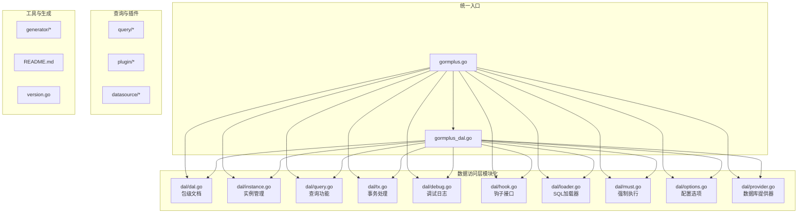
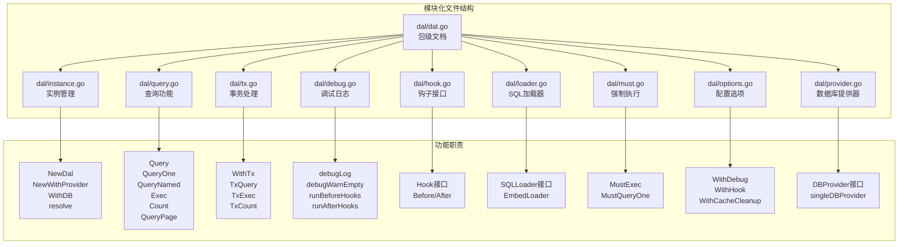
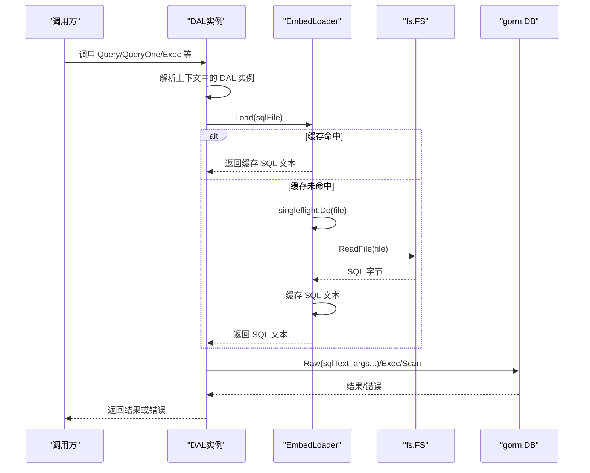
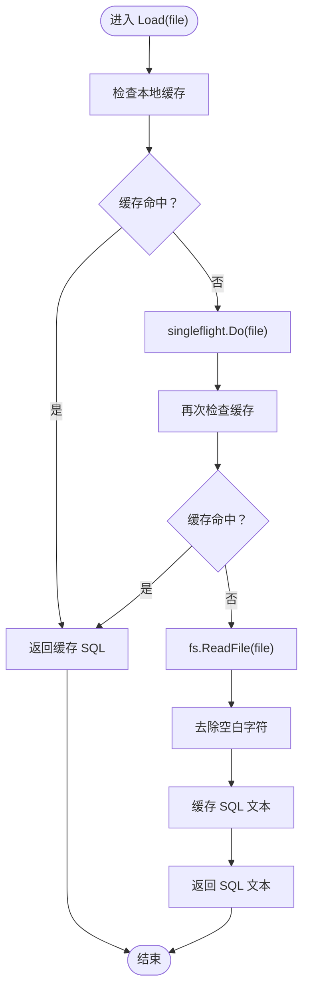
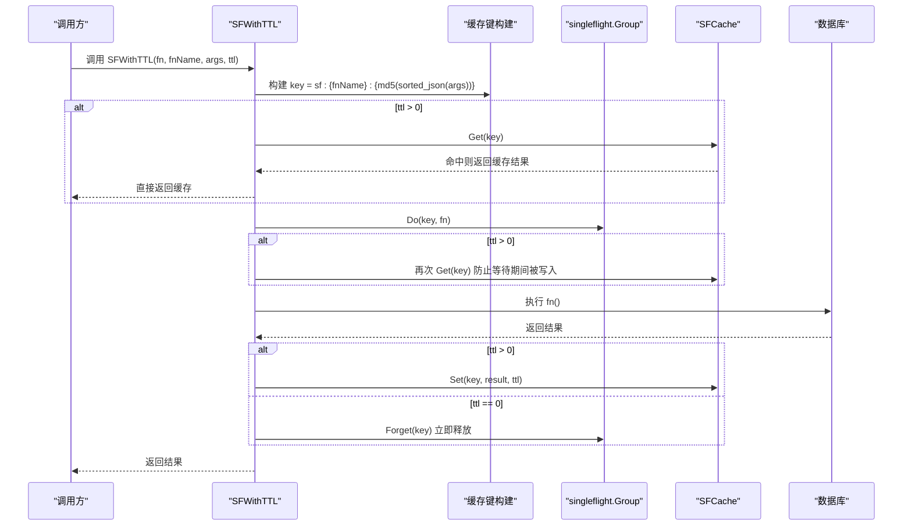
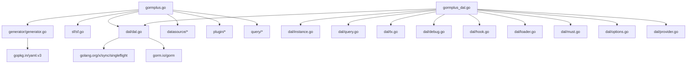

# SQL 文件管理

<cite>
**本文档引用的文件**
- [gormplus.go](file://gormplus.go)
- [gormplus_dal.go](file://gormplus_dal.go)
- [dal/dal.go](file://dal/dal.go)
- [dal/instance.go](file://dal/instance.go)
- [dal/query.go](file://dal/query.go)
- [dal/tx.go](file://dal/tx.go)
- [dal/debug.go](file://dal/debug.go)
- [dal/hook.go](file://dal/hook.go)
- [dal/loader.go](file://dal/loader.go)
- [dal/must.go](file://dal/must.go)
- [dal/options.go](file://dal/options.go)
- [dal/provider.go](file://dal/provider.go)
- [dal/dal_test.go](file://dal/dal_test.go)
- [generator/generator.go](file://generator/generator.go)
- [generator/config.go](file://generator/config.go)
- [README.md](file://README.md)
- [version.go](file://version.go)
</cite>

## 更新摘要
**所做更改**
- 更新了模块化结构分析，反映 dal 目录从单文件重构为多个专门文件
- 新增了各个模块文件的详细功能说明和职责划分
- 更新了架构图以体现新的文件组织方式
- 增强了代码组织和职责分离的相关内容

## 目录
1. [简介](#简介)
2. [项目结构](#项目结构)
3. [核心组件](#核心组件)
4. [架构概览](#架构概览)
5. [详细组件分析](#详细组件分析)
6. [依赖分析](#依赖分析)
7. [性能考虑](#性能考虑)
8. [故障排查指南](#故障排查指南)
9. [结论](#结论)
10. [附录](#附录)

## 简介
本项目提供了一套基于 SQL 文件化的数据访问层（DAL）解决方案，结合 go:embed 嵌入式 SQL 与 fs.FS 接口，实现了"业务逻辑与 SQL 分离"的设计理念。相比传统 ORM 的链式条件构造器，SQL 文件化管理更适合复杂 SQL、DBA 审核、版本管理与热更新场景。系统还集成了 SingleFlight + 可插拔缓存（SF）、多数据源管理、多租户与数据权限插件、慢查询监控与代码生成器等能力，形成完整的数据访问生态。

**更新** 项目现已采用高度模块化的文件组织结构，将原本集中在单个 dal.go 文件中的功能按职责拆分到多个专门文件中，提升了代码的可维护性和可读性。

## 项目结构
仓库采用模块化设计，核心模块包括：
- gormplus：统一入口，聚合各子模块
- dal：SQL 文件化查询（基于 embed + 泛型），现已重构为多个专门文件
- sf：SingleFlight + 可插拔缓存（防缓存击穿）
- query：原生 gorm 链式条件构造器与 gorm-gen 类型安全扩展
- plugin：多租户、数据权限、自动填充等插件
- datasource：多数据源管理（任意驱动 / 主从分离 / 读写分离）
- generator：代码生成器（Model / Repository / API）



**图表来源**
- [gormplus.go:1-132](file://gormplus.go#L1-L132)
- [gormplus_dal.go:1-416](file://gormplus_dal.go#L1-L416)
- [dal/dal.go:71-82](file://dal/dal.go#L71-L82)
- [dal/instance.go:17-31](file://dal/instance.go#L17-L31)
- [dal/query.go:18-74](file://dal/query.go#L18-L74)
- [dal/tx.go:15-20](file://dal/tx.go#L15-L20)
- [dal/debug.go:13-28](file://dal/debug.go#L13-L28)
- [dal/hook.go:41-44](file://dal/hook.go#L41-L44)
- [dal/loader.go:26-51](file://dal/loader.go#L26-L51)
- [dal/must.go:12-20](file://dal/must.go#L12-L20)
- [dal/options.go:11-15](file://dal/options.go#L11-L15)
- [dal/provider.go:13-32](file://dal/provider.go#L13-L32)

**章节来源**
- [README.md:17-41](file://README.md#L17-L41)
- [gormplus.go:88-101](file://gormplus.go#L88-L101)
- [gormplus_dal.go:118-132](file://gormplus_dal.go#L118-L132)

## 核心组件
- **SQL 文件化查询（dal）**：通过 fs.FS 接口加载 SQL，支持位置参数与命名参数，提供分页、事务、Hook、预热、缓存清理等能力。现已重构为模块化结构，每个文件负责特定职责。
- **go:embed 嵌入式 SQL**：在编译期将 SQL 文件打包进二进制，生产部署只需单一可执行文件。
- **SingleFlight + 可插拔缓存（sf）**：提供纯 singleflight 与带缓存两种保护模式，支持内存与 Redis 等缓存实现。
- **多数据源管理（datasource）**：支持任意 gorm 驱动、主从分离、读写分离、上下文自动切换。
- **插件体系（plugin）**：多租户、数据权限、自动填充、慢查询监控等。
- **代码生成器（generator）**：根据数据库表结构生成 Model、Repository、API、VO、DTO、Mapper 等代码。

**更新** 核心组件现已采用模块化设计，通过专门的文件实现不同的功能职责，提升了系统的可维护性和扩展性。

**章节来源**
- [dal/dal.go:1-15](file://dal/dal.go#L1-L15)
- [dal/instance.go:17-31](file://dal/instance.go#L17-L31)
- [dal/loader.go:26-51](file://dal/loader.go#L26-L51)
- [dal/query.go:18-74](file://dal/query.go#L18-L74)
- [dal/tx.go:15-20](file://dal/tx.go#L15-L20)
- [dal/debug.go:13-28](file://dal/debug.go#L13-L28)
- [dal/hook.go:41-44](file://dal/hook.go#L41-L44)
- [dal/must.go:12-20](file://dal/must.go#L12-L20)
- [dal/options.go:11-15](file://dal/options.go#L11-L15)
- [dal/provider.go:13-32](file://dal/provider.go#L13-L32)

## 架构概览
SQL 文件化管理的整体架构围绕"加载器（Loader）—实例（DAL）—查询（Query）—执行（Exec）"展开，结合 fs.FS 与 go:embed 实现 SQL 的静态嵌入与缓存，通过 Hook 与 Options 提供可观测性与可配置性。

**更新** 架构现已采用模块化设计，通过专门的文件实现不同的功能层次，提升了系统的清晰度和可维护性。

```mermaid
graph TB
subgraph "SQL 文件化层模块化"
FS[fs.FS 接口]
EMBED[go:embed 嵌入]
LOADER[EmbedLoader<br/>缓存 + singleflight]
DAL[SQLLoader 接口实现]
PROV[DBProvider<br/>数据库提供器]
ENDPOINT[包级函数<br/>Query/Exec/Count]
end
subgraph "查询执行层"
Q[Query/QueryOne/QueryNamed]
P[QueryPage/QueryPageNamed]
X[Exec/ExecAffected/Count]
TX[事务相关 TxQuery/TxExec/TxCount]
MUST[强制执行 MustExec/MustQueryOne]
ENDPOINT --> Q
ENDPOINT --> P
ENDPOINT --> X
ENDPOINT --> TX
ENDPOINT --> MUST
ENDPOINT --> PROV
ENDPOINT --> LOADER
ENDPOINT --> DAL
ENDPOINT --> FS
ENDPOINT --> EMBED
ENDPOINT --> Q
ENDPOINT --> P
ENDPOINT --> X
ENDPOINT --> TX
ENDPOINT --> MUST
ENDPOINT --> PROV
ENDPOINT --> LOADER
ENDPOINT --> DAL
ENDPOINT --> FS
ENDPOINT --> EMBED
ENDPOINT --> Q
ENDPOINT --> P
ENDPOINT --> X
ENDPOINT --> TX
ENDPOINT --> MUST
ENDPOINT --> PROV
ENDPOINT --> LOADER
ENDPOINT --> DAL
ENDPOINT --> FS
ENDPOINT --> EMBED
ENDPOINT --> Q
ENDPOINT --> P
ENDPOINT --> X
ENDPOINT --> TX
ENDPOINT --> MUST
ENDPOINT --> PROV
ENDPOINT --> LOADER
ENDPOINT --> DAL
ENDPOINT --> FS
ENDPOINT --> EMBED
ENDPOINT --> Q
ENDPOINT --> P
ENDPOINT --> X
ENDPOINT --> TX
ENDPOINT --> MUST
ENDPOINT --> PROV
ENDPOINT --> LOADER
ENDPOINT --> DAL
ENDPOINT --> FS
ENDPOINT --> EMBED
ENDPOINT --> Q
ENDPOINT --> P
ENDPOINT --> X
ENDPOINT --> TX
ENDPOINT --> MUST
ENDPOINT --> PROV
ENDPOINT --> LOADER
ENDPOINT --> DAL
ENDPOINT --> FS
ENDPOINT --> EMBED
ENDPOINT --> Q
ENDPOINT --> P
ENDPOINT --> X
ENDPOINT --> TX
ENDPOINT --> MUST
ENDPOINT --> PROV
ENDPOINT --> LOADER
ENDPOINT --> DAL
ENDPOINT --> FS
ENDPOINT --> EMBED
ENDPOINT --> Q
ENDPOINT --> P
ENDPOINT --> X
ENDPOINT --> TX
ENDPOINT --> MUST
ENDPOINT --> PROV
ENDPOINT --> LOADER
ENDPOINT --> DAL
ENDPOINT --> FS
ENDPOINT --> EMBED
ENDPOINT --> Q
ENDPOINT --> P
ENDPOINT --> X
ENDPOINT --> TX
ENDPOINT --> MUST
ENDPOINT --> PROV
ENDPOINT --> LOADER
ENDPOINT --> DAL
ENDPOINT --> FS
ENDPOINT --> EMBED
ENDPOINT --> Q
ENDPOINT --> P
ENDPOINT --> X
ENDPOINT --> TX
ENDPOINT --> MUST
ENDPOINT --> PROV
ENDPOINT --> LOADER
ENDPOINT --> DAL
ENDPOINT --> FS
ENDPOINT --> EMBED
ENDPOINT --> Q
ENDPOINT --> P
ENDPOINT --> X
ENDPOINT --> TX
ENDPOINT --> MUST
ENDPOINT --> PROV
END......
```

**图表来源**
- [dal/dal.go:71-82](file://dal/dal.go#L71-L82)
- [dal/instance.go:17-31](file://dal/instance.go#L17-L31)
- [dal/query.go:18-74](file://dal/query.go#L18-L74)
- [dal/tx.go:15-20](file://dal/tx.go#L15-L20)
- [dal/loader.go:26-51](file://dal/loader.go#L26-L51)
- [dal/must.go:12-20](file://dal/must.go#L12-L20)
- [dal/options.go:11-15](file://dal/options.go#L11-L15)
- [dal/provider.go:13-32](file://dal/provider.go#L13-L32)

## 详细组件分析

### 模块化结构分析
**更新** dal 目录现已从单个 dal.go 文件重构为多个专门文件，每个文件负责特定的职责：

- **dal/dal.go**：包级文档和模块化结构说明，保留包级注释
- **dal/instance.go**：DAL 实例管理，包含 NewDal、NewWithProvider、WithDB、resolve 等核心实例管理功能
- **dal/query.go**：查询功能实现，包含 Query、QueryOne、QueryNamed、Exec、Count、QueryPage 等查询方法
- **dal/tx.go**：事务处理功能，包含 WithTx、TxQuery、TxExec 等事务相关方法
- **dal/debug.go**：调试日志功能，包含 debugLog、debugWarnEmpty、runBeforeHooks、runAfterHooks
- **dal/hook.go**：Hook 接口定义，支持慢 SQL 监控、链路追踪等功能
- **dal/loader.go**：SQL 加载器实现，包含 EmbedLoader 和 SQLLoader 接口
- **dal/must.go**：强制执行功能，包含 MustExec、MustQueryOne 等强制执行方法
- **dal/options.go**：配置选项，包含 WithDebug、WithHook、WithCacheCleanup 等配置
- **dal/provider.go**：数据库提供器接口，支持单库、多库、读写分离等场景



**图表来源**
- [dal/dal.go:71-82](file://dal/dal.go#L71-L82)
- [dal/instance.go:43-85](file://dal/instance.go#L43-L85)
- [dal/query.go:40-74](file://dal/query.go#L40-L74)
- [dal/tx.go:15-20](file://dal/tx.go#L15-L20)
- [dal/debug.go:13-28](file://dal/debug.go#L13-L28)
- [dal/hook.go:41-44](file://dal/hook.go#L41-L44)
- [dal/loader.go:26-51](file://dal/loader.go#L26-L51)
- [dal/must.go:12-20](file://dal/must.go#L12-L20)
- [dal/options.go:20-34](file://dal/options.go#L20-L34)
- [dal/provider.go:13-32](file://dal/provider.go#L13-L32)

**章节来源**
- [dal/dal.go:71-82](file://dal/dal.go#L71-L82)
- [dal/instance.go:43-85](file://dal/instance.go#L43-L85)
- [dal/query.go:40-74](file://dal/query.go#L40-L74)
- [dal/tx.go:15-20](file://dal/tx.go#L15-L20)
- [dal/debug.go:13-28](file://dal/debug.go#L13-L28)
- [dal/hook.go:41-44](file://dal/hook.go#L41-L44)
- [dal/loader.go:26-51](file://dal/loader.go#L26-L51)
- [dal/must.go:12-20](file://dal/must.go#L12-L20)
- [dal/options.go:20-34](file://dal/options.go#L20-L34)
- [dal/provider.go:13-32](file://dal/provider.go#L13-L32)

### SQL 文件化查询（dal）组件
- **设计理念**
  - 将 SQL 完整写在独立 .sql 文件中，通过 //go:embed 打包进二进制，天然支持复杂 SQL、DBA 审核、版本管理。
  - 业务逻辑与 SQL 分离，便于维护与审查。
- **核心接口与实现**
  - SQLLoader 接口：定义 Load(file) 与 ClearCache()。
  - EmbedLoader：基于 fs.FS 的实现，内部使用 sync.Map 缓存与 singleflight.Group 防击穿。
  - DAL：持有 DBProvider 与 SQLLoader，提供包级函数（Query/QueryOne/QueryNamed/Exec/Count/QueryPage 等）。
- **查询流程**
  - 从 context 解析当前 DAL 实例（默认全局实例或 WithDB 注入的实例）。
  - 通过 loader.Load(file) 获取 SQL 文本（带缓存与 singleflight）。
  - 使用 gorm.DB.Raw(...) 执行 SQL，支持位置参数与命名参数。
  - 可选 Hook 与 Debug 输出。
- **事务与分页**
  - WithTx 开启事务，TxQuery/TxExec/TxCount 在事务上下文中执行。
  - QueryPage/QueryPageNamed 自动推导 count SQL（dataSqlFile → count_dataSqlFile），支持位置参数与命名参数。
- **预热与缓存清理**
  - Preload 预热 SQL 文件缓存，便于启动时提前加载。
  - WithCacheCleanup 开启定时清理，防止内存持续增长。
- **错误处理与调试**
  - Debug 模式下打印 SQL、参数、耗时与错误。
  - 返回零行时打印警告，便于定位路径或条件问题。

**更新** 查询功能现已分布在 query.go 文件中，提供了完整的查询、执行、分页等核心功能，支持多种参数格式和事务处理。



**图表来源**
- [dal/query.go:40-74](file://dal/query.go#L40-L74)
- [dal/instance.go:184-195](file://dal/instance.go#L184-L195)
- [dal/loader.go:53-77](file://dal/loader.go#L53-L77)

**章节来源**
- [dal/query.go:40-74](file://dal/query.go#L40-L74)
- [dal/instance.go:184-195](file://dal/instance.go#L184-L195)
- [dal/loader.go:53-77](file://dal/loader.go#L53-L77)

### go:embed 嵌入式 SQL 实现机制
- **嵌入方式**
  - 在调用方包内使用 //go:embed 声明 SQL 目录，通过 fs.Sub 去除顶层目录前缀，调用时路径更简洁。
  - 通过 NewEmbedLoader(fs.FS) 创建加载器，dal.NewDal 初始化时注入。
- **加载流程**
  - Load(file) 先查本地缓存（sync.Map），命中则直接返回。
  - 未命中时通过 singleflight.Do(file) 防止并发重复加载，内部再查一次缓存，然后 fs.ReadFile 读取 SQL，去空白字符后缓存并返回。
- **缓存与清理**
  - 默认缓存永不过期，可通过 WithCacheCleanup 设置定时清理周期。
  - ClearCache 清空所有已缓存的 SQL，用于热更新或测试场景。

**更新** SQL 加载器功能现已专门化到 loader.go 文件中，提供了完整的加载器实现和缓存管理功能。



**图表来源**
- [dal/loader.go:53-77](file://dal/loader.go#L53-L77)

**章节来源**
- [dal/loader.go:26-51](file://dal/loader.go#L26-L51)
- [dal/loader.go:53-77](file://dal/loader.go#L53-L77)

### SingleFlight + 可插拔缓存（sf）组件
- **设计目标**
  - 防止缓存击穿：同一时刻仅一个 goroutine 真正执行查询，其余等待共享结果。
  - 可插拔缓存：默认内存缓存，也可注入 Redis 等实现。
- **核心能力**
  - SF/SFWithTTL：带缓存的查询封装，TTL 内命中直接返回。
  - SFNoCache：纯 singleflight，不缓存结果。
  - SFInvalidate：主动失效指定查询的缓存。
  - RegisterCache：注册自定义缓存实现（需在首次调用 SF 之前）。
- **缓存键构建**
  - 由 fnName + 排序后的 args JSON 构成，MD5 哈希作为 key 的一部分，保证确定性与一致性。



**图表来源**
- [sf/sf.go:252-349](file://sf/sf.go#L252-L349)
- [sf/sf.go:355-394](file://sf/sf.go#L355-L394)

**章节来源**
- [sf/sf.go:46-92](file://sf/sf.go#L46-L92)
- [sf/sf.go:116-131](file://sf/sf.go#L116-L131)
- [sf/sf.go:252-349](file://sf/sf.go#L252-L349)

### 多数据源与上下文切换
- **数据源管理**
  - 通过 DataSourceManager 注册多个数据源组（一主多从），支持任意 gorm 驱动。
  - DS.Auto(ctx) 根据上下文自动选择主库或从库，支持中间件标记读写。
- **上下文注入**
  - WithDB 将指定 DAL 实例注入 context，后续调用自动使用该实例，无需修改业务代码。

**更新** 多数据源功能现已专门化到 provider.go 文件中，提供了 DBProvider 接口和 singleDBProvider 实现，支持灵活的数据源切换。

**章节来源**
- [gormplus.go:155-214](file://gormplus.go#L155-L214)
- [dal/provider.go:13-32](file://dal/provider.go#L13-L32)
- [dal/instance.go:166-182](file://dal/instance.go#L166-L182)

### 插件体系（多租户、数据权限、自动填充、慢查询）
- **多租户插件**：自动注入租户条件，支持多字段、表级覆盖、联表自动注入与安全策略。
- **数据权限插件**：通过中间件注入条件函数，自动为查询追加数据权限条件。
- **自动填充插件**：在创建/更新时自动填充操作人信息。
- **慢查询监控**：可配置阈值与日志输出，支持结构化日志。

**章节来源**
- [gormplus.go:475-661](file://gormplus.go#L475-L661)
- [gormplus.go:663-748](file://gormplus.go#L663-L748)
- [gormplus.go:750-825](file://gormplus.go#L750-L825)
- [gormplus.go:827-861](file://gormplus.go#L827-L861)

### 代码生成器（generator）
- **功能概述**
  - 读取数据库表结构，生成 Model、Repository、API、VO、DTO、Mapper 等代码。
  - 支持 YAML 配置文件与内嵌模板，模板可自定义覆盖。
- **使用方式**
  - 通过 LoadConfig 加载配置，或直接传入 Config。
  - 调用 Generate(cfg) 生成代码，支持交互式输入表名。

**章节来源**
- [generator/generator.go:1-1260](file://generator/generator.go#L1-L1260)
- [generator/config.go:1-47](file://generator/config.go#L1-L47)

## 依赖分析
- **模块耦合**
  - gormplus 作为统一入口，聚合各子模块，低耦合高内聚。
  - dal 依赖 gorm 与 singleflight，通过 fs.FS 抽象与 go:embed 解耦具体存储介质。
  - sf 与 dal 解耦，可独立使用，亦可与 dal 配合实现查询保护。
- **外部依赖**
  - gorm.io/gorm：ORM 核心
  - golang.org/x/sync/singleflight：并发控制
  - gopkg.in/yaml.v3：配置解析

**更新** 依赖关系保持稳定，模块化重构并未改变外部依赖，但提升了内部模块间的解耦程度。



**图表来源**
- [gormplus.go:88-101](file://gormplus.go#L88-L101)
- [gormplus_dal.go:102-119](file://gormplus_dal.go#L102-L119)
- [dal/instance.go:26-31](file://dal/instance.go#L26-L31)
- [dal/loader.go:42-46](file://dal/loader.go#L42-L46)

**章节来源**
- [gormplus.go:88-101](file://gormplus.go#L88-L101)
- [gormplus_dal.go:102-119](file://gormplus_dal.go#L102-L119)
- [dal/instance.go:26-31](file://dal/instance.go#L26-L31)
- [dal/loader.go:42-46](file://dal/loader.go#L42-L46)

## 性能考虑
- **SQL 加载性能**
  - EmbedLoader 使用 sync.Map 缓存与 singleflight 防击穿，减少重复 IO 与并发竞争。
  - WithCacheCleanup 定时清理可防止内存无限增长，适合文件数量较多的场景。
- **查询保护**
  - SF/SFWithTTL 在高频场景下显著降低数据库压力，TTL 选择需结合业务实时性需求。
  - SFNoCache 适合对实时性要求极高的场景（如详情、余额查询）。
- **事务与锁**
  - TxQuery/TxExec/TxCount 在事务上下文中执行，避免并发冲突。
  - FOR UPDATE 等锁策略需谨慎使用，避免长事务与死锁。
- **缓存键与参数**
  - 缓存键由 fnName + 排序后的参数 JSON 构成，确保 key 的确定性与一致性。
  - 命名参数 @name 与位置参数 ? 可混合使用，命名参数更易读且顺序无关。

**更新** 性能优化策略保持不变，模块化重构进一步提升了各组件的性能表现。

**章节来源**
- [sf/sf.go:252-349](file://sf/sf.go#L252-L349)
- [dal/loader.go:53-77](file://dal/loader.go#L53-L77)
- [dal/query.go:40-74](file://dal/query.go#L40-L74)

## 故障排查指南
- **初始化问题**
  - 未调用 NewDal：resolve(ctx) 会 panic，提示"未初始化，请先调用 dal.NewDal()"。
  - Loader 为 nil：NewDal/WithProvider 会返回错误。
- **SQL 文件问题**
  - 文件不存在：EmbedLoader.Load 返回错误，需检查路径与 fs.Sub 前缀。
  - 零行返回：Debug 模式打印 WARN，检查 SQL 路径与查询条件。
- **缓存问题**
  - 缓存未更新：使用 ClearCache 或 WithCacheCleanup 定时清理。
  - 缓存击穿：使用 SF/SFWithTTL 或 SFNoCache。
- **事务问题**
  - 事务未提交/回滚：WithTx(fn) 返回 nil 提交，返回 error 自动回滚。
  - 锁冲突：FOR UPDATE 等锁需配合事务与合理索引。

**更新** 故障排查指南保持完整，模块化结构使得问题定位更加精确。

**章节来源**
- [dal/instance.go:184-195](file://dal/instance.go#L184-L195)
- [dal/loader.go:61-64](file://dal/loader.go#L61-L64)
- [dal/debug.go:30-38](file://dal/debug.go#L30-L38)
- [dal/tx.go:15-20](file://dal/tx.go#L15-L20)

## 结论
SQL 文件化管理通过 go:embed 与 fs.FS 接口，将 SQL 与业务解耦，提升可维护性与可审计性。结合 DAL 的缓存、singleflight、Hook、事务与分页能力，形成一套完整的数据访问方案。配合 SF 缓存、多数据源、插件体系与代码生成器，能够满足复杂业务场景下的高性能与高可用需求。

**更新** 通过高度模块化的文件组织结构，系统在保持原有强大功能的同时，显著提升了代码的可维护性、可读性和可扩展性。每个文件专注于特定职责，便于团队协作和长期维护。

建议在复杂 SQL、DBA 审核与版本管理场景优先采用 SQL 文件化方案，在简单 CRUD 场景可结合链式条件构造器与 gorm-gen 使用。

## 附录
- **版本信息**
  - 当前版本：v1.0.13

**章节来源**
- [version.go:1-4](file://version.go#L1-L4)