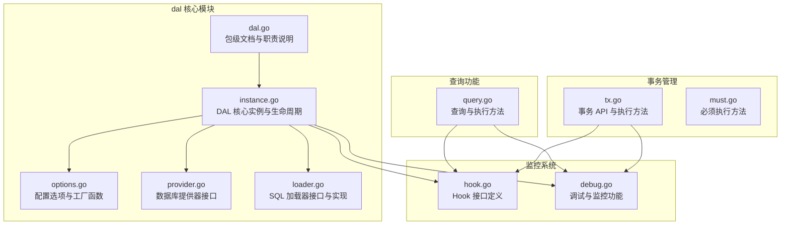
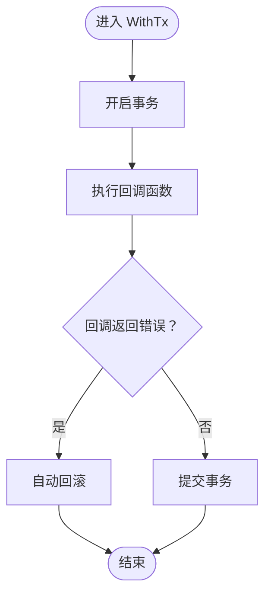
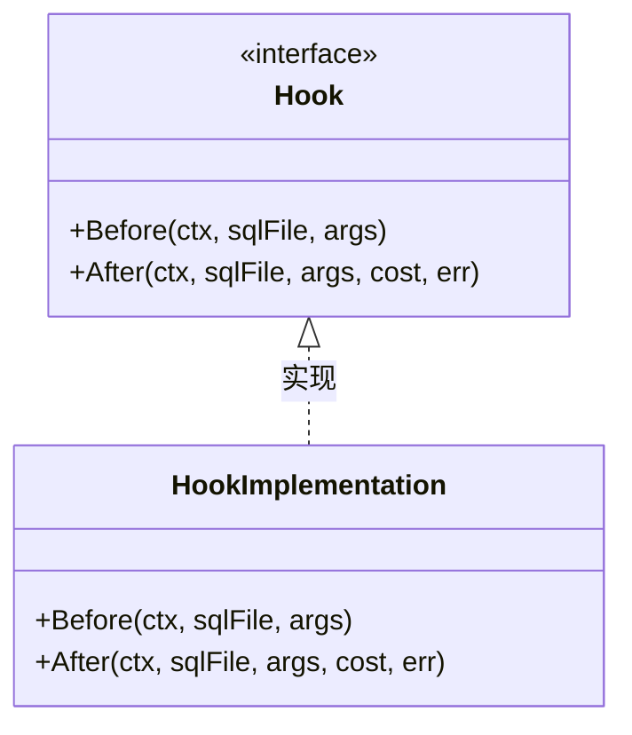
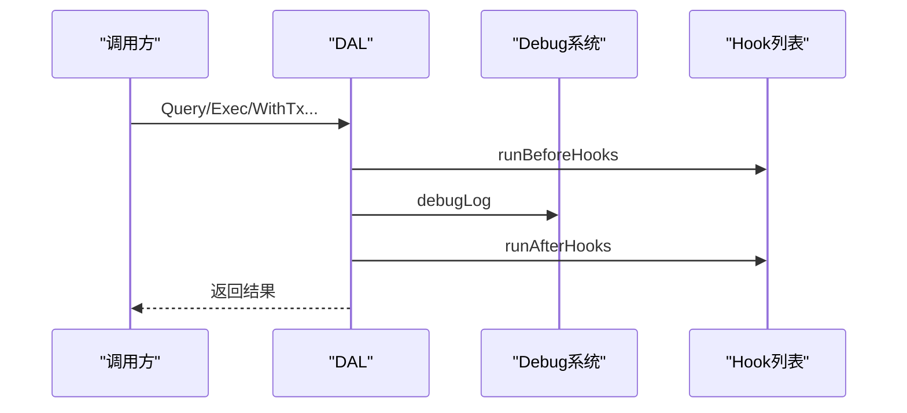
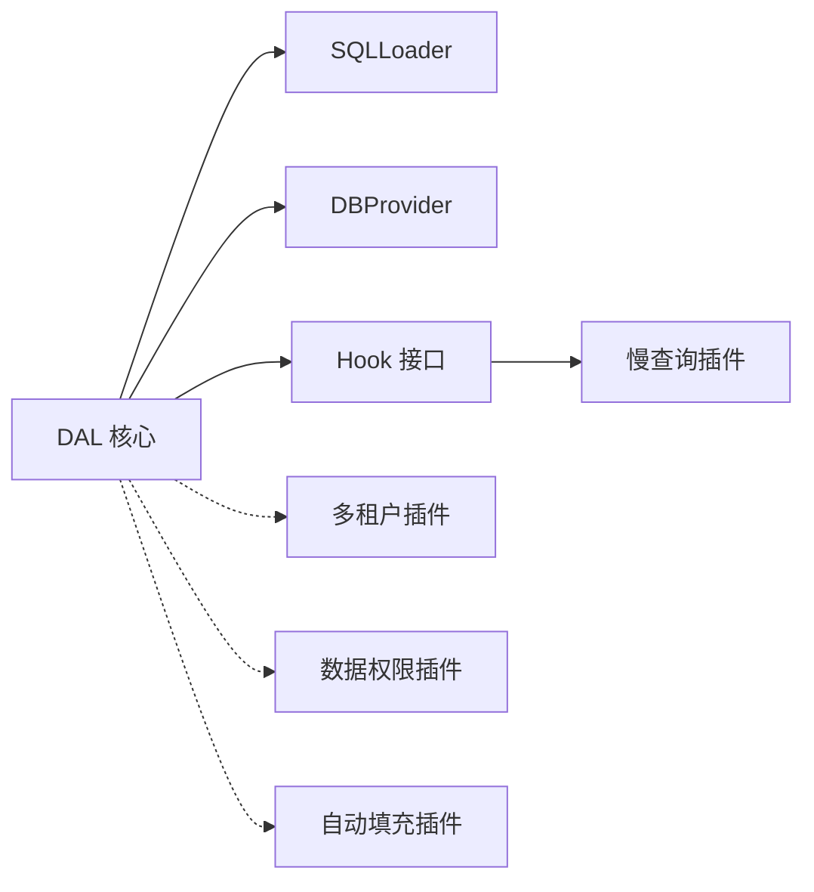

# 事务和 Hook 系统

<cite>
**本文档引用的文件**
- [dal.go](file://dal/dal.go)
- [tx.go](file://dal/tx.go)
- [hook.go](file://dal/hook.go)
- [debug.go](file://dal/debug.go)
- [instance.go](file://dal/instance.go)
- [options.go](file://dal/options.go)
- [provider.go](file://dal/provider.go)
- [loader.go](file://dal/loader.go)
- [query.go](file://dal/query.go)
- [must.go](file://dal/must.go)
- [dal_test.go](file://dal/dal_test.go)
- [slow_query.go](file://query/slow_query.go)
- [query_builder.go](file://query/query_builder.go)
- [tenant.go](file://plugin/tenant.go)
- [dataPermission.go](file://plugin/dataPermission.go)
- [autoOperator.go](file://plugin/autoOperator.go)
- [ctx.go](file://plugin/ctx.go)
- [generator.go](file://generator/generator.go)
- [example_test.go](file://generator/example_test.go)
</cite>

## 更新摘要
**变更内容**
- 更新模块化结构：事务管理、Hook 系统、Debug 功能现在分布在独立文件中
- 新增事务 API 详细说明：WithTx、TxQuery、TxQueryOne、TxQueryNamed、TxCount、TxExec
- 新增 Hook 接口定义和生命周期说明
- 新增 Debug 功能的详细实现和使用指南
- 更新架构图以反映新的模块化设计
- 增强监控能力和调试技巧

## 目录
1. [简介](#简介)
2. [模块化架构概览](#模块化架构概览)
3. [核心组件](#核心组件)
4. [事务管理系统](#事务管理系统)
5. [Hook 系统设计](#hook-系统设计)
6. [Debug 调试功能](#debug-调试功能)
7. [详细组件分析](#详细组件分析)
8. [依赖分析](#依赖分析)
9. [性能考虑](#性能考虑)
10. [故障排查指南](#故障排查指南)
11. [结论](#结论)
12. [附录](#附录)

## 简介
本文件面向 DAL（数据访问层）的事务管理和 Hook 系统，系统性阐述以下内容：
- **模块化架构**：事务管理、Hook 系统、Debug 功能现在分布在独立文件中，提供更好的代码组织和维护性
- **事务支持的实现机制**：如何在 SQL 查询中使用事务，以及事务回滚的触发时机与流程
- **Hook 系统的设计理念与生命周期**：Before/After 钩子的执行时机、用途与注册顺序
- **Debug 功能的增强监控能力**：详细的日志记录、零行返回告警、Hook 执行监控
- **Hook 实现示例**：慢查询监控、指标采集、链路追踪等常见用例
- **Hook 的注册机制与执行顺序**，以及如何实现自定义 Hook
- **事务最佳实践与 Hook 调试技巧**

## 模块化架构概览
本项目采用高度模块化的架构设计，将不同功能职责分离到独立文件中，提高代码的可维护性和扩展性。

**图表来源**
- [dal.go:71-82](file://dal/dal.go#L71-L82)
- [instance.go:17-31](file://dal/instance.go#L17-L31)
- [tx.go:15-20](file://dal/tx.go#L15-L20)
- [hook.go:41-44](file://dal/hook.go#L41-L44)
- [debug.go:13-50](file://dal/debug.go#L13-L50)

**章节来源**
- [dal.go:71-82](file://dal/dal.go#L71-L82)
- [instance.go:17-31](file://dal/instance.go#L17-L31)

## 核心组件
- **DAL 核心实例**：负责 SQL 加载、数据库提供器、Hook 生命周期、Debug 日志、缓存清理等
- **SQLLoader**：支持 embed.FS 的 SQL 文件加载与缓存，具备 singleflight 防击穿能力
- **DBProvider**：抽象数据库提供器，支持单库、多库、读写分离等场景
- **Hook 接口**：定义 Before/After 两个生命周期钩子，支持注册多个，按注册顺序依次执行
- **事务 API**：WithTx 与一系列 Tx* 方法，统一在事务上下文中执行查询与执行
- **Debug 功能**：详细的日志记录、零行返回告警、Hook 执行监控
- **插件生态**：多租户、数据权限、自动填充、慢查询等，均通过 gorm Callback 或 Hook 机制集成

**章节来源**
- [instance.go:17-31](file://dal/instance.go#L17-L31)
- [loader.go:17-24](file://dal/loader.go#L17-L24)
- [provider.go:21-23](file://dal/provider.go#L21-L23)
- [hook.go:41-44](file://dal/hook.go#L41-L44)
- [tx.go:15-20](file://dal/tx.go#L15-L20)
- [debug.go:13-50](file://dal/debug.go#L13-L50)

## 事务管理系统

### WithTx 事务管理
WithTx 基于 gorm.DB.Transaction 封装，提供简洁的事务管理接口：

**图表来源**
- [tx.go:15-20](file://dal/tx.go#L15-L20)

### 事务查询方法
- **TxQuery**：在事务中查询多条记录（位置参数 ?）
- **TxQueryOne**：在事务中查询单条记录（位置参数 ?）
- **TxQueryNamed**：在事务中命名参数查询多条记录（命名参数 @name）
- **TxCount**：在事务中查询数量
- **TxExec**：在事务中执行 SQL（INSERT / UPDATE / DELETE）

**章节来源**
- [tx.go:15-338](file://dal/tx.go#L15-L338)

## Hook 系统设计

### Hook 接口定义
Hook 接口定义了两个生命周期钩子：

**图表来源**
- [hook.go:41-44](file://dal/hook.go#L41-L44)

### Hook 生命周期
- **Before 钩子**：在 SQL 执行前调用，可用于参数校验、上下文准备
- **After 钩子**：在 SQL 执行后调用，可用于日志记录、指标统计、错误处理

### Hook 注册机制
- **WithHook**：将 Hook 实例加入 DAL.opts.hooks，支持多次调用
- **执行顺序**：先注册先执行，遵循 FIFO 顺序
- **错误处理**：Hook 内部应做好异常处理，避免影响后续 Hook 执行

**章节来源**
- [hook.go:12-44](file://dal/hook.go#L12-L44)
- [options.go:36-48](file://dal/options.go#L36-L48)
- [debug.go:40-50](file://dal/debug.go#L40-L50)

## Debug 调试功能

### Debug 日志系统
Debug 功能提供了详细的 SQL 执行监控：

- **debugLog**：记录 SQL 文件路径、耗时、SQL 文本、参数、错误
- **debugWarnEmpty**：当查询/执行返回零行时打印警告
- **runBeforeHooks/runAfterHooks**：执行所有注册的 Hook

**图表来源**
- [debug.go:13-50](file://dal/debug.go#L13-L50)

### Debug 配置
- **WithDebug**：开启/关闭 Debug 日志
- **建议**：仅在开发和测试环境开启，避免生产环境日志噪声影响性能

**章节来源**
- [debug.go:13-50](file://dal/debug.go#L13-L50)
- [options.go:20-34](file://dal/options.go#L20-L34)

## 详细组件分析

### 事务支持与回滚机制
- **WithTx**：基于 gorm.DB.Transaction 封装，传入回调函数，若回调返回 nil 则提交，返回 error 则自动回滚
- **TxQuery/TxQueryOne/TxQueryNamed/TxCount/TxExec**：在事务上下文中执行，统一走 tx.WithContext(ctx)
- **回滚触发**：回调函数返回非 nil 错误时，gorm 会自动回滚；若中途发生数据库错误，也会触发回滚
- **一致性**：事务内的查询与执行共享同一事务对象，保证 ACID

**图表来源**
- [tx.go:15-20](file://dal/tx.go#L15-L20)

**章节来源**
- [tx.go:15-338](file://dal/tx.go#L15-L338)

### Hook 实现示例与常见用例
- **慢查询监控**：基于 gorm Callback 的慢查询插件，可与 DAL Hook 协同使用，统一输出 traceID、耗时、SQL 等信息
- **指标采集**：在 After 钩子中统计耗时、行数、错误次数等，上报至监控系统
- **链路追踪**：在 Before/After 中读取 ctx 中的 traceID，注入到日志或指标标签中
- **自定义 Hook**：实现 Hook 接口，注册后按顺序执行，注意错误传播与性能影响

**章节来源**
- [hook.go:12-44](file://dal/hook.go#L12-L44)
- [slow_query.go:13-83](file://query/slow_query.go#L13-L83)

### 事务最佳实践
- **将强一致性的操作放在同一事务中**，减少跨事务的数据不一致风险
- **在 WithTx 的回调中**，尽量将所有查询与执行集中在一次事务内，避免跨事务状态变更
- **对于长事务**，注意锁竞争与超时控制，必要时拆分为多个短事务
- **使用 FOR UPDATE 等锁机制时**，确保在事务内完成，避免锁释放过早导致竞态

**章节来源**
- [tx.go:15-338](file://dal/tx.go#L15-L338)

### Hook 调试技巧
- **开启 Debug**：WithDebug(true) 可在每次 SQL 执行后输出文件路径、耗时、SQL 文本、参数、错误等信息，便于定位问题
- **零行返回告警**：当查询/执行返回零行时，Debug 模式会打印警告，帮助发现路径或条件错误
- **Hook 顺序验证**：通过多次 WithHook 注册，观察日志输出顺序，确认执行顺序符合预期
- **慢查询联动**：结合慢查询插件，快速定位耗时 SQL 并关联 traceID

**章节来源**
- [debug.go:13-50](file://dal/debug.go#L13-L50)
- [options.go:20-34](file://dal/options.go#L20-L34)

## 依赖分析
- **DAL 依赖**：SQLLoader 与 DBProvider，通过 provider.Get(ctx) 获取带 context 的 gorm.DB
- **Hook 与 Debug**：在 DAL 查询流程中被统一调用
- **插件通过 gorm Callback 注入**，与 DAL 的 Hook 互补：插件关注 SQL 执行层面的横切，Hook 关注应用层的横切

**图表来源**
- [instance.go:26-29](file://dal/instance.go#L26-L29)
- [loader.go:17-24](file://dal/loader.go#L17-L24)
- [provider.go:21-23](file://dal/provider.go#L21-L23)

**章节来源**
- [instance.go:26-29](file://dal/instance.go#L26-L29)
- [loader.go:17-24](file://dal/loader.go#L17-L24)
- [provider.go:21-23](file://dal/provider.go#L21-L23)

## 性能考虑
- **SQL 缓存与 singleflight**：EmbedLoader 使用 sync.Map 缓存 SQL 文本，并通过 singleflight 防击穿，降低重复加载开销
- **定时清理**：WithCacheCleanup 可配置后台 goroutine 定期清空 SQL 缓存，避免内存无限增长
- **Debug 日志**：仅在开发/测试环境开启 WithDebug，避免生产环境日志噪声影响性能
- **Hook 数量**：Hook 越多，每次查询的额外开销越大，建议按需注册与精简实现

**章节来源**
- [loader.go:53-86](file://dal/loader.go#L53-L86)
- [instance.go:237-254](file://dal/instance.go#L237-L254)
- [options.go:50-66](file://dal/options.go#L50-L66)
- [options.go:20-34](file://dal/options.go#L20-L34)

## 故障排查指南
- **未初始化**：若未调用 NewDal 初始化全局实例，resolve(ctx) 会 panic，需确保应用启动时完成初始化
- **SQL 文件缺失**：Loader.Load 返回错误时，需检查 SQL 文件路径与 embed 声明是否正确
- **零行返回**：Debug 模式会打印警告，检查 SQL 路径与查询条件是否正确
- **事务未提交/回滚**：确认回调返回 nil 或 error，错误将触发回滚；必要时在 WithTx 内捕获并返回错误
- **Hook 异常**：若某个 Hook 抛出 panic，会影响后续 Hook 执行，建议在 Hook 内部做好异常处理与日志记录

**章节来源**
- [instance.go:184-195](file://dal/instance.go#L184-L195)
- [debug.go:30-38](file://dal/debug.go#L30-L38)
- [tx.go:15-20](file://dal/tx.go#L15-L20)

## 结论
本项目通过 DAL 将 SQL 文件化、泛型化与 Hook 机制有机结合，既保证了 SQL 的可维护性与可测试性，又提供了强大的横切能力。新的模块化架构将事务管理、Hook 系统、Debug 功能分离到独立文件中，提高了代码的可维护性和扩展性。事务支持基于 gorm.Transaction，简单可靠；Hook 生命周期清晰，注册顺序固定，便于实现监控、指标与链路追踪等横切需求。Debug 功能提供了详细的监控能力，结合插件生态（多租户、数据权限、自动填充、慢查询），可在不侵入业务代码的前提下实现企业级数据访问层能力。

## 附录
- **代码生成器**：支持从数据库表生成模型、DAO、Repository、API、DTO、VO、Mapper 等代码，提升开发效率
- **示例**：可通过示例配置文件加载与直接传入配置两种方式生成代码

**章节来源**
- [generator.go:1-35](file://generator/generator.go#L1-L35)
- [example_test.go:7-35](file://generator/example_test.go#L7-L35)