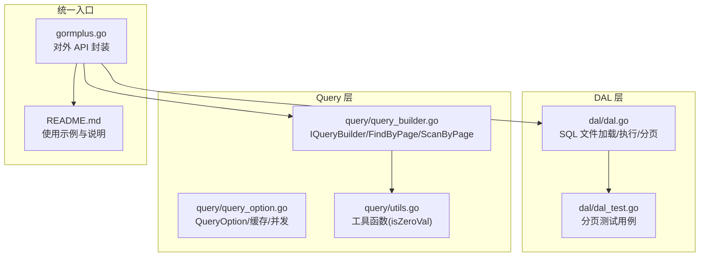
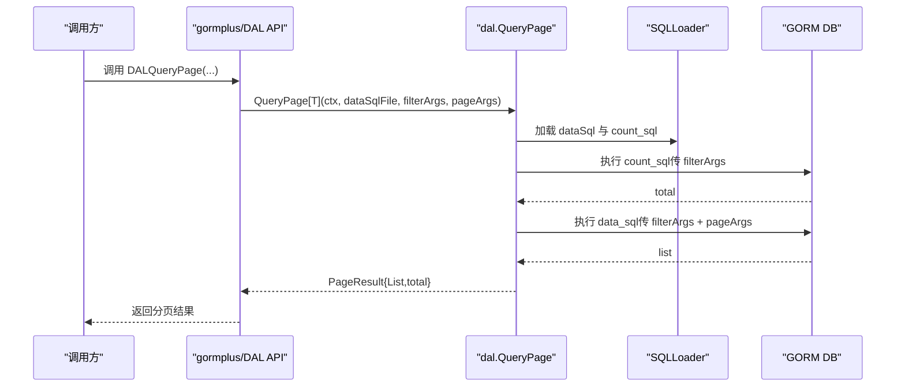
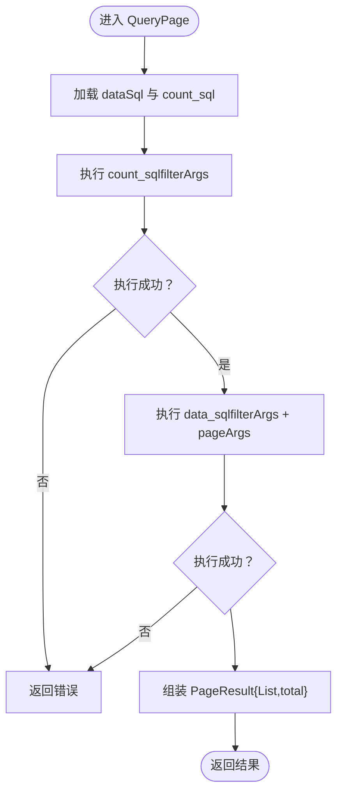
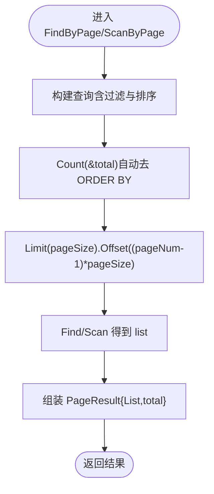
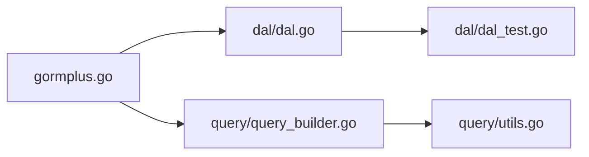

# 分页查询支持

<cite>
**本文引用的文件**
- [dal.go](file://dal/dal.go)
- [dal_test.go](file://dal/dal_test.go)
- [query_builder.go](file://query/query_builder.go)
- [query_option.go](file://query/query_option.go)
- [utils.go](file://query/utils.go)
- [gormplus.go](file://gormplus.go)
- [README.md](file://README.md)
</cite>

## 目录
1. [简介](#简介)
2. [项目结构](#项目结构)
3. [核心组件](#核心组件)
4. [架构概览](#架构概览)
5. [详细组件分析](#详细组件分析)
6. [依赖分析](#依赖分析)
7. [性能考量](#性能考量)
8. [故障排查指南](#故障排查指南)
9. [结论](#结论)
10. [附录](#附录)

## 简介
本技术文档聚焦于 DAL 分页查询功能，系统阐述其设计原理、实现机制与最佳实践。重点涵盖：
- LIMIT 与 OFFSET 参数的使用与推导
- 分页 SQL 模式与常见写法
- 两种分页模式：基于 SQL 文件的 DAL 分页与基于链式查询的分页
- 性能优化策略（索引、查询计划、缓存）
- 边界处理、空结果集与错误处理

## 项目结构
围绕分页查询，相关模块与文件如下：
- DAL 层：负责 SQL 文件化查询、分页结果封装、命名参数与位置参数支持
- Query 层：提供原生 gorm 链式条件构造器与泛型分页方法
- gormplus 统一入口：对外暴露 DAL 与 Query 的便捷 API

图表来源
- [dal.go:1-1506](file://dal/dal.go#L1-L1506)
- [dal_test.go:1-1149](file://dal/dal_test.go#L1-L1149)
- [query_builder.go:1-307](file://query/query_builder.go#L1-L307)
- [query_option.go:1-199](file://query/query_option.go#L1-L199)
- [utils.go:1-44](file://query/utils.go#L1-L44)
- [gormplus.go:1-1305](file://gormplus.go#L1-L1305)
- [README.md:1-891](file://README.md#L1-L891)

章节来源
- [dal.go:1-1506](file://dal/dal.go#L1-L1506)
- [query_builder.go:1-307](file://query/query_builder.go#L1-L307)
- [gormplus.go:899-1295](file://gormplus.go#L899-L1295)
- [README.md:696-891](file://README.md#L696-L891)

## 核心组件
- 分页查询入口（SQL 文件化）：通过数据 SQL 文件与 count SQL 文件配对，自动推导 count 文件名，分别执行数据查询与总数统计。
- 分页查询入口（链式查询）：通过 IQueryBuilder 构建条件，再调用 FindByPage/ScanByPage，内部自动执行 Count 与 Limit/Offset。
- 参数支持：位置参数（?）与命名参数（@name）两种模式，满足不同场景需求。
- 结果封装：分页结果包含 List 与 Total，便于直接返回给前端。

章节来源
- [dal.go:586-628](file://dal/dal.go#L586-L628)
- [query_builder.go:246-306](file://query/query_builder.go#L246-L306)
- [gormplus.go:1143-1194](file://gormplus.go#L1143-L1194)

## 架构概览
DAL 分页查询的整体流程如下：
- 数据 SQL：包含过滤条件、排序、LIMIT 与 OFFSET
- Count SQL：与数据 SQL 过滤条件一致，仅去除分页部分
- 执行顺序：先执行 Count SQL 得到 Total，再执行数据 SQL 得到 List
- 结果封装：将 List 与 Total 组装为 PageResult 返回

图表来源
- [dal.go:586-628](file://dal/dal.go#L586-L628)
- [gormplus.go:1143-1171](file://gormplus.go#L1143-L1171)

## 详细组件分析

### 组件 A：SQL 文件化分页（QueryPage/QueryPageNamed）
- 设计要点
  - 数据 SQL 文件与 count SQL 文件名约定：数据 SQL 文件名前缀加 "count_" 即为 count SQL 文件名
  - 参数拆分：filterArgs 仅传给 count SQL；pageArgs（LIMIT, OFFSET）仅传给数据 SQL
  - 支持位置参数与命名参数两种模式
- 关键流程
  - 加载数据 SQL 与 count SQL
  - 先执行 count SQL，得到 total
  - 再执行数据 SQL，得到 list
  - 组装 PageResult 返回

图表来源
- [dal.go:586-628](file://dal/dal.go#L586-L628)
- [dal_test.go:545-611](file://dal/dal_test.go#L545-L611)

章节来源
- [dal.go:586-628](file://dal/dal.go#L586-L628)
- [dal_test.go:545-611](file://dal/dal_test.go#L545-L611)
- [gormplus.go:1143-1194](file://gormplus.go#L1143-L1194)

### 组件 B：链式查询分页（FindByPage/ScanByPage）
- 设计要点
  - 通过 IQueryBuilder 构建过滤条件与排序
  - FindByPage：使用 Find，适合直接映射到模型结构
  - ScanByPage：使用 Scan，适合联表查询与 VO 映射
  - 内部自动 Count，并在 Count 时去除 ORDER BY（避免排序带来的统计偏差）
- 关键流程
  - Build 后调用 Count 得到 total
  - 设置 Limit 与 Offset 后执行 Find/Scan 得到 list
  - 组装返回

图表来源
- [query_builder.go:246-306](file://query/query_builder.go#L246-L306)

章节来源
- [query_builder.go:246-306](file://query/query_builder.go#L246-L306)
- [gormplus.go:250-288](file://gormplus.go#L250-L288)

### 组件 C：参数与 SQL 模式
- 位置参数（?）
  - 数据 SQL：WHERE ... ORDER BY ... LIMIT ? OFFSET ?
  - Count SQL：WHERE ...（与数据 SQL 过滤一致，去掉 LIMIT/OFFSET）
- 命名参数（@name）
  - 数据 SQL：WHERE ... ORDER BY ... LIMIT @limit OFFSET @offset
  - Count SQL：WHERE ...（同样去掉分页参数）

章节来源
- [dal.go:586-628](file://dal/dal.go#L586-L628)
- [query_builder.go:246-306](file://query/query_builder.go#L246-L306)
- [README.md:790-800](file://README.md#L790-L800)

### 组件 D：空结果集与错误处理
- 空结果集
  - Query/QueryOne/QueryNamed/ExecAffected 等在 debug 模式下会输出警告日志，便于定位路径或条件问题
- 错误处理
  - SQL 文件加载失败、执行失败、事务回滚等均有明确错误返回
  - Must 系列方法在失败时直接 panic，适用于启动阶段或确定性场景

章节来源
- [dal.go:529-566](file://dal/dal.go#L529-L566)
- [dal_test.go:284-308](file://dal/dal_test.go#L284-L308)
- [dal_test.go:885-940](file://dal/dal_test.go#L885-L940)

## 依赖分析
- DAL 与 Query 的关系
  - gormplus.go 将 DAL 与 Query 的能力统一导出，调用方通过统一入口使用
- Query 层内部依赖
  - IQueryBuilder 提供条件拼装
  - FindByPage/ScanByPage 依赖 gorm.DB 的 Count/Limit/Offset/Find/Scan
- 工具函数
  - isZeroVal 用于 WhereIf/BetweenIfNotZero 等条件开关判断

图表来源
- [gormplus.go:1-1305](file://gormplus.go#L1-L1305)
- [dal.go:1-1506](file://dal/dal.go#L1-L1506)
- [query_builder.go:1-307](file://query/query_builder.go#L1-L307)
- [utils.go:1-44](file://query/utils.go#L1-L44)
- [dal_test.go:1-1149](file://dal/dal_test.go#L1-L1149)

章节来源
- [gormplus.go:1-1305](file://gormplus.go#L1-L1305)
- [query_builder.go:1-307](file://query/query_builder.go#L1-L307)
- [utils.go:1-44](file://query/utils.go#L1-L44)

## 性能考量
- 索引与查询计划
  - 分页查询常伴随 ORDER BY 与 WHERE 条件，建议在过滤字段与排序字段上建立复合索引
  - 对于大表分页，尽量确保 WHERE 条件能有效利用索引，避免全表扫描
  - 使用 EXPLAIN 分析查询计划，关注是否发生回表、是否使用索引
- LIMIT 与 OFFSET 的代价
  - OFFSET 越大，数据库需要跳过越多行，性能越差
  - 建议采用“游标翻页”或“基于索引的快速定位”策略替代深度 OFFSET
- 统计查询优化
  - Count SQL 与数据 SQL 过滤条件保持一致，避免统计口径不一致导致的误差
  - FindByPage/ScanByPage 内部自动去除 ORDER BY 后执行 Count，减少不必要的排序成本
- 缓存与并发
  - QueryOption 支持缓存与 SingleFlight，可降低高频分页查询的数据库压力
  - 注意缓存 TTL 与失效策略，避免脏数据

章节来源
- [query_builder.go:246-306](file://query/query_builder.go#L246-L306)
- [query_option.go:1-199](file://query/query_option.go#L1-L199)

## 故障排查指南
- 常见问题
  - SQL 文件路径错误：加载失败或返回空结果
  - 参数传错：位置参数与命名参数混用、分页参数传错
  - 索引缺失：分页慢、Count 慢
  - ORDER BY 与 LIMIT/OFFSET 不匹配：统计与展示不一致
- 定位手段
  - 开启 debug 模式，观察日志中的 SQL 文本与参数
  - 使用 EXPLAIN 分析 SQL 执行计划
  - 校验 count SQL 与数据 SQL 的过滤条件一致性
- 建议处理
  - 在启动阶段预热 SQL 文件，尽早暴露路径错误
  - 对高频分页接口启用缓存与 SingleFlight
  - 对 OFFSET 较大的场景，评估游标翻页或基于索引的快速定位方案

章节来源
- [dal.go:529-566](file://dal/dal.go#L529-L566)
- [dal_test.go:202-220](file://dal/dal_test.go#L202-L220)
- [README.md:718-748](file://README.md#L718-L748)

## 结论
- DAL 分页查询通过“数据 SQL + count SQL”的约定，实现了强一致的分页体验
- Query 层的链式分页进一步简化了复杂查询的分页实现，内部自动处理统计与分页参数
- 在实际工程中，应结合索引设计、查询计划与缓存策略，持续优化分页性能
- 通过严格的参数校验、日志与 EXPLAIN 分析，可快速定位并解决分页相关问题

## 附录

### 分页查询示例（基于 README 与测试）
- SQL 文件化分页（位置参数）
  - 数据 SQL：包含过滤、排序、LIMIT 与 OFFSET
  - Count SQL：与数据 SQL 过滤一致，去掉分页
  - 调用：传入 filterArgs 与 pageArgs，自动推导 count SQL
- SQL 文件化分页（命名参数）
  - 数据 SQL：使用 @limit 与 @offset
  - Count SQL：与数据 SQL 过滤一致，去掉分页参数
  - 调用：传入 params，包含 limit 与 offset
- 链式分页
  - 通过 IQueryBuilder 构建条件，调用 FindByPage/ScanByPage
  - 内部自动 Count 并设置 Limit/Offset

章节来源
- [README.md:790-800](file://README.md#L790-L800)
- [README.md:1143-1194](file://README.md#L1143-L1194)
- [query_builder.go:246-306](file://query/query_builder.go#L246-L306)
- [dal_test.go:545-611](file://dal/dal_test.go#L545-L611)