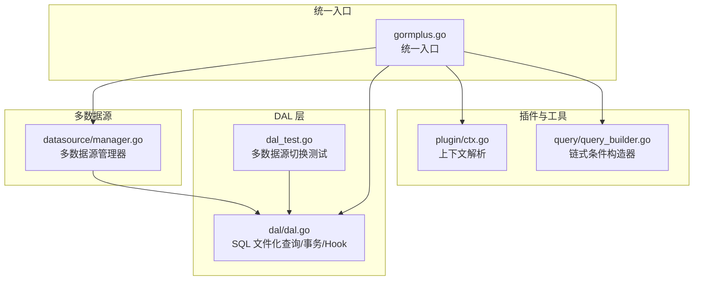
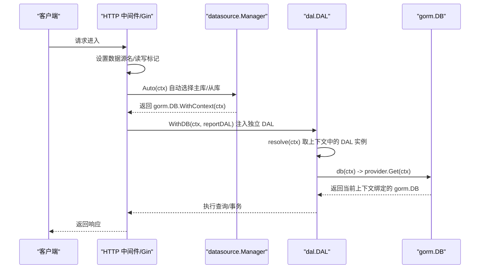
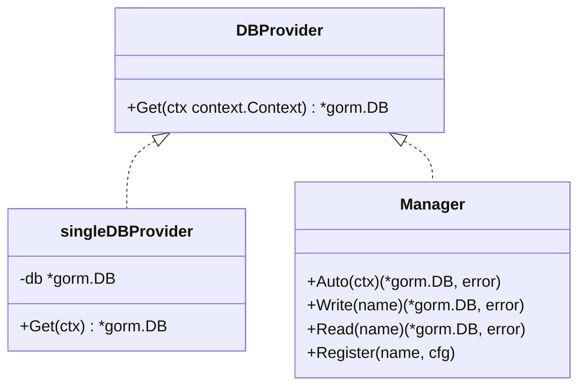
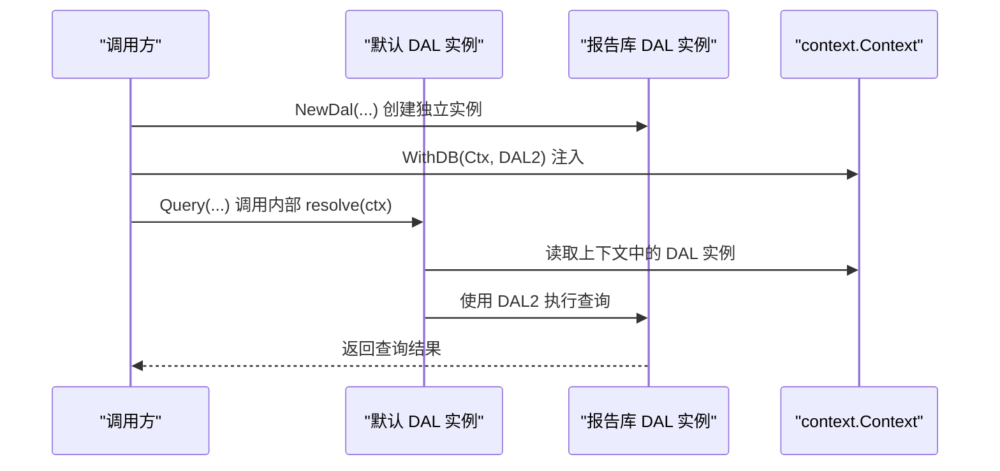
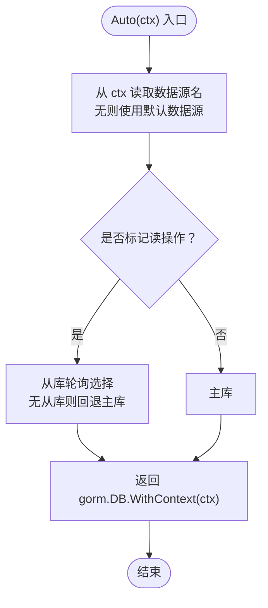
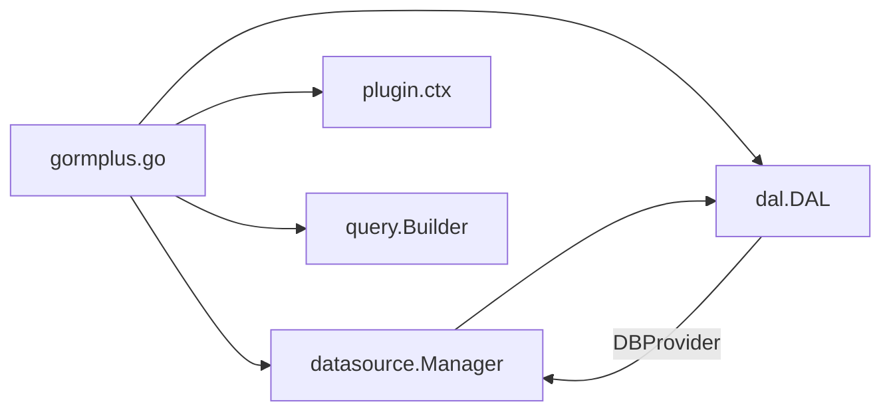

# 多数据源支持

<cite>
**本文档引用的文件**
- [dal.go](file://dal/dal.go)
- [dal_test.go](file://dal/dal_test.go)
- [manager.go](file://datasource/manager.go)
- [gormplus.go](file://gormplus.go)
- [ctx.go](file://plugin/ctx.go)
- [query_builder.go](file://query/query_builder.go)
</cite>

## 目录
1. [简介](#简介)
2. [项目结构](#项目结构)
3. [核心组件](#核心组件)
4. [架构总览](#架构总览)
5. [详细组件分析](#详细组件分析)
6. [依赖分析](#依赖分析)
7. [性能考虑](#性能考虑)
8. [故障转移与监控](#故障转移与监控)
9. [配置与最佳实践](#配置与最佳实践)
10. [常见实现模式与注意事项](#常见实现模式与注意事项)
11. [结论](#结论)

## 简介
本文件面向 DAL 多数据源支持的技术文档，系统阐述多数据源架构的设计原理、实现机制与使用方法，重点包括：
- DBProvider 接口的设计思路与扩展能力
- 如何实现读写分离、主从切换与动态数据源选择
- WithDB 函数的工作原理与使用场景
- 多数据源的配置示例、上下文注入与切换最佳实践
- 性能优化、故障转移与监控策略
- 常见多数据源架构模式与注意事项

## 项目结构
本仓库围绕“统一入口 + 多模块”的组织方式展开：
- gormplus.go：统一入口，聚合各子模块（含多数据源管理 DS）
- datasource/manager.go：多数据源管理器，负责注册、读写分离、从库轮询、健康检查与优雅关闭
- dal/dal.go：DAL 层，提供 SQL 文件化查询、泛型支持、Hook、缓存与事务等能力，并支持通过 DBProvider 与 WithDB 实现多数据源
- plugin/ctx.go：上下文解析工具，解决 Gin 等框架中 *gin.Context 与 Request.Context 的差异
- query/query_builder.go：原生 gorm 链式条件构造器，支持多数据源、多租户与测试替换

**图表来源**
- [gormplus.go:127-214](file://gormplus.go#L127-L214)
- [manager.go:26-137](file://datasource/manager.go#L26-L137)
- [dal.go:334-461](file://dal/dal.go#L334-L461)
- [dal_test.go:226-262](file://dal/dal_test.go#L226-L262)
- [ctx.go:7-43](file://plugin/ctx.go#L7-L43)
- [query_builder.go:46-64](file://query/query_builder.go#L46-L64)

**章节来源**
- [gormplus.go:127-214](file://gormplus.go#L127-L214)
- [manager.go:26-137](file://datasource/manager.go#L26-L137)
- [dal.go:334-461](file://dal/dal.go#L334-L461)
- [dal_test.go:226-262](file://dal/dal_test.go#L226-L262)
- [ctx.go:7-43](file://plugin/ctx.go#L7-L43)
- [query_builder.go:46-64](file://query/query_builder.go#L46-L64)

## 核心组件
- DBProvider 接口：抽象数据库连接提供器，支持单库、多库、读写分离、多租户、分库分表等场景
- DAL：持有 DBProvider 与 SQLLoader，提供 Query/Exec/Count/Page 等统一查询入口，并支持 Hook、缓存与事务
- datasource.Manager：注册命名数据源组（一主多从）、自动读写分离、从库轮询、健康检查与优雅关闭
- WithDB：将指定 DAL 实例注入 context，实现多数据源自动切换
- 上下文工具：解决 Gin 等框架中 *gin.Context 与 Request.Context 的差异，确保插件读取到中间件写入的值

**章节来源**
- [dal.go:89-108](file://dal/dal.go#L89-L108)
- [dal.go:296-301](file://dal/dal.go#L296-L301)
- [dal.go:432-448](file://dal/dal.go#L432-L448)
- [manager.go:246-323](file://datasource/manager.go#L246-L323)
- [ctx.go:7-43](file://plugin/ctx.go#L7-L43)

## 架构总览
多数据源支持通过“Provider + Context 注入”的方式实现：
- DAL 通过 DBProvider.Get(ctx) 获取当前上下文对应的 gorm.DB
- datasource.Manager 实现 DBProvider，根据 context 中的数据源名与读写标记自动选择主库或从库
- WithDB 将独立的 DAL 实例注入 context，实现“按请求/按业务”维度的动态数据源切换
- gormplus 统一入口将 DS 与 DAL 深度集成，提供注册、中间件注入、健康检查与优雅关闭

**图表来源**
- [manager.go:288-323](file://datasource/manager.go#L288-L323)
- [dal.go:432-461](file://dal/dal.go#L432-L461)
- [dal.go:521-523](file://dal/dal.go#L521-L523)
- [gormplus.go:155-214](file://gormplus.go#L155-L214)

**章节来源**
- [manager.go:288-323](file://datasource/manager.go#L288-L323)
- [dal.go:432-461](file://dal/dal.go#L432-L461)
- [dal.go:521-523](file://dal/dal.go#L521-L523)
- [gormplus.go:155-214](file://gormplus.go#L155-L214)

## 详细组件分析

### DBProvider 接口设计
- 设计目标：抽象数据库连接提供器，支持单库、多库、读写分离、多租户、分库分表等场景
- 核心方法：Get(ctx) 返回当前上下文绑定的 gorm.DB
- 内置实现：singleDBProvider（单库），datasource.Manager（多数据源/读写分离）

**图表来源**
- [dal.go:89-108](file://dal/dal.go#L89-L108)
- [manager.go:246-323](file://datasource/manager.go#L246-L323)

**章节来源**
- [dal.go:89-108](file://dal/dal.go#L89-L108)
- [manager.go:246-323](file://datasource/manager.go#L246-L323)

### WithDB 函数与动态数据源切换
- WithDB 将指定 DAL 实例注入 context，resolve(ctx) 优先从 context 取实例，否则使用默认全局实例
- 通过 WithDB 注入后，调用方无需修改任何查询代码，即可自动使用新的数据源实例
- dal_test.go 中提供了 WithDB 切换实例并验证查询结果的测试用例

**图表来源**
- [dal.go:432-461](file://dal/dal.go#L432-L461)
- [dal_test.go:226-262](file://dal/dal_test.go#L226-L262)

**章节来源**
- [dal.go:432-461](file://dal/dal.go#L432-L461)
- [dal_test.go:226-262](file://dal/dal_test.go#L226-L262)

### 读写分离与主从切换
- datasource.Manager 根据 context 中的数据源名与读写标记自动选择主库或从库
- 读标记 → 从库（轮询，无从库时 fallback 主库）
- 写标记 → 主库
- 支持运行时热注册、健康检查与优雅关闭

**图表来源**
- [manager.go:288-323](file://datasource/manager.go#L288-L323)

**章节来源**
- [manager.go:288-323](file://datasource/manager.go#L288-L323)

### 上下文解析与中间件集成
- plugin/ctx.go 提供 ctx 解析器，解决 Gin 项目直接传 *gin.Context 时插件无法读取 Request.Context 的问题
- gormplus.RegisterCtxResolver 可注册自定义解析器，统一框架差异
- 中间件可结合 datasource.WithName、datasource.WithRead/WithWrite 实现自动读写分离

**章节来源**
- [ctx.go:7-43](file://plugin/ctx.go#L7-L43)
- [gormplus.go:105-125](file://gormplus.go#L105-L125)

### 与链式查询的协作
- query.NewQuery 支持传入任意 gorm.DB，天然适配多数据源、多租户与测试替换
- 通过 db.WithContext(ctx) 传递上下文，确保链式查询继承读写标记与数据源信息

**章节来源**
- [query_builder.go:46-64](file://query/query_builder.go#L46-L64)

## 依赖分析
- gormplus 统一入口聚合了多数据源管理 DS、DAL、插件与工具模块
- datasource.Manager 与 DAL 解耦：DAL 仅依赖 DBProvider 接口，具体实现由 Manager 提供
- 上下文工具与插件模块为多数据源与多租户等特性提供基础支撑

**图表来源**
- [gormplus.go:86-101](file://gormplus.go#L86-L101)
- [manager.go:246-323](file://datasource/manager.go#L246-L323)
- [dal.go:296-301](file://dal/dal.go#L296-L301)

**章节来源**
- [gormplus.go:86-101](file://gormplus.go#L86-L101)
- [manager.go:246-323](file://datasource/manager.go#L246-L323)
- [dal.go:296-301](file://dal/dal.go#L296-L301)

## 性能考虑
- 从库轮询：datasource.Manager 采用原子计数器实现从库轮询，避免锁竞争，适合高并发读场景
- 连接池：支持独立连接池配置，提供生产推荐默认值（MaxOpen、MaxIdle、MaxLifetime、MaxIdleTime）
- SQL 缓存：EmbedLoader 使用 sync.Map + singleflight 防击穿，减少重复解析与 I/O
- Hook 与 Debug：可选的 Hook 与 Debug 日志，建议仅在开发/测试环境启用，避免生产性能损耗

**章节来源**
- [manager.go:236-242](file://datasource/manager.go#L236-L242)
- [manager.go:163-169](file://datasource/manager.go#L163-L169)
- [dal.go:150-174](file://dal/dal.go#L150-L174)
- [dal.go:245-281](file://dal/dal.go#L245-L281)

## 故障转移与监控
- 健康检查：datasource.Manager.Ping 返回每个节点的连通性状态，可用于 /health 接口
- 优雅关闭：datasource.Manager.Close 关闭所有数据源连接，避免资源泄漏
- 故障转移：从库不可用时自动回退主库；建议结合外部监控与告警，及时发现并处理节点异常

**章节来源**
- [manager.go:394-430](file://datasource/manager.go#L394-L430)
- [manager.go:432-442](file://datasource/manager.go#L432-L442)

## 配置与最佳实践
- 初始化顺序（gormplus 统一入口）：
  - 注册上下文解析器（Gin 项目必须）
  - 注册多数据源（支持任意 gorm 驱动）
  - 打开 DB（多数据源场景也可从 DS.Write/Read 获取）
  - 注册多租户/数据权限/自动填充/慢查询等插件
  - 注册 SF 缓存（可选）
  - 优雅退出（defer DS.Close）

- 中间件注入（读写分离）：
  - 固定数据源：datasource.WithName(ctx, name)
  - 读写分离：GET 走从库，其他走主库；通过 datasource.WithRead/WithWrite 标记

- WithDB 使用场景：
  - 报表库、审计库、归档库等独立数据源
  - 多租户隔离下的租户库
  - 动态切换不同业务库（如 analytics/archive 等）

- SQL 文件化与缓存：
  - 使用 //go:embed 将 SQL 打包进二进制，部署简单
  - 预热 SQL 缓存（Preload），避免首请求延迟
  - 定时清理 SQL 缓存（WithCacheCleanup），防止内存增长

**章节来源**
- [gormplus.go:22-84](file://gormplus.go#L22-L84)
- [manager.go:82-137](file://datasource/manager.go#L82-L137)
- [dal.go:334-461](file://dal/dal.go#L334-L461)
- [dal.go:463-492](file://dal/dal.go#L463-L492)

## 常见实现模式与注意事项
- 模式一：固定数据源
  - 在中间件中设置 datasource.WithName(ctx, "analytics")
  - Repository 层直接使用 DS.Auto(ctx) 获取 DB
- 模式二：读写分离
  - 中间件根据 HTTP 方法设置 datasource.WithRead/WithWrite
  - DS.Auto(ctx) 自动选择从库或主库
- 模式三：多租户 + 多数据源
  - 通过 datasource.WithName(ctx, tenantID) 选择租户库
  - 结合 gormplus.RegisterTenant 注册多租户插件
- 模式四：动态数据源切换
  - 使用 WithDB(ctx, reportDAL) 注入独立 DAL 实例
  - 适用于报表/审计/归档等独立库场景

注意事项：
- 确保数据源注册完成后再使用 DS.Auto，否则会报“未找到数据源名且未设置默认数据源”
- 从库不可用时会自动回退主库，但建议监控与告警，避免长时间从库异常
- Gin 项目必须注册上下文解析器，否则插件无法读取中间件写入的值
- 生产环境建议开启连接池独立配置与 SQL 缓存清理

**章节来源**
- [manager.go:288-323](file://datasource/manager.go#L288-L323)
- [ctx.go:16-35](file://plugin/ctx.go#L16-L35)
- [gormplus.go:52-84](file://gormplus.go#L52-L84)

## 结论
本多数据源方案通过 DBProvider 接口与 WithDB 动态注入实现了“调用方无感知”的多数据源支持，结合 datasource.Manager 的读写分离与从库轮询，满足高并发读场景；配合 gormplus 统一入口与插件生态，可快速落地多租户、数据权限、慢查询监控等企业级需求。通过合理的配置与监控策略，可在保证性能的同时提升系统的稳定性与可维护性。