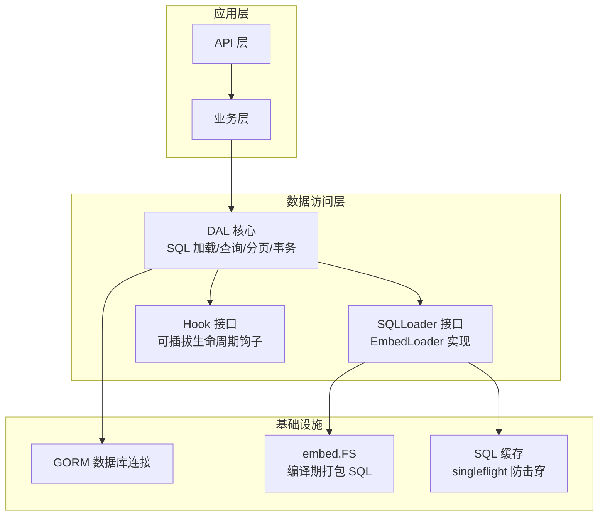
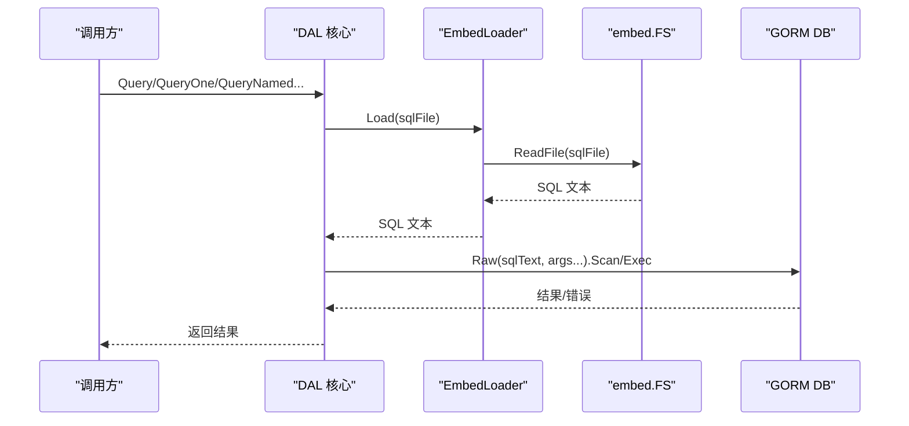
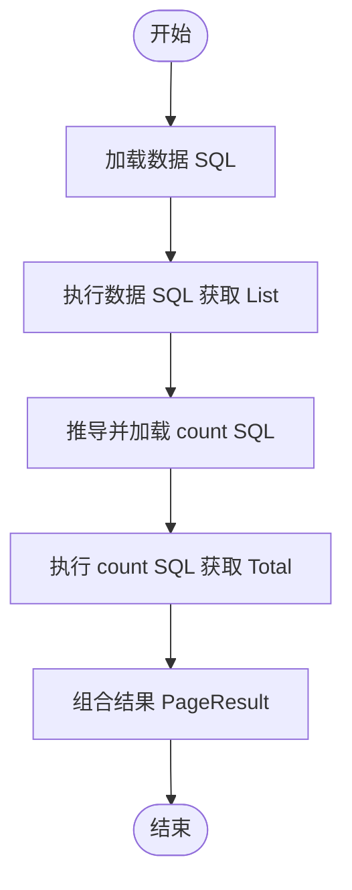
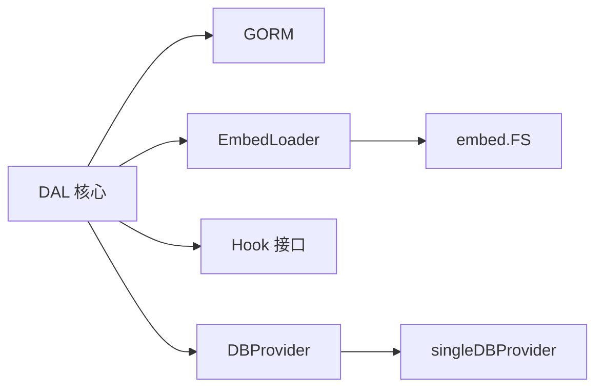

# 数据访问层 (DAL)

<cite>
**本文引用的文件**
- [dal.go](file://dal/dal.go)
- [query.go](file://dal/query.go)
- [loader.go](file://dal/loader.go)
- [instance.go](file://dal/instance.go)
- [options.go](file://dal/options.go)
- [provider.go](file://dal/provider.go)
- [hook.go](file://dal/hook.go)
- [debug.go](file://dal/debug.go)
- [must.go](file://dal/must.go)
- [README.md](file://README.md)
- [version.go](file://version.go)
- [generator.go](file://generator/generator.go)
- [config.go](file://generator/config.go)
- [tenant.go](file://plugin/tenant.go)
- [dataPermission.go](file://plugin/dataPermission.go)
- [autoOperator.go](file://plugin/autoOperator.go)
</cite>

## 目录
1. [简介](#简介)
2. [项目结构](#项目结构)
3. [核心组件](#核心组件)
4. [架构总览](#架构总览)
5. [详细组件分析](#详细组件分析)
6. [依赖分析](#依赖分析)
7. [性能考虑](#性能考虑)
8. [故障排查指南](#故障排查指南)
9. [结论](#结论)
10. [附录](#附录)

## 简介
本项目提供基于 GORM 的轻量级数据访问层（DAL），采用"SQL 文件化"设计，将 SQL 语句与业务逻辑解耦，通过 go:embed 将 SQL 文件打包进二进制，具备以下特性：
- SQL 文件化管理，业务逻辑与 SQL 分离
- 泛型查询，无需手动类型断言
- 支持位置参数（?）和命名参数（@name）
- 事务支持，含 Debug 日志和 Hook
- 分页查询，count SQL 自动推导
- SQL 缓存 + singleflight 防击穿
- 可插拔 Hook（监控、链路追踪等）
- 定时自动清理缓存，防止内存无限增长
- 多数据源支持，通过 context 切换，调用方无感知

## 项目结构
- dal：核心 DAL 实现，包含 SQL 加载、查询、分页、事务等能力
- plugin：多租户、数据权限、自动填充等插件
- generator：代码生成器（Model/Repository/API/VO/DTO）
- query：原生 gorm 链式条件构造器
- sf：SingleFlight + 可插拔缓存
- datasource：多数据源管理
- gormplus.go：统一入口，聚合各模块能力

**图表来源**
- [dal.go:114-182](file://dal/dal.go#L114-L182)
- [dal.go:284-301](file://dal/dal.go#L284-L301)
- [dal.go:185-220](file://dal/dal.go#L185-L220)

**章节来源**
- [README.md:17-41](file://README.md#L17-L41)
- [gormplus.go:1-20](file://gormplus.go#L1-L20)

## 核心组件
- DBProvider：数据库提供器接口，支持单库、多库、读写分离、多租户、分库分表等
- SQLLoader：SQL 文件加载器接口，内置 EmbedLoader 基于 fs.FS（embed.FS）
- Hook：生命周期钩子，可用于慢 SQL 监控、指标采集、链路追踪等
- DAL：核心实例，持有数据库连接和 SQL 加载器，提供查询、分页、事务等能力
- 选项配置：WithDebug、WithHook、WithCacheCleanup 等

**章节来源**
- [dal.go:89-121](file://dal/dal.go#L89-L121)
- [dal.go:114-182](file://dal/dal.go#L114-L182)
- [dal.go:185-281](file://dal/dal.go#L185-L281)
- [dal.go:284-301](file://dal/dal.go#L284-L301)

## 架构总览
DAL 通过 EmbedLoader 将 SQL 文件以二进制形式打包，运行时从 embed.FS 读取 SQL 文本，结合 GORM Raw 接口执行查询。支持：
- 位置参数（?）和命名参数（@name）
- 分页查询（自动推导 count SQL）
- 事务支持（WithTx/Tx* 系列）
- Hook 生命周期（Before/After）
- SQL 缓存 + singleflight 防击穿
- 多数据源（WithDB 注入）

**图表来源**
- [dal.go:594-628](file://dal/dal.go#L594-L628)
- [dal.go:150-174](file://dal/dal.go#L150-L174)

**章节来源**
- [dal.go:572-828](file://dal/dal.go#L572-L828)
- [dal.go:832-975](file://dal/dal.go#L832-L975)
- [dal.go:977-1121](file://dal/dal.go#L977-L1121)
- [dal.go:1124-1444](file://dal/dal.go#L1124-L1444)

## 详细组件分析

### SQL 文件化查询设计理念与优势
- 设计理念：将 SQL 语句从 Go 代码中抽离，独立管理，便于 DBA 审核、版本控制、复杂 SQL 的维护
- 优势：
  - 业务与 SQL 分离，职责清晰
  - 复杂 SQL 更易维护和优化
  - 通过 go:embed 打包进二进制，部署简单
  - 支持命名参数，减少参数顺序错误风险
  - 与传统 ORM 的区别：
    - ORM：链式条件构造器，适合简单查询；复杂 SQL 难以表达
    - SQL 文件化：SQL 语句独立管理，适合复杂查询、联表、子查询、存储过程等

**章节来源**
- [README.md:696-716](file://README.md#L696-L716)
- [dal.go:1-14](file://dal/dal.go#L1-L14)

### 嵌入式 SQL 管理机制（go:embed）
- 通过 //go:embed 将 rawsql 目录下的 SQL 文件打包进二进制
- 使用 fs.Sub 去除顶层目录前缀，调用时路径更简洁
- EmbedLoader 基于 fs.FS 提供并发安全的 SQL 加载，带缓存和 singleflight 防击穿

**章节来源**
- [dal.go:123-182](file://dal/dal.go#L123-L182)
- [dal.go:150-174](file://dal/dal.go#L150-L174)

### 初始化与配置
- 初始化步骤：
  - 在调用方包内声明 //go:embed rawsql
  - 通过 fs.Sub 去除顶层目录前缀
  - 调用 NewDal 或 NewWithProvider 创建实例
  - 可选：WithDebug 开启调试日志；WithCacheCleanup 设置缓存清理周期
- 单数据源使用：直接调用包级函数
- 多数据源使用：通过 WithDB 注入 context，后续调用写法完全不变

**章节来源**
- [dal.go:314-351](file://dal/dal.go#L314-L351)
- [dal.go:353-391](file://dal/dal.go#L353-L391)
- [dal.go:432-448](file://dal/dal.go#L432-L448)
- [README.md:718-748](file://README.md#L718-L748)

### 查询方法详解
- Query：多条记录查询（位置参数 ?）
- QueryOne：单条记录查询（位置参数 ?）
- QueryNamed：多条记录查询（命名参数 @name）
- QueryOneNamed：单条记录查询（命名参数 @name）
- Exec/ExecAffected：执行 INSERT/UPDATE/DELETE
- Count：查询数量（支持位置参数和命名参数）
- QueryPage/QueryPageNamed：分页查询（count SQL 自动推导）
- WithTx/Tx*：事务支持（TxQuery/TxQueryOne/TxQueryNamed/TxCount/TxExec）

**章节来源**
- [dal.go:572-828](file://dal/dal.go#L572-L828)
- [dal.go:832-912](file://dal/dal.go#L832-L912)
- [dal.go:918-975](file://dal/dal.go#L918-L975)
- [dal.go:977-1121](file://dal/dal.go#L977-L1121)
- [dal.go:1124-1444](file://dal/dal.go#L1124-L1444)

### 分页查询实现机制与性能优化
- 实现机制：
  - 数据 SQL 文件名前加 "count_" 前缀推导 count SQL
  - QueryPage：先执行数据 SQL 获取 List，再执行 count SQL 获取 Total
  - QueryPageNamed：同理，支持命名参数
- 性能优化策略：
  - SQL 缓存：EmbedLoader 内置缓存，避免重复读取
  - singleflight：同一 SQL 并发请求合并，防击穿
  - 定时清理：WithCacheCleanup 设置周期清理，防止内存无限增长
  - 建议：count SQL 与数据 SQL 过滤条件保持一致，避免重复计算

**图表来源**
- [dal.go:1022-1051](file://dal/dal.go#L1022-L1051)
- [dal.go:1091-1115](file://dal/dal.go#L1091-L1115)

**章节来源**
- [dal.go:977-1121](file://dal/dal.go#L977-L1121)

### SQL 文件组织结构与版本管理最佳实践
- 推荐目录结构：
  - rawsql/account/list.sql、find_by_id.sql、page.sql、count_page.sql
  - rawsql/order/page.sql、count_page.sql
- 命名规范：
  - 数据 SQL：page.sql
  - count SQL：count_page.sql（与数据 SQL 同目录，文件名前加 "count_" 前缀）
  - 命名参数：@name，空值或特殊值表示不过滤
- 版本管理：
  - SQL 文件纳入版本控制，便于审计和回滚
  - 通过 Git 分支管理不同版本的 SQL
  - DBA 审核流程：变更前评审，变更后回归测试

**章节来源**
- [README.md:701-716](file://README.md#L701-L716)
- [dal.go:981-985](file://dal/dal.go#L981-L985)
- [dal.go:1053-1091](file://dal/dal.go#L1053-L1091)

### 错误处理与调试技巧
- 错误处理：
  - 所有查询方法返回 error，调用方需判断
  - ExecAffected 返回影响行数，RowsAffected==0 时需特殊处理
  - QueryOne/QueryOneNamed 返回 nil 表示记录不存在（debug 模式打印 WARN）
- 调试技巧：
  - WithDebug 开启调试日志，打印文件路径、耗时、SQL 文本、参数、错误
  - debugWarnEmpty：返回零行时打印警告，帮助定位路径或条件错误
  - Hook：可注册慢 SQL 监控、指标采集、链路追踪等

**章节来源**
- [dal.go:226-281](file://dal/dal.go#L226-L281)
- [dal.go:529-554](file://dal/dal.go#L529-L554)
- [dal.go:185-220](file://dal/dal.go#L185-L220)

## 依赖分析
- DAL 依赖 GORM 进行数据库操作
- EmbedLoader 依赖 go:embed/fs.FS 进行 SQL 文件读取
- Hook 接口可插拔，支持多种监控与追踪
- 多数据源通过 WithDB 注入 context，实现无感切换

**图表来源**
- [dal.go:89-121](file://dal/dal.go#L89-L121)
- [dal.go:114-182](file://dal/dal.go#L114-L182)
- [dal.go:284-301](file://dal/dal.go#L284-L301)

**章节来源**
- [dal.go:89-121](file://dal/dal.go#L89-L121)
- [dal.go:114-182](file://dal/dal.go#L114-L182)
- [dal.go:284-301](file://dal/dal.go#L284-L301)

## 性能考虑
- SQL 缓存：EmbedLoader 内置缓存，避免重复读取
- singleflight：同一 SQL 并发请求合并，降低数据库压力
- 定时清理：WithCacheCleanup 设置周期清理，防止内存无限增长
- 分页优化：count SQL 与数据 SQL 过滤条件保持一致，避免重复计算
- 建议：生产环境开启 WithDebug 仅限开发/测试环境，避免过多日志开销

## 故障排查指南
- 未初始化：调用 resolve(ctx) 时若 defaultDAL 为空会 panic，需先调用 NewDal
- SQL 文件不存在：Loader 报错，检查文件路径与 fs.Sub 去前缀后的相对路径
- 返回零行：debug 模式打印 WARN，检查 SQL 路径和查询条件
- 事务异常：WithTx 返回 error 时自动回滚，检查回调内的错误处理
- 多数据源：确保 WithDB 注入正确，后续调用写法不变

**章节来源**
- [dal.go:450-461](file://dal/dal.go#L450-L461)
- [dal.go:480-492](file://dal/dal.go#L480-L492)
- [dal.go:1144-1149](file://dal/dal.go#L1144-L1149)
- [dal_test.go:310-321](file://dal/dal_test.go#L310-L321)

## 结论
本 DAL 通过 SQL 文件化设计，将 SQL 与业务解耦，结合 go:embed 打包进二进制，具备良好的可维护性与部署便利性。配合事务、Hook、缓存、分页等能力，满足复杂查询与高性能场景需求。建议在复杂 SQL、多数据源、多租户等场景优先考虑使用。

## 附录
- 版本信息：v1.0.13
- 代码生成器：支持 Model/Repository/API/VO/DTO 一键生成，配置 YAML 文件

**章节来源**
- [version.go:1-4](file://version.go#L1-L4)
- [generator/config.go:10-31](file://generator/config.go#L10-L31)
- [generator.go:1-20](file://generator/generator.go#L1-L20)