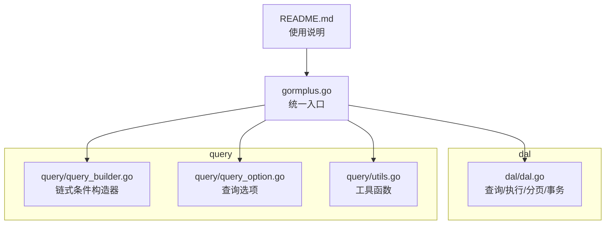
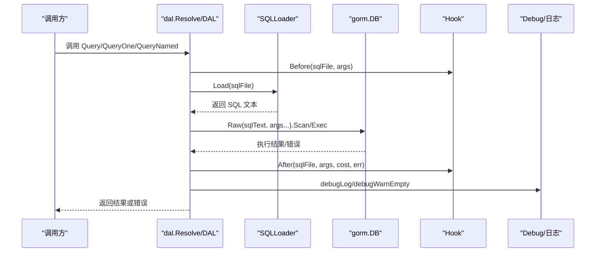
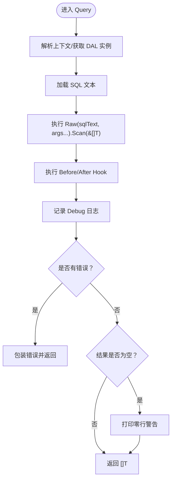
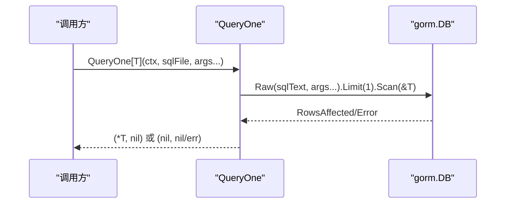
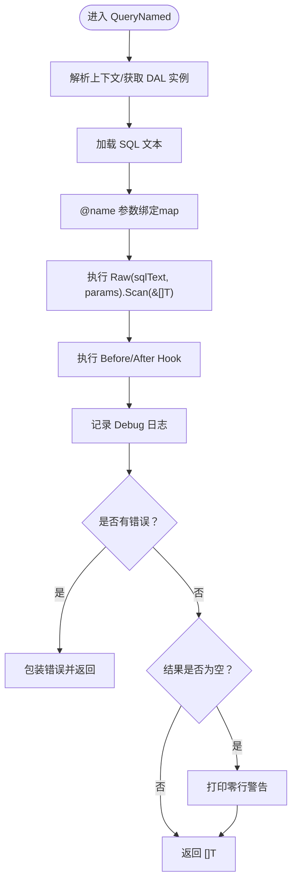
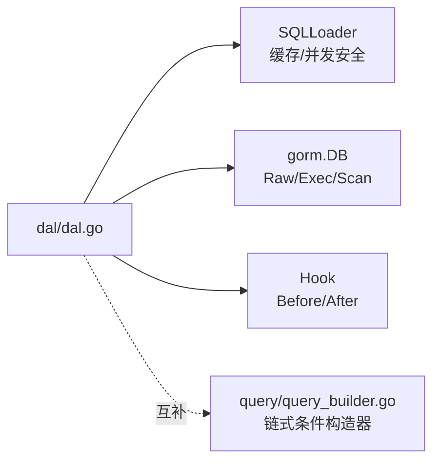

# 查询方法详解

<cite>
**本文档引用的文件**
- [dal.go](file://dal/dal.go)
- [dal_test.go](file://dal/dal_test.go)
- [query_builder.go](file://query/query_builder.go)
- [query_option.go](file://query/query_option.go)
- [utils.go](file://query/utils.go)
- [README.md](file://README.md)
- [gormplus.go](file://gormplus.go)
</cite>

## 目录
1. [简介](#简介)
2. [项目结构](#项目结构)
3. [核心组件](#核心组件)
4. [架构总览](#架构总览)
5. [详细组件分析](#详细组件分析)
6. [依赖分析](#依赖分析)
7. [性能考虑](#性能考虑)
8. [故障排查指南](#故障排查指南)
9. [结论](#结论)
10. [附录](#附录)

## 简介
本文件聚焦于 DAL 查询方法，系统讲解三种主要查询能力：
- Query（位置参数）
- QueryOne（单条记录）
- QueryNamed（命名参数）

内容涵盖使用场景、参数传递方式、返回值处理、泛型实现原理、类型安全保证、内部执行流程（SQL 加载、参数绑定、结果扫描、错误处理）、性能优化建议以及常见问题解决方案。文档同时给出面向不同技术背景读者的渐进式说明，并辅以可视化图示帮助理解。

## 项目结构
本仓库采用模块化组织，与查询方法直接相关的关键模块如下：
- dal：SQL 文件化查询与事务、分页、执行等能力
- query：原生 gorm 链式条件构造器（与 DAL 查询方法互补）
- gormplus：统一入口，导出 DAL 查询方法与其它能力

图表来源
- [dal.go](file://dal/dal.go)
- [query_builder.go](file://query/query_builder.go)
- [query_option.go](file://query/query_option.go)
- [utils.go](file://query/utils.go)
- [gormplus.go](file://gormplus.go)
- [README.md](file://README.md)

章节来源
- [README.md](file://README.md)
- [gormplus.go](file://gormplus.go)

## 核心组件
本节概述与查询方法相关的组件职责与交互关系。

- SQL 加载器（SQLLoader）
  - 负责从嵌入式文件系统加载 SQL 文本，提供缓存与并发安全。
  - 支持单文件缓存与 singleflight 防击穿，减少重复 IO。
- 数据库提供器（DBProvider）
  - 抽象数据库连接来源，支持单库或多库、读写分离、上下文切换等。
- DAL 实例（DAL）
  - 持有 DBProvider 与 SQLLoader，提供包级查询函数（Query、QueryOne、QueryNamed 等）。
  - 支持 Hook 生命周期钩子、Debug 日志、后台缓存清理等。
- 查询函数族
  - Query：位置参数（?）查询多条记录
  - QueryOne：位置参数（?）查询单条记录
  - QueryNamed：命名参数（@name）查询多条记录
  - QueryOneNamed：命名参数（@name）查询单条记录
- 事务与执行
  - WithTx、TxQuery、TxQueryOne、TxQueryNamed、TxExec、TxCount 等在事务上下文中执行查询与执行。

章节来源
- [dal.go](file://dal/dal.go)

## 架构总览
下图展示了查询方法的总体执行路径：从调用方发起查询，经由 DAL 解析上下文、加载 SQL、绑定参数、执行并扫描结果，最后经过 Hook 与 Debug 输出。

图表来源
- [dal.go](file://dal/dal.go)

## 详细组件分析

### Query（位置参数）
- 使用场景
  - 适合参数较少且顺序明确的查询，SQL 中使用 ? 占位符。
- 参数传递
  - 通过可变参数按顺序传入，与 SQL 中 ? 一一对应。
- 返回值
  - 返回切片 []T；若无结果，返回空切片而非 nil，便于统一处理。
- 执行流程
  - 解析上下文获取 DAL 实例
  - 加载 SQL 文本
  - 使用 gorm.DB.Raw(...) + Scan(&[]T) 执行并扫描
  - 记录 Hook 与 Debug 日志
  - 错误包装并返回
- 类型安全
  - 通过泛型 T 约束返回类型，避免运行时类型断言。
- 最佳实践
  - SQL 中务必包含 LIMIT/OFFSET（如分页）以避免全表扫描。
  - 对空结果进行显式判断，结合 Debug 模式下的 WARN 提示定位路径或条件问题。

图表来源
- [dal.go](file://dal/dal.go)

章节来源
- [dal.go](file://dal/dal.go)
- [dal_test.go](file://dal/dal_test.go)

### QueryOne（单条记录）
- 使用场景
  - 查询唯一记录或限定 LIMIT 1 的查询。
- 参数传递
  - 位置参数（?），与 SQL 中 ? 一一对应。
- 返回值
  - 返回 *T；若未找到记录，返回 (nil, nil)，便于区分“不存在”与“错误”。
- 执行流程
  - 与 Query 类似，但在执行前增加 Limit(1)，确保只取一条。
  - 通过 RowsAffected 判断是否存在记录。
- 类型安全
  - 泛型约束返回指针类型，避免重复解引用。
- 最佳实践
  - SQL 中务必包含 LIMIT 1，避免误取多条。
  - 对返回值进行判空处理，结合 Debug 模式下的零行警告快速定位问题。

图表来源
- [dal.go](file://dal/dal.go)

章节来源
- [dal.go](file://dal/dal.go)
- [dal_test.go](file://dal/dal_test.go)

### QueryNamed（命名参数）
- 使用场景
  - 参数较多或顺序易混淆时，使用 @name 命名参数，提升可读性与可维护性。
- 参数传递
  - 通过 map[string]any 传参，键名与 SQL 中 @name 对应。
- 返回值
  - 返回切片 []T；空结果时返回空切片并打印零行警告。
- 执行流程
  - 与 Query 类似，但参数以 map 传入 gorm.Raw，由底层自动替换 @name。
- 类型安全
  - 泛型约束返回类型，避免运行时断言。
- 最佳实践
  - SQL 中的 @name 与 map 键名保持一致，避免大小写与空格差异。
  - 对空结果进行显式处理，结合 Debug 模式定位路径或条件问题。

图表来源
- [dal.go](file://dal/dal.go)

章节来源
- [dal.go](file://dal/dal.go)
- [dal_test.go](file://dal/dal_test.go)

### QueryOneNamed（单条记录，命名参数）
- 使用场景
  - 唯一记录查询，SQL 中使用 @name 命名参数。
- 参数传递
  - map[string]any，键名与 SQL 中 @name 对应。
- 返回值
  - 返回 *T；未找到返回 (nil, nil)。
- 执行流程
  - 与 QueryNamed 类似，但增加 Limit(1) 限制结果集为单条。
- 类型安全
  - 泛型约束返回指针类型。
- 最佳实践
  - SQL 中务必包含 LIMIT 1。
  - 对返回值判空，结合 Debug 模式定位问题。

章节来源
- [dal.go](file://dal/dal.go)
- [dal_test.go](file://dal/dal_test.go)

### 泛型查询的实现原理与类型安全
- 实现原理
  - 通过 Go 泛型函数（如 Query[T]、QueryOne[T] 等）在编译期约束返回类型，避免运行时类型断言。
  - 扫描阶段使用 gorm.DB.Raw(...).Scan(&result) 将 SQL 结果映射到切片或结构体。
- 类型安全保证
  - 编译期检查：调用方必须提供正确的泛型类型参数，否则编译失败。
  - 运行期检查：错误被包装并携带 SQL 文件路径，便于定位问题。
- 与原生 gorm 的关系
  - Query/QueryOne 等方法是对 gorm.DB.Raw + Scan 的封装，保持与原生 API 的一致性。

章节来源
- [dal.go](file://dal/dal.go)

### 内部执行流程详解
- SQL 加载
  - 通过 SQLLoader.Load 加载 SQL 文本，内部使用缓存与 singleflight 防击穿。
- 参数绑定
  - 位置参数：按顺序传入 ...any，与 SQL 中 ? 对应。
  - 命名参数：传入 map[string]any，由底层替换 @name。
- 结果扫描
  - Query/QueryNamed 使用 Scan(&[]T) 扫描多条记录。
  - QueryOne/QueryOneNamed 使用 Scan(&T) 并附加 Limit(1)。
- 错误处理
  - 所有错误通过 fmt.Errorf 包装，包含 SQL 文件路径，便于定位。
  - 零行结果时打印 [WARN]，帮助发现路径或条件错误。
- Hook 与 Debug
  - Before/After Hook 按注册顺序执行，可用于慢 SQL 监控、指标采集、链路追踪等。
  - Debug 模式下输出文件路径、耗时、SQL 文本、参数与错误。

章节来源
- [dal.go](file://dal/dal.go)

## 依赖分析
- DAL 与 SQLLoader
  - DAL 依赖 SQLLoader 提供 SQL 文本；Loader 内部缓存与 singleflight 降低重复加载成本。
- DAL 与 gorm.DB
  - 通过 DBProvider.Get(ctx) 获取 gorm.DB 实例，支持多数据源与上下文切换。
- DAL 与 Hook
  - 通过 runBeforeHooks/runAfterHooks 调用注册的 Hook，实现可观测性与治理能力。
- 与 query 模块的关系
  - query 提供原生 gorm 链式条件构造器，适合动态拼装条件的场景；DAL 更适合复杂 SQL 与 SQL 文件化管理。

图表来源
- [dal.go](file://dal/dal.go)
- [query_builder.go](file://query/query_builder.go)

章节来源
- [dal.go](file://dal/dal.go)
- [query_builder.go](file://query/query_builder.go)

## 性能考虑
- SQL 缓存与 singleflight
  - SQLLoader 内置缓存与 singleflight，避免重复加载与并发击穿，建议在生产环境开启缓存清理（WithCacheCleanup）。
- Debug 模式
  - Debug 模式会打印每次查询的耗时、SQL 文本、参数与错误，便于定位问题，但会带来额外日志开销，建议仅在开发/测试环境开启。
- 参数绑定
  - 命名参数（@name）在参数较多时可提升可读性，但底层仍需进行参数替换，建议保持键名简洁一致。
- 结果扫描
  - Query/QueryNamed 使用 Scan，适合映射到 VO；若需要联表或自定义字段映射，建议使用 ScanByPage 或原生 gorm 的 Scan。
- 分页查询
  - QueryPage/QueryPageNamed 自动推导 count SQL（data.sql → count_data.sql），减少重复 SQL 编写；注意过滤条件与分页参数的分离，避免 count SQL 误引用分页参数。

章节来源
- [dal.go](file://dal/dal.go)
- [README.md](file://README.md)

## 故障排查指南
- 未初始化
  - 若未调用 NewDal 初始化，默认全局实例为 nil，调用查询方法会 panic。请确保在应用启动时完成初始化。
- SQL 文件缺失
  - Loader.Load 返回错误，导致查询失败。请检查 SQL 文件路径与嵌入式资源是否正确。
- 零行结果
  - Debug 模式下会打印 [WARN]，提示返回零行。请检查 SQL 路径与查询条件是否正确。
- 参数不匹配
  - 位置参数与 SQL 中 ? 数量不一致，或命名参数键名与 SQL 中 @name 不一致，会导致执行失败。请核对参数与 SQL。
- 事务中查询
  - 在 WithTx 闭包中使用 TxQuery/TxQueryOne/TxQueryNamed/TxExec/TxCount 等方法，确保在事务上下文中执行。
- Hook 与 Debug
  - 如需慢 SQL 监控或链路追踪，可通过 WithHook 注册 Hook；Debug 模式下可查看每次查询的耗时与参数。

章节来源
- [dal.go](file://dal/dal.go)
- [dal_test.go](file://dal/dal_test.go)

## 结论
- Query/QueryOne/QueryNamed 三种查询方法分别针对不同场景：位置参数适合简单顺序参数、命名参数适合复杂可读性强的查询、单条记录查询适合唯一性约束的场景。
- 通过泛型与 gorm.Raw/Scan 的组合，实现了类型安全与高性能的结果映射。
- SQL 文件化管理与嵌入式资源打包，使得复杂 SQL 可维护、可审计、可版本化。
- 建议在生产环境合理使用缓存清理、Hook 与 Debug，结合分页与参数绑定最佳实践，获得稳定高效的查询体验。

## 附录
- 与原生 gorm 链式条件构造器的对比
  - query 模块提供链式条件构造器，适合动态拼装条件；DAL 更适合复杂 SQL 与 SQL 文件化管理。
- 常用工具函数
  - query/utils.go 提供 isZeroVal 等工具，用于条件构造器中的零值判断。

章节来源
- [query_builder.go](file://query/query_builder.go)
- [utils.go](file://query/utils.go)
- [README.md](file://README.md)