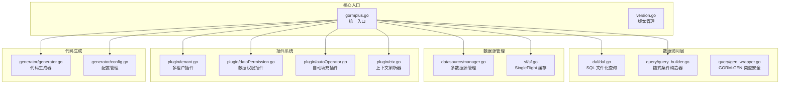
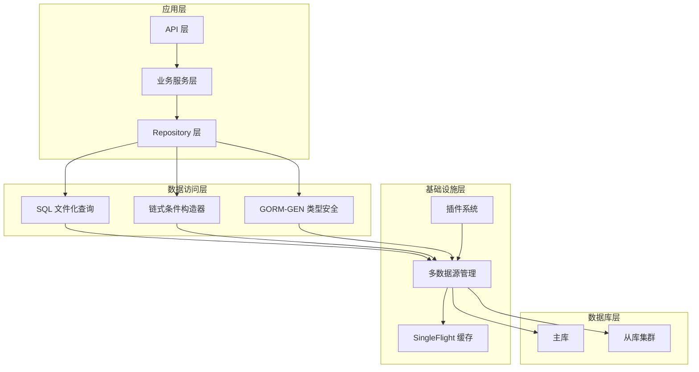
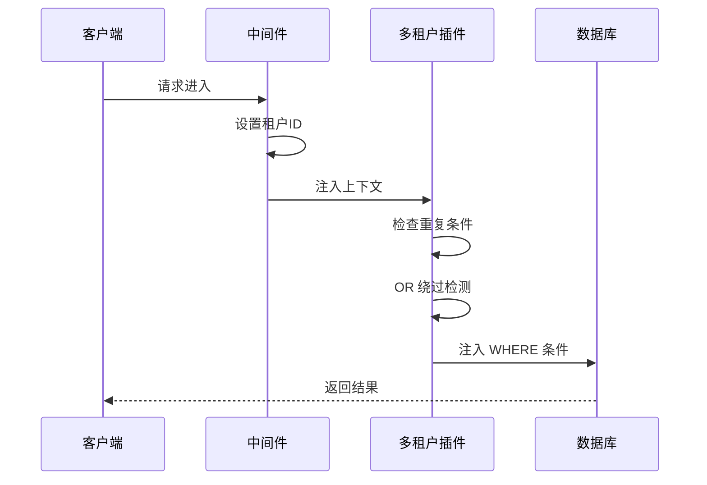
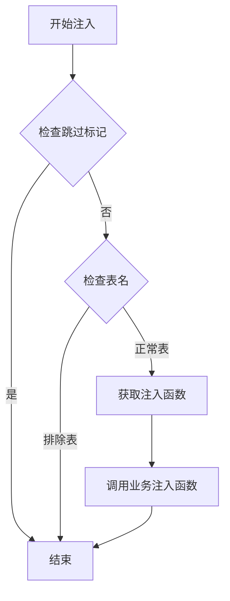
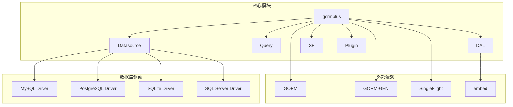
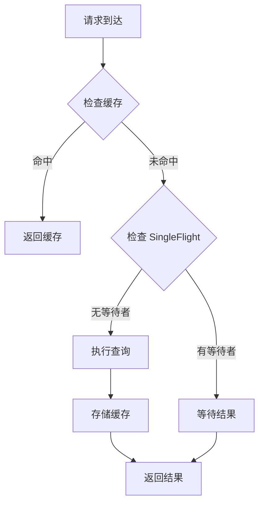
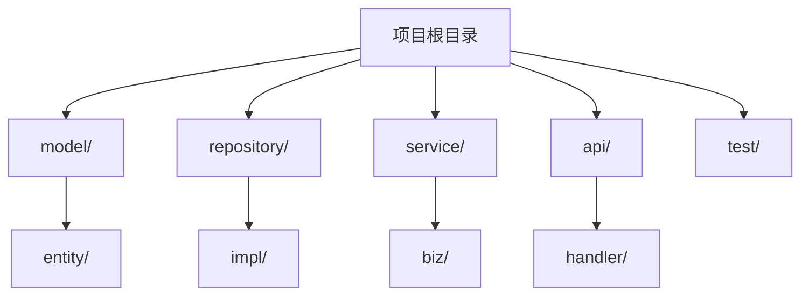
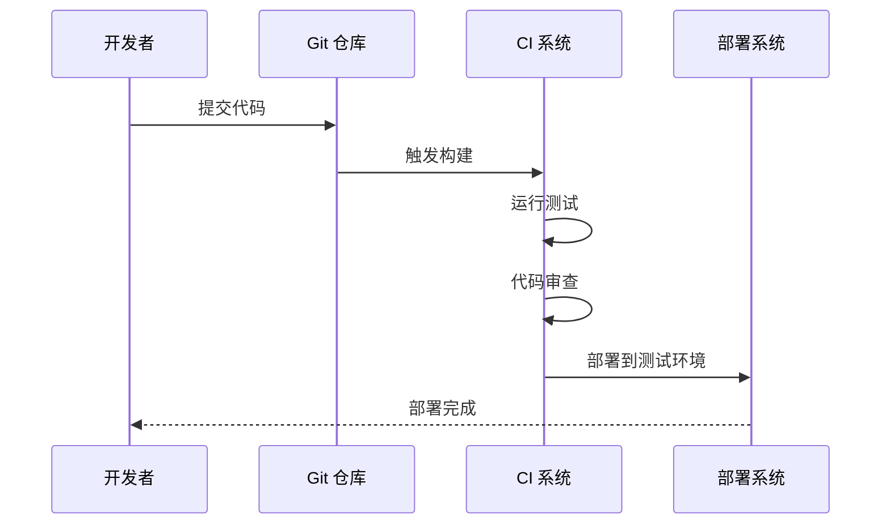
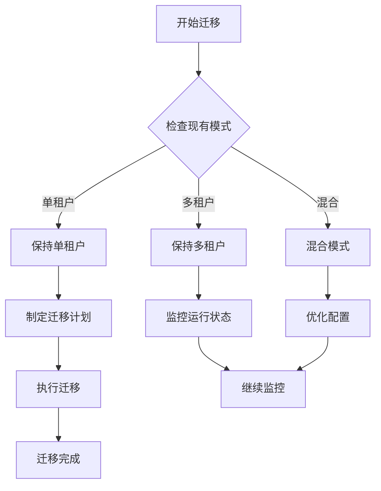

# GORM Plus 最佳实践指南

<cite>
**本文档引用的文件**
- [README.md](file://README.md)
- [gormplus.go](file://gormplus.go)
- [dal/dal.go](file://dal/dal.go)
- [generator/generator.go](file://generator/generator.go)
- [plugin/autoOperator.go](file://plugin/autoOperator.go)
- [plugin/dataPermission.go](file://plugin/dataPermission.go)
- [plugin/tenant.go](file://plugin/tenant.go)
- [plugin/ctx.go](file://plugin/ctx.go)
- [datasource/manager.go](file://datasource/manager.go)
- [sf/sf.go](file://sf/sf.go)
- [query/query_builder.go](file://query/query_builder.go)
- [query/slow_query.go](file://query/slow_query.go)
- [generator/config.go](file://generator/config.go)
- [version.go](file://version.go)
</cite>

## 目录
1. [简介](#简介)
2. [项目结构](#项目结构)
3. [核心组件](#核心组件)
4. [架构概览](#架构概览)
5. [详细组件分析](#详细组件分析)
6. [依赖关系分析](#依赖关系分析)
7. [性能优化最佳实践](#性能优化最佳实践)
8. [安全编码最佳实践](#安全编码最佳实践)
9. [代码质量保证](#代码质量保证)
10. [团队协作与代码审查](#团队协作与代码审查)
11. [业务场景架构选择](#业务场景架构选择)
12. [常见陷阱与避坑指南](#常见陷阱与避坑指南)
13. [结论](#结论)

## 简介

GORM Plus 是基于 GORM 和 GORM-GEN 的增强扩展包，提供了企业级数据库访问层解决方案。该项目的核心能力包括链式条件构造器、GORM-GEN 类型安全扩展、多租户自动注入、数据权限自动注入、自动填充插件、多数据源管理、SingleFlight 可插拔缓存、慢查询监控和代码生成器等功能。

该项目采用模块化设计，通过统一入口 gormplus 包提供所有功能，支持 Gin、Go-Zero、Fiber 等主流 Web 框架，并提供了完善的初始化顺序和配置建议。

## 项目结构

GORM Plus 采用清晰的模块化架构，每个功能模块都有独立的包和职责分工：



**图表来源**
- [gormplus.go:1-1305](file://gormplus.go#L1-L1305)
- [dal/dal.go:1-1506](file://dal/dal.go#L1-L1506)
- [datasource/manager.go:1-579](file://datasource/manager.go#L1-L579)

**章节来源**
- [README.md:17-40](file://README.md#L17-L40)
- [gormplus.go:86-101](file://gormplus.go#L86-L101)

## 核心组件

### 统一入口模块

GORM Plus 通过 gormplus.go 提供统一的入口点，所有功能通过单一导入即可使用：

- **模块总览**：包含 Query、DAL、GenWrap、DS、SF、Tenant、DataPermission、AutoFill、SlowQuery、Generator 等模块
- **初始化顺序**：提供了完整的初始化顺序建议，确保各模块正确配置
- **框架兼容**：支持 Gin、Go-Zero、Fiber 等主流 Web 框架

### 数据访问层模块

#### DAL 模块
- **SQL 文件化管理**：支持 SQL 文件与业务逻辑分离
- **泛型查询**：提供类型安全的查询接口
- **参数绑定**：支持位置参数和命名参数
- **事务支持**：内置事务管理和 Hook 机制
- **分页查询**：自动推导 count SQL
- **缓存机制**：集成 SingleFlight 防击穿

#### Query 模块
- **链式条件构造**：提供 Like、LLike、RLike 等模糊查询方法
- **范围查询**：BetweenIfNotZero 支持区间查询
- **条件分组**：WhereGroup 和 OrGroup 支持复杂条件组合
- **泛型分页**：FindByPage 和 ScanByPage 提供分页查询

**章节来源**
- [gormplus.go:22-86](file://gormplus.go#L22-L86)
- [dal/dal.go:1-1506](file://dal/dal.go#L1-L1506)
- [query/query_builder.go:1-307](file://query/query_builder.go#L1-L307)

## 架构概览

GORM Plus 采用了分层架构设计，通过插件系统实现横切关注点的解耦：



**图表来源**
- [datasource/manager.go:26-81](file://datasource/manager.go#L26-L81)
- [sf/sf.go:17-45](file://sf/sf.go#L17-L45)

## 详细组件分析

### 多租户插件

多租户插件通过 GORM Callback 钩子实现自动注入，提供三种注入策略：

#### 注入策略对比

| 策略 | 描述 | 适用场景 | 安全性 |
|------|------|----------|--------|
| PolicySkip | 跳过注入（默认） | 一般业务场景 | 高 |
| PolicyReplace | 强制替换 | 严格隔离场景 | 最高 |
| PolicyAppend | 直接追加 | 性能优先场景 | 中等 |

#### 安全特性
- **重复条件检测**：自动检测用户已写条件，避免重复注入
- **OR 绕过防护**：检测 OR 条件中的租户字段，防止绕过隔离
- **全表保护**：禁止无业务条件的全表 Update/Delete



**图表来源**
- [plugin/tenant.go:385-482](file://plugin/tenant.go#L385-L482)

**章节来源**
- [plugin/tenant.go:145-336](file://plugin/tenant.go#L145-L336)
- [plugin/tenant.go:529-595](file://plugin/tenant.go#L529-L595)

### 数据权限插件

数据权限插件提供灵活的权限控制机制：

#### 注入方式
- **ModeScopes**：语义上表示由 GORM 统一管理条件（默认）
- **ModeWhere**：直接操作 db.Statement.Where 注入

#### 动态排除表
插件支持运行时动态添加/移除排除表，满足业务变化需求：



**图表来源**
- [plugin/dataPermission.go:164-204](file://plugin/dataPermission.go#L164-L204)

**章节来源**
- [plugin/dataPermission.go:108-266](file://plugin/dataPermission.go#L108-L266)

### 自动填充插件

自动填充插件支持多种字段类型和自定义 Getter：

#### 字段配置
- **Name**：Go 结构体字段名或数据库列名
- **Getter**：从上下文中获取字段值的函数
- **OnCreate**：Create 时是否填充
- **OnUpdate**：Update 时是否填充

#### 上下文键值
插件提供 10 个预定义的上下文键值，支持同时传递多个字段：

| 键名 | 类型 | 建议用途 |
|------|------|----------|
| CtxOperatorKey1 | T | 操作人 ID |
| CtxOperatorKey2 | T | 操作人姓名 |
| CtxOperatorKey3 | T | 部门 ID |
| ... | ... | ... |
| CtxOperatorKey10 | T | 自定义字段 |

**章节来源**
- [plugin/autoOperator.go:120-186](file://plugin/autoOperator.go#L120-L186)
- [plugin/autoOperator.go:178-309](file://plugin/autoOperator.go#L178-L309)

### 多数据源管理

多数据源管理器支持一主多从架构，提供自动切换和读写分离：

#### 连接池配置
- **MaxOpen**：最大开放连接数（建议 CPU×4~8）
- **MaxIdle**：最大空闲连接数（建议 MaxOpen/2）
- **MaxLifetime**：连接最大存活时间（建议 30min）
- **MaxIdleTime**：空闲连接最大存活时间（建议 10min）

#### 自动切换规则
1. 从上下文中读取数据源名，无则使用默认数据源
2. 从上下文中读取读写标记，无标记时默认走主库
3. 读标记 → 从库（轮询，无从库 fallback 主库）
4. 写标记 → 主库

**章节来源**
- [datasource/manager.go:151-203](file://datasource/manager.go#L151-L203)
- [datasource/manager.go:288-323](file://datasource/manager.go#L288-L323)

### SingleFlight 缓存

SingleFlight 缓存提供三层查询保护：

#### 三层保护机制
1. **纯 SingleFlight**：SFNoCache，适合实时性要求高的场景
2. **SingleFlight + 缓存**：SF/SFWithTTL，适合大多数场景
3. **主动失效**：SFInvalidate，写操作后主动清除缓存

#### 缓存策略
- **列表/统计**：3s ~ 30s
- **配置/字典**：1min ~ 5min（DefaultSFTTL）
- **详情/实时数据**：0 或 SFNoCache

**章节来源**
- [sf/sf.go:17-45](file://sf/sf.go#L17-L45)
- [sf/sf.go:237-349](file://sf/sf.go#L237-L349)

### 慢查询监控

慢查询监控通过 GORM Callback 钩子实现，提供灵活的日志输出：

#### 监控范围
覆盖 Query、Create、Update、Delete、Row、Raw 全部操作类型

#### 配置选项
- **Threshold**：慢查询阈值（默认 200ms）
- **Logger**：自定义日志函数（可透传 traceID）

**章节来源**
- [query/slow_query.go:73-109](file://query/slow_query.go#L73-L109)
- [query/slow_query.go:113-234](file://query/slow_query.go#L113-L234)

## 依赖关系分析



**图表来源**
- [gormplus.go:88-101](file://gormplus.go#L88-L101)
- [datasource/manager.go:30-75](file://datasource/manager.go#L30-L75)

**章节来源**
- [gormplus.go:88-101](file://gormplus.go#L88-L101)
- [datasource/manager.go:456-490](file://datasource/manager.go#L456-L490)

## 性能优化最佳实践

### 查询优化

#### 1. 使用合适的查询方式
- **简单查询**：使用链式条件构造器（Query）
- **复杂查询**：使用 SQL 文件化查询（DAL）
- **类型安全**：使用 GORM-GEN 类型安全构造器

#### 2. 参数绑定优化
- **位置参数**：使用 `?` 占位符，避免 SQL 注入
- **命名参数**：使用 `@name` 占位符，适合复杂参数
- **参数验证**：确保参数类型正确，避免类型转换开销

#### 3. 索引优化
- **前缀索引**：RLike 使用前缀索引，提高 LIKE 查询性能
- **复合索引**：合理设计复合索引，覆盖常用查询条件
- **分区表**：大数据量场景考虑分区表优化

### 缓存策略

#### 1. 缓存层次设计


#### 2. TTL 选择策略
- **列表查询**：3s ~ 30s（允许短暂延迟）
- **配置数据**：1min ~ 5min（基本不变）
- **详情查询**：0 或 SFNoCache（实时性要求高）

#### 3. 缓存失效策略
- **写操作后失效**：使用 SFInvalidate 主动失效
- **定时清理**：使用内存缓存的后台清理机制
- **容量控制**：合理设置缓存容量，避免内存溢出

### 连接池配置

#### 1. 生产环境推荐配置
```go
// 连接池配置
PoolConfig{
    MaxOpen:     50,      // 最大开放连接数
    MaxIdle:     10,      // 最大空闲连接数
    MaxLifetime: 30 * time.Minute,  // 连接最大存活时间
    MaxIdleTime: 10 * time.Minute,  // 空闲连接最大存活时间
}
```

#### 2. 连接池调优原则
- **MaxOpen**：CPU 核心数 × 4 ~ 8
- **MaxIdle**：MaxOpen / 2
- **MaxLifetime**：小于 MySQL wait_timeout
- **MaxIdleTime**：连接池清理周期

### 数据源优化

#### 1. 读写分离
- **GET 请求**：自动切换到从库
- **写请求**：强制使用主库
- **事务**：事务内的所有操作使用同一数据源

#### 2. 负载均衡
- **从库轮询**：自动轮询从库，实现负载均衡
- **健康检查**：定期检查从库可用性
- **故障转移**：从库不可用时自动回退到主库

**章节来源**
- [sf/sf.go:40-45](file://sf/sf.go#L40-L45)
- [datasource/manager.go:163-169](file://datasource/manager.go#L163-L169)
- [datasource/manager.go:298-323](file://datasource/manager.go#L298-L323)

## 安全编码最佳实践

### SQL 注入防护

#### 1. 参数绑定
始终使用参数绑定，避免字符串拼接：
```go
// ✅ 正确做法
db.Where("username = ? AND status = ?", username, status)

// ❌ 错误做法
db.Where(fmt.Sprintf("username = '%s' AND status = '%d'", username, status))
```

#### 2. 字段名验证
对动态字段名进行白名单验证：
```go
allowedFields := []string{"username", "email", "status"}
if contains(allowedFields, fieldName) {
    // 允许的字段
} else {
    // 抛出错误
}
```

#### 3. OR 条件检测
多租户插件自动检测 OR 条件中的租户字段，防止绕过隔离：
```go
// 检测 OR 条件中的租户字段
if containsTenantField(orCondition, "tenant_id") {
    return fmt.Errorf("检测到租户字段出现在 OR 条件中，已拒绝执行")
}
```

### 权限控制

#### 1. 多租户隔离
- **自动注入**：所有数据库操作自动注入租户条件
- **安全检查**：检测 OR 条件绕过风险
- **全表保护**：禁止无业务条件的全表操作

#### 2. 数据权限控制
- **动态注入**：通过中间件注入数据权限条件
- **排除表管理**：支持运行时动态添加/移除排除表
- **超管跳过**：提供超管跳过权限的机制

#### 3. 自动填充安全
- **字段白名单**：只允许配置的字段自动填充
- **类型安全**：严格的类型检查和转换
- **上下文隔离**：通过上下文传递操作人信息

### 数据脱敏

#### 1. 敏感字段处理
- **自动脱敏**：对敏感字段进行脱敏处理
- **权限控制**：只有授权用户才能访问敏感字段
- **日志脱敏**：在日志中脱敏敏感信息

#### 2. 传输安全
- **HTTPS**：所有 API 调用使用 HTTPS
- **认证授权**：严格的认证和授权机制
- **审计日志**：记录所有敏感操作

**章节来源**
- [plugin/tenant.go:385-482](file://plugin/tenant.go#L385-L482)
- [plugin/dataPermission.go:164-204](file://plugin/dataPermission.go#L164-L204)
- [plugin/autoOperator.go:210-275](file://plugin/autoOperator.go#L210-L275)

## 代码质量保证

### 代码组织建议

#### 1. 目录结构


#### 2. 包设计原则
- **单一职责**：每个包只负责一个功能领域
- **依赖倒置**：高层模块不依赖低层模块
- **接口隔离**：定义清晰的接口边界

#### 3. 命名规范
- **包名**：使用名词短语，小写，避免复数
- **接口**：使用名词或形容词，如 Reader、Writer
- **函数**：使用动词短语，首字母小写
- **变量**：使用名词短语，驼峰命名

### 测试策略

#### 1. 单元测试
- **覆盖率**：核心功能覆盖率不低于 80%
- **边界测试**：测试边界条件和异常情况
- **Mock 测试**：使用 Mock 替代外部依赖

#### 2. 集成测试
- **数据库测试**：使用内存数据库进行集成测试
- **插件测试**：测试各插件的集成效果
- **性能测试**：测试关键路径的性能表现

#### 3. 端到端测试
- **API 测试**：测试完整的 API 调用流程
- **业务流程测试**：测试完整的业务流程
- **回归测试**：确保修复不会引入新的问题

### 代码审查清单

#### 1. 功能正确性
- [ ] 代码功能符合需求规格
- [ ] 边界条件处理正确
- [ ] 错误处理完整
- [ ] 异常情况处理得当

#### 2. 代码质量
- [ ] 代码结构清晰，注释充分
- [ ] 命名规范统一
- [ ] 重复代码已消除
- [ ] 设计模式使用恰当

#### 3. 性能考虑
- [ ] 查询优化合理
- [ ] 缓存策略有效
- [ ] 内存使用合理
- [ ] 并发安全

#### 4. 安全性
- [ ] SQL 注入防护
- [ ] 权限控制有效
- [ ] 敏感信息保护
- [ ] 输入验证

**章节来源**
- [generator/generator.go:37-68](file://generator/generator.go#L37-L68)
- [generator/generator.go:322-340](file://generator/generator.go#L322-L340)

## 团队协作与代码审查

### 开发流程

#### 1. 初始化流程


#### 2. 版本管理
- **语义化版本**：遵循语义化版本控制
- **分支策略**：使用 Git Flow 分支模型
- **标签管理**：发布版本打标签

#### 3. 文档管理
- **API 文档**：自动生成 API 文档
- **架构文档**：维护架构设计文档
- **变更日志**：记录重要变更

### 代码审查最佳实践

#### 1. 审查清单
- **功能完整性**：是否满足需求规格
- **代码质量**：是否符合编码规范
- **性能影响**：是否有性能问题
- **安全风险**：是否存在安全漏洞
- **测试覆盖**：测试是否充分

#### 2. 审查工具
- **静态分析**：使用静态分析工具检查代码质量
- **自动化测试**：确保自动化测试通过
- **性能测试**：验证性能指标

#### 3. 审查流程
- **提交前自检**：开发者自检代码质量
- **同伴审查**：至少一名同伴审查
- **主管审核**：关键模块需要主管审核
- **合并批准**：获得必要的批准后合并

**章节来源**
- [version.go:1-4](file://version.go#L1-L4)
- [generator/generator.go:171-183](file://generator/generator.go#L171-L183)

## 业务场景架构选择

### 单租户场景

#### 架构特点
- **简化配置**：无需多租户插件配置
- **性能优化**：减少条件注入开销
- **成本控制**：减少数据库连接和缓存开销

#### 配置建议
```go
// 简化的初始化配置
gormplus.RegisterTenant(db, gormplus.TenantConfig[int64]{
    TenantField: "tenant_id",
    // 排除公共表
    ExcludeTables: []string{"sys_config", "sys_dict"},
})
```

### 多租户场景

#### 架构特点
- **强隔离**：每个租户数据完全隔离
- **灵活配置**：支持多字段、多表配置
- **安全防护**：多重安全防护机制

#### 配置策略
```go
// 复杂的多租户配置
gormplus.RegisterTenant(db, gormplus.TenantConfig[int64]{
    // 主表字段配置
    TenantField: "tenant_id",
    TenantFields: []gormplus.TenantFieldConfig[int64]{
        {Field: "tenant_id"},
        {Field: "org_id", GetTenantID: customGetter},
    },
    TableFields: map[string][]gormplus.TenantFieldConfig[int64]{
        "sys_contract": {{Field: "company_id"}},
        "sys_order": {{Field: "tenant_id"}, {Field: "org_id", GetTenantID: orgGetter}},
    },
    // 安全配置
    AllowGlobalUpdate: false,
    AllowGlobalDelete: false,
    DuplicatePolicy: gormplus.PolicySkip,
})
```

### 混合场景

#### 架构特点
- **灵活部署**：支持单租户和多租户混合部署
- **动态切换**：根据业务需求动态切换模式
- **渐进式迁移**：支持逐步迁移到多租户模式

#### 迁移策略


### 大数据场景

#### 架构特点
- **分库分表**：支持水平分片
- **读写分离**：主从分离，提高读性能
- **缓存优化**：多层缓存策略

#### 性能优化
```go
// 大数据场景的配置
gormplus.DS.Register("default", gormplus.DataSourceGroupConfig{
    Master: gormplus.DataSourceNodeConfig{
        Dialector: mysql.Open(masterDSN),
        Pool: gormplus.DataSourcePoolConfig{
            MaxOpen: 100,      // 增加连接数
            MaxIdle: 20,
            MaxLifetime: 60 * time.Minute,
        },
    },
    Slaves: []gormplus.DataSourceNodeConfig{
        {Dialector: mysql.Open(slave1DSN)},
        {Dialector: mysql.Open(slave2DSN)},
        {Dialector: mysql.Open(slave3DSN)},
    },
})
```

**章节来源**
- [plugin/tenant.go:239-336](file://plugin/tenant.go#L239-L336)
- [datasource/manager.go:26-81](file://datasource/manager.go#L26-L81)

## 常见陷阱与避坑指南

### 初始化顺序陷阱

#### 1. 必须的初始化顺序
```go
// ❌ 错误顺序
db := gorm.Open(dialector, &gorm.Config{})
gormplus.RegisterTenant(db, tenantCfg)
gormplus.RegisterDataPermission(db, dpCfg)

// ✅ 正确顺序
gormplus.RegisterCtxResolver(ctxResolver)
gormplus.DS.Register("default", dataSourceCfg)
db := gorm.Open(dialector, &gorm.Config{})
gormplus.RegisterTenant(db, tenantCfg)
gormplus.RegisterDataPermission(db, dpCfg)
gormplus.RegisterSlowQuery(db, slowQueryCfg)
```

#### 2. 框架兼容性
- **Gin 项目**：必须注册 ctx 解析器
- **Go-Zero/Fiber**：无需注册，使用标准 context

### 缓存相关陷阱

#### 1. 缓存一致性
```go
// ❌ 错误：忘记失效缓存
func UpdateUser(ctx context.Context, id int64, data map[string]interface{}) error {
    return repo.Update(ctx, id, data)
    // 缓存中的旧数据仍然有效
}

// ✅ 正确：更新后失效缓存
func UpdateUser(ctx context.Context, id int64, data map[string]interface{}) error {
    if err := repo.Update(ctx, id, data); err != nil {
        return err
    }
    sf.SFInvalidate("User.List", map[string]any{"userId": id})
    return nil
}
```

#### 2. 缓存键设计
```go
// ❌ 错误：缓存键不包含所有参数
sf.SF(func() ([]*User, error) {
    return db.Where("status = ?", status).Find(&users)
}, "User.List", map[string]any{"status": status})

// ✅ 正确：包含所有影响查询结果的参数
sf.SF(func() ([]*User, error) {
    return db.Where("status = ? AND deleted_at IS NULL", status).Find(&users)
}, "User.List", map[string]any{"status": status, "deleted": false})
```

### 多租户相关陷阱

#### 1. OR 条件绕过
```go
// ❌ 错误：使用 OR 条件可能绕过租户隔离
db.WithContext(ctx).Where("tenant_id = ? OR status = ?", 9999, 1).Find(&list)

// ✅ 正确：使用 AND 条件
db.WithContext(ctx).Where("tenant_id = ? AND status = ?", 1001, 1).Find(&list)
```

#### 2. 全表操作
```go
// ❌ 错误：无业务条件的全表更新
db.WithContext(ctx).Model(&User{}).Updates(map[string]interface{}{"status": 0})

// ✅ 正确：添加业务条件
db.WithContext(ctx).Model(&User{}).Where("tenant_id = ?", tenantID).Updates(map[string]interface{}{"status": 0})
```

### 数据权限陷阱

#### 1. 注入函数设计
```go
// ❌ 错误：注入函数过于复杂
func badInjectFn(db *gorm.DB, tableName string) {
    // 复杂的业务逻辑，难以维护
}

// ✅ 正确：注入函数简洁明了
func goodInjectFn(db *gorm.DB, tableName string) {
    switch dataScope {
    case "2": // 本角色相关部门
        db.Where(tableName+".create_by IN (SELECT sys_user.user_id FROM sys_role_dept LEFT JOIN sys_user ON sys_user.dept_id = sys_role_dept.dept_id WHERE sys_role_dept.role_id = ?)", roleId)
    case "3": // 本部门
        db.Where(tableName+".create_by IN (SELECT user_id FROM sys_user WHERE dept_id = ?)", deptId)
    }
}
```

### 性能陷阱

#### 1. N+1 查询问题
```go
// ❌ 错误：循环中执行查询
for _, user := range users {
    db.Where("user_id = ?", user.ID).Find(&orders) // 每次循环都执行查询
}

// ✅ 正确：批量查询
var userIds []int64
for _, user := range users {
    userIds = append(userIds, user.ID)
}
db.Where("user_id IN ?", userIds).Find(&orders)
```

#### 2. 连接池配置不当
```go
// ❌ 错误：连接池过小
gormplus.DS.Register("default", gormplus.DataSourceGroupConfig{
    Master: gormplus.DataSourceNodeConfig{
        Dialector: mysql.Open(dsn),
        Pool: gormplus.DataSourcePoolConfig{
            MaxOpen: 5,  // 过小
            MaxIdle: 2,
        },
    },
})

// ✅ 正确：合理的连接池配置
gormplus.DS.Register("default", gormplus.DataSourceGroupConfig{
    Master: gormplus.DataSourceNodeConfig{
        Dialector: mysql.Open(dsn),
        Pool: gormplus.DataSourcePoolConfig{
            MaxOpen: 50,  // 建议值
            MaxIdle: 10,
        },
    },
})
```

### 配置陷阱

#### 1. YAML 配置路径
```go
// ❌ 错误：相对路径解析
cfg := generator.Config{
    OutPath: "./query/dao",  // 相对路径
}

// ✅ 正确：绝对路径解析
cfg := generator.Config{
    OutPath: "query/dao",  // 相对路径会被解析为绝对路径
}
```

#### 2. 模板覆盖
```go
// ❌ 错误：模板文件名不匹配
// 使用了错误的模板文件名

// ✅ 正确：使用正确的模板文件名
// 使用了正确的模板文件名
```

**章节来源**
- [README.md:22-110](file://README.md#L22-L110)
- [sf/sf.go:275-291](file://sf/sf.go#L275-L291)
- [plugin/tenant.go:420-482](file://plugin/tenant.go#L420-L482)
- [generator/generator.go:37-68](file://generator/generator.go#L37-L68)

## 结论

GORM Plus 提供了一个完整的企业级数据库访问层解决方案，通过模块化设计和插件系统实现了高度的可扩展性和灵活性。以下是最重要的一些建议：

### 核心优势
1. **模块化设计**：清晰的功能划分，易于维护和扩展
2. **插件系统**：横切关注点的解耦，提高代码复用性
3. **性能优化**：多层缓存和连接池优化
4. **安全防护**：多层次的安全机制
5. **开发体验**：完善的代码生成器和工具链

### 最佳实践总结
1. **初始化顺序**：严格按照推荐顺序初始化各模块
2. **缓存策略**：根据业务场景选择合适的缓存策略
3. **安全配置**：充分利用多租户和数据权限的安全特性
4. **性能调优**：合理配置连接池和缓存参数
5. **代码质量**：建立完善的测试和代码审查流程

### 未来发展
随着业务的发展和技术的进步，建议重点关注：
1. **云原生支持**：更好的容器化和微服务支持
2. **监控告警**：更完善的监控和告警机制
3. **自动化运维**：CI/CD 和自动化部署
4. **性能优化**：持续的性能监控和优化

通过遵循这些最佳实践，可以充分发挥 GORM Plus 的优势，构建高性能、高可靠的企业级应用。