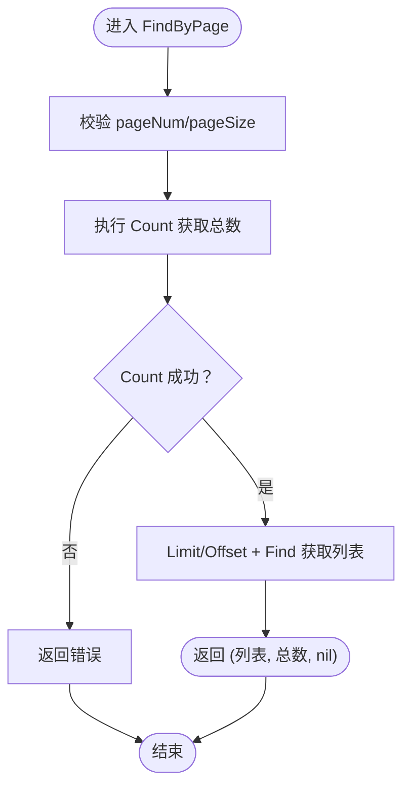
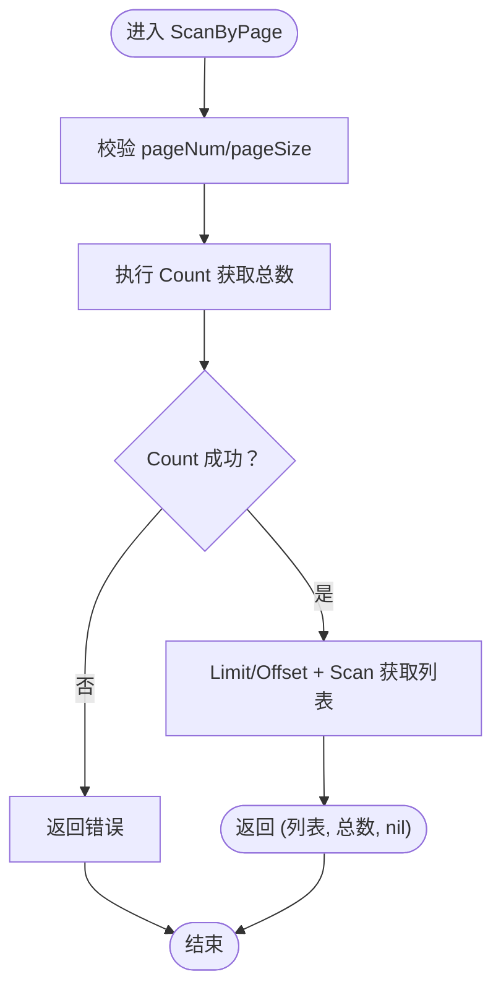
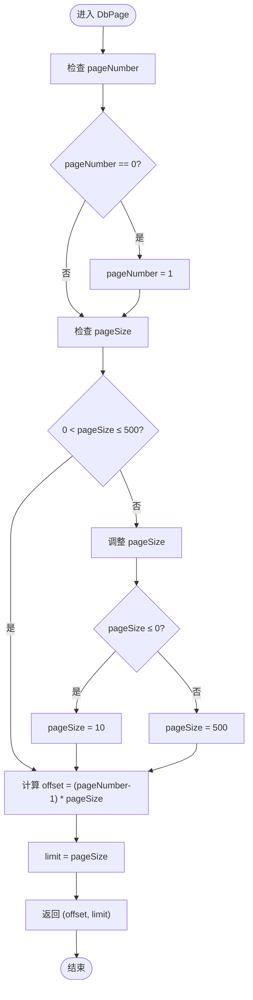
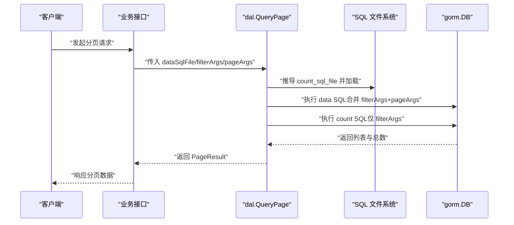
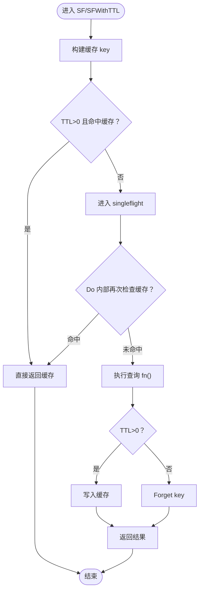
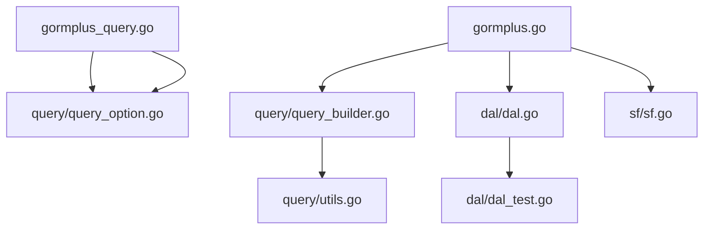

# 分页查询功能

<cite>
**本文档引用的文件**
- [gormplus.go](file://gormplus.go)
- [query_builder.go](file://query/query_builder.go)
- [utils.go](file://query/utils.go)
- [query_option.go](file://query/query_option.go)
- [gormplus_query.go](file://gormplus_query.go)
- [dal.go](file://dal/dal.go)
- [dal_test.go](file://dal/dal_test.go)
- [sf.go](file://sf/sf.go)
</cite>

## 更新摘要
**变更内容**
- 新增 DbPage 分页计算工具函数，提供标准化的分页逻辑
- DbPage 函数实现页面号默认1，最大500，最小10的分页参数规范化
- 在 gormplus_query.go 和 query/query_option.go 中提供统一的分页计算入口

## 目录
1. [简介](#简介)
2. [项目结构](#项目结构)
3. [核心组件](#核心组件)
4. [架构概览](#架构概览)
5. [详细组件分析](#详细组件分析)
6. [依赖分析](#依赖分析)
7. [性能考虑](#性能考虑)
8. [故障排查指南](#故障排查指南)
9. [结论](#结论)
10. [附录](#附录)

## 简介
本文件系统性阐述 GORM Plus 中的分页查询能力，重点围绕两个泛型分页函数：FindByPage 与 ScanByPage，以及新增的 DbPage 分页计算工具函数。我们将解释其设计原理、使用场景差异、错误处理策略、性能优化建议以及最佳实践，帮助开发者在不同业务场景下正确选择与高效使用。

## 项目结构
分页查询功能主要分布在以下模块：
- query/query_builder.go：提供原生 gorm 链式条件构造器与泛型分页函数 FindByPage、ScanByPage
- query/query_option.go：提供 DbPage 分页计算工具函数，实现标准化的分页参数处理
- gormplus_query.go：对外暴露 DbPage 的便捷入口，便于直接 import 使用
- gormplus.go：对外暴露 FindByPage、ScanByPage 的便捷入口，便于直接 import 使用
- query/utils.go：提供通用工具函数（如 isZeroVal）
- dal/dal.go：提供基于 SQL 文件化的分页查询（SQL 文件化方案）
- dal/dal_test.go：包含分页查询的测试用例，验证行为与边界条件
- sf/sf.go：提供 SingleFlight + 可插拔缓存能力，可用于分页查询的并发保护与缓存

```mermaid
graph TB
subgraph "查询层"
QB["query_builder.go<br/>原生 gorm 链式条件 + 泛型分页"]
OPT["query_option.go<br/>DbPage 分页计算工具函数"]
UTIL["utils.go<br/>工具函数"]
END
subgraph "入口层"
GP["gormplus.go<br/>对外便捷入口"]
GQP["gormplus_query.go<br/>DbPage 便捷入口"]
END
subgraph "SQL 文件化层"
DAL["dal.go<br/>SQL 文件化 + 分页查询"]
TEST["dal_test.go<br/>分页测试用例"]
END
subgraph "缓存层"
SF["sf.go<br/>SingleFlight + 缓存"]
END
GP --> QB
GQP --> OPT
QB --> UTIL
GP --> DAL
DAL --> TEST
GP --> SF
```

**图表来源**
- [gormplus.go:250-288](file://gormplus.go#L250-L288)
- [query_builder.go:244-306](file://query/query_builder.go#L244-L306)
- [query_option.go:271-284](file://query/query_option.go#L271-L284)
- [gormplus_query.go:88-92](file://gormplus_query.go#L88-L92)
- [utils.go:1-44](file://query/utils.go#L1-L44)
- [dal.go:981-1121](file://dal/dal.go#L981-L1121)
- [dal_test.go:542-632](file://dal/dal_test.go#L542-L632)
- [sf.go:233-349](file://sf/sf.go#L233-L349)

**章节来源**
- [gormplus.go:250-288](file://gormplus.go#L250-L288)
- [query_builder.go:244-306](file://query/query_builder.go#L244-L306)
- [query_option.go:271-284](file://query/query_option.go#L271-L284)
- [gormplus_query.go:88-92](file://gormplus_query.go#L88-L92)
- [dal.go:981-1121](file://dal/dal.go#L981-L1121)

## 核心组件
- FindByPage：面向"直接映射到模型结构体"的简单列表查询，内部 Count 时自动去除 ORDER BY，避免排序对 COUNT 的影响
- ScanByPage：面向"联表查询、自定义 SELECT 字段映射到 VO"的复杂查询，使用 Scan 替代 Find，提升灵活性
- DbPage：标准化分页计算工具函数，提供页面号默认1，最大500，最小10的分页参数规范化处理
- gormplus 包装入口：对外提供 FindByPage、ScanByPage、DbPage 的统一入口，简化调用
- SQL 文件化分页：dal 包提供基于 SQL 文件的分页查询，count SQL 自动推导，适合复杂 SQL 场景
- 缓存与并发保护：sf 包提供 SingleFlight + 可插拔缓存，可对分页查询进行并发合并与缓存加速

**章节来源**
- [gormplus.go:250-288](file://gormplus.go#L250-L288)
- [query_builder.go:244-306](file://query/query_builder.go#L244-L306)
- [query_option.go:271-284](file://query/query_option.go#L271-L284)
- [gormplus_query.go:88-92](file://gormplus_query.go#L88-L92)
- [dal.go:981-1121](file://dal/dal.go#L981-L1121)
- [sf.go:233-349](file://sf/sf.go#L233-L349)

## 架构概览
分页查询在不同场景下的调用路径如下：

```mermaid
sequenceDiagram
participant Client as "客户端"
participant API as "业务接口"
participant GP as "gormplus 入口"
participant QB as "query_builder 分页函数"
participant OPT as "DbPage 分页计算"
participant DB as "gorm.DB"
Client->>API : "发起分页请求"
API->>GP : "调用 FindByPage/ScanByPage/DbPage"
GP->>QB : "委托执行分页查询"
GP->>OPT : "标准化分页参数"
QB->>DB : "Count 获取总数"
QB->>DB : "Limit/Offset + Find/Scan 获取列表"
OPT->>DB : "计算 offset/limit"
DB-->>QB : "返回总数与列表"
DB-->>OPT : "返回标准化的 offset/limit"
QB-->>GP : "返回结果"
OPT-->>GP : "返回分页参数"
GP-->>API : "返回结果"
API-->>Client : "响应分页数据"
```

**图表来源**
- [gormplus.go:250-288](file://gormplus.go#L250-L288)
- [query_builder.go:244-306](file://query/query_builder.go#L244-L306)
- [query_option.go:271-284](file://query/query_option.go#L271-L284)

## 详细组件分析

### FindByPage：简单列表分页
- 设计要点
  - 适用于"结果可直接映射到模型结构体"的简单查询
  - 内部在 Count 时自动去除 ORDER BY，避免排序对 COUNT 的影响
  - 自动处理页码与页大小的边界（小于 1 时重置为默认值）
- 典型使用场景
  - 列表查询：直接 SELECT 模型字段，无需联表
  - 简单筛选：通过 WhereIf/Like 等条件组合
- 错误处理
  - Count 失败直接返回错误
  - Find 失败返回错误
- 性能建议
  - 确保筛选条件有合适索引
  - 避免在 COUNT 中使用昂贵的排序或函数



**图表来源**
- [query_builder.go:257-270](file://query/query_builder.go#L257-L270)

**章节来源**
- [query_builder.go:244-271](file://query/query_builder.go#L244-L271)

### ScanByPage：复杂查询分页
- 设计要点
  - 适用于"联表查询、自定义 SELECT 字段映射到 VO"的复杂场景
  - 使用 Scan 替代 Find，提升字段映射灵活性
  - 与 FindByPage 相同的页码与页大小边界处理
- 典型使用场景
  - 联表查询：LEFT JOIN/INNER JOIN
  - 自定义字段：AS 别名、聚合、计算字段
- 错误处理
  - Count 失败直接返回错误
  - Scan 失败返回错误
- 性能建议
  - 仅 SELECT 必要字段，避免 SELECT *
  - 联表查询时确保关联字段有索引
  - 控制 JOIN 数量与笛卡尔积风险



**图表来源**
- [query_builder.go:292-305](file://query/query_builder.go#L292-L305)

**章节来源**
- [query_builder.go:272-306](file://query/query_builder.go#L272-L306)

### DbPage：标准化分页计算工具函数
- 设计要点
  - 提供标准化的分页参数处理，确保分页逻辑的一致性
  - 页面号默认值：当 pageNumber 为 0 时，默认为 1
  - 页大小限制：最大 500，最小 10，超出范围自动调整
  - 返回 offset 和 limit 两个参数，用于数据库查询
- 典型使用场景
  - 直接使用 gorm.DB 进行分页查询时的参数计算
  - 与其他分页方案配合使用，确保参数规范统一
- 错误处理
  - 输入参数为负数或零时，自动调整为默认值
  - 超出范围的页大小自动截断到允许范围内
- 性能建议
  - 优先使用 DbPage 计算分页参数，避免手动计算导致的不一致
  - 结合数据库索引优化，避免大 offset 导致的性能问题



**图表来源**
- [query_option.go:272-283](file://query/query_option.go#L272-L283)

**章节来源**
- [query_option.go:271-284](file://query/query_option.go#L271-L284)
- [gormplus_query.go:88-92](file://gormplus_query.go#L88-L92)

### gormplus 便捷入口
- FindByPage/ScanByPage 直接委托 query 包实现，保持 API 一致性
- DbPage 提供便捷入口，简化分页参数计算
- 适合在业务层直接 import gormplus 使用，无需关心底层实现细节

**章节来源**
- [gormplus.go:250-288](file://gormplus.go#L250-L288)
- [gormplus_query.go:88-92](file://gormplus_query.go#L88-L92)

### SQL 文件化分页（dal 包）
- 设计要点
  - 数据 SQL 与 count SQL 文件分离，count SQL 由数据 SQL 文件名自动推导（前缀加 count_）
  - 支持位置参数与命名参数两种分页查询
  - 提供 PageResult[T] 统一分页结果结构
- 使用场景
  - 复杂 SQL、存储过程、视图等场景
  - SQL 文件化管理，便于维护与版本控制
- 错误处理
  - SQL 加载失败、执行失败均返回错误
  - count SQL 与 data SQL 参数分离，避免 limit/offset 干扰 count



**图表来源**
- [dal.go:1022-1051](file://dal/dal.go#L1022-L1051)
- [dal.go:1091-1114](file://dal/dal.go#L1091-L1114)

**章节来源**
- [dal.go:981-1121](file://dal/dal.go#L981-L1121)
- [dal_test.go:542-632](file://dal/dal_test.go#L542-L632)

### 缓存与并发保护（sf 包）
- 设计要点
  - 提供 SF/SFWithTTL/SFNoCache 三种模式，满足不同实时性需求
  - 支持可插拔缓存（默认内存缓存，可替换为 Redis 等）
  - SFInvalidate 支持写后主动失效，保证数据一致性
- 适用场景
  - 列表/统计类查询（允许短暂延迟）：使用 SF/SFWithTTL
  - 详情/用户实时数据：使用 SFNoCache
  - 写操作后：调用 SFInvalidate 清理缓存
- 性能建议
  - TTL 选择：列表/统计 3s~30s；配置/字典 1min~5min；详情 0 或 SFNoCache
  - 参数去重：args 中键值对自动排序，避免重复缓存



**图表来源**
- [sf.go:302-349](file://sf/sf.go#L302-L349)

**章节来源**
- [sf.go:233-349](file://sf/sf.go#L233-L349)

## 依赖分析
- FindByPage/ScanByPage 依赖 gorm.DB 的 Count、Find、Scan、Limit、Offset 能力
- DbPage 依赖 query/query_option.go 中的标准分页计算逻辑
- gormplus 入口层仅做委托，降低耦合
- SQL 文件化分页依赖 SQL 文件系统与参数合并策略
- 缓存层与分页查询解耦，可按需启用



**图表来源**
- [gormplus.go:250-288](file://gormplus.go#L250-L288)
- [query_builder.go:244-306](file://query/query_builder.go#L244-L306)
- [query_option.go:271-284](file://query/query_option.go#L271-L284)
- [gormplus_query.go:88-92](file://gormplus_query.go#L88-L92)
- [utils.go:1-44](file://query/utils.go#L1-L44)
- [dal.go:981-1121](file://dal/dal.go#L981-L1121)
- [sf.go:233-349](file://sf/sf.go#L233-L349)

**章节来源**
- [gormplus.go:250-288](file://gormplus.go#L250-L288)
- [query_builder.go:244-306](file://query/query_builder.go#L244-L306)
- [query_option.go:271-284](file://query/query_option.go#L271-L284)
- [gormplus_query.go:88-92](file://gormplus_query.go#L88-L92)
- [dal.go:981-1121](file://dal/dal.go#L981-L1121)
- [sf.go:233-349](file://sf/sf.go#L233-L349)

## 性能考虑
- 索引优化
  - 为分页查询的筛选条件建立合适索引，减少 COUNT 与扫描成本
  - 联表查询时确保关联字段有索引
- SQL 优化
  - FindByPage：避免在 COUNT 中使用排序或函数
  - ScanByPage：仅 SELECT 必要字段，避免 SELECT *
- 分页策略
  - 大数据量场景建议使用"游标分页"或"基于索引的高效分页"，避免深度偏移
  - 使用 DbPage 统一分页参数，确保分页逻辑的一致性
- 缓存策略
  - 列表/统计类查询使用 SF/SFWithTTL，合理设置 TTL
  - 详情/实时数据使用 SFNoCache 或 TTL=0
  - 写操作后及时调用 SFInvalidate 清理缓存

## 故障排查指南
- 常见问题
  - 分页总数异常：确认 COUNT SQL 与数据 SQL 的筛选条件一致，避免 ORDER BY 干扰
  - 联表查询字段映射失败：检查 SELECT 字段与 VO 结构体标签是否匹配
  - 分页参数异常：检查 DbPage 计算结果，确认页面号和页大小是否在允许范围内
  - 缓存命中异常：检查 args 参数是否一致（键值相同、顺序无关），TTL 设置是否合理
- 调试建议
  - 使用 dal 包的 WithDebug 打印 SQL 与参数
  - 通过 dal_test.go 中的测试用例对照验证行为
  - 对比 FindByPage 与 ScanByPage 的使用场景，确认是否误用
  - 验证 DbPage 的分页参数计算是否符合预期

**章节来源**
- [dal.go:529-554](file://dal/dal.go#L529-L554)
- [dal_test.go:542-632](file://dal/dal_test.go#L542-L632)

## 结论
- FindByPage 适合"直接映射到模型结构体"的简单查询，内部自动处理 COUNT 的 ORDER BY 去除与页码页大小边界
- ScanByPage 适合"联表查询、自定义字段映射到 VO"的复杂场景，使用 Scan 替代 Find 提升灵活性
- DbPage 提供标准化的分页计算工具，确保分页参数的一致性和安全性（页面号默认1，最大500，最小10）
- gormplus 提供统一入口，简化调用；dal 提供 SQL 文件化分页，适合复杂 SQL；sf 提供缓存与并发保护
- 实战中应结合业务场景选择合适的分页方案，并关注索引、SQL 与缓存策略，确保性能与一致性

## 附录

### 使用场景对比与选择建议
- 选择 FindByPage 的场景
  - 简单列表查询，结果可直接映射到模型结构体
  - 不涉及联表或复杂字段映射
- 选择 ScanByPage 的场景
  - 联表查询、自定义 SELECT 字段映射到 VO
  - 需要 AS 别名、聚合、计算字段等
- 选择 DbPage 的场景
  - 需要标准化分页参数计算的场景
  - 直接使用 gorm.DB 进行分页查询
  - 需要确保分页参数在允许范围内的场景
- 选择 SQL 文件化分页的场景
  - 复杂 SQL、存储过程、视图
  - 需要 SQL 文件化管理与版本控制

### DbPage 分页参数规范
- 页面号（pageNumber）：默认值 1，当输入为 0 时自动调整为 1
- 页大小（pageSize）：最小值 10，最大值 500，超出范围自动截断
- 返回值：offset 和 limit 两个整数参数，用于数据库查询的 LIMIT 和 OFFSET

**章节来源**
- [query_builder.go:244-306](file://query/query_builder.go#L244-L306)
- [query_option.go:271-284](file://query/query_option.go#L271-L284)
- [gormplus_query.go:88-92](file://gormplus_query.go#L88-L92)
- [dal.go:981-1121](file://dal/dal.go#L981-L1121)